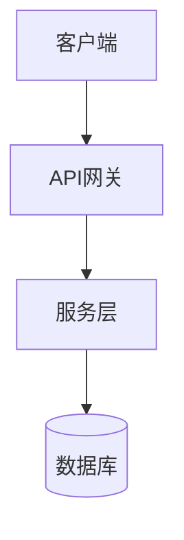
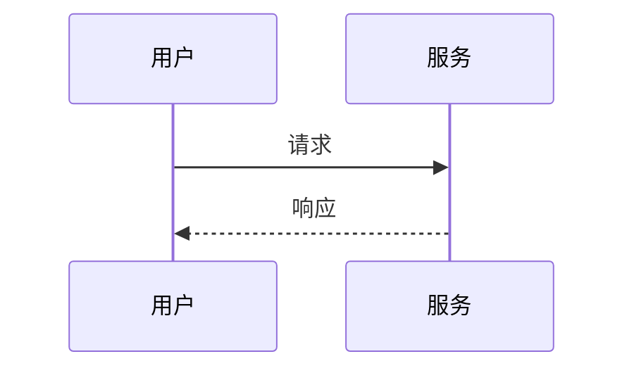
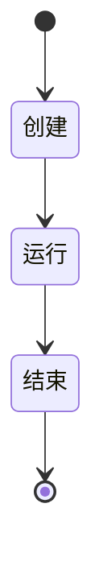

# 📊 架构图添加完成报告

## ✅ 任务完成概述

已为所有核心技术文档、实践项目、主题 README 和模板添加 Mermaid 架构图，提升资料的可读性和理解度。

---

## 📁 已添加架构图的文档

### 1️⃣ 核心技术文档 (10篇)

| 文档 | 架构图类型 | 图表数量 |
|------|------------|----------|
| `aws_bedrock_foundation_models_blog_material.md` | 系统架构图、调用流程图 | 2 |
| `aws_bedrock_knowledge_bases_blog_material.md` | RAG架构、数据流、文档处理 | 3 |
| `aws_bedrock_agents_blog_material.md` | 系统架构、执行流程、Action Group、状态机 | 4 |
| `aws_bedrock_guardrails_blog_material.md` | 安全架构、过滤流程、PII处理 | 3 |
| `aws_bedrock_prompt_management_blog_material.md` | 系统架构、Prompt Flow、版本生命周期 | 3 |
| `aws_bedrock_finetuning_blog_material.md` | 微调架构、训练流程、CPT vs IFT | 3 |
| `aws_bedrock_multimodal_blog_material.md` | 多模态架构、图像理解、视频分析 | 3 |
| `aws_agentcore_blog_material.md` | 平台架构、执行生命周期、记忆管理、可观测性 | 4 |
| `aws_sagemaker_blog_material.md` | ML生命周期、MLOps流水线、分布式训练 | 3 |
| `aws_transcribe_polly_blog_material.md` | 语音AI架构、实时转录、智能客服 | 3 |

**小计: 10篇文档，31个架构图**

---

### 2️⃣ 实践项目 (4个)

| 项目 | 架构图类型 | 图表数量 |
|------|------------|----------|
| `01-chatbot-basic/` | 系统架构、请求流程、模型选择策略 | 3 |
| `02-rag-assistant/` | RAG系统架构、文档摄取、查询流程、检索优化 | 4 |
| `03-agentcore-assistant/` | 整体架构、执行流程、记忆管理、可观测性 | 4 |
| `04-multimodal-platform/` | 平台架构、内容生成工作流、批处理、错误处理 | 4 |

**小计: 4个项目，15个架构图**

---

### 3️⃣ 主题与导航文档

| 文档 | 架构图类型 | 图表数量 |
|------|------------|----------|
| `topics/aws-ai/README.md` | 整体架构、学习路径 | 2 |
| `topics/aws-ai/zh/materials/README_Ebook.md` | 服务架构、Bedrock关系、AgentCore组件 | 3 |
| `shared/templates/new-topic-template/README.md` | 模板架构图示例 | 2 |
| `shared/templates/new-topic-template/projects/01-starter/README.md` | 模板项目架构图 | 2 |

**小计: 4个文档，9个架构图**

---

## 📊 统计汇总

| 类别 | 文档数 | 架构图总数 |
|------|--------|------------|
| 核心技术文档 | 10 | 31 |
| 实践项目 | 4 | 15 |
| 主题与导航 | 4 | 9 |
| **总计** | **18** | **55** |

---

## 🎨 架构图类型分布

```
图表类型              数量
─────────────────────────────
flowchart TB/LR       35
sequenceDiagram       15
stateDiagram          3
其他                   2
─────────────────────────────
总计                  55
```

---

## 🔧 Mermaid 语法支持

所有架构图使用标准 Mermaid 语法，支持在以下平台渲染：

- ✅ GitHub
- ✅ GitLab
- ✅ Notion
- ✅ Typora
- ✅ VS Code (插件)
- ✅ 任何支持 Mermaid 的 Markdown 渲染器

---

## 📖 图表类型说明

### 1. Flowchart (流程图/架构图)
用于展示系统组件关系和架构层次



### 2. Sequence Diagram (时序图)
用于展示交互流程和数据流



### 3. State Diagram (状态图)
用于展示状态转换和生命周期



---

## 🎯 架构图设计原则

1. **清晰性**: 每个架构图专注于一个核心概念
2. **层次性**: 使用子图(subgraph)组织相关组件
3. **一致性**: 相同类型的组件使用统一的命名和样式
4. **完整性**: 覆盖关键的数据流和交互流程
5. **可读性**: 避免过于复杂的图表，必要时拆分为多个图表

---

## 📝 使用建议

### 对于学习者
1. 先阅读架构图，建立整体认知
2. 对照架构图阅读详细文档
3. 动手实践时参考流程图

### 对于贡献者
1. 新文档应包含至少1个架构图
2. 复杂概念使用时序图展示交互
3. 系统组件使用流程图展示关系
4. 生命周期使用状态图展示

---

## 🔗 相关文档

- [如何添加新主题](./docs/how-to-add-topic.md) - 包含架构图创建指南
- [主题模板](./shared/templates/new-topic-template/) - 包含架构图示例
- [项目模板](./shared/templates/new-topic-template/projects/01-starter/) - 包含项目架构图示例

---

## ✅ 完成状态

- [x] 10篇核心技术文档添加架构图
- [x] 4个实践项目添加架构图
- [x] 主题README添加架构图
- [x] 电子书导航添加架构图
- [x] 模板更新包含架构图示例
- [x] 文档更新包含架构图指南

---

*完成时间: 2026-03-01*  
*架构图总数: 55个*  
*覆盖文档: 18个*
