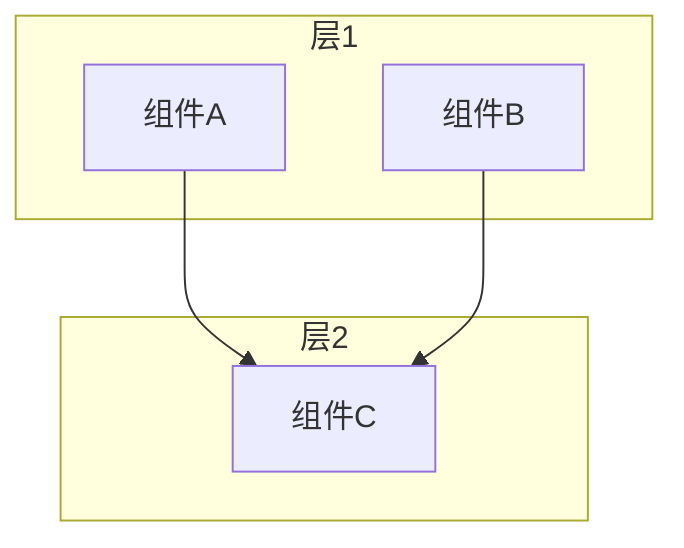
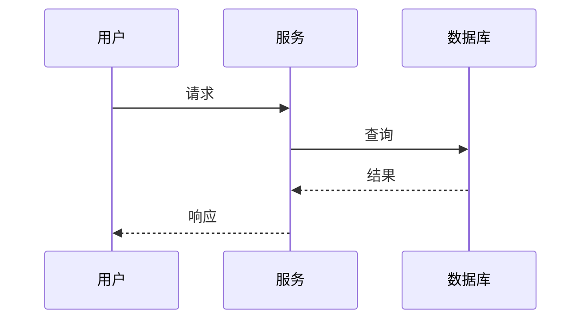

# 如何添加新主题

> 本指南介绍如何为 E-Book 资源库添加新的技术主题

---

## 📋 添加流程

### 步骤 1: 准备主题内容

确定要添加的技术主题，例如：
- Azure AI (微软 Azure 人工智能)
- GCP AI (谷歌云人工智能)
- OpenAI (OpenAI API 和工具)
- LLM Frameworks (LangChain, LlamaIndex)

### 步骤 2: 复制模板

```bash
# 进入主题目录
cd topics/

# 复制模板创建新主题
cp -r ../shared/templates/new-topic-template/ your-topic-name/

# 例如：创建 Azure AI 主题
cp -r ../shared/templates/new-topic-template/ azure-ai/
```

### 步骤 3: 填充内容

按照模板结构填充您的内容。

#### 添加架构图

所有技术文档都应包含 Mermaid 架构图，例如：

```markdown
## 架构图

### 系统架构



### 数据流


```

支持的图表类型：
- `flowchart` - 流程图/架构图
- `sequenceDiagram` - 时序图
- `stateDiagram` - 状态图
- `classDiagram` - 类图
- `erDiagram` - 实体关系图

### 步骤 4: 提交审核

1. 在本地测试所有链接和代码
2. 提交 Pull Request
3. 等待审核合并

---

## ✅ 质量检查清单

- [ ] 技术信息准确无误
- [ ] 代码示例可运行
- [ ] 文档结构清晰
- [ ] 至少一种语言完整
- [ ] README.md 完整
- [ ] 更新主索引

---

**🎉 期待您的贡献！**
