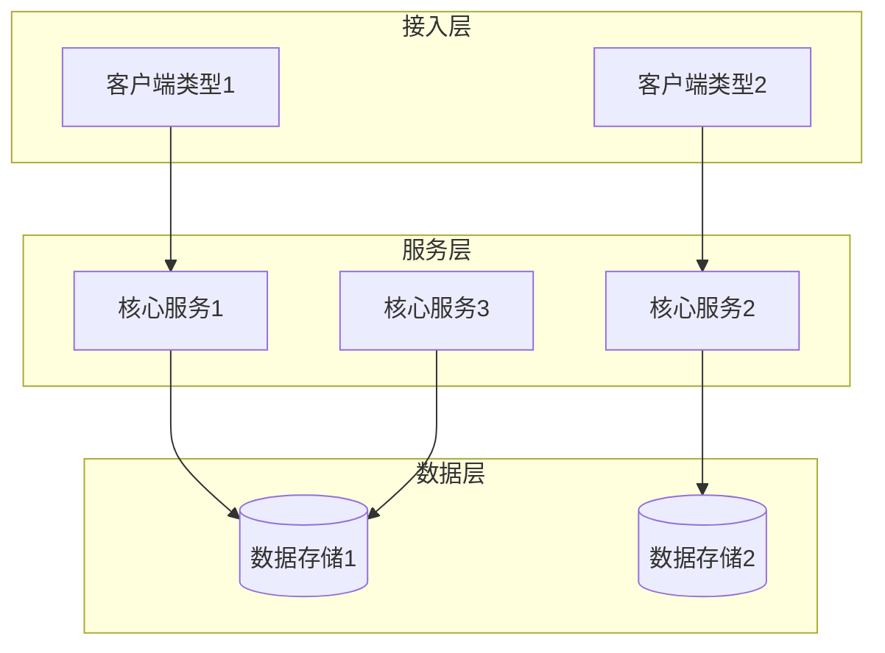
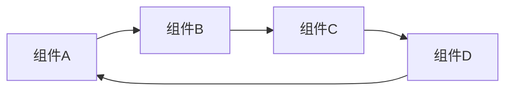

# 新主题名称

> 简短描述（一句话概括本主题内容）

---

## 🎯 主题介绍

详细介绍本主题涵盖的技术内容：

- **核心技术 1** - 简要说明
- **核心技术 2** - 简要说明
- **核心技术 3** - 简要说明

---

## 🏗️ 架构概览



### 核心组件关系



---

## 📚 多语言资源

| 语言 | 目录 | 状态 | 备注 |
|------|------|------|------|
| 🇨🇳 中文 | [./zh/](./zh/) | 📝 计划中 | 待翻译 |
| 🇺🇸 English | [./en/](./en/) | 📝 计划中 | 待翻译 |
| 🇯🇵 日本語 | [./ja/](./ja/) | 📝 计划中 | 待翻译 |

---

## 💻 实践项目

| 项目 | 难度 | 状态 | 目录 |
|------|------|------|------|
| 项目 1 | ⭐ 入门 | 📝 计划中 | [./projects/01-starter/](./projects/01-starter/) |
| 项目 2 | ⭐⭐ 进阶 | 📝 计划中 | [./projects/02-intermediate/](./projects/02-intermediate/) |
| 项目 3 | ⭐⭐⭐ 高级 | 📝 计划中 | [./projects/03-advanced/](./projects/03-advanced/) |

---

## 🚀 快速开始

### 环境准备

```bash
# 安装依赖
# 添加安装命令

# 配置认证
# 添加配置命令
```

### 第一个示例

```python
# 添加 Hello World 示例代码
print("Hello, Your Topic!")
```

---

## 📖 内容规划

### 电子书 (ebooks/)

- [ ] 导航索引 (README.md)
- [ ] 主白皮书 (Main_Ebook.md)
- [ ] 速查手册 (Quick_Reference.md)
- [ ] 学习路线图 (Learning_Roadmap.md)

### 技术文档 (materials/)

- [ ] 核心概念介绍
- [ ] 基础使用指南
- [ ] 高级功能详解
- [ ] 最佳实践
- [ ] 故障排除

### 实践项目 (projects/)

- [ ] 入门项目
- [ ] 进阶项目
- [ ] 综合项目

---

## 🆘 获取帮助

- 官方文档: [链接](#)
- 社区论坛: [链接](#)
- GitHub Issues: [链接](#)

---

**贡献**: 欢迎提交 Issue 和 PR  
**许可**: MIT License
