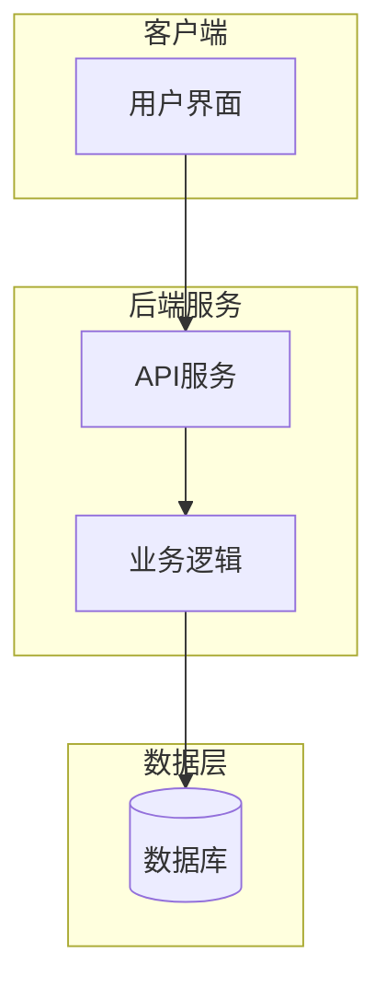
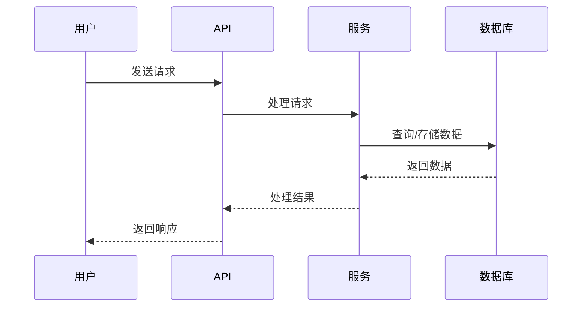

# Project 01: Starter Project

> 入门级别的实践项目

---

## 🎯 项目目标

- 掌握基础概念
- 完成第一个 Hello World
- 熟悉开发环境

---

## 🏗️ 架构图

### 系统架构



### 数据流



---

## 📁 项目结构

```
01-starter/
├── src/              # 源代码
├── infra/            # 基础设施
├── docs/             # 文档
└── README.md         # 本文件
```

---

## 🚀 快速开始

### 1. 环境准备

```bash
# 安装依赖
```

### 2. 运行项目

```bash
# 启动项目
```

### 3. 验证结果

---

## 📚 学习要点

1. 要点 1
2. 要点 2
3. 要点 3

---

**难度**: ⭐ 入门  
**预计时间**: 1-2 小时  
**成本**: 免费
