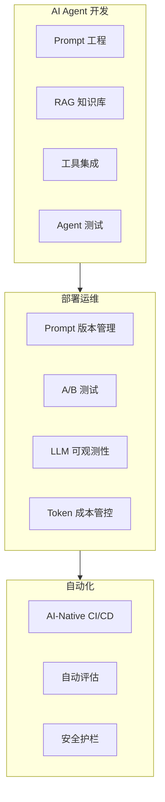

# AI Agent DevTools 主题

> AI Agent 开发的完整 DevOps 工具链 - 从 Prompt 到生产部署

---

## 主题定位

本主题专注于 **AI Agent 开发的工程化实践**，整合 AWS AI 服务（Bedrock、Lex）与 AWS DevTools，构建企业级 AI Agent 的 CI/CD、测试、监控完整链路。

与现有主题的关联：
- `ai-agent-enterprise` - AI Agent 架构设计
- `devtools` / `aws-devtools` - 通用 DevOps 工具
- `aws-ai` - AWS AI 服务基础

---

## 核心挑战



---

## 目录结构

```
ai-agent-devtools/
├── zh/
│   ├── ebooks/
│   │   └── AI_Agent_DevOps_Mastery.md
│   ├── materials/
│   │   ├── Bedrock_Agent_CI_CD.md
│   │   ├── LLM_Ops_Pipeline.md
│   │   ├── Agent_Testing_Framework.md
│   │   ├── Prompt_Version_Management.md
│   │   └── LLM_Observability.md
│   └── projects/
│       ├── 01-bedrock-agent-pipeline/
│       ├── 02-llm-evaluation-automation/
│       └── 03-agent-monitoring-platform/
├── en/
└── ja/
```

---

## 核心能力栈

| 层级 | AWS 服务 | 工具/框架 |
|------|---------|----------|
| **Agent 运行时** | Bedrock Agents, Lex | LangChain, LlamaIndex |
| **Prompt 管理** | - | PromptFlow, Weights & Biases |
| **CI/CD** | CodePipeline, CodeBuild | SAM, CDK |
| **测试评估** | - | RAGAS, TruLens, LLM-as-a-Judge |
| **可观测性** | CloudWatch, X-Ray | LangSmith, PromptLayer |
| **成本管控** | Cost Explorer, Budgets | Custom dashboards |

---

## Hero 认证价值

### 独特性
- **AI + DevTools 交叉领域**：市场上极少有系统性的 AI Agent DevOps 内容
- **AWS-first**：原生集成 Bedrock、CodePipeline
- **生产级经验**：包含真实故障案例和解决方案

### 与现有 Hero 的差异化
| 现有 Hero | 本主题差异化 |
|-----------|-------------|
| DevTools Hero | + AI Agent 特殊挑战 |
| AI/ML Hero | + DevOps 工程化 |
| Serverless Hero | + LLM 工作流编排 |

---

## 学习路径

### Phase 1: Agent 开发基础
- Bedrock Agent 本地开发环境
- Prompt 工程与版本控制
- RAG 知识库 CI/CD

### Phase 2: DevOps 集成
- Agent CI/CD 流水线
- 自动化测试策略
- A/B 测试框架

### Phase 3: 生产运维
- LLM 可观测性
- Token 成本优化
- 安全护栏自动化

---

*Part of AWS DevTools Hero Learning Path*
*Part of AI Agent Enterprise Architecture*
