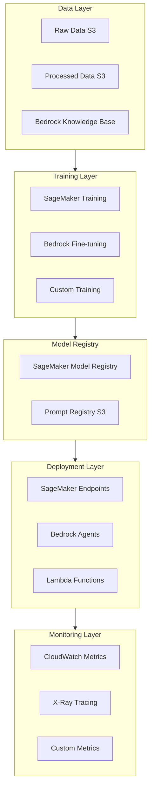

# LLM Ops Pipeline - AI Model Operations Automation

> Full Lifecycle Management of LLMs from Training to Deployment

---

## Table of Contents

1. [LLM Ops Overview](#1-llm-ops-overview)
2. [Model Version Management](#2-model-version-management)
3. [Automated Training Pipeline](#3-automated-training-pipeline)
4. [Evaluation and Validation](#4-evaluation-and-validation)
5. [Production Deployment Strategies](#5-production-deployment-strategies)
6. [Monitoring and Observability](#6-monitoring-and-observability)

---

## 1. LLM Ops Overview

### 1.1 LLM Ops vs MLOps

| Dimension | Traditional MLOps | LLM Ops |
|-----------|-------------------|---------|
| **Model Size** | MB-GB level | GB-TB level |
| **Training Cost** | Controllable | Expensive (requires optimization) |
| **Evaluation Method** | Clear metrics (accuracy, etc.) | Subjective (human evaluation) |
| **Version Management** | Model files + Code | Prompt + RAG + Fine-tuned Models |
| **Deployment Mode** | Real-time inference | Batch + Streaming |
| **Monitoring Focus** | Performance metrics | Token cost + Output quality |

### 1.2 AWS LLM Ops Architecture



---

## 2. Model Version Management

### 2.1 SageMaker Model Registry

```python
# src/model_registry.py
import boto3
import json
from datetime import datetime
from typing import Dict, List, Optional

class LLMModelRegistry:
    """LLM Model Version Management"""
    
    def __init__(self, registry_name: str = "llm-registry"):
        self.sm_client = boto3.client('sagemaker')
        self.registry_name = registry_name
        self._ensure_registry_exists()
    
    def _ensure_registry_exists(self):
        """Ensure model package group exists"""
        try:
            self.sm_client.describe_model_package_group(
                ModelPackageGroupName=self.registry_name
            )
        except self.sm_client.exceptions.ResourceNotFound:
            self.sm_client.create_model_package_group(
                ModelPackageGroupName=self.registry_name,
                ModelPackageGroupDescription="LLM Model Registry"
            )
    
    def register_model(
        self,
        model_name: str,
        model_uri: str,
        model_type: str,  # 'fine-tuned', 'rag', 'base'
        metrics: Dict[str, float],
        baseline_constraints: Optional[str] = None,
        approval_status: str = "PendingManualApproval"
    ) -> str:
        """Register a new model version"""
        
        model_package = self.sm_client.create_model_package(
            ModelPackageGroupName=self.registry_name,
            ModelPackageDescription=f"{model_type} model: {model_name}",
            ModelApprovalStatus=approval_status,
            InferenceSpecification={
                "Containers": [{
                    "Image": "763104351884.dkr.ecr.us-east-1.amazonaws.com/huggingface-pytorch-inference:2.0.0-transformers4.28.1-gpu-py310-cu118-ubuntu20.04",
                    "ModelDataUrl": model_uri,
                    "Environment": {
                        "SAGEMAKER_MODEL_SERVER_TIMEOUT": "3600",
                        "SAGEMAKER_PROGRAM": "inference.py"
                    }
                }],
                "SupportedTransformInstanceTypes": ["ml.g5.xlarge", "ml.g5.2xlarge"],
                "SupportedContentTypes": ["application/json"],
                "SupportedResponseMIMETypes": ["application/json"]
            },
            ModelMetrics={
                "ModelQuality": {
                    "Statistics": {
                        "ContentType": "application/json",
                        "S3Uri": f"s3://{metrics_bucket}/metrics/{model_name}.json"
                    },
                    "Constraints": {
                        "ContentType": "application/json",
                        "S3Uri": baseline_constraints
                    } if baseline_constraints else None
                }
            },
            CustomerMetadataProperties={
                "model_type": model_type,
                "training_date": datetime.utcnow().isoformat(),
                "perplexity": str(metrics.get('perplexity', 'N/A')),
                "bleu_score": str(metrics.get('bleu', 'N/A')),
                "rouge_l": str(metrics.get('rouge_l', 'N/A')),
                "human_eval_score": str(metrics.get('human_eval', 'N/A'))
            },
            Tags=[
                {"Key": "ModelType", "Value": model_type},
                {"Key": "RegisteredBy", "Value": "llm-ops-pipeline"}
            ]
        )
        
        return model_package['ModelPackageArn']
    
    def get_approved_models(self, model_type: Optional[str] = None) -> List[Dict]:
        """Get approved models"""
        
        response = self.sm_client.list_model_packages(
            ModelPackageGroupName=self.registry_name,
            ModelApprovalStatus='Approved',
            SortBy='CreationTime',
            SortOrder='Descending'
        )
        
        models = []
        for pkg in response['ModelPackageSummaryList']:
            if model_type:
                # Get detailed info to check type
                detail = self.sm_client.describe_model_package(
                    ModelPackageName=pkg['ModelPackageArn']
                )
                if detail.get('CustomerMetadataProperties', {}).get('model_type') != model_type:
                    continue
            
            models.append({
                'arn': pkg['ModelPackageArn'],
                'version': pkg['ModelPackageVersion'],
                'created': pkg['CreationTime'],
                'status': pkg['ModelApprovalStatus']
            })
        
        return models
    
    def approve_model(self, model_package_arn: str, approval_description: str = ""):
        """Approve model"""
        self.sm_client.update_model_package(
            ModelPackageArn=model_package_arn,
            ModelApprovalStatus='Approved',
            ApprovalDescription=approval_description
        )
```

### 2.2 Prompt Version Management Integration

```python
# src/prompt_model_versioning.py
import hashlib
from dataclasses import dataclass
from typing import Dict, List, Optional
import boto3

@dataclass
class LLMVersion:
    """Complete LLM Version Definition"""
    version_id: str
    base_model: str  # e.g., "anthropic.claude-3-sonnet"
    fine_tuned_model_arn: Optional[str]
    prompt_version: str
    rag_knowledge_base_id: Optional[str]
    rag_embedding_model: Optional[str]
    
    # Metadata
    created_at: str
    created_by: str
    evaluation_score: float
    
    def to_dict(self) -> Dict:
        return {
            'version_id': self.version_id,
            'base_model': self.base_model,
            'fine_tuned_model_arn': self.fine_tuned_model_arn,
            'prompt_version': self.prompt_version,
            'rag_knowledge_base_id': self.rag_knowledge_base_id,
            'rag_embedding_model': self.rag_embedding_model,
            'created_at': self.created_at,
            'created_by': self.created_by,
            'evaluation_score': self.evaluation_score
        }
    
    @classmethod
    def from_dict(cls, data: Dict) -> 'LLMVersion':
        return cls(**data)
    
    def compute_hash(self) -> str:
        """Compute version hash"""
        content = f"{self.base_model}:{self.fine_tuned_model_arn}:{self.prompt_version}:{self.rag_knowledge_base_id}"
        return hashlib.sha256(content.encode()).hexdigest()[:16]


class LLMVersionManager:
    """LLM Version Manager"""
    
    def __init__(self, table_name: str = "llm-versions"):
        self.dynamodb = boto3.resource('dynamodb')
        self.table = self.dynamodb.Table(table_name)
    
    def register_version(self, version: LLMVersion):
        """Register new version"""
        self.table.put_item(Item={
            'PK': f"VERSION#{version.version_id}",
            'SK': 'METADATA',
            **version.to_dict(),
            'version_hash': version.compute_hash()
        })
    
    def get_version(self, version_id: str) -> Optional[LLMVersion]:
        """Get specific version"""
        response = self.table.get_item(
            Key={'PK': f"VERSION#{version_id}", 'SK': 'METADATA'}
        )
        
        if 'Item' in response:
            return LLMVersion.from_dict(response['Item'])
        return None
    
    def list_versions(self, base_model: Optional[str] = None) -> List[LLMVersion]:
        """List all versions"""
        response = self.table.scan(
            FilterExpression='begins_with(PK, :pk)',
            ExpressionAttributeValues={':pk': 'VERSION#'}
        )
        
        versions = []
        for item in response.get('Items', []):
            version = LLMVersion.from_dict(item)
            if base_model is None or version.base_model == base_model:
                versions.append(version)
        
        return sorted(versions, key=lambda v: v.created_at, reverse=True)
    
    def compare_versions(self, v1_id: str, v2_id: str) -> Dict:
        """Compare two versions"""
        v1 = self.get_version(v1_id)
        v2 = self.get_version(v2_id)
        
        if not v1 or not v2:
            raise ValueError("Version not found")
        
        changes = []
        
        if v1.base_model != v2.base_model:
            changes.append(f"Base model changed: {v1.base_model} -> {v2.base_model}")
        
        if v1.prompt_version != v2.prompt_version:
            changes.append(f"Prompt version changed: {v1.prompt_version} -> {v2.prompt_version}")
        
        if v1.rag_knowledge_base_id != v2.rag_knowledge_base_id:
            changes.append(f"RAG knowledge base changed: {v1.rag_knowledge_base_id} -> {v2.rag_knowledge_base_id}")
        
        return {
            'v1': v1_id,
            'v2': v2_id,
            'changes': changes,
            'score_improvement': v2.evaluation_score - v1.evaluation_score
        }
```

---

## 3. Automated Training Pipeline

### 3.1 Bedrock Fine-tuning Pipeline

```python
# src/training_pipeline.py
import boto3
import json
from typing import Dict, Optional
import time

class BedrockFineTuningPipeline:
    """Bedrock Fine-tuning Automation Pipeline"""
    
    def __init__(self):
        self.bedrock = boto3.client('bedrock')
        self.bedrock_runtime = boto3.client('bedrock-runtime')
        self.s3 = boto3.client('s3')
    
    def create_training_job(
        self,
        model_name: str,
        base_model_id: str,
        training_data_s3_uri: str,
        validation_data_s3_uri: Optional[str] = None,
        hyperparameters: Optional[Dict] = None
    ) -> str:
        """Create fine-tuning job"""
        
        default_hyperparameters = {
            'epochCount': '3',
            'batchSize': '1',
            'learningRate': '0.0001',
            'learningRateWarmupSteps': '10'
        }
        
        if hyperparameters:
            default_hyperparameters.update(hyperparameters)
        
        response = self.bedrock.create_model_customization_job(
            jobName=f"{model_name}-{int(time.time())}",
            customModelName=model_name,
            roleArn="arn:aws:iam::ACCOUNT:role/BedrockFineTuningRole",
            baseModelIdentifier=base_model_id,
            trainingDataConfig={
                's3Uri': training_data_s3_uri
            },
            validationDataConfig={
                's3Uri': validation_data_s3_uri
            } if validation_data_s3_uri else None,
            outputDataConfig={
                's3Uri': f"s3://llm-training-output/{model_name}/"
            },
            hyperParameters=default_hyperparameters
        )
        
        return response['jobArn']
    
    def wait_for_training(self, job_arn: str, poll_interval: int = 300) -> Dict:
        """Wait for training completion"""
        
        while True:
            response = self.bedrock.get_model_customization_job(
                jobIdentifier=job_arn
            )
            
            status = response['status']
            print(f"Training job status: {status}")
            
            if status in ['Completed', 'Failed', 'Stopped']:
                return response
            
            time.sleep(poll_interval)
    
    def provision_throughput(self, model_arn: str, 
                            model_units: int = 1) -> str:
        """Provision throughput"""
        
        response = self.bedrock.create_provisioned_model_throughput(
            modelUnits=model_units,
            provisionedModelName=f"provisioned-{int(time.time())}",
            modelId=model_arn
        )
        
        return response['provisionedModelArn']


# SageMaker Custom Training (for complex scenarios)
class SageMakerLLMTrainingPipeline:
    """SageMaker Large Model Training Pipeline"""
    
    def __init__(self):
        self.sagemaker = boto3.client('sagemaker')
    
    def create_training_job(
        self,
        job_name: str,
        model_uri: str,
        train_data_s3: str,
        instance_type: str = "ml.p4d.24xlarge",
        instance_count: int = 1
    ) -> str:
        """Create SageMaker training job"""
        
        response = self.sagemaker.create_training_job(
            TrainingJobName=job_name,
            AlgorithmSpecification={
                'TrainingImage': '763104351884.dkr.ecr.us-east-1.amazonaws.com/huggingface-pytorch-training:2.0.0-transformers4.28.1-gpu-py310-cu118-ubuntu20.04',
                'TrainingInputMode': 'File'
            },
            RoleArn="arn:aws:iam::ACCOUNT:role/SageMakerExecutionRole",
            InputDataConfig=[{
                'ChannelName': 'training',
                'DataSource': {
                    'S3DataSource': {
                        'S3DataType': 'S3Prefix',
                        'S3Uri': train_data_s3,
                        'S3DataDistributionType': 'FullyReplicated'
                    }
                }
            }],
            OutputDataConfig={
                'S3OutputPath': f"s3://llm-training-output/{job_name}/"
            },
            ResourceConfig={
                'InstanceType': instance_type,
                'InstanceCount': instance_count,
                'VolumeSizeInGB': 500
            },
            HyperParameters={
                'model_name_or_path': model_uri,
                'do_train': 'true',
                'num_train_epochs': '3',
                'per_device_train_batch_size': '4',
                'learning_rate': '5e-5',
                'fp16': 'true',
                'deepspeed': '/opt/ml/input/data/config/ds_config.json'
            },
            StoppingCondition={
                'MaxRuntimeInSeconds': 86400  # 24 hours
            }
        )
        
        return response['TrainingJobArn']
```

---

## 4. Evaluation and Validation

### 4.1 Automated Evaluation Framework

```python
# src/evaluation_framework.py
import json
import boto3
from typing import Dict, List, Callable
from dataclasses import dataclass
from concurrent.futures import ThreadPoolExecutor

@dataclass
class EvaluationMetric:
    name: str
    scorer: Callable[[str, str], float]
    threshold: float

class LLMEvaluationFramework:
    """LLM Automated Evaluation Framework"""
    
    def __init__(self):
        self.bedrock = boto3.client('bedrock-runtime')
        self.metrics = []
    
    def add_metric(self, metric: EvaluationMetric):
        """Add evaluation metric"""
        self.metrics.append(metric)
    
    def evaluate(self, predictions: List[str], 
                references: List[str]) -> Dict[str, float]:
        """Execute evaluation"""
        
        results = {}
        
        for metric in self.metrics:
            scores = [
                metric.scorer(pred, ref)
                for pred, ref in zip(predictions, references)
            ]
            avg_score = sum(scores) / len(scores)
            
            results[metric.name] = {
                'score': avg_score,
                'passed': avg_score >= metric.threshold,
                'threshold': metric.threshold
            }
        
        return results
    
    def evaluate_with_llm_judge(self, test_cases: List[Dict],
                               model_id: str = "anthropic.claude-3-haiku") -> Dict:
        """Use LLM as judge"""
        
        def judge_single(case: Dict) -> Dict:
            prompt = f"""Evaluate the following AI response:

Query: {case['query']}
Expected: {case['expected']}
Actual: {case['actual']}

Rate on a scale of 1-5 for:
1. Relevance
2. Accuracy
3. Helpfulness

Provide scores and brief reasoning."""
            
            response = self.bedrock.invoke_model(
                modelId=model_id,
                body=json.dumps({
                    "anthropic_version": "bedrock-2023-05-31",
                    "max_tokens": 500,
                    "messages": [{"role": "user", "content": prompt}]
                })
            )
            
            result = json.loads(response['body'].read())
            # Parse scores...
            return {
                'case_id': case['id'],
                'evaluation': result['content'][0]['text']
            }
        
        # Parallel evaluation
        with ThreadPoolExecutor(max_workers=5) as executor:
            results = list(executor.map(judge_single, test_cases))
        
        return {'evaluations': results}


# Specific evaluation metric implementations
class EvaluationMetrics:
    """Standard Evaluation Metrics"""
    
    @staticmethod
    def rouge_l(prediction: str, reference: str) -> float:
        """ROUGE-L Score"""
        from rouge import Rouge
        rouge = Rouge()
        scores = rouge.get_scores(prediction, reference)
        return scores[0]['rouge-l']['f']
    
    @staticmethod
    def bleu(prediction: str, reference: str) -> float:
        """BLEU Score"""
        from nltk.translate.bleu_score import sentence_bleu
        from nltk.tokenize import word_tokenize
        
        reference_tokens = [word_tokenize(reference.lower())]
        prediction_tokens = word_tokenize(prediction.lower())
        
        return sentence_bleu(reference_tokens, prediction_tokens)
    
    @staticmethod
    def semantic_similarity(prediction: str, reference: str) -> float:
        """Semantic Similarity (using embedding model)"""
        import numpy as np
        from sklearn.metrics.pairwise import cosine_similarity
        
        # Should call embedding model API here
        # Simplified example
        return 0.85  # placeholder
    
    @staticmethod
    def latency_score(latency_ms: float, target_ms: float = 2000) -> float:
        """Latency Score"""
        if latency_ms <= target_ms:
            return 1.0
        elif latency_ms <= target_ms * 2:
            return 0.5
        else:
            return 0.0
```

### 4.2 RAGAS Integration

```python
# src/ragas_evaluation.py
from ragas import evaluate
from ragas.metrics import (
    faithfulness,
    answer_relevancy,
    context_relevancy,
    context_recall
)
from datasets import Dataset
import boto3

class RAGASEvaluator:
    """RAGAS RAG Evaluator"""
    
    def __init__(self):
        self.bedrock = boto3.client('bedrock-runtime')
    
    def prepare_dataset(self, qa_pairs: List[Dict]) -> Dataset:
        """Prepare evaluation dataset"""
        
        data = {
            'question': [],
            'answer': [],
            'contexts': [],
            'ground_truth': []
        }
        
        for pair in qa_pairs:
            data['question'].append(pair['question'])
            data['answer'].append(pair['answer'])
            data['contexts'].append(pair.get('contexts', []))
            data['ground_truth'].append(pair.get('ground_truth', ''))
        
        return Dataset.from_dict(data)
    
    def evaluate_rag(self, dataset: Dataset) -> Dict:
        """Evaluate RAG system"""
        
        result = evaluate(
            dataset=dataset,
            metrics=[
                faithfulness,
                answer_relevancy,
                context_relevancy,
                context_recall
            ]
        )
        
        return result.to_pandas().to_dict('records')
```

---

## 5. Production Deployment Strategies

### 5.1 Canary Deployment

```typescript
// lib/llm-canary-deployment.ts
import * as cdk from 'aws-cdk-lib';
import * as sagemaker from 'aws-cdk-lib/aws-sagemaker';
import * as cloudwatch from 'aws-cdk-lib/aws-cloudwatch';
import * as lambda from 'aws-cdk-lib/aws-lambda';
import { Construct } from 'constructs';

export interface LLMCanaryDeploymentProps {
  readonly modelPackageArn: string;
  readonly instanceType: string;
  readonly initialVariantWeight: number; // 0-100
  readonly canaryAlarmThreshold: number;
}

export class LLMCanaryDeployment extends Construct {
  constructor(scope: Construct, id: string, props: LLMCanaryDeploymentProps) {
    super(scope, id);
    
    // Create SageMaker endpoint configuration (two variants)
    const endpointConfig = new sagemaker.CfnEndpointConfig(this, 'Config', {
      productionVariants: [
        {
          variantName: 'stable',
          modelName: 'stable-model',
          initialVariantWeight: 100 - props.initialVariantWeight,
          instanceType: props.instanceType,
          initialInstanceCount: 1
        },
        {
          variantName: 'canary',
          modelName: 'canary-model',
          initialVariantWeight: props.initialVariantWeight,
          instanceType: props.instanceType,
          initialInstanceCount: 1
        }
      ]
    });
    
    // CloudWatch Alarm - Error Rate
    const errorAlarm = new cloudwatch.Alarm(this, 'ErrorAlarm', {
      metric: new cloudwatch.Metric({
        namespace: 'AWS/SageMaker',
        metricName: 'Invocation5XXErrors',
        dimensionsMap: {
          EndpointName: endpointConfig.ref,
          VariantName: 'canary'
        },
        statistic: 'Average',
        period: cdk.Duration.minutes(1)
      }),
      threshold: props.canaryAlarmThreshold,
      evaluationPeriods: 2,
      comparisonOperator: cloudwatch.ComparisonOperator.GREATER_THAN_THRESHOLD
    });
    
    // CloudWatch Alarm - Latency
    const latencyAlarm = new cloudwatch.Alarm(this, 'LatencyAlarm', {
      metric: new cloudwatch.Metric({
        namespace: 'AWS/SageMaker',
        metricName: 'ModelLatency',
        dimensionsMap: {
          EndpointName: endpointConfig.ref,
          VariantName: 'canary'
        },
        statistic: 'p99',
        period: cdk.Duration.minutes(1)
      }),
      threshold: 5000, // 5 seconds
      evaluationPeriods: 3
    });
    
    // Auto-rollback Lambda
    const rollbackFunction = new lambda.Function(this, 'Rollback', {
      runtime: lambda.Runtime.PYTHON_3_11,
      handler: 'index.handler',
      code: lambda.Code.fromInline(`
import boto3
import json

def handler(event, context):
    sagemaker = boto3.client('sagemaker')
    
    # Route traffic back to stable version
    endpoint_name = event['endpoint_name']
    
    sagemaker.update_endpoint_weights_and_capacities(
        EndpointName=endpoint_name,
        DesiredWeightsAndCapacities=[
            {
                'VariantName': 'stable',
                'DesiredWeight': 100
            },
            {
                'VariantName': 'canary',
                'DesiredWeight': 0
            }
        ]
    )
    
    return {'status': 'rolled_back'}
`)
    });
    
    // Alarm triggers rollback
    errorAlarm.addAlarmAction(new cloudwatch_actions.LambdaAction(rollbackFunction));
    latencyAlarm.addAlarmAction(new cloudwatch_actions.LambdaAction(rollbackFunction));
  }
}
```

### 5.2 Multi-Model Routing

```python
# src/model_router.py
import boto3
import json
from typing import Dict, List
from enum import Enum

class ModelRouteStrategy(Enum):
    SIMPLE = "simple"          # Round-robin
    COST_OPTIMIZED = "cost"    # Cost-first
    QUALITY_OPTIMIZED = "quality"  # Quality-first
    ADAPTIVE = "adaptive"      # Adaptive

class MultiModelRouter:
    """Multi-Model Intelligent Router"""
    
    def __init__(self):
        self.bedrock = boto3.client('bedrock-runtime')
        self.cloudwatch = boto3.client('cloudwatch')
        self.models = {}
    
    def register_model(self, name: str, model_id: str, 
                      cost_per_1k_tokens: float,
                      quality_score: float):
        """Register model"""
        self.models[name] = {
            'id': model_id,
            'cost': cost_per_1k_tokens,
            'quality': quality_score,
            'invocation_count': 0,
            'error_count': 0
        }
    
    def route(self, query: str, strategy: ModelRouteStrategy) -> str:
        """Select model based on strategy"""
        
        if strategy == ModelRouteStrategy.SIMPLE:
            # Round-robin
            model_name = list(self.models.keys())[self._get_counter() % len(self.models)]
            
        elif strategy == ModelRouteStrategy.COST_OPTIMIZED:
            # Select cheapest
            model_name = min(self.models.items(), 
                           key=lambda x: x[1]['cost'])[0]
            
        elif strategy == ModelRouteStrategy.QUALITY_OPTIMIZED:
            # Select highest quality
            model_name = max(self.models.items(),
                           key=lambda x: x[1]['quality'])[0]
            
        elif strategy == ModelRouteStrategy.ADAPTIVE:
            # Adaptive selection based on query complexity
            complexity = self._estimate_complexity(query)
            if complexity > 0.8:
                model_name = max(self.models.items(),
                               key=lambda x: x[1]['quality'])[0]
            else:
                model_name = min(self.models.items(),
                               key=lambda x: x[1]['cost'])[0]
        
        return self.models[model_name]['id']
    
    def _estimate_complexity(self, query: str) -> float:
        """Estimate query complexity"""
        # Based on length, keywords, etc.
        length_score = min(len(query) / 1000, 1.0)
        
        complex_keywords = ['explain', 'analyze', 'compare', 'evaluate', 'synthesize']
        keyword_score = sum(1 for kw in complex_keywords if kw in query.lower()) / len(complex_keywords)
        
        return (length_score + keyword_score) / 2
    
    def _get_counter(self) -> int:
        """Get round-robin counter"""
        # In production, should get from DynamoDB or Redis
        return 0
```

---

## 6. Monitoring and Observability

### 6.1 Token Cost Monitoring

```python
# src/token_monitoring.py
import boto3
import json
from datetime import datetime, timedelta
from typing import Dict, List

class TokenCostMonitor:
    """Token Cost Monitor"""
    
    PRICING = {
        'anthropic.claude-3-sonnet': {'input': 0.003, 'output': 0.015},
        'anthropic.claude-3-haiku': {'input': 0.00025, 'output': 0.00125},
        'amazon.titan-text-express': {'input': 0.0008, 'output': 0.0016},
    }
    
    def __init__(self):
        self.cloudwatch = boto3.client('cloudwatch')
        self.bedrock = boto3.client('bedrock-runtime')
    
    def log_invocation(self, model_id: str, input_tokens: int, 
                      output_tokens: int, request_id: str):
        """Log invocation and calculate cost"""
        
        pricing = self.PRICING.get(model_id, {'input': 0.001, 'output': 0.001})
        
        input_cost = (input_tokens / 1000) * pricing['input']
        output_cost = (output_tokens / 1000) * pricing['output']
        total_cost = input_cost + output_cost
        
        # Send to CloudWatch
        timestamp = datetime.utcnow()
        
        metrics = [
            {
                'MetricName': 'InputTokens',
                'Value': input_tokens,
                'Unit': 'Count',
                'Timestamp': timestamp,
                'Dimensions': [
                    {'Name': 'ModelId', 'Value': model_id}
                ]
            },
            {
                'MetricName': 'OutputTokens',
                'Value': output_tokens,
                'Unit': 'Count',
                'Timestamp': timestamp,
                'Dimensions': [
                    {'Name': 'ModelId', 'Value': model_id}
                ]
            },
            {
                'MetricName': 'TotalCost',
                'Value': total_cost,
                'Unit': 'None',
                'Timestamp': timestamp,
                'Dimensions': [
                    {'Name': 'ModelId', 'Value': model_id}
                ]
            }
        ]
        
        self.cloudwatch.put_metric_data(
            Namespace='LLM/Usage',
            MetricData=metrics
        )
        
        return {
            'input_tokens': input_tokens,
            'output_tokens': output_tokens,
            'input_cost': input_cost,
            'output_cost': output_cost,
            'total_cost': total_cost
        }
    
    def get_daily_cost_report(self, days: int = 7) -> List[Dict]:
        """Get daily cost report"""
        
        end_time = datetime.utcnow()
        start_time = end_time - timedelta(days=days)
        
        response = self.cloudwatch.get_metric_statistics(
            Namespace='LLM/Usage',
            MetricName='TotalCost',
            StartTime=start_time,
            EndTime=end_time,
            Period=86400,  # 1 day
            Statistics=['Sum']
        )
        
        return [
            {
                'date': dp['Timestamp'].isoformat(),
                'total_cost': dp['Sum']
            }
            for dp in response['Datapoints']
        ]
```

### 6.2 Output Quality Monitoring

```python
# src/quality_monitoring.py
import boto3
import json
from typing import Dict, List
import re

class OutputQualityMonitor:
    """LLM Output Quality Monitoring"""
    
    def __init__(self):
        self.cloudwatch = boto3.client('cloudwatch')
    
    def analyze_response(self, query: str, response: str,
                        model_id: str) -> Dict:
        """Analyze response quality"""
        
        metrics = {}
        
        # 1. Response length
        metrics['response_length'] = len(response)
        metrics['response_tokens'] = len(response) // 4  # Rough estimate
        
        # 2. Refusal rate detection
        refusal_patterns = [
            r"I cannot",
            r"I'm sorry",
            r"I am not able to",
            r"I don't have",
            r"I cannot assist"
        ]
        
        is_refusal = any(
            re.search(pattern, response, re.IGNORECASE)
            for pattern in refusal_patterns
        )
        metrics['is_refusal'] = is_refusal
        
        # 3. Hallucination detection (simple heuristic)
        hallucination_indicators = [
            "I think",
            "perhaps",
            "maybe",
            "not sure",
            "I believe"
        ]
        uncertainty_score = sum(
            1 for indicator in hallucination_indicators
            if indicator in response.lower()
        ) / len(hallucination_indicators)
        metrics['uncertainty_score'] = uncertainty_score
        
        # 4. Relevance check (simple keyword matching)
        query_keywords = set(query.lower().split())
        response_keywords = set(response.lower().split())
        keyword_overlap = len(query_keywords & response_keywords)
        metrics['keyword_relevance'] = keyword_overlap / len(query_keywords) if query_keywords else 0
        
        # Send metrics
        self._emit_metrics(metrics, model_id)
        
        return metrics
    
    def _emit_metrics(self, metrics: Dict, model_id: str):
        """Send metrics to CloudWatch"""
        
        cloudwatch_metrics = [
            {
                'MetricName': 'ResponseLength',
                'Value': metrics['response_length'],
                'Unit': 'None'
            },
            {
                'MetricName': 'RefusalRate',
                'Value': 1 if metrics['is_refusal'] else 0,
                'Unit': 'Count'
            },
            {
                'MetricName': 'UncertaintyScore',
                'Value': metrics['uncertainty_score'],
                'Unit': 'None'
            },
            {
                'MetricName': 'KeywordRelevance',
                'Value': metrics['keyword_relevance'],
                'Unit': 'None'
            }
        ]
        
        for metric in cloudwatch_metrics:
            metric['Dimensions'] = [{'Name': 'ModelId', 'Value': model_id}]
            metric['Timestamp'] = datetime.utcnow()
        
        self.cloudwatch.put_metric_data(
            Namespace='LLM/Quality',
            MetricData=cloudwatch_metrics
        )
```

---

*Part of AI Agent DevTools Topic*
*Part of AWS DevTools Hero Learning Path*
