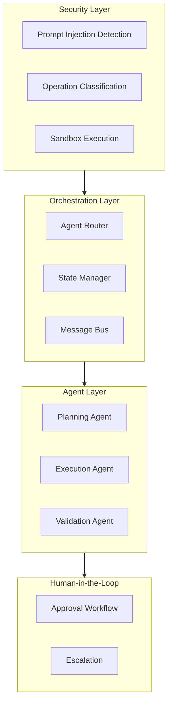

# AI Agent Enterprise Architecture Topic Summary

## Overview

Complete creation of **AI Agent Enterprise Architecture** technical learning topic, covering enterprise-grade AI Agent design patterns, security governance, and cost management.

---

## Directory Structure

```
topics/ai-agent-enterprise/
├── README.md                              # Topic entry point
├── AI_AGENT_TOPIC_SUMMARY.md             # This file
│
├── zh/                                    # Chinese resources
│   ├── ebooks/
│   │   ├── AI_Agent_Enterprise_Whitepaper.md       # 15-chapter whitepaper (~58KB)
│   │   ├── AI_Agent_Quick_Reference.md             # Quick reference
│   │   └── AI_Agent_Learning_Roadmap.md            # 16-week roadmap
│   │
│   └── projects/
│       ├── 01-agent-foundation/           # Single Agent basics
│       ├── 02-multi-agent-orchestration/  # Multi-Agent patterns
│       └── 03-enterprise-governance/      # Security & compliance
│
├── en/                                    # English resources
│   └── ebooks/
│       └── AI_Agent_Enterprise_Whitepaper.md
│
├── ja/                                    # Japanese resources
│   └── ebooks/
│       └── AI_Agent_Enterprise_Whitepaper.md
│
```

---

## Content Statistics

| Category | Count | Description |
|----------|-------|-------------|
| **eBooks** | 3 | Whitepaper, Quick Reference, Roadmap |
| **Projects** | 3 | Progressive difficulty projects |
| **Code Examples** | 50+ | Production-ready Python code |
| **Architecture Diagrams** | 20+ | Mermaid diagrams |

---

## Core Content

### Whitepaper - 15 Chapters

1. **AI Agent Enterprise Overview** - Concepts, challenges, AWS service matrix
2. **Architecture Design Principles** - Single/Multi-Agent, sync/async patterns
3. **Token Economics** - Cost management, budgeting, degradation strategies
4. **Development Environment** - Docker, LocalStack, testing
5. **Data Correctness** - Validation, hallucination detection, consistency
6. **Operation Separation** - Read/write separation, sandboxing, audit trails
7. **Agent Responsibility Separation** - Role definitions, orchestration patterns
8. **Human-in-the-Loop** - Confidence thresholds, approval workflows
9. **Security Best Practices** - Prompt injection defense, data masking
10. **AWS Service Integration** - Bedrock, Lambda, Step Functions patterns
11. **Monitoring and Observability** - Token tracking, Agent behavior analysis
12. **Testing Strategies** - Unit, integration, A/B, red team testing
13. **Deployment and Operations** - Blue-green, canary, auto-scaling
14. **Compliance and Governance** - GDPR, audit trails, model explainability
15. **Production Best Practices** - OpenClaw/ZeroClaw templates, runbooks

### Key Features

**OpenClaw Pattern**:
- Multi-Agent collaboration
- Shared state communication
- Human intervention at critical points
- For complex business processes

**ZeroClaw Pattern**:
- Highly autonomous single Agent
- Predefined safety boundaries
- Human escalation only on exceptions
- For standardized, low-risk tasks

---

## Architecture Highlights



---

## Learning Path

### Weeks 1-4: Foundation
- AI Agent concepts and Bedrock basics
- Architecture design principles
- Development environment setup
- Token management

### Weeks 5-8: Security & Collaboration
- Security best practices
- Multi-Agent orchestration
- Human-in-the-loop design
- Data correctness

### Weeks 9-12: Testing & Deployment
- Testing strategies
- Deployment patterns
- Monitoring setup
- Troubleshooting

### Weeks 13-16: Enterprise Scale
- Scalable architecture
- Governance and compliance
- Platform development
- Capstone project

---

## Enterprise Focus Areas

| Challenge | Solution |
|-----------|----------|
| Token Cost Unpredictability | Budget quotas, intelligent degradation |
| Output Unreliability | Validation layers, cross-verification |
| Security Risks | Defense in depth, HITL |
| Compliance Requirements | Audit trails, data privacy |

---

## Related Topics

- [Serverless](../serverless/) - Lambda deployment for Agents
- [Monitoring](../monitoring/) - Agent observability
- [Security](../security/) - Enterprise security patterns

---

**Created**: 2026-03-02  
**Version**: v1.0  
**Status**: Available
