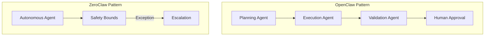

# AI Agent Enterprise Architecture

> Building Secure, Controllable, and Scalable Enterprise AI Agent Systems

---

## Topic Overview

This topic focuses on enterprise-grade AI Agent architecture design, covering:

- **Enterprise AI Agent Best Practices** - Patterns for production AI systems
- **OpenClaw/ZeroClaw Architecture** - Multi-agent collaboration and autonomous execution
- **Token Economics** - Cost management and budget control
- **Security & Governance** - Prompt injection defense, HITL, audit trails
- **Development Tools** - Docker-based dev environments, LocalStack testing

### Architecture Patterns



---

## Multi-Language Resources

| Language | Directory | Status |
|----------|-----------|--------|
| 🇨🇳 中文 | [./zh/](./zh/) | ✅ Available |
| 🇺🇸 English | [./en/](./en/) | 📝 Planned |
| 🇯🇵 日本語 | [./ja/](./ja/) | 📝 Planned |

---

## Content Structure

### eBooks

| Document | Description |
|----------|-------------|
| `AI_Agent_Enterprise_Whitepaper.md` | Technical whitepaper (15 chapters) |
| `AI_Agent_Quick_Reference.md` | Quick reference guide |
| `AI_Agent_Learning_Roadmap.md` | 16-week learning roadmap |

### Practice Projects

| Project | Difficulty | Focus |
|---------|-----------|-------|
| Single Agent Foundation | ⭐ | Basic Agent implementation |
| Multi-Agent Orchestration | ⭐⭐ | Agent collaboration patterns |
| Enterprise Governance | ⭐⭐⭐ | Security, compliance, HITL |

---

## Key Concepts

### Enterprise AI Challenges

| Challenge | Solution |
|-----------|----------|
| Unpredictable Costs | Token budgeting, intelligent degradation |
| Output Reliability | Validation layers, hallucination detection |
| Security Risks | Multi-layer defense, operation isolation |
| Compliance | Audit trails, HITL, data privacy |

### Core Principles

1. **Defense in Depth** - Multiple security layers
2. **Human-in-the-Loop** - Supervised automation
3. **Cost Awareness** - Token economics management
4. **Audit Everything** - Complete traceability

---

## Quick Start

```bash
# Clone and setup
cd topics/ai-agent-enterprise/

# Read the whitepaper
cat zh/ebooks/AI_Agent_Enterprise_Whitepaper.md

# Start with project 1
cd projects/01-single-agent-foundation/
docker-compose up
```

---

## Resource Statistics

| Metric | Count |
|--------|-------|
| eBooks | 3 |
| Projects | 3 |
| Code Examples | 50+ |
| Architecture Diagrams | 20+ |

---

## Related Topics

- [Serverless](../serverless/) - Lambda-based Agent deployment
- [Monitoring](../monitoring/) - Agent observability
- [Security](../security/) - Enterprise security patterns

---

**Build enterprise-grade AI Agents!** 🚀
