# AWS AI Agent Enterprise Architecture Learning Roadmap

> 16-Week Journey from Concepts to Production for Enterprise AI Agent Development

---

## Learning Path Overview

```mermaid
flowchart LR
    subgraph Foundation["Foundation Phase (Week 1-4)"]
        Concepts[AI Agent Concepts]
        Bedrock[Bedrock Basics]
        Architecture[Architecture Design]
    end
    
    subgraph Development["Development Phase (Week 5-8)"]
        Security[Security Implementation]
        MultiAgent[Multi-Agent]
        HITL[Human-in-the-Loop]
    end
    
    subgraph Production["Production Phase (Week 9-12)"]
        Testing[Testing & Validation]
        Deployment[Deployment & Operations]
        Governance[Governance & Compliance]
    end
    
    subgraph Enterprise["Enterprise Phase (Week 13-16)"]
        Scale[Scaling]
        Platform[Platform]
    end
    
    Foundation --> Development --> Production --> Enterprise
```

---

## Weeks 1-4: Fundamentals & Architecture

### Week 1: AI Agent Basics
- Understanding the difference between Agents and traditional applications
- Learning AWS Bedrock services
- Mastering Token economics
- **Hands-on**: Create your first Bedrock Agent

### Week 2: Architecture Design Principles
- Single-Agent vs Multi-Agent
- Synchronous vs Asynchronous architecture
- State management strategies
- **Hands-on**: Design Agent architecture diagrams

### Week 3: Development Environment Setup
- Dockerized development environment
- LocalStack for local testing
- CI/CD pipelines
- **Hands-on**: Set up a complete Dev environment

### Week 4: Token Management
- Cost estimation and budgeting
- Intelligent fallback strategies
- Quota management
- **Project**: Implement a cost control system

---

## Weeks 5-8: Security & Collaboration

### Week 5: Security Best Practices
- Prompt injection protection
- Data masking
- Operation separation
- **Hands-on**: Implement security layers

### Week 6: Multi-Agent Orchestration
- Agent role definition
- Workflow design
- Message bus
- **Hands-on**: Build a Multi-Agent system

### Week 7: Human-in-the-Loop (HITL)
- Confidence thresholds
- Approval workflows
- Exception routing
- **Hands-on**: Implement human confirmation mechanisms

### Week 8: Data Correctness
- Output validation
- Hallucination detection
- Consistency checks
- **Project**: Implement a validation framework

---

## Weeks 9-12: Testing & Deployment

### Week 9: Testing Strategies
- Agent unit testing
- Integration testing
- A/B testing
- **Hands-on**: Establish test suites

### Week 10: Deployment Strategies
- Blue-green deployment
- Canary release
- Automatic rollback
- **Hands-on**: Implement CI/CD

### Week 11: Monitoring & Observability
- Token usage monitoring
- Agent behavior tracing
- Performance optimization
- **Hands-on**: Set up monitoring dashboards

### Week 12: Troubleshooting
- Common error patterns
- Debugging techniques
- Emergency response
- **Project**: Complete a production-grade system

---

## Weeks 13-16: Enterprise Advanced Topics

### Week 13: Scaling Architecture
- High availability design
- Load balancing
- Cross-region deployment
- **Hands-on**: Design high-availability architecture

### Week 14: Governance & Compliance
- Audit logging
- Compliance checks
- Data privacy
- **Hands-on**: Implement a governance framework

### Week 15: Platform Building
- Agent catalog
- Reuse mechanisms
- Developer portal
- **Hands-on**: Build an internal platform

### Week 16: Capstone Project
- End-to-end enterprise-grade system
- OpenClaw-style implementation
- Complete documentation
- **Capstone**: Enterprise AI Platform

---

## Recommended Resources

### Official Documentation
- [Amazon Bedrock Docs](https://docs.aws.amazon.com/bedrock/)
- [AWS Well-Architected - AI/ML](https://docs.aws.amazon.com/wellarchitected/)

### Papers & Articles
- "ReAct: Synergizing Reasoning and Acting in Language Models"
- "LangChain: Building applications with LLMs"

### Certifications
- AWS Certified Machine Learning - Specialty
- AWS Certified Solutions Architect - Professional

---

**Start building enterprise-grade AI Agents!** 🤖
