# AWS AI Agent エンタープライズアーキテクチャ学習ロードマップ

> 概念から本番環境まで、16週間で学ぶエンタープライズAIエージェント開発

---

## 学習パス概要

```mermaid
flowchart LR
    subgraph Foundation["基礎フェーズ (Week 1-4)"]
        Concepts[AI Agent 概念]
        Bedrock[Bedrock 基礎]
        Architecture[アーキテクチャ設計]
    end
    
    subgraph Development["開発フェーズ (Week 5-8)"]
        Security[セキュリティ実装]
        MultiAgent[マルチエージェント]
        HITL[ヒューマンインザループ]
    end
    
    subgraph Production["本番フェーズ (Week 9-12)"]
        Testing[テスト検証]
        Deployment[デプロイ運用]
        Governance[ガバナンス・コンプライアンス]
    end
    
    subgraph Enterprise["エンタープライズ (Week 13-16)"]
        Scale[スケーリング]
        Platform[プラットフォーム化]
    end
    
    Foundation --> Development --> Production --> Enterprise
```

---

## 第 1-4 週：基礎概念とアーキテクチャ

### Week 1: AI Agent 基礎
- エージェントと従来のアプリケーションの違いを理解します
- AWS Bedrock サービスを学習します
- トークンエコノミクスを習得します
- **実践**: 最初の Bedrock Agent を作成します

### Week 2: アーキテクチャ設計原則
- シングルエージェント vs マルチエージェント
- 同期 vs 非同期アーキテクチャ
- 状態管理戦略
- **実践**: エージェントアーキテクチャ図を設計します

### Week 3: 開発環境の構築
- Docker 化された開発環境
- LocalStack によるローカルテスト
- CI/CD パイプライン
- **実践**: 完全な開発環境を構築します

### Week 4: トークン管理
- コスト見積もりと予算
- インテリジェントなデグラデーション戦略
- クォータ管理
- **プロジェクト**: コスト管理システムを実装します

---

## 第 5-8 週：セキュリティと協調

### Week 5: セキュリティのベストプラクティス
- プロンプトインジェクション対策
- データのマスキング
- 操作の分離
- **実践**: セキュリティレイヤーを実装します

### Week 6: マルチエージェントオーケストレーション
- エージェントの役割定義
- ワークフロー設計
- メッセージバス
- **実践**: マルチエージェントシステムを構築します

### Week 7: ヒューマンインザループ（HITL）
- 信頼度のしきい値
- 承認ワークフロー
- 例外ルーティング
- **実践**: 手動確認メカニズムを実装します

### Week 8: データの正確性
- 出力検証
- ハルシネーション検出
- 整合性チェック
- **プロジェクト**: 検証フレームワークを実装します

---

## 第 9-12 週：テストとデプロイ

### Week 9: テスト戦略
- エージェントの単体テスト
- 統合テスト
- A/B テスト
- **実践**: テストスイートを構築します

### Week 10: デプロイ戦略
- ブルーグリーンデプロイ
- カナリアリリース
- 自動ロールバック
- **実践**: CI/CD を実装します

### Week 11: 監視と可観測性
- トークン使用状況の監視
- エージェントの行動トレース
- パフォーマンス最適化
- **実践**: 監視ダッシュボードを構築します

### Week 12: トラブルシューティング
- 一般的なエラーパターン
- デバッグテクニック
- 緊急対応
- **プロジェクト**: 本番レベルのシステムを完成させます

---

## 第 13-16 週：エンタープライズ応用

### Week 13: スケーラブルアーキテクチャ
- 高可用性設計
- ロードバランシング
- マルチリージョンデプロイ
- **実践**: 高可用性アーキテクチャを設計します

### Week 14: ガバナンスとコンプライアンス
- 監査ログ
- コンプライアンスチェック
- データプライバシー
- **実践**: ガバナンスフレームワークを実装します

### Week 15: プラットフォーム化
- エージェントカタログ
- 再利用メカニズム
- 開発者ポータル
- **実践**: 社内プラットフォームを構築します

### Week 16: 総合プロジェクト
- エンドツーエンドのエンタープライズシステム
- OpenClaw スタイルの実装
- 完全なドキュメント
- **Capstone**: エンタープライズAIプラットフォーム

---

## 推奨リソース

### 公式ドキュメント
- [Amazon Bedrock Docs](https://docs.aws.amazon.com/bedrock/)
- [AWS Well-Architected - AI/ML](https://docs.aws.amazon.com/wellarchitected/)

### 論文と記事
- "ReAct: Synergizing Reasoning and Acting in Language Models"
- "LangChain: Building applications with LLMs"

### 認定資格
- AWS Certified Machine Learning - Specialty
- AWS Certified Solutions Architect - Professional

---

**エンタープライズレベルの AI エージェントの構築を始めましょう！** 🤖
