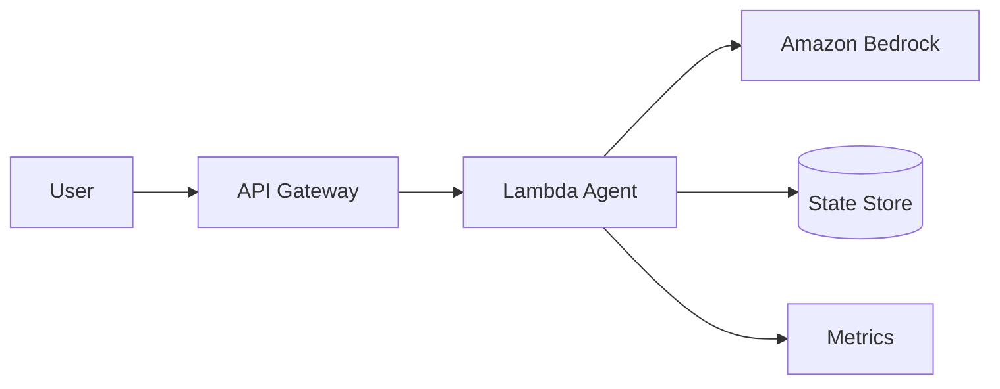

# Project 1: Single Agent Foundation

> Difficulty: ⭐ Beginner  
> Time: 2-3 hours

---

## Project Goals

Build a foundational single AI Agent with:
- Basic Bedrock integration
- Token cost tracking
- Input validation
- Simple state management

## Architecture



---

## Implementation

```python
# app.py
import boto3
import json
from datetime import datetime

class SingleAgent:
    def __init__(self):
        self.bedrock = boto3.client('bedrock-runtime')
        self.dynamodb = boto3.resource('dynamodb')
        self.table = self.dynamodb.Table('agent-sessions')
    
    def invoke(self, user_input: str, session_id: str = None):
        # Get or create session
        session = self._get_session(session_id)
        
        # Prepare prompt
        prompt = self._build_prompt(user_input, session.history)
        
        # Call Bedrock
        response = self._call_bedrock(prompt)
        
        # Track metrics
        self._track_usage(response.usage)
        
        # Update session
        self._update_session(session, user_input, response)
        
        return {
            'response': response.text,
            'session_id': session.id,
            'cost': response.cost
        }
```

---

## Deployment

```bash
sam build
sam deploy --guided
```

---

## Verification

- [ ] Agent responds correctly
- [ ] Token usage tracked
- [ ] State persists across calls
- [ ] Cost within budget
