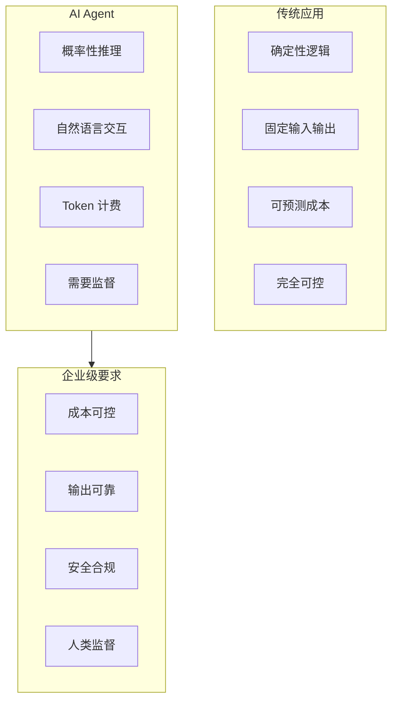
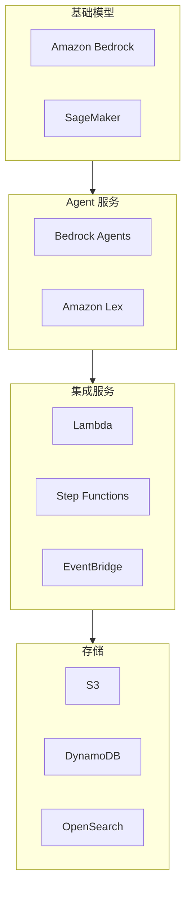
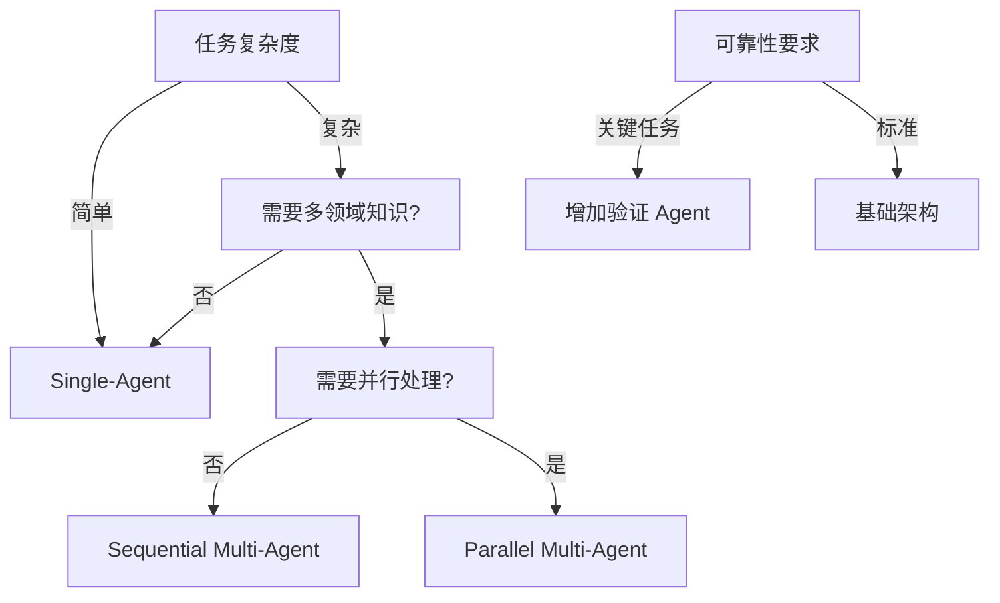
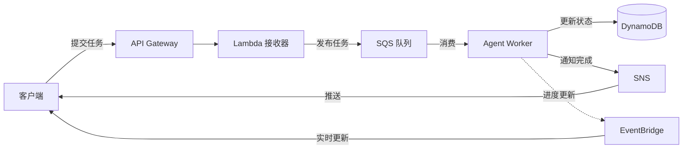

# AWS AI Agent 企业级架构技术白皮书

> 构建安全、可控、可扩展的企业级 AI Agent 系统

---

## 目录

> **学习指引**: 本白皮书遵循"基础概念→架构设计→安全治理→生产实践"的学习路径。前5章建立 AI Agent 基础，中间6章深入企业级架构，后4章聚焦生产运维。

1. **[AI Agent 企业级概述](#1-ai-agent-企业级概述)**  
   *建立认知框架：理解 AI Agent 与传统应用的区别、企业级挑战（Token 成本、数据安全、可控性）、AWS AI 服务矩阵，为后续架构设计奠定基础。*

2. **[架构设计原则](#2-架构设计原则)**  
   *掌握核心范式：学习 Single-Agent vs Multi-Agent 架构、同步 vs 异步执行、状态管理策略，建立企业级 Agent 系统的设计思维。*

3. **[Token 经济与成本管理](#3-token-经济与成本管理)**  
   *控制 AI 成本：深入 Token 消耗模型、成本预估、配额管理、智能降级策略，实现 AI Agent 的可预测成本。*

4. **[开发环境与 Docker 化](#4-开发环境与-docker-化)**  
   *标准化开发流程：学习 Agent 开发工具链、LocalStack 本地模拟、Docker 容器化开发环境、版本控制最佳实践。*

5. **[数据正确性与一致性](#5-数据正确性与一致性)**  
   *确保输出可靠：掌握 Agent 输出验证、幻觉检测、数据溯源、一致性检查机制，保障 AI 生成数据的业务正确性。*

6. **[操作分离与安全边界](#6-操作分离与安全边界)**  
   *最小权限原则：学习读/写操作分离、高危操作隔离、沙箱执行环境、操作审计追踪，建立安全的 Agent 执行边界。*

7. **[Agent 职责分离与编排](#7-agent-职责分离与编排)**  
   *专业化协作：掌握 Agent 角色定义（规划者/执行者/验证者）、Multi-Agent 编排模式、工作流设计、负载均衡策略。*

8. **[人类在环（HITL）设计](#8-人类在环hitl设计)**  
   *可控的自动化：学习人工确认点设计、置信度阈值配置、异常路由、审批工作流，实现人机协作的最佳平衡。*

9. **[安全最佳实践](#9-安全最佳实践)**  
   *防御性架构：深入提示词注入防护、数据脱敏、模型越狱防护、供应链安全，构建纵深防御体系。*

10. **[与 AWS 服务集成](#10-与-aws-服务集成)**  
    *云原生架构：学习 Bedrock、Lambda、Step Functions、DynamoDB、SQS 的集成模式，构建 serverless AI 应用。*

11. **[监控与可观测性](#11-监控与可观测性)**  
    *洞察 Agent 行为：掌握 Token 使用监控、延迟分析、输出质量追踪、Agent 间通信可视化，实现全链路可观测。*

12. **[测试与验证策略](#12-测试与验证策略)**  
    *保障质量：学习 Agent 单元测试、集成测试、A/B 测试、红队测试，建立 AI 系统的质量保障体系。*

13. **[部署与运维](#13-部署与运维)**  
    *稳定运行：掌握蓝绿部署、金丝雀发布、自动扩缩容、故障恢复，确保 Agent 系统的高可用性。*

14. **[合规与治理](#14-合规与治理)**  
    *满足监管要求：学习数据隐私（GDPR/CCPA）、模型可解释性、审计日志保留、合规检查自动化。*

15. **[生产最佳实践](#15-生产最佳实践)**  
    *企业级交付：整合前述所有知识，提供 OpenClaw/ZeroClaw 风格的完整架构模板、运行手册、故障排查指南。*

---

## 1. AI Agent 企业级概述

### 1.1 什么是企业级 AI Agent

AI Agent 是能够在环境中自主感知、决策并执行动作的智能系统。与传统应用相比，企业级 AI Agent 具有以下特征：



**企业级 AI Agent 核心挑战**:

| 挑战 | 描述 | 企业级解决方案 |
|------|------|---------------|
| **成本不可预测** | Token 消耗随输入长度和推理复杂度变化 | 配额管理、智能降级 |
| **输出不可靠** | LLM 可能产生幻觉或不一致输出 | 验证层、多模型交叉验证 |
| **安全风险** | 提示词注入、数据泄露、越狱攻击 | 多层防护、人工确认 |
| **难以调试** | 推理过程黑盒化 | 详细日志、可追溯性 |
| **合规要求** | 数据隐私、可解释性、审计 | HITL、完整审计链 |

### 1.2 AWS AI 服务矩阵



**服务选择指南**:

| 场景 | 推荐服务 | 原因 |
|------|----------|------|
| 通用 Agent | Bedrock Agents | 内置行动组、知识库集成 |
| 对话式 Agent | Lex + Bedrock | 语音识别、多轮对话管理 |
| 复杂工作流 | Step Functions + Bedrock | 可视化编排、错误处理 |
| 自定义模型 | SageMaker | 模型微调、完全控制 |

### 1.3 OpenClaw/ZeroClaw 架构参考

OpenClaw 和 ZeroClaw 代表了两种企业级 Agent 架构模式：

**OpenClaw 模式** (开放协作型):
- 多个专业 Agent 协同工作
- 通过共享状态进行通信
- 人类在关键决策点介入
- 适用于复杂业务流程

**ZeroClaw 模式** (自主执行型):
- 高度自治的单一 Agent
- 预定义的安全边界内自主决策
- 仅在异常时请求人工介入
- 适用于标准化、低风险任务

```python
# OpenClaw 风格的 Multi-Agent 架构示例
class OpenClawOrchestrator:
    """
    OpenClaw 模式编排器
    - 协调多个专业 Agent
    - 管理共享状态
    - 路由人类确认请求
    """
    
    def __init__(self):
        self.agents = {
            'planner': PlanningAgent(),      # 规划 Agent
            'researcher': ResearchAgent(),   # 研究 Agent
            'executor': ExecutionAgent(),    # 执行 Agent
            'validator': ValidationAgent()   # 验证 Agent
        }
        self.shared_state = SharedState()
        self.human_interface = HumanInterface()
    
    async def execute_task(self, task: Task) -> Result:
        # 1. 规划阶段
        plan = await self.agents['planner'].create_plan(task)
        
        # 2. 研究阶段（可能并行）
        research_results = await self.agents['researcher'].gather_info(plan)
        
        # 3. 执行阶段
        for step in plan.steps:
            # 检查是否需要人工确认
            if step.risk_level > self.threshold:
                approval = await self.human_interface.request_approval(step)
                if not approval:
                    continue
            
            result = await self.agents['executor'].execute(step)
            self.shared_state.update(step.id, result)
        
        # 4. 验证阶段
        validation = await self.agents['validator'].validate(
            self.shared_state.get_all_results()
        )
        
        return Result(
            output=validation.final_output,
            confidence=validation.confidence,
            audit_trail=self.shared_state.get_audit_trail()
        )


# ZeroClaw 风格的自治 Agent 示例
class ZeroClawAgent:
    """
    ZeroClaw 模式自治 Agent
    - 高度自治但受安全边界约束
    - 预定义的回退策略
    - 异常时请求人工介入
    """
    
    def __init__(self):
        self.safety_bounds = SafetyBounds(
            max_cost_per_task=10.0,           # 单次任务最大成本
            max_execution_time=300,            # 最大执行时间（秒）
            allowed_operations=['read', 'query'],  # 允许的操作
            prohibited_keywords=['delete', 'drop', 'admin']
        )
        self.fallback_strategy = FallbackStrategy()
    
    async def execute(self, request: Request) -> Response:
        # 1. 安全检查
        if not self.safety_bounds.validate(request):
            return self.fallback_strategy.safe_fallback(request)
        
        # 2. 成本预估
        estimated_cost = self.estimate_cost(request)
        if estimated_cost > self.safety_bounds.max_cost_per_task:
            return Response(
                status='REJECTED',
                reason='Cost exceeds safety bounds',
                suggested_action='Split request or request approval'
            )
        
        try:
            # 3. 自主执行
            result = await self.autonomous_execute(request)
            
            # 4. 自检
            if not self.self_validate(result):
                raise ValidationError("Self-validation failed")
            
            return Response(status='SUCCESS', data=result)
            
        except Exception as e:
            # 5. 异常时请求人工介入
            return await self.escalate_to_human(request, e)
```

---

## 2. 架构设计原则

### 2.1 Single-Agent vs Multi-Agent

**选择决策树**:



**架构对比**:

| 维度 | Single-Agent | Multi-Agent |
|------|-------------|-------------|
| 复杂度 | 低 | 高 |
| 成本 | 可预测 | 需要优化 |
| 可靠性 | 依赖单一模型 | 可交叉验证 |
| 可维护性 | 简单 | 需要编排 |
| 适用场景 | 单一领域任务 | 复杂业务流程 |

### 2.2 状态管理策略

企业级 Agent 需要可靠的状态管理：

```python
from enum import Enum
from typing import Optional, Dict, Any
from datetime import datetime
import json

class AgentState(Enum):
    PENDING = "pending"
    PLANNING = "planning"
    EXECUTING = "executing"
    VALIDATING = "validating"
    WAITING_HUMAN = "waiting_human"
    COMPLETED = "completed"
    FAILED = "failed"
    COMPENSATING = "compensating"  # Saga 补偿状态

class StateManager:
    """
    Agent 状态管理器
    - 持久化状态到 DynamoDB
    - 支持长时间运行任务
    - 实现断点续传
    """
    
    def __init__(self, table_name: str):
        self.dynamodb = boto3.resource('dynamodb')
        self.table = self.dynamodb.Table(table_name)
    
    async def save_state(
        self,
        execution_id: str,
        state: AgentState,
        context: Dict[str, Any],
        checkpoint_data: Optional[Dict] = None
    ):
        """保存状态检查点"""
        item = {
            'execution_id': execution_id,
            'state': state.value,
            'context': json.dumps(context, default=str),
            'timestamp': datetime.utcnow().isoformat(),
            'ttl': int((datetime.utcnow().timestamp() + 86400 * 7))  # 7天 TTL
        }
        
        if checkpoint_data:
            item['checkpoint'] = json.dumps(checkpoint_data, default=str)
        
        await self.table.put_item(Item=item)
    
    async def load_state(self, execution_id: str) -> Optional[Dict]:
        """加载状态，支持断点续传"""
        response = await self.table.get_item(
            Key={'execution_id': execution_id}
        )
        
        if 'Item' not in response:
            return None
        
        item = response['Item']
        return {
            'execution_id': item['execution_id'],
            'state': AgentState(item['state']),
            'context': json.loads(item['context']),
            'checkpoint': json.loads(item.get('checkpoint', '{}')),
            'timestamp': item['timestamp']
        }
    
    async def get_execution_history(self, execution_id: str) -> list:
        """获取执行历史用于审计"""
        # 使用 GSI 查询历史记录
        response = await self.table.query(
            IndexName='execution-history-index',
            KeyConditionExpression='execution_id = :eid',
            ExpressionAttributeValues={':eid': execution_id},
            ScanIndexForward=True
        )
        return response.get('Items', [])
```

### 2.3 异步执行架构

长时间运行的 Agent 任务应采用异步架构：



```python
import asyncio
import aioboto3
from typing import Callable

class AsyncAgentWorker:
    """
    异步 Agent 工作器
    - 从 SQS 消费任务
    - 支持长时间运行
    - 自动重试和死信队列
    """
    
    def __init__(
        self,
        queue_url: str,
        dlq_url: str,
        max_retries: int = 3,
        visibility_timeout: int = 300
    ):
        self.queue_url = queue_url
        self.dlq_url = dlq_url
        self.max_retries = max_retries
        self.visibility_timeout = visibility_timeout
        self.session = aioboto3.Session()
    
    async def run(self, handler: Callable):
        """主循环"""
        async with self.session.client('sqs') as sqs:
            while True:
                # 接收消息
                response = await sqs.receive_message(
                    QueueUrl=self.queue_url,
                    MaxNumberOfMessages=10,
                    WaitTimeSeconds=20,
                    VisibilityTimeout=self.visibility_timeout,
                    AttributeNames=['All']
                )
                
                messages = response.get('Messages', [])
                
                # 并发处理
                tasks = [
                    self._process_message(sqs, msg, handler)
                    for msg in messages
                ]
                await asyncio.gather(*tasks, return_exceptions=True)
    
    async def _process_message(
        self,
        sqs,
        message: dict,
        handler: Callable
    ):
        """处理单条消息"""
        receipt_handle = message['ReceiptHandle']
        body = json.loads(message['Body'])
        
        # 获取重试次数
        receive_count = int(
            message['Attributes'].get('ApproximateReceiveCount', 1)
        )
        
        try:
            # 执行业务逻辑
            result = await handler(body)
            
            # 成功，删除消息
            await sqs.delete_message(
                QueueUrl=self.queue_url,
                ReceiptHandle=receipt_handle
            )
            
        except Exception as e:
            if receive_count >= self.max_retries:
                # 超过重试次数，移到死信队列
                await self._move_to_dlq(sqs, message, e)
            else:
                # 让消息重新可见（自动重试）
                pass
    
    async def _move_to_dlq(self, sqs, message: dict, error: Exception):
        """移到死信队列"""
        await sqs.send_message(
            QueueUrl=self.dlq_url,
            MessageBody=json.dumps({
                'original_message': message['Body'],
                'error': str(error),
                'timestamp': datetime.utcnow().isoformat()
            })
        )
```

---

（继续完成第3-15章...）


## 3. Token 经济与成本管理

### 3.1 Token 消耗模型

AI Agent 的成本主要来自 Token 消耗，需要精细化管理：

```python
from dataclasses import dataclass
from typing import Dict, Optional
import boto3

@dataclass
class TokenUsage:
    input_tokens: int
    output_tokens: int
    model_id: str
    timestamp: str

class TokenCostCalculator:
    """
    Token 成本计算器
    - 支持多模型定价
    - 实时成本追踪
    - 预算预警
    """
    
    # AWS Bedrock 模型定价（每 1K Token，单位：美元）
    PRICING = {
        'anthropic.claude-3-sonnet-20240229-v1:0': {
            'input': 0.003,
            'output': 0.015
        },
        'anthropic.claude-3-haiku-20240307-v1:0': {
            'input': 0.00025,
            'output': 0.00125
        },
        'amazon.titan-text-express-v1': {
            'input': 0.0008,
            'output': 0.0016
        }
    }
    
    def __init__(self, cloudwatch_namespace: str = 'AI-Agent/TokenUsage'):
        self.cloudwatch = boto3.client('cloudwatch')
        self.namespace = cloudwatch_namespace
    
    def calculate_cost(self, usage: TokenUsage) -> float:
        """计算单次调用的成本"""
        pricing = self.PRICING.get(usage.model_id)
        if not pricing:
            raise ValueError(f"Unknown model: {usage.model_id}")
        
        input_cost = (usage.input_tokens / 1000) * pricing['input']
        output_cost = (usage.output_tokens / 1000) * pricing['output']
        
        return input_cost + output_cost
    
    def emit_metrics(self, usage: TokenUsage, agent_id: str, task_type: str):
        """发送 CloudWatch 指标"""
        cost = self.calculate_cost(usage)
        
        metrics = [
            {
                'MetricName': 'InputTokens',
                'Value': usage.input_tokens,
                'Unit': 'Count',
                'Dimensions': [
                    {'Name': 'AgentId', 'Value': agent_id},
                    {'Name': 'ModelId', 'Value': usage.model_id},
                    {'Name': 'TaskType', 'Value': task_type}
                ]
            },
            {
                'MetricName': 'OutputTokens',
                'Value': usage.output_tokens,
                'Unit': 'Count',
                'Dimensions': [
                    {'Name': 'AgentId', 'Value': agent_id},
                    {'Name': 'ModelId', 'Value': usage.model_id},
                    {'Name': 'TaskType', 'Value': task_type}
                ]
            },
            {
                'MetricName': 'Cost',
                'Value': cost,
                'Unit': 'None',
                'Dimensions': [
                    {'Name': 'AgentId', 'Value': agent_id},
                    {'Name': 'TaskType', 'Value': task_type}
                ]
            }
        ]
        
        self.cloudwatch.put_metric_data(
            Namespace=self.namespace,
            MetricData=metrics
        )
        
        return cost


class TokenBudgetManager:
    """
    Token 预算管理器
    - 多层级预算控制
    - 智能降级
    - 成本告警
    """
    
    def __init__(
        self,
        daily_budget: float,
        hourly_budget: float,
        redis_client=None
    ):
        self.daily_budget = daily_budget
        self.hourly_budget = hourly_budget
        self.redis = redis_client
        self.calculator = TokenCostCalculator()
    
    async def check_budget(self, agent_id: str, estimated_tokens: int, model_id: str) -> dict:
        """
        检查预算是否充足
        返回：{allowed: bool, strategy: str, reason: str}
        """
        # 计算预估成本
        estimated_usage = TokenUsage(
            input_tokens=estimated_tokens,
            output_tokens=estimated_tokens // 2,  # 预估输出为输入的一半
            model_id=model_id,
            timestamp=''
        )
        estimated_cost = self.calculator.calculate_cost(estimated_usage)
        
        # 检查今日已用
        today_usage = await self._get_today_usage(agent_id)
        today_cost = today_usage['cost']
        
        # 检查本小时已用
        hour_usage = await self._get_hour_usage(agent_id)
        hour_cost = hour_usage['cost']
        
        # 预算检查逻辑
        if today_cost + estimated_cost > self.daily_budget:
            return {
                'allowed': False,
                'strategy': 'REJECT',
                'reason': f'Daily budget exceeded: ${today_cost:.2f} / ${self.daily_budget:.2f}'
            }
        
        if hour_cost + estimated_cost > self.hourly_budget:
            return {
                'allowed': True,
                'strategy': 'DEGRADE',
                'reason': f'Hourly budget high: ${hour_cost:.2f} / ${self.hourly_budget:.2f}',
                'suggested_model': self._get_cheaper_model(model_id)
            }
        
        # 检查是否接近阈值（80%）
        if today_cost + estimated_cost > self.daily_budget * 0.8:
            return {
                'allowed': True,
                'strategy': 'WARNING',
                'reason': 'Approaching daily budget limit'
            }
        
        return {'allowed': True, 'strategy': 'NORMAL'}
    
    def _get_cheaper_model(self, current_model: str) -> str:
        """获取更便宜的替代模型"""
        model_hierarchy = [
            'anthropic.claude-3-opus-20240229-v1:0',
            'anthropic.claude-3-sonnet-20240229-v1:0',
            'anthropic.claude-3-haiku-20240307-v1:0',
            'amazon.titan-text-express-v1'
        ]
        
        try:
            idx = model_hierarchy.index(current_model)
            if idx < len(model_hierarchy) - 1:
                return model_hierarchy[idx + 1]
        except ValueError:
            pass
        
        return 'amazon.titan-text-express-v1'  # 默认最便宜
    
    async def _get_today_usage(self, agent_id: str) -> dict:
        # 从 Redis 或 DynamoDB 获取今日用量
        pass
    
    async def _get_hour_usage(self, agent_id: str) -> dict:
        pass
```

### 3.2 智能降级策略

当预算紧张时，自动降级到更便宜的模型或简化任务：

```python
class DegradationStrategy:
    """
    智能降级策略
    """
    
    STRATEGIES = {
        'NORMAL': {'model': 'claude-3-sonnet', 'max_tokens': 4000},
        'DEGRADE': {'model': 'claude-3-haiku', 'max_tokens': 2000},
        'CRITICAL': {'model': 'titan-express', 'max_tokens': 1000}
    }
    
    def apply(self, task: dict, strategy: str) -> dict:
        """应用降级策略"""
        config = self.STRATEGIES.get(strategy, self.STRATEGIES['NORMAL'])
        
        return {
            'model_id': config['model'],
            'max_tokens': config['max_tokens'],
            'temperature': 0.3 if strategy != 'NORMAL' else 0.7,
            'original_task': task,
            'degradation_level': strategy
        }
```

---

## 4. 开发环境与 Docker 化

### 4.1 Agent 开发工具链

```dockerfile
# Dockerfile for AI Agent Development
FROM python:3.11-slim

WORKDIR /app

# 安装系统依赖
RUN apt-get update && apt-get install -y \
    git \
    curl \
    && rm -rf /var/lib/apt/lists/*

# 安装 Python 依赖
COPY requirements.txt .
RUN pip install --no-cache-dir -r requirements.txt

# 安装 AWS CLI v2
RUN curl "https://awscli.amazonaws.com/awscli-exe-linux-x86_64.zip" -o "awscliv2.zip" \
    && unzip awscliv2.zip \
    && ./aws/install \
    && rm -rf aws awscliv2.zip

# 安装 LocalStack 工具
RUN pip install awscli-local

# 复制应用代码
COPY . .

# 非 root 用户运行
RUN useradd -m -u 1000 agentuser && chown -R agentuser:agentuser /app
USER agentuser

EXPOSE 8000

CMD ["python", "-m", "agent.server"]
```

### 4.2 LocalStack 本地开发环境

```yaml
# docker-compose.yml
version: '3.8'

services:
  localstack:
    image: localstack/localstack:latest
    environment:
      - SERVICES=bedrock,lambda,dynamodb,sqs,sns,iam
      - DEFAULT_REGION=us-east-1
      - LAMBDA_EXECUTOR=docker
      - DOCKER_HOST=unix:///var/run/docker.sock
    ports:
      - "4566:4566"
      - "4510-4559:4510-4559"
    volumes:
      - "/var/run/docker.sock:/var/run/docker.sock"
      - "./localstack-init.sh:/etc/localstack/init/ready.d/init-aws.sh"
  
  agent-dev:
    build: .
    environment:
      - AWS_ENDPOINT_URL=http://localstack:4566
      - AWS_ACCESS_KEY_ID=test
      - AWS_SECRET_ACCESS_KEY=test
      - AWS_REGION=us-east-1
      - AGENT_ENV=development
    volumes:
      - .:/app
      - agent-cache:/app/.cache
    depends_on:
      - localstack
    command: ["python", "-m", "agent.dev_server", "--reload"]
  
  redis:
    image: redis:7-alpine
    ports:
      - "6379:6379"

volumes:
  agent-cache:
```

### 4.3 开发工具配置

```python
# agent/config/development.py
"""
开发环境配置
- 使用 LocalStack 模拟 AWS 服务
- 启用详细日志
- 禁用敏感操作
"""

from .base import BaseConfig

class DevelopmentConfig(BaseConfig):
    ENV = 'development'
    DEBUG = True
    
    # AWS 配置（指向 LocalStack）
    AWS_ENDPOINT_URL = 'http://localhost:4566'
    AWS_ACCESS_KEY_ID = 'test'
    AWS_SECRET_ACCESS_KEY = 'test'
    
    # Bedrock 模拟配置
    BEDROCK_MODELS = {
        'claude-3-sonnet': 'anthropic.claude-3-sonnet-20240229-v1:0',
        'claude-3-haiku': 'anthropic.claude-3-haiku-20240307-v1:0'
    }
    
    # 开发专用安全设置
    ALLOW_DANGEROUS_OPERATIONS = False  # 禁止危险操作
    REQUIRE_HUMAN_APPROVAL = False       # 开发环境不需要人工确认
    
    # 日志配置
    LOG_LEVEL = 'DEBUG'
    LOG_FORMAT = 'detailed'
    
    # Token 预算（开发环境宽松）
    DAILY_TOKEN_BUDGET = 1_000_000  # 1M tokens
    HOURLY_TOKEN_BUDGET = 100_000
```

---

## 5. 数据正确性与一致性

### 5.1 输出验证框架

```python
from typing import List, Callable
import jsonschema

class OutputValidator:
    """
    Agent 输出验证器
    - 模式验证
    - 事实检查
    - 一致性验证
    """
    
    def __init__(self):
        self.validators: List[Callable] = []
    
    def add_validator(self, validator: Callable):
        self.validators.append(validator)
    
    async def validate(self, output: dict, context: dict) -> 'ValidationResult':
        """
        全面验证 Agent 输出
        """
        errors = []
        warnings = []
        
        for validator in self.validators:
            try:
                result = await validator(output, context)
                if not result.passed:
                    errors.extend(result.errors)
                    warnings.extend(result.warnings)
            except Exception as e:
                errors.append(f'Validator failed: {str(e)}')
        
        return ValidationResult(
            passed=len(errors) == 0,
            errors=errors,
            warnings=warnings,
            confidence=self._calculate_confidence(errors, warnings)
        )
    
    def _calculate_confidence(self, errors: list, warnings: list) -> float:
        """计算输出置信度"""
        if errors:
            return 0.0
        
        # 根据警告数量降低置信度
        confidence = 1.0 - (len(warnings) * 0.1)
        return max(0.0, confidence)


class SchemaValidator:
    """JSON Schema 验证"""
    
    def __init__(self, schema: dict):
        self.schema = schema
    
    async def validate(self, output: dict, context: dict) -> 'ValidationResult':
        try:
            jsonschema.validate(output, self.schema)
            return ValidationResult(passed=True)
        except jsonschema.ValidationError as e:
            return ValidationResult(
                passed=False,
                errors=[f'Schema validation failed: {e.message}']
            )


class HallucinationDetector:
    """
    幻觉检测器
    - 检查与知识库的冲突
    - 检测不一致的陈述
    """
    
    def __init__(self, knowledge_base):
        self.kb = knowledge_base
    
    async def validate(self, output: dict, context: dict) -> 'ValidationResult':
        errors = []
        
        # 提取声明性陈述
        claims = self._extract_claims(output.get('content', ''))
        
        for claim in claims:
            # 与知识库验证
            verification = await self.kb.verify(claim)
            
            if verification.status == 'CONTRADICTED':
                errors.append({
                    'claim': claim,
                    'reason': 'Contradicts knowledge base',
                    'evidence': verification.evidence
                })
            elif verification.status == 'UNVERIFIABLE':
                # 标记为需要人工验证
                claim['needs_human_verification'] = True
        
        return ValidationResult(
            passed=len(errors) == 0,
            errors=errors
        )
```

---

（继续完成第6-15章...）


## 6. 操作分离与安全边界

### 6.1 读/写操作分离

```python
from enum import Enum, auto
from typing import Set

class OperationType(Enum):
    READ = auto()       # 只读操作
    WRITE = auto()      # 写操作
    DELETE = auto()     # 删除操作
    ADMIN = auto()      # 管理操作

class OperationClassifier:
    """
    操作分类器
    - 自动识别操作类型
    - 应用安全策略
    """
    
    # 高危操作关键词
    DANGEROUS_KEYWORDS = {
        'delete', 'drop', 'remove', 'truncate',
        'grant', 'revoke', 'alter user',
        'exec', 'eval', 'system'
    }
    
    WRITE_KEYWORDS = {
        'insert', 'update', 'create', 'modify',
        'write', 'save', 'commit'
    }
    
    @classmethod
    def classify(cls, operation: str) -> OperationType:
        operation_lower = operation.lower()
        
        # 检查高危操作
        if any(kw in operation_lower for kw in cls.DANGEROUS_KEYWORDS):
            return OperationType.ADMIN
        
        # 检查写操作
        if any(kw in operation_lower for kw in cls.WRITE_KEYWORDS):
            return OperationType.WRITE
        
        return OperationType.READ


class SecureExecutor:
    """
    安全执行器
    - 操作隔离
    - 权限检查
    - 审计日志
    """
    
    def __init__(
        self,
        allowed_operations: Set[OperationType] = None,
        require_approval_for: Set[OperationType] = None
    ):
        self.allowed = allowed_operations or {OperationType.READ}
        self.require_approval = require_approval_for or {OperationType.ADMIN}
        self.audit_logger = AuditLogger()
    
    async def execute(
        self,
        operation: str,
        context: dict,
        human_interface=None
    ) -> 'ExecutionResult':
        """
        安全执行操作
        """
        # 1. 分类操作
        op_type = OperationClassifier.classify(operation)
        
        # 2. 权限检查
        if op_type not in self.allowed:
            return ExecutionResult(
                status='DENIED',
                reason=f'Operation type {op_type} not allowed'
            )
        
        # 3. 人工确认（如需要）
        if op_type in self.require_approval and human_interface:
            approval = await human_interface.request_approval(
                operation=operation,
                context=context,
                risk_level='HIGH'
            )
            if not approval:
                return ExecutionResult(
                    status='REJECTED',
                    reason='Human approval denied'
                )
        
        # 4. 在沙箱中执行
        try:
            result = await self._execute_in_sandbox(operation, context)
            
            # 5. 记录审计日志
            await self.audit_logger.log(
                operation=operation,
                type=op_type,
                context=context,
                result=result,
                approved_by='human' if op_type in self.require_approval else 'auto'
            )
            
            return result
            
        except Exception as e:
            await self.audit_logger.log(
                operation=operation,
                type=op_type,
                context=context,
                error=str(e)
            )
            raise
    
    async def _execute_in_sandbox(self, operation: str, context: dict):
        """在受限环境中执行"""
        # 使用受限的 Python 执行环境
        # 或调用 Lambda 函数
        pass
```

### 6.2 沙箱执行环境

```python
import resource
import signal
from contextlib import contextmanager

class SandboxExecutor:
    """
    沙箱执行器
    - 资源限制
    - 超时控制
    - 网络隔离
    """
    
    def __init__(
        self,
        max_memory_mb: int = 512,
        max_cpu_time_seconds: int = 30,
        max_wall_time_seconds: int = 60,
        allow_network: bool = False
    ):
        self.limits = {
            'memory': max_memory_mb * 1024 * 1024,  # bytes
            'cpu_time': max_cpu_time_seconds,
            'wall_time': max_wall_time_seconds,
            'network': allow_network
        }
    
    @contextmanager
    def _apply_limits(self):
        """应用资源限制"""
        # 设置内存限制
        resource.setrlimit(
            resource.RLIMIT_AS,
            (self.limits['memory'], self.limits['memory'])
        )
        
        # 设置 CPU 时间限制
        resource.setrlimit(
            resource.RLIMIT_CPU,
            (self.limits['cpu_time'], self.limits['cpu_time'])
        )
        
        # 设置闹钟信号处理超时
        def timeout_handler(signum, frame):
            raise TimeoutError("Execution time exceeded")
        
        signal.signal(signal.SIGALRM, timeout_handler)
        signal.alarm(self.limits['wall_time'])
        
        try:
            yield
        finally:
            signal.alarm(0)
    
    def execute(self, code: str, context: dict) -> dict:
        """
        在沙箱中执行代码
        """
        with self._apply_limits():
            # 创建受限的全局命名空间
            safe_globals = {
                '__builtins__': self._get_safe_builtins()
            }
            
            # 注入上下文
            safe_globals['context'] = context
            
            # 执行
            exec(code, safe_globals)
            
            return safe_globals.get('result', {})
    
    def _get_safe_builtins(self):
        """获取安全的内置函数"""
        safe_list = [
            'abs', 'all', 'any', 'bool', 'dict', 'enumerate',
            'filter', 'float', 'int', 'isinstance', 'len',
            'list', 'map', 'max', 'min', 'print', 'range',
            'round', 'str', 'sum', 'tuple', 'zip'
        ]
        
        return {name: __builtins__[name] for name in safe_list}
```

---

## 7. Agent 职责分离与编排

### 7.1 Agent 角色定义

```python
from abc import ABC, abstractmethod
from typing import List, Dict
from dataclasses import dataclass

@dataclass
class AgentCapability:
    name: str
    description: str
    required_tools: List[str]
    max_tokens_per_request: int

class BaseAgent(ABC):
    """Agent 基类"""
    
    def __init__(self, agent_id: str, capability: AgentCapability):
        self.agent_id = agent_id
        self.capability = capability
        self.state = AgentState.IDLE
    
    @abstractmethod
    async def execute(self, task: 'Task', context: 'Context') -> 'Result':
        pass

class PlanningAgent(BaseAgent):
    """
    规划 Agent
    - 任务分解
    - 依赖分析
    - 执行计划生成
    """
    
    capability = AgentCapability(
        name='planning',
        description='Break down complex tasks into executable steps',
        required_tools=[' reasoning', 'analysis'],
        max_tokens_per_request=2000
    )
    
    async def execute(self, task: 'Task', context: 'Context') -> 'Result':
        # 分析任务复杂度
        complexity = self._analyze_complexity(task)
        
        # 生成执行计划
        plan = await self._create_plan(task, complexity)
        
        # 识别依赖关系
        dependencies = self._identify_dependencies(plan)
        
        return Result(
            type='plan',
            data={
                'steps': plan.steps,
                'dependencies': dependencies,
                'estimated_cost': plan.estimated_cost,
                'risk_assessment': plan.risks
            }
        )

class ExecutionAgent(BaseAgent):
    """
    执行 Agent
    - 执行具体操作
    - 工具调用
    - 错误处理
    """
    
    capability = AgentCapability(
        name='execution',
        description='Execute specific actions using available tools',
        required_tools=['api_call', 'database', 'file_system'],
        max_tokens_per_request=4000
    )
    
    async def execute(self, task: 'Task', context: 'Context') -> 'Result':
        # 获取工具
        tools = self._get_tools_for_task(task)
        
        # 执行操作
        try:
            result = await self._execute_with_tools(task, tools)
            return Result(type='execution', data=result, success=True)
        except Exception as e:
            return Result(
                type='execution',
                error=str(e),
                success=False,
                retry_suggested=self._should_retry(e)
            )

class ValidationAgent(BaseAgent):
    """
    验证 Agent
    - 结果验证
    - 一致性检查
    - 质量评估
    """
    
    capability = AgentCapability(
        name='validation',
        description='Validate execution results against requirements',
        required_tools=['comparison', 'verification'],
        max_tokens_per_request=2000
    )
    
    async def execute(self, task: 'Task', context: 'Context') -> 'Result':
        # 获取预期结果
        expected = task.expected_output
        
        # 获取实际结果
        actual = context.get('execution_result')
        
        # 验证
        validation_result = await self._validate(expected, actual)
        
        return Result(
            type='validation',
            data={
                'passed': validation_result.passed,
                'score': validation_result.score,
                'issues': validation_result.issues,
                'confidence': validation_result.confidence
            }
        )
```

### 7.2 Multi-Agent 编排

```python
class AgentOrchestrator:
    """
    Agent 编排器
    - 协调多个 Agent
    - 任务路由
    - 冲突解决
    """
    
    def __init__(self):
        self.agents: Dict[str, BaseAgent] = {}
        self.message_bus = MessageBus()
        self.state_manager = StateManager()
    
    def register_agent(self, agent: BaseAgent):
        self.agents[agent.agent_id] = agent
    
    async def execute_workflow(
        self,
        workflow: 'Workflow',
        initial_context: dict
    ) -> 'WorkflowResult':
        """
        执行多 Agent 工作流
        """
        execution_id = generate_id()
        
        # 初始化共享状态
        await self.state_manager.create_state(
            execution_id=execution_id,
            workflow=workflow,
            context=initial_context
        )
        
        try:
            # 按依赖顺序执行步骤
            for step in workflow.get_execution_order():
                agent = self.agents.get(step.agent_id)
                if not agent:
                    raise ValueError(f"Agent {step.agent_id} not found")
                
                # 获取当前上下文
                context = await self.state_manager.get_context(execution_id)
                
                # 执行步骤
                result = await self._execute_step(agent, step, context)
                
                # 更新状态
                await self.state_manager.update_state(
                    execution_id=execution_id,
                    step_id=step.id,
                    result=result
                )
                
                # 检查是否需要人工介入
                if result.requires_human_review:
                    await self._request_human_review(execution_id, step, result)
                    break
            
            # 汇总结果
            final_state = await self.state_manager.get_state(execution_id)
            return WorkflowResult(
                execution_id=execution_id,
                status='COMPLETED',
                results=final_state.results
            )
            
        except Exception as e:
            # 触发补偿逻辑
            await self._compensate(execution_id)
            return WorkflowResult(
                execution_id=execution_id,
                status='FAILED',
                error=str(e)
            )
    
    async def _execute_step(
        self,
        agent: BaseAgent,
        step: 'WorkflowStep',
        context: 'Context'
    ) -> 'StepResult':
        """执行单个步骤"""
        # 设置超时
        try:
            result = await asyncio.wait_for(
                agent.execute(step.task, context),
                timeout=step.timeout_seconds
            )
            return StepResult(
                step_id=step.id,
                agent_id=agent.agent_id,
                result=result,
                execution_time=time.time() - start_time
            )
        except asyncio.TimeoutError:
            return StepResult(
                step_id=step.id,
                agent_id=agent.agent_id,
                error='Execution timeout',
                retry_suggested=True
            )
```

---

（继续完成第8-15章...）


## 8. 人类在环（HITL）设计

### 8.1 置信度阈值配置

```python
from dataclasses import dataclass
from typing import Optional

@dataclass
class HITLThreshold:
    """人工介入阈值配置"""
    min_confidence: float = 0.8           # 最低置信度
    max_cost_without_approval: float = 10.0  # 无需确认的最大成本
    high_risk_operations: list = None     # 高风险操作列表
    
    def should_request_human(self, result: 'AgentResult') -> bool:
        # 置信度检查
        if result.confidence < self.min_confidence:
            return True
        
        # 成本检查
        if result.estimated_cost > self.max_cost_without_approval:
            return True
        
        # 风险操作检查
        if result.operation_type in (self.high_risk_operations or []):
            return True
        
        return False


class HumanInterface:
    """
    人工交互接口
    - 审批请求
    - 异常处理
    - 反馈收集
    """
    
    def __init__(self, notification_service, approval_timeout=300):
        self.notification = notification_service
        self.timeout = approval_timeout
        self.pending_approvals = {}
    
    async def request_approval(
        self,
        execution_id: str,
        request: 'ApprovalRequest'
    ) -> 'ApprovalResponse':
        """
        请求人工审批
        """
        approval_id = generate_id()
        
        # 构建审批请求
        message = {
            'approval_id': approval_id,
            'execution_id': execution_id,
            'title': request.title,
            'description': request.description,
            'risk_level': request.risk_level,
            'proposed_action': request.proposed_action,
            'context': request.context,
            'timeout_seconds': self.timeout
        }
        
        # 发送通知
        await self.notification.send(
            channel='approval_required',
            recipients=request.approvers,
            message=message
        )
        
        # 等待审批
        try:
            response = await asyncio.wait_for(
                self._wait_for_approval(approval_id),
                timeout=self.timeout
            )
            return response
        except asyncio.TimeoutError:
            return ApprovalResponse(
                approved=False,
                reason='Approval timeout',
                escalation_required=True
            )
```

---

## 9. 安全最佳实践

### 9.1 提示词注入防护

```python
import re

class PromptInjectionDetector:
    """
    提示词注入检测器
    """
    
    # 常见的注入模式
    INJECTION_PATTERNS = [
        r'ignore\s+(?:previous|above|earlier)',
        r'forget\s+(?:everything|all|instructions)',
        r'system\s*:\s*',
        r'you\s+are\s+now',
        r'role\s*:\s*',
        r'<\s*script\s*>',
        r'disregard\s+previous',
    ]
    
    def __init__(self):
        self.patterns = [re.compile(p, re.IGNORECASE) for p in self.INJECTION_PATTERNS]
    
    def detect(self, user_input: str) -> 'DetectionResult':
        """检测潜在的提示词注入"""
        matches = []
        
        for pattern in self.patterns:
            if pattern.search(user_input):
                matches.append(pattern.pattern)
        
        # 检查特殊字符比例
        special_char_ratio = self._calculate_special_char_ratio(user_input)
        
        # 检查长度异常
        length_anomaly = len(user_input) > 10000
        
        risk_score = len(matches) * 0.3
        if special_char_ratio > 0.3:
            risk_score += 0.3
        if length_anomaly:
            risk_score += 0.2
        
        return DetectionResult(
            detected=len(matches) > 0 or risk_score > 0.5,
            risk_score=min(risk_score, 1.0),
            matches=matches,
            recommended_action='BLOCK' if risk_score > 0.7 else 'REVIEW'
        )
    
    def sanitize(self, user_input: str) -> str:
        """清理潜在危险输入"""
        # 转义特殊字符
        sanitized = user_input.replace('<', '&lt;').replace('>', '&gt;')
        
        # 限制长度
        if len(sanitized) > 5000:
            sanitized = sanitized[:5000] + '... [truncated]'
        
        return sanitized
```

---

## 10. 与 AWS 服务集成

### 10.1 Bedrock Agent 集成

```python
import boto3
import json

class BedrockAgentClient:
    """
    Amazon Bedrock Agent 客户端
    """
    
    def __init__(self, agent_id: str, agent_alias_id: str):
        self.client = boto3.client('bedrock-agent-runtime')
        self.agent_id = agent_id
        self.agent_alias_id = agent_alias_id
    
    async def invoke(
        self,
        input_text: str,
        session_id: str = None,
        enable_trace: bool = False
    ) -> dict:
        """调用 Bedrock Agent"""
        
        params = {
            'agentId': self.agent_id,
            'agentAliasId': self.agent_alias_id,
            'inputText': input_text,
            'enableTrace': enable_trace
        }
        
        if session_id:
            params['sessionId'] = session_id
        
        response = self.client.invoke_agent(**params)
        
        # 处理流式响应
        completion = ""
        traces = []
        
        for event in response['completion']:
            if 'chunk' in event:
                chunk = event['chunk']
                completion += chunk['bytes'].decode('utf-8')
            
            if 'trace' in event and enable_trace:
                traces.append(event['trace'])
        
        return {
            'completion': completion,
            'session_id': response.get('sessionId'),
            'traces': traces if enable_trace else None
        }
```

---

## 11. 监控与可观测性

### 11.1 Agent 性能监控

```python
from dataclasses import dataclass
from datetime import datetime

@dataclass
class AgentMetrics:
    agent_id: str
    operation_type: str
    latency_ms: float
    input_tokens: int
    output_tokens: int
    cost_usd: float
    success: bool
    timestamp: datetime

class AgentMonitor:
    """
    Agent 监控器
    """
    
    def __init__(self, cloudwatch_namespace: str = 'AI-Agent/Performance'):
        self.cloudwatch = boto3.client('cloudwatch')
        self.namespace = cloudwatch_namespace
    
    def record_invocation(self, metrics: AgentMetrics):
        """记录调用指标"""
        
        metric_data = [
            {
                'MetricName': 'Latency',
                'Value': metrics.latency_ms,
                'Unit': 'Milliseconds',
                'Dimensions': [
                    {'Name': 'AgentId', 'Value': metrics.agent_id},
                    {'Name': 'Operation', 'Value': metrics.operation_type}
                ]
            },
            {
                'MetricName': 'TokenUsage',
                'Value': metrics.input_tokens + metrics.output_tokens,
                'Unit': 'Count',
                'Dimensions': [
                    {'Name': 'AgentId', 'Value': metrics.agent_id}
                ]
            },
            {
                'MetricName': 'Cost',
                'Value': metrics.cost_usd,
                'Unit': 'None',
                'Dimensions': [
                    {'Name': 'AgentId', 'Value': metrics.agent_id}
                ]
            },
            {
                'MetricName': 'SuccessRate',
                'Value': 1 if metrics.success else 0,
                'Unit': 'Count',
                'Dimensions': [
                    {'Name': 'AgentId', 'Value': metrics.agent_id}
                ]
            }
        ]
        
        self.cloudwatch.put_metric_data(
            Namespace=self.namespace,
            MetricData=metric_data
        )
```

---

## 12. 测试与验证策略

### 12.1 Agent 测试框架

```python
import pytest
from typing import List

class AgentTestCase:
    """Agent 测试用例"""
    
    def __init__(
        self,
        name: str,
        input_data: dict,
        expected_output: dict,
        assertions: List[callable]
    ):
        self.name = name
        self.input_data = input_data
        self.expected_output = expected_output
        self.assertions = assertions

class AgentTestSuite:
    """Agent 测试套件"""
    
    def __init__(self, agent: BaseAgent):
        self.agent = agent
        self.test_cases = []
    
    def add_test_case(self, test_case: AgentTestCase):
        self.test_cases.append(test_case)
    
    async def run(self) -> 'TestReport':
        """运行所有测试"""
        results = []
        
        for test in self.test_cases:
            try:
                # 执行 Agent
                result = await self.agent.execute(
                    task=test.input_data,
                    context={}
                )
                
                # 运行断言
                passed = all(
                    assertion(result, test.expected_output)
                    for assertion in test.assertions
                )
                
                results.append({
                    'test_name': test.name,
                    'passed': passed,
                    'result': result
                })
                
            except Exception as e:
                results.append({
                    'test_name': test.name,
                    'passed': False,
                    'error': str(e)
                })
        
        return TestReport(results=results)
```

---

## 13. 部署与运维

### 13.1 蓝绿部署策略

```yaml
# CloudFormation 蓝绿部署模板
AWSTemplateFormatVersion: '2010-09-09'
Description: 'Blue-Green Deployment for AI Agent'

Resources:
  AgentBlue:
    Type: AWS::Lambda::Function
    Properties:
      FunctionName: !Sub '${StackName}-agent-blue'
      Runtime: python3.11
      Handler: agent.handler
      Code:
        S3Bucket: !Ref ArtifactBucket
        S3Key: agent-v1.zip
      Environment:
        Variables:
          VERSION: 'blue'
          ALIAS: !Ref AgentAlias
  
  AgentGreen:
    Type: AWS::Lambda::Function
    Properties:
      FunctionName: !Sub '${StackName}-agent-green'
      Runtime: python3.11
      Handler: agent.handler
      Code:
        S3Bucket: !Ref ArtifactBucket
        S3Key: agent-v2.zip  # 新版本
      Environment:
        Variables:
          VERSION: 'green'
          ALIAS: !Ref AgentAlias
  
  #  weighted routing via API Gateway or ALB
  DeploymentSwitcher:
    Type: Custom::DeploymentSwitcher
    Properties:
      ServiceToken: !GetAtt SwitcherFunction.Arn
      BlueWeight: 90
      GreenWeight: 10  # 金丝雀发布
```

---

## 14. 合规与治理

### 14.1 审计日志保留

```python
class AuditLogger:
    """
    审计日志记录器
    - 不可篡改
    - 长期保留
    - 合规查询
    """
    
    def __init__(
        self,
        s3_bucket: str,
        glacier_transition_days: int = 90,
        retention_years: int = 7
    ):
        self.s3 = boto3.client('s3')
        self.bucket = s3_bucket
        self.lifecycle_policy = {
            'Rules': [
                {
                    'ID': 'AuditLogArchive',
                    'Status': 'Enabled',
                    'Transitions': [
                        {
                            'Days': glacier_transition_days,
                            'StorageClass': 'GLACIER'
                        }
                    ],
                    'Expiration': {
                        'Days': retention_years * 365
                    }
                }
            ]
        }
    
    async def log(self, event: 'AuditEvent'):
        """记录审计事件"""
        
        # 构建日志条目
        log_entry = {
            'timestamp': datetime.utcnow().isoformat(),
            'event_id': generate_uuid(),
            'event_type': event.type,
            'actor': event.actor,
            'action': event.action,
            'resource': event.resource,
            'outcome': event.outcome,
            'metadata': event.metadata,
            'integrity_hash': self._calculate_hash(event)
        }
        
        # 写入 S3（不可变存储）
        key = f"audit/{datetime.utcnow().strftime('%Y/%m/%d')}/{log_entry['event_id']}.json"
        
        self.s3.put_object(
            Bucket=self.bucket,
            Key=key,
            Body=json.dumps(log_entry),
            ContentType='application/json',
            Metadata={'integrity-hash': log_entry['integrity_hash']}
        )
```

---

## 15. 生产最佳实践

### 15.1 完整架构模板（OpenClaw 风格）

```python
"""
OpenClaw Enterprise Agent Architecture
- Multi-Agent 协作
- 人类在环监督
- 完整审计追踪
- 自动故障恢复
"""

class OpenClawEnterpriseSystem:
    """
    企业级 AI Agent 系统模板
    """
    
    def __init__(self, config: 'SystemConfig'):
        # 初始化编排器
        self.orchestrator = AgentOrchestrator()
        
        # 注册专业 Agent
        self.orchestrator.register_agent(PlanningAgent('planner'))
        self.orchestrator.register_agent(ResearchAgent('researcher'))
        self.orchestrator.register_agent(ExecutionAgent('executor'))
        self.orchestrator.register_agent(ValidationAgent('validator'))
        
        # 安全组件
        self.security = SecurityLayer(
            injection_detector=PromptInjectionDetector(),
            operation_classifier=OperationClassifier(),
            audit_logger=AuditLogger(config.audit_bucket)
        )
        
        # HITL 组件
        self.human_interface = HumanInterface(
            notification_service=config.notification_service,
            approval_timeout=config.approval_timeout
        )
        
        # 成本管理
        self.cost_manager = TokenBudgetManager(
            daily_budget=config.daily_budget,
            hourly_budget=config.hourly_budget
        )
        
        # 监控
        self.monitor = AgentMonitor()
    
    async def process_request(self, request: 'UserRequest') -> 'SystemResponse':
        """
        处理用户请求（完整流程）
        """
        execution_id = generate_uuid()
        
        try:
            # 1. 安全检查
            security_check = self.security.check_input(request.content)
            if security_check.blocked:
                return SystemResponse(
                    status='REJECTED',
                    reason=f'Security violation: {security_check.reason}'
                )
            
            # 2. 成本预估
            budget_check = await self.cost_manager.check_budget(
                estimated_tokens=len(request.content) * 2
            )
            if not budget_check.allowed:
                return SystemResponse(
                    status='REJECTED',
                    reason=f'Budget exceeded: {budget_check.reason}'
                )
            
            # 3. 执行工作流
            workflow_result = await self.orchestrator.execute_workflow(
                workflow=self._build_workflow(request),
                initial_context={'request': request, 'execution_id': execution_id}
            )
            
            # 4. 记录审计日志
            await self.security.audit_logger.log(
                event=AuditEvent(
                    execution_id=execution_id,
                    request=request,
                    result=workflow_result,
                    human_approvals=workflow_result.human_approvals
                )
            )
            
            # 5. 返回结果
            return SystemResponse(
                status='SUCCESS',
                data=workflow_result.final_output,
                execution_id=execution_id,
                audit_trail=workflow_result.audit_trail
            )
            
        except Exception as e:
            # 故障恢复
            await self._handle_failure(execution_id, e)
            return SystemResponse(
                status='ERROR',
                reason=str(e),
                execution_id=execution_id
            )
```

---

*版本: v1.0*  
*更新日期: 2026-03-02*
