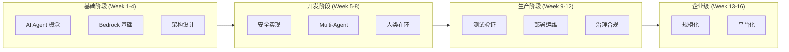

# AWS AI Agent 企业级架构学习路线图

> 16 周从概念到生产的企业级 AI Agent 开发之旅

---

## 学习路径概览

---

## 第 1-4 周：基础概念与架构

### Week 1: AI Agent 基础
- 理解 Agent 与传统应用的区别
- 学习 AWS Bedrock 服务
- 掌握 Token 经济学
- **实践**: 创建第一个 Bedrock Agent

### Week 2: 架构设计原则
- Single-Agent vs Multi-Agent
- 同步 vs 异步架构
- 状态管理策略
- **实践**: 设计 Agent 架构图

### Week 3: 开发环境搭建
- Docker 化开发环境
- LocalStack 本地测试
- CI/CD 流水线
- **实践**: 搭建完整 Dev 环境

### Week 4: Token 管理
- 成本估算与预算
- 智能降级策略
- 配额管理
- **项目**: 实现成本控制系统

---

## 第 5-8 周：安全与协作

### Week 5: 安全最佳实践
- 提示词注入防护
- 数据脱敏
- 操作分离
- **实践**: 实现安全层

### Week 6: Multi-Agent 编排
- Agent 角色定义
- 工作流设计
- 消息总线
- **实践**: 构建 Multi-Agent 系统

### Week 7: 人类在环（HITL）
- 置信度阈值
- 审批工作流
- 异常路由
- **实践**: 实现人工确认机制

### Week 8: 数据正确性
- 输出验证
- 幻觉检测
- 一致性检查
- **项目**: 实现验证框架

---

## 第 9-12 周：测试与部署

### Week 9: 测试策略
- Agent 单元测试
- 集成测试
- A/B 测试
- **实践**: 建立测试套件

### Week 10: 部署策略
- 蓝绿部署
- 金丝雀发布
- 自动回滚
- **实践**: 实现 CI/CD

### Week 11: 监控与可观测性
- Token 使用监控
- Agent 行为追踪
- 性能优化
- **实践**: 搭建监控仪表盘

### Week 12: 故障排除
- 常见错误模式
- 调试技巧
- 应急响应
- **项目**: 完成生产级系统

---

## 第 13-16 周：企业级进阶

### Week 13: 规模化架构
- 高可用设计
- 负载均衡
- 跨区域部署
- **实践**: 设计高可用架构

### Week 14: 治理与合规
- 审计日志
- 合规检查
- 数据隐私
- **实践**: 实现治理框架

### Week 15: 平台化建设
- Agent 目录
- 复用机制
- 开发者门户
- **实践**: 构建内部平台

### Week 16: 综合项目
- 端到端企业级系统
- OpenClaw 风格实现
- 完整文档
- **Capstone**: 企业级 AI 平台

---

## 推荐资源

### 官方文档
- [Amazon Bedrock Docs](https://docs.aws.amazon.com/bedrock/)
- [AWS Well-Architected - AI/ML](https://docs.aws.amazon.com/wellarchitected/)

### 论文与文章
- "ReAct: Synergizing Reasoning and Acting in Language Models"
- "LangChain: Building applications with LLMs"

### 认证
- AWS Certified Machine Learning - Specialty
- AWS Certified Solutions Architect - Professional

---

**开始构建企业级 AI Agent！** 🤖
