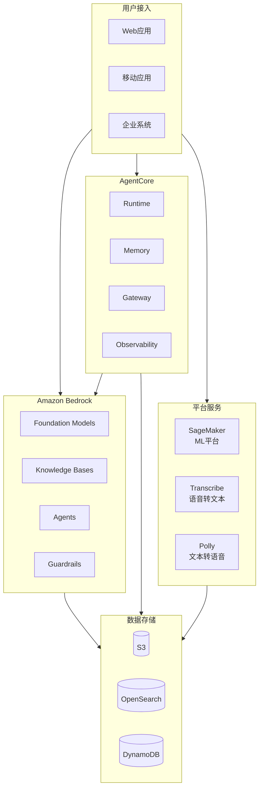

# AWS AI/ML 技术资源

> AWS AI/ML Technical Resources  
> AWS AI/ML 技術リソース

---

## 🎯 主题介绍

本主题涵盖 Amazon Web Services (AWS) 的 AI 和机器学习服务，包括：

- **Amazon Bedrock** - 基础模型平台
- **Amazon Bedrock AgentCore** - 智能体运行时
- **Amazon SageMaker** - 机器学习平台
- **Speech AI** - 语音服务 (Transcribe, Polly)

## 🏗️ 架构概览

### AWS AI/ML 整体架构



### 学习路径架构

```mermaid
flowchart LR
    subgraph Beginner["入门阶段"]
        B1[Bedrock API基础]
        B2[模型选择与调用]
        B3[简单聊天机器人]
    end
    
    subgraph Intermediate["进阶阶段"]
        I1[Knowledge Base RAG]
        I2[Bedrock Agents]
        I3[Prompt Engineering]
    end
    
    subgraph Advanced["高级阶段"]
        A1[AgentCore开发]
        A2[多模态应用]
        A3[模型微调]
    end
    
    subgraph Expert["专家阶段"]
        E1[生产部署]
        E2[安全架构]
        E3[成本优化]
    end
    
    Beginner --> Intermediate
    Intermediate --> Advanced
    Advanced --> Expert
```



---

## 📚 多语言资源

| 语言 | 目录 | 状态 | 字数 |
|------|------|------|------|
| 🇨🇳 中文 | [./zh/](./zh/) | ✅ 完整 | ~200,000字 |
| 🇺🇸 English | [./en/](./en/) | ✅ 核心 | ~60,000 words |
| 🇯🇵 日本語 | [./ja/](./ja/) | ✅ 核心 | ~80,000字 |

---

## 💻 实践项目

| 项目 | 难度 | 目录 |
|------|------|------|
| 智能问答机器人 | ⭐ 入门 | [./projects/01-chatbot-basic/](./projects/01-chatbot-basic/) |
| RAG 知识库助手 | ⭐⭐ 进阶 | [./projects/02-rag-assistant/](./projects/02-rag-assistant/) |
| AgentCore 智能助手 | ⭐⭐⭐ 高级 | [./projects/03-agentcore-assistant/](./projects/03-agentcore-assistant/) |
| 多模态 AI 平台 | ⭐⭐⭐⭐ 专家 | [./projects/04-multimodal-platform/](./projects/04-multimodal-platform/) |

---

## 🚀 快速开始

### 中文用户
```bash
cd zh/ebooks/
cat README_Ebook.md
```

### English Users
```bash
cd en/ebooks/
cat README.md
```

### 日本語ユーザー
```bash
cd ja/ebooks/
cat README.md
```

---

## 📖 内容清单

### 电子书 (ebooks/)
- 主白皮书（18章）
- 速查手册
- 学习路线图
- 导航索引

### 技术文档 (materials/)
- Bedrock Foundation Models
- Bedrock Guardrails
- Bedrock Knowledge Bases
- Bedrock Agents
- Bedrock Prompt Management
- Bedrock Fine-tuning
- Bedrock Multimodal
- AgentCore 完整指南
- SageMaker
- Transcribe + Polly

---

**贡献**: 欢迎提交 Issue 和 PR  
**许可**: MIT License
