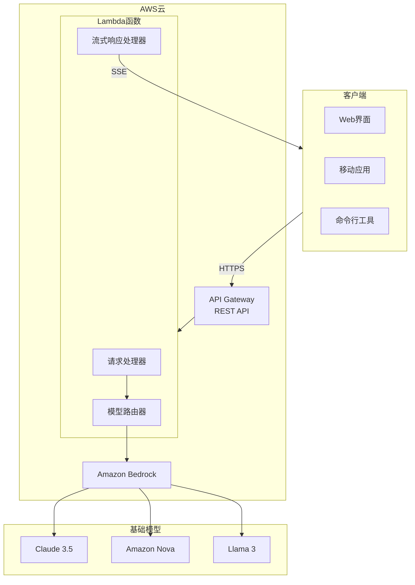
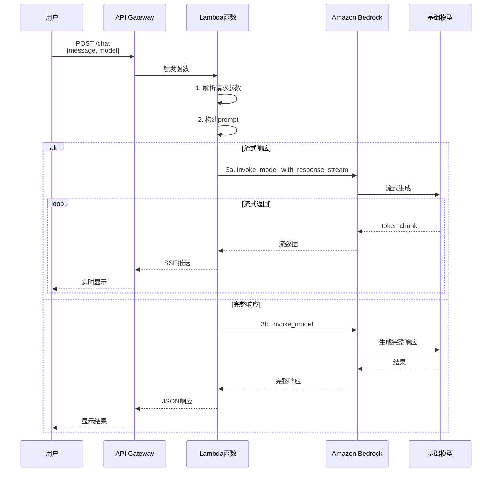
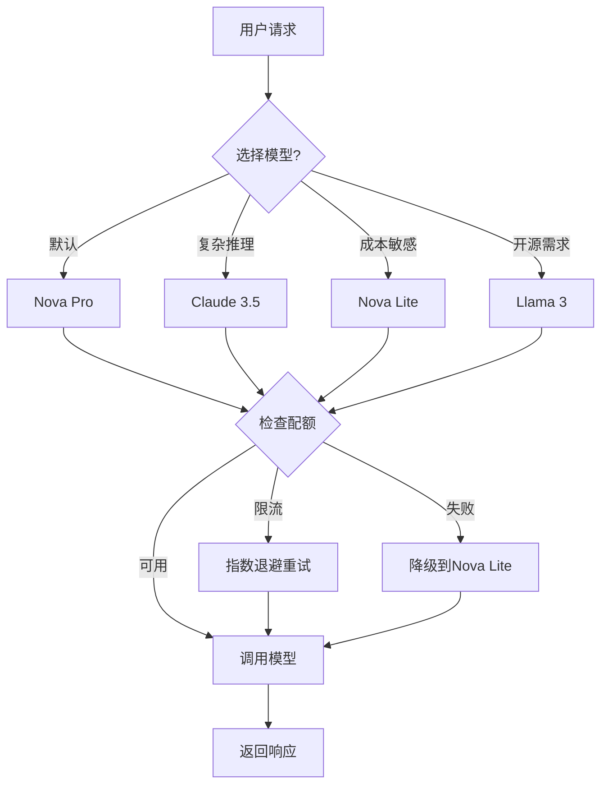

# Project 01: 智能问答机器人 (入门项目)

一个基于 Amazon Bedrock 的简单聊天机器人，支持多种模型切换和流式响应。

## 🎯 项目目标

- 掌握 Bedrock API 调用
- 理解模型选择策略
- 实现基础的对话接口

## 🏗️ 架构

### 系统架构图



### 请求处理流程



### 模型选择策略



## 📁 项目结构

```
01-chatbot-basic/
├── src/                    # 源代码
│   ├── lambda_function.py  # Lambda 处理函数
│   ├── models.py          # 模型配置
│   └── utils.py           # 工具函数
├── infra/                  # 基础设施
│   ├── main.tf            # Terraform 主配置
│   └── variables.tf       # 变量定义
├── deploy/                 # 部署脚本
│   ├── deploy.sh          # 一键部署
│   └── test.sh            # 测试脚本
├── docs/                   # 文档
│   └── API.md             # API 文档
└── README.md              # 项目说明
```

## 🚀 快速开始

### 1. 环境准备

```bash
# 安装依赖
pip install -r requirements.txt

# 配置 AWS 凭证
aws configure
```

### 2. 本地测试

```bash
# 运行本地测试
python src/local_test.py
```

### 3. 部署到 AWS

```bash
# 一键部署
cd deploy
./deploy.sh
```

### 4. 测试 API

```bash
# 调用 API
curl -X POST https://your-api.execute-api.us-east-1.amazonaws.com/prod/chat \
  -H "Content-Type: application/json" \
  -d '{"message": "你好", "model": "nova-pro"}'
```

## 📚 学习要点

1. **Bedrock Runtime API**: invoke_model vs invoke_model_with_response_stream
2. **模型选择**: 根据成本和延迟选择合适的模型
3. **错误处理**: ThrottlingException 的重试机制
4. **成本优化**: Token 计算和缓存策略

## 💰 成本估算

| 使用量 | 模型 | 月成本 |
|--------|------|--------|
| 1K 次/天 | Nova Lite | ~$2 |
| 1K 次/天 | Nova Pro | ~$25 |
| 1K 次/天 | Claude 3.5 | ~$90 |
