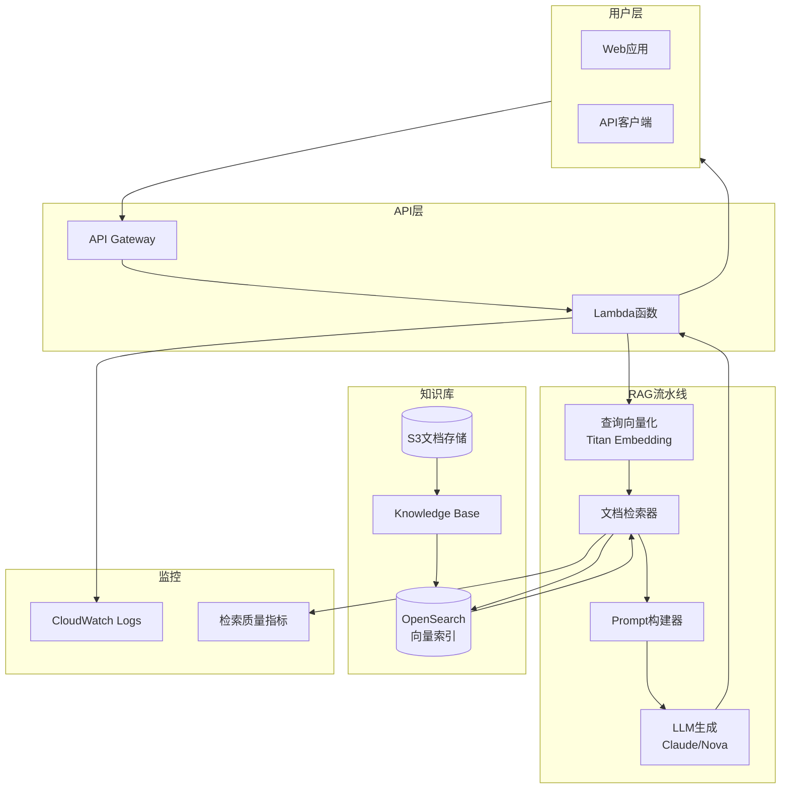
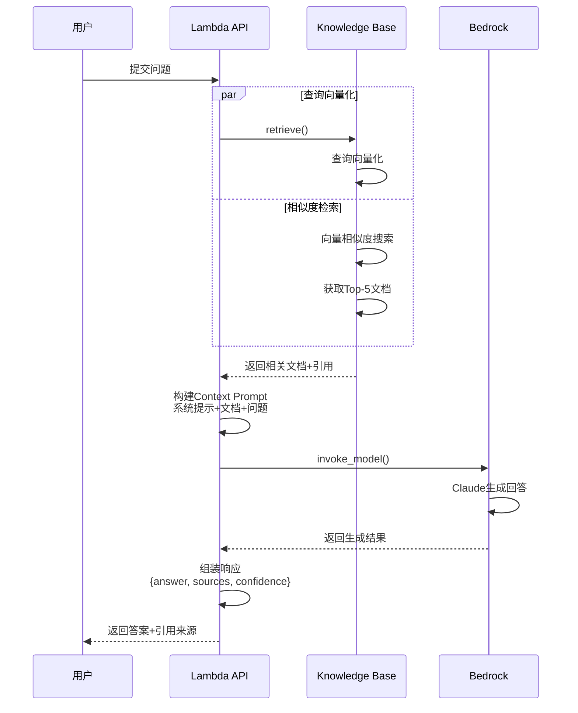
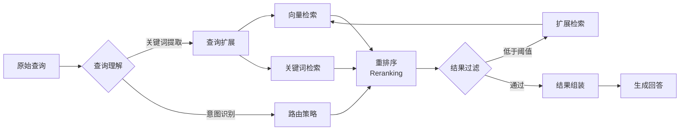

# Project 02: RAG 知识库助手 (进阶项目)

基于 Amazon Bedrock Knowledge Bases 的智能问答系统，支持私有文档检索和增强生成。

## 🎯 项目目标

- 构建完整的 RAG 流水线
- 掌握 Knowledge Base 配置
- 实现检索质量优化

## 🏗️ 架构

### RAG 系统架构图



### 文档摄取流程

```mermaid
sequenceDiagram
    participant Admin as 管理员
    participant S3 as S3存储桶
    participant KB as Knowledge Base
    participant Embedding as Embedding模型
    subgraph VectorDB as 向量数据库
        Index[索引构建]
        Store[向量存储]
    end
    
    Admin->>S3: 上传PDF/Word文档
    S3-->>KB: 触发同步事件
    
    KB->>KB: 1. 文档解析
    KB->>KB: 2. 文本切分(Chunking)
    
    loop 批量处理
        KB->>Embedding: 3. 文本向量化
        Embedding-->>KB: 返回向量
        KB->>Index: 4. 构建索引
    end
    
    Index->>Store: 5. 存储向量+元数据
    Store-->>KB: 同步完成
    KB-->>Admin: 通知就绪
```

### RAG 查询流程



### 检索质量优化



## 📁 项目结构

```
02-rag-assistant/
├── src/
│   ├── lambda_function.py      # 主处理函数
│   ├── retriever.py           # 检索逻辑
│   ├── prompt_builder.py      # 提示词构建
│   └── document_processor.py  # 文档预处理
├── data/
│   ├── sample_docs/           # 示例文档
│   └── upload_to_s3.py        # 文档上传脚本
├── infra/
│   ├── main.tf               # 主配置
│   ├── opensearch.tf         # 向量数据库
│   └── knowledge_base.tf     # Knowledge Base
├── notebooks/
│   └── rag_evaluation.ipynb  # RAG 评估
└── README.md
```

## 🚀 快速开始

### 1. 准备数据

```bash
# 上传文档到 S3
cd data
python upload_to_s3.py --bucket my-kb-docs --folder sample_docs/
```

### 2. 部署基础设施

```bash
cd infra
terraform init
terraform apply
```

### 3. 同步 Knowledge Base

```bash
# 触发数据同步
aws bedrock-agent start-ingestion-job \
  --knowledge-base-id $(terraform output -raw kb_id) \
  --data-source-id $(terraform output -raw data_source_id)
```

### 4. 测试查询

```bash
curl -X POST $(terraform output -raw api_endpoint) \
  -H "Content-Type: application/json" \
  -d '{"question": "公司的请假政策是什么？"}'
```

## 📚 学习要点

1. **Chunking Strategy**: 文档切分策略对比
2. **Embedding 模型选择**: Titan vs Cohere
3. **检索优化**: Hybrid Search + Reranking
4. **提示工程**: RAG 专用提示模板

## 🔍 检索质量优化

### Chunking 策略对比

| 策略 | 优点 | 缺点 | 适用场景 |
|------|------|------|----------|
| Fixed Size | 简单可控 | 可能切断语义 | 通用文档 |
| Hierarchical | 保留结构 | 复杂 | 技术文档 |
| Semantic | 语义完整 | 计算成本高 | 需要高精度的场景 |

### 评估指标

```python
# retrieval_evaluation.py
metrics = {
    'recall@5': 0.85,      # Top 5 包含正确答案的比例
    'mrr': 0.72,           # 平均倒数排名
    'latency_p99': 120     # 99分位延迟 (ms)
}
```
