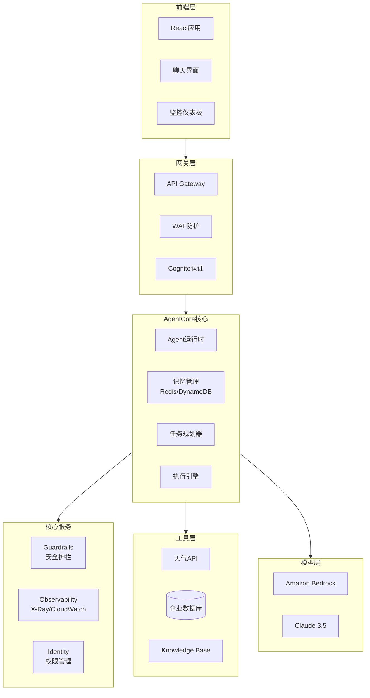
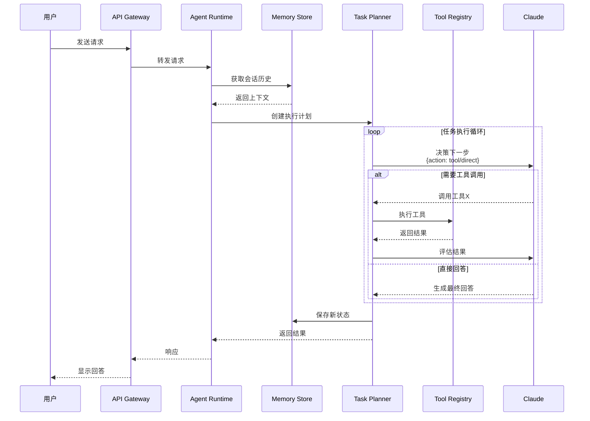
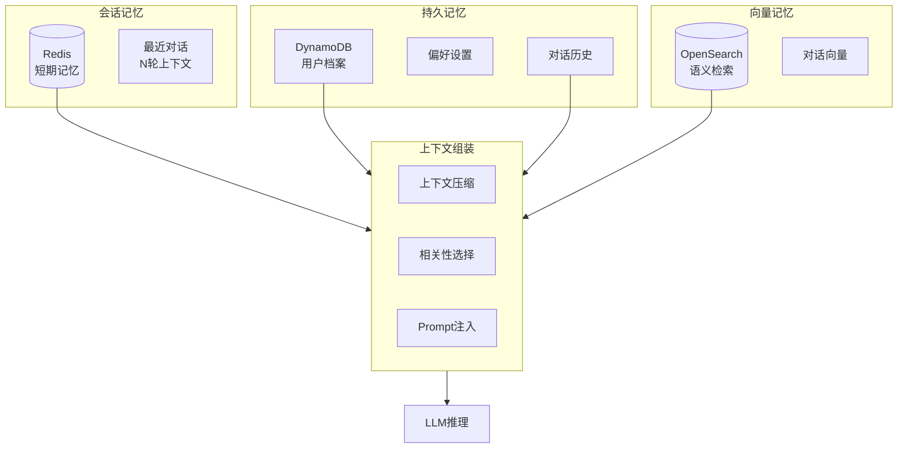

# Project 03: AgentCore 智能助手 (高级项目)

完整的 AgentCore 应用，展示 Runtime、Memory、Gateway、Observability 的集成。

## 🎯 项目目标

- 掌握 AgentCore 全组件开发
- 实现带记忆和工具的 Agent
- 生产级可观测性和安全

## 🏗️ 架构

### AgentCore 整体架构



### Agent 执行流程



### 记忆管理架构



### 可观测性数据流

```mermaid
flowchart LR
    subgraph Sources["数据来源"]
        AgentLogs[Agent日志]
        LLMCalls[LLM调用]
        ToolExec[工具执行]
        UserEvents[用户事件]
    end
    
    subgraph Collection["采集层"]
        CWLogs[CloudWatch Logs]
        XRay[X-Ray追踪]
        Embedded[嵌入式指标]
    end
    
    subgraph Analysis["分析层"]
        LogsInsights[Logs Insights]
        Traces[调用链分析]
        Metrics[指标聚合]
    end
    
    subgraph Visualization["可视化"]
        Dashboard[CloudWatch仪表板]
        Alerts[告警通知]
        Reports[性能报告]
    end
    
    Sources --> Collection
    Collection --> Analysis
    Analysis --> Visualization
```



## 📁 项目结构

```
03-agentcore-assistant/
├── backend/                    # AgentCore 后端
│   ├── src/
│   │   ├── agent.py           # Agent 核心逻辑
│   │   ├── memory_store.py    # 记忆管理
│   │   ├── tool_registry.py   # 工具注册
│   │   └── observability.py   # 监控埋点
│   ├── Dockerfile
│   └── requirements.txt
├── frontend/                   # React 前端
│   ├── src/
│   │   ├── components/
│   │   ├── pages/
│   │   └── services/
│   └── package.json
├── infra/                      # Terraform
│   ├── main.tf
│   ├── agentcore.tf
│   └── monitoring.tf
├── tools/                      # MCP 工具
│   ├── weather_tool/
│   ├── database_tool/
│   └── calculator_tool/
└── docker-compose.yml
```

## 🚀 快速开始

### 1. 本地开发

```bash
# 启动依赖服务
docker-compose up -d opensearch redis

# 安装后端依赖
cd backend
pip install -r requirements.txt

# 运行后端
python src/main.py

# 安装前端依赖
cd frontend
npm install
npm start
```

### 2. 部署到 AWS

```bash
# 部署 AgentCore Runtime
cd infra
terraform init
terraform apply

# 部署应用
cd ../backend
docker build -t agentcore-assistant .
docker push $ECR_REPO/agentcore-assistant:latest

# 更新 ECS 服务
aws ecs update-service --cluster agentcore --service assistant --force-new-deployment
```

## 📚 核心功能

### 1. 记忆管理

```python
# 短期记忆 - 会话上下文
session_memory.store(session_id, messages)

# 长期记忆 - 用户画像
persistent_memory.update(user_id, preferences)

# 语义检索
relevant_memories = memory.retrieve(query, user_id)
```

### 2. 工具调用

```python
# 注册工具
@tool_registry.register("weather")
def get_weather(location: str) -> dict:
    """获取天气信息"""
    return weather_api.query(location)

# Agent 自动决策调用
tools = tool_registry.get_available_tools()
```

### 3. 可观测性

```python
# 分布式追踪
with tracer.start_as_current_span("agent_invoke"):
    response = agent.process(input)

# 指标上报
metrics.record_latency(duration)
metrics.record_token_usage(tokens)
```

## 🔐 安全配置

- **Identity**: OIDC 集成，JWT 验证
- **Authorization**: Cedar Policy 细粒度控制
- **Network**: VPC 隔离，PrivateLink
- **Data**: KMS 加密，PII 脱敏

## 📊 监控仪表板

访问 `/dashboard` 查看：
- 实时对话统计
- Token 消耗趋势
- 工具调用成功率
- 响应延迟分布

## 🧪 测试

```bash
# 单元测试
pytest tests/

# 集成测试
pytest tests/integration/

# 负载测试
locust -f load_test.py
```
