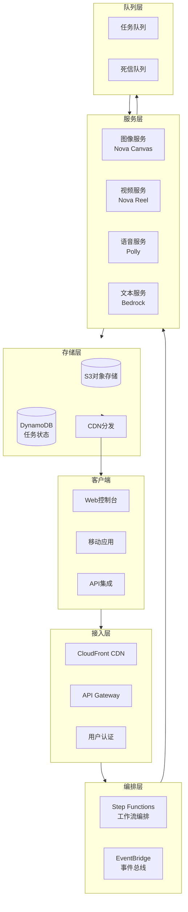
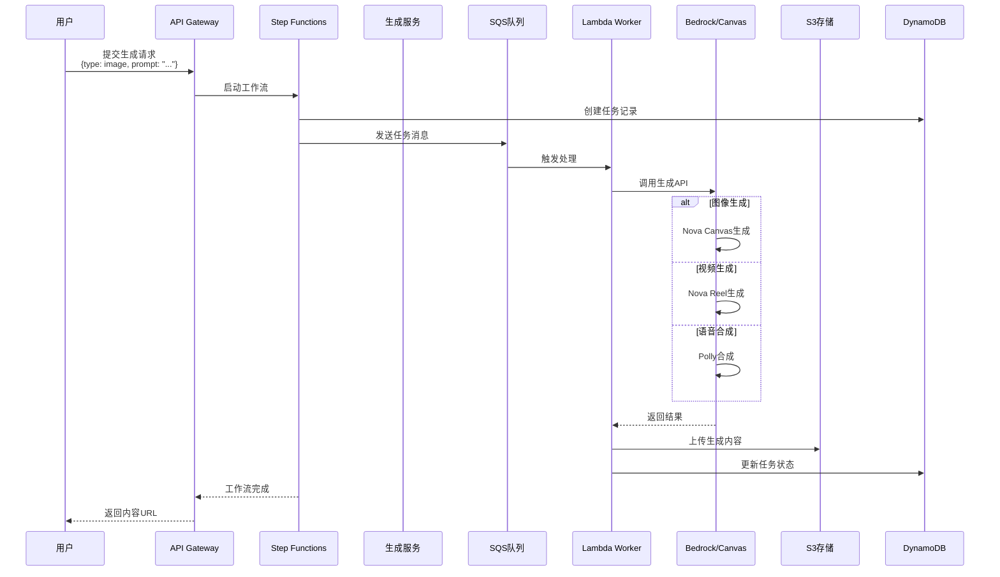
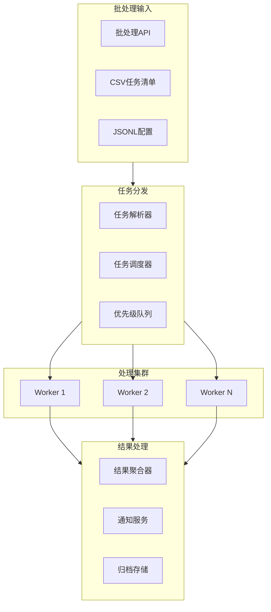
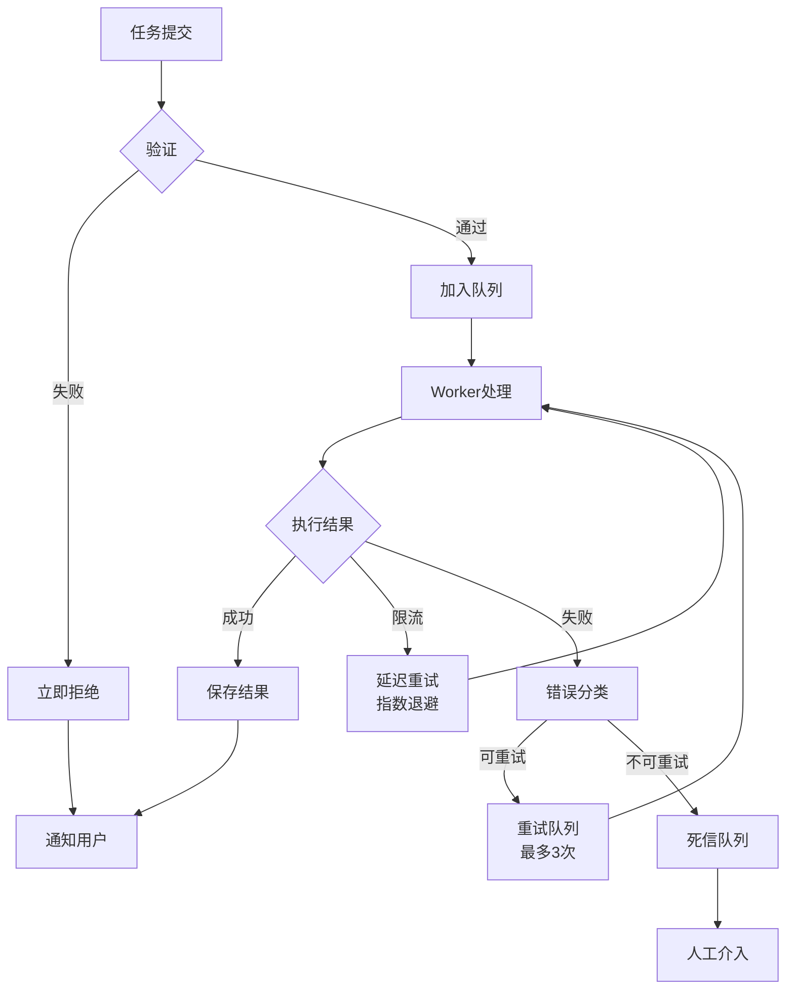

# Project 04: 多模态 AI 内容平台 (生产级项目)

企业级多模态内容生成平台，集成 Nova Canvas、Nova Reel、Transcribe、Polly。

## 🎯 项目目标

- 构建完整的多模态 AI 平台
- 实现内容生成工作流编排
- 支持批量处理和队列管理

## 🏗️ 架构

### 多模态平台整体架构



### 内容生成工作流



### 异步批处理架构



### 错误处理与重试机制



## 📁 项目结构

```
04-multimodal-platform/
├── services/                   # 微服务
│   ├── image-service/         # 图像生成服务
│   ├── video-service/         # 视频生成服务
│   ├── audio-service/         # 语音合成服务
│   └── workflow-service/      # 工作流编排服务
├── infra/                      # 基础设施
│   ├── terraform/
│   │   ├── main.tf
│   │   ├── vpc.tf
│   │   ├── ecs.tf
│   │   └── step_functions.tf
│   └── cloudformation/
├── web/                        # Web 控制台
│   ├── src/
│   └── package.json
├── workers/                    # 后台任务
│   ├── image_worker.py
│   ├── video_worker.py
│   └── audio_worker.py
├── shared/                     # 共享库
│   ├── models/
│   ├── utils/
│   └── constants.py
└── docs/                       # 文档
    ├── API.md
    ├── DEPLOYMENT.md
    └── ARCHITECTURE.md
```

## 🚀 快速开始

### 1. 环境准备

```bash
# 克隆仓库
git clone https://github.com/your-org/multimodal-platform.git
cd multimodal-platform

# 安装依赖
make install

# 配置环境变量
cp .env.example .env
# 编辑 .env 填写 AWS 凭证和配置
```

### 2. 本地运行

```bash
# 启动所有服务
make dev

# 或使用 Docker Compose
docker-compose up -d
```

### 3. 生产部署

```bash
# 部署基础设施
cd infra/terraform
terraform init
terraform apply

# 部署应用
make deploy-production
```

## 📚 API 示例

### 图像生成

```bash
curl -X POST https://api.example.com/v1/images \
  -H "Authorization: Bearer $TOKEN" \
  -H "Content-Type: application/json" \
  -d '{
    "prompt": "未来城市，赛博朋克风格",
    "width": 1280,
    "height": 720,
    "style": "cyberpunk"
  }'
```

### 视频生成

```bash
curl -X POST https://api.example.com/v1/videos \
  -H "Authorization: Bearer $TOKEN" \
  -d '{
    "prompt": "海浪拍打沙滩，日出时分",
    "duration": 6,
    "camera_move": "pan_right"
  }'
```

### 批量任务

```bash
curl -X POST https://api.example.com/v1/batch \
  -H "Authorization: Bearer $TOKEN" \
  -d '{
    "type": "image_variations",
    "base_prompt": "产品照片，白色背景",
    "variations": [
      {"style": "modern", "lighting": "soft"},
      {"style": "vintage", "lighting": "warm"}
    ]
  }'
```

## 💰 成本优化

| 策略 | 节省 | 实现方式 |
|------|------|----------|
| 智能缓存 | 40% | Redis 缓存相似请求 |
| 批量处理 | 30% | SQS 队列合并任务 |
| Spot 实例 | 60% | 非紧急任务使用 Spot |
| CDN 加速 | 20% | CloudFront 全球分发 |

## 🔒 企业级特性

- **多租户**: 数据隔离与配额管理
- **审计日志**: 完整操作记录
- **内容审核**: Guardrails 自动检测
- **数字水印**: C2PA 标记 AI 生成内容

## 📊 监控指标

- 生成成功率
- 平均等待时间
- Token/字符消耗
- 成本 per 请求
