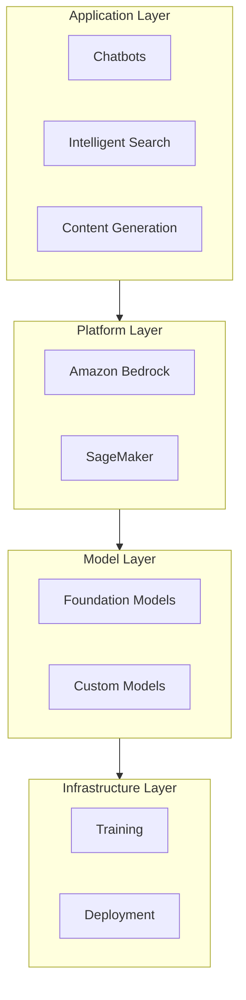
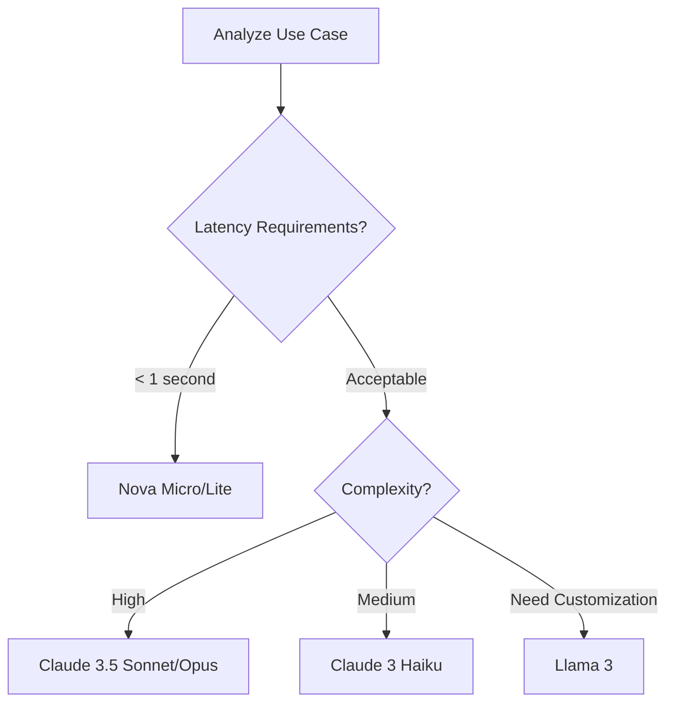
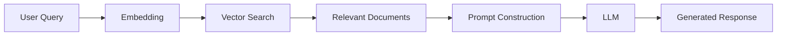
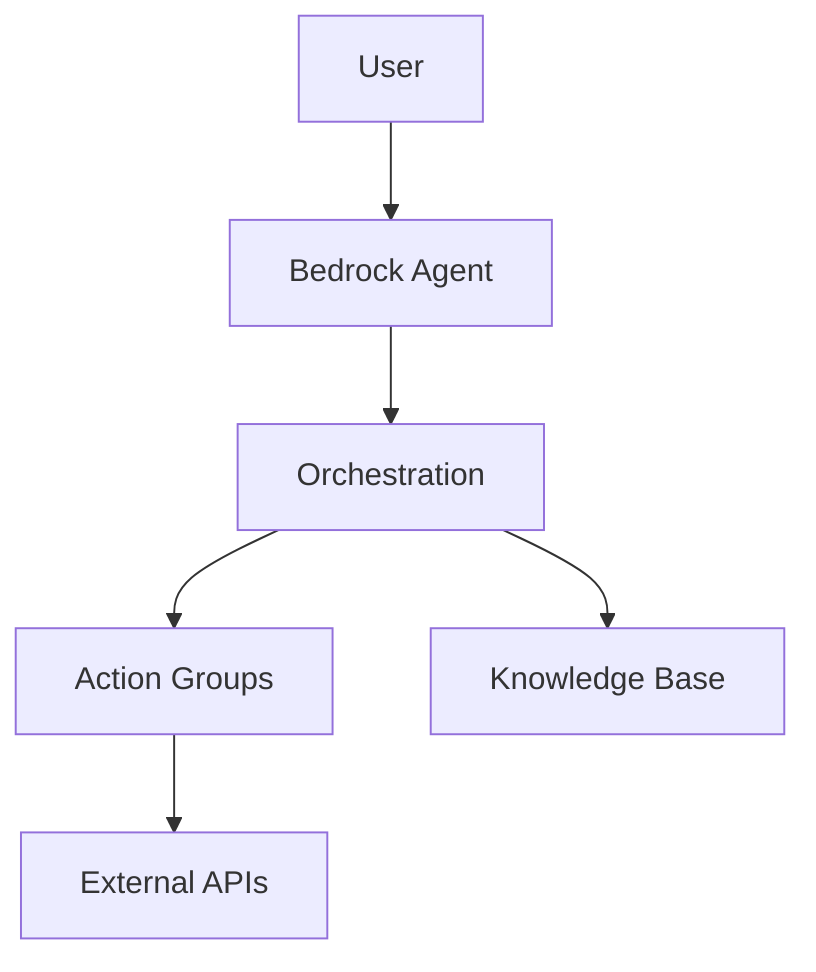
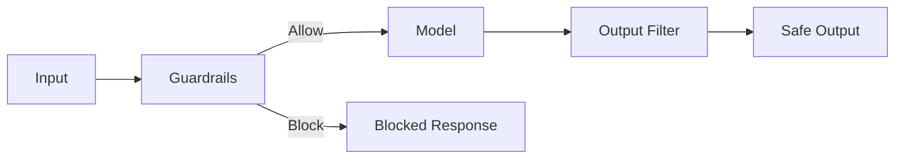
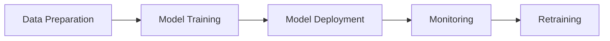
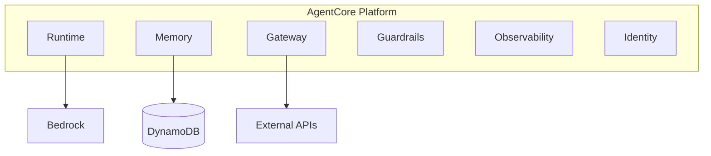

# AWS AI/ML Technical Whitepaper

> Complete Guide to Amazon Web Services AI/ML Stack

---

## Table of Contents

1. [AI/ML Overview](#1-aiml-overview)
2. [Amazon Bedrock Fundamentals](#2-amazon-bedrock-fundamentals)
3. [Foundation Models and Providers](#3-foundation-models-and-providers)
4. [Knowledge Bases for Amazon Bedrock](#4-knowledge-bases-for-amazon-bedrock)
5. [Amazon Bedrock Agents](#5-amazon-bedrock-agents)
6. [Guardrails and Safety](#6-guardrails-and-safety)
7. [Prompt Engineering](#7-prompt-engineering)
8. [Model Fine-tuning](#8-model-fine-tuning)
9. [Multimodal AI](#9-multimodal-ai)
10. [Amazon SageMaker](#10-amazon-sagemaker)
11. [AgentCore Platform](#11-agentcore-platform)
12. [Production Deployment](#12-production-deployment)
13. [Security and Compliance](#13-security-and-compliance)
14. [Cost Optimization](#14-cost-optimization)
15. [Monitoring and Observability](#15-monitoring-and-observability)
16. [Troubleshooting](#16-troubleshooting)
17. [Best Practices](#17-best-practices)
18. [Future Trends](#18-future-trends)

---

## 1. AI/ML Overview

### 1.1 The Generative AI Revolution

Generative AI refers to AI models that can create new content, including text, images, audio, and code. Large Language Models (LLMs) are the most prominent examples.

**Key Use Cases**:
- Content generation and summarization
- Code assistance and automation
- Customer support automation
- Knowledge retrieval and Q&A

### 1.2 AWS AI/ML Stack



---

## 2. Amazon Bedrock Fundamentals

### 2.1 Service Overview

Amazon Bedrock is a fully managed service that offers high-performing foundation models (FMs) through a single API.

**Key Features**:
- Multiple model providers (Anthropic, Meta, Amazon, Mistral)
- Unified API access
- Customization with private data
- Enterprise-grade security

### 2.2 Setting Up Model Access

```python
import boto3

# Create Bedrock client
bedrock = boto3.client('bedrock-runtime', region_name='us-east-1')

# Invoke model
response = bedrock.invoke_model(
    modelId='anthropic.claude-3-sonnet-20240229-v1:0',
    body={
        'messages': [
            {'role': 'user', 'content': 'Hello, Claude!'}
        ],
        'max_tokens': 256,
        'anthropic_version': 'bedrock-2023-05-31'
    }
)
```

---

## 3. Foundation Models and Providers

### 3.1 Model Comparison

| Provider | Model | Strengths | Best For |
|----------|-------|-----------|----------|
| **Anthropic** | Claude 3.5 Sonnet | Reasoning, 200K context | Complex reasoning, code generation |
| **Amazon** | Nova Pro | Cost-efficient, low latency | General purpose |
| **Meta** | Llama 4 | Open source, customizable | Custom model development |
| **Mistral AI** | Mistral Large | Multilingual, MoE | Multilingual applications |

### 3.2 Model Selection Guide



---

## 4. Knowledge Bases for Amazon Bedrock

### 4.1 RAG Architecture

Retrieval Augmented Generation (RAG) enhances LLM responses by leveraging external knowledge sources.



### 4.2 Data Sources

- Amazon S3
- Web Crawler
- Confluence
- Salesforce
- SharePoint

---

## 5. Amazon Bedrock Agents

### 5.1 Agent Architecture

Bedrock Agents automatically break down complex tasks, invoke APIs, and maintain conversation state.



### 5.2 Action Groups

```yaml
ActionGroups:
  - Name: OrderManagement
    Description: Order management APIs
    ApiSchema:
      S3:
        S3Uri: s3://my-bucket/api-schema.yaml
    ActionGroupExecutor:
      Lambda: arn:aws:lambda:...:function:orderAPI
```

---

## 6. Guardrails and Safety

### 6.1 Content Filtering



### 6.2 PII Detection and Masking

- Automatic PII detection
- Custom sensitive information types
- Masking and blocking policies

---

## 7. Prompt Engineering

### 7.1 Effective Prompt Principles

1. **Clear Instructions**: Specific and clear task definitions
2. **Context Provision**: Necessary background information
3. **Output Format Specification**: Expected response format
4. **Example Provision**: Few-shot prompting

### 7.2 Prompt Templates

```python
system_prompt = """You are a professional customer support assistant.
Follow these guidelines:
1. Always maintain a polite and empathetic tone
2. Explain technical terms in simple language
3. Keep responses concise (3-5 sentences)
4. Say "I don't know" honestly when unsure"""
```

---

## 8. Model Fine-tuning

### 8.1 Continued Pre-training (CPT)

Train models on domain-specific corpora.

```python
# Create fine-tuning job
response = bedrock.create_model_customization_job(
    jobName='domain-adaptation-job',
    customModelName='my-custom-model',
    roleArn='arn:aws:iam::...:role/BedrockFineTuningRole',
    baseModelIdentifier='amazon.titan-text-express-v1',
    trainingDataConfig={'s3Uri': 's3://my-bucket/training-data/'},
    validationDataConfig={'s3Uri': 's3://my-bucket/validation-data/'},
    hyperParameters={
        'epochCount': '3',
        'batchSize': '32',
        'learningRate': '0.00001'
    }
)
```

### 8.2 Supervised Fine-tuning (SFT)

Fine-tune using instruction-response pairs.

---

## 9. Multimodal AI

### 9.1 Nova Models

- **Nova Canvas**: Image generation
- **Nova Reel**: Video generation
- **Multimodal Understanding**: Image/video analysis

### 9.2 Use Cases

```python
# Image analysis
response = bedrock.invoke_model(
    modelId='amazon.nova-pro-v1:0',
    body={
        'messages': [
            {
                'role': 'user',
                'content': [
                    {'text': 'What is in this image?'},
                    {'image': {'source': {'bytes': image_bytes}}}
                ]
            }
        ]
    }
)
```

---

## 10. Amazon SageMaker

### 10.1 SageMaker vs Bedrock

| Aspect | SageMaker | Bedrock |
|--------|-----------|---------|
| Target Users | ML Engineers | Application Developers |
| Model Control | Full Control | API Level |
| Use Cases | Custom model dev | Rapid app development |

### 10.2 SageMaker Workflow



---

## 11. AgentCore Platform

### 11.1 Component Architecture



---

## 12. Production Deployment

### 12.1 Deployment Patterns

- **Blue/Green Deployment**: Zero downtime
- **Canary Release**: Gradual traffic shift
- **A/B Testing**: Compare model versions

### 12.2 Terraform Example

```hcl
resource "aws_bedrock_custom_model" "example" {
  model_name = "production-model"
  # ...
}

resource "aws_lambda_function" "bedrock_proxy" {
  function_name = "bedrock-api-proxy"
  runtime       = "python3.11"
  # ...
}
```

---

## 13. Security and Compliance

### 13.1 Data Protection

- Encryption at rest (KMS)
- Encryption in transit (TLS 1.3)
- PrivateLink support

### 13.2 Access Control

```json
{
    "Version": "2012-10-17",
    "Statement": [
        {
            "Effect": "Allow",
            "Action": [
                "bedrock:InvokeModel",
                "bedrock:InvokeModelWithResponseStream"
            ],
            "Resource": "arn:aws:bedrock:*::foundation-model/*",
            "Condition": {
                "StringEquals": {
                    "aws:RequestedRegion": "us-east-1"
                }
            }
        }
    ]
}
```

---

## 14. Cost Optimization

### 14.1 Pricing Models

| Service | Billing Components |
|---------|-------------------|
| Bedrock | Input tokens + Output tokens |
| SageMaker | Instance hours + Storage |
| Kendra | Document count + Query count |

### 14.2 Optimization Strategies

1. **Appropriate Model Selection**: Use optimal model for use case
2. **Caching**: Cache frequent queries
3. **Prompt Optimization**: Reduce token usage
4. **Batch Processing**: Process together for efficiency

---

## 15. Monitoring and Observability

### 15.1 CloudWatch Metrics

```python
# Send custom metrics
cloudwatch.put_metric_data(
    Namespace='Bedrock/Application',
    MetricData=[
        {
            'MetricName': 'TokenUsage',
            'Value': total_tokens,
            'Unit': 'Count',
            'Dimensions': [
                {'Name': 'ModelId', 'Value': model_id},
                {'Name': 'Application', 'Value': 'chatbot'}
            ]
        }
    ]
)
```

### 15.2 X-Ray Distributed Tracing

```python
from aws_xray_sdk.core import xray_recorder

@xray_recorder.capture('process_request')
def process_request(user_input):
    # Processing logic
    pass
```

---

## 16. Troubleshooting

### 16.1 Common Issues

| Symptom | Cause | Solution |
|---------|-------|----------|
| ThrottlingException | Rate limit exceeded | Backoff retry, request quota increase |
| ValidationException | Input size exceeded | Reduce prompt size |
| ModelTimeoutException | Processing time exceeded | Review timeout settings |
| AccessDeniedException | Insufficient IAM permissions | Check and update policies |

### 16.2 Debugging Techniques

```python
# Detailed logging
import logging

logger = logging.getLogger()
logger.setLevel(logging.DEBUG)

def lambda_handler(event, context):
    logger.debug(f"Received event: {json.dumps(event)}")
    # ...
```

---

## 17. Best Practices

### 17.1 Architecture Design

1. **Microservices**: Single responsibility principle
2. **Event-Driven**: Loosely coupled components
3. **Progressive Migration**: Minimize risk
4. **Monitoring**: Comprehensive observability

### 17.2 Operational Considerations

- Fallback strategies
- Model version management
- Data privacy measures
- Continuous performance evaluation

---

## 18. Future Trends

### 18.1 Emerging Trends

- **Multimodal AI**: Integration of text, image, audio, video
- **Agent AI**: Autonomous task execution
- **Edge AI**: On-premises inference
- **Sustainable AI**: Environmentally conscious model development

### 18.2 Recommended Resources

- [AWS ML Blog](https://aws.amazon.com/blogs/machine-learning/)
- [AWS Samples](https://github.com/aws-samples)
- [AWS Certifications](https://aws.amazon.com/certification/)

---

**Continue your AWS AI/ML learning journey!** 🚀

*Version: v1.0*  
*Last Updated: 2026-03-01*
