# AWS AI/ML Learning Roadmap

> 20-week plan to master AWS AI/ML

---

## 🗺️ Learning Path Overview

```mermaid
flowchart LR
    subgraph Foundation["Foundation<br/>Week 1-4"]
        F1[Gen AI Concepts]
        F2[Bedrock Intro]
        F3[Model Basics]
        F4[First API]
    end
    
    subgraph Core["Core<br/>Week 5-12"]
        C1[Knowledge Base]
        C2[Agents]
        C3[Guardrails]
        C4[Prompt Design]
    end
    
    subgraph Advanced["Advanced<br/>Week 13-16"]
        A1[Multimodal]
        A2[Fine-tuning]
        A3[SageMaker]
        A4[AgentCore]
    end
    
    subgraph Production["Production<br/>Week 17-20"]
        P1[Deployment]
        P2[Optimization]
        P3[Monitoring]
        P4[Capstone]
    end
    
    Foundation --> Core --> Advanced --> Production
```



---

## 📅 Detailed Study Plan

### Phase 1: Foundation (Week 1-4)

#### Week 1: Generative AI and AWS Introduction

**Learning Goals**: Understand generative AI basics

**Topics**:
- [ ] How generative AI works
- [ ] LLM fundamentals
- [ ] AWS AI/ML services overview
- [ ] AWS account setup and CLI installation

**Hands-on**:
```bash
# Install AWS CLI
pip install awscli
aws configure

# Verify Bedrock access
aws bedrock list-foundation-models --region us-east-1
```

**Time**: 5-7 hours

---

#### Week 2: Amazon Bedrock Fundamentals

**Learning Goals**: Master Bedrock core concepts

**Topics**:
- [ ] Bedrock service architecture
- [ ] Model providers and selection
- [ ] Basic API operations
- [ ] Tokens and pricing model

**Hands-on**:
1. Create Bedrock client with boto3
2. First model invocation
3. Compare different models

**Project**: Simple chatbot

**Time**: 8-10 hours

---

#### Week 3: Prompt Engineering Basics

**Learning Goals**: Design effective prompts

**Topics**:
- [ ] Prompt components
- [ ] Zero-shot vs Few-shot
- [ ] System prompts
- [ ] Chain-of-Thought

**Hands-on**:
1. Experiment with prompt patterns
2. Design system prompts
3. Create few-shot examples

**Time**: 6-8 hours

---

#### Week 4: First Production App

**Learning Goals**: Build with API Gateway + Lambda

**Topics**:
- [ ] API Gateway integration
- [ ] Lambda function creation
- [ ] Error handling
- [ ] CloudWatch logging

**Project**: REST API chatbot

**Time**: 10-12 hours

---

### Phase 2: Core (Week 5-12)

#### Week 5-6: Knowledge Bases for Amazon Bedrock

**Learning Goals**: Build RAG systems

**Topics**:
- [ ] RAG architecture
- [ ] Vector databases
- [ ] Data source connections (S3, Web Crawler)
- [ ] Retrieve API usage

**Hands-on**:
1. Create knowledge base
2. Upload and sync documents
3. Optimize search quality

**Project**: Enterprise document search

**Time**: 15-18 hours

---

#### Week 7-8: Amazon Bedrock Agents

**Learning Goals**: Build intelligent agents

**Topics**:
- [ ] Agents architecture
- [ ] Action groups
- [ ] API schema design
- [ ] Session management

**Hands-on**:
1. Create and configure agent
2. Implement Lambda actions
3. Integrate with knowledge base

**Project**: Order management agent

**Time**: 15-18 hours

---

#### Week 9-10: Guardrails and Safety

**Learning Goals**: Build safe AI applications

**Topics**:
- [ ] Content filtering
- [ ] PII detection and masking
- [ ] Denied topics
- [ ] Word filters

**Hands-on**:
1. Create and test guardrails
2. Configure custom denied topics
3. Implement PII masking

**Time**: 10-12 hours

---

#### Week 11-12: Advanced Prompt Design

**Learning Goals**: Design production-grade prompts

**Topics**:
- [ ] Prompt versioning
- [ ] A/B testing
- [ ] Prompt chaining
- [ ] Output parsing

**Hands-on**:
1. Build prompt management system
2. Design structured outputs
3. Implement complex workflows

**Time**: 12-15 hours

---

### Phase 3: Advanced (Week 13-16)

#### Week 13: Multimodal AI

**Learning Goals**: Work with images, video, audio

**Topics**:
- [ ] Nova Canvas (image generation)
- [ ] Nova Reel (video generation)
- [ ] Image understanding
- [ ] Multimodal prompts

**Hands-on**:
1. Build image generation app
2. Create image analysis pipeline

**Time**: 8-10 hours

---

#### Week 14: Model Fine-tuning

**Learning Goals**: Create custom models

**Topics**:
- [ ] Continued Pre-training (CPT)
- [ ] Supervised Fine-tuning (SFT)
- [ ] Training data preparation
- [ ] Evaluation and validation

**Hands-on**:
1. Create fine-tuning job
2. Evaluate custom model
3. Deploy model

**Time**: 10-12 hours

---

#### Week 15: Amazon SageMaker

**Learning Goals**: Develop custom ML models

**Topics**:
- [ ] SageMaker basics
- [ ] Notebook instances
- [ ] Model training
- [ ] Endpoint deployment

**Hands-on**:
1. Create SageMaker notebook
2. Train sample model

**Time**: 8-10 hours

---

#### Week 16: AgentCore Platform

**Learning Goals**: Understand enterprise agent platform

**Topics**:
- [ ] AgentCore architecture
- [ ] Runtime, Memory, Gateway
- [ ] Observability and Guardrails
- [ ] Identity and security

**Time**: 8-10 hours

---

### Phase 4: Production (Week 17-20)

#### Week 17: Production Deployment

**Learning Goals**: Deploy to production

**Topics**:
- [ ] CI/CD pipelines
- [ ] Infrastructure as Code (Terraform/SAM)
- [ ] Blue/Green deployment
- [ ] Rollback strategies

**Hands-on**:
1. Create Terraform configs
2. Setup GitHub Actions CI/CD

**Time**: 10-12 hours

---

#### Week 18: Performance Optimization

**Learning Goals**: Optimize cost and performance

**Topics**:
- [ ] Caching strategies
- [ ] Model selection optimization
- [ ] Parallel processing
- [ ] Token usage optimization

**Time**: 8-10 hours

---

#### Week 19: Monitoring and Operations

**Learning Goals**: Monitor production workloads

**Topics**:
- [ ] CloudWatch dashboards
- [ ] X-Ray distributed tracing
- [ ] Custom metrics
- [ ] Alerting

**Hands-on**:
1. Build comprehensive monitoring dashboard
2. Set up alert rules

**Time**: 8-10 hours

---

#### Week 20: Capstone Project

**Learning Goals**: End-to-end application

**Project Options**:

**Option A: Enterprise RAG Chatbot**
- Multi-data source integration
- Advanced prompt design
- Security and compliance
- Monitoring and analytics

**Option B: AI Workflow Automation**
- Bedrock Agents workflow
- External system integration
- State management
- Error handling and recovery

**Option C: Multimodal Content Platform**
- Image/video generation
- Content management
- User authentication
- Payment integration

**Time**: 20-25 hours

---

## 📊 Progress Tracking

Checklist for tracking your learning:

### Foundation
- [ ] Week 1: Gen AI Concepts
- [ ] Week 2: Bedrock Basics
- [ ] Week 3: Prompt Engineering
- [ ] Week 4: First App

### Core
- [ ] Week 5-6: Knowledge Base
- [ ] Week 7-8: Agents
- [ ] Week 9-10: Guardrails
- [ ] Week 11-12: Advanced Prompts

### Advanced
- [ ] Week 13: Multimodal
- [ ] Week 14: Fine-tuning
- [ ] Week 15: SageMaker
- [ ] Week 16: AgentCore

### Production
- [ ] Week 17: Deployment
- [ ] Week 18: Optimization
- [ ] Week 19: Monitoring
- [ ] Week 20: Capstone

---

## 📚 Recommended Resources

### Official Documentation
- [AWS Bedrock Documentation](https://docs.aws.amazon.com/bedrock/)
- [AWS SageMaker Documentation](https://docs.aws.amazon.com/sagemaker/)
- [AWS ML Blog](https://aws.amazon.com/blogs/machine-learning/)

### Community Resources
- [AWS Samples](https://github.com/aws-samples)
- [AWS Community](https://aws.amazon.com/developer/community/)

### Certifications
- **AWS Certified AI Practitioner**
- **AWS Certified Machine Learning - Associate**
- **AWS Certified Machine Learning - Specialty**

---

## 💡 Learning Tips

1. **Set weekly goals**: Allocate 10-15 hours per week
2. **Practice hands-on**: Build while learning
3. **Project-based**: Create apps that solve real problems
4. **Join community**: Ask questions and share knowledge
5. **Regular review**: Revisit past content periodically

---

**Start your AWS AI/ML journey!** 🚀

*Roadmap Version: v1.0*  
*Estimated Total Time: 200-250 hours*  
*Recommended Pace: 10-15 hours/week*
