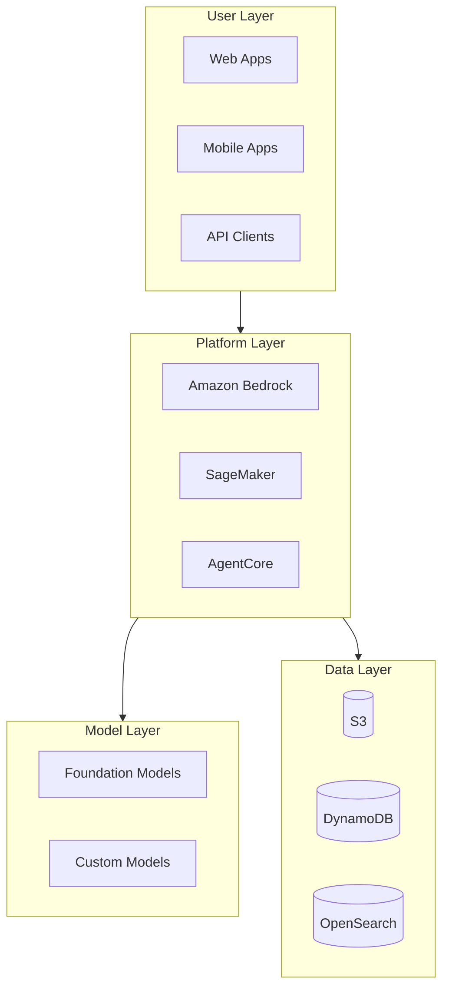

# AWS AI/ML Technical Resources Navigation

> Comprehensive learning resources for AWS Artificial Intelligence and Machine Learning

---

## 📚 Resource Overview

This topic covers Amazon Web Services (AWS) AI and Machine Learning services, including:

- **Amazon Bedrock** - Foundation model platform
- **Amazon SageMaker** - ML development platform
- **Amazon Bedrock AgentCore** - Enterprise agent platform
- **Speech AI** - Voice services (Transcribe, Polly)

---

## 🏗️ Architecture Overview



---

## 📖 Document List

### E-books (ebooks/)

| Document | Description | Use Case |
|----------|-------------|----------|
| `AWS_AI_ML_Ebook.md` | **Main Whitepaper** - Systematic technical guide | Deep learning, comprehensive reference |
| `Quick_Reference.md` | **Quick Reference** - One-page cheat sheet | Daily development, quick lookup |
| `Learning_Roadmap.md` | **Learning Roadmap** - 20-week study plan | Structured learning |

### Technical Documents (materials/)

| Document | Content |
|----------|---------|
| `aws_bedrock_foundation_models_blog_material.md` | Bedrock Foundation Models |
| `aws_bedrock_guardrails_blog_material.md` | Safety and Guardrails |
| `aws_bedrock_knowledge_bases_blog_material.md` | RAG Knowledge Bases |
| `aws_bedrock_agents_blog_material.md` | Intelligent Agents |
| `aws_agentcore_blog_material.md` | AgentCore Platform |
| `aws_sagemaker_blog_material.md` | ML Platform |
| `aws_transcribe_polly_blog_material.md` | Speech AI |

---

## 💻 Practice Projects

| Project | Difficulty | Tech Stack |
|---------|------------|------------|
| Intelligent Chatbot | ⭐ Beginner | Lambda + Bedrock |
| RAG Assistant | ⭐⭐ Intermediate | Knowledge Bases + DynamoDB |
| AgentCore Assistant | ⭐⭐⭐ Advanced | Enterprise Agent Platform |
| Multimodal Platform | ⭐⭐⭐⭐ Expert | Image/Video/Audio Processing |

---

## 🚀 Quick Start

### For Learners

```bash
cd en/ebooks/
cat README.md
```

### Recommended Learning Path

1. **Beginners**: Learning_Roadmap.md → Week 1-4
2. **Intermediate**: AWS_AI_ML_Ebook.md Chapters 5-12
3. **Advanced**: Full book + Practice Projects

---

**Start your AWS AI/ML journey!** 🚀
