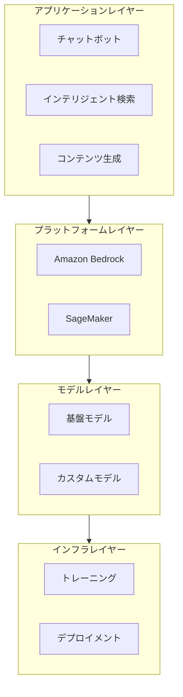
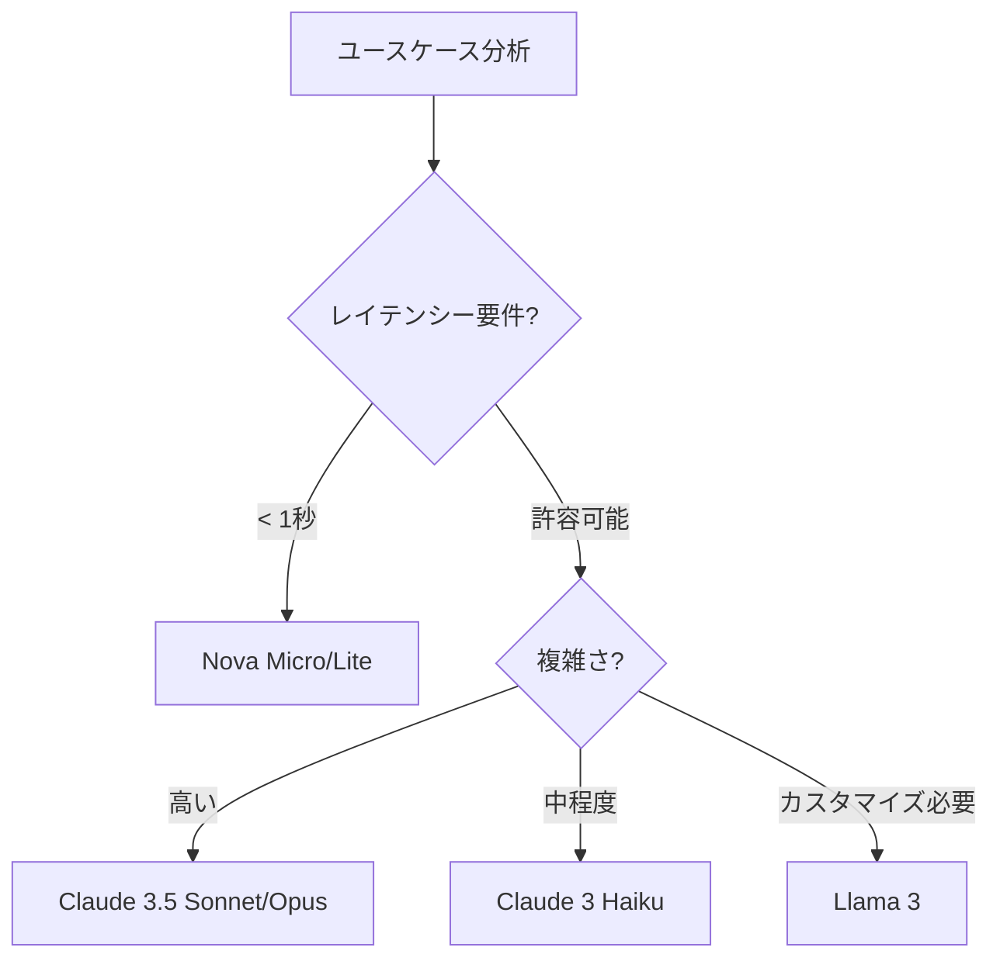
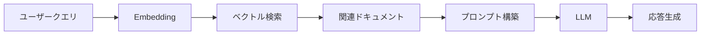
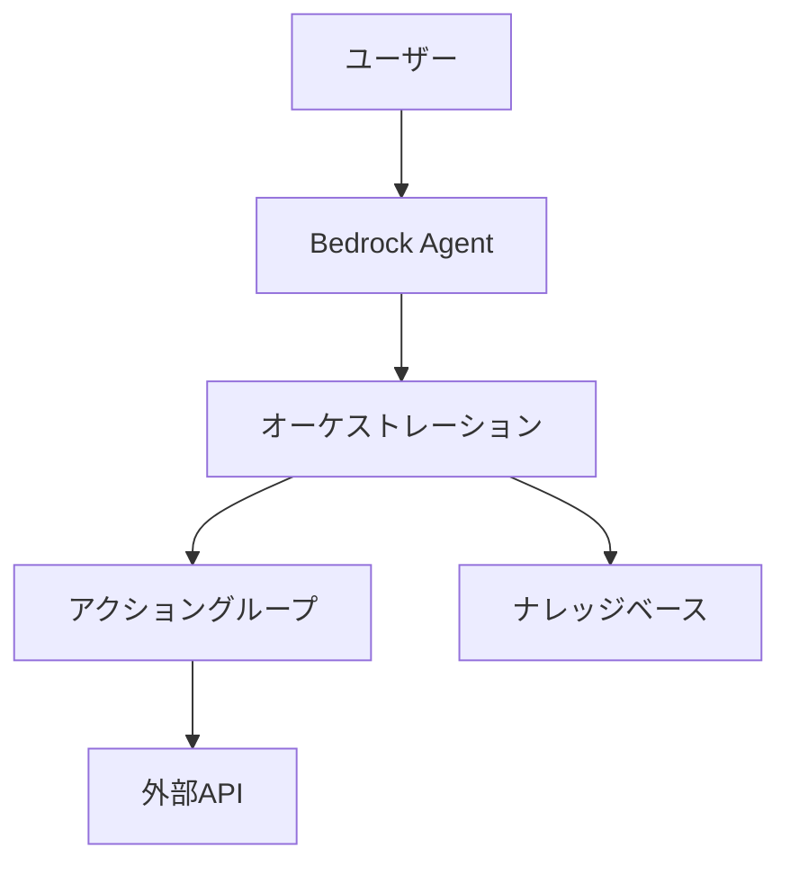
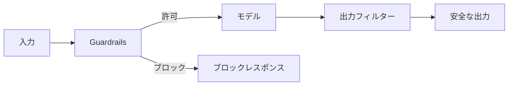
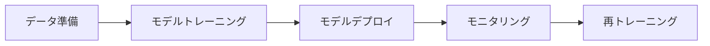
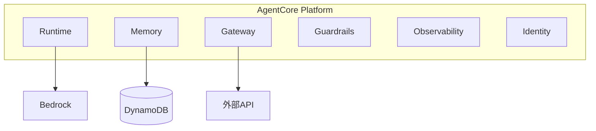

# AWS AI/ML 技術白書

> Amazon Web Services AI/ML スタック完全ガイド

---

## 目次

1. [AI/ML 概論](#1-aiml-概論)
2. [Amazon Bedrock 基礎](#2-amazon-bedrock-基礎)
3. [基盤モデルとプロバイダー](#3-基盤モデルとプロバイダー)
4. [Knowledge Bases for Amazon Bedrock](#4-knowledge-bases-for-amazon-bedrock)
5. [Amazon Bedrock Agents](#5-amazon-bedrock-agents)
6. [Guardrails と安全性](#6-guardrails-と安全性)
7. [プロンプトエンジニアリング](#7-プロンプトエンジニアリング)
8. [モデルファインチューニング](#8-モデルファインチューニング)
9. [マルチモーダル AI](#9-マルチモーダル-ai)
10. [Amazon SageMaker](#10-amazon-sagemaker)
11. [AgentCore プラットフォーム](#11-agentcore-プラットフォーム)
12. [本番展開と運用](#12-本番展開と運用)
13. [セキュリティとコンプライアンス](#13-セキュリティとコンプライアンス)
14. [コスト最適化](#14-コスト最適化)
15. [モニタリングとオブザーバビリティ](#15-モニタリングとオブザーバビリティ)
16. [トラブルシューティング](#16-トラブルシューティング)
17. [ベストプラクティス](#17-ベストプラクティス)
18. [今後の展望](#18-今後の展望)

---

## 1. AI/ML 概論

### 1.1 生成 AI の革命

生成 AI (Generative AI) は、テキスト、画像、音声、コードなどの新しいコンテンツを作成できる AI モデルです。大規模言語モデル (LLM) は、この分野で最も注目されています。

**主なユースケース**:
- コンテンツ生成と要約
- コード支援と自動化
- カスタマーサポート自動化
- 知識検索とQ&A

### 1.2 AWS AI/ML スタック



---

## 2. Amazon Bedrock 基礎

### 2.1 サービス概要

Amazon Bedrock は、AWS が提供するフルマネージドサービスで、API 経由で高性能な基盤モデル (FM) を利用できます。

**主な特徴**:
- 複数のモデルプロバイダー (Anthropic, Meta, Amazon, Mistral など)
- 単一 API で統合アクセス
- プライベートデータでのカスタマイズ
- エンタープライズグレードのセキュリティ

### 2.2 モデルアクセスの設定

```python
import boto3

# Bedrock クライアントの作成
bedrock = boto3.client('bedrock-runtime', region_name='us-east-1')

# モデルの呼び出し
response = bedrock.invoke_model(
    modelId='anthropic.claude-3-sonnet-20240229-v1:0',
    body={
        'messages': [
            {'role': 'user', 'content': 'こんにちは、Claude!'}
        ],
        'max_tokens': 256,
        'anthropic_version': 'bedrock-2023-05-31'
    }
)
```

---

## 3. 基盤モデルとプロバイダー

### 3.1 モデル比較

| プロバイダー | モデル | 強み | 用途 |
|------------|--------|------|------|
| **Anthropic** | Claude 3.5 Sonnet | 推論能力、200K コンテキスト | 複雑な推論、コード生成 |
| **Amazon** | Nova Pro | コスト効率、低レイテンシー | 汎用シナリオ |
| **Meta** | Llama 4 | オープンソース、カスタマイズ可能 | 独自モデル開発 |
| **Mistral AI** | Mistral Large | 多言語、MoE アーキテクチャ | 多言語アプリケーション |

### 3.2 モデル選択の指針



---

## 4. Knowledge Bases for Amazon Bedrock

### 4.1 RAG アーキテクチャ

Retrieval Augmented Generation (RAG) は、外部知識ソースを活用して LLM の応答を強化する手法です。



### 4.2 データソース

- Amazon S3
- Web Crawler
- Confluence
- Salesforce
- SharePoint

---

## 5. Amazon Bedrock Agents

### 5.1 エージェントアーキテクチャ

Bedrock Agents は、複雑なタスクを自動的に分解し、API を呼び出し、会話状態を維持するフルマネージドサービスです。



### 5.2 アクショングループ

```yaml
ActionGroups:
  - Name: OrderManagement
    Description: 注文管理API
    ApiSchema:
      S3:
        S3Uri: s3://my-bucket/api-schema.yaml
    ActionGroupExecutor:
      Lambda: arn:aws:lambda:...:function:orderAPI
```

---

## 6. Guardrails と安全性

### 6.1 コンテンツフィルタリング



### 6.2 PII 検出とマスキング

- 個人情報の自動検出
- カスタムセンシティブ情報タイプ
- マスキングと拒否ポリシー

---

## 7. プロンプトエンジニアリング

### 7.1 効果的なプロンプトの原則

1. **明確な指示**: 具体的で明確なタスク定義
2. **コンテキスト提供**: 必要な背景情報
3. **出力形式の指定**: 期待される応答形式
4. **例の提示**: Few-shot プロンプティング

### 7.2 プロンプトテンプレート

```python
system_prompt = """あなたは専門的なカスタマーサポートアシスタントです。
以下のガイドラインに従ってください:
1. 常に丁寧で共感的なトーンを保つ
2. 技術的な用語は分かりやすく説明する
3. 回答は3-5文に簡潔にまとめる
4. 不明な場合は正直に「わかりません」と伝える"""
```

---

## 8. モデルファインチューニング

### 8.1 継続的事前学習 (CPT)

ドメイン固有のコーパスを使用してモデルを追加トレーニングします。

```python
# ファインチューニングジョブの作成
response = bedrock.create_model_customization_job(
    jobName='domain-adaptation-job',
    customModelName='my-custom-model',
    roleArn='arn:aws:iam::...:role/BedrockFineTuningRole',
    baseModelIdentifier='amazon.titan-text-express-v1',
    trainingDataConfig={'s3Uri': 's3://my-bucket/training-data/'},
    validationDataConfig={'s3Uri': 's3://my-bucket/validation-data/'},
    hyperParameters={
        'epochCount': '3',
        'batchSize': '32',
        'learningRate': '0.00001'
    }
)
```

### 8.2 教師ありファインチューニング (SFT)

命令と応答のペアを使用してモデルを調整します。

---

## 9. マルチモーダル AI

### 9.1 Nova モデル

- **Nova Canvas**: 画像生成
- **Nova Reel**: ビデオ生成
- **マルチモーダル理解**: 画像・ビデオ分析

### 9.2 ユースケース

```python
# 画像分析
response = bedrock.invoke_model(
    modelId='amazon.nova-pro-v1:0',
    body={
        'messages': [
            {
                'role': 'user',
                'content': [
                    {'text': 'この画像に何が写っていますか？'},
                    {'image': {'source': {'bytes': image_bytes}}}
                ]
            }
        ]
    }
)
```

---

## 10. Amazon SageMaker

### 10.1 SageMaker vs Bedrock

| 項目 | SageMaker | Bedrock |
|------|-----------|---------|
| 対象ユーザー | ML エンジニア | アプリケーション開発者 |
| モデル制御 | 完全制御 | API レベル |
| 使用シナリオ | カスタムモデル開発 | 迅速なアプリケーション構築 |

### 10.2 SageMaker ワークフロー



---

## 11. AgentCore プラットフォーム

### 11.1 コンポーネント構成



---

## 12. 本番展開と運用

### 12.1 デプロイメントパターン

- **ブルー/グリーンデプロイメント**: ゼロダウンタイム
- **カナリーリリース**: 段階的なトラフィックシフト
- **A/B テスト**: 異なるモデルバージョンの比較

### 12.2 Terraform 構成例

```hcl
resource "aws_bedrock_custom_model" "example" {
  model_name = "production-model"
  # ...
}

resource "aws_lambda_function" "bedrock_proxy" {
  function_name = "bedrock-api-proxy"
  runtime       = "python3.11"
  # ...
}
```

---

## 13. セキュリティとコンプライアンス

### 13.1 データ保護

- 保存時の暗号化 (KMS)
- 転送中の暗号化 (TLS 1.3)
- プライベートリンク対応

### 13.2 アクセス制御

```json
{
    "Version": "2012-10-17",
    "Statement": [
        {
            "Effect": "Allow",
            "Action": [
                "bedrock:InvokeModel",
                "bedrock:InvokeModelWithResponseStream"
            ],
            "Resource": "arn:aws:bedrock:*:*:foundation-model/*",
            "Condition": {
                "StringEquals": {
                    "aws:RequestedRegion": "ap-northeast-1"
                }
            }
        }
    ]
}
```

---

## 14. コスト最適化

### 14.1 料金モデル

| サービス | 課金項目 |
|----------|----------|
| Bedrock | 入力トークン + 出力トークン |
| SageMaker | インスタンス時間 + ストレージ |
| Kendra | ドキュメント数 + クエリ数 |

### 14.2 最適化戦略

1. **適切なモデル選択**: ユースケースに最適なモデルを使用
2. **キャッシング**: 頻出クエリのキャッシュ
3. **プロンプト最適化**: トークン数の削減
4. **バッチ処理**: まとめて処理して効率化

---

## 15. モニタリングとオブザーバビリティ

### 15.1 CloudWatch メトリクス

```python
# カスタムメトリクスの送信
cloudwatch.put_metric_data(
    Namespace='Bedrock/Application',
    MetricData=[
        {
            'MetricName': 'TokenUsage',
            'Value': total_tokens,
            'Unit': 'Count',
            'Dimensions': [
                {'Name': 'ModelId', 'Value': model_id},
                {'Name': 'Application', 'Value': 'chatbot'}
            ]
        }
    ]
)
```

### 15.2 X-Ray 分散トレーシング

```python
from aws_xray_sdk.core import xray_recorder

@xray_recorder.capture('process_request')
def process_request(user_input):
    # 処理ロジック
    pass
```

---

## 16. トラブルシューティング

### 16.1 一般的な問題

| 症状 | 原因 | 解決策 |
|------|------|--------|
| ThrottlingException | レート制限超過 | バックオフ再試行、クォータ引き上げ |
| ValidationException | 入力サイズ超過 | プロンプトサイズの縮小 |
| ModelTimeoutException | 処理時間超過 | タイムアウト設定の見直し |
| AccessDeniedException | IAM 権限不足 | ポリシーの確認と更新 |

### 16.2 デバッグ手法

```python
# 詳細なログ記録
import logging

logger = logging.getLogger()
logger.setLevel(logging.DEBUG)

def lambda_handler(event, context):
    logger.debug(f"Received event: {json.dumps(event)}")
    # ...
```

---

## 17. ベストプラクティス

### 17.1 アーキテクチャ設計

1. **マイクロサービス化**: 単一責任の原則
2. **イベント駆動**: 疎結合なコンポーネント
3. **段階的移行**: リスクを最小化
4. **モニタリング**: 包括的な可観測性

### 17.2 運用上の考慮事項

- フォールバック戦略の準備
- モデルバージョンの管理
- データプライバシー対策
- 継続的な性能評価

---

## 18. 今後の展望

### 18.1 トレンド

- **マルチモーダル AI**: テキスト、画像、音声、動画の統合
- **エージェント AI**: 自律的なタスク実行
- **エッジ AI**: オンプレミスでの推論
- **持続可能な AI**: 環境に配慮したモデル開発

### 18.2 推奨リソース

- [AWS ML ブログ](https://aws.amazon.com/blogs/machine-learning/)
- [AWS サンプルコード](https://github.com/aws-samples)
- [AWS 認定資格](https://aws.amazon.com/certification/)

---

**AWS AI/ML の学習を続けましょう！** 🚀

*バージョン: v1.0*  
*最終更新: 2026-03-01*
