# AWS AI/ML 学習ロードマップ

> 20週間で AWS AI/ML をマスターする学習計画

---

## 🗺️ 学習パス概要

```mermaid
flowchart LR
    subgraph Foundation["基礎段階<br/>Week 1-4"]
        F1[生成AI概念]
        F2[Bedrock入門]
        F3[モデル基礎]
        F4[最初のAPI]
    end
    
    subgraph Core["コア段階<br/>Week 5-12"]
        C1[Knowledge Base]
        C2[Agents]
        C3[Guardrails]
        C4[プロンプト設計]
    end
    
    subgraph Advanced["応用段階<br/>Week 13-16"]
        A1[マルチモーダル]
        A2[ファインチューニング]
        A3[SageMaker]
        A4[AgentCore]
    end
    
    subgraph Production["実践段階<br/>Week 17-20"]
        P1[本番展開]
        P2[最適化]
        P3[モニタリング]
        P4[総合プロジェクト]
    end
    
    Foundation --> Core --> Advanced --> Production
```



---

## 📅 詳細学習計画

### 第1フェーズ: 基礎段階 (Week 1-4)

#### Week 1: 生成 AI と AWS 入門

**学習目標**: 生成 AI の基本概念を理解する

**学習内容**:
- [ ] 生成 AI の仕組み
- [ ] LLM (大規模言語モデル) の基礎
- [ ] AWS AI/ML サービス概要
- [ ] AWS アカウント設定と CLI インストール

**実践タスク**:
```bash
# AWS CLI のインストール
pip install awscli
aws configure

# Bedrock へのアクセス確認
aws bedrock list-foundation-models --region us-east-1
```

**所要時間**: 5-7時間

---

#### Week 2: Amazon Bedrock 基礎

**学習目標**: Bedrock のコアコンセプトを習得する

**学習内容**:
- [ ] Bedrock サービスアーキテクチャ
- [ ] モデルプロバイダーと選択
- [ ] API の基本操作
- [ ] トークンと料金モデル

**実践タスク**:
1. boto3 で Bedrock クライアントを作成
2. 最初のモデル呼び出し
3. 異なるモデルの比較テスト

**プロジェクト**: シンプルなチャットボット

**所要時間**: 8-10時間

---

#### Week 3: プロンプトエンジニアリング基礎

**学習目標**: 効果的なプロンプトを設計する

**学習内容**:
- [ ] プロンプトの構成要素
- [ ] Zero-shot と Few-shot
- [ ] システムプロンプト
- [ ] Chain-of-Thought

**実践タスク**:
1. 各種プロンプトパターンの実験
2. システムプロンプトの設計
3. Few-shot 例の作成

**所要時間**: 6-8時間

---

#### Week 4: 最初の本格アプリ

**学習目標**: API Gateway + Lambda でアプリケーションを構築

**学習内容**:
- [ ] API Gateway 統合
- [ ] Lambda 関数の作成
- [ ] エラーハンドリング
- [ ] CloudWatch ロギング

**プロジェクト**: REST API チャットボットの完成

**所要時間**: 10-12時間

---

### 第2フェーズ: コア段階 (Week 5-12)

#### Week 5-6: Knowledge Bases for Amazon Bedrock

**学習目標**: RAG (検索拡張生成) システムを構築

**学習内容**:
- [ ] RAG アーキテクチャ
- [ ] ベクトルデータベース
- [ ] データソースの接続 (S3, Web Crawler)
- [ ] Retrieve API の使用

**実践タスク**:
1. ナレッジベースの作成
2. ドキュメントのアップロードと同期
3. 検索品質の最適化

**プロジェクト**: 社内文書検索システム

**所要時間**: 15-18時間

---

#### Week 7-8: Amazon Bedrock Agents

**学習目標**: インテリジェントエージェントを構築

**学習内容**:
- [ ] Agents アーキテクチャ
- [ ] アクショングループ
- [ ] API スキーマ設計
- [ ] セッション管理

**実践タスク**:
1. エージェントの作成と設定
2. Lambda アクションの実装
3. ナレッジベースとの統合

**プロジェクト**: 注文管理エージェント

**所要時間**: 15-18時間

---

#### Week 9-10: Guardrails と安全性

**学習目標**: 安全な AI アプリケーションを構築

**学習内容**:
- [ ] コンテンツフィルタリング
- [ ] PII 検出とマスキング
- [ ] 拒否トピック
- [ ] 単語フィルター

**実践タスク**:
1. ガードレールの作成とテスト
2. カスタム拒否トピックの設定
3. PII マスキングの実装

**所要時間**: 10-12時間

---

#### Week 11-12: 高度なプロンプト設計

**学習目標**: プロダクションレベルのプロンプトを設計

**学習内容**:
- [ ] プロンプトバージョニング
- [ ] A/B テスト
- [ ] プロンプトチェーン
- [ ] 出力パーシング

**実践タスク**:
1. プロンプト管理システムの構築
2. 構造化出力の設計
3. 複雑なワークフローの実装

**所要時間**: 12-15時間

---

### 第3フェーズ: 応用段階 (Week 13-16)

#### Week 13: マルチモーダル AI

**学習目標**: 画像・動画・音声を扱う

**学習内容**:
- [ ] Nova Canvas (画像生成)
- [ ] Nova Reel (動画生成)
- [ ] 画像理解と分析
- [ ] マルチモーダルプロンプト

**実践タスク**:
1. 画像生成アプリの作成
2. 画像分析パイプラインの構築

**所要時間**: 8-10時間

---

#### Week 14: モデルファインチューニング

**学習目標**: カスタムモデルを作成

**学習内容**:
- [ ] 継続的事前学習 (CPT)
- [ ] 教師ありファインチューニング (SFT)
- [ ] トレーニングデータの準備
- [ ] 評価と検証

**実践タスク**:
1. ファインチューニングジョブの作成
2. カスタムモデルの評価
3. モデルのデプロイ

**所要時間**: 10-12時間

---

#### Week 15: Amazon SageMaker

**学習目標**: カスタム ML モデルを開発

**学習内容**:
- [ ] SageMaker 基礎
- [ ] ノートブックインスタンス
- [ ] モデルトレーニング
- [ ] エンドポイントデプロイ

**実践タスク**:
1. SageMaker ノートブックの作成
2. サンプルモデルのトレーニング

**所要時間**: 8-10時間

---

#### Week 16: AgentCore プラットフォーム

**学習目標**: エンタープライズ Agent プラットフォームを理解

**学習内容**:
- [ ] AgentCore アーキテクチャ
- [ ] Runtime, Memory, Gateway
- [ ] Observability と Guardrails
- [ ] Identity とセキュリティ

**所要時間**: 8-10時間

---

### 第4フェーズ: 実践段階 (Week 17-20)

#### Week 17: 本番展開

**学習目標**: プロダクション環境へのデプロイ

**学習内容**:
- [ ] CI/CD パイプライン
- [ ] Infrastructure as Code (Terraform/SAM)
- [ ] ブルー/グリーンデプロイメント
- [ ] ロールバック戦略

**実践タスク**:
1. Terraform 構成の作成
2. GitHub Actions CI/CD の設定

**所要時間**: 10-12時間

---

#### Week 18: パフォーマンス最適化

**学習目標**: コストと性能を最適化

**学習内容**:
- [ ] キャッシング戦略
- [ ] モデル選択の最適化
- [ ] 並列処理
- [ ] トークン使用量の最適化

**所要時間**: 8-10時間

---

#### Week 19: モニタリングと運用

**学習目標**: 本番ワークロードを監視

**学習内容**:
- [ ] CloudWatch ダッシュボード
- [ ] X-Ray 分散トレーシング
- [ ] カスタムメトリクス
- [ ] アラート設定

**実践タスク**:
1. 包括的なモニタリングダッシュボードの構築
2. アラートルールの設定

**所要時間**: 8-10時間

---

#### Week 20: 総合プロジェクト

**学習目標**: 全知識を統合したエンドツーエンドアプリケーション

**プロジェクト選択**:

**オプションA: エンタープライズ RAG チャットボット**
- マルチデータソース統合
- 高度なプロンプト設計
- セキュリティとコンプライアンス
- モニタリングと分析

**オプションB: AI ワークフローオートメーション**
- Bedrock Agents ワークフロー
- 外部システム統合
- ステート管理
- エラーハンドリングと回復

**オプションC: マルチモーダルコンテンツプラットフォーム**
- 画像・動画生成
- コンテンツ管理
- ユーザー認証
- 支払い統合

**所要時間**: 20-25時間

---

## 📊 進捗トラッキング

学習進捗を記録するチェックリスト:

### 基礎段階
- [ ] Week 1: 生成 AI 概念
- [ ] Week 2: Bedrock 基礎
- [ ] Week 3: プロンプト設計
- [ ] Week 4: 最初のアプリ

### コア段階
- [ ] Week 5-6: Knowledge Base
- [ ] Week 7-8: Agents
- [ ] Week 9-10: Guardrails
- [ ] Week 11-12: 高度なプロンプト

### 応用段階
- [ ] Week 13: マルチモーダル
- [ ] Week 14: ファインチューニング
- [ ] Week 15: SageMaker
- [ ] Week 16: AgentCore

### 実践段階
- [ ] Week 17: 本番展開
- [ ] Week 18: 最適化
- [ ] Week 19: モニタリング
- [ ] Week 20: 総合プロジェクト

---

## 📚 推奨リソース

### 公式ドキュメント
- [AWS Bedrock ドキュメント](https://docs.aws.amazon.com/bedrock/)
- [AWS SageMaker ドキュメント](https://docs.aws.amazon.com/sagemaker/)
- [AWS ML ブログ](https://aws.amazon.com/blogs/machine-learning/)

### コミュニティリソース
- [AWS サンプルコード](https://github.com/aws-samples)
- [AWS コミュニティ](https://aws.amazon.com/developer/community/)

### 認定資格
- **AWS Certified AI Practitioner**
- **AWS Certified Machine Learning - Associate**
- **AWS Certified Machine Learning - Specialty**

---

## 💡 学習のヒント

1. **毎週の目標を設定**: 週あたり 10-15時間の学習時間を確保
2. **実践を重視**: 読むだけでなく、必ず手を動かす
3. **プロジェクトベース**: 実際の問題を解決するアプリを作る
4. **コミュニティ参加**: 質問し、知見を共有する
5. **継続的な復習**: 過去の内容を定期的に見直す

---

**AWS AI/ML マスターへの道を歩み始めましょう！** 🚀

*ロードマップバージョン: v1.0*  
*予定総学習時間: 200-250時間*  
*推奨学習ペース: 週 10-15時間*
