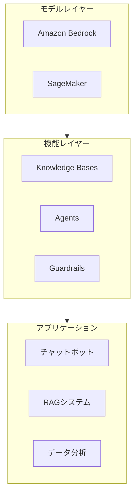

# AWS AI/ML 技術リソース ナビゲーション

> AWS 人工知能・機械学習の体系的学習リソース

---

## 📚 リソース概要

本テーマは Amazon Web Services (AWS) の AI と機械学習サービスを包括的にカバーします。

### コア技術スタック



---

## 📖 ドキュメント一覧

### 電子書籍 (ebooks/)

| ドキュメント | 説明 | 用途 |
|-------------|------|------|
| `AWS_AI_ML_Ebook.md` | **技術白書** - 体系的技術ガイド | 深い学習、全面的な参考 |
| `Quick_Reference.md` | **クイックリファレンス** - 一枚でわかる早見表 | 日常開発、素早い参照 |
| `Learning_Roadmap.md` | **学習ロードマップ** - 20週間学習計画 | 学習計画、段階的学習 |

### 技術ドキュメント (materials/)

| ドキュメント | 内容 |
|-------------|------|
| `aws_bedrock_foundation_models_blog_material.md` | Bedrock 基盤モデル |
| `aws_bedrock_guardrails_blog_material.md` | セーフティフィルター |
| `aws_bedrock_knowledge_bases_blog_material.md` | RAG ナレッジベース |
| `aws_bedrock_agents_blog_material.md` | インテリジェントエージェント |
| `aws_agentcore_blog_material.md` | AgentCore プラットフォーム |
| `aws_sagemaker_blog_material.md` | ML プラットフォーム |

---

## 🚀 クイックスタート

### 学習者向け

```bash
cd ja/ebooks/
cat README.md
```

### 推奨学習パス

1. **初心者**: Learning_Roadmap.md → Week 1-4
2. **中級者**: AWS_AI_ML_Ebook.md 第5-12章
3. **上級者**: 全章 + 実践プロジェクト

---

## 💻 実践プロジェクト

| プロジェクト | 難易度 | 技術スタック |
|------------|--------|-------------|
| チャットボット | ⭐ 入門 | Lambda + Bedrock |
| RAG アシスタント | ⭐⭐ 中級 | Knowledge Bases + DynamoDB |
| AgentCore アシスタント | ⭐⭐⭐ 上級 | エンタープライズ Agent |
| マルチモーダルプラットフォーム | ⭐⭐⭐⭐ 専門 | 画像・動画・音声処理 |

---

## 🎯 対象読者

- AI/ML エンジニア
- クラウドアーキテクト
- ソフトウェア開発者
- 技術マネージャー

---

**AWS AI/ML の学習を始めましょう！** 🚀
