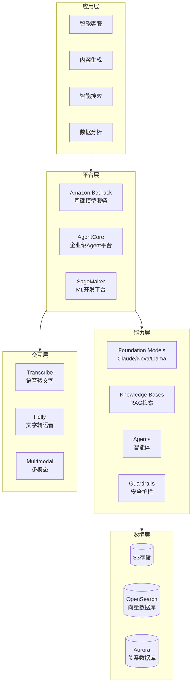
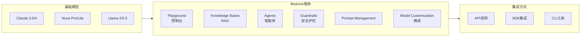
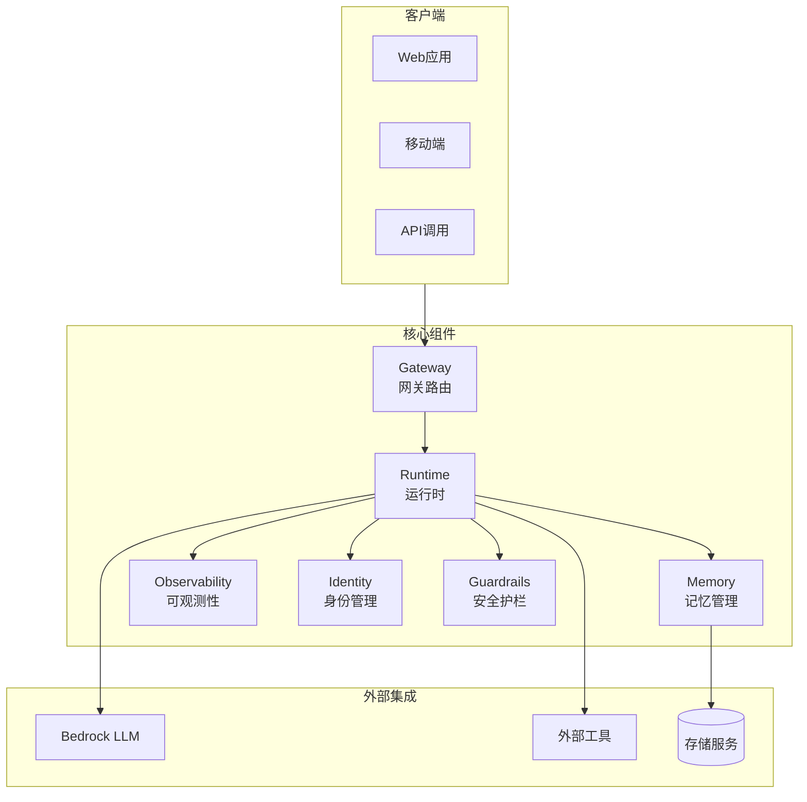

# AWS AI/ML 电子书套装 - 导航索引

> 系统化的 AWS 人工智能学习资源库

---

## 📚 电子书套装组成

本套装包含以下核心文档，形成完整的学习体系：

### 🎯 核心指南 (3篇)

| 文档 | 说明 | 适用场景 |
|------|------|----------|
| `AWS_AI_ML_Ebook.md` | **主白皮书** - 系统化技术指南 | 深度学习、全面参考 |
| `AWS_AI_Quick_Reference.md` | **速查手册** - 一页纸快速参考 | 日常开发、快速查阅 |
| `AWS_AI_Learning_Roadmap.md` | **学习路线图** - 20周学习计划 | 规划学习、循序渐进 |

### 📖 专题素材文档 (10篇)

#### Bedrock 系列 (7篇)
1. `aws_bedrock_foundation_models_blog_material.md` - 基础模型
2. `aws_bedrock_guardrails_blog_material.md` - 安全过滤
3. `aws_bedrock_knowledge_bases_blog_material.md` - RAG 知识库
4. `aws_bedrock_agents_blog_material.md` - 智能体
5. `aws_bedrock_prompt_management_blog_material.md` - 提示管理
6. `aws_bedrock_finetuning_blog_material.md` - 模型微调
7. `aws_bedrock_multimodal_blog_material.md` - 多模态

#### AgentCore 系列 (1篇)
8. `aws_agentcore_blog_material.md` - Runtime、Memory、Gateway、Observability、Identity、Guardrails

#### AWS AI 服务 (2篇)
9. `aws_sagemaker_blog_material.md` - ML 平台
10. `aws_transcribe_polly_blog_material.md` - 语音 AI

---

## 🗺️ 如何使用这套电子书

### 场景 1: 新手入门
```
1. 阅读《学习路线图》了解整体规划
2. 按路线图的 Week 1-2 开始
3. 遇到问题查阅《速查手册》
4. 深入学习时参考专题素材文档
```

### 场景 2: 日常开发
```
1. 《速查手册》放在手边，随时查阅
2. 需要细节时查阅对应的专题素材
3. 架构设计参考《主白皮书》
```

### 场景 3: 技术培训
```
1. 《主白皮书》作为培训教材
2. 《学习路线图》制定培训计划
3. 专题素材作为课后阅读材料
```

### 场景 4: 架构设计
```
1. 《主白皮书》的架构章节
2. 专题素材中的 Terraform 配置
3. 《速查手册》的配额与限制
```

---

## 📊 内容覆盖全景

### 技术栈覆盖

```
AI 应用开发全栈
├── 🧠 模型层
│   ├── Bedrock Foundation Models
│   ├── Bedrock Fine-tuning
│   └── SageMaker Custom Training
│
├── 🛡️ 安全层
│   ├── Bedrock Guardrails
│   └── AgentCore Identity + Cedar
│
├── 🧩 能力层
│   ├── Bedrock Knowledge Bases (RAG)
│   ├── Bedrock Agents
│   ├── Bedrock Prompt Management
│   └── AgentCore Memory/Gateway
│
├── 🎨 交互层
│   ├── Bedrock Multimodal (Canvas/Reel)
│   ├── Transcribe (Speech-to-Text)
│   └── Polly (Text-to-Speech)
│
└── 📊 平台层
    ├── AgentCore Runtime
    ├── AgentCore Observability
    └── SageMaker MLOps
```

---

## 🏗️ 技术架构全景

### AWS AI/ML 服务架构



### Bedrock 核心服务关系



### AgentCore 组件架构



---

## 📈 学习进度追踪

复制以下清单，完成后打勾：

### 基础阶段
- [ ] 阅读《学习路线图》
- [ ] 完成 Week 1-2 学习内容
- [ ] 成功调用第一个 Bedrock API
- [ ] 构建第一个 Knowledge Base

### 进阶阶段
- [ ] 掌握 Bedrock Agents
- [ ] 理解 AgentCore 架构
- [ ] 实现工具调用
- [ ] 完成模型微调项目

### 生产阶段
- [ ] 使用 Terraform 部署基础设施
- [ ] 配置完整监控告警
- [ ] 通过安全审计
- [ ] 实现成本优化

### 专家阶段
- [ ] 发表技术博客
- [ ] 获得 AWS ML 认证
- [ ] 主导企业级项目
- [ ] 开源贡献

---

## 🔗 文档间关联关系

```
                    ┌─────────────────┐
                    │  学习路线图      │
                    │ (规划你的学习)   │
                    └────────┬────────┘
                             │
              ┌──────────────┼──────────────┐
              │              │              │
              ▼              ▼              ▼
       ┌────────────┐ ┌────────────┐ ┌────────────┐
       │   主白皮书  │ │   速查手册  │ │  专题素材  │
       │ (系统学习) │ │ (快速查阅) │ │ (深入参考) │
       └──────┬─────┘ └──────┬─────┘ └──────┬─────┘
              │              │              │
              └──────────────┼──────────────┘
                             │
                             ▼
                    ┌─────────────────┐
                    │   实践项目      │
                    │ (学以致用)      │
                    └─────────────────┘
```

---

## 📅 更新计划

| 版本 | 日期 | 更新内容 |
|------|------|----------|
| v1.0 | 2026-03-01 | 初始版本，覆盖 Bedrock + AgentCore 全系列 |
| v1.1 | 计划中 | 添加 Rekognition、Lex、Personalize 等服务 |
| v1.2 | 计划中 | 添加行业解决方案 (金融、医疗、零售) |
| v2.0 | 计划中 | 添加生成式 AI 高级架构模式 |

---

## 💡 使用建议

1. **打印速查手册**: 贴在工位，随时查阅
2. **收藏学习路线图**: 设定每周学习目标
3. **建立个人笔记**: 在阅读时记录自己的理解
4. **动手实践**: 每读完一章，做一个小项目
5. **参与社区**: 遇到问题查阅 AWS 文档和社区

---

## 📧 反馈与贡献

如果您发现错误或有改进建议，欢迎：
- 提交 Issue
- 发起 Pull Request
- 分享您的使用经验

---

## 📜 版权声明

本文档基于 AWS 官方文档和最佳实践整理，仅供学习交流使用。

**AWS 服务商标归 Amazon Web Services, Inc. 所有。**

---

**开始您的 AWS AI 之旅吧！** 🚀

> 提示：建议将此 README 收藏，方便快速导航到需要的文档。
