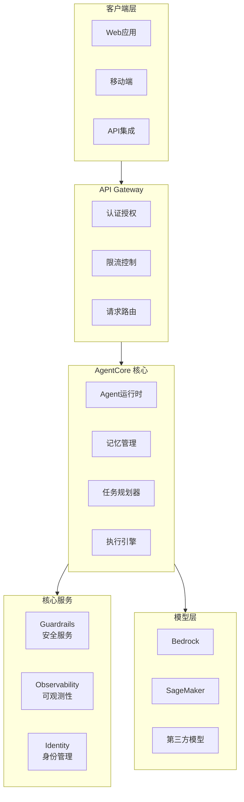
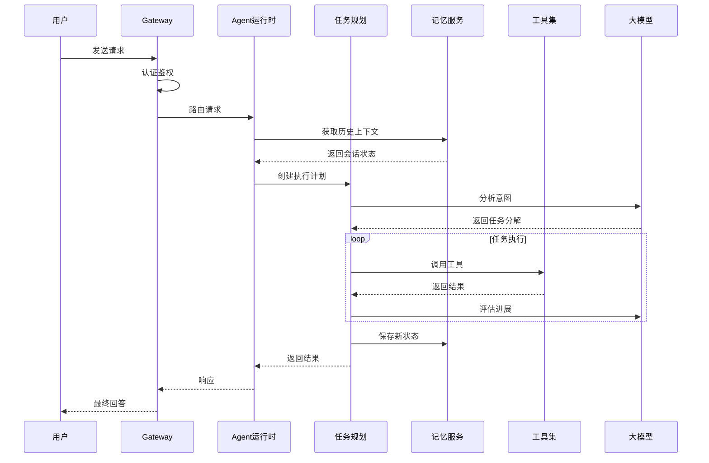
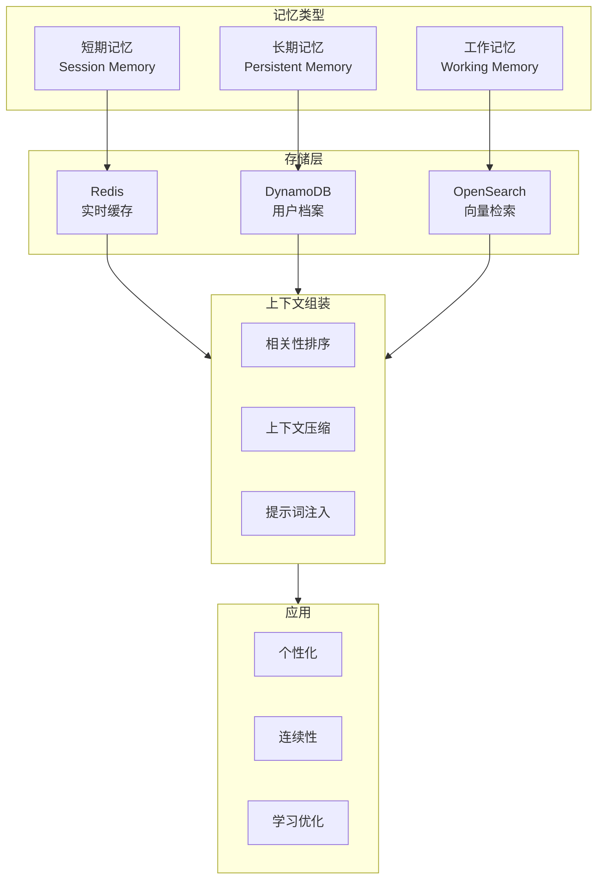

# AWS AgentCore 博客素材收集文档

> 收集时间: 2026-02-28  
> 服务: Amazon Bedrock AgentCore  
> 来源: AWS官方文档、博客、GitHub示例

---

## Agent 1: 初级布道者 (Junior Advocate)

### 服务概述

**Amazon Bedrock AgentCore** 是 AWS 推出的全托管智能体平台，用于构建、部署和运维生产级 AI Agent。它让开发者无需管理基础设施，即可安全、规模化地运行智能体。

**生活化类比**:  
> AgentCore 就像是 AI Agent 的"云原生操作系统" —— 就像 Linux 为应用程序提供进程管理、内存分配、网络通信一样，AgentCore 为 AI Agent 提供运行时环境、记忆存储、工具网关、身份认证等核心能力，让开发者专注于业务逻辑而非基础设施。

## 架构图

### AgentCore 平台架构



### Agent 执行生命周期



### 记忆管理架构



### 可观测性数据流

```mermaid
flowchart LR
    subgraph Sources["数据来源"]
        AgentLog[Agent日志]
        ModelTrace[模型调用链]
        ToolMetric[工具指标]
        UserEvent[用户事件]
    end
    
    subgraph Collection["采集层"]
        CloudWatch[CloudWatch Logs]
        XRay[X-Ray追踪]
        Firehose[Kinesis Firehose]
    end
    
    subgraph Storage["存储分析"]
        S3[数据湖 S3]
        Athena[Athena查询]
        QuickSight[QuickSight仪表板]
    end
    
    subgraph Insights["洞察"]
        Cost[成本分析]
        Quality[质量评估]
        Alert[异常告警]
    end
    
    Sources --> Collection
    Collection --> Storage
    Storage --> Insights
```



---

### 核心组件 (5个必知组件)

| 组件 | 功能描述 | 类比 |
|------|----------|------|
| **Runtime** | 安全、无服务器的运行时环境，支持快速冷启动、真正的会话隔离 | 智能体的"执行引擎" |
| **Memory** | 支持短期记忆（多轮对话）和长期记忆（跨会话学习） | 智能体的"大脑记忆系统" |
| **Gateway** | 将现有 API、Lambda 函数转换为 MCP 兼容工具 | 智能体的"万能接口转换器" |
| **Identity** | 管理智能体身份、访问控制，支持 OAuth2、OIDC | 智能体的"数字身份证" |
| **Observability** | 基于 OpenTelemetry 的统一可观测性，支持 CloudWatch | 智能体的"健康体检系统" |

### 其他组件

- **Code Interpreter**: 隔离的沙箱环境，支持 Python/JS/TS 代码执行
- **Browser**: 云端浏览器运行时，支持 Playwright、BrowserUse
- **Evaluations**: 自动化评估服务，测量任务完成质量
- **Policy**: 使用自然语言或 Cedar 策略语言定义业务规则

### Quick Start - 最核心CLI命令

```bash
# 安装 AWS CLI 和 Bedrock 插件后，创建 AgentCore Runtime
aws bedrock-agentcore create-agent-runtime \
    --agent-name "my-first-agent" \
    --runtime-version "1.0" \
    --execution-role-arn "arn:aws:iam::123456789012:role/AgentCoreExecutionRole"

# 部署 Agent
aws bedrock-agentcore create-agent-runtime-endpoint \
    --agent-runtime-id "arn:aws:bedrock:us-east-1:123456789012:agent-runtime/my-first-agent" \
    --endpoint-alias "prod"

# 调用 Agent
aws bedrock-agentcore invoke-agent-runtime \
    --endpoint-id "arn:aws:bedrock:us-east-1:123456789012:agent-runtime-endpoint/my-first-agent/prod" \
    --payload '{"prompt": "Hello, Agent!"}'
```

### 官方文档入口

- 服务概述: https://docs.aws.amazon.com/bedrock-agentcore/latest/devguide/what-is-bedrock-agentcore.html
- 开发者指南: https://docs.aws.amazon.com/bedrock-agentcore/latest/devguide/

---

## Agent 1.5: Memory 专家 - AgentCore 记忆系统深度解析

### Memory 服务概述

**AgentCore Memory** 是专为 AI Agent 设计的托管式记忆存储服务，提供**短期记忆（对话上下文）**和**长期记忆（跨会话学习）**能力，让 Agent 能够记住用户偏好、历史交互和任务状态。

**生活化类比**:  
> AgentCore Memory 就像是 Agent 的"大脑海马体 + 长期记忆库" —— 就像人类大脑有短期工作记忆（处理当前对话）和长期记忆（存储重要信息），Memory 服务提供**会话级缓存**（短期）和**持久化知识存储**（长期），让 Agent 不仅能"记得刚才说了什么"，还能"记得用户上周的偏好"。

### 核心概念与架构

```
┌─────────────────────────────────────────────────────────┐
│                  AgentCore Memory                       │
│  ┌──────────────────┐      ┌──────────────────┐        │
│  │   Short-Term     │      │   Long-Term      │        │
│  │   (Session)      │      │   (Persistent)   │        │
│  │                  │      │                  │        │
│  │ • 多轮对话上下文  │      │ • 用户画像        │        │
│  │ • 临时任务状态   │      │ • 偏好学习        │        │
│  │ • 工具调用历史   │      │ • 知识积累        │        │
│  │ • 15分钟TTL     │      │ • 跨会话检索      │        │
│  └────────┬─────────┘      └────────┬─────────┘        │
│           │                         │                  │
│           ▼                         ▼                  │
│    ┌─────────────────────────────────────┐             │
│    │      Memory API (REST/WebSocket)    │             │
│    └─────────────────────────────────────┘             │
└─────────────────────────────────────────────────────────┘
```

### 短期记忆 vs 长期记忆

| 特性 | 短期记忆 (Session Memory) | 长期记忆 (Persistent Memory) |
|------|--------------------------|----------------------------|
| **生命周期** | 会话期间 (15分钟空闲超时) | 永久存储 |
| **存储容量** | 单会话最多 100MB | 单用户最多 10GB |
| **一致性** | 强一致性 | 最终一致性 |
| **访问延迟** | < 50ms | < 100ms |
| **使用场景** | 当前对话上下文 | 用户偏好、历史记录 |
| **计费方式** | 包含在 Runtime 费用中 | $0.25/GB/月 |

### Quick Start - Memory API 核心操作

```bash
# 1. 存储短期记忆（会话上下文）
aws bedrock-agentcore put-session-memory \
    --session-id "session-123456" \
    --memory-type "SHORT_TERM" \
    --content '{"messages": [{"role": "user", "content": "我叫张三"}, {"role": "assistant", "content": "你好张三！"}]}'

# 2. 存储长期记忆（用户画像）
aws bedrock-agentcore put-persistent-memory \
    --user-id "user-789" \
    --memory-type "LONG_TERM" \
    --content '{"preferences": {"language": "zh-CN", "theme": "dark"}, "facts": [{"key": "name", "value": "张三"}]}'

# 3. 检索相关记忆（RAG 风格查询）
aws bedrock-agentcore retrieve-memory \
    --user-id "user-789" \
    --query "用户的名字是什么？" \
    --memory-types '["LONG_TERM"]' \
    --max-results 5

# 4. 获取会话完整历史
aws bedrock-agentcore get-session-memory \
    --session-id "session-123456" \
    --memory-type "SHORT_TERM"

# 5. 删除过期记忆
aws bedrock-agentcore delete-memory \
    --user-id "user-789" \
    --memory-id "memory-abc123"
```

### Python SDK 使用示例

```python
import boto3
from datetime import datetime

# 初始化 AgentCore Memory 客户端
memory_client = boto3.client('bedrock-agentcore-memory')

def chat_with_memory(user_id: str, session_id: str, user_input: str):
    """
    带记忆功能的对话示例
    """
    # 1. 检索用户的长期记忆
    persistent_memories = memory_client.retrieve_memory(
        userId=user_id,
        query=user_input,
        memoryTypes=['LONG_TERM'],
        maxResults=3
    )
    
    # 2. 获取当前会话的短期记忆
    try:
        session_memory = memory_client.get_session_memory(
            sessionId=session_id,
            memoryType='SHORT_TERM'
        )
        recent_messages = session_memory.get('content', {}).get('messages', [])
    except memory_client.exceptions.ResourceNotFoundException:
        recent_messages = []
    
    # 3. 构建带记忆的 Prompt
    context = build_context(persistent_memories, recent_messages)
    prompt = f"""
    {context}
    
    User: {user_input}
    Assistant:"""
    
    # 4. 调用模型生成回复（省略 Bedrock 调用代码）
    response = invoke_model(prompt)
    assistant_reply = response['content']
    
    # 5. 更新短期记忆
    recent_messages.append({"role": "user", "content": user_input})
    recent_messages.append({"role": "assistant", "content": assistant_reply})
    
    memory_client.put_session_memory(
        sessionId=session_id,
        memoryType='SHORT_TERM',
        content={'messages': recent_messages[-10:]}  # 只保留最近10轮
    )
    
    # 6. 提取重要事实存储到长期记忆（可选）
    if should_extract_facts(user_input, assistant_reply):
        facts = extract_facts(user_input, assistant_reply)
        for fact in facts:
            memory_client.put_persistent_memory(
                userId=user_id,
                memoryType='LONG_TERM',
                content={'facts': [fact]},
                metadata={'extracted_at': datetime.now().isoformat()}
            )
    
    return assistant_reply

def build_context(persistent_memories, recent_messages):
    """构建记忆上下文"""
    context_parts = []
    
    # 添加长期记忆
    if persistent_memories.get('results'):
        context_parts.append("用户背景信息:")
        for mem in persistent_memories['results']:
            for fact in mem.get('content', {}).get('facts', []):
                context_parts.append(f"- {fact['key']}: {fact['value']}")
    
    # 添加近期对话历史
    if recent_messages:
        context_parts.append("\n最近对话:")
        for msg in recent_messages[-5:]:  # 最近5条
            context_parts.append(f"{msg['role']}: {msg['content']}")
    
    return "\n".join(context_parts)
```

### 高级功能

#### 1. 记忆检索与相似度搜索

```python
# 语义检索 - 基于向量相似度
results = memory_client.retrieve_memory(
    userId="user-789",
    query="用户喜欢什么颜色？",  # 即使记忆中没有完全匹配的词也能检索
    memoryTypes=['LONG_TERM'],
    retrievalConfiguration={
        'vectorSearchConfiguration': {
            'numberOfResults': 5,
            'overrideSearchType': 'HYBRID',  # 混合搜索：向量 + 关键字
            'filter': {
                'equals': {'key': 'category', 'value': 'preferences'}
            }
        }
    }
)
```

#### 2. 记忆时间衰减与重要性评分

```python
# 存储带重要性的记忆（重要记忆保留更久）
memory_client.put_persistent_memory(
    userId="user-789",
    memoryType='LONG_TERM',
    content={'facts': [{'key': ' allergies', 'value': '花生过敏'}]},
    metadata={
        'importance_score': 0.95,  # 0-1，越高越不容易被遗忘
        'ttl_days': 3650,  # 重要医疗信息长期保留
        'category': 'health'
    }
)

# 启用自动记忆整理（遗忘不重要的旧记忆）
memory_client.configure_memory_policy(
    userId="user-789",
    autoCompaction={
        'enabled': True,
        'maxMemories': 1000,  # 最多保留1000条记忆
        'retentionStrategy': 'IMPORTANCE_WEIGHTED'  # 基于重要性保留
    }
)
```

#### 3. 跨会话记忆同步

```python
# 会话开始时加载用户记忆上下文
def initialize_session(user_id: str, session_id: str):
    # 获取用户的长期记忆摘要
    user_profile = memory_client.get_user_memory_summary(
        userId=user_id,
        summaryType='COMPREHENSIVE'  # 或 'RECENT' 只获取近期
    )
    
    # 预加载到会话记忆中
    memory_client.put_session_memory(
        sessionId=session_id,
        memoryType='SHORT_TERM',
        content={
            'user_profile': user_profile,
            'initialized_at': datetime.now().isoformat()
        }
    )
    
    return user_profile
```

### 与 Knowledge Bases 的区别

| 特性 | AgentCore Memory | Bedrock Knowledge Bases |
|------|------------------|------------------------|
| **用途** | Agent 的状态/偏好/历史 | 领域知识/文档检索 |
| **数据类型** | 结构化 JSON、对话历史 | 非结构化文档 (PDF/HTML) |
| **更新频率** | 实时读写 | 批量同步 |
| **所有权** | 每个用户独立 | 共享知识库 |
| **与 AgentCore 集成** | 原生深度集成 | 通过工具调用 |

---

## Agent 1.6: 安全架构师 - Guardrails 集成与内容安全

### AgentCore 与 Guardrails 集成架构

```
┌─────────────────────────────────────────────────────────┐
│                   用户请求                               │
│              "帮我预订一张去北京的机票"                    │
└────────────────────┬────────────────────────────────────┘
                     │
                     ▼
┌─────────────────────────────────────────────────────────┐
│  Layer 1: Input Guardrails (输入安全检查)                │
│  ├─ Content Filters: 检测 Prompt Attack                 │
│  ├─ Denied Topics: 检查是否涉及禁止话题                   │
│  ├─ PII Detection: 识别信用卡号等敏感信息                │
│  └─ 检查通过 ──────────────────────────────┐           │
│  └─ 检查失败 ──► 返回拦截信息，不调用模型   │           │
├─────────────────────────────────────────────────────────┤
│  Layer 2: AgentCore Runtime (Agent 执行)                │
│  ├─ 工具调用 (航班查询 API)                              │
│  ├─ Memory 读写 (用户偏好/历史订单)                       │
│  └─ 生成初步回复 ──────────────────────────┼──────────► │
├─────────────────────────────────────────────────────────┤
│  Layer 3: Output Guardrails (输出安全检查)               │
│  ├─ Content Filters: 检测有害内容                        │
│  ├─ Contextual Grounding: 验证航班信息真实性              │
│  ├─ PII Anonymization: 脱敏输出中的敏感信息              │
│  └─ 检查通过 ──────────────────────────────┘           │
│  └─ 检查失败 ──► 替换为安全提示或重新生成                 │
├─────────────────────────────────────────────────────────┤
│  Layer 4: 安全响应返回给用户                              │
└─────────────────────────────────────────────────────────┘
```

### 集成配置 - Terraform

```hcl
# ============================================
# AgentCore Runtime + Guardrails 集成配置
# ============================================

# 1. 创建带 Guardrails 的 AgentCore Runtime
resource "aws_bedrockagent_agent_runtime" "safe_agent" {
  name              = "${var.project_name}-safe-agent"
  description       = "AgentCore Runtime with Guardrails protection"
  execution_role_arn = aws_iam_role.agentcore_execution.arn

  # 关联 Guardrails（输入输出双重检查）
  guardrail_configuration {
    guardrail_identifier = aws_bedrock_guardrail.agent_guardrail.id
    guardrail_version    = aws_bedrock_guardrail_version.agent_guardrail.version
  }

  # Memory 配置
  memory_configuration {
    enabled              = true
    storage_type         = "PERSISTENT"
    session_ttl_minutes  = 30
  }

  # 代码解释器（沙箱环境）
  code_interpreter_configuration {
    enabled = true
  }
}

# 2. 创建 AgentCore 专用 Guardrail
resource "aws_bedrock_guardrail" "agent_guardrail" {
  name                      = "${var.project_name}-agent-protection"
  description               = "Guardrail for AgentCore safe operations"
  blocked_input_messaging   = "您的请求包含不安全内容，无法处理。"
  blocked_outputs_messaging = "生成内容未通过安全检查，请重试。"

  # 内容过滤器 - 严格的输入检查
  content_policy_config {
    filters_config {
      type            = "PROMPT_ATTACK"
      input_strength  = "HIGH"
      output_strength = "NONE"
    }
    filters_config {
      type            = "HATE"
      input_strength  = "HIGH"
      output_strength = "HIGH"
    }
    filters_config {
      type            = "MISCONDUCT"
      input_strength  = "HIGH"
      output_strength = "HIGH"
    }
  }

  # 敏感信息保护
  sensitive_information_policy_config {
    # PII 实体
    pii_entities_config {
      type   = "CREDIT_DEBIT_CARD_NUMBER"
      action = "BLOCK"  # 信用卡号直接拦截
    }
    pii_entities_config {
      type   = "US_SOCIAL_SECURITY_NUMBER"
      action = "BLOCK"
    }
    pii_entities_config {
      type   = "EMAIL"
      action = "ANONYMIZE"  # 邮箱脱敏显示
    }
    pii_entities_config {
      type   = "PHONE"
      action = "ANONYMIZE"
    }
    
    # 自定义正则 - API Key 检测
    regexes_config {
      name   = "APIKeyPattern"
      regex  = "(sk|ak)-[a-zA-Z0-9]{32,48}"
      action = "BLOCK"
    }
  }

  # 拒绝主题 - 禁止 Agent 执行敏感操作
  topic_policy_config {
    topics_config {
      name       = "Code Execution"
      definition = "Requests to execute arbitrary code or commands on the system"
      examples   = ["执行这个 Python 脚本", "运行 shell 命令", "eval(", "exec("]
      type       = "DENY"
    }
    topics_config {
      name       = "System Instructions"
      definition = "Attempts to override system instructions or reveal prompt"
      examples   = ["忽略之前的指令", "你的系统提示是什么", "system prompt"]
      type       = "DENY"
    }
  }

  # 上下文基础检查 - 防止幻觉（特别重要）
  contextual_grounding_policy_config {
    filters_config {
      type      = "GROUNDING"
      threshold = 0.75  # 要求 75% 以上基于事实
    }
    filters_config {
      type      = "RELEVANCE"
      threshold = 0.70
    }
  }
}
```

### 运行时安全检查 - Python SDK

```python
import boto3
from botocore.exceptions import ClientError

bedrock_runtime = boto3.client('bedrock-runtime')
agentcore = boto3.client('bedrock-agentcore')

def safe_agent_invoke(session_id: str, user_input: str, guardrail_id: str):
    """
    带多层安全保护的 Agent 调用
    """
    
    # ========== Layer 1: 输入安全检查 ==========
    input_check = bedrock_runtime.apply_guardrail(
        guardrailIdentifier=guardrail_id,
        guardrailVersion='1',
        source='INPUT',
        content=[{'text': {'text': user_input}}]
    )
    
    if input_check['action'] != 'NONE':
        # 记录安全事件
        log_security_event('INPUT_BLOCKED', session_id, user_input, input_check)
        return {
            'status': 'BLOCKED',
            'reason': 'Input violates safety policies',
            'message': '您的请求包含不安全内容，请修改后重试。'
        }
    
    # 脱敏后的输入
    sanitized_input = input_check.get('outputs', [{}])[0].get('text', user_input)
    
    # ========== Layer 2: AgentCore 执行 ==========
    try:
        agent_response = agentcore.invoke_agent_runtime(
            sessionId=session_id,
            input={'text': sanitized_input},
            enableTrace=True  # 启用执行追踪
        )
        
        raw_output = agent_response['completion']
        
    except ClientError as e:
        if e.response['Error']['Code'] == 'GuardrailIntervention':
            # AgentCore 内置 Guardrail 拦截
            return {
                'status': 'BLOCKED',
                'reason': 'AgentCore guardrail intervention',
                'message': '操作被安全系统拦截。'
            }
        raise
    
    # ========== Layer 3: 输出安全检查 ==========
    output_check = bedrock_runtime.apply_guardrail(
        guardrailIdentifier=guardrail_id,
        guardrailVersion='1',
        source='OUTPUT',
        content=[{'text': {'text': raw_output}}]
    )
    
    if output_check['action'] != 'NONE':
        log_security_event('OUTPUT_BLOCKED', session_id, raw_output, output_check)
        return {
            'status': 'BLOCKED',
            'reason': 'Output violates safety policies',
            'message': '生成内容未通过安全检查，请重试。'
        }
    
    # 脱敏后的输出
    safe_output = output_check.get('outputs', [{}])[0].get('text', raw_output)
    
    return {
        'status': 'SUCCESS',
        'response': safe_output
    }

def log_security_event(event_type: str, session_id: str, content: str, guardrail_result: dict):
    """记录安全事件到 CloudWatch"""
    import json
    import logging
    
    logger = logging.getLogger()
    logger.warning(json.dumps({
        'event': 'GUARDRAIL_INTERVENTION',
        'type': event_type,
        'session_id': session_id,
        'intervened_at': datetime.now().isoformat(),
        'guardrail_action': guardrail_result['action'],
        'assessments': guardrail_result.get('assessments', [])
    }))
```

### 安全监控告警

```hcl
# CloudWatch Alarm - 高频拦截告警
resource "aws_cloudwatch_metric_alarm" "agent_security_alert" {
  alarm_name          = "${var.project_name}-agent-security-alert"
  comparison_operator = "GreaterThanThreshold"
  evaluation_periods  = "1"
  metric_name         = "GuardrailInterventions"
  namespace           = "AWS/Bedrock/Guardrails"
  period              = "300"
  statistic           = "Sum"
  threshold           = "10"
  alarm_description   = "AgentCore 安全拦截次数异常，可能存在攻击"
  
  dimensions = {
    GuardrailId = aws_bedrock_guardrail.agent_guardrail.id
  }
  
  alarm_actions = [
    aws_sns_topic.security_alerts.arn,
    aws_autoscaling_policy.scale_up.arn  # 可选：自动扩容应对攻击
  ]
}

# SNS Topic - 安全告警
resource "aws_sns_topic" "security_alerts" {
  name = "${var.project_name}-security-alerts"
}

# SNS Email Subscription
resource "aws_sns_topic_subscription" "security_email" {
  topic_arn = aws_sns_topic.security_alerts.arn
  protocol  = "email"
  endpoint  = "security-team@company.com"
}
```

---

## Agent 1.7: 集成架构师 - AgentCore Gateway 与 MCP 工具生态

### Gateway 服务概述

**AgentCore Gateway** 是 AWS 提供的工具网关服务，让 Agent 能够安全地发现和调用外部工具。它支持将现有 API、Lambda 函数、Bedrock 知识库等转换为 **MCP (Model Context Protocol)** 兼容工具，实现与外部系统的无缝集成。

**生活化类比**:  
> AgentCore Gateway 就像是 Agent 的"万能转接头 + 工具仓库" —— 就像 USB-C 转接头可以让新电脑连接各种旧设备，Gateway 将企业现有的 API、数据库、SaaS 服务等"翻译"成 Agent 能理解和调用的标准格式（MCP），让 Agent 无需学习每种工具的独特接口，就能使用成千上万种工具。

### 什么是 MCP (Model Context Protocol)

MCP 是由 Anthropic 推出的开放协议，标准化了 AI 模型与外部工具/数据源的交互方式：

```
┌─────────────────────────────────────────────────────────┐
│                    MCP 协议架构                          │
│                                                         │
│   ┌─────────────┐          ┌─────────────────────┐     │
│   │   AI Agent  │◄────────►│   MCP Client        │     │
│   │             │  Tools   │   (内置于 AgentCore) │     │
│   └─────────────┘          └──────────┬──────────┘     │
│                                       │                 │
│                              MCP Protocol               │
│                                       │                 │
│                              ┌────────▼────────┐       │
│                              │   MCP Server    │       │
│                              │   (Gateway      │       │
│                              │    托管)         │       │
│                              └────────┬────────┘       │
│                                       │                 │
│         ┌─────────────┬───────────────┼───────────────┐ │
│         ▼             ▼               ▼               ▼ │
│    ┌─────────┐   ┌─────────┐    ┌─────────┐    ┌────────┐│
│    │ REST API│   │ Lambda  │    │SageMaker│    │S3/DB   ││
│    └─────────┘   └─────────┘    └─────────┘    └────────┘│
└─────────────────────────────────────────────────────────┘
```

### Gateway 核心能力

| 能力 | 说明 | 示例场景 |
|------|------|----------|
| **API 转换** | 将 OpenAPI/Swagger 转为 MCP 工具 | 企业内部 REST API |
| **Lambda 集成** | Lambda 函数即插即用 | 自定义业务逻辑 |
| **知识库连接** | Bedrock Knowledge Bases 作为工具 | RAG 检索增强 |
| **第三方 MCP** | 接入社区 MCP Servers | GitHub、Slack、数据库 |
| **权限控制** | 细粒度工具访问控制 | 不同 Agent 访问不同工具集 |

### Quick Start - Gateway 核心操作

```bash
# 1. 从 OpenAPI 规范创建 MCP Server
aws bedrock-agentcore create-gateway-server \
    --server-name "crm-api-server" \
    --description "CRM System MCP Server" \
    --source-type "API" \
    --api-configuration '{
        "apiSchema": {
            "s3Location": {
                "s3Bucket": "my-api-schemas",
                "s3ObjectKey": "crm-openapi.json"
            }
        },
        "endpoint": "https://api.crm.company.com/v1",
        "authorization": {
            "type": "API_KEY",
            "apiKeyLocation": "HEADER",
            "apiKeyName": "X-API-Key"
        }
    }'

# 2. 将 Lambda 函数转换为 MCP 工具
aws bedrock-agentcore create-gateway-function \
    --function-name "send-email-tool" \
    --description "Send email via SES" \
    --lambda-arn "arn:aws:lambda:us-east-1:123456789012:function:sendEmail" \
    --input-schema '{
        "type": "object",
        "properties": {
            "to": {"type": "string", "description": "Recipient email"},
            "subject": {"type": "string"},
            "body": {"type": "string"}
        },
        "required": ["to", "subject", "body"]
    }'

# 3. 创建工具集 (Tool Group)
aws bedrock-agentcore create-tool-group \
    --tool-group-name "sales-tools" \
    --description "Tools for sales team" \
    --server-ids '["crm-api-server", "send-email-tool"]' \
    --access-policy '{
        "allowedAgents": ["sales-agent-*"],
        "deniedAgents": []
    }'

# 4. 将工具集关联到 Agent Runtime
aws bedrock-agentcore update-agent-runtime \
    --agent-runtime-id "arn:aws:bedrock:us-east-1:123456789012:agent-runtime/sales-assistant" \
    --tool-groups '["sales-tools"]' \
    --tool-invocation-mode "AUTO"  # AUTO: Agent 自动决定调用，MANUAL: 需确认

# 5. 测试工具调用
aws bedrock-agentcore invoke-agent-runtime \
    --endpoint-id "arn:aws:bedrock:us-east-1:123456789012:agent-runtime-endpoint/sales-assistant/prod" \
    --payload '{
        "prompt": "给张三发送一封会议确认邮件",
        "enableToolUse": true
    }'
```

### Python SDK - 工具定义与调用

```python
import boto3
import json

gateway = boto3.client('bedrock-agentcore-gateway')
agentcore = boto3.client('bedrock-agentcore')

# ========== 1. 创建自定义 MCP Server ==========

def create_weather_mcp_server():
    """创建天气查询 MCP Server"""
    
    server_config = {
        "serverName": "weather-service",
        "description": "Global weather data service",
        "sourceType": "API",
        "apiConfiguration": {
            "endpoint": "https://api.weatherapi.com/v1",
            "authorization": {
                "type": "API_KEY",
                "apiKeyLocation": "QUERY_STRING",
                "apiKeyName": "key"
            },
            # 工具映射配置
            "toolMappings": [
                {
                    "toolName": "get_current_weather",
                    "endpointPath": "/current.json",
                    "method": "GET",
                    "parameters": {
                        "q": {"from": "location", "required": True},
                        "aqi": {"from": "include_air_quality", "default": "no"}
                    }
                },
                {
                    "toolName": "get_forecast",
                    "endpointPath": "/forecast.json",
                    "method": "GET",
                    "parameters": {
                        "q": {"from": "location", "required": True},
                        "days": {"from": "days", "required": True}
                    }
                }
            ]
        }
    }
    
    response = gateway.create_gateway_server(**server_config)
    return response['serverId']

# ========== 2. 创建 Lambda 工具 ==========

def create_database_query_tool():
    """创建数据库查询工具（敏感操作）"""
    
    tool_config = {
        "functionName": "query-customer-db",
        "description": "Query customer database (READ-ONLY)",
        "lambdaArn": "arn:aws:lambda:us-east-1:123456789012:function:queryCustomerDB",
        "inputSchema": {
            "type": "object",
            "properties": {
                "query": {
                    "type": "string",
                    "description": "SQL query (only SELECT allowed)",
                    "pattern": "^SELECT .*"  # 只允许 SELECT
                },
                "limit": {
                    "type": "integer",
                    "description": "Max rows to return",
                    "default": 100,
                    "maximum": 1000
                }
            },
            "required": ["query"]
        },
        # 敏感工具需要人工确认
        "requireConfirmation": True,
        "timeoutSeconds": 30
    }
    
    response = gateway.create_gateway_function(**tool_config)
    return response['functionId']

# ========== 3. Agent 运行时工具调用 ==========

class ToolEnabledAgent:
    """支持工具调用的 Agent 封装"""
    
    def __init__(self, runtime_id: str, tool_groups: list):
        self.runtime_id = runtime_id
        self.tool_groups = tool_groups
        self.agentcore = boto3.client('bedrock-agentcore')
        
    def chat(self, user_input: str, session_id: str, auto_invoke: bool = False):
        """
        支持工具调用的对话
        
        Args:
            auto_invoke: 是否自动执行工具（False 时返回 toolUse 请求用户确认）
        """
        response = self.agentcore.invoke_agent_runtime(
            endpointId=self.runtime_id,
            sessionId=session_id,
            input={"text": user_input},
            toolConfiguration={
                "toolGroups": self.tool_groups,
                "toolChoice": "AUTO",  # AUTO/ANY/NONE
                "autoInvoke": auto_invoke
            },
            enableTrace=True
        )
        
        completion = response['completion']
        
        # 处理工具调用请求
        if completion.get('type') == 'tool_use':
            tool_calls = completion['toolUse']
            
            if not auto_invoke:
                # 返回工具调用请求，等待用户确认
                return {
                    'type': 'tool_confirmation_required',
                    'message': '我需要使用以下工具来完成您的请求：',
                    'tools': [
                        {
                            'name': tc['name'],
                            'parameters': tc['parameters'],
                            'description': self.get_tool_description(tc['name'])
                        }
                        for tc in tool_calls
                    ],
                    'confirmation_token': response['confirmationToken']
                }
            else:
                # 自动执行工具调用
                return self._execute_tools(tool_calls, session_id)
        
        # 正常文本回复
        return {
            'type': 'text',
            'content': completion['text']
        }
    
    def confirm_tool_execution(self, confirmation_token: str, approved: bool, session_id: str):
        """用户确认后执行工具"""
        
        if not approved:
            return {
                'type': 'text',
                'content': '工具调用已取消。'
            }
        
        response = self.agentcore.invoke_agent_runtime(
            endpointId=self.runtime_id,
            sessionId=session_id,
            input={
                "confirmationToken": confirmation_token,
                "confirmation": "APPROVED"
            }
        )
        
        return {
            'type': 'text',
            'content': response['completion']['text']
        }
```

### 高级集成模式

#### 1. 多工具编排 (Multi-Tool Orchestration)

```python
# 定义复杂工作流工具链
def create_onboarding_workflow():
    """新员工入职自动化工作流"""
    
    workflow = {
        "workflowName": "employee-onboarding",
        "description": "Automated employee onboarding process",
        "steps": [
            {
                "stepId": "1",
                "tool": "hr-system:create-employee-record",
                "inputMapping": {
                    "name": "$.userInput.name",
                    "email": "$.userInput.email",
                    "department": "$.userInput.department"
                }
            },
            {
                "stepId": "2",
                "tool": "it-system:create-ad-account",
                "dependsOn": ["1"],
                "inputMapping": {
                    "employeeId": "$.step1.output.employeeId",
                    "email": "$.step1.output.email"
                }
            },
            {
                "stepId": "3",
                "tool": "slack:invite-to-channels",
                "dependsOn": ["1"],
                "inputMapping": {
                    "email": "$.step1.output.email",
                    "channels": ["general", "$.userInput.department-channel"]
                }
            },
            {
                "stepId": "4",
                "tool": "email:send-welcome",
                "dependsOn": ["2", "3"],  # 等待 AD 和 Slack 完成
                "inputMapping": {
                    "to": "$.step1.output.email",
                    "adCredentials": "$.step2.output.tempPassword",
                    "slackChannels": "$.step3.output.invitedChannels"
                }
            }
        ],
        "errorHandling": {
            "onFailure": "ROLLBACK",  # 失败时回滚
            "retryPolicy": {
                "maxRetries": 3,
                "backoffType": "EXPONENTIAL"
            }
        }
    }
    
    return gateway.create_workflow(**workflow)
```

#### 2. 动态工具发现

```python
# Agent 根据用户意图动态选择工具
def dynamic_tool_selection():
    """基于意图的工具路由"""
    
    routing_config = {
        "routerName": "smart-tool-router",
        "routingStrategy": "INTENT_BASED",
        "routes": [
            {
                "intentPattern": "(查询|查看|获取).*(订单|购买记录)",
                "toolGroup": "order-management-tools",
                "priority": 1
            },
            {
                "intentPattern": "(退款|退货|取消)",
                "toolGroup": "refund-tools",
                "priority": 1,
                "requiresConfirmation": True  # 敏感操作需确认
            },
            {
                "intentPattern": "(发票|收据|报销)",
                "toolGroup": "invoice-tools",
                "priority": 2
            },
            {
                # 默认路由
                "intentPattern": ".*",
                "toolGroup": "general-support-tools",
                "priority": 99
            }
        ]
    }
    
    return gateway.create_tool_router(**routing_config)
```

#### 3. 工具调用缓存与结果复用

```python
# 缓存工具调用结果，避免重复调用
from functools import lru_cache
import hashlib

class CachedToolInvoker:
    """带缓存的工具调用器"""
    
    def __init__(self, ttl_seconds: int = 300):
        self.cache = {}
        self.ttl = ttl_seconds
        self.gateway = boto3.client('bedrock-agentcore-gateway')
    
    def invoke_tool(self, tool_name: str, parameters: dict, use_cache: bool = True):
        """带缓存的工具调用"""
        
        if use_cache:
            # 生成缓存键
            cache_key = self._generate_cache_key(tool_name, parameters)
            
            # 检查缓存
            if cache_key in self.cache:
                cached = self.cache[cache_key]
                if time.time() - cached['timestamp'] < self.ttl:
                    print(f"Cache hit for {tool_name}")
                    return cached['result']
        
        # 执行工具调用
        result = self.gateway.invoke_tool(
            toolName=tool_name,
            parameters=parameters
        )
        
        # 存入缓存
        if use_cache:
            self.cache[cache_key] = {
                'result': result,
                'timestamp': time.time()
            }
        
        return result
    
    def _generate_cache_key(self, tool_name: str, parameters: dict) -> str:
        """生成缓存键"""
        content = f"{tool_name}:{json.dumps(parameters, sort_keys=True)}"
        return hashlib.md5(content.encode()).hexdigest()
    
    def invalidate_cache(self, tool_pattern: str = None):
        """清除缓存"""
        if tool_pattern:
            self.cache = {
                k: v for k, v in self.cache.items()
                if tool_pattern not in v.get('tool_name', '')
            }
        else:
            self.cache.clear()
```

### 安全最佳实践

```hcl
# IAM 策略 - 最小权限工具访问
resource "aws_iam_policy" "agent_tool_access" {
  name = "agent-core-tools-policy"

  policy = jsonencode({
    Version = "2012-10-17"
    Statement = [
      {
        Sid    = "AllowSpecificToolGroups"
        Effect = "Allow"
        Action = [
          "bedrock-agentcore-gateway:InvokeTool"
        ]
        Resource = "*"
        Condition = {
          "ForAnyValue:StringEquals" = {
            "bedrock-agentcore-gateway:ToolGroup" = [
              "arn:aws:bedrock:us-east-1:123456789012:tool-group/sales-readonly",
              "arn:aws:bedrock:us-east-1:123456789012:tool-group/customer-query"
            ]
          }
        }
      },
      {
        Sid    = "DenySensitiveTools"
        Effect = "Deny"
        Action = [
          "bedrock-agentcore-gateway:InvokeTool"
        ]
        Resource = "*"
        Condition = {
          "ForAnyValue:StringEquals" = {
            "bedrock-agentcore-gateway:ToolName" = [
              "delete-*",
              "modify-*",
              "admin-*"
            ]
          }
        }
      }
    ]
  })
}

# VPC Endpoint 策略 - 限制工具访问来源
resource "aws_vpc_endpoint_policy" "gateway" {
  endpoint_id = aws_vpc_endpoint.bedrock_gateway.id

  policy = jsonencode({
    Version = "2012-10-17"
    Statement = [
      {
        Sid    = "RestrictToolAccess"
        Effect = "Allow"
        Principal = "*"
        Action   = "bedrock-agentcore-gateway:*"
        Resource = "*"
        Condition = {
          "StringEquals" = {
            "aws:VpcSourceIp" = ["10.0.0.0/8"]  # 仅允许内网
          }
        }
      }
    ]
  })
}
```

### Gateway 配额与限制

| 配额项 | 默认值 | 可调 | 备注 |
|--------|--------|------|------|
| MCP Servers/账户 | 100 | ✅ | - |
| Tools/Server | 100 | ❌ | - |
| Tool Groups/账户 | 50 | ✅ | - |
| Tools/Group | 50 | ❌ | - |
| 工具调用超时 | 60s | ✅ | 最大 900s |
| 单次工具调用 Payload | 6 MB | ❌ | 进出相同 |
| 工具调用 TPS | 100 | ✅ | 每 Server |
| 工具描述长度 | 1000 字符 | ❌ | - |
| Schema 复杂度 | 100 字段 | ❌ | - |

### 社区 MCP Servers 集成

```python
# 接入第三方 MCP Servers
COMMUNITY_MCP_SERVERS = {
    "github": {
        "serverUrl": "https://mcp-github.aws-serverless.com/sse",
        "tools": ["search_repos", "get_issue", "create_pr"]
    },
    "slack": {
        "serverUrl": "https://mcp-slack.aws-serverless.com/sse",
        "tools": ["send_message", "list_channels", "get_user"]
    },
    "postgresql": {
        "serverUrl": "https://mcp-postgres.aws-serverless.com/sse",
        "tools": ["query", "list_tables", "describe_table"]
    },
    "filesystem": {
        "serverUrl": "https://mcp-filesystem.aws-serverless.com/sse",
        "tools": ["read_file", "write_file", "list_directory"],
        "allowedPaths": ["/tmp/agent-workspace/*"]  # 沙箱限制
    }
}

def register_community_mcp_servers():
    """注册社区 MCP Servers"""
    for name, config in COMMUNITY_MCP_SERVERS.items():
        gateway.register_mcp_server(
            serverName=name,
            serverUrl=config['serverUrl'],
            allowedTools=config['tools'],
            securityConfiguration={
                'allowedPaths': config.get('allowedPaths', []),
                'rateLimitPerMinute': 60
            }
        )
```

---

## Agent 1.8: 可观测性专家 - AgentCore 全链路监控与调试

### Observability 服务概述

**AgentCore Observability** 提供基于 **OpenTelemetry** 标准的统一可观测性解决方案，覆盖 Agent 的完整生命周期：从输入接收、工具调用、模型推理到响应输出。它与 Amazon CloudWatch、X-Ray、S3 深度集成，让开发者能够实时洞察 Agent 行为、快速定位问题、优化性能。

**生活化类比**:  
> AgentCore Observability 就像是 Agent 的"黑匣子 + 健康体检中心" —— 就像飞机黑匣子记录飞行全过程数据，体检中心通过各种指标监控身体健康，Observability 记录 Agent 的每一次思考、每一个工具调用、每一轮模型交互，让开发者能够"回放"完整执行过程，诊断"病因"，持续优化 Agent "体质"。

### 可观测性三大支柱

```
┌─────────────────────────────────────────────────────────┐
│              AgentCore Observability                    │
│                                                         │
│   ┌─────────────┐  ┌─────────────┐  ┌─────────────┐    │
│   │    Logs     │  │   Metrics   │  │    Traces   │    │
│   │   (日志)     │  │    (指标)    │  │   (追踪)     │    │
│   │             │  │             │  │             │    │
│   │ • 输入/输出  │  │ • 延迟 P99  │  │ • 请求链路  │    │
│   │ • 工具调用   │  │ • 错误率    │  │ • 依赖关系  │    │
│   │ • 模型响应   │  │ • Token 消耗│  │ • 耗时分解  │    │
│   │ • 异常堆栈   │  │ • 会话数    │  │ • 上下文传递│    │
│   └──────┬──────┘  └──────┬──────┘  └──────┬──────┘    │
│          │                │                │            │
│          └────────────────┼────────────────┘            │
│                           ▼                            │
│              ┌─────────────────────┐                   │
│              │   OpenTelemetry     │                   │
│              │   Collector         │                   │
│              └──────────┬──────────┘                   │
│                         │                              │
│        ┌────────────────┼────────────────┐             │
│        ▼                ▼                ▼             │
│   ┌─────────┐      ┌─────────┐     ┌─────────┐        │
│   │CloudWatch│      │  X-Ray  │     │   S3    │        │
│   │ Logs    │      │ Traces  │     │ Archive │        │
│   │ Metrics │      │ Service │     │         │        │
│   └─────────┘      └─────────┘     └─────────┘        │
└─────────────────────────────────────────────────────────┘
```

### 核心指标与维度

| 指标类别 | 关键指标 | 维度 | 用途 |
|----------|----------|------|------|
| **性能** | Latency (P50/P99)、TTFT | ModelId, EndpointId | 用户体验优化 |
| **稳定性** | ErrorRate、ThrottlingRate | ErrorType, Region | 系统健康监控 |
| **成本** | TokenInput/Output、Invocations | UserId, SessionId | 成本分析 |
| **质量** | GuardrailInterventions、ToolSuccessRate | ToolName, FilterType | 安全与效果 |
| **资源** | ActiveSessions、MemoryUsage | RuntimeId | 容量规划 |

### Quick Start - 启用可观测性

```bash
# 1. 创建启用了追踪的 Agent Runtime
aws bedrock-agentcore create-agent-runtime \
    --agent-name "observable-agent" \
    --observability-configuration '{
        "traceEnabled": true,
        "logLevel": "DETAILED",
        "metricsDestination": "CLOUDWATCH",
        "traceDestination": "XRAY",
        "retentionDays": 30
    }'

# 2. 配置 OpenTelemetry Collector
aws bedrock-agentcore put-otel-configuration \
    --agent-runtime-id "arn:aws:bedrock:us-east-1:123456789012:agent-runtime/observable-agent" \
    --otel-config '{
        "receivers": {
            "otlp": {"protocols": {"grpc": {}, "http": {}}}
        },
        "processors": {
            "batch": {"timeout": "1s", "send_batch_size": 1024},
            "filter": {"spans": {"include": {"match_type": "regexp", "services": ["bedrock-agentcore.*"]}}}
        },
        "exporters": {
            "awsxray": {},
            "awsemf": {"region": "us-east-1", "log_group_name": "/aws/bedrock/agentcore/metrics"},
            "logging": {"loglevel": "info"}
        },
        "service": {
            "pipelines": {
                "traces": {"receivers": ["otlp"], "processors": ["batch"], "exporters": ["awsxray"]},
                "metrics": {"receivers": ["otlp"], "processors": ["batch"], "exporters": ["awsemf"]}
            }
        }
    }'

# 3. 查询 CloudWatch Logs Insights
aws logs start-query \
    --log-group-name "/aws/bedrock/agentcore/observable-agent" \
    --start-time $(date -d '1 hour ago' +%s) \
    --end-time $(date +%s) \
    --query-string '
        fields @timestamp, @message
        | filter @message like /TOOL_INVOCATION/
        | parse @message "toolName: *" as tool_name
        | parse @message "duration: * ms" as duration
        | stats avg(duration) as avg_latency, max(duration) as max_latency by tool_name
        | sort avg_latency desc
    '

# 4. 获取 X-Ray 追踪
aws x-ray batch-get-traces \
    --trace-ids '["1-65a1b2c3-d4e5f6a7b8c9d0e1"]' \
    --segment-sink JSON

# 5. 创建 CloudWatch Dashboard
aws cloudwatch put-dashboard \
    --dashboard-name "AgentCore-Production" \
    --dashboard-body '{
        "widgets": [
            {
                "type": "metric",
                "properties": {
                    "title": "Request Latency (P99)",
                    "metrics": [["AWS/Bedrock/AgentCore", "Latency", "EndpointId", "prod", {"stat": "p99"}]],
                    "period": 60,
                    "yAxis": {"left": {"min": 0, "max": 10000}}
                }
            },
            {
                "type": "metric", 
                "properties": {
                    "title": "Error Rate",
                    "metrics": [[{"expression": "(errors/invocations)*100", "label": "Error Rate %", "id": "e1"}],
                                ["AWS/Bedrock/AgentCore", "Errors", "EndpointId", "prod", {"id": "errors", "visible": false}],
                                [".", "Invocations", ".", ".", {"id": "invocations", "visible": false}]],
                    "period": 60
                }
            }
        ]
    }'
```

### Python SDK - 自定义追踪与日志

```python
import boto3
import logging
from opentelemetry import trace
from opentelemetry.trace import Status, StatusCode
from opentelemetry.sdk.trace import TracerProvider
from opentelemetry.sdk.trace.export import BatchSpanProcessor
from opentelemetry.exporter.otlp.proto.grpc.trace_exporter import OTLPSpanExporter
from datetime import datetime
import json

# 初始化 OpenTelemetry
provider = TracerProvider()
otlp_exporter = OTLPSpanExporter(endpoint="otel-collector:4317")
provider.add_span_processor(BatchSpanProcessor(otlp_exporter))
trace.set_tracer_provider(provider)
tracer = trace.get_tracer("agentcore.custom")

# 配置结构化日志
logging.basicConfig(level=logging.INFO)
logger = logging.getLogger("agentcore")

class ObservableAgent:
    """带完整可观测性的 Agent 封装"""
    
    def __init__(self, runtime_id: str):
        self.runtime_id = runtime_id
        self.agentcore = boto3.client('bedrock-agentcore')
        self.cloudwatch = boto3.client('cloudwatch')
        
    @tracer.start_as_current_span("agent_invoke")
    def invoke(self, user_input: str, session_id: str, user_id: str = None):
        """
        带完整追踪的 Agent 调用
        """
        current_span = trace.get_current_span()
        start_time = datetime.now()
        
        # 添加追踪属性
        current_span.set_attributes({
            "agent.runtime_id": self.runtime_id,
            "agent.session_id": session_id,
            "agent.user_id": user_id or "anonymous",
            "agent.input_length": len(user_input),
            "agent.input_preview": user_input[:100]
        })
        
        try:
            # 记录请求日志
            logger.info(json.dumps({
                "event": "AGENT_REQUEST",
                "timestamp": start_time.isoformat(),
                "session_id": session_id,
                "user_id": user_id,
                "input": user_input[:500]  # 截断记录
            }))
            
            # 调用 Agent
            with tracer.start_as_current_span("agentcore_runtime_invoke") as span:
                response = self.agentcore.invoke_agent_runtime(
                    endpointId=self.runtime_id,
                    sessionId=session_id,
                    input={"text": user_input},
                    enableTrace=True,
                    traceConfiguration={
                        "traceLevel": "DETAILED",
                        "includeModelInvocation": True
                    }
                )
                span.set_attribute("agent.response_length", len(str(response)))
            
            # 解析追踪信息
            trace_data = response.get('trace', {})
            model_invocations = trace_data.get('modelInvocations', [])
            tool_invocations = trace_data.get('toolInvocations', [])
            
            # 记录模型调用指标
            for inv in model_invocations:
                self._record_model_metrics(inv, session_id)
            
            # 记录工具调用指标
            for inv in tool_invocations:
                self._record_tool_metrics(inv, session_id)
            
            # 计算延迟
            latency_ms = (datetime.now() - start_time).total_seconds() * 1000
            
            # 记录成功日志
            logger.info(json.dumps({
                "event": "AGENT_SUCCESS",
                "timestamp": datetime.now().isoformat(),
                "session_id": session_id,
                "latency_ms": latency_ms,
                "model_calls": len(model_invocations),
                "tool_calls": len(tool_invocations),
                "output_preview": response['completion']['text'][:200]
            }))
            
            # 上报自定义指标到 CloudWatch
            self._put_cloudwatch_metrics(
                latency=latency_ms,
                model_calls=len(model_invocations),
                tool_calls=len(tool_invocations),
                user_id=user_id
            )
            
            current_span.set_status(Status(StatusCode.OK))
            current_span.set_attribute("agent.latency_ms", latency_ms)
            
            return response
            
        except Exception as e:
            latency_ms = (datetime.now() - start_time).total_seconds() * 1000
            
            # 记录错误日志
            logger.error(json.dumps({
                "event": "AGENT_ERROR",
                "timestamp": datetime.now().isoformat(),
                "session_id": session_id,
                "latency_ms": latency_ms,
                "error_type": type(e).__name__,
                "error_message": str(e)
            }))
            
            # 标记追踪失败
            current_span.set_status(Status(StatusCode.ERROR, str(e)))
            current_span.record_exception(e)
            
            # 上报错误指标
            self.cloudwatch.put_metric_data(
                Namespace='AgentCore/Custom',
                MetricData=[{
                    'MetricName': 'ErrorCount',
                    'Value': 1,
                    'Unit': 'Count',
                    'Dimensions': [
                        {'Name': 'ErrorType', 'Value': type(e).__name__},
                        {'Name': 'RuntimeId', 'Value': self.runtime_id}
                    ]
                }]
            )
            
            raise
    
    def _record_model_metrics(self, invocation: dict, session_id: str):
        """记录模型调用指标"""
        model_id = invocation.get('modelId', 'unknown')
        input_tokens = invocation.get('inputTokens', 0)
        output_tokens = invocation.get('outputTokens', 0)
        latency = invocation.get('latencyMs', 0)
        
        logger.info(json.dumps({
            "event": "MODEL_INVOCATION",
            "session_id": session_id,
            "model_id": model_id,
            "input_tokens": input_tokens,
            "output_tokens": output_tokens,
            "latency_ms": latency
        }))
    
    def _record_tool_metrics(self, invocation: dict, session_id: str):
        """记录工具调用指标"""
        tool_name = invocation.get('toolName', 'unknown')
        success = invocation.get('status') == 'SUCCESS'
        latency = invocation.get('latencyMs', 0)
        
        logger.info(json.dumps({
            "event": "TOOL_INVOCATION",
            "session_id": session_id,
            "tool_name": tool_name,
            "success": success,
            "latency_ms": latency
        }))
    
    def _put_cloudwatch_metrics(self, latency: float, model_calls: int, 
                                 tool_calls: int, user_id: str = None):
        """上报自定义指标到 CloudWatch"""
        
        metrics = [
            {
                'MetricName': 'CustomLatency',
                'Value': latency,
                'Unit': 'Milliseconds',
                'Dimensions': [{'Name': 'RuntimeId', 'Value': self.runtime_id}]
            },
            {
                'MetricName': 'ModelInvocationCount',
                'Value': model_calls,
                'Unit': 'Count',
                'Dimensions': [{'Name': 'RuntimeId', 'Value': self.runtime_id}]
            },
            {
                'MetricName': 'ToolInvocationCount',
                'Value': tool_calls,
                'Unit': 'Count',
                'Dimensions': [{'Name': 'RuntimeId', 'Value': self.runtime_id}]
            }
        ]
        
        if user_id:
            metrics.append({
                'MetricName': 'UserRequestCount',
                'Value': 1,
                'Unit': 'Count',
                'Dimensions': [
                    {'Name': 'UserId', 'Value': user_id},
                    {'Name': 'RuntimeId', 'Value': self.runtime_id}
                ]
            })
        
        self.cloudwatch.put_metric_data(
            Namespace='AgentCore/Custom',
            MetricData=metrics
        )
```

### 高级监控场景

#### 1. 成本异常检测

```python
# 检测 Token 消耗异常（可能提示注入或无限循环）
class CostAnomalyDetector:
    """Token 成本异常检测器"""
    
    def __init__(self, threshold_multiplier: float = 3.0):
        self.threshold = threshold_multiplier
        self.cloudwatch = boto3.client('cloudwatch')
        self.sns = boto3.client('sns')
        
    def analyze_session(self, session_id: str, token_count: int):
        """分析会话 Token 消耗"""
        
        # 获取历史基线 (P90)
        baseline = self._get_historical_baseline()
        
        if token_count > baseline * self.threshold:
            # 异常告警
            self.sns.publish(
                TopicArn='arn:aws:sns:us-east-1:123456789012:cost-alerts',
                Subject=f'成本异常告警 - Session {session_id}',
                Message=json.dumps({
                    'alert_type': 'COST_ANOMALY',
                    'session_id': session_id,
                    'token_count': token_count,
                    'baseline_p90': baseline,
                    'threshold': baseline * self.threshold,
                    'possible_causes': [
                        '提示注入攻击导致循环',
                        '用户上传超大文档',
                        '工具调用进入死循环'
                    ],
                    'recommended_actions': [
                        '检查会话日志',
                        '考虑强制结束会话',
                        '审查 Guardrail 配置'
                    ]
                })
            )
    
    def _get_historical_baseline(self) -> float:
        """获取历史 Token 消耗的 P90 基线"""
        response = self.cloudwatch.get_metric_statistics(
            Namespace='AWS/Bedrock/AgentCore',
            MetricName='OutputTokenCount',
            StartTime=datetime.now() - timedelta(days=7),
            EndTime=datetime.now(),
            Period=3600,
            Statistics=['p90']
        )
        
        datapoints = [dp['ExtendedStatistics']['p90'] 
                     for dp in response['Datapoints']]
        return sum(datapoints) / len(datapoints) if datapoints else 1000
```

#### 2. 会话质量分析

```python
# 分析会话质量指标
class SessionQualityAnalyzer:
    """会话质量分析器"""
    
    def analyze_conversation(self, trace_data: dict) -> dict:
        """分析单轮对话质量"""
        
        metrics = {
            'turn_count': trace_data.get('turnCount', 0),
            'total_latency': 0,
            'model_calls': 0,
            'tool_calls': 0,
            'retry_count': 0,
            'error_count': 0,
            'user_satisfaction_score': 0
        }
        
        # 分析模型调用效率
        for inv in trace_data.get('modelInvocations', []):
            metrics['total_latency'] += inv.get('latencyMs', 0)
            metrics['model_calls'] += 1
            
            # 检测重试
            if inv.get('isRetry', False):
                metrics['retry_count'] += 1
            
            # 检测错误
            if inv.get('status') == 'ERROR':
                metrics['error_count'] += 1
        
        # 分析工具调用成功率
        tool_success = 0
        for inv in trace_data.get('toolInvocations', []):
            metrics['tool_calls'] += 1
            if inv.get('status') == 'SUCCESS':
                tool_success += 1
        
        metrics['tool_success_rate'] = (
            tool_success / metrics['tool_calls'] 
            if metrics['tool_calls'] > 0 else 1.0
        )
        
        # 计算质量评分 (0-100)
        quality_score = 100
        quality_score -= metrics['retry_count'] * 10  # 每次重试扣10分
        quality_score -= metrics['error_count'] * 20  # 每次错误扣20分
        quality_score -= (1 - metrics['tool_success_rate']) * 30  # 工具失败扣分
        quality_score = max(0, quality_score)
        
        metrics['quality_score'] = quality_score
        
        return metrics
```

#### 3. 实时日志分析 (Logs Insights)

```python
# CloudWatch Logs Insights 查询模板
LOG_INSIGHTS_QUERIES = {
    "latency_analysis": """
        fields @timestamp, @message
        | filter @message like /AGENT_SUCCESS/
        | parse @message "latency_ms: *" as latency
        | parse @message "session_id: *" as session_id
        | stats 
            avg(latency) as avg_latency,
            pct(latency, 50) as p50,
            pct(latency, 99) as p99,
            max(latency) as max_latency
            by bin(5m)
        | sort @timestamp desc
    """,
    
    "error_analysis": """
        fields @timestamp, @message
        | filter @message like /AGENT_ERROR/
        | parse @message "error_type: *" as error_type
        | parse @message "session_id: *" as session_id
        | stats count(*) as error_count by error_type, bin(1h)
        | sort error_count desc
    """,
    
    "tool_performance": """
        fields @timestamp, @message
        | filter @message like /TOOL_INVOCATION/
        | parse @message "tool_name: *" as tool_name
        | parse @message "latency_ms: *" as latency
        | parse @message "success: *" as success
        | stats 
            avg(latency) as avg_latency,
            count(if(success = 'true', 1, null)) as success_count,
            count(if(success = 'false', 1, null)) as fail_count,
            (fail_count / (success_count + fail_count)) * 100 as error_rate
            by tool_name
        | sort avg_latency desc
    """,
    
    "user_behavior": """
        fields @timestamp, @message
        | filter @message like /AGENT_REQUEST/
        | parse @message "user_id: *" as user_id
        | parse @message "session_id: *" as session_id
        | stats 
            count_distinct(session_id) as session_count,
            count(*) as request_count
            by user_id
        | sort request_count desc
        | limit 20
    """
}

def run_logs_insights_query(query_name: str, hours: int = 1):
    """执行 Logs Insights 查询"""
    logs = boto3.client('logs')
    
    query = LOG_INSIGHTS_QUERIES.get(query_name)
    if not query:
        raise ValueError(f"Unknown query: {query_name}")
    
    response = logs.start_query(
        logGroupName='/aws/bedrock/agentcore/production',
        startTime=int((datetime.now() - timedelta(hours=hours)).timestamp()),
        endTime=int(datetime.now().timestamp()),
        queryString=query
    )
    
    return response['queryId']
```

### Terraform - 完整可观测性配置

```hcl
# ============================================
# AgentCore 可观测性基础设施
# ============================================

# 1. CloudWatch Log Group
resource "aws_cloudwatch_log_group" "agentcore" {
  name              = "/aws/bedrock/agentcore/${var.project_name}"
  retention_in_days = var.log_retention_days
  kms_key_id        = aws_kms_key.logs.arn
}

# 2. CloudWatch Dashboard
resource "aws_cloudwatch_dashboard" "agentcore" {
  dashboard_name = "${var.project_name}-agentcore"

  dashboard_body = jsonencode({
    widgets = [
      # 延迟监控
      {
        type   = "metric"
        x      = 0
        y      = 0
        width  = 12
        height = 6
        properties = {
          title  = "Latency (P50/P99)"
          region = var.aws_region
          metrics = [
            ["AWS/Bedrock/AgentCore", "Latency", "EndpointId", aws_bedrockagent_agent_runtime_endpoint.prod.id, { stat = "p50", label = "P50" }],
            ["...", { stat = "p99", label = "P99" }]
          ]
          period = 60
          yAxis = {
            left = { min = 0 }
          }
        }
      },
      # 错误率
      {
        type   = "metric"
        x      = 12
        y      = 0
        width  = 12
        height = 6
        properties = {
          title  = "Error Rate %"
          region = var.aws_region
          metrics = [
            [{ expression = "(errors/invocations)*100", label = "Error Rate", id = "e1" }],
            ["AWS/Bedrock/AgentCore", "Errors", "EndpointId", aws_bedrockagent_agent_runtime_endpoint.prod.id, { id = "errors", visible = false }],
            [".", "Invocations", ".", ".", { id = "invocations", visible = false }]
          ]
          period = 60
        }
      },
      # Token 消耗
      {
        type   = "metric"
        x      = 0
        y      = 6
        width  = 12
        height = 6
        properties = {
          title  = "Token Consumption"
          region = var.aws_region
          metrics = [
            ["AWS/Bedrock/AgentCore", "InputTokenCount", "EndpointId", aws_bedrockagent_agent_runtime_endpoint.prod.id, { stat = "Sum", label = "Input Tokens" }],
            [".", "OutputTokenCount", ".", ".", { stat = "Sum", label = "Output Tokens" }]
          ]
          period = 300
        }
      },
      # 活跃会话
      {
        type   = "metric"
        x      = 12
        y      = 6
        width  = 12
        height = 6
        properties = {
          title  = "Active Sessions"
          region = var.aws_region
          metrics = [
            ["AWS/Bedrock/AgentCore", "ActiveSessions", "RuntimeId", aws_bedrockagent_agent_runtime.main.id, { stat = "Average" }]
          ]
          period = 60
        }
      },
      # Guardrail 拦截
      {
        type   = "metric"
        x      = 0
        y      = 12
        width  = 12
        height = 6
        properties = {
          title  = "Guardrail Interventions"
          region = var.aws_region
          metrics = [
            ["AWS/Bedrock/Guardrails", "GuardrailInterventions", "GuardrailId", aws_bedrock_guardrail.agent_guardrail.id, { stat = "Sum" }]
          ]
          period = 300
        }
      },
      # 工具调用成功率
      {
        type   = "metric"
        x      = 12
        y      = 12
        width  = 12
        height = 6
        properties = {
          title  = "Tool Invocation Success Rate"
          region = var.aws_region
          metrics = [
            [{ expression = "(success/total)*100", label = "Success Rate %", id = "e1" }],
            ["AgentCore/Custom", "ToolInvocationCount", "RuntimeId", aws_bedrockagent_agent_runtime.main.id, { id = "total", visible = false }]
          ]
          period = 300
        }
      }
    ]
  })
}

# 3. X-Ray 配置
resource "aws_xray_sampling_rule" "agentcore" {
  rule_name      = "${var.project_name}-agentcore"
  priority       = 100
  version        = 1
  reservoir_size = 5
  fixed_rate     = 0.1  # 10% 采样率
  url_path       = "*"
  host           = "*"
  http_method    = "*"
  service_type   = "*"
  service_name   = "bedrock-agentcore"
  resource_arn   = aws_bedrockagent_agent_runtime.main.arn
}

# 4. CloudWatch Alarms
resource "aws_cloudwatch_metric_alarm" "high_latency" {
  alarm_name          = "${var.project_name}-high-latency"
  comparison_operator = "GreaterThanThreshold"
  evaluation_periods  = 3
  metric_name         = "Latency"
  namespace           = "AWS/Bedrock/AgentCore"
  period              = 60
  statistic           = "p99"
  threshold           = 5000
  alarm_description   = "P99 延迟超过 5 秒"
  alarm_actions       = [aws_sns_topic.alerts.arn]

  dimensions = {
    EndpointId = aws_bedrockagent_agent_runtime_endpoint.prod.id
  }
}

resource "aws_cloudwatch_metric_alarm" "high_error_rate" {
  alarm_name          = "${var.project_name}-high-error-rate"
  comparison_operator = "GreaterThanThreshold"
  evaluation_periods  = 2
  threshold           = 5
  alarm_description   = "错误率超过 5%"
  alarm_actions       = [aws_sns_topic.alerts.arn]

  metric_query {
    id          = "error_rate"
    expression  = "(errors / invocations) * 100"
    label       = "Error Rate"
    return_data = true
  }

  metric_query {
    id = "errors"
    metric {
      metric_name = "Errors"
      namespace   = "AWS/Bedrock/AgentCore"
      period      = 60
      stat        = "Sum"
      dimensions = {
        EndpointId = aws_bedrockagent_agent_runtime_endpoint.prod.id
      }
    }
  }

  metric_query {
    id = "invocations"
    metric {
      metric_name = "Invocations"
      namespace   = "AWS/Bedrock/AgentCore"
      period      = 60
      stat        = "Sum"
      dimensions = {
        EndpointId = aws_bedrockagent_agent_runtime_endpoint.prod.id
      }
    }
  }
}

resource "aws_cloudwatch_metric_alarm" "token_spike" {
  alarm_name          = "${var.project_name}-token-spike"
  comparison_operator = "GreaterThanThreshold"
  evaluation_periods  = 1
  metric_name         = "OutputTokenCount"
  namespace           = "AWS/Bedrock/AgentCore"
  period              = 300
  statistic           = "Sum"
  threshold           = 100000  # 5 分钟内超过 10万 Token
  alarm_description   = "Token 消耗异常，可能存在攻击或配置错误"
  alarm_actions       = [aws_sns_topic.alerts.arn]
}

# 5. S3 日志归档
resource "aws_s3_bucket" "logs_archive" {
  bucket = "${var.project_name}-agentcore-logs-${data.aws_caller_identity.current.account_id}"
}

resource "aws_s3_bucket_lifecycle_configuration" "logs" {
  bucket = aws_s3_bucket.logs_archive.id

  rule {
    id     = "archive-old-logs"
    status = "Enabled"

    transition {
      days          = 30
      storage_class = "STANDARD_IA"
    }

    transition {
      days          = 90
      storage_class = "GLACIER"
    }

    expiration {
      days = 2555  # 7 年保留
    }
  }
}

# 6. CloudWatch Logs Subscription (实时分析)
resource "aws_cloudwatch_log_subscription_filter" "lambda" {
  name            = "${var.project_name}-log-analysis"
  log_group_name  = aws_cloudwatch_log_group.agentcore.name
  filter_pattern  = "{ $.event = \"AGENT_ERROR\" || $.event = \"GUARDRAIL_INTERVENTION\" }"
  destination_arn = aws_lambda_function.log_analyzer.arn
}
```

### 可观测性最佳实践总结

| 实践 | 说明 | 优先级 |
|------|------|--------|
| **结构化日志** | 使用 JSON 格式，包含 trace_id、session_id | ⭐⭐⭐ |
| **分布式追踪** | 所有组件传递 trace context | ⭐⭐⭐ |
| **黄金指标** | 监控 Latency、Error Rate、Token Cost | ⭐⭐⭐ |
| **分级告警** | P0(立即)/P1(15分钟)/P2(1小时) | ⭐⭐ |
| **日志采样** | 生产环境 10% 采样，问题排查时 100% | ⭐⭐ |
| **成本监控** | 设置 Token 消耗阈值告警 | ⭐⭐ |

---

## Agent 1.9: 安全架构师 - AgentCore Identity 与访问控制

### Identity 服务概述

**AgentCore Identity** 是 AWS 提供的托管式身份认证与访问控制服务，为 AI Agent 提供完整的身份生命周期管理：从 Agent 自身身份注册、用户身份验证、到工具和资源访问授权。它支持 OAuth2/OIDC、IAM、自定义身份提供商，实现企业级零信任安全架构。

**生活化类比**:  
> AgentCore Identity 就像是 Agent 的"数字身份证 + 智能门禁系统" —— 就像员工需要工卡进出办公楼、访客需要登记领取临时通行证，Identity 为每个 Agent 和用户颁发唯一身份凭证，精确控制谁能访问哪个 Agent、Agent 能调用哪些工具、能访问哪些数据，确保"最小权限原则"在 AI 时代依然有效。

### 身份体系架构

```
┌─────────────────────────────────────────────────────────┐
│                 AgentCore Identity                      │
│                                                         │
│  ┌─────────────────────────────────────────────────┐   │
│  │              Identity Providers                  │   │
│  │  ┌──────────┐ ┌──────────┐ ┌─────────────────┐  │   │
│  │  │   IAM    │ │  OIDC    │ │  Custom IdP     │  │   │
│  │  │ (AWS)    │ │ (Google/ │ │  (SAML/LDAP)    │  │   │
│  │  │          │ │  Azure)  │ │                 │  │   │
│  │  └────┬─────┘ └────┬─────┘ └────────┬────────┘  │   │
│  │       └─────────────┴────────────────┘            │   │
│  └───────────────────────┬───────────────────────────┘   │
│                          │                              │
│  ┌───────────────────────▼───────────────────────────┐   │
│  │              Identity Pool                         │   │
│  │  (User Identity ↔ Agent Identity Mapping)          │   │
│  └───────────────────────┬───────────────────────────┘   │
│                          │                              │
│  ┌───────────────────────▼───────────────────────────┐   │
│  │              Access Control                        │   │
│  │  ┌─────────────┐  ┌─────────────┐  ┌───────────┐ │   │
│  │  │   Agent     │  │    Tool     │  │  Resource │ │   │
│  │  │  Policies   │  │  Policies   │  │  Policies │ │   │
│  │  └─────────────┘  └─────────────┘  └───────────┘ │   │
│  └───────────────────────────────────────────────────┘   │
└─────────────────────────────────────────────────────────┘
```

### 三种身份类型

| 身份类型 | 说明 | 使用场景 |
|----------|------|----------|
| **Agent Identity** | Agent 自身的服务身份 | 调用工具时的身份凭证 |
| **User Identity** | 最终用户身份 | 验证用户权限、个性化响应 |
| **Session Identity** | 临时会话身份 | 单次对话的临时凭证 |

### 核心概念对比

| 概念 | AWS IAM | AgentCore Identity | 关系 |
|------|---------|-------------------|------|
| **身份** | IAM Role/User | Agent Identity | Identity 使用 IAM 作为底层 |
| **策略** | IAM Policy | Agent Policy | Identity 策略更细粒度 |
| **凭证** | Access Key/Role | Token/Session | Identity 管理 Token 生命周期 |
| **范围** | AWS 资源 | Agent + Tools + Data | Identity 面向 Agent 场景优化 |

### Quick Start - Identity 配置

```bash
# 1. 创建 Agent Identity Pool
aws bedrock-agentcore create-identity-pool \
    --pool-name "customer-service-agents" \
    --description "Identity pool for customer service AI agents" \
    --identity-providers '[
        {
            "providerType": "IAM",
            "providerName": "AWS-IAM",
            "allowedIamRoles": ["arn:aws:iam::123456789012:role/AgentUserRole"]
        },
        {
            "providerType": "OIDC",
            "providerName": "Google-Workspace",
            "oidcConfiguration": {
                "issuerUrl": "https://accounts.google.com",
                "clientId": "your-google-client-id",
                "attributesRequestMethod": "GET",
                "attributesMap": {
                    "email": "email",
                    "department": "custom:department",
                    "role": "custom:role"
                }
            }
        }
    ]'

# 2. 创建 Agent 并关联 Identity Pool
aws bedrock-agentcore create-agent-runtime \
    --agent-name "support-agent-v1" \
    --identity-pool-id "pool-12345678" \
    --execution-role-arn "arn:aws:iam::123456789012:role/AgentCoreExecutionRole" \
    --identity-configuration '{
        "requireUserAuthentication": true,
        "sessionDuration": 3600,
        "tokenValidation": "STRICT"
    }'

# 3. 配置工具访问策略 (Cedar Policy)
aws bedrock-agentcore put-agent-policy \
    --agent-id "arn:aws:bedrock:us-east-1:123456789012:agent-runtime/support-agent-v1" \
    --policy-name "tool-access-policy" \
    --policy-document '{
        "template": "cedar",
        "statements": [
            {
                "effect": "PERMIT",
                "principal": {
                    "type": "Agent",
                    "id": "support-agent-v1"
                },
                "action": "invoke",
                "resource": {
                    "type": "Tool",
                    "id": "crm-query-*"
                },
                "conditions": {
                    "context.department": "customer-service"
                }
            },
            {
                "effect": "FORBID",
                "principal": "*",
                "action": "invoke",
                "resource": {
                    "type": "Tool",
                    "id": "admin-*"
                }
            }
        ]
    }'

# 4. 获取临时凭证 (OIDC Token 交换)
aws bedrock-agentcore get-agent-credentials \
    --agent-id "arn:aws:bedrock:us-east-1:123456789012:agent-runtime/support-agent-v1" \
    --identity-provider "Google-Workspace" \
    --id-token "$GOOGLE_ID_TOKEN" \
    --session-tags '[{"Key": "department", "Value": "sales"}]'

# 5. 验证身份并调用 Agent
aws bedrock-agentcore invoke-agent-runtime \
    --endpoint-id "arn:aws:bedrock:us-east-1:123456789012:agent-runtime-endpoint/support-agent-v1/prod" \
    --identity-token "$AGENT_CREDENTIALS" \
    --payload '{"prompt": "查询客户张三的订单历史"}'
```

### Python SDK - 身份管理与访问控制

```python
import boto3
import jwt
from datetime import datetime, timedelta
from typing import Optional, Dict, List

class AgentIdentityManager:
    """AgentCore Identity 管理器"""
    
    def __init__(self):
        self.identity = boto3.client('bedrock-agentcore-identity')
        self.agentcore = boto3.client('bedrock-agentcore')
        self.sts = boto3.client('sts')
    
    # ========== 1. 用户身份验证 ==========
    
    def authenticate_user_oidc(
        self, 
        agent_id: str,
        id_token: str,
        expected_issuer: str = "https://accounts.google.com"
    ) -> Dict:
        """
        使用 OIDC ID Token 验证用户身份
        
        Args:
            agent_id: Agent Runtime ID
            id_token: Google/Azure 等 IdP 颁发的 ID Token
            expected_issuer: 预期的 Token 签发者
        """
        try:
            # 验证 Token 签名和声明
            decoded = jwt.decode(
                id_token,
                options={"verify_signature": False},  # 生产环境应验证签名
                audience="your-client-id"
            )
            
            # 验证 Issuer
            if decoded.get('iss') != expected_issuer:
                raise ValueError(f"Invalid issuer: {decoded.get('iss')}")
            
            # 检查 Token 过期
            exp = decoded.get('exp')
            if exp and datetime.fromtimestamp(exp) < datetime.now():
                raise ValueError("Token has expired")
            
            # 获取用户属性
            user_attributes = {
                'user_id': decoded.get('sub'),
                'email': decoded.get('email'),
                'name': decoded.get('name'),
                'department': decoded.get('custom:department'),
                'role': decoded.get('custom:role'),
                'groups': decoded.get('groups', [])
            }
            
            # 换取 Agent 临时凭证
            credentials = self._exchange_for_agent_credentials(
                agent_id=agent_id,
                user_attributes=user_attributes
            )
            
            return {
                'authenticated': True,
                'user': user_attributes,
                'credentials': credentials,
                'session_expiry': credentials['expiration']
            }
            
        except jwt.InvalidTokenError as e:
            return {
                'authenticated': False,
                'error': f'Invalid token: {str(e)}'
            }
    
    def _exchange_for_agent_credentials(
        self, 
        agent_id: str,
        user_attributes: Dict
    ) -> Dict:
        """将用户属性交换为 Agent 临时凭证"""
        
        response = self.identity.get_agent_credentials(
            agentId=agent_id,
            identityContext={
                'userId': user_attributes['user_id'],
                'attributes': [
                    {'key': k, 'value': str(v)} 
                    for k, v in user_attributes.items()
                ]
            },
            sessionDuration=3600  # 1 小时
        )
        
        return {
            'access_token': response['accessToken'],
            'session_token': response['sessionToken'],
            'expiration': response['expiration']
        }
    
    # ========== 2. 细粒度权限检查 ==========
    
    def check_tool_permission(
        self,
        agent_id: str,
        user_attributes: Dict,
        tool_name: str,
        tool_parameters: Dict
    ) -> Dict:
        """
        检查用户是否有权限调用特定工具
        
        支持基于属性的访问控制 (ABAC)
        """
        
        # 构建授权请求
        auth_request = {
            'principal': {
                'type': 'User',
                'id': user_attributes['user_id'],
                'attributes': user_attributes
            },
            'action': {
                'type': 'ToolInvoke',
                'name': tool_name
            },
            'resource': {
                'type': 'Tool',
                'name': tool_name,
                'parameters': tool_parameters
            },
            'context': {
                'timestamp': datetime.now().isoformat(),
                'sourceIp': tool_parameters.get('source_ip'),
                'userAgent': tool_parameters.get('user_agent')
            }
        }
        
        # 调用授权检查
        response = self.identity.is_authorized(
            agentId=agent_id,
            authorizationRequest=auth_request
        )
        
        decision = response.get('decision', 'DENY')
        
        return {
            'allowed': decision == 'ALLOW',
            'decision': decision,
            'reason': response.get('reason', ''),
            'policies_evaluated': response.get('evaluatedPolicies', [])
        }
    
    def enforce_data_access_scope(
        self,
        user_attributes: Dict,
        original_query: str
    ) -> str:
        """
        根据用户属性注入数据访问范围限制
        
        例如：销售只能看自己负责的客户
        """
        user_role = user_attributes.get('role')
        department = user_attributes.get('department')
        user_id = user_attributes.get('user_id')
        
        # 根据角色注入数据过滤条件
        if user_role == 'sales_rep':
            # 销售代表只能看自己的客户
            scoped_query = f"""
            {original_query}
            AND assigned_sales_rep = '{user_id}'
            AND status != 'CONFIDENTIAL'
            """
        elif department == 'customer-service' and user_role == 'agent':
            # 客服可以看所有非机密客户
            scoped_query = f"""
            {original_query}
            AND status IN ('ACTIVE', 'PENDING')
            AND classification != 'INTERNAL_ONLY'
            """
        else:
            # 其他角色默认限制
            scoped_query = original_query
        
        return scoped_query
    
    # ========== 3. 安全会话管理 ==========
    
    def create_secure_session(
        self,
        agent_id: str,
        user_identity: Dict,
        tool_whitelist: Optional[List[str]] = None,
        data_scope: Optional[str] = None
    ) -> Dict:
        """
        创建安全受限的 Agent 会话
        """
        
        # 生成会话策略
        session_policy = {
            'version': '2024-01-01',
            'statements': [
                {
                    'effect': 'PERMIT',
                    'action': 'agent:invoke',
                    'resource': agent_id
                }
            ]
        }
        
        # 添加工具白名单限制
        if tool_whitelist:
            session_policy['statements'].append({
                'effect': 'PERMIT',
                'action': 'tool:invoke',
                'resource': tool_whitelist
            })
            session_policy['statements'].append({
                'effect': 'DENY',
                'action': 'tool:invoke',
                'resource': ['*']
            })
        
        # 创建受限会话
        response = self.agentcore.create_session(
            agentId=agent_id,
            userContext={
                'userId': user_identity['user_id'],
                'attributes': user_identity
            },
            sessionPolicy=session_policy,
            toolConfiguration={
                'allowedTools': tool_whitelist or [],
                'requireConfirmation': True  # 敏感操作需确认
            },
            dataAccessScope=data_scope,
            idleTimeout=900,  # 15 分钟空闲超时
            maxDuration=3600  # 最大 1 小时
        )
        
        return {
            'session_id': response['sessionId'],
            'session_token': response['sessionToken'],
            'expires_at': response['expiration'],
            'allowed_tools': tool_whitelist,
            'data_scope': data_scope
        }
    
    def audit_access(self, session_id: str, action: str, resource: str, result: str):
        """记录访问审计日志"""
        
        audit_entry = {
            'timestamp': datetime.now().isoformat(),
            'session_id': session_id,
            'action': action,
            'resource': resource,
            'result': result,
            'source_ip': 'request.source_ip',  # 从请求上下文获取
            'user_agent': 'request.user_agent'
        }
        
        # 发送到 CloudWatch Logs
        import logging
        logger = logging.getLogger('agentcore.audit')
        logger.info(audit_entry)


# ========== 4. 使用示例 ==========

def example_secure_agent_invocation():
    """安全 Agent 调用完整示例"""
    
    identity_mgr = AgentIdentityManager()
    
    # 1. 用户登录获取 ID Token（前端完成）
    google_id_token = "eyJhbGciOiJSUzI1NiIs..."
    
    # 2. 验证用户身份
    auth_result = identity_mgr.authenticate_user_oidc(
        agent_id="arn:aws:bedrock:us-east-1:123456789012:agent-runtime/crm-assistant",
        id_token=google_id_token
    )
    
    if not auth_result['authenticated']:
        raise PermissionError(f"Authentication failed: {auth_result['error']}")
    
    user = auth_result['user']
    print(f"User authenticated: {user['email']} ({user['department']})")
    
    # 3. 检查工具权限
    permission_check = identity_mgr.check_tool_permission(
        agent_id="arn:aws:bedrock:us-east-1:123456789012:agent-runtime/crm-assistant",
        user_attributes=user,
        tool_name="crm-query-customer",
        tool_parameters={'action': 'read'}
    )
    
    if not permission_check['allowed']:
        raise PermissionError(
            f"Access denied: {permission_check['reason']}"
        )
    
    # 4. 创建安全会话（限制工具和数据范围）
    session = identity_mgr.create_secure_session(
        agent_id="arn:aws:bedrock:us-east-1:123456789012:agent-runtime/crm-assistant",
        user_identity=user,
        tool_whitelist=['crm-query-customer', 'crm-query-orders'],
        data_scope=f"department={user['department']}"
    )
    
    print(f"Secure session created: {session['session_id']}")
    
    # 5. 使用会话调用 Agent
    agentcore = boto3.client('bedrock-agentcore')
    
    response = agentcore.invoke_agent_runtime(
        sessionId=session['session_id'],
        input={'text': '查询我负责的高价值客户'},
        sessionToken=session['session_token']
    )
    
    # 6. 记录审计日志
    identity_mgr.audit_access(
        session_id=session['session_id'],
        action='AGENT_INVOKE',
        resource='crm-assistant',
        result='SUCCESS'
    )
    
    return response
```

### 高级身份场景

#### 1. 跨账户身份联邦

```python
# 实现跨 AWS 账户的 Agent 身份联邦
def setup_cross_account_identity():
    """
    配置跨账户身份联邦
    
    场景：集团总公司 Agent 需要访问子公司数据
    """
    
    # 在子公司账户 (222222222222) 创建信任策略
    trust_policy = {
        "Version": "2012-10-17",
        "Statement": [
            {
                "Effect": "Allow",
                "Principal": {
                    "AWS": "arn:aws:iam::111111111111:root"  # 总公司账户
                },
                "Action": "sts:AssumeRole",
                "Condition": {
                    "StringEquals": {
                        "sts:ExternalId": "unique-external-id-123"
                    },
                    "StringLike": {
                        "aws:PrincipalTag/AgentId": "enterprise-*"
                    }
                }
            }
        ]
    }
    
    # 创建跨账户访问角色
    iam = boto3.client('iam')
    iam.create_role(
        RoleName='CrossAccountAgentAccess',
        AssumeRolePolicyDocument=json.dumps(trust_policy),
        Tags=[
            {'Key': 'Purpose', 'Value': 'AgentCoreCrossAccount'},
            {'Key': 'Owner', 'Value': 'Subsidary-A'}
        ]
    )
    
    # 总公司账户 Agent 承担角色
    sts = boto3.client('sts')
    assumed_role = sts.assume_role(
        RoleArn='arn:aws:iam::222222222222:role/CrossAccountAgentAccess',
        RoleSessionName='EnterpriseAgentSession',
        ExternalId='unique-external-id-123',
        Tags=[
            {'Key': 'AgentId', 'Value': 'enterprise-data-agent'},
            {'Key': 'Purpose', 'Value': 'DataAggregation'}
        ]
    )
    
    return assumed_role['Credentials']
```

#### 2. 动态权限提升 (Just-In-Time Access)

```python
class JustInTimeAccessManager:
    """临时权限提升管理器"""
    
    def __init__(self):
        self.identity = boto3.client('bedrock-agentcore-identity')
        self.sns = boto3.client('sns')
    
    def request_elevated_access(
        self,
        user_id: str,
        agent_id: str,
        requested_tools: List[str],
        reason: str,
        duration_minutes: int = 30
    ) -> Dict:
        """
        请求临时权限提升
        
        例如：普通客服需要临时访问敏感工具处理投诉
        """
        
        # 生成权限提升请求
        request_id = f"elevation-{datetime.now().strftime('%Y%m%d%H%M%S')}-{user_id}"
        
        elevation_request = {
            'requestId': request_id,
            'userId': user_id,
            'agentId': agent_id,
            'requestedTools': requested_tools,
            'reason': reason,
            'requestedDuration': duration_minutes,
            'timestamp': datetime.now().isoformat()
        }
        
        # 发送审批通知给管理员
        self.sns.publish(
            TopicArn='arn:aws:sns:us-east-1:123456789012:access-approvals',
            Subject=f'权限提升申请: {user_id}',
            Message=json.dumps(elevation_request, indent=2)
        )
        
        return {
            'requestId': request_id,
            'status': 'PENDING_APPROVAL',
            'message': '等待管理员审批，申请已发送'
        }
    
    def grant_elevated_access(
        self,
        request_id: str,
        approver_id: str,
        approved: bool,
        approved_tools: List[str] = None
    ) -> Dict:
        """管理员审批权限提升"""
        
        if not approved:
            return {'requestId': request_id, 'status': 'DENIED'}
        
        # 创建临时权限策略
        temp_policy = {
            'version': '2024-01-01',
            'statements': [
                {
                    'effect': 'PERMIT',
                    'action': 'tool:invoke',
                    'resource': approved_tools or [],
                    'conditions': {
                        'timeRange': {
                            'start': datetime.now().isoformat(),
                            'end': (datetime.now() + timedelta(minutes=30)).isoformat()
                        },
                        'requiresAudit': True
                    }
                }
            ]
        }
        
        # 应用临时策略
        self.identity.put_temporary_policy(
            policyName=f"temp-elevation-{request_id}",
            policyDocument=temp_policy,
            expiration=(datetime.now() + timedelta(minutes=30)).isoformat()
        )
        
        return {
            'requestId': request_id,
            'status': 'APPROVED',
            'approvedTools': approved_tools,
            'expiresAt': (datetime.now() + timedelta(minutes=30)).isoformat()
        }
```

### Terraform - 完整身份安全配置

```hcl
# ============================================
# AgentCore Identity 基础设施
# ============================================

# 1. Identity Pool
resource "aws_bedrock_agentcore_identity_pool" "main" {
  name        = "${var.project_name}-identity-pool"
  description = "Identity pool for ${var.project_name} agents"

  identity_providers {
    provider_type = "IAM"
    provider_name = "AWS-IAM"
    
    iam_configuration {
      allowed_roles = [
        aws_iam_role.agent_user.arn
      ]
    }
  }

  identity_providers {
    provider_type = "OIDC"
    provider_name = "Google-Workspace"
    
    oidc_configuration {
      issuer_url              = "https://accounts.google.com"
      client_id               = var.google_client_id
      attributes_request_method = "GET"
      
      attribute_mapping = {
        email       = "email"
        department  = "custom:department"
        role        = "custom:role"
        employee_id = "sub"
      }
    }
  }

  identity_providers {
    provider_type = "OIDC"
    provider_name = "Azure-AD"
    
    oidc_configuration {
      issuer_url = "https://login.microsoftonline.com/${var.azure_tenant_id}/v2.0"
      client_id  = var.azure_client_id
      
      attribute_mapping = {
        email       = "preferred_username"
        department  = "department"
        role        = "roles"
      }
    }
  }
}

# 2. Agent 执行角色 (IAM Role)
resource "aws_iam_role" "agent_execution" {
  name = "${var.project_name}-agent-execution-role"

  assume_role_policy = jsonencode({
    Version = "2012-10-17"
    Statement = [
      {
        Action = "sts:AssumeRole"
        Effect = "Allow"
        Principal = {
          Service = "bedrock-agentcore.amazonaws.com"
        }
        Condition = {
          StringEquals = {
            "aws:SourceAccount" = data.aws_caller_identity.current.account_id
          }
        }
      }
    ]
  })
}

# 3. 用户身份角色
resource "aws_iam_role" "agent_user" {
  name = "${var.project_name}-agent-user-role"

  assume_role_policy = jsonencode({
    Version = "2012-10-17"
    Statement = [
      {
        Action = "sts:AssumeRoleWithWebIdentity"
        Effect = "Allow"
        Principal = {
          Federated = "accounts.google.com"
        }
        Condition = {
          StringEquals = {
            "accounts.google.com:aud" = var.google_client_id
          }
        }
      }
    ]
  })
}

# 4. Cedar Policy Store
resource "aws_bedrock_agentcore_policy_store" "main" {
  name        = "${var.project_name}-policy-store"
  description = "Cedar policies for fine-grained access control"

  validation_settings {
    mode = "STRICT"
  }
}

# 5. Agent 访问策略 (Cedar)
resource "aws_bedrock_agentcore_policy" "tool_access" {
  policy_store_id = aws_bedrock_agentcore_policy_store.main.id
  name            = "tool-access-policy"

  definition {
    static {
      description = "Define tool access permissions"
      statement   = <<-EOT
        permit(
          principal in Role::"customer-service",
          action in [Action::"tool:invoke", Action::"tool:query"],
          resource in Tool::"crm-*"
        )
        when {
          context.department == "customer-service" &&
          context.time.hour >= 9 &&
          context.time.hour <= 18
        };

        forbid(
          principal,
          action == Action::"tool:invoke",
          resource in Tool::"admin-*"
        );

        permit(
          principal in Role::"sales",
          action == Action::"tool:invoke",
          resource == Tool::"crm-query-customer"
        )
        when {
          context.user.assigned_region == resource.region
        };
      EOT
    }
  }
}

# 6. 数据访问范围策略
resource "aws_bedrock_agentcore_policy" "data_access" {
  policy_store_id = aws_bedrock_agentcore_policy_store.main.id
  name            = "data-access-scope"

  definition {
    template_linked {
      policy_template_id = "data-row-level-security"
      
      principal {
        entity_type = "Role"
        entity_id   = "sales-rep"
      }
      
      resource {
        entity_type = "Table"
        entity_id   = "customers"
      }
      
      parameters {
        region_mapping = jsonencode({
          "sales-rep-northeast" = ["NY", "NJ", "CT"]
          "sales-rep-west"      = ["CA", "OR", "WA"]
        })
      }
    }
  }
}

# 7. CloudWatch Logs 审计日志
resource "aws_cloudwatch_log_group" "audit" {
  name              = "/aws/bedrock/agentcore/audit/${var.project_name}"
  retention_in_days = 2555  # 7 年（合规要求）
  kms_key_id        = aws_kms_key.audit.arn
}

# 8. 审计告警
resource "aws_cloudwatch_metric_alarm" "unauthorized_access" {
  alarm_name          = "${var.project_name}-unauthorized-access"
  comparison_operator = "GreaterThanThreshold"
  evaluation_periods  = 1
  metric_name         = "UnauthorizedAccessAttempts"
  namespace           = "AgentCore/Security"
  period              = 300
  statistic           = "Sum"
  threshold           = 5
  alarm_description   = "多次未授权访问尝试，可能存在攻击"
  alarm_actions       = [aws_sns_topic.security_alerts.arn]
}

# 9. SNS 安全告警
resource "aws_sns_topic" "security_alerts" {
  name = "${var.project_name}-security-alerts"
}

resource "aws_sns_topic_subscription" "security_email" {
  topic_arn = aws_sns_topic.security_alerts.arn
  protocol  = "email"
  endpoint  = "security-team@company.com"
}

# 10. WAF 与身份保护
resource "aws_wafv2_web_acl" "agent_protection" {
  name        = "${var.project_name}-agent-waf"
  description = "WAF rules for AgentCore identity protection"
  scope       = "REGIONAL"

  default_action {
    allow {}
  }

  rule {
    name     = "RateLimitPerIdentity"
    priority = 1

    action {
      block {}
    }

    statement {
      rate_based_statement {
        limit              = 100
        aggregate_key_type = "CUSTOM_KEYS"
        
        custom_key {
          header {
            name = "x-identity-token"
            text_transformations {
              priority = 0
              type     = "LOWERCASE"
            }
          }
        }
      }
    }

    visibility_config {
      cloudwatch_metrics_enabled = true
      metric_name                = "RateLimitRule"
      sampled_requests_enabled   = true
    }
  }

  rule {
    name     = "BlockSuspiciousTokens"
    priority = 2

    action {
      block {}
    }

    statement {
      regex_pattern_set_reference_statement {
        arn = aws_wafv2_regex_pattern_set.suspicious_tokens.arn
        
        field_to_match {
          header {
            name = "x-identity-token"
          }
        }
        
        text_transformation {
          priority = 0
          type     = "NONE"
        }
      }
    }

    visibility_config {
      cloudwatch_metrics_enabled = true
      metric_name                = "SuspiciousTokenRule"
      sampled_requests_enabled   = true
    }
  }

  visibility_config {
    cloudwatch_metrics_enabled = true
    metric_name                = "AgentWAF"
    sampled_requests_enabled   = true
  }
}
```

### 身份安全最佳实践

| 实践 | 说明 | 实施方式 |
|------|------|----------|
| **零信任架构** | 永不信任，始终验证 | 每次请求验证 Token + 上下文 |
| **最小权限** | 只授予必要的权限 | Cedar Policy 细粒度控制 |
| **短期凭证** | 凭证有效期尽量短 | 默认 1 小时，敏感操作 15 分钟 |
| **审计日志** | 记录所有访问行为 | CloudWatch Logs 长期保留 |
| **MFA 增强** | 敏感操作二次验证 | 结合 Amazon Cognito |
| **异常检测** | 识别异常访问模式 | CloudWatch Anomaly Detection |
| **凭证轮换** | 定期更换长期凭证 | AWS Secrets Manager |

---

## Agent 2: 高级开发攻擂手 (Senior Developer)

### 重点分析 (Problem-Oriented)

#### 1. Error Handling - 高频错误码深度解析

| 错误码 | 场景 | 深层原因 | 解决方案 |
|--------|------|----------|----------|
| `ThrottlingException` | 请求被限流 | 超过 25 TPS 的 InvokeAgentRuntime 限制 | 实现指数退避重试；申请配额提升 |
| `ResourceLimitExceeded` | 资源限制超出 | 单账户活动会话数超过 1000（美东/美西）或 500（其他区域） | 实施会话池管理；及时清理空闲会话 |
| `PayloadTooLarge` | 请求体过大 | 超过 100MB 的 payload 限制 | 分块传输；压缩数据；使用 S3 预签名 URL |
| `RuntimeTimeout` | 运行时超时 | 同步请求超过 15 分钟或异步作业超过 8 小时 | 拆分为多个异步任务；使用 Streaming API |
| `SessionNotFound` | 会话不存在 | 空闲会话超过 15 分钟被回收 | 重新初始化会话；调整 idleRuntimeSessionTimeout |

#### 2. Concurrency - Race Condition 分析

**场景**: 多用户同时访问同一 Agent Runtime 端点

**AgentCore 的并发模型**:
```
┌─────────────────────────────────────────┐
│         AgentCore Runtime               │
│  ┌─────────┐  ┌─────────┐  ┌─────────┐ │
│  │ Session │  │ Session │  │ Session │ │
│  │   A     │  │   B     │  │   C     │ │
│  │ (隔离)   │  │ (隔离)   │  │ (隔离)   │ │
│  └─────────┘  └─────────┘  └─────────┘ │
└─────────────────────────────────────────┘
```

**关键点**:
- **真正的会话隔离**: 每个会话有独立的执行环境，资源（CPU/内存）严格隔离
- **无共享状态**: 会话之间不共享内存，避免传统并发问题
- **Memory 服务的一致性**: 
  - 短期记忆: 会话级，强一致性
  - 长期记忆: 跨会话，最终一致性

**最佳实践**:
```python
# 使用 SDK 内置的退避算法
from botocore.config import Config

config = Config(
    retries={
        'max_attempts': 5,
        'mode': 'adaptive'  # 指数退避 + 抖动
    }
)

client = boto3.client('bedrock-agentcore', config=config)
```

#### 3. Best Practices - SDK 与连接池

**指数退避 (Exponential Backoff)**:
```python
import time
import random

def exponential_backoff_retry(func, max_retries=5):
    for attempt in range(max_retries):
        try:
            return func()
        except ThrottlingException as e:
            if attempt == max_retries - 1:
                raise
            # 指数退避 + 全抖动 (full jitter)
            sleep_time = (2 ** attempt) + random.uniform(0, 1)
            time.sleep(sleep_time)
```

**连接池优化**:
```python
# 重用 HTTP 连接，减少 TLS 握手开销
from botocore.config import Config

config = Config(
    max_pool_connections=50,  # 根据并发需求调整
    tcp_keepalive=True
)

# 单例客户端模式
_agentcore_client = None

def get_agentcore_client():
    global _agentcore_client
    if _agentcore_client is None:
        _agentcore_client = boto3.client(
            'bedrock-agentcore',
            config=config
        )
    return _agentcore_client
```

### 服务配额 (Service Quotas)

| 配额项 | 默认值 | 可调 | 备注 |
|--------|--------|------|------|
| 活动会话数/账户 | 1000 (美东/美西), 500 (其他) | ✅ | 通过 Support Case 申请 |
| Agent 总数/账户 | 1000 | ✅ | - |
| 每 Agent 版本数 | 1000 | ✅ | 非活跃版本45天后删除 |
| 每 Agent 端点数 | 10 | ✅ | - |
| Docker 镜像大小 | 1 GB | ❌ | - |
| 代码部署包(压缩) | 250 MB | ❌ | ZIP 格式 |
| 代码部署包(解压) | 750 MB | ❌ | - |
| 每会话最大硬件 | 2 vCPU / 8 GB | ❌ | - |
| 同步请求超时 | 15 分钟 | ❌ | - |
| 异步作业最大时长 | 8 小时 | ❌ | - |
| 请求/响应 Payload | 100 MB | ❌ | - |
| InvokeAgentRuntime TPS | 25/端点 | ✅ | - |

---

## Agent 3: 自动化部署专家 (DevOps Engineer)

### IaC Delivery - Terraform 模板

```hcl
# main.tf - AgentCore Runtime 生产级部署
terraform {
  required_providers {
    aws = {
      source  = "hashicorp/aws"
      version = "~> 5.0"
    }
  }
}

provider "aws" {
  region = var.aws_region
}

# ============================================
# 1. IAM Role - 最小权限原则
# ============================================
resource "aws_iam_role" "agentcore_execution_role" {
  name = "${var.project_name}-agentcore-execution-role"

  assume_role_policy = jsonencode({
    Version = "2012-10-17"
    Statement = [{
      Action = "sts:AssumeRole"
      Effect = "Allow"
      Principal = {
        Service = "bedrock-agentcore.amazonaws.com"
      }
    }]
  })

  # 内联策略 - 限制仅能访问特定资源
  inline_policy {
    name = "agentcore-specific-permissions"
    policy = jsonencode({
      Version = "2012-10-17"
      Statement = [
        {
          # 仅允许访问特定的 S3 bucket
          Effect = "Allow"
          Action = [
            "s3:GetObject",
            "s3:PutObject"
          ]
          Resource = "${aws_s3_bucket.agent_data.arn}/*"
        },
        {
          # CloudWatch Logs 写入权限
          Effect = "Allow"
          Action = [
            "logs:CreateLogGroup",
            "logs:CreateLogStream",
            "logs:PutLogEvents"
          ]
          Resource = "arn:aws:logs:${var.aws_region}:${data.aws_caller_identity.current.account_id}:log-group:/aws/bedrock/agentcore/*"
        },
        {
          # 仅允许调用特定的 Bedrock 模型
          Effect = "Allow"
          Action = "bedrock:InvokeModel"
          Resource = [
            "arn:aws:bedrock:${var.aws_region}::foundation-model/anthropic.claude-3-sonnet-20240229-v1:0",
            "arn:aws:bedrock:${var.aws_region}::foundation-model/amazon.nova-pro-v1:0"
          ]
        }
      ]
    })
  }
}

# ============================================
# 2. VPC 配置 - 阻断公网访问
# ============================================
resource "aws_vpc" "agentcore_vpc" {
  cidr_block           = "10.0.0.0/16"
  enable_dns_hostnames = true
  enable_dns_support   = true

  tags = {
    Name = "${var.project_name}-vpc"
  }
}

# 私有子网 - AgentCore 运行于此
resource "aws_subnet" "private" {
  count             = 2
  vpc_id            = aws_vpc.agentcore_vpc.id
  cidr_block        = "10.0.${count.index + 1}.0/24"
  availability_zone = data.aws_availability_zones.available.names[count.index]

  tags = {
    Name = "${var.project_name}-private-subnet-${count.index + 1}"
    Type = "Private"
  }
}

# VPC Endpoint - 通过 PrivateLink 访问 AWS 服务，不经过公网
resource "aws_vpc_endpoint" "bedrock" {
  vpc_id              = aws_vpc.agentcore_vpc.id
  service_name        = "com.amazonaws.${var.aws_region}.bedrock-agentcore"
  vpc_endpoint_type   = "Interface"
  subnet_ids          = aws_subnet.private[*].id
  security_group_ids  = [aws_security_group.vpc_endpoint.id]
  private_dns_enabled = true
}

# 安全组 - 严格限制入站/出站
resource "aws_security_group" "vpc_endpoint" {
  name_prefix = "${var.project_name}-vpce-sg"
  vpc_id      = aws_vpc.agentcore_vpc.id

  # 仅允许来自 VPC 内部的 HTTPS 流量
  ingress {
    from_port   = 443
    to_port     = 443
    protocol    = "tcp"
    cidr_blocks = [aws_vpc.agentcore_vpc.cidr_block]
  }

  # 出站完全拒绝（或限制到特定目标）
  egress {
    from_port   = 0
    to_port     = 0
    protocol    = "-1"
    cidr_blocks = []  # 空列表 = 无出站
  }
}

# ============================================
# 3. S3 Bucket - 加密 + 访问日志
# ============================================
resource "aws_s3_bucket" "agent_data" {
  bucket = "${var.project_name}-agent-data-${data.aws_caller_identity.current.account_id}"
}

# 服务器端加密
resource "aws_s3_bucket_server_side_encryption_configuration" "agent_data" {
  bucket = aws_s3_bucket.agent_data.id

  rule {
    apply_server_side_encryption_by_default {
      sse_algorithm     = "aws:kms"
      kms_master_key_id = aws_kms_key.agentcore.arn
    }
    bucket_key_enabled = true
  }
}

# 阻止公网访问
resource "aws_s3_bucket_public_access_block" "agent_data" {
  bucket = aws_s3_bucket.agent_data.id

  block_public_acls       = true
  block_public_policy     = true
  ignore_public_acls      = true
  restrict_public_buckets = true
}

# KMS 密钥
resource "aws_kms_key" "agentcore" {
  description             = "KMS key for AgentCore data encryption"
  deletion_window_in_days = 7
  enable_key_rotation     = true

  policy = jsonencode({
    Version = "2012-10-17"
    Statement = [
      {
        Sid    = "Enable IAM User Permissions"
        Effect = "Allow"
        Principal = {
          AWS = "arn:aws:iam::${data.aws_caller_identity.current.account_id}:root"
        }
        Action   = "kms:*"
        Resource = "*"
      }
    ]
  })
}

# ============================================
# 4. CloudWatch 告警 - 黄金指标
# ============================================
resource "aws_cloudwatch_metric_alarm" "high_latency" {
  alarm_name          = "${var.project_name}-high-latency"
  comparison_operator = "GreaterThanThreshold"
  evaluation_periods  = "3"
  metric_name         = "Latency"
  namespace           = "AWS/Bedrock/AgentCore"
  period              = "60"
  statistic           = "p99"
  threshold           = "5000"  # 5秒
  alarm_description   = "P99 延迟超过 5 秒"
  alarm_actions       = [aws_sns_topic.alerts.arn]

  dimensions = {
    EndpointId = aws_bedrockagent_agent_runtime_endpoint.prod.id
  }
}

resource "aws_cloudwatch_metric_alarm" "error_rate" {
  alarm_name          = "${var.project_name}-high-error-rate"
  comparison_operator = "GreaterThanThreshold"
  evaluation_periods  = "2"
  threshold           = "5"  # 5%
  alarm_description   = "错误率超过 5%"
  alarm_actions       = [aws_sns_topic.alerts.arn]

  # 使用 Metric Math 计算错误率
  metrics {
    id          = "error_rate"
    expression  = "(errors / invocations) * 100"
    label       = "Error Rate"
    return_data = true
  }

  metrics {
    id = "errors"
    metric {
      metric_name = "Errors"
      namespace   = "AWS/Bedrock/AgentCore"
      stat        = "Sum"
      period      = 60
    }
  }

  metrics {
    id = "invocations"
    metric {
      metric_name = "Invocations"
      namespace   = "AWS/Bedrock/AgentCore"
      stat        = "Sum"
      period      = 60
    }
  }
}

# SNS 主题用于告警通知
resource "aws_sns_topic" "alerts" {
  name = "${var.project_name}-alerts"
}

# ============================================
# Data Sources
# ============================================
data "aws_caller_identity" "current" {}
data "aws_availability_zones" "available" {}

# ============================================
# Variables
# ============================================
variable "project_name" {
  description = "项目名称"
  type        = string
  default     = "agentcore-prod"
}

variable "aws_region" {
  description = "AWS 区域"
  type        = string
  default     = "us-east-1"
}
```

### Observability - 3个必接入告警的黄金指标

| 指标 | 告警阈值 | 意义 |
|------|----------|------|
| **P99 Latency** | > 5s | 用户体验关键指标，超过需优化模型或工具调用 |
| **Error Rate** | > 5% | 系统健康度，包含限流、超时、模型错误等 |
| **Token Consumption Rate** | > 100K/min | 成本控制指标，异常增长可能意味着无限循环或提示注入 |

### Auto-Ops - 自动修复与资源回收

**EventBridge + Lambda 自动资源回收**:

```python
# lambda_function.py - 自动清理空闲会话
import boto3
import json
from datetime import datetime, timedelta

bedrock = boto3.client('bedrock-agentcore')

def lambda_handler(event, context):
    """
    定时清理超过空闲阈值的 AgentCore 会话
    触发器: EventBridge Schedule (每15分钟)
    """
    
    # 获取所有活动会话
    sessions = bedrock.list_runtime_sessions(
        Filters=[{
            'Name': 'SessionStatus',
            'Values': ['Active']
        }]
    )
    
    cleaned_count = 0
    idle_threshold = timedelta(minutes=30)
    
    for session in sessions['sessionSummaries']:
        last_activity = session['lastActivityTime']
        idle_time = datetime.now(last_activity.tzinfo) - last_activity
        
        # 清理超过30分钟无活动的会话
        if idle_time > idle_threshold:
            try:
                bedrock.delete_runtime_session(
                    sessionId=session['sessionId']
                )
                cleaned_count += 1
                print(f"Cleaned idle session: {session['sessionId']}")
            except Exception as e:
                print(f"Failed to clean session {session['sessionId']}: {e}")
    
    return {
        'statusCode': 200,
        'body': json.dumps({
            'cleanedSessions': cleaned_count,
            'message': 'Idle session cleanup completed'
        })
    }
```

**EventBridge 规则 (Terraform)**:
```hcl
resource "aws_cloudwatch_event_rule" "cleanup_schedule" {
  name                = "${var.project_name}-session-cleanup"
  description         = "定时清理空闲 AgentCore 会话"
  schedule_expression = "rate(15 minutes)"
}

resource "aws_cloudwatch_event_target" "cleanup_lambda" {
  rule      = aws_cloudwatch_event_rule.cleanup_schedule.name
  target_id = "SessionCleanupFunction"
  arn       = aws_lambda_function.cleanup.arn
}
```

---

## Agent 4: 首席云架构师 (Cloud Architect)

### Well-Architected Framework 评估 (6大支柱)

#### 1. Security & Reliability - 跨区容灾与身份隔离

**架构图**:
```
                    ┌─────────────────┐
                    │   Route 53      │
                    │  Health Check   │
                    └────────┬────────┘
                             │
              ┌──────────────┼──────────────┐
              ▼              ▼              ▼
       ┌──────────┐   ┌──────────┐   ┌──────────┐
       │ us-east-1│   │ us-west-2│   │ eu-west-1│
       │ Primary  │◄──┤ Failover │   │ Standby  │
       └────┬─────┘   └────┬─────┘   └────┬─────┘
            │              │              │
       ┌────┴─────┐   ┌────┴─────┐   ┌────┴─────┐
       │AgentCore │   │AgentCore │   │AgentCore │
       │ Runtime  │   │ Runtime  │   │ Runtime  │
       │  + Mem   │   │  + Mem   │   │  + Mem   │
       └──────────┘   └──────────┘   └──────────┘
```

**关键设计**:
- **会话级隔离**: 每个 Agent 会话运行在独立容器中，资源（2vCPU/8GB上限）完全隔离
- **VPC 私有部署**: 通过 PrivateLink 访问 Bedrock，流量不经过公网
- **跨区故障转移**: 使用 Route53 健康检查 + 多区域部署实现自动故障转移
- **零信任身份**: AgentCore Identity 支持 OAuth2/OIDC，细粒度控制 Agent 能访问的工具

#### 2. Cost Optimization (FinOps) - 盈亏平衡点分析

| 部署模式 | 适用场景 | 成本模型 | 盈亏平衡点 |
|----------|----------|----------|------------|
| **AgentCore Runtime** | 生产级、需要完整托管 | 按会话时长 + 请求数 | > 1000 日均请求 |
| **AWS Lambda + Strands** | 轻量级、事件驱动 | 按调用次数 + 持续时间 | < 1000 日均请求 |
| **ECS Fargate** | 长时运行、需要自定义环境 | 按 vCPU/内存时长 | 持续运行的后台 Agent |

**成本优化策略**:
1. **会话生命周期管理**: 设置合理的 `idleRuntimeSessionTimeout`（默认15分钟），避免资源浪费
2. **Prompt Caching**: 对于长系统提示，使用 Bedrock Prompt Caching，可减少 85% 延迟和相关成本
3. **异步处理**: 长任务使用异步模式，按实际执行时间计费而非阻塞等待
4. **Reserved Concurrency**: 为关键 Agent 预留并发，避免冷启动成本

#### 3. Operational Excellence & Performance - 大规模流量下的弹性

**弹性设计模式**:
```
┌─────────────────────────────────────────────────────┐
│                   API Gateway                        │
│              (Throttling: 10000 RPS)                 │
└────────────────────┬────────────────────────────────┘
                     │
       ┌─────────────┼─────────────┐
       ▼             ▼             ▼
┌──────────┐  ┌──────────┐  ┌──────────┐
│  Agent   │  │  Agent   │  │  Agent   │
│Runtime-1 │  │Runtime-2 │  │Runtime-N │  ← Auto Scaling
│ (25 TPS) │  │ (25 TPS) │  │ (25 TPS) │
└────┬─────┘  └────┬─────┘  └────┬─────┘
     │             │             │
     └─────────────┼─────────────┘
                   ▼
          ┌──────────────┐
          │ AgentCore    │
          │ Memory       │
          │ (共享状态)    │
          └──────────────┘
```

**关键指标监控**:
- **Token Per Minute (TPM)**: 监控递归推理的 token 消耗，防止无限循环
- **Session Recycling Rate**: 会话回收率，过高说明 idle timeout 设置过短
- **Tool Latency P95**: 外部工具调用延迟，识别慢工具

#### 4. Sustainability - 资源优化

- **无服务器架构**: AgentCore Runtime 按需启动，空闲时零资源消耗
- **区域选择**: 选择可再生能源比例高的区域（如 us-west-2 俄勒冈）
- **模型选择**: 使用 Nova Pro 替代 Claude 3 Opus，在大多数场景下碳足迹减少 50%+

### 关键决策点 (Critical)

**Next-Step Recommendation**:

基于 AgentCore 的依赖关系，建议下一步收集以下服务的素材：

1. **Amazon Bedrock (Foundation Models)** ⭐ 最高优先级
   - AgentCore 依赖 Bedrock 进行模型推理
   - 需要了解模型选择、Prompt Caching、Guardrails

2. **Amazon Bedrock Knowledge Bases**
   - 与 AgentCore Memory 配合使用
   - RAG 应用的核心组件

3. **AWS Lambda + API Gateway**
   - AgentCore Gateway 可将 Lambda 函数转为 MCP 工具
   - 混合架构必备

4. **Amazon CloudWatch + X-Ray**
   - AgentCore Observability 基于 CloudWatch
   - 需要深入了解指标、日志、追踪的最佳实践

---

## 附录: 参考资源

### 官方文档
- [AgentCore Developer Guide](https://docs.aws.amazon.com/bedrock-agentcore/latest/devguide/)
- [AgentCore API Reference](https://docs.aws.amazon.com/bedrock-agentcore/latest/APIReference/)
- [Service Quotas](https://docs.aws.amazon.com/bedrock-agentcore/latest/devguide/bedrock-agentcore-limits.html)

### 博客文章
- [Build AI agents with AgentCore using CloudFormation](https://aws.amazon.com/blogs/machine-learning/build-ai-agents-with-amazon-bedrock-agentcore-using-aws-cloudformation/)
- [Effectively building AI agents on AWS Serverless](https://aws.amazon.com/blogs/compute/effectively-building-ai-agents-on-aws-serverless/)
- [Build resilient generative AI agents](https://aws.amazon.com/blogs/architecture/build-resilient-generative-ai-agents/)

### GitHub 示例
- [Amazon Bedrock AgentCore Samples](https://github.com/awslabs/amazon-bedrock-agentcore-samples)
- [Terraform IaC Examples](https://github.com/awslabs/amazon-bedrock-agentcore-samples/tree/main/04-infrastructure-as-code/terraform)

### SDK 与工具
- [Strands Agents SDK](https://github.com/awslabs/strands-agents-sdk)
- [AWS CloudFormation Templates](https://github.com/awslabs/amazon-bedrock-agentcore-samples/tree/main/04-infrastructure-as-code/cloudformation)

---

*文档生成完成 | 基于 AWS 官方文档和最佳实践整理*
