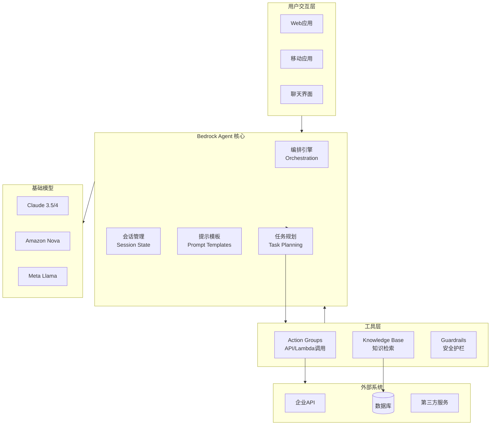
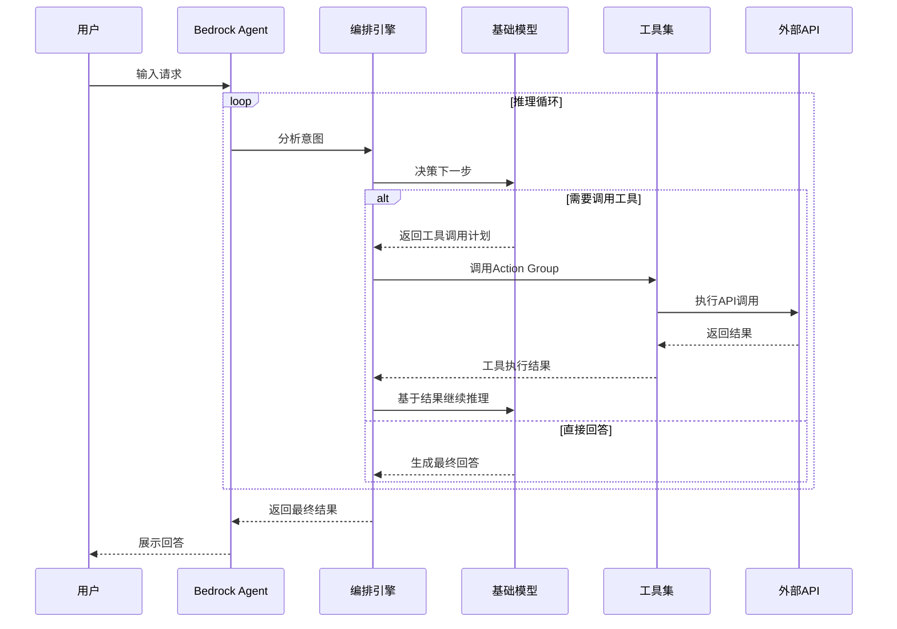
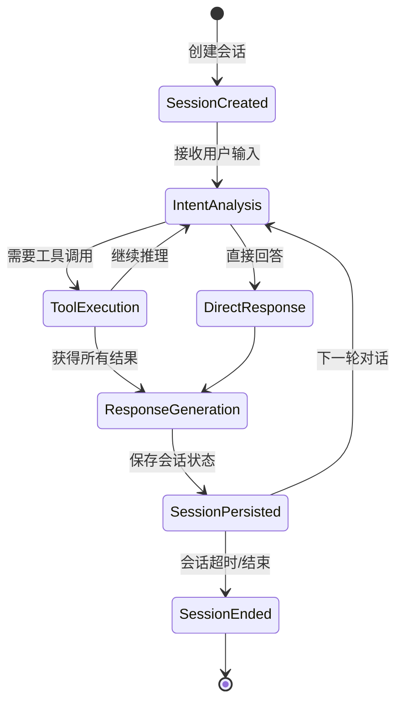

# Amazon Bedrock Agents (智能体) 博客素材收集文档

> 收集时间: 2026-03-01  
> 服务: Amazon Bedrock Agents  
> 来源: AWS官方文档、博客、最佳实践

---

## Agent 1: 初级布道者 (Junior Advocate)

### 服务概述

**Amazon Bedrock Agents** 是 AWS 提供的全托管智能体服务，能够自动分解复杂任务、调用 API 和知识库、维护多轮对话状态，无需编写复杂编排代码即可构建生产级 AI 应用。

**Bedrock Agents vs AgentCore 对比**:

| 特性 | Amazon Bedrock Agents | Amazon Bedrock AgentCore |
|------|----------------------|-------------------------|
| **定位** | 声明式智能体构建 | 编程式智能体运行时 |
| **使用方式** | 控制台配置 + API 调用 | SDK 编程 + 代码部署 |
| **学习曲线** | 低（配置驱动） | 中高（代码驱动） |
| **灵活性** | 中等（预置模式） | 高（完全自定义） |
| **适用场景** | 快速原型、标准工作流 | 复杂逻辑、高度定制 |
| **扩展性** | 自动扩展 | 需配置并发和内存 |
| **冷启动** | 无（托管服务） | 有（运行时初始化） |

**一句话选择建议**: 
> 需要**快速上线标准智能体** → Bedrock Agents；需要**深度定制复杂逻辑** → AgentCore

## 架构图

### Bedrock Agents 系统架构



### Agent 执行流程



### Action Group 架构

```mermaid
flowchart LR
    subgraph ActionGroup["Action Group"]
        APISchema[API Schema\nOpenAPI规格]
        LambdaExecutor[Lambda执行器\nbusiness_logic]
        Parameters[参数映射\nParameter Mapping]
    end
    
    subgraph APIOperations["API操作"]
        Op1[GET /orders/{id}]
        Op2[POST /refunds]
        Op3[PUT /users/{id}]
    end
    
    subgraph Backend["后端系统"]
        OrderService[订单服务]
        PaymentService[支付服务]
        UserService[用户服务]
    end
    
    Agent-->ActionGroup
    APISchema-->APIOperations
    APIOperations-->Parameters
    Parameters-->LambdaExecutor
    LambdaExecutor-->Backend
```

### 多轮对话状态管理



---

### 核心组件 (6个必知组件)

| 组件 | 功能描述 | 类比 |
|------|----------|------|
| **Agent** | 智能体核心，包含指令、模型选择、会话管理 | "大脑" - 决策中枢 |
| **Action Groups** | 定义可调用 API 和 Lambda 函数 | "双手" - 执行操作 |
| **Knowledge Base** | 关联 RAG 知识库，提供领域知识 | "记忆库" - 存储专业知识 |
| **Session State** | 维护多轮对话上下文和用户属性 | "短期记忆" - 对话上下文 |
| **Prompt Templates** | 预置和自定义提示模板 | "思维框架" - 指导模型行为 |
| **Guardrails** | 内容安全过滤和敏感信息保护 | "道德准则" - 安全边界 |

### 工作原理

```
用户输入
    │
    ▼
┌─────────────────────────────────────────────────────────┐
│  Step 1: 编排 (Orchestration)                          │
│  - Agent 分析用户意图                                    │
│  - 决定是否调用工具或知识库                              │
│  - 维护会话状态                                          │
└───────────────────────┬─────────────────────────────────┘
                        │
        ┌───────────────┼───────────────┐
        ▼               ▼               ▼
┌──────────────┐ ┌──────────────┐ ┌──────────────┐
│   Action     │ │  Knowledge   │ │   Direct     │
│   Groups     │ │    Base      │ │   Response   │
│  (API/Lambda)│ │   (RAG)      │ │              │
└───────┬──────┘ └───────┬──────┘ └──────────────┘
        │               │
        ▼               ▼
┌─────────────────────────────────────────────────────────┐
│  Step 2: 执行 (Action Execution)                       │
│  - 调用外部 API 获取数据                                 │
│  - 从知识库检索相关文档                                  │
│  - 处理返回结果                                          │
└───────────────────────┬─────────────────────────────────┘
                        │
                        ▼
┌─────────────────────────────────────────────────────────┐
│  Step 3: 生成 (Response Generation)                    │
│  - 整合工具返回结果                                      │
│  - 结合知识库上下文                                      │
│  - 生成最终回复                                          │
└─────────────────────────────────────────────────────────┘
```

### Quick Start - 最核心CLI命令

```bash
# 1. 创建 Agent (基础配置)
aws bedrock-agent create-agent \
    --agent-name "customer-support-agent" \
    --description "AI customer support agent with order lookup" \
    --idle-session-ttl-in-seconds 1800 \
    --instruction "You are a helpful customer support assistant. Help users with order inquiries and refunds." \
    --foundation-model "anthropic.claude-3-sonnet-20240229-v1:0"

# 2. 创建 Action Group (定义可调用 API)
aws bedrock-agent create-agent-action-group \
    --agent-id "<agent-id-from-step-1>" \
    --agent-version "DRAFT" \
    --action-group-name "order-management" \
    --action-group-executor '{"lambda": "arn:aws:lambda:us-east-1:123456789012:function:orderAPI"}' \
    --api-schema '{"payload": "s3://my-bucket/api-schema/openapi.json"}' \
    --description "APIs for order lookup and management"

# 3. 关联 Knowledge Base (可选)
aws bedrock-agent associate-agent-knowledge-base \
    --agent-id "<agent-id>" \
    --agent-version "DRAFT" \
    --knowledge-base-id "<kb-id>" \
    --knowledge-base-state "ENABLED" \
    --description "Product documentation and FAQ"

# 4. 准备 Agent (创建测试版本)
aws bedrock-agent prepare-agent \
    --agent-id "<agent-id>"

# 5. 创建别名 (用于生产调用)
aws bedrock-agent create-agent-alias \
    --agent-id "<agent-id>" \
    --agent-alias-name "prod" \
    --description "Production alias"

# 6. 调用 Agent
aws bedrock-agent-runtime invoke-agent \
    --agent-id "<agent-id>" \
    --agent-alias-id "<alias-id>" \
    --session-id "user-session-123" \
    --input-text "查询我的订单状态，订单号是12345" \
    --enable-trace true \
    output.json
```

### 官方文档入口

- 服务概述: https://docs.aws.amazon.com/bedrock/latest/userguide/agents.html
- 开发者指南: https://docs.aws.amazon.com/bedrock/latest/userguide/agent-create.html
- API Reference: https://docs.aws.amazon.com/bedrock/latest/APIReference/API_Operations_Agents_for_Amazon_Bedrock.html

---

## Agent 2: 高级开发攻擂手 (Senior Developer)

### 重点分析 (Problem-Oriented)

#### 1. Error Handling - 高频错误码深度解析

| 错误码 | HTTP状态 | 场景 | 深层原因 | 解决方案 |
|--------|----------|------|----------|----------|
| `ValidationException` | 400 | 参数验证失败 | Action Group 配置错误、API Schema 无效 | 检查 OpenAPI 格式；验证 Lambda 返回格式 |
| `ResourceNotFound` | 404 | Agent/Alias 不存在 | 未创建或 ID 错误 | 确认 Agent 已 prepare；使用正确 alias |
| `ServiceQuotaExceeded` | 429 | 超出配额 | 并发请求数超过限制 | 默认 100 TPS，可申请提升 |
| `ThrottlingException` | 429 | 请求被限流 | 突发流量超过限制 | 指数退避重试；使用预置并发 |
| `DependencyFailedException` | 424 | 依赖服务失败 | Lambda 超时、Knowledge Base 不可用 | 检查 Lambda 日志；验证 KB 状态 |
| `AccessDeniedException` | 403 | 权限不足 | IAM 缺少必要权限 | 检查 Agent Role 和 User Role 权限 |
| `ConflictException` | 409 | 资源冲突 | 并发修改 Agent 配置 | 使用版本控制；避免并发更新 |
| `InternalServerException` | 500 | 服务内部错误 | Bedrock 服务异常 | 指数退避重试；联系 AWS 支持 |
| `ModelNotReadyException` | 503 | 模型未就绪 | Agent 未 prepare 或正在更新 | 确保 Agent 状态为 PREPARED |
| `MalformedLambdaResponse` | 422 | Lambda 返回格式错误 | 未返回要求的 JSON 格式 | 检查 Lambda 返回是否符合 Bedrock Agent 规范 |

**Lambda 响应格式规范**:
```python
# 正确的 Lambda 返回格式
{
    "statusCode": 200,
    "body": {
        "application/json": {
            "orderId": "12345",
            "status": "shipped",
            "trackingNumber": "ABC123"
        }
    },
    "sessionAttributes": {},
    "promptSessionAttributes": {}
}

# 错误返回格式
{
    "statusCode": 400,
    "body": {
        "application/json": {
            "error": "Order not found"
        }
    }
}
```

#### 2. Session State 管理

**会话状态三层架构**:
```
┌─────────────────────────────────────────────────────────┐
│              Session State Architecture                 │
│                                                         │
│  ┌─────────────────────────────────────────────────┐   │
│  │  Layer 1: Session Attributes (会话级)           │   │
│  │  - 当前对话的临时状态                             │   │
│  │  - 跨 Action Group 共享                           │   │
│  │  - 会话结束清除                                   │   │
│  │  示例: {"currentOrderId": "12345", "step": 2}    │   │
│  └─────────────────────────────────────────────────┘   │
│                                                         │
│  ┌─────────────────────────────────────────────────┐   │
│  │  Layer 2: Prompt Session Attributes (提示级)    │   │
│  │  - 用于动态修改系统提示                           │   │
│  │  - 影响模型行为                                   │   │
│  │  示例: {"userTier": "premium", "language": "zh"} │   │
│  └─────────────────────────────────────────────────┘   │
│                                                         │
│  ┌─────────────────────────────────────────────────┐   │
│  │  Layer 3: Conversation History (对话历史)       │   │
│  │  - 多轮对话上下文                                 │   │
│  │  - 自动管理，可配置窗口大小                       │   │
│  └─────────────────────────────────────────────────┘   │
└─────────────────────────────────────────────────────────┘
```

**Python SDK - 会话状态管理**:
```python
import boto3
import json

bedrock_agent = boto3.client('bedrock-agent-runtime')

def invoke_with_session_state(agent_id, alias_id, session_id, input_text, 
                               session_attrs=None, prompt_attrs=None):
    """
    带会话状态的 Agent 调用
    """
    
    # 构建会话状态
    session_state = {
        "sessionAttributes": session_attrs or {},
        "promptSessionAttributes": prompt_attrs or {}
    }
    
    response = bedrock_agent.invoke_agent(
        agentId=agent_id,
        agentAliasId=alias_id,
        sessionId=session_id,
        inputText=input_text,
        sessionState=session_state,
        enableTrace=True  # 启用追踪查看推理过程
    )
    
    # 解析流式响应
    completion = ""
    trace_data = []
    
    for event in response['completion']:
        if 'chunk' in event:
            chunk = event['chunk']
            if 'bytes' in chunk:
                completion += chunk['bytes'].decode('utf-8')
        
        if 'trace' in event:
            trace_data.append(event['trace'])
    
    return {
        'completion': completion,
        'traces': trace_data
    }

# 使用示例：多轮对话场景
def multi_turn_conversation():
    agent_id = "ABC123DEF456"
    alias_id = "GHI789"
    session_id = "user-session-001"
    
    # 第一轮：用户提供订单号
    response1 = invoke_with_session_state(
        agent_id=agent_id,
        alias_id=alias_id,
        session_id=session_id,
        input_text="我想查询订单状态，订单号是 12345",
        session_attrs={"intent": "order_inquiry"}
    )
    
    # 第二轮：Agent 自动记住订单号
    response2 = invoke_with_session_state(
        agent_id=agent_id,
        alias_id=alias_id,
        session_id=session_id,
        input_text="帮我取消这个订单"  # Agent 知道"这个"指代订单 12345
    )
```

#### 3. Action Group 高级配置

**Return of Control (手动控制)**:
```python
# 场景：敏感操作需要人工确认
# 在 Action Group 中配置 returnOfControl

action_group_config = {
    "actionGroupName": "payment-actions",
    "actionGroupExecutor": {
        "customControl": "RETURN_CONTROL"  # 关键配置
    },
    "apiSchema": {
        "s3": {
            "s3BucketName": "my-bucket",
            "s3ObjectKey": "payment-api.json"
        }
    }
}

# 客户端处理流程
def invoke_with_manual_confirmation(agent_id, alias_id, session_id, input_text):
    """
    处理需要人工确认的 Action
    """
    response = bedrock_agent.invoke_agent(
        agentId=agent_id,
        agentAliasId=alias_id,
        sessionId=session_id,
        inputText=input_text
    )
    
    for event in response['completion']:
        # 检查是否需要人工确认
        if 'returnControl' in event:
            control = event['returnControl']
            action = control['invocationInputs'][0]['actionGroupInvocationInput']
            
            api_path = action['apiPath']
            parameters = action['parameters']
            
            # 显示给用户确认
            print(f"Agent 想要执行: {api_path}")
            print(f"参数: {parameters}")
            
            user_confirmed = input("确认执行? (yes/no): ")
            
            if user_confirmed.lower() == 'yes':
                # 手动执行 API
                result = execute_api_manually(api_path, parameters)
                
                # 将结果返回给 Agent
                return resume_agent_with_result(
                    agent_id, alias_id, session_id, 
                    control['invocationId'], result
                )
            else:
                return {"status": "cancelled"}

def resume_agent_with_result(agent_id, alias_id, session_id, invocation_id, result):
    """将手动执行结果返回给 Agent"""
    
    session_state = {
        "invocationId": invocation_id,
        "returnControlInvocationResults": [{
            "actionGroupInvocationOutput": {
                "text": json.dumps(result)
            }
        }]
    }
    
    response = bedrock_agent.invoke_agent(
        agentId=agent_id,
        agentAliasId=alias_id,
        sessionId=session_id,
        sessionState=session_state
    )
    
    return parse_response(response)
```

#### 4. 与 Knowledge Base 集成模式

**RAG 查询优化**:
```python
# 配置 Knowledge Base 检索参数
knowledge_base_config = {
    "knowledgeBaseId": "kb-12345",
    "retrievalConfiguration": {
        "vectorSearchConfiguration": {
            "numberOfResults": 5,  # 返回结果数量
            "overrideSearchType": "HYBRID",  # 混合搜索
            "filter": {
                "equals": {
                    "key": "category",
                    "value": "troubleshooting"
                }
            },
            "rerankingConfiguration": {
                "type": "BEDROCK_RERANKING_MODEL",
                "bedrockRerankingConfiguration": {
                    "numberOfRerankedResults": 3,
                    "modelConfiguration": {
                        "modelArn": "arn:aws:bedrock:us-east-1::foundation-model/amazon.rerank-v1:0"
                    }
                }
            }
        }
    }
}
```

### 服务配额 (Service Quotas)

| 配额项 | 默认值 | 可调 | 备注 |
|--------|--------|------|------|
| Agents/账户 | 100 | ✅ | 生产环境可申请更多 |
| Agent 别名/Agent | 10 | ✅ | - |
| Action Groups/Agent | 20 | ❌ | - |
| API 操作/Action Group | 20 | ❌ | - |
| Knowledge Bases/Agent | 5 | ✅ | - |
| 并发 InvokeAgent TPS | 100 | ✅ | 按别名维度 |
| 单会话空闲超时 | 1800s (30min) | ✅ | 最大 24小时 |
| 单轮最大 Token | 模型特定 | ❌ | 取决于 FM |
| Lambda 超时 | 60s | ✅ | 最大 900s |
| Input 文本长度 | 4096 字符 | ❌ | - |

---

## Agent 3: 自动化部署专家 (DevOps Engineer)

### IaC Delivery - Terraform 模板

```hcl
# ============================================
# Bedrock Agent 生产级部署
# ============================================

terraform {
  required_providers {
    aws = {
      source  = "hashicorp/aws"
      version = "~> 5.0"
    }
  }
}

provider "aws" {
  region = var.aws_region
}

# ============================================
# 1. IAM Role - Agent 执行角色
# ============================================
resource "aws_iam_role" "agent_execution" {
  name = "${var.project_name}-agent-execution-role"

  assume_role_policy = jsonencode({
    Version = "2012-10-17"
    Statement = [{
      Action = "sts:AssumeRole"
      Effect = "Allow"
      Principal = {
        Service = "bedrock.amazonaws.com"
      }
      Condition = {
        StringEquals = {
          "aws:SourceAccount" = data.aws_caller_identity.current.account_id
        }
      }
    }]
  })
}

# Agent 执行策略
resource "aws_iam_role_policy" "agent_policy" {
  name = "agent-permissions"
  role = aws_iam_role.agent_execution.id

  policy = jsonencode({
    Version = "2012-10-17"
    Statement = [
      {
        Sid    = "BedrockInvokeModel"
        Effect = "Allow"
        Action = [
          "bedrock:InvokeModel",
          "bedrock:InvokeModelWithResponseStream"
        ]
        Resource = [
          "arn:aws:bedrock:${var.aws_region}::foundation-model/anthropic.claude-3-*",
          "arn:aws:bedrock:${var.aws_region}::foundation-model/amazon.nova-*"
        ]
      },
      {
        Sid    = "KnowledgeBaseAccess"
        Effect = "Allow"
        Action = [
          "bedrock:Retrieve",
          "bedrock:RetrieveAndGenerate"
        ]
        Resource = aws_bedrockagent_knowledge_base.main.arn
      },
      {
        Sid    = "LambdaInvoke"
        Effect = "Allow"
        Action = "lambda:InvokeFunction"
        Resource = aws_lambda_function.action_handler.arn
      }
    ]
  })
}

# ============================================
# 2. Lambda 函数 - Action Group 处理器
# ============================================
resource "aws_lambda_function" "action_handler" {
  function_name = "${var.project_name}-action-handler"
  role          = aws_iam_role.lambda_execution.arn
  handler       = "index.handler"
  runtime       = "python3.12"
  timeout       = 60
  memory_size   = 512

  filename         = data.archive_file.lambda_zip.output_path
  source_code_hash = data.archive_file.lambda_zip.output_base64sha256

  environment {
    variables = {
      LOG_LEVEL = "INFO"
    }
  }

  tracing_config {
    mode = "Active"
  }
}

# Lambda 执行角色
resource "aws_iam_role" "lambda_execution" {
  name = "${var.project_name}-lambda-execution-role"

  assume_role_policy = jsonencode({
    Version = "2012-10-17"
    Statement = [{
      Action = "sts:AssumeRole"
      Effect = "Allow"
      Principal = {
        Service = "lambda.amazonaws.com"
      }
    }]
  })
}

resource "aws_iam_role_policy_attachment" "lambda_basic" {
  role       = aws_iam_role.lambda_execution.name
  policy_arn = "arn:aws:iam::aws:policy/service-role/AWSLambdaBasicExecutionRole"
}

# ============================================
# 3. Knowledge Base
# ============================================
resource "aws_bedrockagent_knowledge_base" "main" {
  name        = "${var.project_name}-kb"
  description = "Knowledge base for ${var.project_name} agent"
  role_arn    = aws_iam_role.kb_execution.arn

  knowledge_base_configuration {
    type = "VECTOR"
    vector_knowledge_base_configuration {
      embedding_model_arn = "arn:aws:bedrock:${var.aws_region}::foundation-model/amazon.titan-embed-text-v2:0"
    }
  }

  storage_configuration {
    type = "OPENSEARCH_SERVERLESS"
    opensearch_serverless_configuration {
      collection_arn    = aws_opensearchserverless_collection.main.arn
      vector_index_name = "bedrock-kb-index"
      field_mapping {
        vector_field   = "embedding"
        text_field     = "text"
        metadata_field = "metadata"
      }
    }
  }
}

# Data Source
resource "aws_bedrockagent_data_source" "s3_docs" {
  knowledge_base_id = aws_bedrockagent_knowledge_base.main.id
  name              = "s3-documents"

  data_source_configuration {
    type = "S3"
    s3_configuration {
      bucket_arn = aws_s3_bucket.kb_docs.arn
    }
  }

  vector_ingestion_configuration {
    chunking_configuration {
      chunking_strategy = "FIXED_SIZE"
      fixed_size_chunking_configuration {
        max_tokens        = 512
        overlap_percentage = 20
      }
    }
  }
}

# ============================================
# 4. Bedrock Agent
# ============================================
resource "aws_bedrockagent_agent" "main" {
  agent_name                  = var.project_name
  description                 = "AI agent for customer support"
  idle_session_ttl_in_seconds = 1800
  instruction                 = file("${path.module}/agent-instruction.txt")
  foundation_model            = "anthropic.claude-3-sonnet-20240229-v1:0"
  agent_resource_role_arn     = aws_iam_role.agent_execution.arn

  prompt_override_configuration {
    prompt_configurations {
      prompt_type          = "PRE_PROCESSING"
      prompt_creation_mode = "OVERRIDDEN"
      prompt_state         = "ENABLED"
      base_prompt_template = file("${path.module}/prompts/pre-processing.txt")
    }
    
    prompt_configurations {
      prompt_type          = "ORCHESTRATION"
      prompt_creation_mode = "DEFAULT"
      prompt_state         = "ENABLED"
    }
    
    prompt_configurations {
      prompt_type          = "KNOWLEDGE_BASE_RESPONSE_GENERATION"
      prompt_creation_mode = "OVERRIDDEN"
      prompt_state         = "ENABLED"
      base_prompt_template = file("${path.module}/prompts/kb-response.txt")
    }
  }
}

# Action Group
resource "aws_bedrockagent_agent_action_group" "orders" {
  action_group_name   = "order-management"
  agent_id            = aws_bedrockagent_agent.main.id
  agent_version       = "DRAFT"
  description         = "Order lookup and management APIs"
  action_group_executor {
    lambda = aws_lambda_function.action_handler.arn
  }
  api_schema {
    payload = file("${path.module}/api-schema/orders-openapi.json")
  }
}

# Knowledge Base Association
resource "aws_bedrockagent_agent_knowledge_base_association" "main" {
  agent_id             = aws_bedrockagent_agent.main.id
  agent_version        = "DRAFT"
  description          = "Product documentation"
  knowledge_base_id    = aws_bedrockagent_knowledge_base.main.id
  knowledge_base_state = "ENABLED"
}

# 准备 Agent
resource "aws_bedrockagent_agent_prepare" "main" {
  agent_id = aws_bedrockagent_agent.main.id
  
  depends_on = [
    aws_bedrockagent_agent_action_group.orders,
    aws_bedrockagent_agent_knowledge_base_association.main
  ]
}

# Agent Alias
resource "aws_bedrockagent_agent_alias" "prod" {
  agent_id     = aws_bedrockagent_agent.main.id
  agent_alias_name = "prod"
  description  = "Production alias"
  
  routing_configuration {
    agent_version = aws_bedrockagent_agent_prepare.main.prepared_agent_version
  }
}

# ============================================
# 5. CloudWatch 告警
# ============================================
resource "aws_cloudwatch_metric_alarm" "agent_errors" {
  alarm_name          = "${var.project_name}-agent-errors"
  comparison_operator = "GreaterThanThreshold"
  evaluation_periods  = 2
  metric_name         = "InvocationErrors"
  namespace           = "AWS/Bedrock/Agents"
  period              = 300
  statistic           = "Sum"
  threshold           = 10
  alarm_description   = "Agent 调用错误数超过阈值"
  alarm_actions       = [aws_sns_topic.alerts.arn]

  dimensions = {
    AgentId = aws_bedrockagent_agent.main.id
  }
}

resource "aws_cloudwatch_metric_alarm" "agent_latency" {
  alarm_name          = "${var.project_name}-agent-latency"
  comparison_operator = "GreaterThanThreshold"
  evaluation_periods  = 3
  metric_name         = "Latency"
  namespace           = "AWS/Bedrock/Agents"
  period              = 60
  statistic           = "p99"
  threshold           = 5000
  alarm_description   = "P99 延迟超过 5 秒"
  alarm_actions       = [aws_sns_topic.alerts.arn]

  dimensions = {
    AgentId = aws_bedrockagent_agent.main.id
  }
}

# SNS Topic
resource "aws_sns_topic" "alerts" {
  name = "${var.project_name}-agent-alerts"
}

# ============================================
# Data Sources
# ============================================
data "aws_caller_identity" "current" {}

data "archive_file" "lambda_zip" {
  type        = "zip"
  source_file = "${path.module}/lambda/index.py"
  output_path = "${path.module}/lambda.zip"
}

# ============================================
# Variables
# ============================================
variable "project_name" {
  description = "项目名称"
  type        = string
  default     = "bedrock-agent"
}

variable "aws_region" {
  description = "AWS 区域"
  type        = string
  default     = "us-east-1"
}

# ============================================
# Outputs
# ============================================
output "agent_id" {
  description = "Agent ID"
  value       = aws_bedrockagent_agent.main.id
}

output "agent_alias_id" {
  description = "Agent Alias ID (用于调用)"
  value       = aws_bedrockagent_agent_alias.prod.id
}

output "knowledge_base_id" {
  description = "Knowledge Base ID"
  value       = aws_bedrockagent_knowledge_base.main.id
}
```

### Observability - 关键指标监控

| 指标 | 告警阈值 | 意义 |
|------|----------|------|
| **InvocationErrors** | > 10/5分钟 | 调用失败率 |
| **Latency P99** | > 5s | 用户体验质量 |
| **ThrottledRequests** | > 5/小时 | 限流情况 |
| **KnowledgeBaseRetrievalLatency** | > 2s | RAG 检索性能 |
| **ActionGroupInvocationErrors** | > 5/小时 | Lambda/API 错误 |

---

## Agent 4: 首席云架构师 (Cloud Architect)

### Well-Architected Framework 评估

#### 1. Security - 安全架构

```
用户请求
    │
    ▼
┌─────────────────────────────────────────────────────────┐
│  Layer 1: Authentication & Authorization                 │
│  - IAM Policy 控制谁可以调用 Agent                      │
│  - Resource-based Policy 控制跨账户访问                  │
├─────────────────────────────────────────────────────────┤
│  Layer 2: Guardrails                                    │
│  - 输入/输出内容过滤                                     │
│  - PII 脱敏                                             │
│  - 话题拒绝                                             │
├─────────────────────────────────────────────────────────┤
│  Layer 3: Agent 内部安全                                │
│  - Action Group 权限隔离                                 │
│  - Knowledge Base 行级安全                              │
│  - Session State 加密                                   │
├─────────────────────────────────────────────────────────┤
│  Layer 4: 下游服务安全                                  │
│  - Lambda 执行角色最小权限                              │
│  - API 调用加密传输                                     │
│  - VPC 网络隔离                                         │
└─────────────────────────────────────────────────────────┘
```

#### 2. Reliability - 高可用架构

```
                    ┌─────────────────┐
                    │   Amazon API    │
                    │    Gateway      │
                    │  (Throttling)   │
                    └────────┬────────┘
                             │
              ┌──────────────┼──────────────┐
              ▼              ▼              ▼
       ┌──────────┐   ┌──────────┐   ┌──────────┐
       │ us-east-1│   │ us-west-2│   │ eu-west-1│
       │ Primary  │   │ Failover │   │   DR     │
       │ Agent    │   │  Agent   │   │  Agent   │
       │  100 TPS │   │  100 TPS │   │  100 TPS │
       └────┬─────┘   └────┬─────┘   └────┬─────┘
            │              │              │
            └──────────────┼──────────────┘
                           │
                    ┌──────▼──────┐
                    │  Route 53   │
                    │ Health Check│
                    └─────────────┘
```

**跨区域故障转移策略**:
- 使用 Route 53 健康检查自动路由
- 每个区域独立配额，可叠加
- 会话状态不跨区域，需客户端处理

#### 3. Cost Optimization

| 成本驱动因素 | 优化策略 | 节省幅度 |
|-------------|----------|----------|
| **模型调用** | 选择 Nova Lite 处理简单查询 | 90% |
| **Knowledge Base 检索** | 调整返回结果数量 | 30-50% |
| **Lambda 执行** | 优化 Lambda 内存配置 | 20-40% |
| **向量存储** | 合理设置索引分片 | 10-20% |

**分层模型策略成本对比**:
```
全部使用 Claude 3.5 Sonnet: $100/月
分层策略 (Nova Lite 80% + Sonnet 20%): $28/月
节省: 72%
```

### 关键决策树

```
应用场景分析
    │
    ├──► 需要完全自定义编排逻辑? ──是──► 使用 AgentCore
    │
    ├──► 需要快速上线标准 RAG 应用? ──是──► 使用 Bedrock Agents
    │
    ├──► 需要复杂多步骤工作流? ──是──► Bedrock Agents + Step Functions
    │
    ├──► 需要与现有代码深度集成? ──是──► AgentCore SDK
    │
    └──► 需要预置 Action 模板? ──是──► Bedrock Agents (内置 API 模板)
```

### 与 AgentCore 集成模式

```python
# 混合架构：Bedrock Agents 处理标准流程，AgentCore 处理复杂逻辑

class HybridAgentSystem:
    """混合智能体系统"""
    
    def __init__(self):
        self.bedrock_agent = boto3.client('bedrock-agent-runtime')
        self.agentcore = boto3.client('bedrock-agentcore')
    
    def process_request(self, user_input: str, session_id: str):
        """
        智能路由：根据查询复杂度选择后端
        """
        
        # 第一步：使用轻量级模型分类查询复杂度
        complexity = self._classify_complexity(user_input)
        
        if complexity == "SIMPLE":
            # 简单查询 → Bedrock Agents (成本低、响应快)
            return self._call_bedrock_agent(user_input, session_id)
        
        elif complexity == "COMPLEX":
            # 复杂查询 → AgentCore (完全自定义)
            return self._call_agentcore(user_input, session_id)
        
        else:  # HYBRID
            # 混合处理：Agent 收集信息，AgentCore 处理复杂逻辑
            context = self._call_bedrock_agent(user_input, session_id)
            return self._call_agentcore_with_context(
                user_input, session_id, context
            )
    
    def _classify_complexity(self, user_input: str) -> str:
        """使用 Nova Micro 进行快速分类"""
        # ... 分类逻辑
        pass
```

---

## 附录: 参考资源

### 官方文档
- [Bedrock Agents User Guide](https://docs.aws.amazon.com/bedrock/latest/userguide/agents.html)
- [Action Groups](https://docs.aws.amazon.com/bedrock/latest/userguide/agents-action-create.html)
- [Session State](https://docs.aws.amazon.com/bedrock/latest/userguide/agents-session-state.html)

### 博客文章
- [Building AI Agents with Bedrock](https://aws.amazon.com/blogs/machine-learning/build-ai-agents-with-amazon-bedrock/)
- [Best Practices for Bedrock Agents](https://aws.amazon.com/blogs/machine-learning/best-practices-for-deploying-agents-with-amazon-bedrock/)

### GitHub 示例
- [Amazon Bedrock Agents Samples](https://github.com/aws-samples/amazon-bedrock-samples/tree/main/agents)

---

*文档生成完成 | 基于 AWS 官方文档和最佳实践整理*
