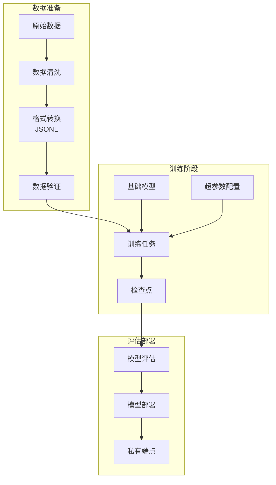
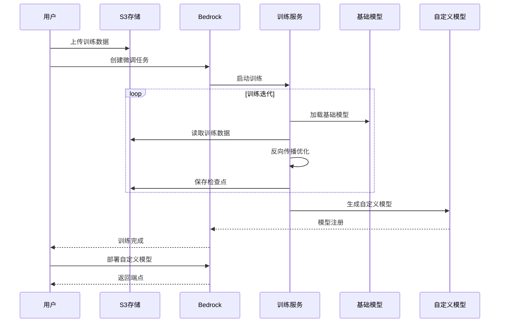
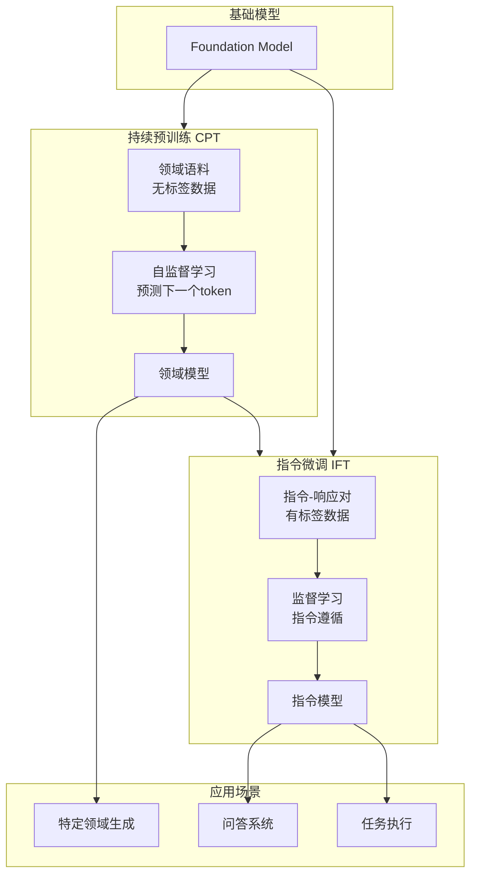

# Amazon Bedrock Fine-tuning (模型微调) 博客素材收集文档

> 收集时间: 2026-03-01  
> 服务: Amazon Bedrock Model Customization  
> 来源: AWS官方文档、博客、最佳实践

---

## Agent 1: 初级布道者 (Junior Advocate)

### 服务概述

**Amazon Bedrock Fine-tuning** 是 AWS 提供的全托管模型定制服务，允许使用企业私有数据对基础模型 (Foundation Models) 进行继续训练，创建专属于您的定制化模型。支持微调 (Fine-tuning) 和持续预训练 (Continued Pre-training) 两种模式。

**生活化类比**:  
> Bedrock Fine-tuning 就像是给 AI 模型安排"专业进修课程" —— 就像医学生完成基础医学教育后，需要针对特定专科（心脏科、神经科）进行深入学习，基础模型（如 Claude、Llama）通过 Fine-tuning 可以学习特定领域的专业知识（法律、医疗、金融），成为该领域的"专家"。

## 架构图

### 模型微调架构



### 微调训练流程



### 持续预训练 vs 指令微调



---

### 微调 vs 预训练模型对比

| 特性 | 预训练基础模型 | 微调后模型 |
|------|---------------|-----------|
| **知识来源** | 通用互联网数据 | 通用数据 + 企业私有数据 |
| **领域专业性** | 通用，广度优先 | 专业，深度优先 |
| **输出风格** | 标准、通用 | 可定制（语气、格式、术语） |
| **准确率** | 一般（领域问题） | 更高（特定领域） |
| **成本** | 按调用付费 | 训练成本 + 部署成本 + 调用成本 |
| **隐私性** | 数据可能用于训练 | 私有数据隔离 |

### 两种定制模式

| 模式 | 适用场景 | 数据量 | 训练时间 | 成本 |
|------|---------|--------|----------|------|
| **Fine-tuning** | 特定任务优化（分类、摘要、客服） | 1K-100K 样本 | 小时级 | 较低 |
| **Continued Pre-training** | 领域知识注入（法律、医疗、金融） | 1GB-100GB 原始文本 | 天级 | 较高 |

### 支持的模型 (2024-2025)

| 提供商 | 模型 | 支持模式 | 上下文长度 |
|--------|------|---------|-----------|
| **Amazon** | Titan Express | Fine-tuning | 8K |
| **Amazon** | Titan Lite | Fine-tuning | 4K |
| **Meta** | Llama 3.2 1B/3B | Fine-tuning | 128K |
| **Meta** | Llama 3.2 11B/90B (Vision) | Fine-tuning | 128K |
| **Meta** | Llama 3.1 8B/70B | Fine-tuning | 128K |
| **Meta** | Llama 3 8B/70B | Fine-tuning | 8K |
| **Cohere** | Command | Fine-tuning | 4K |
| **Cohere** | Command Light | Fine-tuning | 4K |

### 工作原理

```
┌─────────────────────────────────────────────────────────┐
│                  Fine-tuning Pipeline                   │
│                                                         │
│  Step 1: 数据准备                                        │
│  ┌─────────────────────────────────────────────────┐   │
│  │ • 收集领域特定数据 (JSONL/CSV/Parquet)            │   │
│  │ • 数据清洗和格式化                                │   │
│  │ • 划分为训练集/验证集 (80/20 或 90/10)           │   │
│  └───────────────────────┬─────────────────────────┘   │
│                          │                              │
│                          ▼                              │
│  Step 2: 上传数据到 S3                                   │
│  ┌─────────────────────────────────────────────────┐   │
│  │ • 创建 S3 bucket                                  │   │
│  │ • 上传训练数据                                    │   │
│  │ • 配置 IAM 权限                                   │   │
│  └───────────────────────┬─────────────────────────┘   │
│                          │                              │
│                          ▼                              │
│  Step 3: 创建 Fine-tuning Job                          │
│  ┌─────────────────────────────────────────────────┐   │
│  │ • 选择基础模型                                    │   │
│  │ • 配置超参数 (epochs, batch_size, LR)            │   │
│  │ • 启动训练作业                                    │   │
│  └───────────────────────┬─────────────────────────┘   │
│                          │                              │
│                          ▼                              │
│  Step 4: 训练监控                                        │
│  ┌─────────────────────────────────────────────────┐   │
│  │ • CloudWatch 监控训练指标                         │   │
│  │ • 验证 Loss 曲线                                  │   │
│  │ • 早停 (Early Stopping)                          │   │
│  └───────────────────────┬─────────────────────────┘   │
│                          │                              │
│                          ▼                              │
│  Step 5: 模型评估与部署                                  │
│  ┌─────────────────────────────────────────────────┐   │
│  │ • 评估微调后模型性能                              │   │
│  │ • 购买 Provisioned Throughput                    │   │
│  │ • 部署为生产端点                                  │   │
│  └─────────────────────────────────────────────────┘   │
└─────────────────────────────────────────────────────────┘
```

### Quick Start - 最核心CLI命令

```bash
# 1. 准备训练数据 (JSONL 格式)
# train.jsonl
# {"prompt": "问题：什么是深度学习？", "completion": "深度学习是机器学习的一个子集..."}
# {"prompt": "问题：什么是神经网络？", "completion": "神经网络是一种模仿人脑结构的计算模型..."}

# 2. 上传数据到 S3
aws s3 cp train.jsonl s3://my-finetuning-data/train/
aws s3 cp validation.jsonl s3://my-finetuning-data/validation/

# 3. 创建 Fine-tuning Job (Amazon Titan)
aws bedrock create-model-customization-job \
    --job-name "customer-support-tuning-v1" \
    --custom-model-name "customer-support-model-v1" \
    --role-arn "arn:aws:iam::123456789012:role/BedrockFineTuningRole" \
    --base-model-identifier "amazon.titan-text-express-v1" \
    --training-data-config '{"s3Uri": "s3://my-finetuning-data/train/"}' \
    --validation-data-config '{"s3Uri": "s3://my-finetuning-data/validation/"}' \
    --output-data-config '{"s3Uri": "s3://my-finetuning-output/"}' \
    --hyper-parameters '{
        "epochCount": "3",
        "batchSize": "32",
        "learningRate": "0.00001",
        "learningRateWarmupSteps": "10"
    }'

# 4. 查看训练状态
aws bedrock get-model-customization-job \
    --job-identifier "arn:aws:bedrock:us-east-1:123456789012:model-customization-job/customer-support-tuning-v1"

# 5. 列出所有自定义模型
aws bedrock list-custom-models

# 6. 购买 Provisioned Throughput (部署模型)
aws bedrock create-provisioned-model-throughput \
    --model-units 1 \
    --provisioned-model-name "customer-support-provisioned" \
    --model-id "arn:aws:bedrock:us-east-1:123456789012:custom-model/customer-support-model-v1"

# 7. 调用微调后的模型
aws bedrock-runtime invoke-model \
    --model-id "arn:aws:bedrock:us-east-1:123456789012:provisioned-model/customer-support-provisioned" \
    --body '{"inputText": "客户询问退货政策", "textGenerationConfig": {"maxTokenCount": 256}}'
```

### 官方文档入口

- Fine-tuning Guide: https://docs.aws.amazon.com/bedrock/latest/userguide/model-customization.html
- Supported Models: https://docs.aws.amazon.com/bedrock/latest/userguide/custom-models.html
- Pricing: https://aws.amazon.com/bedrock/pricing/

---

## Agent 2: 高级开发攻擂手 (Senior Developer)

### 重点分析 (Problem-Oriented)

#### 1. 数据准备最佳实践

**数据格式要求**:
```json
// Fine-tuning (Instruction tuning) - JSONL 格式
{"prompt": "用户问题或指令", "completion": "期望的回答"}

// 示例：客服场景
{"prompt": "客户：我的订单什么时候发货？\n订单号：12345", "completion": "您好！我帮您查询一下订单 12345 的状态。根据系统显示，您的订单已于昨天发货，预计 2-3 个工作日内送达。您可以通过运单号 ABC123 在快递公司官网跟踪物流信息。还有其他可以帮助您的吗？"}

{"prompt": "客户：我要退货\n原因：尺寸不合适", "completion": "理解您的需求。关于退货，我们提供 7 天无理由退货服务。请确保商品保持原状，吊牌完整。您可以：1) 登录官网申请退货；2) 拨打客服热线 400-xxx；3) 前往线下门店办理。退货运费由我们承担。需要我帮您发起退货申请吗？"}
```

**数据质量控制**:
```python
import json
import pandas as pd
from typing import List, Dict, Tuple

class DataQualityChecker:
    """训练数据质量检查器"""
    
    def __init__(self, max_prompt_length: int = 2048, max_completion_length: int = 2048):
        self.max_prompt_length = max_prompt_length
        self.max_completion_length = max_completion_length
        self.issues = []
    
    def check_dataset(self, file_path: str) -> Dict:
        """检查数据集质量"""
        
        data = []
        with open(file_path, 'r', encoding='utf-8') as f:
            for line in f:
                try:
                    data.append(json.loads(line))
                except json.JSONDecodeError as e:
                    self.issues.append(f"JSON parse error: {e}")
        
        checks = {
            "total_samples": len(data),
            "valid_samples": 0,
            "avg_prompt_length": 0,
            "avg_completion_length": 0,
            "issues": [],
            "recommendations": []
        }
        
        prompt_lengths = []
        completion_lengths = []
        
        for idx, sample in enumerate(data):
            # 检查必要字段
            if 'prompt' not in sample or 'completion' not in sample:
                checks["issues"].append(f"Line {idx}: Missing required fields")
                continue
            
            prompt = sample['prompt']
            completion = sample['completion']
            
            # 检查空值
            if not prompt.strip() or not completion.strip():
                checks["issues"].append(f"Line {idx}: Empty prompt or completion")
                continue
            
            # 检查长度
            if len(prompt) > self.max_prompt_length:
                checks["issues"].append(f"Line {idx}: Prompt too long ({len(prompt)} chars)")
            
            if len(completion) > self.max_completion_length:
                checks["issues"].append(f"Line {idx}: Completion too long ({len(completion)} chars)")
            
            # 检查重复
            # ...
            
            prompt_lengths.append(len(prompt))
            completion_lengths.append(len(completion))
            checks["valid_samples"] += 1
        
        if prompt_lengths:
            checks["avg_prompt_length"] = sum(prompt_lengths) / len(prompt_lengths)
            checks["avg_completion_length"] = sum(completion_lengths) / len(completion_lengths)
        
        # 生成建议
        if checks["valid_samples"] < 1000:
            checks["recommendations"].append("建议至少 1000 个样本以获得较好效果")
        
        if checks["avg_completion_length"] < 50:
            checks["recommendations"].append("平均回答长度较短，可能需要更详细的标注")
        
        return checks
    
    def split_dataset(
        self, 
        input_file: str, 
        train_file: str, 
        validation_file: str, 
        test_file: str = None,
        train_ratio: float = 0.8,
        val_ratio: float = 0.1
    ):
        """划分训练/验证/测试集"""
        
        # 读取数据
        data = []
        with open(input_file, 'r') as f:
            data = [json.loads(line) for line in f]
        
        # 随机打乱
        import random
        random.seed(42)
        random.shuffle(data)
        
        # 计算分割点
        n = len(data)
        train_end = int(n * train_ratio)
        val_end = train_end + int(n * val_ratio)
        
        # 划分
        train_data = data[:train_end]
        val_data = data[train_end:val_end]
        test_data = data[val_end:] if test_file else None
        
        # 保存
        self._save_jsonl(train_data, train_file)
        self._save_jsonl(val_data, validation_file)
        if test_data:
            self._save_jsonl(test_data, test_file)
        
        return {
            "train": len(train_data),
            "validation": len(val_data),
            "test": len(test_data) if test_data else 0
        }
    
    def _save_jsonl(self, data: List[Dict], file_path: str):
        """保存为 JSONL"""
        with open(file_path, 'w') as f:
            for item in data:
                f.write(json.dumps(item, ensure_ascii=False) + '\n')

# 使用示例
checker = DataQualityChecker()

# 检查数据质量
quality_report = checker.check_dataset('training_data.jsonl')
print(f"有效样本: {quality_report['valid_samples']}/{quality_report['total_samples']}")
print(f"平均提示长度: {quality_report['avg_prompt_length']:.0f}")
print(f"问题数: {len(quality_report['issues'])}")

# 划分数据集
split_result = checker.split_dataset(
    'training_data.jsonl',
    'train.jsonl',
    'validation.jsonl',
    'test.jsonl'
)
print(f"数据集划分: {split_result}")
```

#### 2. 超参数调优

**关键超参数说明**:

| 超参数 | 说明 | 建议值 | 影响 |
|--------|------|--------|------|
| **epochCount** | 训练轮数 | 2-5 | 过高会过拟合，过低欠拟合 |
| **batchSize** | 批次大小 | 32-64 | 影响训练速度和稳定性 |
| **learningRate** | 学习率 | 1e-5 ~ 5e-5 | 过高不稳定，过低收敛慢 |
| **learningRateWarmupSteps** | 学习率预热步数 | 10-100 | 稳定初期训练 |

**超参数搜索策略**:
```python
from typing import List, Dict
import boto3

class HyperparameterTuner:
    """超参数调优器"""
    
    def __init__(self):
        self.bedrock = boto3.client('bedrock')
    
    def grid_search(
        self,
        base_model_id: str,
        train_data_uri: str,
        val_data_uri: str,
        output_uri: str,
        param_grid: Dict[str, List],
        role_arn: str
    ) -> List[Dict]:
        """
        网格搜索最佳超参数
        
        param_grid = {
            "epochCount": ["2", "3", "4"],
            "learningRate": ["0.00001", "0.00005"],
            "batchSize": ["32", "64"]
        }
        """
        
        import itertools
        
        # 生成所有组合
        keys = param_grid.keys()
        values = param_grid.values()
        combinations = list(itertools.product(*values))
        
        results = []
        
        for combo in combinations:
            params = dict(zip(keys, combo))
            job_name = f"tuning-{params['epochCount']}-{params['learningRate'].replace('.', '')}"
            
            # 启动训练作业
            response = self.bedrock.create_model_customization_job(
                jobName=job_name,
                customModelName=f"model-{job_name}",
                roleArn=role_arn,
                baseModelIdentifier=base_model_id,
                trainingDataConfig={'s3Uri': train_data_uri},
                validationDataConfig={'s3Uri': val_data_uri},
                outputDataConfig={'s3Uri': output_uri},
                hyperParameters=params
            )
            
            results.append({
                "job_name": job_name,
                "params": params,
                "job_arn": response['jobArn']
            })
        
        return results
    
    def evaluate_jobs(self, job_arns: List[str]) -> Dict:
        """评估所有训练作业的结果"""
        
        results = []
        
        for arn in job_arns:
            job_info = self.bedrock.get_model_customization_job(
                jobIdentifier=arn
            )
            
            if job_info['status'] == 'Completed':
                # 从输出路径获取验证指标
                metrics = self._get_validation_metrics(
                    job_info['outputDataConfig']['s3Uri']
                )
                
                results.append({
                    "job_arn": arn,
                    "status": "Completed",
                    "validation_loss": metrics.get('validation_loss'),
                    "training_loss": metrics.get('training_loss')
                })
        
        # 找出最佳模型
        best = min(results, key=lambda x: x['validation_loss'])
        
        return {
            "all_results": results,
            "best_model": best
        }
    
    def _get_validation_metrics(self, s3_output_uri: str) -> Dict:
        """从 S3 获取验证指标"""
        # 实现从 S3 读取 metrics 文件的逻辑
        import boto3
        s3 = boto3.client('s3')
        # ...
        return {"validation_loss": 0.5, "training_loss": 0.3}  # placeholder
```

#### 3. 训练监控与早停

```python
import boto3
import time
from datetime import datetime

class TrainingMonitor:
    """训练作业监控器"""
    
    def __init__(self):
        self.bedrock = boto3.client('bedrock')
        self.cloudwatch = boto3.client('cloudwatch')
    
    def monitor_training(
        self, 
        job_arn: str, 
        check_interval: int = 300,
        max_patience: int = 3
    ):
        """
        监控训练过程，实现早停逻辑
        
        Args:
            check_interval: 检查间隔（秒）
            max_patience: 验证损失不改善的最大容忍次数
        """
        
        print(f"开始监控训练作业: {job_arn}")
        
        best_val_loss = float('inf')
        patience_counter = 0
        
        while True:
            job_info = self.bedrock.get_model_customization_job(
                jobIdentifier=job_arn
            )
            
            status = job_info['status']
            print(f"[{datetime.now()}] Status: {status}")
            
            if status in ['Completed', 'Failed', 'Stopped']:
                break
            
            # 获取训练指标
            metrics = self._get_training_metrics(job_arn)
            
            if metrics and 'validation_loss' in metrics:
                val_loss = metrics['validation_loss']
                train_loss = metrics.get('training_loss', 'N/A')
                
                print(f"  Train Loss: {train_loss:.4f}, Val Loss: {val_loss:.4f}")
                
                # 早停检查
                if val_loss < best_val_loss:
                    best_val_loss = val_loss
                    patience_counter = 0
                    print(f"  ✓ 验证损失改善，最佳: {best_val_loss:.4f}")
                else:
                    patience_counter += 1
                    print(f"  ✗ 验证损失未改善 ({patience_counter}/{max_patience})")
                    
                    if patience_counter >= max_patience:
                        print("触发早停条件，准备停止训练...")
                        # 注意：Bedrock 暂不支持运行时停止，
                        # 这里可以发送告警或记录建议
                        self._send_early_stop_alert(job_arn)
            
            time.sleep(check_interval)
        
        # 训练完成，获取最终结果
        final_info = self.bedrock.get_model_customization_job(jobIdentifier=job_arn)
        
        return {
            "status": final_info['status'],
            "custom_model_arn": final_info.get('outputModelArn'),
            "metrics": final_info.get('trainingMetrics', {})
        }
    
    def _get_training_metrics(self, job_arn: str) -> Dict:
        """从 CloudWatch 获取训练指标"""
        
        # 查询 CloudWatch Metrics
        # 指标命名空间: AWS/Bedrock/Training
        
        response = self.cloudwatch.get_metric_statistics(
            Namespace='AWS/Bedrock/Training',
            MetricName='ValidationLoss',
            Dimensions=[
                {'Name': 'JobArn', 'Value': job_arn}
            ],
            StartTime=datetime.utcnow() - timedelta(hours=1),
            EndTime=datetime.utcnow(),
            Period=300,
            Statistics=['Average']
        )
        
        if response['Datapoints']:
            latest = max(response['Datapoints'], key=lambda x: x['Timestamp'])
            return {'validation_loss': latest['Average']}
        
        return {}
    
    def _send_early_stop_alert(self, job_arn: str):
        """发送早停建议告警"""
        import boto3
        sns = boto3.client('sns')
        
        sns.publish(
            TopicArn='arn:aws:sns:us-east-1:123456789012:training-alerts',
            Subject='Fine-tuning 早停建议',
            Message=f'Job {job_arn} 建议停止训练 (验证损失不再改善)'
        )
```

### 服务配额与限制

| 配额项 | 默认值 | 可调 | 备注 |
|--------|--------|------|------|
| 并发训练作业 | 1 | ✅ | 可申请提升 |
| 自定义模型数 | 10 | ✅ | 每个账户 |
| 单作业最大训练时间 | 5天 | ❌ | - |
| 训练数据大小 | 10GB | ✅ | - |
| 最小样本数 | 1000 | ❌ | Fine-tuning |
| 上下文长度 | 模型特定 | ❌ | 如 Titan: 8K |
| Provisioned Throughput 最小购买 | 1 Model Unit | ❌ | - |

---

## Agent 3: 自动化部署专家 (DevOps Engineer)

### IaC Delivery - Terraform 模板

```hcl
# ============================================
# Bedrock Fine-tuning 基础设施
# ============================================

terraform {
  required_providers {
    aws = {
      source  = "hashicorp/aws"
      version = "~> 5.0"
    }
  }
}

provider "aws" {
  region = var.aws_region
}

# ============================================
# 1. S3 Bucket - 训练数据存储
# ============================================
resource "aws_s3_bucket" "training_data" {
  bucket = "${var.project_name}-training-data-${data.aws_caller_identity.current.account_id}"
}

resource "aws_s3_bucket_versioning" "training_data" {
  bucket = aws_s3_bucket.training_data.id
  versioning_configuration {
    status = "Enabled"
  }
}

resource "aws_s3_bucket_server_side_encryption" "training_data" {
  bucket = aws_s3_bucket.training_data.id

  rule {
    apply_server_side_encryption_by_default {
      sse_algorithm = "aws:kms"
    }
    bucket_key_enabled = true
  }
}

# 训练数据目录
resource "aws_s3_object" "train_data" {
  bucket = aws_s3_bucket.training_data.id
  key    = "train/"
  source = "/dev/null"
}

resource "aws_s3_object" "validation_data" {
  bucket = aws_s3_bucket.training_data.id
  key    = "validation/"
  source = "/dev/null"
}

resource "aws_s3_object" "output_data" {
  bucket = aws_s3_bucket.training_data.id
  key    = "output/"
  source = "/dev/null"
}

# ============================================
# 2. IAM Role - Fine-tuning 执行角色
# ============================================
resource "aws_iam_role" "fine_tuning" {
  name = "${var.project_name}-fine-tuning-role"

  assume_role_policy = jsonencode({
    Version = "2012-10-17"
    Statement = [{
      Action = "sts:AssumeRole"
      Effect = "Allow"
      Principal = {
        Service = "bedrock.amazonaws.com"
      }
    }]
  })
}

resource "aws_iam_role_policy" "fine_tuning_s3" {
  name = "s3-access"
  role = aws_iam_role.fine_tuning.id

  policy = jsonencode({
    Version = "2012-10-17"
    Statement = [
      {
        Effect = "Allow"
        Action = [
          "s3:GetObject",
          "s3:ListBucket"
        ]
        Resource = [
          aws_s3_bucket.training_data.arn,
          "${aws_s3_bucket.training_data.arn}/*"
        ]
      },
      {
        Effect = "Allow"
        Action = [
          "s3:PutObject"
        ]
        Resource = "${aws_s3_bucket.training_data.arn}/output/*"
      }
    ]
  })
}

resource "aws_iam_role_policy" "fine_tuning_kms" {
  name = "kms-access"
  role = aws_iam_role.fine_tuning.id

  policy = jsonencode({
    Version = "2012-10-17"
    Statement = [{
      Effect = "Allow"
      Action = [
        "kms:Decrypt",
        "kms:GenerateDataKey"
      ]
      Resource = "*"
    }]
  })
}

# ============================================
# 3. Fine-tuning Job
# ============================================
resource "aws_bedrock_custom_model" "customer_support" {
  model_name = "${var.project_name}-customer-support-v1"
  
  job_name = "${var.project_name}-training-job-001"
  
  base_model_identifier = "amazon.titan-text-express-v1"
  
  role_arn = aws_iam_role.fine_tuning.arn
  
  training_data_config {
    s3_uri = "s3://${aws_s3_bucket.training_data.id}/train/train.jsonl"
  }
  
  validation_data_config {
    s3_uri = "s3://${aws_s3_bucket.training_data.id}/validation/validation.jsonl"
  }
  
  output_data_config {
    s3_uri = "s3://${aws_s3_bucket.training_data.id}/output/"
  }
  
  hyper_parameters = {
    epochCount                = "3"
    batchSize                 = "32"
    learningRate              = "0.00001"
    learningRateWarmupSteps   = "10"
  }
  
  # 等待训练完成
  depends_on = [aws_s3_object.train_data]
}

# ============================================
# 4. Provisioned Throughput (模型部署)
# ============================================
resource "aws_bedrock_provisioned_model_throughput" "production" {
  count = var.deploy_provisioned ? 1 : 0
  
  provisioned_model_name = "${var.project_name}-provisioned"
  model_id               = aws_bedrock_custom_model.customer_support.model_arn
  model_units            = var.model_units
  
  tags = {
    Environment = "production"
    Version     = "v1"
  }
}

# ============================================
# 5. CloudWatch 告警
# ============================================
resource "aws_cloudwatch_metric_alarm" "training_failed" {
  alarm_name          = "${var.project_name}-training-failed"
  comparison_operator = "GreaterThanThreshold"
  evaluation_periods  = 1
  metric_name         = "TrainingJobsFailed"
  namespace           = "AWS/Bedrock/Training"
  period              = 60
  statistic           = "Sum"
  threshold           = 0
  alarm_description   = "Fine-tuning job failed"
  alarm_actions       = [aws_sns_topic.alerts.arn]
}

resource "aws_sns_topic" "alerts" {
  name = "${var.project_name}-training-alerts"
}

# ============================================
# Variables
# ============================================
variable "project_name" {
  description = "项目名称"
  type        = string
  default     = "bedrock-ft"
}

variable "aws_region" {
  description = "AWS 区域"
  type        = string
  default     = "us-east-1"
}

variable "deploy_provisioned" {
  description = "是否部署 Provisioned Throughput"
  type        = bool
  default     = false
}

variable "model_units" {
  description = "Provisioned Model Units 数量"
  type        = number
  default     = 1
}

# ============================================
# Data Sources
# ============================================
data "aws_caller_identity" "current" {}

# ============================================
# Outputs
# ============================================
output "custom_model_arn" {
  description = "自定义模型 ARN"
  value       = aws_bedrock_custom_model.customer_support.model_arn
}

output "provisioned_model_arn" {
  description = "Provisioned 模型 ARN"
  value       = var.deploy_provisioned ? aws_bedrock_provisioned_model_throughput.production[0].provisioned_model_arn : null
}

output "training_data_bucket" {
  description = "训练数据 S3 Bucket"
  value       = aws_s3_bucket.training_data.id
}
```

### MLOps 流水线

**GitHub Actions - 数据验证 + 训练触发**:
```yaml
name: Fine-tuning Pipeline

on:
  push:
    paths:
      - 'training-data/**'
  workflow_dispatch:
    inputs:
      epoch_count:
        description: '训练轮数'
        default: '3'
      learning_rate:
        description: '学习率'
        default: '0.00001'

jobs:
  validate-data:
    runs-on: ubuntu-latest
    steps:
      - uses: actions/checkout@v3
      
      - name: Setup Python
        uses: actions/setup-python@v4
        with:
          python-version: '3.11'
      
      - name: Install dependencies
        run: pip install -r requirements.txt
      
      - name: Validate data format
        run: |
          python scripts/validate_data.py \
            --input training-data/raw/ \
            --output training-data/validated/
      
      - name: Check data quality
        run: |
          python scripts/check_quality.py \
            --data training-data/validated/train.jsonl
      
      - name: Split dataset
        run: |
          python scripts/split_data.py \
            --input training-data/validated/train.jsonl \
            --train-ratio 0.8 \
            --val-ratio 0.1
      
      - name: Upload to S3
        run: |
          aws s3 sync training-data/split/ s3://my-training-data/
        env:
          AWS_ACCESS_KEY_ID: ${{ secrets.AWS_ACCESS_KEY_ID }}
          AWS_SECRET_ACCESS_KEY: ${{ secrets.AWS_SECRET_ACCESS_KEY }}

  train-model:
    needs: validate-data
    runs-on: ubuntu-latest
    steps:
      - uses: actions/checkout@v3
      
      - name: Configure AWS
        uses: aws-actions/configure-aws-credentials@v2
        with:
          role-to-assume: ${{ secrets.AWS_ROLE_ARN }}
          aws-region: us-east-1
      
      - name: Start training job
        id: training
        run: |
          JOB_ARN=$(aws bedrock create-model-customization-job \
            --job-name "github-actions-${{ github.run_id }}" \
            --custom-model-name "customer-support-${{ github.run_number }}" \
            --role-arn "${{ secrets.BEDROCK_ROLE_ARN }}" \
            --base-model-identifier "amazon.titan-text-express-v1" \
            --training-data-config '{"s3Uri": "s3://my-training-data/train/"}' \
            --validation-data-config '{"s3Uri": "s3://my-training-data/validation/"}' \
            --output-data-config '{"s3Uri": "s3://my-training-data/output/"}' \
            --hyper-parameters '{
              "epochCount": "${{ github.event.inputs.epoch_count || 3 }}",
              "batchSize": "32",
              "learningRate": "${{ github.event.inputs.learning_rate || 0.00001 }}"
            }' \
            --query 'jobArn' \
            --output text)
          
          echo "job_arn=$JOB_ARN" >> $GITHUB_OUTPUT
      
      - name: Wait for training completion
        run: |
          aws bedrock wait model-customization-job-complete \
            --job-identifier ${{ steps.training.outputs.job_arn }}
      
      - name: Evaluate model
        run: |
          python scripts/evaluate_model.py \
            --job-arn ${{ steps.training.outputs.job_arn }} \
            --test-data training-data/split/test.jsonl
      
      - name: Deploy if metrics pass
        if: success()
        run: |
          # 获取模型 ARN
          MODEL_ARN=$(aws bedrock get-model-customization-job \
            --job-identifier ${{ steps.training.outputs.job_arn }} \
            --query 'outputModelArn' --output text)
          
          # 部署 Provisioned Throughput
          aws bedrock create-provisioned-model-throughput \
            --model-units 1 \
            --provisioned-model-name "customer-support-prod" \
            --model-id $MODEL_ARN
```

---

## Agent 4: 首席云架构师 (Cloud Architect)

### Well-Architected Framework 评估

#### 1. Cost Optimization

**成本结构分析**:

| 成本项 | 计费方式 | 优化策略 |
|--------|----------|----------|
| **训练计算** | $/小时 (基于实例类型) | 使用 Spot 实例（如支持）；优化超参数减少训练时间 |
| **S3 存储** | $/GB/月 | 训练后归档旧数据；使用 Intelligent-Tiering |
| **模型存储** | 包含在训练费用 | 删除不再使用的旧版本 |
| **Provisioned Throughput** | $/小时/Model Unit | 使用 Auto Scaling；非高峰时段降级 |
| **推理调用** | 包含在 PT 费用 | 缓存常见查询；批量处理 |

**成本对比示例**:
```
场景：客服机器人，日调用 10,000 次

方案 A: 基础模型 (Claude Instant)
  成本: $0.80/1K calls × 10 = $8/天 = $240/月

方案 B: Fine-tuned Titan + Provisioned Throughput (1 MU)
  训练成本: ~$200 (一次性)
  PT 成本: $18/天 × 30 = $540/月
  总计: $740/首月，之后 $540/月

盈亏平衡点: 当调用量 > 25,000/天时，微调方案更经济
```

#### 2. Security & Governance

**数据安全最佳实践**:
```
训练数据
    │
    ├──► S3 加密 (SSE-KMS)
    │    └──► 专用 KMS Key，定期轮换
    │
    ├──► 传输加密 (TLS 1.3)
    │    └──► VPC Endpoint 避免公网传输
    │
    ├──► 访问控制
    │    ├──► IAM 最小权限
    │    ├──► S3 Bucket Policy
    │    └──► VPC Endpoint Policy
    │
    └──► 审计日志
         ├──► CloudTrail 记录所有 API 调用
         └──► S3 Access Logs
```

**模型治理**:
1. **版本命名规范**: `{project}-{domain}-v{major}.{minor}`
2. **标签管理**: Team, Environment, DataClassification, ApprovalStatus
3. **审批工作流**: 训练前数据审核 → 训练后模型评估 → 生产部署审批
4. **定期审查**: 每季度审查自定义模型，删除无用版本

#### 3. 架构决策树

```
是否需要 Fine-tuning?
    │
    ├──► 基础模型已能满足需求? ──是──► 使用基础模型 + Prompt Engineering
    │
    ├──► 有高质量标注数据 (>1K)? ──否──► 先收集数据或考虑 RAG
    │
    ├──► 需要特定输出风格/格式? ──是──► Fine-tuning (推荐)
    │
    ├──► 需要领域专业知识? ──是──► Continued Pre-training
    │
    ├──► 调用量 > 10K/天? ──是──► Fine-tuning + Provisioned Throughput
    │
    └──► 预算有限且调用量低? ──是──► 考虑 Prompt Engineering 或 Agents
```

### 关键指标监控

| 指标 | 告警阈值 | 意义 |
|------|----------|------|
| Training Loss | 不收敛 | 学习率过高或数据问题 |
| Validation Loss | > Train Loss 20% | 过拟合 |
| Training Time | > 预期 50% | 资源问题或配置错误 |
| Inference Latency | > 2x 基线 | 模型退化 |
| Perplexity | > 基线 | 生成质量下降 |

### 与 RAG 的结合策略

```
复杂查询处理流程:

用户查询
    │
    ▼
┌───────────────────────┐
│ Fine-tuned 模型       │
│ - 理解领域术语         │
│ - 识别查询意图         │
└───────────┬───────────┘
            │
            ▼
┌───────────────────────┐
│ Knowledge Base 检索   │
│ - 获取相关文档         │
│ - 提供事实依据         │
└───────────┬───────────┘
            │
            ▼
┌───────────────────────┐
│ Fine-tuned 模型       │
│ - 综合生成回答         │
│ - 专业术语表达         │
└───────────────────────┘
```

**适用场景**:
- **纯 Fine-tuning**: 风格迁移、简单分类、固定格式输出
- **纯 RAG**: 频繁更新的知识、多文档引用
- **Fine-tuning + RAG**: 专业领域问答（医疗、法律）、需要专业表达的事实查询

---

## 附录: 参考资源

### 官方文档
- [Fine-tuning Guide](https://docs.aws.amazon.com/bedrock/latest/userguide/model-customization.html)
- [Data Preparation](https://docs.aws.amazon.com/bedrock/latest/userguide/custom-model-prepare.html)
- [Provisioned Throughput](https://docs.aws.amazon.com/bedrock/latest/userguide/prov-throughput.html)

### 博客文章
- [Fine-tuning Best Practices](https://aws.amazon.com/blogs/machine-learning/best-practices-for-fine-tuning-models-with-amazon-bedrock/)
- [Cost Optimization for Fine-tuning](https://aws.amazon.com/blogs/machine-learning/optimizing-costs-for-fine-tuned-models/)

### 工具与示例
- [Bedrock Fine-tuning Samples](https://github.com/aws-samples/amazon-bedrock-samples/tree/main/fine-tuning)
- [Data Preparation Toolkit](https://github.com/aws-samples/bedrock-fine-tuning-data-prep)

---

*文档生成完成 | 基于 AWS 官方文档和最佳实践整理*
