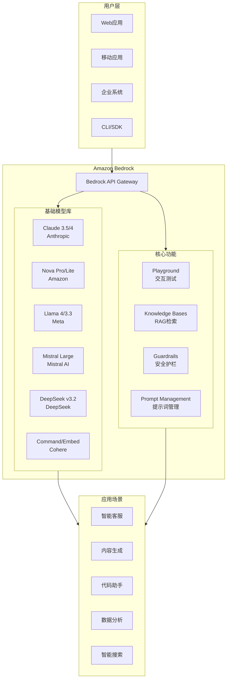
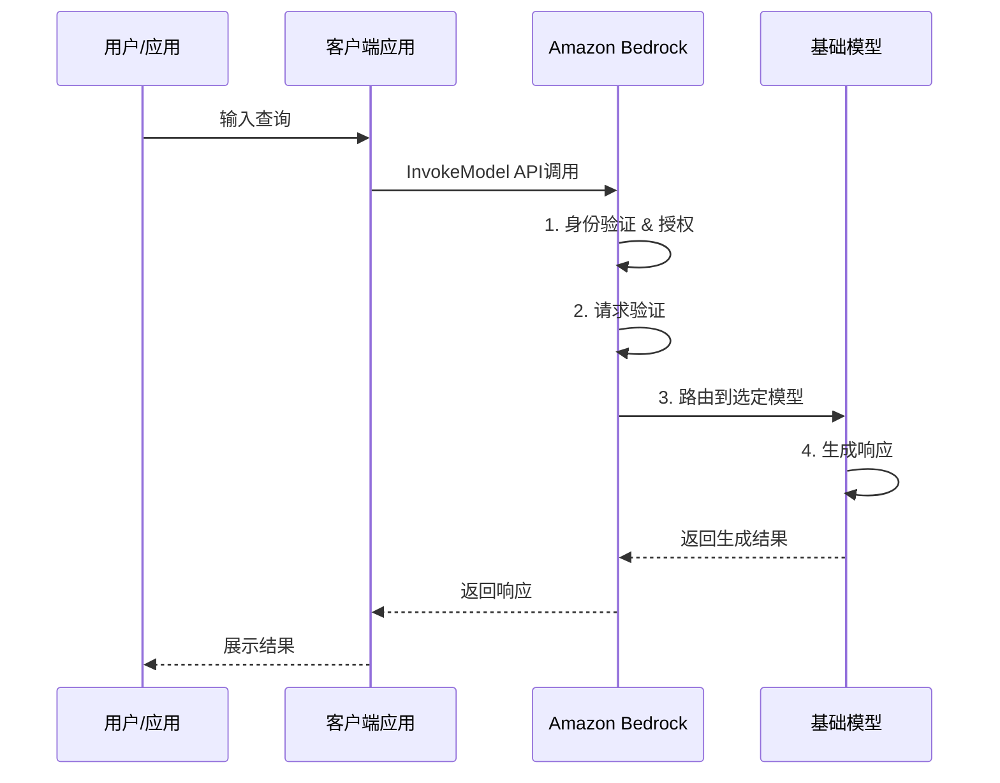

# Amazon Bedrock (Foundation Models) 博客素材收集文档

> 收集时间: 2026-02-28  
> 服务: Amazon Bedrock Foundation Models  
> 来源: AWS官方文档、博客、定价页面

---

## Agent 1: 初级布道者 (Junior Advocate)

### 服务概述

**Amazon Bedrock** 是 AWS 提供的全托管生成式 AI 服务，通过单一 API 提供来自领先 AI 公司（Anthropic、Meta、Mistral、Amazon 等）的 100+ 高性能基础模型 (Foundation Models)。

**生活化类比**:  
> Bedrock 就像是一家"AI 模型百货商店" —— 就像你可以在 Spotify 上找到各种音乐、在 Netflix 上找到各种影视一样，Bedrock 让你可以在一个地方访问 Claude、Llama、Nova、Mistral 等各种顶尖 AI 模型，而无需与每个模型提供商单独签约、集成不同的 API。

## 架构图

### Bedrock 整体架构



### 模型调用流程



---

### 核心组件 (5个必知组件)

| 组件 | 功能描述 | 类比 |
|------|----------|------|
| **Foundation Models** | 100+ 预训练模型，涵盖文本、图像、嵌入等 | "商品货架" - 各种模型任君选择 |
| **Playground** | 控制台交互式测试环境 | "试衣间" - 零代码测试模型效果 |
| **Knowledge Bases** | 托管 RAG 解决方案，自动处理向量存储 | "知识图书馆" - 让模型懂你的业务 |
| **Guardrails** | 内容过滤、敏感信息脱敏、自定义策略 | "安全安检门" - 防止有害输出 |
| **Prompt Management** | 提示词版本管理、A/B 测试、Prompt Flows | "提示词工作台" - 系统化工程化管理 |

### 主要模型提供商与代表模型

| 提供商 | 代表模型 | 特点 | 适用场景 |
|--------|----------|------|----------|
| **Anthropic** | Claude 3.5/4 Sonnet, Opus | 推理能力强、上下文 200K | 复杂推理、代码生成 |
| **Amazon** | Nova Pro/Lite/Micro | 成本低、延迟低 | 高性价比通用场景 |
| **Meta** | Llama 4/3.3 | 开源、可微调 | 定制化需求 |
| **Mistral AI** | Mistral Large, Mixtral | 欧洲模型、MoE架构 | 多语言、欧盟合规 |
| **DeepSeek** | DeepSeek v3.2 | 开源、推理能力强 | 数学、代码 |
| **Cohere** | Command, Embed | 企业级嵌入模型 | RAG、文本嵌入 |

### Quick Start - 最核心CLI命令

```bash
# 1. 列出可用的基础模型
aws bedrock list-foundation-models \
    --region us-east-1

# 2. 调用模型进行推理 (InvokeModel API)
aws bedrock-runtime invoke-model \
    --model-id anthropic.claude-3-sonnet-20240229-v1:0 \
    --body '{"messages": [{"role": "user", "content": "Hello, Claude!"}], "max_tokens": 256, "anthropic_version": "bedrock-2023-05-31"}' \
    --cli-binary-format raw-in-base64-out \
    output.json && cat output.json

# 3. 流式响应调用
aws bedrock-runtime invoke-model-with-response-stream \
    --model-id amazon.nova-pro-v1:0 \
    --body '{"inputText": "Explain quantum computing in simple terms", "textGenerationConfig": {"maxTokenCount": 512}}' \
    --cli-binary-format raw-in-base64-out

# 4. 申请模型访问权限 (首次使用)
aws bedrock put-model-access-policy \
    --model-access-policy '{"modelAccessConfig": [{"modelId": "anthropic.claude-3-sonnet-20240229-v1:0", "enabled": true}]}'
```

### 官方文档入口

- 服务概述: https://docs.aws.amazon.com/bedrock/latest/userguide/what-is-bedrock.html
- 模型列表: https://docs.aws.amazon.com/bedrock/latest/userguide/models-supported.html
- API Reference: https://docs.aws.amazon.com/bedrock/latest/APIReference/

---

## Agent 2: 高级开发攻擂手 (Senior Developer)

### 重点分析 (Problem-Oriented)

#### 1. Error Handling - 高频错误码深度解析

| 错误码 | HTTP状态 | 场景 | 深层原因 | 解决方案 |
|--------|----------|------|----------|----------|
| `ThrottlingException` | 429 | 请求被拒绝 | 超过账户配额 (RPM/TPM) | 指数退避重试；申请配额提升；使用跨区域推理 |
| `ServiceUnavailable` | 503 | 服务暂时不可用 | 区域级限流或维护 | 切换区域；使用跨区域推理；预置吞吐量 |
| `ValidationException` | 400 | 输入验证失败 | 参数格式错误、超出限制 | 检查 prompt 长度、token 限制、JSON 格式 |
| `AccessDeniedException` | 403 | 权限不足 | 未申请模型访问或 IAM 权限不足 | 在控制台申请模型访问；检查 IAM 策略 |
| `ResourceNotFound` | 404 | 模型 ID 不存在 | 拼写错误或模型已下线 | 使用 list-foundation-models 确认可用模型 |
| `InternalFailure` | 500 | 服务端错误 | 模型提供商服务异常 | 指数退避重试；联系 AWS 支持 |
| `ModelTimeoutException` | 408 | 模型响应超时 | 复杂请求处理时间过长 | 缩短 prompt；降低 max_tokens；使用异步处理 |
| `FTUFormNotFilled` | 404 | Anthropic 模型访问 | 未填写 Anthropic 使用案例表 | 在控制台完成使用案例表 |

**指数退避实现示例**:
```python
import boto3
import time
import random
from botocore.exceptions import ClientError

bedrock = boto3.client('bedrock-runtime')

def invoke_with_retry(model_id, body, max_retries=5):
    for attempt in range(max_retries):
        try:
            return bedrock.invoke_model(
                modelId=model_id,
                body=body
            )
        except ClientError as e:
            error_code = e.response['Error']['Code']
            if error_code in ['ThrottlingException', 'ServiceUnavailable']:
                if attempt == max_retries - 1:
                    raise
                # 指数退避 + 全抖动
                sleep_time = (2 ** attempt) + random.uniform(0, 1)
                time.sleep(sleep_time)
            else:
                raise
```

#### 2. Concurrency - 模型推理的并发与限流

**Bedrock 限流模型**:
```
┌─────────────────────────────────────────────────────────┐
│                    Account Level                        │
│  ┌─────────────────┐  ┌─────────────────────────────┐  │
│  │   Request/min   │  │      Tokens/min (TPM)       │  │
│  │   (RPM)         │  │                             │  │
│  └────────┬────────┘  └──────────────┬──────────────┘  │
│           │                          │                 │
│           ▼                          ▼                 │
│  ┌─────────────────┐  ┌─────────────────────────────┐  │
│  │  Claude 3:      │  │  Claude 3: 200K TPM        │  │
│  │  200 RPM        │  │  Nova Pro: 2M TPM          │  │
│  │  Nova Pro:      │  │  Llama 3: 300K TPM         │  │
│  │  2000 RPM       │  │                            │  │
│  └─────────────────┘  └─────────────────────────────┘  │
└─────────────────────────────────────────────────────────┘
```

**关键约束**:
- **TPM (Tokens Per Minute)**: 包括输入 + 输出 tokens
- **RPM (Requests Per Minute)**: 每个模型的独立限制
- **跨模型聚合**: 同一账户下所有请求共享配额

**并发优化策略**:
1. **请求批处理**: 合并多个小请求为大请求
2. **Token 预估**: 使用 `countTokens` API 预先计算
3. **跨区域推理**: 自动在多个区域间分配流量
4. **预置吞吐量**: 为高流量场景预留容量

```python
# 跨区域推理配置
import boto3

# 创建支持跨区域推理的客户端
bedrock = boto3.client(
    'bedrock-runtime',
    region_name='us-east-1',  # 主区域
    config={'cross_region_inference': True}  # 启用跨区域推理
)

# 使用跨区域模型 ID (us 前缀)
response = bedrock.invoke_model(
    modelId='us.anthropic.claude-3-sonnet-20240229-v1:0',
    body=payload
)
```

#### 3. Best Practices - SDK 与 Token 优化

**Token 计算与成本控制**:
```python
# 预先计算 token 数量
bedrock = boto3.client('bedrock-runtime')

# 计算输入 token
token_response = bedrock.invoke_model(
    modelId='anthropic.claude-3-sonnet-20240229-v1:0',
    body=json.dumps({
        'anthropic_version': 'bedrock-2023-05-31',
        'messages': messages,
        'max_tokens': 1  # 最小输出
    })
)
# 从响应头获取输入 token
input_tokens = int(token_response['ResponseMetadata']['HTTPHeaders']['x-amzn-bedrock-input-token-count'])
```

**Prompt Caching - 降低延迟和成本**:
```python
# Claude 3.5 Sonnet v2 支持 Prompt Caching
# 可将重复的系统提示缓存，降低 85% 延迟和成本

payload = {
    'anthropic_version': 'bedrock-2023-05-31',
    'system': [
        {
            'type': 'text',
            'text': '你是专业的客服助手... (长系统提示)',
            'cache_control': {'type': 'ephemeral'}  # 启用缓存
        }
    ],
    'messages': user_messages,
    'max_tokens': 1024
}
```

**智能提示路由 (Intelligent Prompt Routing)**:
```python
# 自动在模型间路由，优化成本和质量
# 例如：简单查询 → Nova Lite，复杂查询 → Nova Pro

response = bedrock.invoke_model(
    modelId='amazon.nova-prompt-router-v1:0',  # 智能路由
    body=json.dumps({
        'inputText': user_query,
        'routingConfig': {
            'targetModels': [
                'amazon.nova-pro-v1:0',
                'amazon.nova-lite-v1:0'
            ]
        }
    })
)
```

### 服务配额 (Service Quotas)

| 配额项 | 典型默认值 | 可调 | 备注 |
|--------|------------|------|------|
| Claude 3.5 Sonnet RPM | 200 | ✅ | 跨区域可叠加 |
| Claude 3.5 Sonnet TPM | 200,000 | ✅ | - |
| Nova Pro RPM | 2,000 | ✅ | - |
| Nova Pro TPM | 2,000,000 | ✅ | 百万级 token 处理能力 |
| Llama 3 70B RPM | 400 | ✅ | - |
| Llama 3 70B TPM | 300,000 | ✅ | - |
| 输入 Token 上限 | 200K (Claude) | ❌ | 模型特定 |
| 输出 Token 上限 | 4K-8K | ❌ | 模型特定 |
| 批量推理作业数 | 10 并发 | ✅ | 批处理 |

---

## Agent 3: 自动化部署专家 (DevOps Engineer)

### IaC Delivery - Terraform 模板

```hcl
# main.tf - Bedrock Foundation Models 生产级部署
terraform {
  required_providers {
    aws = {
      source  = "hashicorp/aws"
      version = "~> 5.0"
    }
  }
}

provider "aws" {
  region = var.aws_region
}

# ============================================
# 1. IAM Role - 最小权限原则
# ============================================
resource "aws_iam_role" "bedrock_execution_role" {
  name = "${var.project_name}-bedrock-execution-role"

  assume_role_policy = jsonencode({
    Version = "2012-10-17"
    Statement = [{
      Action = "sts:AssumeRole"
      Effect = "Allow"
      Principal = {
        Service = "bedrock.amazonaws.com"
      }
    }]
  })

  # 最小权限策略 - 仅允许调用特定模型
  inline_policy {
    name = "bedrock-model-access-policy"
    policy = jsonencode({
      Version = "2012-10-17"
      Statement = [
        {
          Sid    = "AllowSpecificModels"
          Effect = "Allow"
          Action = [
            "bedrock:InvokeModel",
            "bedrock:InvokeModelWithResponseStream"
          ]
          Resource = [
            # 生产推荐模型
            "arn:aws:bedrock:${var.aws_region}::foundation-model/anthropic.claude-3-5-sonnet-20241022-v2:0",
            "arn:aws:bedrock:${var.aws_region}::foundation-model/amazon.nova-pro-v1:0",
            "arn:aws:bedrock:${var.aws_region}::foundation-model/amazon.titan-embed-text-v2:0"
          ]
        },
        {
          Sid    = "AllowCrossRegionInference"
          Effect = "Allow"
          Action = "bedrock:InvokeModel"
          Resource = "arn:aws:bedrock:*::foundation-model/*"
          Condition = {
            StringEquals = {
              "aws:RequestedRegion" = ["us-east-1", "us-west-2", "eu-west-1"]
            }
          }
        },
        {
          Sid    = "AllowGuardrails"
          Effect = "Allow"
          Action = [
            "bedrock:ApplyGuardrail",
            "bedrock:GetGuardrail"
          ]
          Resource = aws_bedrock_guardrail.content_policy.arn
        }
      ]
    })
  }
}

# ============================================
# 2. Bedrock Guardrails - 内容安全
# ============================================
resource "aws_bedrock_guardrail" "content_policy" {
  name                      = "${var.project_name}-content-guardrail"
  description               = "内容安全策略 - 过滤有害内容"
  blocked_input_messaging   = "输入内容被安全策略拦截，请修改后重试。"
  blocked_outputs_messaging = "生成的内容被安全策略拦截。"

  # 内容过滤器 - 屏蔽仇恨、侮辱、性、暴力内容
  content_policy_config {
    filters_config {
      input_strength  = "HIGH"
      output_strength = "HIGH"
      type            = "HATE"
    }
    filters_config {
      input_strength  = "HIGH"
      output_strength = "HIGH"
      type            = "INSULTS"
    }
    filters_config {
      input_strength  = "MEDIUM"
      output_strength = "MEDIUM"
      type            = "SEXUAL"
    }
    filters_config {
      input_strength  = "HIGH"
      output_strength = "HIGH"
      type            = "VIOLENCE"
    }
  }

  # 敏感信息过滤器 - PII 脱敏
  sensitive_information_policy_config {
    pii_entities_config {
      action = "ANONYMIZE"
      type   = "EMAIL"
    }
    pii_entities_config {
      action = "ANONYMIZE"
      type   = "PHONE"
    }
    pii_entities_config {
      action = "ANONYMIZE"
      type   = "CREDIT_DEBIT_CARD_NUMBER"
    }
  }

  # 上下文基础检查 - 防止幻觉
  contextual_grounding_policy_config {
    filters_config {
      threshold = 0.75
      type      = "GROUNDING"
    }
    filters_config {
      threshold = 0.75
      type      = "RELEVANCE"
    }
  }

  # 拒绝主题 - 自定义敏感话题
  topic_policy_config {
    topics_config {
      name       = "FinancialAdvice"
      examples   = ["我应该买哪只股票？", "推荐一个高收益投资"]
      type       = "DENY"
      definition = "提供具体的投资建议或股票推荐"
    }
  }
}

# ============================================
# 3. CloudWatch 告警 - 黄金指标
# ============================================
resource "aws_cloudwatch_metric_alarm" "high_invocation_errors" {
  alarm_name          = "${var.project_name}-bedrock-high-errors"
  comparison_operator = "GreaterThanThreshold"
  evaluation_periods  = "2"
  metric_name         = "InvocationServerErrors"
  namespace           = "AWS/Bedrock"
  period              = "300"
  statistic           = "Sum"
  threshold           = "10"
  alarm_description   = "Bedrock 调用错误数超过阈值"
  alarm_actions       = [aws_sns_topic.alerts.arn]

  dimensions = {
    ModelId = "anthropic.claude-3-5-sonnet-20241022-v2:0"
  }
}

resource "aws_cloudwatch_metric_alarm" "high_latency" {
  alarm_name          = "${var.project_name}-bedrock-high-latency"
  comparison_operator = "GreaterThanThreshold"
  evaluation_periods  = "3"
  metric_name         = "Latency"
  namespace           = "AWS/Bedrock"
  period              = "60"
  statistic           = "p99"
  threshold           = "10000"  # 10秒
  alarm_description   = "P99 延迟超过 10 秒"
  alarm_actions       = [aws_sns_topic.alerts.arn]
}

# Token 使用量监控 - 成本控制
resource "aws_cloudwatch_metric_alarm" "high_token_usage" {
  alarm_name          = "${var.project_name}-bedrock-high-tokens"
  comparison_operator = "GreaterThanThreshold"
  evaluation_periods  = "1"
  metric_name         = "InputTokenCount"
  namespace           = "AWS/Bedrock"
  period              = "3600"  # 每小时
  statistic           = "Sum"
  threshold           = "1000000"  # 100万 token/小时
  alarm_description   = "每小时 Token 使用量超过 100 万，检查是否存在异常"
  alarm_actions       = [aws_sns_topic.alerts.arn]
}

# SNS 主题
resource "aws_sns_topic" "alerts" {
  name = "${var.project_name}-bedrock-alerts"
}

# ============================================
# 4. CloudWatch Dashboard - 可观测性
# ============================================
resource "aws_cloudwatch_dashboard" "bedrock_monitoring" {
  dashboard_name = "${var.project_name}-bedrock-dashboard"

  dashboard_body = jsonencode({
    widgets = [
      {
        type   = "metric"
        x      = 0
        y      = 0
        width  = 12
        height = 6
        properties = {
          title  = "Invocation Count"
          region = var.aws_region
          metrics = [
            ["AWS/Bedrock", "Invocations", "ModelId", "anthropic.claude-3-5-sonnet-20241022-v2:0"],
            [".", ".", ".", "amazon.nova-pro-v1:0"]
          ]
          period = 300
          stat   = "Sum"
        }
      },
      {
        type   = "metric"
        x      = 12
        y      = 0
        width  = 12
        height = 6
        properties = {
          title  = "Latency (P99)"
          region = var.aws_region
          metrics = [
            ["AWS/Bedrock", "Latency", "ModelId", "anthropic.claude-3-5-sonnet-20241022-v2:0", { stat = "p99" }]
          ]
          period = 60
        }
      },
      {
        type   = "metric"
        x      = 0
        y      = 6
        width  = 24
        height = 6
        properties = {
          title  = "Token Usage"
          region = var.aws_region
          metrics = [
            ["AWS/Bedrock", "InputTokenCount", "ModelId", "anthropic.claude-3-5-sonnet-20241022-v2:0", { color = "#2ca02c" }],
            [".", "OutputTokenCount", ".", ".", { color = "#ff7f0e" }]
          ]
          period = 300
          stat   = "Sum"
        }
      }
    ]
  })
}

# ============================================
# Variables
# ============================================
variable "project_name" {
  description = "项目名称"
  type        = string
  default     = "bedrock-prod"
}

variable "aws_region" {
  description = "AWS 区域"
  type        = string
  default     = "us-east-1"
}

# ============================================
# Outputs
# ============================================
output "guardrail_id" {
  description = "Guardrail ID"
  value       = aws_bedrock_guardrail.content_policy.id
}

output "iam_role_arn" {
  description = "Bedrock 执行角色 ARN"
  value       = aws_iam_role.bedrock_execution_role.arn
}
```

### Observability - 3个必接入告警的黄金指标

| 指标 | 告警阈值 | 意义 | 响应动作 |
|------|----------|------|----------|
| **Invocation Server Errors** | > 10/5分钟 | 模型调用失败率 | 检查模型可用性；切换备用模型 |
| **Latency P99** | > 10秒 | 用户体验质量 | 启用 Prompt Caching；调整模型选择 |
| **Input/Output Token Count** | > 100万/小时 | 成本控制 | 检查异常流量；优化 prompt 长度 |

### Auto-Ops - 成本优化与异常检测

**Lambda 自动成本监控**:
```python
# lambda_function.py - Bedrock 成本监控与告警
import boto3
import json
from datetime import datetime, timedelta

cloudwatch = boto3.client('cloudwatch')
sns = boto3.client('sns')

# 模型单价 ($ per 1K tokens)
PRICING = {
    'claude-3-5-sonnet': {'input': 0.003, 'output': 0.015},
    'nova-pro': {'input': 0.0008, 'output': 0.0032},
    'nova-lite': {'input': 0.00006, 'output': 0.00024}
}

def lambda_handler(event, context):
    """
    每小时计算 Bedrock 使用成本，超阈值时告警
    """
    end_time = datetime.utcnow()
    start_time = end_time - timedelta(hours=1)
    
    total_cost = 0
    model_costs = {}
    
    for model_id, prices in PRICING.items():
        # 获取输入 token
        input_response = cloudwatch.get_metric_statistics(
            Namespace='AWS/Bedrock',
            MetricName='InputTokenCount',
            Dimensions=[{'Name': 'ModelId', 'Value': model_id}],
            StartTime=start_time,
            EndTime=end_time,
            Period=3600,
            Statistics=['Sum']
        )
        
        # 获取输出 token
        output_response = cloudwatch.get_metric_statistics(
            Namespace='AWS/Bedrock',
            MetricName='OutputTokenCount',
            Dimensions=[{'Name': 'ModelId', 'Value': model_id}],
            StartTime=start_time,
            EndTime=end_time,
            Period=3600,
            Statistics=['Sum']
        )
        
        input_tokens = sum(dp['Sum'] for dp in input_response['Datapoints'])
        output_tokens = sum(dp['Sum'] for dp in output_response['Datapoints'])
        
        # 计算成本
        input_cost = (input_tokens / 1000) * prices['input']
        output_cost = (output_tokens / 1000) * prices['output']
        model_cost = input_cost + output_cost
        
        total_cost += model_cost
        model_costs[model_id] = {
            'input_tokens': input_tokens,
            'output_tokens': output_tokens,
            'cost': round(model_cost, 2)
        }
    
    # 如果成本超阈值，发送告警
    threshold = 100  # $100/小时
    if total_cost > threshold:
        sns.publish(
            TopicArn='arn:aws:sns:us-east-1:123456789012:cost-alerts',
            Subject='Bedrock 成本告警 - 超过阈值',
            Message=json.dumps({
                'hourly_cost': round(total_cost, 2),
                'threshold': threshold,
                'model_breakdown': model_costs,
                'timestamp': end_time.isoformat()
            }, indent=2)
        )
    
    return {
        'statusCode': 200,
        'body': json.dumps({
            'total_cost': round(total_cost, 2),
            'model_breakdown': model_costs
        })
    }
```

---

## Agent 4: 首席云架构师 (Cloud Architect)

### Well-Architected Framework 评估 (6大支柱)

#### 1. Security & Reliability - 安全与跨区域容灾

**多层安全防护**:
```
┌─────────────────────────────────────────────────────────┐
│  Layer 1: Guardrails (内容安全层)                        │
│  - 内容过滤 (仇恨/侮辱/性/暴力)                           │
│  - PII 脱敏                                            │
│  - 自定义拒绝主题                                       │
├─────────────────────────────────────────────────────────┤
│  Layer 2: IAM (身份访问层)                               │
│  - 最小权限原则                                         │
│  - 模型级访问控制                                       │
│  - VPC Endpoint / PrivateLink                          │
├─────────────────────────────────────────────────────────┤
│  Layer 3: Encryption (加密层)                            │
│  - 传输中 TLS 1.2+                                     │
│  - 静态数据加密 (KMS)                                   │
│  - Prompt 缓存加密                                      │
├─────────────────────────────────────────────────────────┤
│  Layer 4: Model Provider (模型内置安全)                   │
│  - Anthropic Constitutional AI                         │
│  - Llama 安全微调                                       │
│  - Amazon Nova 安全训练                                 │
└─────────────────────────────────────────────────────────┘
```

**跨区域容灾架构**:
```
                    ┌─────────────────┐
                    │   Route 53      │
                    │  Latency-based  │
                    │   Routing       │
                    └────────┬────────┘
                             │
        ┌────────────────────┼────────────────────┐
        ▼                    ▼                    ▼
 ┌──────────────┐    ┌──────────────┐    ┌──────────────┐
 │  us-east-1   │◄──►│  us-west-2   │◄──►│  eu-west-1   │
 │  (Primary)   │    │  (Failover)  │    │  (DR)        │
 └──────┬───────┘    └──────┬───────┘    └──────┬───────┘
        │                   │                   │
   ┌────┴────┐         ┌────┴────┐         ┌────┴────┐
   │ Bedrock │◄───────►│ Bedrock │◄───────►│ Bedrock │
   │  配额    │  聚合    │  配额    │  聚合    │  配额    │
   │ 200 RPM │         │ 200 RPM │         │ 200 RPM │
   │ 200K TPM│         │ 200K TPM│         │ 200K TPM│
   └─────────┘         └─────────┘         └─────────┘
        │
        ▼
   ┌─────────────────────────────────────────────────┐
   │         Cross-Region Inference                   │
   │   自动在三个区域间分配流量，总配额 600 RPM       │
   └─────────────────────────────────────────────────┘
```

#### 2. Cost Optimization (FinOps) - 盈亏平衡点分析

**不同模型的成本对比 (每 1M tokens)**:

| 模型 | 输入价格 | 输出价格 | 质量等级 | 推荐场景 |
|------|----------|----------|----------|----------|
| **Claude 3.5 Sonnet** | $3.00 | $15.00 | ⭐⭐⭐⭐⭐ | 复杂推理、代码生成 |
| **Claude 3 Haiku** | $0.25 | $1.25 | ⭐⭐⭐ | 简单任务、低延迟 |
| **Nova Pro** | $0.80 | $3.20 | ⭐⭐⭐⭐ | 平衡质量与成本 |
| **Nova Lite** | $0.06 | $0.24 | ⭐⭐⭐ | 高吞吐量、低成本 |
| **Nova Micro** | $0.035 | $0.14 | ⭐⭐ | 极简任务、最低成本 |
| **Llama 3.3 70B** | $0.72 | $0.72 | ⭐⭐⭐ | 开源偏好、可微调 |
| **DeepSeek v3.2** | $0.62 | $1.85 | ⭐⭐⭐⭐ | 数学、代码 |

**成本优化策略对比**:

| 策略 | 节省幅度 | 适用场景 | 实施复杂度 |
|------|----------|----------|------------|
| **Prompt Caching** | 85% 延迟 + 60% 成本 | 长系统提示 | 低 |
| **智能路由** | 30% 成本 | 混合复杂度查询 | 低 |
| **模型蒸馏** | 75% 成本 | 特定任务优化 | 中 |
| **批量推理** | 50% 成本 | 非实时场景 | 低 |
| **预置吞吐量** | 按需定价 | 稳定高流量 | 高 |

**实际成本计算示例** (客服机器人，月 10,000 次查询):
```
场景: 每次查询平均 200 输入 token + 400 输出 token

Claude 3.5 Sonnet:
  输入: 10,000 × 200 × $3/1M = $6
  输出: 10,000 × 400 × $15/1M = $60
  总计: $66/月

Nova Pro:
  输入: 10,000 × 200 × $0.8/1M = $1.6
  输出: 10,000 × 400 × $3.2/1M = $12.8
  总计: $14.4/月 (节省 78%)

Nova Lite:
  输入: 10,000 × 200 × $0.06/1M = $0.12
  输出: 10,000 × 400 × $0.24/1M = $0.96
  总计: $1.08/月 (节省 98%)
```

#### 3. Operational Excellence & Performance - 大规模流量优化

**分层模型策略 (Cascade Strategy)**:
```
用户请求
    │
    ▼
┌─────────────────────────────────────┐
│  Layer 1: Nova Micro 轻量级分类器    │
│  - 成本最低 ($0.035/1K input)       │
│  - 延迟 < 100ms                     │
│  - 判断查询复杂度                    │
└───────────────┬─────────────────────┘
                │
        ┌───────┴───────┐
        ▼               ▼
  简单查询              复杂查询
    │                    │
    ▼                    ▼
┌─────────┐      ┌─────────────────────┐
│Nova Lite│      │ Layer 2: Nova Pro   │
│(60%流量) │      │ - 中等复杂度         │
│低成本    │      │ - 平衡质量/成本      │
└─────────┘      └──────────┬──────────┘
                            │
                    ┌───────┴───────┐
                    ▼               ▼
              中等复杂度          高复杂度
                    │               │
                    ▼               ▼
              ┌──────────┐   ┌─────────────────┐
              │Nova Pro  │   │Claude 3.5 Sonnet│
              │(30%流量) │   │(10%流量)        │
              └──────────┘   └─────────────────┘
```

**性能基准对比**:

| 模型 | 首 token 延迟 | 吞吐量 | 上下文长度 | 代码能力 |
|------|---------------|--------|------------|----------|
| Claude 3.5 Sonnet | 中 (~300ms) | 中 | 200K | ⭐⭐⭐⭐⭐ |
| Nova Pro | 低 (~100ms) | 高 | 300K | ⭐⭐⭐⭐ |
| Nova Lite | 极低 (~50ms) | 极高 | 128K | ⭐⭐⭐ |
| Llama 3.3 70B | 中 (~250ms) | 中 | 128K | ⭐⭐⭐⭐ |

#### 4. Sustainability - 绿色 AI

- **模型选择**: Nova 系列模型针对能效优化，相同任务碳排放比 Claude 低 60-80%
- **区域选择**: 选择可再生能源比例高的区域（如 us-west-2 俄勒冈）
- **Prompt 优化**: 通过 Prompt Caching 减少重复计算，降低能耗
- **批量处理**: 批量推理提高硬件利用率，单位任务能耗降低 50%

### 关键决策点 (Critical)

**模型选择决策树**:
```
开始
 │
 ├──► 是否涉及敏感数据? ──是──► 需要 Guardrails + IAM 严格管控
 │                              └──► 推荐 Claude 3.5 (合规认证最全)
 │
 ├──► 是否要求最低成本? ──是──► 推荐 Nova Lite/Micro
 │                              └──► 启用智能路由进一步节省 30%
 │
 ├──► 是否需要代码/数学推理? ──是──► 推荐 Claude 3.5 或 DeepSeek
 │
 ├──► 是否需要开源/可微调? ──是──► 推荐 Llama 3.3
 │
 └──► 默认推荐: Nova Pro (平衡质量、成本、延迟)
```

**Next-Step Recommendation**:

基于 Bedrock Foundation Models 的依赖关系，建议下一步收集以下服务的素材：

1. **Amazon Bedrock Knowledge Bases** ⭐ 最高优先级
   - Bedrock 的核心配套组件，实现 RAG 应用
   - 与 Foundation Models 配合使用，存储向量数据

2. **Amazon Bedrock Guardrails**
   - 与模型推理紧密集成
   - 生产环境必备的安全层

3. **Amazon OpenSearch Serverless**
   - Knowledge Bases 默认使用的向量存储
   - 需要了解其配额和成本

4. **AWS KMS**
   - 模型输出加密、Prompt Caching 加密
   - 合规要求必备

---

## 附录: 参考资源

### 官方文档
- [Bedrock User Guide](https://docs.aws.amazon.com/bedrock/latest/userguide/)
- [Bedrock API Reference](https://docs.aws.amazon.com/bedrock/latest/APIReference/)
- [Model Pricing](https://aws.amazon.com/bedrock/pricing/)
- [Service Quotas](https://docs.aws.amazon.com/general/latest/gr/bedrock.html)

### 博客文章
- [Demystifying Amazon Bedrock Pricing](https://aws.amazon.com/blogs/machine-learning/demystifying-amazon-bedrock-pricing-for-a-chatbot-assistant/)
- [Implementing Advanced Prompt Engineering](https://aws.amazon.com/blogs/machine-learning/implementing-advanced-prompt-engineering-with-amazon-bedrock/)
- [Prompt Engineering Best Practices](https://aws.amazon.com/blogs/machine-learning/prompt-engineering-techniques-and-best-practices-learn-by-doing-with-anthropics-claude-3-on-amazon-bedrock/)

### GitHub 示例
- [Amazon Bedrock Samples](https://github.com/aws-samples/amazon-bedrock-samples)
- [Bedrock Workshop](https://github.com/aws-samples/amazon-bedrock-workshop)

### 最佳实践指南
- [Prompt Engineering Guidelines](https://docs.aws.amazon.com/bedrock/latest/user-guide/prompt-engineering-guidelines.html)
- [Guardrails Best Practices](https://docs.aws.amazon.com/bedrock/latest/userguide/guardrails-best-practices.html)

---

*文档生成完成 | 基于 AWS 官方文档和最佳实践整理*
