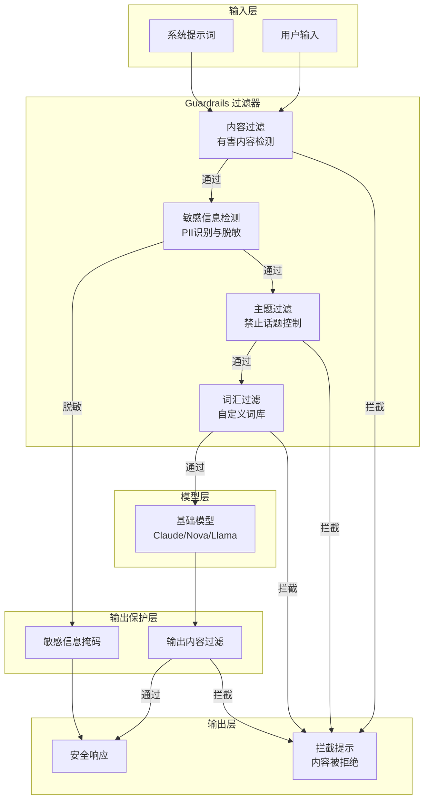
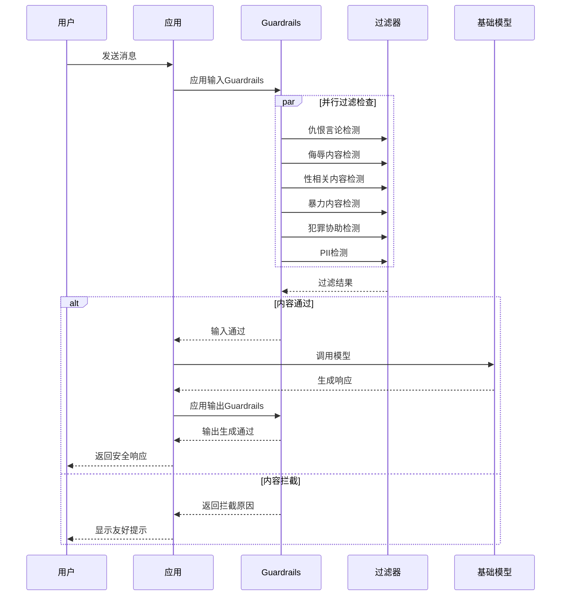

# Amazon Bedrock Guardrails (安全过滤) 博客素材收集文档

> 收集时间: 2026-02-28  
> 服务: Amazon Bedrock Guardrails  
> 来源: AWS官方文档、博客、定价页面

---

## Agent 1: 初级布道者 (Junior Advocate)

### 服务概述

**Amazon Bedrock Guardrails** 是 AWS 提供的可配置安全护栏服务，帮助构建安全的生成式 AI 应用。它提供跨基础模型的统一安全控制，可检测和过滤有害内容、保护敏感信息、防止幻觉，并与任何 FM（包括 Bedrock 托管模型和第三方模型）配合使用。

**生活化类比**:  
> Guardrails 就像是 AI 应用的"安检系统 + 内容审核员" —— 就像机场安检会检查行李中的违禁品、网络论坛会有审核员过滤不当内容一样，Guardrails 会自动检查用户输入和 AI 输出的每一句话，拦截有害内容、脱敏敏感信息、验证事实准确性，确保 AI 应用安全合规运行。

## 架构图

### Guardrails 安全架构



### 内容过滤流程



### PII 检测与脱敏

```mermaid
flowchart LR
    subgraph InputText["原始文本"]
        T1["我的邮箱是 user@example.com"]
        T2["电话 138-1234-5678"]
        T3["SSN: 123-45-6789"]
    end
    
    subgraph PIIEngine["PII检测引擎"]
        Regex[正则匹配]
        ML[ML模型识别]
        NER[命名实体识别]
    end
    
    subgraph Types["PII类型"]
        Email[邮箱地址]
        Phone[电话号码]
        SSN[社会安全号]
        Credit[信用卡号]
        Address[地址]
    end
    
    subgraph MaskingStrategies["脱敏策略"]
        Block[完全屏蔽\n***]
        Mask[部分掩码\n***@example.com]
        Generalize[泛化\n[EMAIL]]
    end
    
    subgraph OutputText["处理后文本"]
        O1["我的邮箱是 ***@example.com"]
        O2["电话 ***-****-5678"]
        O3["SSN: [SSN_NUMBER]"]
    end
    
    InputText --> PIIEngine
    PIIEngine --> Types
    Types --> MaskingStrategies
    MaskingStrategies --> OutputText
```

---

### 核心组件 (6大安全策略)

| 组件 | 功能描述 | 类比 |
|------|----------|------|
| **Content Filters** | 检测仇恨、侮辱、性、暴力、 misconduct、Prompt 攻击 | "违禁品扫描仪" - 拦截有害内容 |
| **Denied Topics** | 自定义拒绝主题（如医疗诊断、投资建议） | "话题禁区" - 禁止讨论特定话题 |
| **Word Filters** | 自定义敏感词过滤（竞争对手名、脏话） | "敏感词过滤器" - 精确匹配拦截 |
| **Sensitive Information** | PII 检测与脱敏（邮箱、电话、身份证号） | "隐私保护罩" - 自动打码敏感信息 |
| **Contextual Grounding** | 检测幻觉（基于源文档的事实准确性） | "事实核查员" - 验证答案是否 grounded |
| **Automated Reasoning** | 数学逻辑验证策略合规性 | "逻辑审计师" - 用数学证明答案正确性 |

### 支持的模型范围

| 类型 | 支持情况 | 说明 |
|------|----------|------|
| **Bedrock 托管模型** | ✅ 原生支持 | Claude、Nova、Llama 等 |
| **Bedrock 微调模型** | ✅ 支持 | 自定义模型 |
| **第三方模型** | ✅ ApplyGuardrail API | OpenAI、Google Gemini 等 |
| **自托管模型** | ✅ ApplyGuardrail API | SageMaker、EC2、本地部署 |

### Quick Start - 最核心CLI命令

```bash
# 1. 创建 Guardrail
aws bedrock create-guardrail \
    --name "healthcare-guardrail" \
    --description "Healthcare assistant safety guardrail" \
    --topic-policy-config '{
        "topicsConfig": [{
            "name": "Medical Diagnosis",
            "definition": "Providing specific disease diagnosis or medical advice",
            "examples": ["Do I have diabetes?", "What\'s causing my headache?"],
            "type": "DENY"
        }]
    }' \
    --content-policy-config '{
        "filtersConfig": [
            {"type": "HATE", "inputStrength": "HIGH", "outputStrength": "HIGH"},
            {"type": "INSULTS", "inputStrength": "HIGH", "outputStrength": "HIGH"},
            {"type": "SEXUAL", "inputStrength": "MEDIUM", "outputStrength": "MEDIUM"},
            {"type": "VIOLENCE", "inputStrength": "HIGH", "outputStrength": "HIGH"},
            {"type": "MISCONDUCT", "inputStrength": "HIGH", "outputStrength": "HIGH"},
            {"type": "PROMPT_ATTACK", "inputStrength": "HIGH", "outputStrength": "NONE"}
        ]
    }' \
    --sensitive-information-policy-config '{
        "piiEntitiesConfig": [
            {"type": "EMAIL", "action": "ANONYMIZE"},
            {"type": "PHONE", "action": "ANONYMIZE"},
            {"type": "CREDIT_DEBIT_CARD_NUMBER", "action": "BLOCK"}
        ]
    }' \
    --contextual-grounding-policy-config '{
        "filtersConfig": [
            {"type": "GROUNDING", "threshold": 0.7},
            {"type": "RELEVANCE", "threshold": 0.7}
        ]
    }' \
    --blocked-inputs-messaging "This request cannot be processed due to safety policies." \
    --blocked-outputs-messaging "This response was blocked due to safety policies."

# 2. 创建 Guardrail 版本
aws bedrock create-guardrail-version \
    --guardrail-identifier "<guardrail-id>" \
    --description "Production v1"

# 3. 在模型调用中使用 Guardrail
aws bedrock-runtime invoke-model \
    --model-id anthropic.claude-3-sonnet-20240229-v1:0 \
    --guardrail-identifier "<guardrail-id>" \
    --guardrail-version "1" \
    --body '{"messages": [{"role": "user", "content": "Hello!"}], "max_tokens": 256}'

# 4. 独立使用 ApplyGuardrail API（无需调用模型）
aws bedrock-runtime apply-guardrail \
    --guardrail-identifier "<guardrail-id>" \
    --guardrail-version "1" \
    --source "INPUT" \
    --content '[{"text": {"text": "User input to check"}}]'
```

### 官方文档入口

- 服务概述: https://docs.aws.amazon.com/bedrock/latest/userguide/guardrails.html
- 组件详解: https://docs.aws.amazon.com/bedrock/latest/userguide/guardrails-components.html
- ApplyGuardrail API: https://docs.aws.amazon.com/bedrock/latest/APIReference/API_runtime_ApplyGuardrail.html

---

## Agent 2: 高级开发攻擂手 (Senior Developer)

### 重点分析 (Problem-Oriented)

#### 1. Error Handling - 高频错误码深度解析

| 错误码 | 场景 | 深层原因 | 解决方案 |
|--------|------|----------|----------|
| `ValidationException` | 参数验证失败 | Guardrail 配置无效、阈值超出范围 | 检查 topic name 唯一性、threshold 在 0-0.99 之间 |
| `ResourceNotFoundException` | Guardrail 不存在 | ID 错误或版本未发布 | 使用 DRAFT 版本或确认版本号 |
| `AccessDeniedException` | 权限不足 | IAM 缺少 `bedrock:ApplyGuardrail` | 添加 IAM 权限 |
| `ThrottlingException` | 请求被限流 | 超过 50 TPS 默认配额 | 指数退避重试；申请配额提升 |
| `ServiceQuotaExceededException` | 超出配额 | 每账户 Guardrails 数量超限 | 默认 20 个/区域，可申请提升 |
| `ConflictException` | 资源冲突 | 同名 Guardrail 或并发修改 | 使用唯一名称或等待当前操作完成 |
| `AutomatedReasoningTooComplex` | 策略过于复杂 | AR 策略规则嵌套过深 | 简化逻辑规则，拆分多个策略 |
| `ContextualGroundingSourceTooLarge` | 源文档过大 | 超过 100,000 字符限制 | 截断或拆分源文档 |

**Python SDK 错误处理示例**:
```python
import boto3
from botocore.exceptions import ClientError

bedrock_runtime = boto3.client('bedrock-runtime')

def invoke_with_guardrail(model_id, prompt, guardrail_id, guardrail_version):
    try:
        response = bedrock_runtime.invoke_model(
            modelId=model_id,
            guardrailIdentifier=guardrail_id,
            guardrailVersion=guardrail_version,
            body=json.dumps({
                'messages': [{'role': 'user', 'content': prompt}],
                'max_tokens': 512
            })
        )
        return response
    except ClientError as e:
        error_code = e.response['Error']['Code']
        error_message = e.response['Error']['Message']
        
        if error_code == 'ThrottlingException':
            # 指数退避
            time.sleep(2)
            return invoke_with_guardrail(model_id, prompt, guardrail_id, guardrail_version)
        elif error_code == 'ValidationException':
            print(f"配置错误: {error_message}")
            # 检查 Guardrail 配置
            check_guardrail_config(guardrail_id)
        elif error_code == 'ResourceNotFoundException':
            print(f"Guardrail 不存在，使用默认版本")
            return invoke_with_guardrail(model_id, prompt, guardrail_id, 'DRAFT')
        else:
            raise
```

#### 2. Concurrency - Guardrails 限流与性能

**配额模型**:
```
┌─────────────────────────────────────────────────────────┐
│              Guardrails 运行时限制                       │
│  ┌─────────────────────────────────────────────────┐   │
│  │  ApplyGuardrail API TPS: 50/秒 (默认)          │   │
│  │  - 可提升至 200/秒                              │   │
│  └─────────────────────────────────────────────────┘   │
│                                                          │
│  ┌─────────────────────────────────────────────────┐   │
│  │  与 Bedrock Invoke API 共享配额                │   │
│  │  - 限流时同时影响模型调用                       │   │
│  └─────────────────────────────────────────────────┘   │
└─────────────────────────────────────────────────────────┘
```

**性能优化**:
```python
# 批量处理优化
from concurrent.futures import ThreadPoolExecutor
import functools

def apply_guardrail_batch(contents, guardrail_id, version, max_workers=10):
    """批量应用 Guardrail，提高吞吐量"""
    
    apply_fn = functools.partial(
        bedrock_runtime.apply_guardrail,
        guardrailIdentifier=guardrail_id,
        guardrailVersion=version,
        source='INPUT'
    )
    
    with ThreadPoolExecutor(max_workers=max_workers) as executor:
        futures = [
            executor.submit(apply_fn, content=[{'text': {'text': c}}])
            for c in contents
        ]
        results = [f.result() for f in futures]
    
    return results

# 缓存策略 - 避免重复检查相同内容
from functools import lru_cache

@lru_cache(maxsize=1000)
def cached_guardrail_check(content_hash, guardrail_id, version):
    """缓存 Guardrail 检查结果"""
    response = bedrock_runtime.apply_guardrail(
        guardrailIdentifier=guardrail_id,
        guardrailVersion=version,
        source='INPUT',
        content=[{'text': {'text': content_hash}}]
    )
    return response['action'] == 'NONE'
```

#### 3. Best Practices - 分层防御与输入标签

**分层防御架构**:
```
┌─────────────────────────────────────────────────────────┐
│  Layer 1: 输入层过滤 (ApplyGuardrail API)               │
│  - 在用户输入到达模型前拦截                            │
│  - 快速失败，节省模型调用成本                          │
├─────────────────────────────────────────────────────────┤
│  Layer 2: 模型层保护 (InvokeModel with Guardrail)       │
│  - 保护模型免受越狱攻击                                │
│  - 过滤模型有害输出                                    │
├─────────────────────────────────────────────────────────┤
│  Layer 3: 输出层验证 (ApplyGuardrail API Post-Call)     │
│  - 二次验证模型输出                                    │
│  - 特定场景下的额外安全检查                            │
├─────────────────────────────────────────────────────────┤
│  Layer 4: 应用层控制 (Business Logic)                   │
│  - 业务规则验证                                        │
│  - 人工审核触发                                        │
└─────────────────────────────────────────────────────────┘
```

**输入标签 - 选择性评估**:
```python
# 使用 XML 标签标记需要评估的部分
# 只评估用户输入，跳过系统提示和上下文

prompt = """
<system>
You are a helpful healthcare insurance assistant.
</system>

<context>
Previous conversation history...
</context>

<user_input>
{user_question}
</user_input>
"""

# 在 Guardrail 中配置只评估 user_input 部分
# 通过在控制台开启 "输入标签" 功能
```

### 服务配额 (Service Quotas)

| 配额项 | 默认值 | 可调 | 备注 |
|--------|--------|------|------|
| Guardrails/账户/区域 | 20 | ✅ | 生产环境可申请更多 |
| Guardrail 版本数 | 20/Guardrail | ✅ | - |
| Denied Topics/Guardrail | 30 | ❌ | - |
| 每 Topic Examples | 5 | ❌ | - |
| Custom Words/Guardrail | 10,000 | ❌ | - |
| Regex Patterns/Guardrail | 10 | ❌ | - |
| PII Entities/Guardrail | 所有类型 | ❌ | - |
| Automated Reasoning Policies/账户 | 100 | ❌ | - |
| AR Policy 版本数 | 1,000 | ❌ | - |
| ApplyGuardrail TPS | 50 | ✅ | 可提升至 200 |
| Contextual Grounding 源文档 | 100K 字符 | ❌ | - |

---

## Agent 3: 自动化部署专家 (DevOps Engineer)

### IaC Delivery - Terraform 模板

```hcl
# main.tf - Bedrock Guardrails 生产级部署
terraform {
  required_providers {
    aws = {
      source  = "hashicorp/aws"
      version = "~> 5.0"
    }
  }
}

provider "aws" {
  region = var.aws_region
}

# ============================================
# 1. IAM Role - Guardrails 执行角色
# ============================================
resource "aws_iam_role" "guardrail_execution" {
  name = "${var.project_name}-guardrail-execution-role"

  assume_role_policy = jsonencode({
    Version = "2012-10-17"
    Statement = [{
      Action = "sts:AssumeRole"
      Effect = "Allow"
      Principal = {
        Service = "bedrock.amazonaws.com"
      }
      Condition = {
        StringEquals = {
          "aws:SourceAccount" = data.aws_caller_identity.current.account_id
        }
      }
    }]
  })
}

# IAM Policy - Guardrails 权限
resource "aws_iam_role_policy" "guardrail_policy" {
  name = "guardrail-permissions"
  role = aws_iam_role.guardrail_execution.id

  policy = jsonencode({
    Version = "2012-10-17"
    Statement = [
      {
        Sid    = "GuardrailAccess"
        Effect = "Allow"
        Action = [
          "bedrock:ApplyGuardrail",
          "bedrock:GetGuardrail",
          "bedrock:ListGuardrails"
        ]
        Resource = "arn:aws:bedrock:${var.aws_region}:${data.aws_caller_identity.current.account_id}:guardrail/*"
      },
      {
        Sid    = "CloudWatchLogs"
        Effect = "Allow"
        Action = [
          "logs:CreateLogGroup",
          "logs:CreateLogStream",
          "logs:PutLogEvents"
        ]
        Resource = "arn:aws:logs:${var.aws_region}:${data.aws_caller_identity.current.account_id}:log-group:/aws/bedrock/guardrails/*"
      }
    ]
  })
}

# ============================================
# 2. KMS Key - Guardrails 加密
# ============================================
resource "aws_kms_key" "guardrail" {
  description             = "KMS key for Guardrails encryption"
  deletion_window_in_days = 7
  enable_key_rotation     = true

  policy = jsonencode({
    Version = "2012-10-17"
    Statement = [
      {
        Sid    = "Enable IAM User Permissions"
        Effect = "Allow"
        Principal = {
          AWS = "arn:aws:iam::${data.aws_caller_identity.current.account_id}:root"
        }
        Action   = "kms:*"
        Resource = "*"
      },
      {
        Sid    = "Allow Bedrock Service"
        Effect = "Allow"
        Principal = {
          Service = "bedrock.amazonaws.com"
        }
        Action = [
          "kms:Decrypt",
          "kms:GenerateDataKey"
        ]
        Resource = "*"
      }
    ]
  })
}

# ============================================
# 3. Guardrail - 综合安全策略
# ============================================
resource "aws_bedrock_guardrail" "main" {
  name                      = "${var.project_name}-guardrail"
  description               = "Comprehensive safety guardrail for ${var.project_name}"
  blocked_input_messaging   = var.blocked_input_message
  blocked_outputs_messaging = var.blocked_output_message
  kms_key_arn               = aws_kms_key.guardrail.arn

  # 内容过滤器 - 屏蔽有害内容
  content_policy_config {
    # 仇恨内容
    filters_config {
      input_strength  = "HIGH"
      output_strength = "HIGH"
      type            = "HATE"
    }
    # 侮辱性内容
    filters_config {
      input_strength  = "HIGH"
      output_strength = "HIGH"
      type            = "INSULTS"
    }
    # 性相关内容
    filters_config {
      input_strength  = "MEDIUM"
      output_strength = "MEDIUM"
      type            = "SEXUAL"
    }
    # 暴力内容
    filters_config {
      input_strength  = "HIGH"
      output_strength = "HIGH"
      type            = "VIOLENCE"
    }
    # 违法行为
    filters_config {
      input_strength  = "HIGH"
      output_strength = "HIGH"
      type            = "MISCONDUCT"
    }
    # Prompt 攻击检测
    filters_config {
      input_strength  = "HIGH"
      output_strength = "NONE"
      type            = "PROMPT_ATTACK"
    }
  }

  # 敏感信息过滤器 - PII 脱敏
  sensitive_information_policy_config {
    # PII 实体脱敏
    pii_entities_config {
      action = "ANONYMIZE"
      type   = "EMAIL"
    }
    pii_entities_config {
      action = "ANONYMIZE"
      type   = "PHONE"
    }
    pii_entities_config {
      action = "BLOCK"
      type   = "US_SOCIAL_SECURITY_NUMBER"
    }
    pii_entities_config {
      action = "ANONYMIZE"
      type   = "CREDIT_DEBIT_CARD_NUMBER"
    }
    pii_entities_config {
      action = "ANONYMIZE"
      type   = "ADDRESS"
    }
    
    # 自定义正则表达式 (免费)
    regexes_config {
      name   = "CustomAccountNumber"
      action = "ANONYMIZE"
      regex  = "ACCT-[0-9]{8}"
    }
  }

  # 上下文基础检查 - 防止幻觉
  contextual_grounding_policy_config {
    filters_config {
      threshold = var.grounding_threshold
      type      = "GROUNDING"
    }
    filters_config {
      threshold = var.relevance_threshold
      type      = "RELEVANCE"
    }
  }

  # 词过滤器 - 自定义敏感词
  word_policy_config {
    # 使用托管脏话列表
    managed_word_lists_config {
      type = "PROFANITY"
    }
  }

  depends_on = [aws_iam_role_policy.guardrail_policy]
}

# Denied Topics - 拒绝主题（动态创建）
resource "aws_bedrock_guardrail_version" "main" {
  guardrail_arn = aws_bedrock_guardrail.main.arn
  description   = "Production version ${timestamp()}"

  depends_on = [aws_bedrock_guardrail.main]
}

# ============================================
# 4. CloudWatch 告警 - 监控拦截事件
# ============================================
resource "aws_cloudwatch_log_group" "guardrail" {
  name              = "/aws/bedrock/guardrails/${var.project_name}"
  retention_in_days = 30
  kms_key_id        = aws_kms_key.guardrail.arn
}

# 拦截事件告警
resource "aws_cloudwatch_metric_alarm" "high_interventions" {
  alarm_name          = "${var.project_name}-guardrail-high-interventions"
  comparison_operator = "GreaterThanThreshold"
  evaluation_periods  = "1"
  metric_name         = "GuardrailInterventions"
  namespace           = "AWS/Bedrock/Guardrails"
  period              = "300"
  statistic           = "Sum"
  threshold           = "100"
  alarm_description   = "Guardrail 拦截事件超过阈值，可能存在攻击"
  alarm_actions       = [aws_sns_topic.alerts.arn]

  dimensions = {
    GuardrailId = aws_bedrock_guardrail.main.id
  }
}

# SNS 主题
resource "aws_sns_topic" "alerts" {
  name = "${var.project_name}-guardrail-alerts"
}

# ============================================
# Variables
# ============================================
variable "project_name" {
  description = "项目名称"
  type        = string
  default     = "bedrock-app"
}

variable "aws_region" {
  description = "AWS 区域"
  type        = string
  default     = "us-east-1"
}

variable "blocked_input_message" {
  description = "输入被拦截时的提示信息"
  type        = string
  default     = "您的请求违反了使用政策，无法处理。"
}

variable "blocked_output_message" {
  description = "输出被拦截时的提示信息"
  type        = string
  default     = "生成的内容违反了安全政策，已被拦截。"
}

variable "grounding_threshold" {
  description = "上下文基础阈值 (0-0.99)"
  type        = number
  default     = 0.7
  validation {
    condition     = var.grounding_threshold >= 0 && var.grounding_threshold <= 0.99
    error_message = "阈值必须在 0 到 0.99 之间"
  }
}

variable "relevance_threshold" {
  description = "相关性阈值 (0-0.99)"
  type        = number
  default     = 0.7
  validation {
    condition     = var.relevance_threshold >= 0 && var.relevance_threshold <= 0.99
    error_message = "阈值必须在 0 到 0.99 之间"
  }
}

# ============================================
# Data Sources
# ============================================
data "aws_caller_identity" "current" {}

# ============================================
# Outputs
# ============================================
output "guardrail_id" {
  description = "Guardrail ID"
  value       = aws_bedrock_guardrail.main.id
}

output "guardrail_arn" {
  description = "Guardrail ARN"
  value       = aws_bedrock_guardrail.main.arn
}

output "guardrail_version" {
  description = "Guardrail 版本"
  value       = aws_bedrock_guardrail_version.main.version
}
```

### Observability - 3个必接入告警的黄金指标

| 指标 | 告警阈值 | 意义 | 响应动作 |
|------|----------|------|----------|
| **GuardrailInterventions** | > 100/5分钟 | 拦截事件数 | 检查是否存在 Prompt 攻击或误配置 |
| **ApplyGuardrailLatency P99** | > 500ms | 处理延迟过高 | 检查网络；考虑就近部署 |
| **AutomatedReasoningFailures** | > 5% | AR 策略失败率 | 检查策略复杂度；简化逻辑 |

### Auto-Ops - 自动策略优化与监控

**Lambda 自动分析拦截日志**:
```python
# lambda_function.py - Guardrail 拦截日志分析
import boto3
import json
from datetime import datetime, timedelta

logs = boto3.client('logs')
sns = boto3.client('sns')

def lambda_handler(event, context):
    """
    分析 Guardrail 拦截日志，识别攻击模式
    触发器: EventBridge Schedule (每小时)
    """
    
    log_group = '/aws/bedrock/guardrails/my-app'
    
    # 查询过去 1 小时的拦截事件
    query = """
    fields @timestamp, @message
    | filter @message like /GUARDRAIL_INTERVENED/
    | parse @message "filterType: *" as filter_type
    | parse @message "userId: *" as user_id
    | stats count(*) as intervention_count by filter_type, user_id
    | sort intervention_count desc
    """
    
    start_query_response = logs.start_query(
        logGroupName=log_group,
        startTime=int((datetime.now() - timedelta(hours=1)).timestamp()),
        endTime=int(datetime.now().timestamp()),
        queryString=query
    )
    
    query_id = start_query_response['queryId']
    
    # 等待查询完成
    import time
    time.sleep(2)
    
    results = logs.get_query_results(queryId=query_id)
    
    # 分析结果
    high_risk_users = []
    filter_breakdown = {}
    
    for result in results.get('results', []):
        user_id = None
        filter_type = None
        count = 0
        
        for field in result:
            if field['field'] == 'user_id':
                user_id = field['value']
            elif field['field'] == 'filter_type':
                filter_type = field['value']
            elif field['field'] == 'intervention_count':
                count = int(field['value'])
        
        # 识别高频触发用户（潜在攻击者）
        if count > 20:
            high_risk_users.append({'user_id': user_id, 'count': count})
        
        # 统计拦截类型
        if filter_type:
            filter_breakdown[filter_type] = filter_breakdown.get(filter_type, 0) + count
    
    # 发送告警
    if high_risk_users:
        sns.publish(
            TopicArn='arn:aws:sns:us-east-1:123456789012:security-alerts',
            Subject='Guardrail 安全风险告警 - 检测到高频拦截用户',
            Message=json.dumps({
                'timestamp': datetime.utcnow().isoformat(),
                'high_risk_users': high_risk_users,
                'filter_breakdown': filter_breakdown,
                'recommendation': '建议对这些用户实施额外验证或临时限制'
            }, indent=2)
        )
    
    return {
        'statusCode': 200,
        'high_risk_users': len(high_risk_users),
        'filter_breakdown': filter_breakdown
    }
```

---

## Agent 4: 首席云架构师 (Cloud Architect)

### Well-Architected Framework 评估 (6大支柱)

#### 1. Security & Reliability - 多层安全架构

**纵深防御架构**:
```
用户请求
    │
    ▼
┌─────────────────────────────────────────────────────────┐
│  Layer 1: WAF / CloudFront                              │
│  - DDoS 防护                                            │
│  - IP 黑名单                                            │
├─────────────────────────────────────────────────────────┤
│  Layer 2: API Gateway                                   │
│  - 请求限流                                             │
│  - 认证授权                                             │
├─────────────────────────────────────────────────────────┤
│  Layer 3: Guardrails (Pre-Filter)                       │
│  - Prompt Attack 检测                                    │
│  - 输入内容过滤                                          │
├─────────────────────────────────────────────────────────┤
│  Layer 4: Foundation Model                              │
│  - 模型内置安全机制                                      │
├─────────────────────────────────────────────────────────┤
│  Layer 5: Guardrails (Post-Filter)                      │
│  - 输出内容过滤                                          │
│  - PII 脱敏                                             │
│  - 幻觉检测 (Grounding)                                  │
├─────────────────────────────────────────────────────────┤
│  Layer 6: Application Logic                             │
│  - 业务规则验证                                          │
│  - 审计日志                                              │
└─────────────────────────────────────────────────────────┘
```

**跨账户安全强制 (Guardrails Enforcements)**:
```hcl
# Organizations 级别的 Guardrail 强制
resource "aws_organizations_policy" "bedrock_guardrails" {
  name = "bedrock-guardrails-enforcement"
  type = "BEDROCK_GUARDRAILS"

  content = jsonencode({
    "bedrockGuardrailsConfiguration": {
      "enableEnforcedNativeBedrockModels": true,
      "enforcedNativeBedrockModelsArnList": [
        "arn:aws:bedrock:*::foundation-model/anthropic.claude-3-*",
        "arn:aws:bedrock:*::foundation-model/amazon.nova-*"
      ],
      "enforcedBedrockGuardrailArn": "arn:aws:bedrock:us-east-1:123456789012:guardrail/abcd1234"
    }
  })
}
```

#### 2. Cost Optimization (FinOps) - 定价与成本控制

**Guardrails 定价 (2024年12月降价后)**:

| 过滤器类型 | 价格 | 备注 |
|------------|------|------|
| **Content Filters** | $0.15/1,000 text units | 降价 80% |
| **Denied Topics** | $0.15/1,000 text units | 降价 85% |
| **Sensitive Information** | $0.10/1,000 text units | PII 检测 |
| **Contextual Grounding** | $0.10/1,000 text units | 幻觉检测 |
| **Automated Reasoning** | $0.17/1,000 text units | 逻辑验证 |
| **Word Filters** | 免费 | 精确匹配 |
| **Regex Patterns** | 免费 | 正则表达式 |
| **Image Content** | $0.00075/图片 | 多模态 |

> **Text Unit**: 1,000 字符为单位，不足按 1,000 计算

**成本计算示例** (客服机器人，月 10,000 次对话):
```
假设: 每次对话平均 500 字符输入 + 1,500 字符输出

月总字符数: 10,000 × (500 + 1,500) = 20,000,000 字符
月 Text Units: 20,000,000 / 1,000 = 20,000 units

配置: Content Filter + Denied Topics + Sensitive Info
月成本: 20,000 × ($0.15 + $0.15 + $0.10) / 1,000 = $8/月

对比: 使用 Claude 3.5 Sonnet 的模型调用成本约 $60/月
Guardrails 成本占比: ~12%
```

**成本优化策略**:
1. **分层检查**: 简单检查先用 Word Filters（免费），复杂场景再用 Content Filters
2. **输入标签**: 只检查用户输入，跳过系统提示和上下文
3. **缓存结果**: 对重复内容缓存 Guardrail 检查结果
4. **阈值调优**: 根据误报率调整阈值，避免不必要的重试

#### 3. Operational Excellence & Performance - 性能与可观测性

**Guardrail 延迟基准**:

| 过滤器组合 | 典型延迟 | 适用场景 |
|------------|----------|----------|
| Content Filters only | ~50-100ms | 通用场景 |
| + Sensitive Info | ~100-150ms | 隐私敏感 |
| + Contextual Grounding | ~200-300ms | RAG 应用 |
| + Automated Reasoning | ~500ms-2s | 高合规要求 |

**A/B 测试策略**:
```python
# 使用不同版本的 Guardrail 进行 A/B 测试
import random

def get_guardrail_for_request(user_id):
    """根据用户分组返回不同 Guardrail 版本"""
    # 将用户分为 3 组
    bucket = hash(user_id) % 3
    
    if bucket == 0:
        # 对照组 - 宽松策略
        return 'guardrail-lenient', '1'
    elif bucket == 1:
        # 实验组 A - 中等策略
        return 'guardrail-balanced', '1'
    else:
        # 实验组 B - 严格策略
        return 'guardrail-strict', '1'

# 收集指标
# - 拦截率
# - 用户满意度
# - 误报率
```

#### 4. Sustainability - 绿色 AI 安全

- **按需评估**: 只在必要时启用 Automated Reasoning（高能耗）
- **阈值优化**: 合理设置阈值减少不必要的重处理
- **就近部署**: 使用跨区域推理将请求路由到清洁能源区域
- **批处理**: 使用 ApplyGuardrail API 批量检查内容

### 关键决策点 (Critical)

**Guardrail 策略选择决策树**:
```
应用场景分析
    │
    ├──► 医疗/金融/法律合规要求? ──是──► 启用 Automated Reasoning
    │                                     └──► 配置严格 Content Filters
    │
    ├──► RAG / Knowledge Base 应用? ──是──► 启用 Contextual Grounding
    │                                      └──► 设置 Grounding 0.7+ 阈值
    │
    ├──► 处理用户 PII 数据? ──是──► 启用 Sensitive Information Filter
    │                                └──► 配置 ANONYMIZE 而非 BLOCK
    │
    ├──► 开放式聊天/客服? ──是──► 启用 Denied Topics
    │                            └──► 配置业务相关禁忌话题
    │
    └──► 默认推荐: Content Filters (HIGH) + Word Filters (免费)
```

**过滤器强度建议**:

| 场景 | Hate/Insults/Violence | Sexual | Misconduct | Prompt Attack |
|------|----------------------|--------|------------|---------------|
| **通用企业应用** | HIGH | MEDIUM | HIGH | HIGH |
| **儿童/教育应用** | HIGH | HIGH | HIGH | HIGH |
| **内部员工工具** | MEDIUM | LOW | MEDIUM | MEDIUM |
| **创意写作助手** | MEDIUM | MEDIUM | LOW | HIGH |

**Next-Step Recommendation**:

基于 Guardrails 的依赖关系，建议下一步收集以下服务的素材：

1. **Amazon CloudWatch / CloudWatch Logs** ⭐ 最高优先级
   - Guardrails 日志分析和监控
   - 拦截事件的可观测性

2. **Amazon S3 + Data Firehose**
   - Guardrails 日志归档
   - 长期审计和合规需求

3. **AWS Organizations + SCP**
   - 跨账户 Guardrails 强制
   - 企业级安全策略

4. **Amazon OpenSearch / Athena**
   - Guardrails 日志分析
   - 攻击模式识别

---

## 附录: 参考资源

### 官方文档
- [Guardrails User Guide](https://docs.aws.amazon.com/bedrock/latest/userguide/guardrails.html)
- [Guardrails Components](https://docs.aws.amazon.com/bedrock/latest/userguide/guardrails-components.html)
- [ApplyGuardrail API](https://docs.aws.amazon.com/bedrock/latest/APIReference/API_runtime_ApplyGuardrail.html)
- [Automated Reasoning Checks](https://docs.aws.amazon.com/bedrock/latest/userguide/guardrails-automated-reasoning-checks.html)
- [Contextual Grounding](https://docs.aws.amazon.com/bedrock/latest/userguide/guardrails-contextual-grounding-check.html)

### 博客文章
- [Build Responsible AI Applications with Guardrails](https://aws.amazon.com/blogs/machine-learning/build-responsible-ai-applications-with-amazon-bedrock-guardrails/)
- [Guardrails Reduces Pricing by 85%](https://aws.amazon.com/about-aws/whats-new/2024/12/amazon-bedrock-guardrails-reduces-pricing-85-percent/)
- [Guardrails Increases Service Quota Limits](https://aws.amazon.com/about-aws/whats-new/2025/02/amazon-bedrock-guardrails-increase-service-quota-limits/)

### 定价参考
- [Bedrock Guardrails Pricing](https://aws.amazon.com/bedrock/pricing/)
- [Pricing Examples](https://aws.amazon.com/bedrock/pricing/#Amazon_Bedrock_Guardrails)

### 最佳实践
- [Guardrails Best Practices](https://docs.aws.amazon.com/bedrock/latest/userguide/guardrails-best-practices.html)
- [Cross-Account Enforcements](https://docs.aws.amazon.com/bedrock/latest/userguide/guardrails-enforcements.html)

---

*文档生成完成 | 基于 AWS 官方文档和最佳实践整理*
