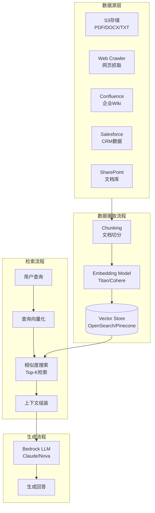
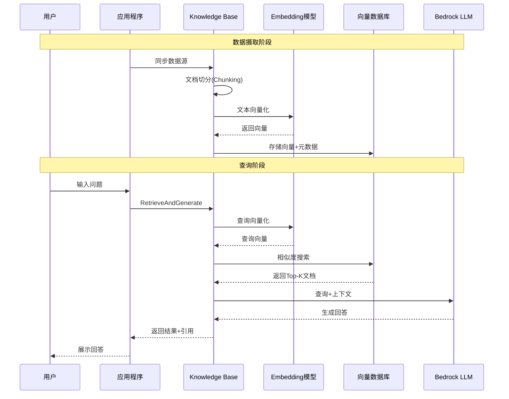
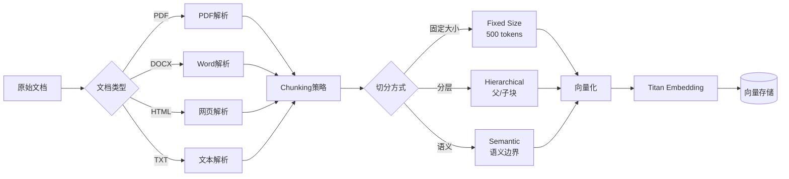

# Amazon Bedrock Knowledge Bases (RAG核心) 博客素材收集文档

> 收集时间: 2026-02-28  
> 服务: Amazon Bedrock Knowledge Bases  
> 来源: AWS官方文档、博客、GitHub示例

---

## Agent 1: 初级布道者 (Junior Advocate)

### 服务概述

**Amazon Bedrock Knowledge Bases** 是 AWS 提供的全托管 RAG (Retrieval Augmented Generation) 解决方案，让基础模型能够安全地访问企业私有数据源，提供更相关、准确和定制化的响应。

**生活化类比**:  
> Knowledge Bases 就像是给 AI 模型配备了一位"私人图书管理员" —— 就像大学图书馆员能够快速从海量藏书中找到你需要的参考资料一样，Knowledge Bases 能够自动从你的企业文档、数据库中检索最相关的信息，并将其组织成 AI 模型容易理解的格式，让 AI 的回答更加准确、有据可查。

## 架构图

### RAG 系统整体架构



### RAG 数据流



### 文档处理流程



---

### 核心组件 (5个必知组件)

| 组件 | 功能描述 | 类比 |
|------|----------|------|
| **Data Source** | 支持 S3、Confluence、Salesforce、SharePoint、Web Crawler | "图书来源" - 存放原始文档的地方 |
| **Vector Store** | OpenSearch Serverless、Aurora PostgreSQL、Pinecone、Neptune Analytics | "索引卡片系统" - 存储向量化后的文档 |
| **Embedding Model** | Titan Embeddings、Cohere Embed 等 | "翻译官" - 将文本转换为向量表示 |
| **Chunking Strategy** | 固定大小、分层、语义、自定义 Lambda | "拆书工匠" - 将长文档切分为合适块 |
| **Retrieval API** | Retrieve API、RetrieveAndGenerate API | "检索服务台" - 查询并返回相关内容 |

### 支持的数据源

| 数据源类型 | 支持格式 | 特点 |
|------------|----------|------|
| **Amazon S3** | PDF、DOCX、TXT、MD、HTML、CSV、JSON | 最常用，支持批量同步 |
| **Web Crawler** | 网页内容 | 自动抓取网站，最大 25,000 页 |
| **Confluence** | 页面、博客 | 企业知识库集成 |
| **Salesforce** | 对象记录 | CRM 数据接入 |
| **SharePoint** | 文档库 | Microsoft 365 集成 |
| **结构化数据源** | Amazon RDS、Redshift、Athena | SQL 生成查询 |

### Quick Start - 最核心CLI命令

```bash
# 1. 创建 Knowledge Base (使用 OpenSearch Serverless)
aws bedrock-agent create-knowledge-base \
    --name "my-first-kb" \
    --description "Customer support knowledge base" \
    --role-arn "arn:aws:iam::123456789012:role/BedrockKnowledgeBaseRole" \
    --knowledge-base-configuration '{
        "type": "VECTOR",
        "vectorKnowledgeBaseConfiguration": {
            "embeddingModelArn": "arn:aws:bedrock:us-east-1::foundation-model/amazon.titan-embed-text-v2:0"
        }
    }' \
    --storage-configuration '{
        "type": "OPENSEARCH_SERVERLESS",
        "opensearchServerlessConfiguration": {
            "collectionArn": "arn:aws:aoss:us-east-1:123456789012:collection/my-collection",
            "vectorIndexName": "bedrock-kb-index",
            "fieldMapping": {
                "vectorField": "embedding",
                "textField": "text",
                "metadataField": "metadata"
            }
        }
    }'

# 2. 创建数据源 (S3)
aws bedrock-agent create-data-source \
    --knowledge-base-id "<kb-id-from-step-1>" \
    --name "s3-documents" \
    --data-source-configuration '{
        "type": "S3",
        "s3Configuration": {
            "bucketArn": "arn:aws:s3:::my-knowledge-base-docs",
            "inclusionPrefixes": ["documents/"]
        }
    }' \
    --vector-ingestion-configuration '{
        "chunkingConfiguration": {
            "chunkingStrategy": "FIXED_SIZE",
            "fixedSizeChunkingConfiguration": {
                "maxTokens": 512,
                "overlapPercentage": 20
            }
        }
    }'

# 3. 启动数据同步
aws bedrock-agent start-ingestion-job \
    --knowledge-base-id "<kb-id>" \
    --data-source-id "<ds-id>"

# 4. 查询 Knowledge Base (Retrieve)
aws bedrock-agent-runtime retrieve \
    --knowledge-base-id "<kb-id>" \
    --retrieval-query '{"text": "What is the refund policy?"}' \
    --retrieval-configuration '{
        "vectorSearchConfiguration": {
            "numberOfResults": 5
        }
    }'

# 5. 查询并生成回答 (RetrieveAndGenerate)
aws bedrock-agent-runtime retrieve-and-generate \
    --input '{"text": "How do I reset my password?"}' \
    --retrieve-and-generate-configuration '{
        "type": "KNOWLEDGE_BASE",
        "knowledgeBaseConfiguration": {
            "knowledgeBaseId": "<kb-id>",
            "modelArn": "arn:aws:bedrock:us-east-1::foundation-model/anthropic.claude-3-sonnet-20240229-v1:0"
        }
    }'
```

### 官方文档入口

- 服务概述: https://docs.aws.amazon.com/bedrock/latest/userguide/knowledge-base.html
- 开发者指南: https://docs.aws.amazon.com/bedrock/latest/userguide/knowledge-base-how-it-works.html
- API Reference: https://docs.aws.amazon.com/bedrock/latest/APIReference/API_Operations_Agents_for_Amazon_Bedrock.html

---

## Agent 2: 高级开发攻擂手 (Senior Developer)

### 重点分析 (Problem-Oriented)

#### 1. Error Handling - 高频错误码深度解析

| 错误码 | 场景 | 深层原因 | 解决方案 |
|--------|------|----------|----------|
| `IngestionJobFailed` | 数据同步失败 | 文件格式损坏、超大文件 (>50MB)、权限不足 | 检查 S3 权限；拆分大文件；验证文件格式 |
| `ThrottlingException` | 请求被限流 | 超过并发同步作业限制 (1个/数据源) | 等待当前作业完成；使用指数退避 |
| `ResourceLimitExceeded` | 资源限制超出 | 超过每数据源 1000 文件限制 (GraphRAG) | 分批处理；申请配额提升至 10,000 |
| `ValidationException` | 参数验证失败 | 向量维度不匹配、索引不存在 | 检查 embedding 模型与向量存储兼容性 |
| `AccessDeniedException` | 访问被拒绝 | IAM 角色缺少 S3/OpenSearch 权限 | 添加 `s3:GetObject`、`aoss:APIAccessAll` 权限 |
| `ServiceQuotaExceededException` | 服务配额超限 | 并发 ingestion jobs 超过限制 | 默认 1 个并发，联系 AWS 支持提升 |
| `ConflictException` | 资源冲突 | 同名 Knowledge Base 已存在 | 使用唯一命名或先删除再创建 |

**数据同步失败排查清单**:
```python
import boto3

def diagnose_sync_failure(kb_id, data_source_id):
    bedrock_agent = boto3.client('bedrock-agent')
    
    # 获取最近的 ingestion job
    jobs = bedrock_agent.list_ingestion_jobs(
        knowledgeBaseId=kb_id,
        dataSourceId=data_source_id,
        maxResults=1
    )
    
    if jobs['ingestionJobSummaries']:
        job = jobs['ingestionJobSummaries'][0]
        if job['status'] == 'FAILED':
            # 获取详细失败信息
            job_details = bedrock_agent.get_ingestion_job(
                knowledgeBaseId=kb_id,
                dataSourceId=data_source_id,
                ingestionJobId=job['ingestionJobId']
            )
            
            # 常见失败原因
            failure_reasons = job_details.get('failureReasons', [])
            for reason in failure_reasons:
                if 'InvalidParameter' in reason:
                    print("建议: 检查文件格式和大小")
                elif 'Throttling' in reason:
                    print("建议: 降低同步频率，使用退避策略")
                elif 'AccessDenied' in reason:
                    print("建议: 检查 IAM 权限")
```

#### 2. Concurrency - RAG 并发与限流模型

**同步作业限制**:
```
┌─────────────────────────────────────────────────────────┐
│              Knowledge Base 级别限制                     │
│  ┌─────────────────────────────────────────────────┐   │
│  │  并发 Ingestion Jobs: 1 个/数据源               │   │
│  │  - 同一数据源不能并行同步                        │   │
│  │  - 需要等待当前作业完成                          │   │
│  └─────────────────────────────────────────────────┘   │
│                                                          │
│  文档直接摄取 API:                                       │
│  ┌─────────────────────────────────────────────────┐   │
│  │  IngestKnowledgeBaseDocuments: 25 文档/请求     │   │
│  └─────────────────────────────────────────────────┘   │
└─────────────────────────────────────────────────────────┘
```

**查询限流**:
| 操作 | 默认配额 | 可调 |
|------|----------|------|
| Retrieve API | 与 Bedrock 模型配额共享 | ✅ |
| RetrieveAndGenerate API | 与 Bedrock 模型配额共享 | ✅ |
| Ingestion Jobs 并发 | 1/数据源 | ✅ |
| 直接文档摄取 | 25 文档/请求 | ❌ |

**最佳实践 - 批量处理**:
```python
import boto3
import time
from concurrent.futures import ThreadPoolExecutor

bedrock_runtime = boto3.client('bedrock-agent-runtime')

def retrieve_with_retry(kb_id, query, max_retries=3):
    """带重试的检索函数"""
    for attempt in range(max_retries):
        try:
            response = bedrock_runtime.retrieve(
                knowledgeBaseId=kb_id,
                retrievalQuery={'text': query},
                retrievalConfiguration={
                    'vectorSearchConfiguration': {
                        'numberOfResults': 10,
                        'overrideSearchType': 'HYBRID'  # 混合搜索
                    }
                }
            )
            return response['retrievalResults']
        except bedrock_runtime.exceptions.ThrottlingException:
            if attempt == max_retries - 1:
                raise
            time.sleep(2 ** attempt)  # 指数退避
        except Exception as e:
            raise

# 并发查询处理
def batch_retrieve(kb_id, queries, max_workers=5):
    with ThreadPoolExecutor(max_workers=max_workers) as executor:
        futures = [executor.submit(retrieve_with_retry, kb_id, q) for q in queries]
        results = [f.result() for f in futures]
    return results
```

#### 3. Best Practices - Chunking 策略与嵌入优化

**Chunking 策略对比**:

| 策略 | 适用场景 | 优点 | 缺点 |
|------|----------|------|------|
| **DEFAULT** | 通用场景 | 无需配置，自动处理 | 不可控 |
| **FIXED_SIZE** | 结构化文档 | 可预测、均匀块大小 | 可能切断语义 |
| **HIERARCHICAL** | 长文档、层级结构 | 保留父子关系 | 存储开销大 |
| **SEMANTIC** | 语义边界重要 | 按意义边界切分 | 处理时间较长 |
| **CUSTOM (Lambda)** | 特殊格式 | 完全自定义 | 需要开发 |

**推荐配置 - 分层 Chunking**:
```python
# 适用于技术文档、论文等长文档
chunking_config = {
    "chunkingStrategy": "HIERARCHICAL",
    "hierarchicalChunkingConfiguration": {
        "overlapTokens": 70,
        "levelConfigurations": [
            {"maxTokens": 1500},  # 父级 - 段落/章节
            {"maxTokens": 300}    # 子级 - 句子组
        ]
    }
}
```

**Embedding 模型选择**:

| 模型 | 维度 | 多语言 | 价格 (per 1K tokens) | 适用场景 |
|------|------|--------|----------------------|----------|
| **Titan Embeddings V2** | 1024 | ✅ | $0.00002 | 通用，成本最低 |
| **Cohere Embed English** | 1024 | ❌ | $0.0001 | 英文专属，高质量 |
| **Cohere Embed Multilingual** | 768 | ✅ | $0.0001 | 多语言场景 |

**元数据过滤优化**:
```python
# 使用元数据过滤提高检索精度
response = bedrock_runtime.retrieve(
    knowledgeBaseId=kb_id,
    retrievalQuery={'text': 'refund policy'},
    retrievalConfiguration={
        'vectorSearchConfiguration': {
            'numberOfResults': 10,
            'filter': {
                'andAll': [
                    {
                        'equals': {
                            'key': 'document_type',
                            'value': 'policy'
                        }
                    },
                    {
                        'greaterThan': {
                            'key': 'version',
                            'value': 2.0
                        }
                    }
                ]
            }
        }
    }
)
```

### 服务配额 (Service Quotas)

| 配额项 | 默认值 | 可调 | 备注 |
|--------|--------|------|------|
| 每账户 Knowledge Bases | 10 | ✅ | 生产环境可能需要更多 |
| 每 KB 数据源 | 10 | ✅ | - |
| 并发 Ingestion Jobs | 1/数据源 | ✅ | - |
| 直接摄取文档数 | 25/请求 | ❌ | - |
| 单文件最大大小 | 50 MB | ❌ | 超大文件需拆分 |
| GraphRAG 每数据源文件数 | 1,000 | ✅ | 最大可提升至 10,000 |
| Web Crawler 最大页面数 | 25,000 | ✅ | - |

---

## Agent 3: 自动化部署专家 (DevOps Engineer)

### IaC Delivery - Terraform 模板

```hcl
# main.tf - Bedrock Knowledge Base 生产级部署
terraform {
  required_providers {
    aws = {
      source  = "hashicorp/aws"
      version = "~> 5.0"
    }
  }
}

provider "aws" {
  region = var.aws_region
}

# ============================================
# 1. S3 Bucket - 知识库存储
# ============================================
resource "aws_s3_bucket" "knowledge_base" {
  bucket = "${var.project_name}-kb-docs-${data.aws_caller_identity.current.account_id}"
}

resource "aws_s3_bucket_versioning" "knowledge_base" {
  bucket = aws_s3_bucket.knowledge_base.id
  versioning_configuration {
    status = "Enabled"
  }
}

resource "aws_s3_bucket_server_side_encryption_configuration" "knowledge_base" {
  bucket = aws_s3_bucket.knowledge_base.id

  rule {
    apply_server_side_encryption_by_default {
      sse_algorithm     = "aws:kms"
      kms_master_key_id = aws_kms_key.kb.arn
    }
    bucket_key_enabled = true
  }
}

# ============================================
# 2. KMS Key - 加密
# ============================================
resource "aws_kms_key" "kb" {
  description             = "KMS key for Knowledge Base encryption"
  deletion_window_in_days = 7
  enable_key_rotation     = true

  policy = jsonencode({
    Version = "2012-10-17"
    Statement = [
      {
        Sid    = "Enable IAM User Permissions"
        Effect = "Allow"
        Principal = {
          AWS = "arn:aws:iam::${data.aws_caller_identity.current.account_id}:root"
        }
        Action   = "kms:*"
        Resource = "*"
      },
      {
        Sid    = "Allow Bedrock Service"
        Effect = "Allow"
        Principal = {
          Service = "bedrock.amazonaws.com"
        }
        Action = [
          "kms:Decrypt",
          "kms:GenerateDataKey"
        ]
        Resource = "*"
      }
    ]
  })
}

# ============================================
# 3. IAM Role - Knowledge Base 执行角色
# ============================================
resource "aws_iam_role" "knowledge_base" {
  name = "${var.project_name}-kb-execution-role"

  assume_role_policy = jsonencode({
    Version = "2012-10-17"
    Statement = [{
      Action = "sts:AssumeRole"
      Effect = "Allow"
      Principal = {
        Service = "bedrock.amazonaws.com"
      }
      Condition = {
        StringEquals = {
          "aws:SourceAccount" = data.aws_caller_identity.current.account_id
        }
        ArnLike = {
          "aws:SourceArn" = "arn:aws:bedrock:${var.aws_region}:${data.aws_caller_identity.current.account_id}:knowledge-base/*"
        }
      }
    }]
  })
}

# S3 访问权限
resource "aws_iam_role_policy" "s3_access" {
  name = "s3-access"
  role = aws_iam_role.knowledge_base.id

  policy = jsonencode({
    Version = "2012-10-17"
    Statement = [
      {
        Sid    = "S3Access"
        Effect = "Allow"
        Action = [
          "s3:GetObject",
          "s3:ListBucket"
        ]
        Resource = [
          aws_s3_bucket.knowledge_base.arn,
          "${aws_s3_bucket.knowledge_base.arn}/*"
        ]
      }
    ]
  })
}

# Bedrock 模型调用权限
resource "aws_iam_role_policy" "bedrock_invoke" {
  name = "bedrock-invoke"
  role = aws_iam_role.knowledge_base.id

  policy = jsonencode({
    Version = "2012-10-17"
    Statement = [
      {
        Sid    = "BedrockInvoke"
        Effect = "Allow"
        Action = [
          "bedrock:InvokeModel"
        ]
        Resource = [
          "arn:aws:bedrock:${var.aws_region}::foundation-model/amazon.titan-embed-text-v2:0"
        ]
      }
    ]
  })
}

# ============================================
# 4. OpenSearch Serverless Collection
# ============================================
resource "aws_opensearchserverless_security_policy" "encryption" {
  name = "${var.project_name}-encryption-policy"
  type = "encryption"

  policy = jsonencode({
    Rules = [
      {
        ResourceType = "collection"
        Resource = ["collection/${var.project_name}-kb-collection"]
      }
    ]
    AWSOwnedKey = false
    KmsARN      = aws_kms_key.kb.arn
  })
}

resource "aws_opensearchserverless_security_policy" "network" {
  name = "${var.project_name}-network-policy"
  type = "network"

  policy = jsonencode([
    {
      Rules = [
        {
          ResourceType = "collection"
          Resource = ["collection/${var.project_name}-kb-collection"]
        },
        {
          ResourceType = "dashboard"
          Resource = ["collection/${var.project_name}-kb-collection"]
        }
      ]
      AllowFromPublic = true
    }
  ])
}

resource "aws_opensearchserverless_access_policy" "kb_access" {
  name = "${var.project_name}-access-policy"
  type = "data"

  policy = jsonencode([
    {
      Rules = [
        {
          ResourceType = "index"
          Resource = ["index/${var.project_name}-kb-collection/*"]
          Permission = ["aoss:CreateIndex", "aoss:DeleteIndex", "aoss:UpdateIndex", "aoss:DescribeIndex", "aoss:ReadDocument", "aoss:WriteDocument"]
        },
        {
          ResourceType = "collection"
          Resource = ["collection/${var.project_name}-kb-collection"]
          Permission = ["aoss:CreateCollectionItems", "aoss:DeleteCollectionItems", "aoss:UpdateCollectionItems", "aoss:DescribeCollectionItems"]
        }
      ]
      Principal = [
        aws_iam_role.knowledge_base.arn,
        "arn:aws:iam::${data.aws_caller_identity.current.account_id}:role/Admin"
      ]
    }
  ])
}

resource "aws_opensearchserverless_collection" "kb" {
  name = "${var.project_name}-kb-collection"

  depends_on = [
    aws_opensearchserverless_security_policy.encryption,
    aws_opensearchserverless_security_policy.network
  ]
}

# ============================================
# 5. Knowledge Base
# ============================================
resource "aws_bedrockagent_knowledge_base" "main" {
  name        = "${var.project_name}-knowledge-base"
  description = "Knowledge Base for ${var.project_name}"
  role_arn    = aws_iam_role.knowledge_base.arn

  knowledge_base_configuration {
    type = "VECTOR"
    vector_knowledge_base_configuration {
      embedding_model_arn = "arn:aws:bedrock:${var.aws_region}::foundation-model/amazon.titan-embed-text-v2:0"
    }
  }

  storage_configuration {
    type = "OPENSEARCH_SERVERLESS"
    opensearch_serverless_configuration {
      collection_arn    = aws_opensearchserverless_collection.kb.arn
      vector_index_name = "bedrock-knowledge-base-index"
      field_mapping {
        vector_field   = "bedrock-knowledge-base-default-vector"
        text_field     = "AMAZON_BEDROCK_TEXT_CHUNK"
        metadata_field = "AMAZON_BEDROCK_METADATA"
      }
    }
  }

  depends_on = [
    aws_iam_role_policy.s3_access,
    aws_iam_role_policy.bedrock_invoke,
    aws_opensearchserverless_access_policy.kb_access
  ]
}

# ============================================
# 6. Data Source
# ============================================
resource "aws_bedrockagent_data_source" "main" {
  knowledge_base_id = aws_bedrockagent_knowledge_base.main.id
  name              = "${var.project_name}-s3-source"

  data_source_configuration {
    type = "S3"
    s3_configuration {
      bucket_arn = aws_s3_bucket.knowledge_base.arn
    }
  }

  vector_ingestion_configuration {
    chunking_configuration {
      chunking_strategy = var.chunking_strategy

      dynamic "fixed_size_chunking_configuration" {
        for_each = var.chunking_strategy == "FIXED_SIZE" ? [1] : []
        content {
          max_tokens         = var.fixed_size_max_tokens
          overlap_percentage = var.fixed_size_overlap_percentage
        }
      }

      dynamic "hierarchical_chunking_configuration" {
        for_each = var.chunking_strategy == "HIERARCHICAL" ? [1] : []
        content {
          overlap_tokens = var.hierarchical_overlap_tokens
          level_configuration {
            max_tokens = var.hierarchical_parent_max_tokens
          }
          level_configuration {
            max_tokens = var.hierarchical_child_max_tokens
          }
        }
      }
    }
  }
}

# ============================================
# 7. CloudWatch 告警
# ============================================
resource "aws_cloudwatch_metric_alarm" "ingestion_failures" {
  alarm_name          = "${var.project_name}-kb-ingestion-failures"
  comparison_operator = "GreaterThanThreshold"
  evaluation_periods  = "1"
  metric_name         = "IngestionJobFailed"
  namespace           = "AWS/Bedrock/KnowledgeBase"
  period              = "300"
  statistic           = "Sum"
  threshold           = "0"
  alarm_description   = "Knowledge Base ingestion job failed"
  alarm_actions       = [aws_sns_topic.alerts.arn]
}

resource "aws_sns_topic" "alerts" {
  name = "${var.project_name}-kb-alerts"
}

# ============================================
# Variables
# ============================================
variable "project_name" {
  description = "项目名称"
  type        = string
  default     = "bedrock-kb"
}

variable "aws_region" {
  description = "AWS 区域"
  type        = string
  default     = "us-east-1"
}

variable "chunking_strategy" {
  description = "Chunking 策略"
  type        = string
  default     = "FIXED_SIZE"
  validation {
    condition     = contains(["DEFAULT", "FIXED_SIZE", "HIERARCHICAL", "SEMANTIC"], var.chunking_strategy)
    error_message = "必须是 DEFAULT、FIXED_SIZE、HIERARCHICAL 或 SEMANTIC"
  }
}

variable "fixed_size_max_tokens" {
  description = "固定大小 chunking 的最大 token 数"
  type        = number
  default     = 512
}

variable "fixed_size_overlap_percentage" {
  description = "固定大小 chunking 的重叠百分比"
  type        = number
  default     = 20
}

variable "hierarchical_parent_max_tokens" {
  description = "分层 chunking 父级最大 token 数"
  type        = number
  default     = 1500
}

variable "hierarchical_child_max_tokens" {
  description = "分层 chunking 子级最大 token 数"
  type        = number
  default     = 300
}

variable "hierarchical_overlap_tokens" {
  description = "分层 chunking 重叠 token 数"
  type        = number
  default     = 70
}

# ============================================
# Data Sources
# ============================================
data "aws_caller_identity" "current" {}

# ============================================
# Outputs
# ============================================
output "knowledge_base_id" {
  description = "Knowledge Base ID"
  value       = aws_bedrockagent_knowledge_base.main.id
}

output "s3_bucket_name" {
  description = "S3 Bucket 名称"
  value       = aws_s3_bucket.knowledge_base.bucket
}

output "opensearch_collection_endpoint" {
  description = "OpenSearch Collection Endpoint"
  value       = aws_opensearchserverless_collection.kb.collection_endpoint
}
```

### Observability - 3个必接入告警的黄金指标

| 指标 | 告警阈值 | 意义 | 响应动作 |
|------|----------|------|----------|
| **IngestionJobFailed** | > 0 | 数据同步失败 | 检查 S3 权限、文件格式；重试同步 |
| **RetrievalLatency P99** | > 2秒 | 检索延迟过高 | 检查 OpenSearch 容量；优化向量索引 |
| **IndexingLatency** | > 10秒/文档 | 索引延迟过高 | 检查 embedding 模型限流；调整 chunk 大小 |

### Auto-Ops - 自动同步与监控

**Lambda 自动同步监控**:
```python
# lambda_function.py - Knowledge Base 自动同步监控
import boto3
import json
from datetime import datetime, timedelta

bedrock_agent = boto3.client('bedrock-agent')
sns = boto3.client('sns')

def lambda_handler(event, context):
    """
    监控 Knowledge Base 同步状态，失败时通知
    触发器: EventBridge Schedule (每30分钟)
    """
    
    # 获取所有 Knowledge Bases
    kbs = bedrock_agent.list_knowledge_bases()
    
    failed_jobs = []
    
    for kb in kbs['knowledgeBaseSummaries']:
        kb_id = kb['knowledgeBaseId']
        
        # 获取数据源
        data_sources = bedrock_agent.list_data_sources(
            knowledgeBaseId=kb_id
        )
        
        for ds in data_sources['dataSourceSummaries']:
            ds_id = ds['dataSourceId']
            
            # 获取最近的 ingestion jobs
            jobs = bedrock_agent.list_ingestion_jobs(
                knowledgeBaseId=kb_id,
                dataSourceId=ds_id,
                maxResults=5
            )
            
            for job in jobs['ingestionJobSummaries']:
                # 检查最近 1 小时内的失败作业
                job_time = job['updatedAt']
                if datetime.now(job_time.tzinfo) - job_time < timedelta(hours=1):
                    if job['status'] == 'FAILED':
                        failed_jobs.append({
                            'kb_name': kb['name'],
                            'kb_id': kb_id,
                            'ds_name': ds['name'],
                            'job_id': job['ingestionJobId'],
                            'failure_reason': job.get('failureReasons', ['Unknown'])
                        })
    
    # 如果有失败作业，发送告警
    if failed_jobs:
        message = {
            'alarm_type': 'Knowledge Base Sync Failure',
            'timestamp': datetime.utcnow().isoformat(),
            'failed_jobs': failed_jobs,
            'action_required': '请检查 S3 权限、文件格式，并手动重试同步'
        }
        
        sns.publish(
            TopicArn='arn:aws:sns:us-east-1:123456789012:kb-alerts',
            Subject='Knowledge Base 同步失败告警',
            Message=json.dumps(message, indent=2, default=str)
        )
    
    return {
        'statusCode': 200,
        'failed_count': len(failed_jobs)
    }
```

---

## Agent 4: 首席云架构师 (Cloud Architect)

### Well-Architected Framework 评估 (6大支柱)

#### 1. Security & Reliability - 安全与向量存储选择

**向量存储安全对比**:

| 向量存储 | 加密 | VPC 支持 | 细粒度访问控制 | 适用场景 |
|----------|------|----------|----------------|----------|
| **OpenSearch Serverless** | KMS | ✅ | IAM + Data Access Policy | 全托管、快速启动 |
| **Aurora PostgreSQL** | KMS | ✅ | 数据库级权限 | 已有 Aurora 生态 |
| **Pinecone** | 传输加密 | ❌ | API Key | 多云需求 |
| **Neptune Analytics** | KMS | ✅ | IAM + Graph 权限 | GraphRAG 场景 |

**安全最佳实践**:
```
┌─────────────────────────────────────────────────────────┐
│  Layer 1: 数据源安全                                     │
│  - S3  bucket 加密 (SSE-KMS)                            │
│  - 版本控制防止数据丢失                                  │
│  - VPC Endpoint 限制访问                                 │
├─────────────────────────────────────────────────────────┤
│  Layer 2: 向量存储安全                                   │
│  - OpenSearch 加密策略                                   │
│  - 网络策略限制公网访问                                  │
│  - 数据访问策略最小权限                                  │
├─────────────────────────────────────────────────────────┤
│  Layer 3: 模型访问安全                                   │
│  - IAM 角色条件限制 (SourceAccount, SourceArn)          │
│  - Embedding 模型调用审计                                │
├─────────────────────────────────────────────────────────┤
│  Layer 4: 应用层安全                                     │
│  - RetrieveAndGenerate 配合 Guardrails                 │
│  - 查询输入过滤                                          │
│  - 响应引用验证                                          │
└─────────────────────────────────────────────────────────┘
```

#### 2. Cost Optimization (FinOps) - 向量存储成本对比

**向量存储成本模型**:

| 存储类型 | 定价模式 | 预估月成本 (100万文档) | 扩展性 |
|----------|----------|------------------------|--------|
| **OpenSearch Serverless** | OCU 小时 + 存储 | ~$300-500 | 自动扩展 |
| **Aurora PostgreSQL** | 实例 + 存储 | ~$200-400 | 手动扩展 |
| **Pinecone** | 索引单元 | ~$70-200 | 手动扩展 |
| **Neptune Analytics** | 图单元 + 存储 | ~$350-600 | 手动扩展 |

**成本优化策略**:

1. **Embedding 模型选择**:
   - Titan Embeddings V2: $0.00002/1K tokens (最便宜)
   - 100万文档 (平均500 token/文档) = $10 一次性成本

2. **Chunking 优化**:
   - 合理的 chunk 大小减少冗余存储
   - 使用分层 chunking 减少检索时的重复内容

3. **生命周期管理**:
   ```python
   # 自动清理旧版本文档
   def cleanup_old_versions(bucket, days_old=90):
       s3 = boto3.client('s3')
       cutoff = datetime.now() - timedelta(days=days_old)
       
       # 列出旧版本对象
       response = s3.list_object_versions(
           Bucket=bucket,
           Prefix='documents/'
       )
       
       for version in response.get('Versions', []):
           if version['LastModified'] < cutoff:
               s3.delete_object(
                   Bucket=bucket,
                   Key=version['Key'],
                   VersionId=version['VersionId']
               )
   ```

4. **混合搜索降本**:
   - 结合关键词搜索 + 向量搜索
   - 对简单查询使用关键词搜索，跳过 embedding 调用

#### 3. Operational Excellence & Performance - RAG 优化

**检索质量优化矩阵**:

| 技术 | 准确率提升 | 延迟影响 | 成本影响 | 适用场景 |
|------|------------|----------|----------|----------|
| **Reranking** | +15-25% | +200ms | 中等 | 高精度需求 |
| **Hybrid Search** | +10-15% | +50ms | 低 | 通用场景 |
| **GraphRAG** | +20-30% | +500ms | 高 | 跨文档推理 |
| **Metadata Filtering** | +10-20% | -20ms | 无 | 分类明确的数据 |
| **Hierarchical Chunking** | +5-10% | +100ms | 中 | 长文档 |

**GraphRAG 架构** (Neptune Analytics):
```
文档摄入
    │
    ▼
┌─────────────────────────────────────┐
│  1. Chunking & Embedding            │
│     - 文档切分为 chunks             │
│     - 生成向量嵌入                  │
└───────────────┬─────────────────────┘
                │
                ▼
┌─────────────────────────────────────┐
│  2. Graph 构建 (Claude 3 Haiku)     │
│     - 提取实体                      │
│     - 识别关系                      │
│     - 连接 chunks 到文档            │
└───────────────┬─────────────────────┘
                │
                ▼
┌─────────────────────────────────────┐
│  3. Neptune Analytics 存储          │
│     - 向量索引                      │
│     - 图关系                        │
└───────────────┬─────────────────────┘
                │
                ▼
查询处理
    │
    ▼
┌─────────────────────────────────────┐
│  4. 向量检索 Top-K chunks           │
└───────────────┬─────────────────────┘
                │
                ▼
┌─────────────────────────────────────┐
│  5. Graph 遍历 (多跳推理)            │
│     - 检索相关实体                  │
│     - 获取邻居节点                  │
│     - 跨文档连接                    │
└───────────────┬─────────────────────┘
                │
                ▼
┌─────────────────────────────────────┐
│  6. 上下文增强 + LLM 生成           │
└─────────────────────────────────────┘
```

#### 4. Sustainability - 绿色 RAG

- **按需同步**: 仅在数据变更时触发同步，避免定时全量同步
- **合理的 chunk 大小**: 避免过度切分导致的存储浪费
- **缓存策略**: 对高频查询结果进行缓存，减少重复计算
- **模型选择**: 优先使用 Titan Embeddings V2 (能效优化)

### 关键决策点 (Critical)

**向量存储选择决策树**:
```
开始
 │
 ├──► 需要 GraphRAG 跨文档推理? ──是──► Amazon Neptune Analytics
 │
 ├──► 已有 Aurora PostgreSQL 生态? ──是──► Aurora pgvector
 │
 ├──► 需要多云/混合云部署? ──是──► Pinecone
 │
 ├──► 需要最小运维开销? ──是──► OpenSearch Serverless (推荐)
 │
 └──► 默认推荐: OpenSearch Serverless
```

**Chunking 策略决策树**:
```
文档类型分析
    │
    ├──► 结构化数据 (表格、列表为主)?
    │      └──► FIXED_SIZE + 20% 重叠
    │
    ├──► 长文档 (论文、技术文档)?
    │      └──► HIERARCHICAL (父1500/子300)
    │
    ├──► 语义边界重要 (法律、医学)?
    │      └──► SEMANTIC chunking
    │
    └──► 特殊格式 (代码、Markdown)?
           └──► CUSTOM Lambda chunking
```

**Next-Step Recommendation**:

基于 Knowledge Bases 的依赖关系，建议下一步收集以下服务的素材：

1. **Amazon OpenSearch Serverless** ⭐ 最高优先级
   - Knowledge Bases 最常用的向量存储
   - 需要了解 OCU、索引管理、成本优化

2. **Amazon Bedrock Guardrails**
   - 与 Knowledge Bases 检索结果配合使用
   - 过滤有害内容，确保输出安全

3. **Amazon S3 + DataSync**
   - Knowledge Bases 主要数据源
   - 需要了解生命周期管理、版本控制

4. **Amazon Aurora PostgreSQL (pgvector)**
   - 替代向量存储选项
   - 适合已有 Aurora 生态的用户

---

## 附录: 参考资源

### 官方文档
- [Knowledge Bases User Guide](https://docs.aws.amazon.com/bedrock/latest/userguide/knowledge-base.html)
- [Knowledge Bases API Reference](https://docs.aws.amazon.com/bedrock/latest/APIReference/API_Operations_Agents_for_Amazon_Bedrock.html)
- [GraphRAG Documentation](https://docs.aws.amazon.com/bedrock/latest/userguide/knowledge-base-build-graphs.html)

### 博客文章
- [Deploy Knowledge Bases using Terraform](https://aws.amazon.com/blogs/machine-learning/deploy-amazon-bedrock-knowledge-bases-using-terraform-for-rag-based-generative-ai-applications/)
- [GraphRAG with Neptune Analytics GA](https://aws.amazon.com/blogs/machine-learning/announcing-general-availability-of-amazon-bedrock-knowledge-bases-graphrag-with-amazon-neptune-analytics/)
- [Using Knowledge Graphs for GraphRAG](https://aws.amazon.com/blogs/database/using-knowledge-graphs-to-build-graphrag-applications-with-amazon-bedrock-and-amazon-neptune/)

### GitHub 示例
- [Knowledge Base Terraform Sample](https://github.com/aws-samples/sample-bedrock-knowledge-base-terraform)
- [GraphRAG Workshop](https://github.com/aws-samples/rag-workshop-amazon-bedrock-knowledge-bases)

### 最佳实践指南
- [Choosing Vector Database for RAG](https://docs.aws.amazon.com/prescriptive-guidance/latest/choosing-an-aws-vector-database-for-rag-use-cases/)
- [Knowledge Base Quotas](https://docs.aws.amazon.com/general/latest/gr/bedrock.html)

---

*文档生成完成 | 基于 AWS 官方文档和最佳实践整理*
