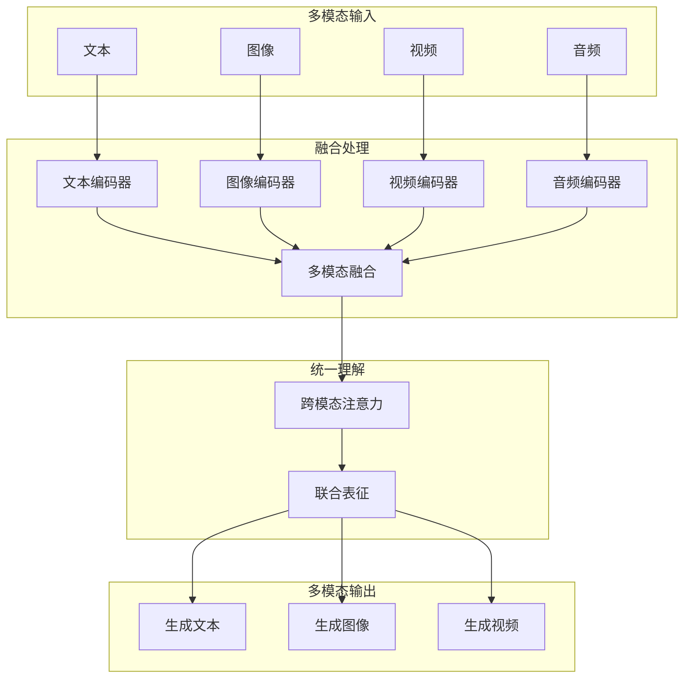
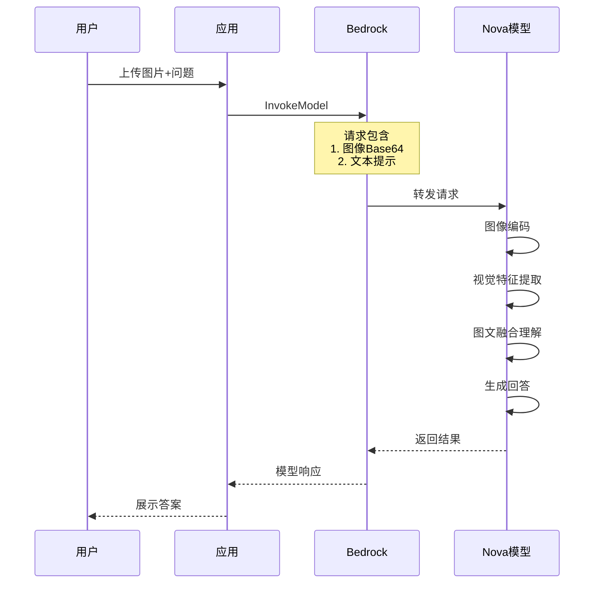
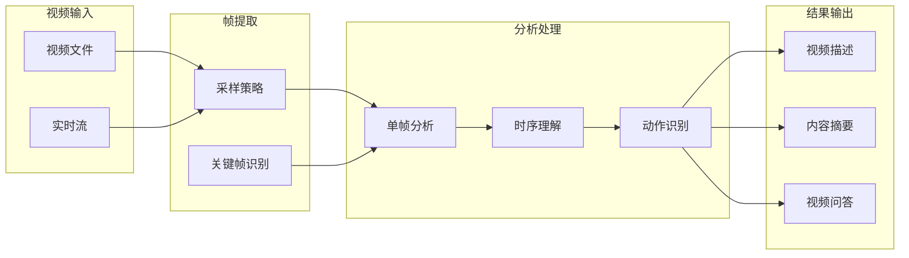

# Amazon Bedrock 多模态应用 (Nova Canvas/Reel) 博客素材收集文档

> 收集时间: 2026-03-01  
> 服务: Amazon Nova Canvas, Amazon Nova Reel, Amazon Bedrock Multimodal Models  
> 来源: AWS官方文档、博客、最佳实践

---

## Agent 1: 初级布道者 (Junior Advocate)

### 服务概述

**Amazon Nova Canvas** 是 AWS 提供的高质量图像生成服务，可根据文本提示生成逼真的图像，支持多种风格、图像编辑和条件生成。

**Amazon Nova Reel** 是 AWS 的视频生成服务，可根据文本或图像生成高质量短视频，适用于营销、培训、社交媒体等场景。

**生活化类比**:  
> Nova Canvas 就像是您的"AI 画师" —— 就像专业的插画师可以根据文字描述创作出精美的画作，Canvas 可以将"一只穿着宇航服的猫在月球上喝咖啡"这样的描述变成逼真的图像。
> 
> Nova Reel 则像是您的"AI 导演" —— 就像电影导演将剧本转化为影像，Reel 可以将静态图像或文字描述变成动态视频，让创意动起来。

## 架构图

### 多模态 AI 架构



### 图像理解流程



### 视频分析架构



---

### 多模态服务对比

| 服务 | 输出类型 | 适用场景 | 成本级别 |
|------|---------|----------|----------|
| **Nova Canvas** | 1K-2K 图像 | 产品图、营销素材、概念设计 | 低 |
| **Nova Reel** | 6秒 720p 视频 | 短视频、广告、培训材料 | 中 |
| **Titan Image Generator** | 1K 图像 | 基础图像生成、编辑 | 低 |
| **Claude 3 Vision** | 图像理解 | 图像分析、OCR、视觉问答 | 按 Token |
| **Llama 3.2 Vision** | 图像理解 | 边缘设备视觉应用 | 按 Token |

### Nova Canvas 核心能力

| 能力 | 说明 | 示例 |
|------|------|------|
| **Text-to-Image** | 文本生成图像 | "赛博朋克风格的城市夜景" |
| **Image-to-Image** | 图像风格迁移 | 将照片转换为油画风格 |
| **Inpainting** | 局部重绘 | 替换图像中的特定物体 |
| **Outpainting** | 图像扩展 | 将竖图扩展为横图 |
| **Background Removal** | 背景移除 | 自动抠图 |
| **Conditional Generation** | 条件生成 | 根据布局草图生成完整图 |

### Nova Reel 核心能力

| 能力 | 说明 | 参数 |
|------|------|------|
| **Text-to-Video** | 文本生成视频 | 最长 6 秒，720p |
| **Image-to-Video** | 图像生成视频 | 支持首帧/尾帧控制 |
| **Camera Control** | 镜头运动控制 | 平移、缩放、旋转 |
| **Aspect Ratio** | 多种比例 | 16:9, 9:16, 1:1 |

### Quick Start - 最核心CLI命令

```bash
# ==================== Nova Canvas ====================

# 1. 文本生成图像
aws bedrock-runtime invoke-model \
    --model-id "amazon.nova-canvas-v1:0" \
    --body '{
        "taskType": "TEXT_IMAGE",
        "textToImageParams": {
            "text": "A futuristic cityscape at night with neon lights and flying cars, cyberpunk style, highly detailed"
        },
        "imageGenerationConfig": {
            "width": 1280,
            "height": 720,
            "quality": "standard",
            "cfgScale": 8.0,
            "seed": 42,
            "numberOfImages": 1
        }
    }' \
    --cli-binary-format raw-in-base64-out \
    output.json

# 提取并保存图像
cat output.json | jq -r '.images[0]' | base64 -d > generated_image.png

# 2. 图像编辑 (Inpainting)
aws bedrock-runtime invoke-model \
    --model-id "amazon.nova-canvas-v1:0" \
    --body '{
        "taskType": "INPAINTING",
        "inPaintingParams": {
            "text": "A red sports car",
            "negativeText": "damaged, broken",
            "image": "'$(base64 -w 0 input_image.png)'",
            "maskImage": "'$(base64 -w 0 mask.png)'"
        },
        "imageGenerationConfig": {
            "numberOfImages": 1
        }
    }'

# 3. 图像风格迁移
aws bedrock-runtime invoke-model \
    --model-id "amazon.nova-canvas-v1:0" \
    --body '{
        "taskType": "IMAGE_VARIATION",
        "imageVariationParams": {
            "text": "Convert to watercolor painting style",
            "images": ["'$(base64 -w 0 source_image.png)'"],
            "similarityStrength": 0.7
        }
    }'

# ==================== Nova Reel ====================

# 4. 文本生成视频 (异步任务)
aws bedrock-runtime start-async-invoke \
    --model-identifier "amazon.nova-reel-v1:0" \
    --model-input '{
        "taskType": "TEXT_VIDEO",
        "textToVideoParams": {
            "text": "A serene mountain landscape at sunrise, with clouds moving across the peaks"
        },
        "videoGenerationConfig": {
            "durationSeconds": 6,
            "fps": 24,
            "dimension": "1280x720",
            "seed": 42
        }
    }' \
    --output-data-config '{
        "s3OutputDataConfig": {
            "s3Uri": "s3://my-bucket/video-output/",
            "s3EncryptionKeyId": "arn:aws:kms:us-east-1:123456789012:key/12345"
        }
    }'

# 5. 图像生成视频
aws bedrock-runtime start-async-invoke \
    --model-identifier "amazon.nova-reel-v1:0" \
    --model-input '{
        "taskType": "IMAGE_VIDEO",
        "imageToVideoParams": {
            "text": "Camera slowly zooms out",
            "images": [{
                "format": "png",
                "source": {
                    "bytes": "'$(base64 -w 0 input_image.png)'"
                }
            }]
        },
        "videoGenerationConfig": {
            "durationSeconds": 6,
            "fps": 24
        }
    }' \
    --output-data-config '{
        "s3OutputDataConfig": {
            "s3Uri": "s3://my-bucket/video-output/"
        }
    }'

# 6. 查询异步任务状态
aws bedrock-runtime get-async-invoke \
    --invocation-arn "arn:aws:bedrock:us-east-1:123456789012:async-invoke/abcd1234"

# ==================== 多模态理解 ====================

# 7. 使用 Claude 3 Vision 分析图像
aws bedrock-runtime invoke-model \
    --model-id "anthropic.claude-3-sonnet-20240229-v1:0" \
    --body '{
        "anthropic_version": "bedrock-2023-05-31",
        "max_tokens": 1000,
        "messages": [{
            "role": "user",
            "content": [
                {
                    "type": "image",
                    "source": {
                        "type": "base64",
                        "media_type": "image/png",
                        "data": "'$(base64 -w 0 image.png)'"
                    }
                },
                {
                    "type": "text",
                    "text": "描述这张图片的内容，并列出其中的所有物体。"
                }
            ]
        }]
    }'
```

### 官方文档入口

- Nova Canvas: https://docs.aws.amazon.com/nova/latest/userguide/image-generation.html
- Nova Reel: https://docs.aws.amazon.com/nova/latest/userguide/video-generation.html
- Claude 3 Vision: https://docs.aws.amazon.com/bedrock/latest/userguide/model-ids.html#claude-vision

---

## Agent 2: 高级开发攻擂手 (Senior Developer)

### 重点分析 (Problem-Oriented)

#### 1. 提示工程 (Prompt Engineering) 技巧

**Canvas 提示词结构**:
```
[主体] + [细节描述] + [风格] + [质量修饰词] + [技术参数]

示例：
"一只戴着墨镜的橘猫 (主体) 
坐在复古咖啡馆的窗台上，阳光透过窗户洒在它身上 (细节) 
写实摄影风格，温暖色调 (风格) 
8K超高清，专业摄影，景深效果 (质量) 
--ar 16:9 --v 1.0 (技术)"
```

**Python SDK - 提示词优化器**:
```python
import boto3
import json
from typing import List, Dict

class CanvasPromptOptimizer:
    """Nova Canvas 提示词优化器"""
    
    # 风格关键词库
    STYLES = {
        "photorealistic": "photorealistic, 8k, highly detailed, professional photography",
        "anime": "anime style, studio ghibli, vibrant colors, cel shaded",
        "oil_painting": "oil painting, renaissance style, rich textures, artistic",
        "watercolor": "watercolor painting, soft edges, pastel colors, artistic",
        "cyberpunk": "cyberpunk, neon lights, futuristic, dystopian, highly detailed",
        "minimalist": "minimalist, clean lines, simple composition, modern design"
    }
    
    # 质量修饰词
    QUALITY_TAGS = [
        "masterpiece", "best quality", "highly detailed",
        "sharp focus", "professional lighting", "8k resolution"
    ]
    
    def __init__(self):
        self.bedrock = boto3.client('bedrock-runtime')
    
    def optimize_prompt(
        self, 
        user_prompt: str, 
        style: str = "photorealistic",
        add_quality_tags: bool = True
    ) -> str:
        """
        优化用户提示词
        
        Args:
            user_prompt: 用户的原始描述
            style: 预设风格
            add_quality_tags: 是否添加质量修饰词
        """
        
        optimized = user_prompt
        
        # 添加风格
        if style in self.STYLES:
            optimized += f", {self.STYLES[style]}"
        
        # 添加质量修饰词
        if add_quality_tags:
            optimized += f", {', '.join(self.QUALITY_TAGS)}"
        
        return optimized
    
    def generate_variations(
        self, 
        base_prompt: str, 
        variations: List[Dict]
    ) -> List[str]:
        """
        生成提示词变体用于 A/B 测试
        
        variations = [
            {"style": "photorealistic", "lighting": "golden hour"},
            {"style": "anime", "lighting": "soft light"}
        ]
        """
        
        prompts = []
        for var in variations:
            prompt = base_prompt
            for key, value in var.items():
                prompt += f", {value}"
            prompts.append(prompt)
        
        return prompts
    
    def create_negative_prompt(self, unwanted_elements: List[str]) -> str:
        """
        创建负面提示词 (告诉模型不要生成什么)
        
        常见负面元素：
        - 图像质量问题: blurry, low quality, distorted
        - 内容问题: nsfw, violence, text, watermark
        - 结构问题: deformed hands, extra limbs
        """
        
        default_negatives = [
            "blurry", "low quality", "distorted", "deformed",
            "watermark", "signature", "text", "cropped",
            "worst quality", "normal quality", "jpeg artifacts"
        ]
        
        all_negatives = default_negatives + unwanted_elements
        return ", ".join(all_negatives)

# 使用示例
optimizer = CanvasPromptOptimizer()

# 优化提示词
user_input = "一只猫在月球上"
optimized = optimizer.optimize_prompt(
    user_input,
    style="photorealistic",
    add_quality_tags=True
)
print(f"优化后: {optimized}")
# 输出: "一只猫在月球上, photorealistic, 8k, highly detailed, professional photography, masterpiece, best quality, highly detailed, sharp focus, professional lighting, 8k resolution"

# 生成变体
variations = [
    {"style": "赛博朋克风格", "atmosphere": "霓虹灯光"},
    {"style": "水彩画风格", "atmosphere": "梦幻氛围"}
]
variation_prompts = optimizer.generate_variations(user_input, variations)

# 创建负面提示词
negative = optimizer.create_negative_prompt(["multiple cats", "earth in background"])
```

**Reel 视频提示词技巧**:
```python
class ReelPromptBuilder:
    """Nova Reel 视频提示词构建器"""
    
    # 镜头运动词汇
    CAMERA_MOVES = {
        "zoom_in": "camera slowly zooms in, focuses on subject",
        "zoom_out": "camera pulls back, reveals wider scene",
        "pan_left": "camera pans left, reveals landscape",
        "pan_right": "camera pans right, follows subject",
        "tilt_up": "camera tilts upward, reveals sky",
        "tilt_down": "camera tilts down, reveals ground",
        "dolly_in": "smooth dolly in, intimate perspective",
        "orbit": "camera orbits around subject, 360 view",
        "static": "static camera, subject moves within frame"
    }
    
    def build_video_prompt(
        self,
        scene_description: str,
        camera_move: str = "static",
        mood: str = None,
        lighting: str = None
    ) -> str:
        """构建视频生成提示词"""
        
        prompt = scene_description
        
        # 添加镜头运动
        if camera_move in self.CAMERA_MOVES:
            prompt += f". {self.CAMERA_MOVES[camera_move]}."
        
        # 添加氛围
        if mood:
            prompt += f" {mood} atmosphere."
        
        # 添加光照
        if lighting:
            prompt += f" {lighting} lighting."
        
        # 添加质量要求
        prompt += " High quality, smooth motion, cinematic."
        
        return prompt
    
    def create_storyboard_sequence(
        self, 
        story_outline: List[Dict]
    ) -> List[str]:
        """
        将故事大纲转换为视频序列提示词
        
        story_outline = [
            {"scene": "日出山脉", "camera": "zoom_out", "duration": 6},
            {"scene": "云雾流动", "camera": "pan_right", "duration": 6},
            {"scene": "阳光洒落", "camera": "tilt_down", "duration": 6}
        ]
        """
        
        prompts = []
        for scene in story_outline:
            prompt = self.build_video_prompt(
                scene_description=scene["scene"],
                camera_move=scene.get("camera", "static"),
                mood=scene.get("mood"),
                lighting=scene.get("lighting")
            )
            prompts.append({
                "prompt": prompt,
                "duration": scene.get("duration", 6)
            })
        
        return prompts

# 使用示例
reel_builder = ReelPromptBuilder()

# 单个视频
video_prompt = reel_builder.build_video_prompt(
    scene_description="A cherry blossom tree in full bloom",
    camera_move="orbit",
    mood="serene and peaceful",
    lighting="soft morning sunlight"
)

# 故事板序列
story = [
    {"scene": "城市天际线夜景", "camera": "static", "mood": "energetic"},
    {"scene": "霓虹灯招牌", "camera": "dolly_in", "mood": "cyberpunk"},
    {"scene": "雨中街道", "camera": "pan_right", "mood": "mysterious"}
]
storyboard = reel_builder.create_storyboard_sequence(story)
```

#### 2. 批量图像生成与处理

```python
import boto3
import base64
import io
from PIL import Image
from concurrent.futures import ThreadPoolExecutor
import json

class BatchImageGenerator:
    """批量图像生成器"""
    
    def __init__(self):
        self.bedrock = boto3.client('bedrock-runtime')
        self.s3 = boto3.client('s3')
    
    def generate_single_image(
        self, 
        prompt: str, 
        output_key: str,
        config: Dict = None
    ) -> Dict:
        """生成单张图像"""
        
        default_config = {
            "width": 1280,
            "height": 720,
            "quality": "standard",
            "cfgScale": 8.0,
            "seed": None,  # 随机种子
            "numberOfImages": 1
        }
        
        if config:
            default_config.update(config)
        
        body = {
            "taskType": "TEXT_IMAGE",
            "textToImageParams": {
                "text": prompt
            },
            "imageGenerationConfig": default_config
        }
        
        response = self.bedrock.invoke_model(
            modelId="amazon.nova-canvas-v1:0",
            body=json.dumps(body)
        )
        
        response_body = json.loads(response['body'].read())
        image_data = base64.b64decode(response_body['images'][0])
        
        # 上传到 S3
        self.s3.put_object(
            Bucket='my-generated-images',
            Key=output_key,
            Body=image_data,
            ContentType='image/png'
        )
        
        return {
            "status": "success",
            "s3_key": output_key,
            "seed": response_body.get('seed')
        }
    
    def generate_batch(
        self, 
        prompts: List[Dict],
        max_workers: int = 5
    ) -> List[Dict]:
        """
        批量生成图像
        
        prompts = [
            {"prompt": "描述1", "output_key": "image_001.png", "config": {}},
            {"prompt": "描述2", "output_key": "image_002.png", "config": {}}
        ]
        """
        
        results = []
        
        with ThreadPoolExecutor(max_workers=max_workers) as executor:
            futures = [
                executor.submit(
                    self.generate_single_image,
                    p["prompt"],
                    p["output_key"],
                    p.get("config", {})
                )
                for p in prompts
            ]
            
            for future in futures:
                try:
                    result = future.result()
                    results.append(result)
                except Exception as e:
                    results.append({"status": "error", "error": str(e)})
        
        return results
    
    def generate_product_variations(
        self,
        base_product_description: str,
        backgrounds: List[str],
        styles: List[str]
    ) -> List[Dict]:
        """
        生成产品展示图变体
        
        适用于电商场景：同一产品，不同背景和风格
        """
        
        prompts = []
        counter = 1
        
        for bg in backgrounds:
            for style in styles:
                prompt = f"{base_product_description}, placed on {bg}, {style} style, professional product photography, commercial lighting, high quality"
                
                prompts.append({
                    "prompt": prompt,
                    "output_key": f"product_variation_{counter:03d}.png",
                    "config": {
                        "width": 1024,
                        "height": 1024,  # 正方形产品图
                        "cfgScale": 7.5
                    }
                })
                counter += 1
        
        return self.generate_batch(prompts)

# 使用示例
generator = BatchImageGenerator()

# 批量生成
prompts = [
    {"prompt": "未来城市夜景", "output_key": "city_001.png"},
    {"prompt": "森林小木屋", "output_key": "cabin_001.png"},
    {"prompt": "海边日落", "output_key": "sunset_001.png"}
]
results = generator.generate_batch(prompts)

# 生成产品变体
product_desc = "一款银色无线耳机，现代设计"
backgrounds = ["木质桌面", "大理石台面", "黑色背景"]
styles = ["极简主义", "科技感", "奢华风格"]
product_images = generator.generate_product_variations(
    product_desc, backgrounds, styles
)
# 生成 3x3 = 9 张不同风格的产品图
```

#### 3. 视频生成工作流管理

```python
import boto3
import time
from datetime import datetime
from typing import Dict, Optional

class ReelVideoManager:
    """Nova Reel 视频生成管理器"""
    
    def __init__(self):
        self.bedrock = boto3.client('bedrock-runtime')
    
    def submit_video_job(
        self,
        prompt: str,
        output_s3_uri: str,
        task_type: str = "TEXT_VIDEO",
        image_bytes: bytes = None,
        config: Dict = None
    ) -> str:
        """
        提交视频生成任务
        
        Returns:
            invocation_arn: 用于查询任务状态
        """
        
        # 构建输入
        if task_type == "TEXT_VIDEO":
            model_input = {
                "taskType": "TEXT_VIDEO",
                "textToVideoParams": {
                    "text": prompt
                }
            }
        elif task_type == "IMAGE_VIDEO":
            if not image_bytes:
                raise ValueError("IMAGE_VIDEO requires image_bytes")
            
            import base64
            model_input = {
                "taskType": "IMAGE_VIDEO",
                "imageToVideoParams": {
                    "text": prompt,
                    "images": [{
                        "format": "png",
                        "source": {
                            "bytes": base64.b64encode(image_bytes).decode()
                        }
                    }]
                }
            }
        else:
            raise ValueError(f"Unsupported task type: {task_type}")
        
        # 视频配置
        video_config = {
            "durationSeconds": 6,
            "fps": 24,
            "dimension": "1280x720"
        }
        if config:
            video_config.update(config)
        
        model_input["videoGenerationConfig"] = video_config
        
        # 提交异步任务
        response = self.bedrock.start_async_invoke(
            modelIdentifier="amazon.nova-reel-v1:0",
            modelInput=model_input,
            outputDataConfig={
                "s3OutputDataConfig": {
                    "s3Uri": output_s3_uri
                }
            }
        )
        
        return response['invocationArn']
    
    def check_job_status(self, invocation_arn: str) -> Dict:
        """查询任务状态"""
        
        response = self.bedrock.get_async_invoke(
            invocationArn=invocation_arn
        )
        
        return {
            "status": response['status'],  # InProgress, Completed, Failed
            "submitTime": response.get('submitTime'),
            "completionTime": response.get('completionTime'),
            "outputDataConfig": response.get('outputDataConfig'),
            "failureMessage": response.get('failureMessage')
        }
    
    def wait_for_completion(
        self, 
        invocation_arn: str, 
        poll_interval: int = 30,
        timeout: int = 3600
    ) -> Dict:
        """
        等待任务完成
        
        Args:
            poll_interval: 轮询间隔（秒）
            timeout: 最大等待时间（秒）
        """
        
        start_time = time.time()
        
        while True:
            status_info = self.check_job_status(invocation_arn)
            status = status_info['status']
            
            print(f"[{datetime.now()}] Status: {status}")
            
            if status == "Completed":
                print(f"✓ 视频生成完成!")
                print(f"  输出位置: {status_info['outputDataConfig']['s3OutputDataConfig']['s3Uri']}")
                return status_info
            
            elif status == "Failed":
                raise Exception(f"视频生成失败: {status_info.get('failureMessage')}")
            
            # 检查超时
            if time.time() - start_time > timeout:
                raise TimeoutError("视频生成超时")
            
            time.sleep(poll_interval)
    
    def create_video_sequence(
        self,
        prompts: List[str],
        base_s3_path: str
    ) -> List[str]:
        """
        批量创建视频序列
        
        适用于广告片、故事板等场景
        """
        
        invocation_arns = []
        
        for idx, prompt in enumerate(prompts):
            s3_output = f"{base_s3_path}/scene_{idx:03d}/"
            
            arn = self.submit_video_job(
                prompt=prompt,
                output_s3_uri=s3_output
            )
            
            invocation_arns.append(arn)
            print(f"Submitted scene {idx}: {arn}")
        
        return invocation_arns

# 使用示例
video_manager = ReelVideoManager()

# 单个视频生成
arn = video_manager.submit_video_job(
    prompt="A serene lake at sunrise, mist rising from the water, camera slowly pans across the landscape",
    output_s3_uri="s3://my-videos/landscape_001/"
)

# 等待完成
result = video_manager.wait_for_completion(arn)

# 批量创建视频序列
story_prompts = [
    "开场：城市夜景，灯光璀璨，镜头从高空俯瞰",
    "中景：主人公在咖啡馆，思考人生，镜头缓慢推进",
    "结尾：日出东方，希望重生，镜头拉远展现全景"
]
video_arns = video_manager.create_video_sequence(
    prompts=story_prompts,
    base_s3_path="s3://my-videos/story_project/"
)
```

### 服务配额与限制

| 配额项 | Nova Canvas | Nova Reel | 备注 |
|--------|-------------|-----------|------|
| **并发请求** | 50 TPS | 2 并发 | 视频限制更严格 |
| **图像分辨率** | 1280x720 ~ 2048x2048 | 720p | - |
| **视频长度** | - | 6 秒 | 固定长度 |
| **批处理大小** | 1-5 张/请求 | 1 个/请求 | - |
| **提示词长度** | 1024 字符 | 512 字符 | - |
| **异步任务保留** | - | 30 天 | 完成后保留时间 |
| **定价** | $0.04/图 (1024x1024) | $0.20/秒 | 视频约 $1.20/6s |

---

## Agent 3: 自动化部署专家 (DevOps Engineer)

### IaC Delivery - Terraform 模板

```hcl
# ============================================
# Bedrock Multimodal 基础设施
# ============================================

terraform {
  required_providers {
    aws = {
      source  = "hashicorp/aws"
      version = "~> 5.0"
    }
  }
}

provider "aws" {
  region = var.aws_region
}

# ============================================
# 1. S3 Bucket - 生成的多媒体存储
# ============================================
resource "aws_s3_bucket" "multimedia" {
  bucket = "${var.project_name}-multimedia-${data.aws_caller_identity.current.account_id}"
}

resource "aws_s3_bucket_lifecycle_configuration" "multimedia" {
  bucket = aws_s3_bucket.multimedia.id

  rule {
    id     = "archive-old-content"
    status = "Enabled"

    transition {
      days          = 30
      storage_class = "STANDARD_IA"
    }

    transition {
      days          = 90
      storage_class = "GLACIER"
    }

    expiration {
      days = 365  # 1年后删除
    }
  }
}

resource "aws_s3_bucket_cors_rule" "multimedia" {
  bucket = aws_s3_bucket.multimedia.id

  cors_rule {
    allowed_headers = ["*"]
    allowed_methods = ["GET", "HEAD"]
    allowed_origins = ["https://myapp.com", "https://admin.myapp.com"]
    max_age_seconds = 3000
  }
}

# 图像存储目录
resource "aws_s3_object" "images" {
  bucket = aws_s3_bucket.multimedia.id
  key    = "images/"
  source = "/dev/null"
}

# 视频存储目录
resource "aws_s3_object" "videos" {
  bucket = aws_s3_bucket.multimedia.id
  key    = "videos/"
  source = "/dev/null"
}

# ============================================
# 2. IAM Role - 多媒体生成服务
# ============================================
resource "aws_iam_role" "multimedia_service" {
  name = "${var.project_name}-multimedia-service-role"

  assume_role_policy = jsonencode({
    Version = "2012-10-17"
    Statement = [{
      Action = "sts:AssumeRole"
      Effect = "Allow"
      Principal = {
        Service = "lambda.amazonaws.com"
      }
    }]
  })
}

resource "aws_iam_role_policy" "multimedia_s3" {
  name = "multimedia-s3-access"
  role = aws_iam_role.multimedia_service.id

  policy = jsonencode({
    Version = "2012-10-17"
    Statement = [
      {
        Effect = "Allow"
        Action = [
          "s3:PutObject",
          "s3:GetObject",
          "s3:ListBucket"
        ]
        Resource = [
          aws_s3_bucket.multimedia.arn,
          "${aws_s3_bucket.multimedia.arn}/*"
        ]
      }
    ]
  })
}

resource "aws_iam_role_policy" "multimedia_bedrock" {
  name = "multimedia-bedrock-access"
  role = aws_iam_role.multimedia_service.id

  policy = jsonencode({
    Version = "2012-10-17"
    Statement = [
      {
        Effect = "Allow"
        Action = [
          "bedrock:InvokeModel"
        ]
        Resource = [
          "arn:aws:bedrock:${var.aws_region}::foundation-model/amazon.nova-canvas-v1:0",
          "arn:aws:bedrock:${var.aws_region}::foundation-model/amazon.nova-reel-v1:0"
        ]
      },
      {
        Effect = "Allow"
        Action = [
          "bedrock:StartAsyncInvoke",
          "bedrock:GetAsyncInvoke"
        ]
        Resource = "*"
      }
    ]
  })
}

# ============================================
# 3. Lambda - 图像生成服务
# ============================================
resource "aws_lambda_function" "image_generator" {
  function_name = "${var.project_name}-image-generator"
  role          = aws_iam_role.multimedia_service.arn
  handler       = "image_handler.handler"
  runtime       = "python3.12"
  timeout       = 60
  memory_size   = 512

  filename         = data.archive_file.lambda_image_zip.output_path
  source_code_hash = data.archive_file.lambda_image_zip.output_base64sha256

  environment {
    variables = {
      BUCKET_NAME = aws_s3_bucket.multimedia.id
      MODEL_ID    = "amazon.nova-canvas-v1:0"
    }
  }
}

# API Gateway
resource "aws_api_gateway_rest_api" "multimedia" {
  name = "${var.project_name}-multimedia-api"

  endpoint_configuration {
    types = ["REGIONAL"]
  }
}

resource "aws_api_gateway_resource" "images" {
  rest_api_id = aws_api_gateway_rest_api.multimedia.id
  parent_id   = aws_api_gateway_rest_api.multimedia.root_resource_id
  path_part   = "images"
}

resource "aws_api_gateway_method" "post_images" {
  rest_api_id   = aws_api_gateway_rest_api.multimedia.id
  resource_id   = aws_api_gateway_resource.images.id
  http_method   = "POST"
  authorization = "AWS_IAM"
}

resource "aws_api_gateway_integration" "lambda_images" {
  rest_api_id = aws_api_gateway_rest_api.multimedia.id
  resource_id = aws_api_gateway_resource.images.id
  http_method = aws_api_gateway_method.post_images.http_method

  integration_http_method = "POST"
  type                   = "AWS_PROXY"
  uri                    = aws_lambda_function.image_generator.invoke_arn
}

# ============================================
# 4. Step Functions - 视频生成工作流
# ============================================
resource "aws_sfn_state_machine" "video_workflow" {
  name     = "${var.project_name}-video-generation"
  role_arn = aws_iam_role.step_functions.arn

  definition = jsonencode({
    Comment = "Video Generation Workflow"
    StartAt = "SubmitVideoJob"
    States = {
      SubmitVideoJob = {
        Type = "Task"
        Resource = "arn:aws:states:::bedrock:invokeModel"
        Parameters = {
          ModelId = "amazon.nova-reel-v1:0"
          "Input.$" = "$.input"
        }
        Next = "WaitForCompletion"
      }
      WaitForCompletion = {
        Type = "Wait"
        Seconds = 60
        Next = "CheckStatus"
      }
      CheckStatus = {
        Type = "Task"
        Resource = "arn:aws:states:::aws-sdk:bedrockruntime:getAsyncInvoke"
        Parameters = {
          "InvocationArn.$" = "$.InvocationArn"
        }
        Next = "IsComplete"
      }
      IsComplete = {
        Type = "Choice"
        Choices = [
          {
            Variable = "$.Status"
            StringEquals = "Completed"
            Next = "ProcessOutput"
          },
          {
            Variable = "$.Status"
            StringEquals = "Failed"
            Next = "HandleFailure"
          }
        ]
        Default = "WaitForCompletion"
      }
      ProcessOutput = {
        Type = "Task"
        Resource = "arn:aws:states:::lambda:invoke"
        Parameters = {
          FunctionName = aws_lambda_function.video_processor.arn
          Payload = {
            "s3_uri.$" = "$.OutputDataConfig.S3OutputDataConfig.S3Uri"
          }
        }
        End = true
      }
      HandleFailure = {
        Type = "Task"
        Resource = "arn:aws:states:::sns:publish"
        Parameters = {
          TopicArn = aws_sns_topic.alerts.arn
          Message = {
            "subject": "Video Generation Failed"
            "body.$" = "$.FailureMessage"
          }
        }
        End = true
      }
    }
  })
}

# ============================================
# 5. CloudWatch 监控
# ============================================
resource "aws_cloudwatch_metric_alarm" "high_generation_cost" {
  alarm_name          = "${var.project_name}-high-multimedia-cost"
  comparison_operator = "GreaterThanThreshold"
  evaluation_periods  = 1
  metric_name         = "EstimatedCharges"
  namespace           = "AWS/Billing"
  period              = 3600
  statistic           = "Maximum"
  threshold           = 100  # $100/小时
  alarm_description   = "多媒体生成成本超过阈值"
  alarm_actions       = [aws_sns_topic.alerts.arn]

  dimensions = {
    Currency = "USD"
  }
}

resource "aws_sns_topic" "alerts" {
  name = "${var.project_name}-multimedia-alerts"
}

# ============================================
# Data Sources
# ============================================
data "aws_caller_identity" "current" {}

data "archive_file" "lambda_image_zip" {
  type        = "zip"
  source_file = "${path.module}/lambda/image_handler.py"
  output_path = "${path.module}/lambda_image.zip"
}

# ============================================
# Variables
# ============================================
variable "project_name" {
  description = "项目名称"
  type        = string
  default     = "bedrock-multimedia"
}

variable "aws_region" {
  description = "AWS 区域"
  type        = string
  default     = "us-east-1"
}

# ============================================
# Outputs
# ============================================
output "s3_bucket" {
  description = "多媒体存储 Bucket"
  value       = aws_s3_bucket.multimedia.id
}

output "api_endpoint" {
  description = "API Gateway 端点"
  value       = aws_api_gateway_rest_api.multimedia.execution_arn
}
```

---

## Agent 4: 首席云架构师 (Cloud Architect)

### Well-Architected Framework 评估

#### 1. Cost Optimization

**成本对比分析**:

| 方案 | 单张 1024x1024 | 6秒 720p 视频 | 适用场景 |
|------|---------------|---------------|----------|
| **AWS Nova Canvas/Reel** | $0.04 | ~$1.20 | 弹性需求 |
| **第三方 API** | $0.02-0.08 | $0.50-3.00 | 视服务商 |
| **自建 GPU** | $0.01 (摊销后) | $0.30 | 高固定需求 |

**成本优化策略**:
1. **缓存热门生成**: 相似提示直接返回缓存结果
2. **批量处理**: 非紧急任务集中处理
3. **分辨率适配**: 根据用途选择合适分辨率
4. **内容审核前置**: 避免违规内容浪费成本

#### 2. 内容安全与合规

**多模态 Guardrails**:
```
用户请求
    │
    ▼
┌─────────────────────────────────────┐
│ 文本内容审核                         │
│ - 检测有害提示词                     │
│ - 拦截非法内容请求                   │
└───────────┬─────────────────────────┘
            │
            ▼
┌─────────────────────────────────────┐
│ 图像/视频生成                        │
│ - Nova Canvas/Reel                  │
└───────────┬─────────────────────────┘
            │
            ▼
┌─────────────────────────────────────┐
│ 输出生成后审核                       │
│ - 检测不当内容                       │
│ - 水印添加                           │
│ - 元数据标记                         │
└─────────────────────────────────────┘
```

**合规要点**:
- **版权**: 生成内容需明确标识 AI 生成
- **隐私**: 人脸生成需获得授权
- **内容标记**: 添加 C2PA 等数字水印

#### 3. 典型应用场景架构

**电商产品图生成**:
```
产品信息录入
    │
    ▼
┌───────────────────────┐
│ 提示词自动生成         │
│ - 产品属性提取         │
│ - 场景描述生成         │
└───────────┬───────────┘
            │
            ▼
┌───────────────────────┐
│ 批量图像生成           │
│ - 多背景变体           │
│ - 多风格变体           │
└───────────┬───────────┘
            │
            ▼
┌───────────────────────┐
│ 人工审核 (可选)        │
│ - 质量检查             │
│ - 合规检查             │
└───────────┬───────────┘
            │
            ▼
┌───────────────────────┐
│ CDN 分发               │
│ - S3 + CloudFront      │
└───────────────────────┘
```

**营销视频生产流水线**:
```
营销文案
    │
    ▼
┌───────────────────────┐
│ 分镜脚本生成           │
│ - LLM 拆分场景         │
│ - 提示词优化           │
└───────────┬───────────┘
            │
            ▼
┌───────────────────────┐
│ 图像生成 (首帧)        │
│ - Nova Canvas          │
└───────────┬───────────┘
            │
            ▼
┌───────────────────────┐
│ 视频生成               │
│ - Nova Reel            │
│ - 批量并行             │
└───────────┬───────────┘
            │
            ▼
┌───────────────────────┐
│ 后期处理               │
│ - 拼接剪辑             │
│ - 配音配乐             │
│ - 字幕添加             │
└───────────┬───────────┘
            │
            ▼
        发布平台
```

### 关键决策树

```
选择图像/视频生成方案
    │
    ├──► 需要实时生成 (<1s)? ──是──► 预生成 + 缓存 或 边缘部署
    │
    ├──► 调用量 > 10K/天? ──是──► 考虑批量处理 + 自建 GPU
    │
    ├──► 需要高度定制化风格? ──是──► Fine-tuning + Canvas
    │
    ├──► 视频长度 > 6秒? ──是──► 分段生成 + 后期拼接
    │
    └──► 默认推荐: Nova Canvas/Reel (托管、弹性、易用)
```

---

## 附录: 参考资源

### 官方文档
- [Nova Canvas Guide](https://docs.aws.amazon.com/nova/latest/userguide/image-generation.html)
- [Nova Reel Guide](https://docs.aws.amazon.com/nova/latest/userguide/video-generation.html)
- [Bedrock Multimodal](https://docs.aws.amazon.com/bedrock/latest/userguide/multimodal.html)

### 最佳实践
- [Prompt Engineering for Images](https://docs.aws.amazon.com/nova/latest/userguide/prompting-image-generation.html)
- [Content Safety Guidelines](https://docs.aws.amazon.com/nova/latest/userguide/responsible-ai.html)

---

*文档生成完成 | 基于 AWS 官方文档和最佳实践整理*
