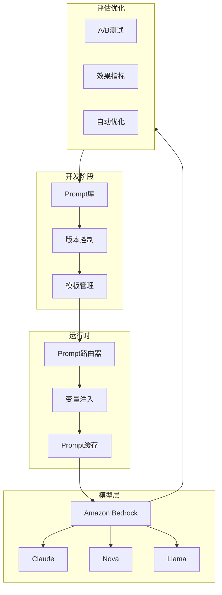
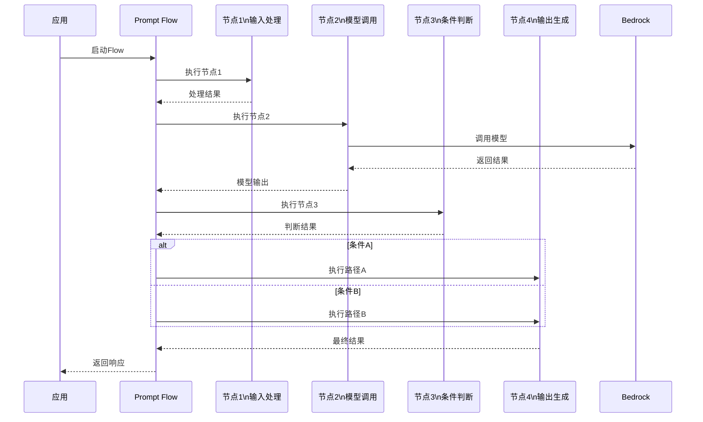
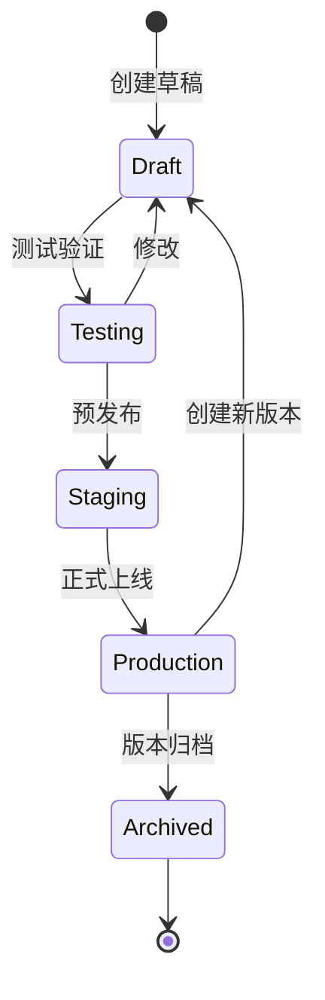

# Amazon Bedrock Prompt Management (提示管理) 博客素材收集文档

> 收集时间: 2026-03-01  
> 服务: Amazon Bedrock Prompt Management & Prompt Flows  
> 来源: AWS官方文档、博客、最佳实践

---

## Agent 1: 初级布道者 (Junior Advocate)

### 服务概述

**Amazon Bedrock Prompt Management** 是 AWS 提供的全托管提示工程平台，让开发者能够系统化地创建、版本管理、测试和部署提示词 (Prompts)。它支持提示版本控制、A/B 测试、变量注入，以及与 Bedrock 模型无缝集成。

**Amazon Bedrock Prompt Flows** 则是可视化工作流编排工具，允许通过拖拽方式将多个提示、知识库、Action Groups 组合成复杂的 AI 应用流程。

**生活化类比**:  
> Prompt Management 就像是 AI 开发的"版本控制系统 + 组件库" —— 就像软件开发使用 Git 管理代码版本、使用 npm 管理依赖包，Prompt Management 让提示词也能版本化、模块化，团队协作时可以追踪变更、回滚错误、复用优秀提示。而 Prompt Flows 就像"可视化流程设计器"，像搭积木一样将各种 AI 能力组合成完整应用。

## 架构图

### Prompt Management 系统架构



### Prompt Flow 执行流程



### Prompt 版本生命周期



---

### 核心组件 (5个必知组件)

| 组件 | 功能描述 | 类比 |
|------|----------|------|
| **Prompts** | 可版本化的提示词模板，支持变量注入 | "代码文件" - 可复用的提示单元 |
| **Prompt Versions** | 每个提示的多版本管理，支持回滚 | "Git 提交历史" - 追踪变更 |
| **Prompt Variables** | 动态变量替换，如 `{{customer_name}}` | "函数参数" - 动态输入 |
| **Prompt Flows** | 可视化工作流编排，多节点组合 | "流程图" - 可视化逻辑 |
| **Prompt Evaluation** | 自动化评估提示质量 | "单元测试" - 验证效果 |

### Prompt Management vs 硬编码 Prompt 对比

| 特性 | 硬编码 Prompt | Bedrock Prompt Management |
|------|---------------|--------------------------|
| **版本控制** | 代码版本，难追踪 | 独立版本号，可视对比 |
| **热更新** | 需重新部署应用 | 实时生效，无需部署 |
| **A/B 测试** | 需改代码部署多版本 | 控制台直接配置流量分配 |
| **团队协作** | 代码 Review | 权限管理 + 版本审批 |
| **性能监控** | 需自建埋点 | 内置调用统计 |
| **变量类型检查** | 运行时错误 | 定义时验证 |

### Quick Start - 最核心CLI命令

```bash
# 1. 创建 Prompt
aws bedrock create-prompt \
    --name "customer-service-greeting" \
    --description "Customer service greeting template" \
    --variant-name "default" \
    --model-id "anthropic.claude-3-sonnet-20240229-v1:0" \
    --inference-configuration '{"temperature": 0.7, "maxTokens": 500}' \
    --template-configuration '{
        "text": {
            "text": "You are a helpful customer service assistant.\n\nCustomer Name: {{customer_name}}\nIssue Type: {{issue_type}}\n\nPlease provide a warm greeting and acknowledge their issue."
        }
    }' \
    --input-variables '[{"name": "customer_name"}, {"name": "issue_type"}]'

# 2. 创建新版本 (V2 优化提示)
aws bedrock create-prompt-version \
    --prompt-identifier "customer-service-greeting" \
    --description "Added empathy guidelines"

# 3. 调用 Prompt (使用特定版本)
aws bedrock-runtime invoke-prompt \
    --prompt-identifier "arn:aws:bedrock:us-east-1:123456789012:prompt/customer-service-greeting" \
    --prompt-version "2" \
    --input-variables '{"customer_name": "张三", "issue_type": "退款申请"}'

# 4. 创建 Prompt Flow
aws bedrock create-flow \
    --name "order-support-flow" \
    --description "Complete order support workflow" \
    --execution-role-arn "arn:aws:iam::123456789012:role/BedrockFlowExecutionRole" \
    --definition '{
        "nodes": [
            {
                "name": "Input",
                "type": "Input",
                "configuration": {
                    "input": {
                        "schema": {
                            "json": {
                                "type": "object",
                                "properties": {
                                    "customer_query": {"type": "string"}
                                }
                            }
                        }
                    }
                }
            },
            {
                "name": "ClassifyIntent",
                "type": "Prompt",
                "configuration": {
                    "prompt": {
                        "sourceConfiguration": {
                            "inline": {
                                "modelId": "amazon.nova-lite-v1:0",
                                "inferenceConfiguration": {"temperature": 0.1},
                                "templateConfiguration": {
                                    "text": {"text": "Classify the intent: {{input.customer_query}}"}
                                }
                            }
                        }
                    }
                }
            },
            {
                "name": "RetrieveKnowledge",
                "type": "KnowledgeBase",
                "configuration": {
                    "knowledgeBase": {
                        "knowledgeBaseId": "kb-12345"
                    }
                }
            },
            {
                "name": "GenerateResponse",
                "type": "Prompt",
                "configuration": {
                    "prompt": {
                        "sourceConfiguration": {
                            "promptArn": "arn:aws:bedrock:us-east-1:123456789012:prompt/response-generator"
                        }
                    }
                }
            },
            {
                "name": "Output",
                "type": "Output"
            }
        ],
        "connections": [
            {"source": "Input", "target": "ClassifyIntent"},
            {"source": "ClassifyIntent", "target": "RetrieveKnowledge"},
            {"source": "RetrieveKnowledge", "target": "GenerateResponse"},
            {"source": "GenerateResponse", "target": "Output"}
        ]
    }'

# 5. 执行 Prompt Flow
aws bedrock-runtime invoke-flow \
    --flow-identifier "arn:aws:bedrock:us-east-1:123456789012:flow/order-support-flow" \
    --flow-alias-identifier "TSTALIASID" \
    --inputs '[{"nodeName": "Input", "content": {"customer_query": "我的订单什么时候到货？"}}]'

# 6. 创建 A/B 测试 (版本 1 vs 版本 2)
aws bedrock create-prompt-router \
    --prompt-router-name "greeting-router" \
    --description "A/B test for greeting prompts" \
    "fallback-prompt": {
        "promptArn": "arn:aws:bedrock:us-east-1:123456789012:prompt/customer-service-greeting",
        "promptVersion": "1"
    },
    --routes '[
        {
            "name": "control",
            "description": "Original version",
            "prompt": {
                "promptArn": "arn:aws:bedrock:us-east-1:123456789012:prompt/customer-service-greeting",
                "promptVersion": "1"
            },
            "weight": 50
        },
        {
            "name": "treatment",
            "description": "New empathetic version",
            "prompt": {
                "promptArn": "arn:aws:bedrock:us-east-1:123456789012:prompt/customer-service-greeting",
                "promptVersion": "2"
            },
            "weight": 50
        }
    ]'
```

### 官方文档入口

- Prompt Management: https://docs.aws.amazon.com/bedrock/latest/userguide/prompt-management.html
- Prompt Flows: https://docs.aws.amazon.com/bedrock/latest/userguide/flows.html
- Prompt Evaluation: https://docs.aws.amazon.com/bedrock/latest/userguide/prompt-evaluation.html

---

## Agent 2: 高级开发攻擂手 (Senior Developer)

### 重点分析 (Problem-Oriented)

#### 1. Prompt 版本管理策略

**语义化版本控制**:
```
Prompt: customer-service-response

v1.0.0 - 初始版本，基础客服回复
v1.1.0 - 添加了语气友好度要求 (minor)
v1.2.0 - 增加了多语言支持 (minor)
v2.0.0 - 重构了提示结构，使用 Few-shot 示例 (major)
v2.1.0 - 优化了输出格式，添加 JSON Schema 约束 (minor)
v2.1.1 - 修复了变量名拼写错误 (patch)
```

**Python SDK - 版本管理**:
```python
import boto3
from datetime import datetime

bedrock = boto3.client('bedrock')
bedrock_runtime = boto3.client('bedrock-runtime')

class PromptManager:
    """Prompt 版本管理器"""
    
    def __init__(self):
        self.bedrock = boto3.client('bedrock')
    
    def create_prompt_with_versioning(
        self,
        name: str,
        description: str,
        template: str,
        model_id: str,
        variables: list,
        tags: dict = None
    ):
        """创建带版本控制的 Prompt"""
        
        # 检查是否已存在
        existing = self._get_prompt_by_name(name)
        
        if existing:
            # 创建新版本
            response = self.bedrock.create_prompt_version(
                promptIdentifier=existing['id'],
                description=description,
                tags=tags or {}
            )
            version = response['version']
            action = "UPDATED"
        else:
            # 创建新 Prompt
            response = self.bedrock.create_prompt(
                name=name,
                description=description,
                variants=[{
                    "name": "default",
                    "modelId": model_id,
                    "templateConfiguration": {
                        "text": {"text": template}
                    },
                    "inferenceConfiguration": {
                        "temperature": 0.7,
                        "maxTokens": 1000,
                        "topP": 0.9
                    }
                }],
                defaultVariant="default",
                inputVariables=[{"name": v} for v in variables],
                tags=tags or {}
            )
            version = "1"
            action = "CREATED"
        
        return {
            "action": action,
            "prompt_arn": response.get('arn') or existing['arn'],
            "version": version,
            "name": name
        }
    
    def deploy_prompt_version(self, prompt_arn: str, version: str, environment: str):
        """
        部署特定版本到环境
        
        环境映射：
        - dev: 最新开发版本
        - staging: 待测试版本
        - prod: 生产稳定版本
        """
        
        # 创建/更新别名指向特定版本
        alias_name = f"{environment}-alias"
        
        try:
            # 尝试更新现有别名
            self.bedrock.update_prompt_alias(
                promptIdentifier=prompt_arn,
                promptAliasIdentifier=alias_name,
                description=f"Deployed to {environment}",
                routingConfiguration=[{
                    "promptVersion": version,
                    "weight": 100
                }]
            )
        except self.bedrock.exceptions.ResourceNotFoundException:
            # 创建新别名
            self.bedrock.create_prompt_alias(
                promptIdentifier=prompt_arn,
                promptAliasName=alias_name,
                description=f"Deployed to {environment}",
                routingConfiguration=[{
                    "promptVersion": version,
                    "weight": 100
                }]
            )
        
        print(f"✓ Prompt {prompt_arn} version {version} deployed to {environment}")
        
        return {
            "prompt_arn": prompt_arn,
            "version": version,
            "environment": environment,
            "alias": alias_name
        }
    
    def rollback(self, prompt_arn: str, steps: int = 1):
        """回滚到之前的版本"""
        
        # 获取版本历史
        versions = self.bedrock.list_prompt_versions(
            promptIdentifier=prompt_arn
        )['promptVersions']
        
        # 按时间排序
        versions.sort(key=lambda x: x['createdAt'], reverse=True)
        
        if len(versions) <= steps:
            raise ValueError(f"Cannot rollback {steps} steps, only {len(versions)} versions available")
        
        target_version = versions[steps]['version']
        
        # 部署旧版本
        return self.deploy_prompt_version(prompt_arn, target_version, "prod")
    
    def compare_versions(self, prompt_arn: str, version_a: str, version_b: str):
        """对比两个版本的差异"""
        
        v1 = self.bedrock.get_prompt(
            promptIdentifier=prompt_arn,
            promptVersion=version_a
        )
        v2 = self.bedrock.get_prompt(
            promptIdentifier=prompt_arn,
            promptVersion=version_b
        )
        
        return {
            "version_a": {
                "version": version_a,
                "template": v1['variants'][0]['templateConfiguration']['text']['text'],
                "model": v1['variants'][0]['modelId'],
                "created_at": v1['createdAt']
            },
            "version_b": {
                "version": version_b,
                "template": v2['variants'][0]['templateConfiguration']['text']['text'],
                "model": v2['variants'][0]['modelId'],
                "created_at": v2['createdAt']
            }
        }

# 使用示例
prompt_mgr = PromptManager()

# 创建 Prompt
result = prompt_mgr.create_prompt_with_versioning(
    name="refund-response",
    description="Customer refund request handling",
    template="""You are a customer service agent handling refund requests.

Customer: {{customer_name}}
Order ID: {{order_id}}
Reason: {{refund_reason}}

Provide a helpful response that:
1. Acknowledges the request
2. States the refund policy
3. Outlines next steps
4. Offers assistance

Response:""",
    model_id="anthropic.claude-3-sonnet-20240229-v1:0",
    variables=["customer_name", "order_id", "refund_reason"],
    tags={"team": "support", "priority": "high"}
)

# 部署到生产
prompt_mgr.deploy_prompt_version(
    prompt_arn=result['prompt_arn'],
    version=result['version'],
    environment="prod"
)
```

#### 2. 高级变量系统

**变量类型与验证**:
```python
# 定义带类型约束的变量
variable_definitions = [
    {
        "name": "customer_name",
        "type": "string",
        "description": "Customer's full name",
        "validation": {
            "minLength": 1,
            "maxLength": 100,
            "pattern": "^[a-zA-Z\\s]+$"
        }
    },
    {
        "name": "order_value",
        "type": "number",
        "description": "Order amount in USD",
        "validation": {
            "minimum": 0,
            "maximum": 100000
        }
    },
    {
        "name": "is_vip",
        "type": "boolean",
        "description": "Whether customer is VIP",
        "default": False
    },
    {
        "name": "product_categories",
        "type": "array",
        "description": "List of product categories",
        "items": {
            "type": "string",
            "enum": ["electronics", "clothing", "books", "home"]
        }
    },
    {
        "name": "customer_profile",
        "type": "object",
        "description": "Customer profile data",
        "properties": {
            "tier": {"type": "string", "enum": ["bronze", "silver", "gold"]},
            "join_date": {"type": "string", "format": "date"},
            "lifetime_value": {"type": "number"}
        }
    }
]

# 带条件逻辑的 Prompt 模板
dynamic_template = """
You are a customer service agent.

Customer Info:
- Name: {{customer_name}}
- Tier: {{customer_profile.tier}}
- Order Value: ${{order_value}}


⚠️ VIP CUSTOMER - Prioritize and offer premium support



💰 High-value order - Consider manager approval for refunds



- Category: {{category}}


Response Guidelines:

- Offer immediate resolution
- Provide compensation if applicable

- Standard priority processing

- Standard processing time


Please compose a response:
"""
```

#### 3. Prompt 评估与优化

**自动化评估框架**:
```python
import json
from typing import List, Dict

class PromptEvaluator:
    """Prompt 质量评估器"""
    
    def __init__(self):
        self.bedrock = boto3.client('bedrock')
        self.bedrock_runtime = boto3.client('bedrock-runtime')
    
    def evaluate_prompt(
        self,
        prompt_arn: str,
        version: str,
        test_cases: List[Dict],
        metrics: List[str] = None
    ) -> Dict:
        """
        评估 Prompt 质量
        
        指标：
        - relevance: 相关性
        - coherence: 连贯性
        - helpfulness: 有用性
        - accuracy: 准确性
        - latency: 延迟
        - cost: 成本
        """
        
        metrics = metrics or ["relevance", "coherence", "helpfulness"]
        results = []
        
        for case in test_cases:
            # 调用 Prompt
            response = self.bedrock_runtime.invoke_prompt(
                promptIdentifier=prompt_arn,
                promptVersion=version,
                inputVariables=case['input']
            )
            
            output = response['output']['content'][0]['text']
            
            # 计算各项指标
            case_result = {
                "test_case_id": case['id'],
                "input": case['input'],
                "expected": case.get('expected_output'),
                "actual": output,
                "metrics": {}
            }
            
            for metric in metrics:
                if metric == "accuracy":
                    score = self._evaluate_accuracy(output, case.get('expected_output'))
                elif metric == "latency":
                    score = response['ResponseMetadata']['HTTPHeaders'].get('x-amzn-bedrock-invocation-latency')
                elif metric == "cost":
                    score = self._calculate_cost(response)
                else:
                    # 使用模型评估（LLM-as-a-Judge）
                    score = self._llm_evaluate(metric, output, case.get('expected_output'))
                
                case_result['metrics'][metric] = score
            
            results.append(case_result)
        
        # 汇总统计
        summary = {
            "total_cases": len(test_cases),
            "avg_scores": {
                metric: sum(r['metrics'][metric] for r in results) / len(results)
                for metric in metrics
            },
            "passed_cases": sum(1 for r in results if all(
                r['metrics'][m] >= 0.8 for m in metrics if m not in ['latency', 'cost']
            )),
            "detailed_results": results
        }
        
        return summary
    
    def _llm_evaluate(self, metric: str, output: str, expected: str = None) -> float:
        """使用 LLM 评估输出质量"""
        
        eval_prompt = f"""Rate the {metric} of the following response on a scale of 0-1.
        
Response: {output}
{f"Expected: {expected}" if expected else ""}

Provide only a number between 0 and 1."""
        
        response = self.bedrock_runtime.invoke_model(
            modelId="amazon.nova-lite-v1:0",
            body=json.dumps({
                "inputText": eval_prompt,
                "textGenerationConfig": {"maxTokenCount": 10}
            })
        )
        
        try:
            score = float(response['body'].read().decode())
            return min(max(score, 0), 1)  # 确保在 0-1 范围
        except:
            return 0.5
    
    def _evaluate_accuracy(self, output: str, expected: str) -> float:
        """计算准确性（简单字符串匹配或语义相似度）"""
        if not expected:
            return 1.0
        
        # 使用 embedding 计算语义相似度
        embedding_model = "amazon.titan-embed-text-v2:0"
        
        output_emb = self._get_embedding(output, embedding_model)
        expected_emb = self._get_embedding(expected, embedding_model)
        
        # 余弦相似度
        similarity = self._cosine_similarity(output_emb, expected_emb)
        return (similarity + 1) / 2  # 归一化到 0-1
    
    def _get_embedding(self, text: str, model_id: str) -> List[float]:
        """获取文本 embedding"""
        response = self.bedrock_runtime.invoke_model(
            modelId=model_id,
            body=json.dumps({"inputText": text})
        )
        return json.loads(response['body'].read())['embedding']
    
    def _cosine_similarity(self, a: List[float], b: List[float]) -> float:
        """计算余弦相似度"""
        import numpy as np
        return float(np.dot(a, b) / (np.linalg.norm(a) * np.linalg.norm(b)))
    
    def _calculate_cost(self, response: Dict) -> float:
        """计算调用成本（简化版）"""
        # 实际应从响应头获取 token 数量
        return 0.001  # placeholder

# 测试用例示例
test_cases = [
    {
        "id": "tc-001",
        "input": {
            "customer_name": "张三",
            "issue_type": "订单延迟"
        },
        "expected_output": "应包含道歉、解释原因、提供补偿方案",
        "tags": ["delay", "standard"]
    },
    {
        "id": "tc-002",
        "input": {
            "customer_name": "李四",
            "issue_type": "产品质量问题"
        },
        "expected_output": "应包含退货流程、退款保证、质量保证",
        "tags": ["quality", "refund"]
    }
]

# 执行评估
evaluator = PromptEvaluator()
results = evaluator.evaluate_prompt(
    prompt_arn="arn:aws:bedrock:us-east-1:123456789012:prompt/customer-service",
    version="2",
    test_cases=test_cases,
    metrics=["relevance", "helpfulness", "accuracy", "latency"]
)

print(f"平均准确率: {results['avg_scores']['accuracy']:.2%}")
print(f"通过用例: {results['passed_cases']}/{results['total_cases']}")
```

### 服务配额

| 配额项 | 默认值 | 可调 | 备注 |
|--------|--------|------|------|
| Prompts/账户 | 1000 | ✅ | - |
| Versions/Prompt | 100 | ✅ | - |
| Aliases/Prompt | 10 | ❌ | - |
| Prompt Flows/账户 | 100 | ✅ | - |
| Nodes/Flow | 20 | ❌ | - |
| Flow 执行超时 | 60s | ✅ | 最大 900s |
| Prompt 模板大小 | 100KB | ❌ | - |
| Input 变量数 | 20 | ❌ | - |

---

## Agent 3: 自动化部署专家 (DevOps Engineer)

### IaC Delivery - Terraform 模板

```hcl
# ============================================
# Bedrock Prompt Management 基础设施
# ============================================

terraform {
  required_providers {
    aws = {
      source  = "hashicorp/aws"
      version = "~> 5.0"
    }
  }
}

provider "aws" {
  region = var.aws_region
}

# ============================================
# 1. Prompt 定义
# ============================================
resource "aws_bedrock_prompt" "customer_service" {
  name        = "${var.project_name}-customer-service"
  description = "Customer service response template"

  default_variant = "v1"

  variant {
    name    = "v1"
    model_id = "anthropic.claude-3-sonnet-20240229-v1:0"

    template_configuration {
      text {
        text = file("${path.module}/prompts/customer-service-v1.txt")
      }
    }

    inference_configuration {
      temperature = 0.7
      max_tokens  = 1000
      top_p       = 0.9
    }
  }

  variant {
    name    = "v2-experimental"
    model_id = "anthropic.claude-3-sonnet-20240229-v1:0"

    template_configuration {
      text {
        text = file("${path.module}/prompts/customer-service-v2.txt")
      }
    }

    inference_configuration {
      temperature = 0.5  # 更确定性
      max_tokens  = 800
      top_p       = 0.95
    }
  }

  input_variable {
    name = "customer_name"
  }

  input_variable {
    name = "issue_type"
  }

  input_variable {
    name = "order_id"
  }
}

# 创建版本
resource "aws_bedrock_prompt_version" "v1" {
  prompt_arn  = aws_bedrock_prompt.customer_service.arn
  description = "Initial production version"
  
  depends_on = [aws_bedrock_prompt.customer_service]
}

# ============================================
# 2. 环境别名
# ============================================
resource "aws_bedrock_prompt_alias" "prod" {
  prompt_arn = aws_bedrock_prompt.customer_service.arn
  prompt_alias_name = "prod"
  description = "Production alias"

  routing_configuration {
    prompt_version = aws_bedrock_prompt_version.v1.version
    weight         = 100
  }
}

resource "aws_bedrock_prompt_alias" "staging" {
  prompt_arn = aws_bedrock_prompt.customer_service.arn
  prompt_alias_name = "staging"
  description = "Staging environment"

  routing_configuration {
    prompt_version = "2"  # 测试新版本
    weight         = 100
  }
}

# ============================================
# 3. A/B 测试路由器
# ============================================
resource "aws_bedrock_prompt_router" "ab_test" {
  prompt_router_name = "${var.project_name}-ab-router"
  description        = "A/B testing for customer service prompts"

  fallback_prompt {
    prompt_arn     = aws_bedrock_prompt.customer_service.arn
    prompt_version = aws_bedrock_prompt_version.v1.version
  }

  route {
    name        = "control"
    description = "Current production version"
    
    prompt {
      prompt_arn     = aws_bedrock_prompt.customer_service.arn
      prompt_version = aws_bedrock_prompt_version.v1.version
    }
    
    weight = 50
  }

  route {
    name        = "treatment"
    description = "New version with empathy improvements"
    
    prompt {
      prompt_arn     = aws_bedrock_prompt.customer_service.arn
      prompt_version = "2"
    }
    
    weight = 50
  }
}

# ============================================
# 4. Prompt Flow
# ============================================
resource "aws_bedrock_flow" "support_workflow" {
  name        = "${var.project_name}-support-flow"
  description = "Complete customer support workflow"
  
  execution_role_arn = aws_iam_role.flow_execution.arn

  # 输入节点
  node {
    name = "Input"
    type = "Input"
    
    configuration {
      input {
        json_schema = jsonencode({
          type = "object"
          properties = {
            customer_query = { type = "string" }
            customer_id    = { type = "string" }
          }
          required = ["customer_query"]
        })
      }
    }
  }

  # 意图分类节点
  node {
    name = "ClassifyIntent"
    type = "Prompt"
    
    configuration {
      prompt {
        inline {
          model_id = "amazon.nova-lite-v1:0"
          
          template_configuration {
            text {
              text = "Classify the customer query into one of: ORDER_STATUS, REFUND_REQUEST, PRODUCT_INQUIRY, COMPLAINT.\n\nQuery: {{input.customer_query}}\n\nIntent:"
            }
          }
          
          inference_configuration {
            temperature = 0.1
            max_tokens  = 50
          }
        }
      }
    }
  }

  # 知识库检索节点
  node {
    name = "RetrieveDocs"
    type = "KnowledgeBase"
    
    configuration {
      knowledge_base {
        knowledge_base_id = var.knowledge_base_id
        
        retrieval_configuration {
          vector_search_configuration {
            number_of_results = 5
          }
        }
      }
    }
  }

  # 主响应生成节点
  node {
    name = "GenerateResponse"
    type = "Prompt"
    
    configuration {
      prompt {
        prompt_arn     = aws_bedrock_prompt.customer_service.arn
        prompt_version = aws_bedrock_prompt_version.v1.version
      }
    }
  }

  # 条件路由节点
  node {
    name = "CheckEscalation"
    type = "Condition"
    
    configuration {
      condition {
        condition = "{{ClassifyIntent.output.text}} == 'COMPLAINT'"
      }
    }
  }

  # 输出节点
  node {
    name = "Output"
    type = "Output"
  }

  # 节点连接
  connection {
    source = "Input"
    target = "ClassifyIntent"
  }

  connection {
    source = "ClassifyIntent"
    target = "RetrieveDocs"
  }

  connection {
    source = "RetrieveDocs"
    target = "GenerateResponse"
  }

  connection {
    source = "GenerateResponse"
    target = "CheckEscalation"
  }

  connection {
    source = "CheckEscalation"
    target = "Output"
  }
}

# Flow 版本
resource "aws_bedrock_flow_version" "v1" {
  flow_arn    = aws_bedrock_flow.support_workflow.arn
  description = "Initial production version"
  
  depends_on = [aws_bedrock_flow.support_workflow]
}

# Flow 别名
resource "aws_bedrock_flow_alias" "prod" {
  flow_arn = aws_bedrock_flow.support_workflow.arn
  flow_alias_name = "prod"
  
  routing_configuration {
    flow_version = aws_bedrock_flow_version.v1.version
  }
}

# ============================================
# 5. IAM 角色
# ============================================
resource "aws_iam_role" "flow_execution" {
  name = "${var.project_name}-flow-execution-role"

  assume_role_policy = jsonencode({
    Version = "2012-10-17"
    Statement = [{
      Action = "sts:AssumeRole"
      Effect = "Allow"
      Principal = {
        Service = "bedrock.amazonaws.com"
      }
    }]
  })
}

resource "aws_iam_role_policy" "flow_policy" {
  name = "flow-permissions"
  role = aws_iam_role.flow_execution.id

  policy = jsonencode({
    Version = "2012-10-17"
    Statement = [
      {
        Effect = "Allow"
        Action = [
          "bedrock:InvokeModel",
          "bedrock:InvokePrompt",
          "bedrock:Retrieve"
        ]
        Resource = "*"
      }
    ]
  })
}

# ============================================
# 6. CloudWatch 监控
# ============================================
resource "aws_cloudwatch_metric_alarm" "prompt_latency" {
  alarm_name          = "${var.project_name}-prompt-high-latency"
  comparison_operator = "GreaterThanThreshold"
  evaluation_periods  = 3
  metric_name         = "InvocationLatency"
  namespace           = "AWS/Bedrock/PromptManagement"
  period              = 60
  statistic           = "p99"
  threshold           = 2000
  alarm_description   = "Prompt invocation P99 latency > 2s"
  alarm_actions       = [aws_sns_topic.alerts.arn]

  dimensions = {
    PromptArn = aws_bedrock_prompt.customer_service.arn
  }
}

resource "aws_sns_topic" "alerts" {
  name = "${var.project_name}-prompt-alerts"
}

# ============================================
# Variables
# ============================================
variable "project_name" {
  description = "项目名称"
  type        = string
  default     = "bedrock-prompts"
}

variable "aws_region" {
  description = "AWS 区域"
  type        = string
  default     = "us-east-1"
}

variable "knowledge_base_id" {
  description = "Knowledge Base ID"
  type        = string
}

# ============================================
# Outputs
# ============================================
output "prompt_arn" {
  description = "Prompt ARN"
  value       = aws_bedrock_prompt.customer_service.arn
}

output "prod_alias_arn" {
  description = "Production alias ARN"
  value       = aws_bedrock_prompt_alias.prod.arn
}

output "flow_arn" {
  description = "Prompt Flow ARN"
  value       = aws_bedrock_flow.support_workflow.arn
}
```

### CI/CD 集成

**GitHub Actions 工作流**:
```yaml
name: Prompt Deployment

on:
  push:
    paths:
      - 'prompts/**'
      - '.github/workflows/prompts.yml'

jobs:
  validate:
    runs-on: ubuntu-latest
    steps:
      - uses: actions/checkout@v3
      
      - name: Validate Prompt Templates
        run: |
          python scripts/validate_prompts.py --check-syntax
          python scripts/validate_prompts.py --check-variables
      
      - name: Run Prompt Tests
        run: |
          python scripts/test_prompts.py --env staging

  deploy-staging:
    needs: validate
    runs-on: ubuntu-latest
    steps:
      - uses: actions/checkout@v3
      
      - name: Configure AWS
        uses: aws-actions/configure-aws-credentials@v2
        with:
          role-to-assume: ${{ secrets.AWS_ROLE_ARN }}
          aws-region: us-east-1
      
      - name: Deploy to Staging
        run: |
          terraform init
          terraform workspace select staging
          terraform apply -auto-approve
          
      - name: Run Integration Tests
        run: |
          python scripts/evaluate_prompts.py --env staging

  deploy-production:
    needs: deploy-staging
    runs-on: ubuntu-latest
    environment: production
    steps:
      - uses: actions/checkout@v3
      
      - name: Configure AWS
        uses: aws-actions/configure-aws-credentials@v2
        with:
          role-to-assume: ${{ secrets.AWS_ROLE_ARN }}
          aws-region: us-east-1
      
      - name: Deploy to Production
        run: |
          terraform init
          terraform workspace select prod
          terraform apply -auto-approve
          
      - name: Verify Deployment
        run: |
          python scripts/smoke_test.py --env prod
```

---

## Agent 4: 首席云架构师 (Cloud Architect)

### Well-Architected Framework 评估

#### 1. Operational Excellence - 提示工程最佳实践

**提示版本管理策略**:
```
prompts/
├── customer-service/
│   ├── v1.0.0.txt          # 初始版本
│   ├── v1.1.0.txt          # 添加语气要求
│   ├── v2.0.0.txt          # 重构为 Few-shot
│   └── current -> v2.0.0   # 符号链接指向当前
├── order-support/
│   └── ...
└── templates/              # 可复用模板
    ├── system-prompt-base.txt
    └── few-shot-examples.txt
```

**提示评估流水线**:
```
开发人员提交新提示版本
        │
        ▼
┌───────────────────────┐
│ 自动化语法检查         │
│ - 变量完整性           │
│ - JSON 格式验证        │
└───────────┬───────────┘
            │
            ▼
┌───────────────────────┐
│ 回归测试               │
│ - 现有测试用例         │
│ - 基线对比             │
└───────────┬───────────┘
            │
            ▼
┌───────────────────────┐
│ 人工审核 (可选)        │
│ - 质量评分             │
│ - 业务逻辑检查         │
└───────────┬───────────┘
            │
            ▼
┌───────────────────────┐
│ 灰度发布               │
│ - 5% 流量测试          │
│ - 监控指标             │
└───────────┬───────────┘
            │
            ▼
        全量发布
```

#### 2. Cost Optimization

| 策略 | 节省幅度 | 实施方式 |
|------|----------|----------|
| **Prompt Caching** | 85% 成本 | 缓存静态系统提示 |
| **模型降级** | 90% 成本 | 简单任务使用 Nova Lite |
| **响应截断** | 30-50% | 设置合理的 max_tokens |
| **批量评估** | 50% 成本 | 离线批量测试而非实时 |

**成本监控仪表板**:
```json
{
  "widgets": [
    {
      "title": "Prompt Invocation Cost by Version",
      "metrics": [
        ["AWS/Bedrock/PromptManagement", "Cost", "Version", "v1"],
        ["...", "...", "...", "v2"]
      ]
    },
    {
      "title": "A/B Test Performance",
      "metrics": [
        ["Custom/Prompts", "SuccessRate", "Variant", "control"],
        ["...", "...", "...", "treatment"]
      ]
    }
  ]
}
```

#### 3. Security

**提示安全最佳实践**:
1. **敏感信息脱敏**: 使用变量注入而非硬编码
2. **输入验证**: 严格校验变量类型和范围
3. **审计日志**: 记录所有提示变更和调用
4. **权限隔离**: 不同环境使用不同 IAM 角色
5. **版本锁定**: 生产环境使用固定版本，避免自动更新风险

### 关键决策树

```
应用场景分析
    │
    ├──► 需要复杂多步骤工作流? ──是──► Prompt Flows
    │                              └──► 考虑 Step Functions 集成
    │
    ├──► 需要频繁 A/B 测试提示? ──是──► Prompt Management + Router
    │                               └──► 内置流量分配
    │
    ├──► 需要多团队协作管理提示? ──是──► Prompt Management
    │                                └──► 版本控制 + 权限管理
    │
    ├──► 简单提示偶尔更新? ──是──► 代码中管理即可
    │
    └──► 需要动态提示组合? ──是──► Prompt Flows 条件节点
```

### Prompt Management vs Prompt Flows 选择

| 场景 | 推荐方案 | 理由 |
|------|----------|------|
| 单一提示版本管理 | Prompt Management | 简单、轻量 |
| 多步骤 AI 流程 | Prompt Flows | 可视化编排 |
| 需要复杂条件分支 | Prompt Flows | 内置条件节点 |
| 需要与外部 API 集成 | Prompt Flows | 支持 Action Groups |
| 仅需要提示 A/B 测试 | Prompt Management + Router | 原生支持 |
| 需要与现有代码深度集成 | SDK 直接调用 | 灵活性最高 |

---

## 附录: 参考资源

### 官方文档
- [Prompt Management](https://docs.aws.amazon.com/bedrock/latest/userguide/prompt-management.html)
- [Prompt Flows](https://docs.aws.amazon.com/bedrock/latest/userguide/flows.html)
- [Prompt Evaluation](https://docs.aws.amazon.com/bedrock/latest/userguide/prompt-evaluation.html)

### 博客文章
- [Building AI Applications with Prompt Management](https://aws.amazon.com/blogs/machine-learning/build-ai-applications-with-amazon-bedrock-prompt-management/)
- [Best Practices for Prompt Engineering](https://aws.amazon.com/blogs/machine-learning/best-practices-for-prompt-engineering-with-amazon-bedrock/)

### 最佳实践
- [Prompt Engineering Guidelines](https://docs.aws.amazon.com/bedrock/latest/userguide/prompt-engineering-guidelines.html)
- [Prompt Chaining Patterns](https://docs.aws.amazon.com/bedrock/latest/userguide/prompt-chaining.html)

---

*文档生成完成 | 基于 AWS 官方文档和最佳实践整理*
