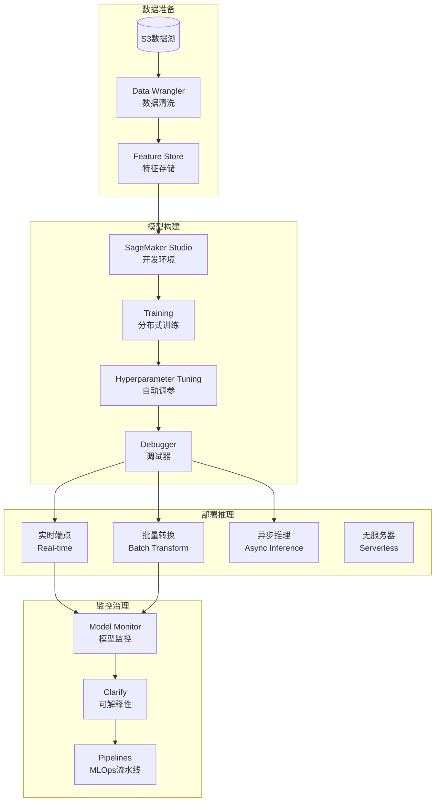
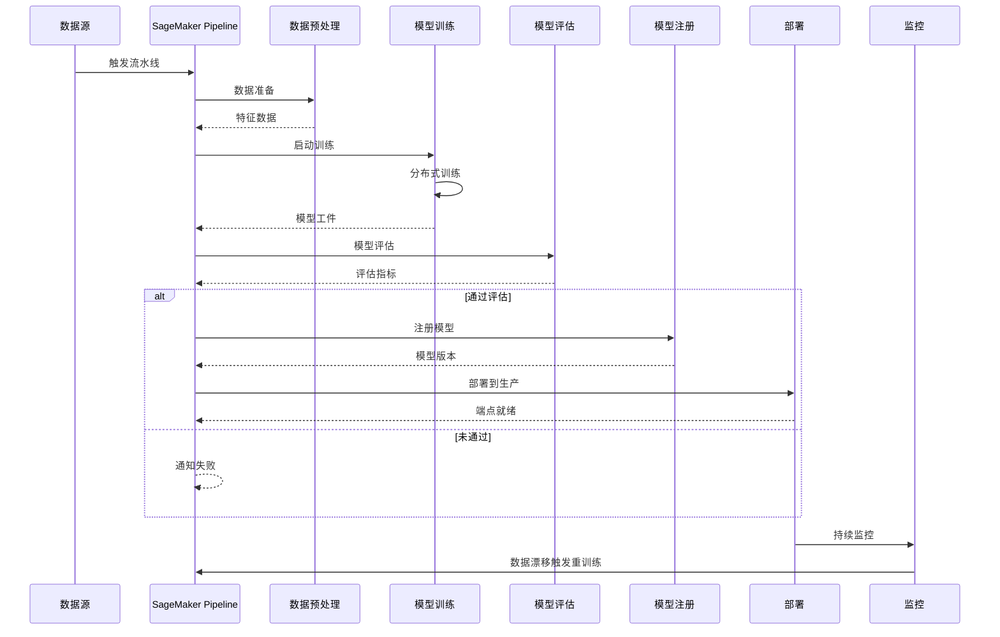
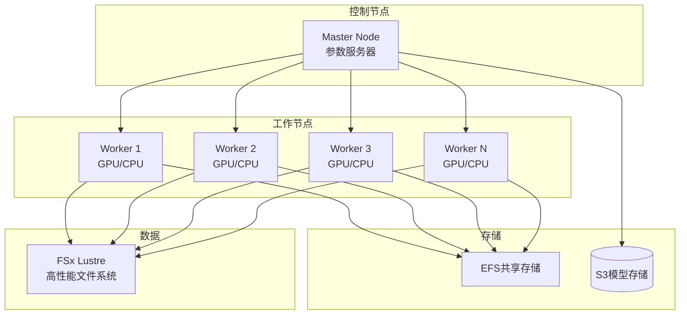

# Amazon SageMaker 博客素材收集文档

> 收集时间: 2026-03-01  
> 服务: Amazon SageMaker (Machine Learning Platform)  
> 来源: AWS官方文档、博客、最佳实践

---

## Agent 1: 初级布道者 (Junior Advocate)

### 服务概述

**Amazon SageMaker** 是 AWS 提供的全托管机器学习平台，覆盖 ML 全流程：数据准备、模型训练、调优、部署和监控。它与 Amazon Bedrock 形成互补——Bedrock 提供即用型基础模型，SageMaker 则支持自定义模型开发和全生命周期管理。

**生活化类比**:  
> 如果 Bedrock 是"AI 模型超市"（选购现成模型），那么 SageMaker 就是"AI 定制工厂"——就像超市提供标准化商品，工厂则可以根据特定需求从零设计、制造定制化产品。SageMaker 提供了从"原材料"（数据）到"成品"（部署模型）的完整生产线。

## 架构图

### SageMaker ML 生命周期架构



### MLOps 流水线



### 分布式训练架构



---

### SageMaker vs Bedrock 对比

| 维度 | Amazon SageMaker | Amazon Bedrock |
|------|-----------------|----------------|
| **定位** | 自定义 ML 开发平台 | 托管基础模型服务 |
| **使用门槛** | 较高（需 ML 知识） | 较低（API 调用） |
| **模型控制** | 完全控制（架构、训练） | 有限控制（提示词、参数） |
| **适用场景** | 专有模型、特定架构需求 | 快速应用、通用任务 |
| **成本模式** | 基础设施成本 + 开发成本 | 按调用付费 |
| **典型用户** | ML 工程师、数据科学家 | 应用开发者 |

### 核心组件 (8大功能)

| 组件 | 功能 | 类比 |
|------|------|------|
| **SageMaker Studio** | 集成开发环境 (IDE) | "AI 实验室" - 一站式开发 |
| **Data Wrangler** | 数据准备和特征工程 | "数据清洗车间" |
| **Training** | 分布式模型训练 | "模型训练营" |
| **Processing** | 数据处理和验证 | "数据加工线" |
| **Inference** | 模型部署和推理 | "模型服务中心" |
| **Pipelines** | ML 工作流编排 | "自动化流水线" |
| **Model Monitor** | 生产模型监控 | "质量检测站" |
| **Clarify** | 模型可解释性和偏见检测 | "AI 审计师" |

### Quick Start - 最核心CLI命令

```bash
# 1. 创建 SageMaker Notebook Instance
aws sagemaker create-notebook-instance \
    --notebook-instance-name "my-ml-workspace" \
    --instance-type "ml.t3.medium" \
    --role-arn "arn:aws:iam::123456789012:role/SageMakerExecutionRole" \
    --lifecycle-config-name "auto-shutdown"

# 2. 启动训练作业 (使用内置算法)
aws sagemaker create-training-job \
    --training-job-name "xgboost-training-001" \
    --algorithm-specification '{
        "TrainingImage": "683313688378.dkr.ecr.us-east-1.amazonaws.com/sagemaker-xgboost:1.7-1",
        "TrainingInputMode": "File"
    }' \
    --role-arn "arn:aws:iam::123456789012:role/SageMakerExecutionRole" \
    --input-data-config '[{
        "ChannelName": "train",
        "DataSource": {
            "S3DataSource": {
                "S3DataType": "S3Prefix",
                "S3Uri": "s3://my-bucket/train/",
                "S3DataDistributionType": "FullyReplicated"
            }
        },
        "ContentType": "text/csv"
    }]' \
    --output-data-config '{
        "S3OutputPath": "s3://my-bucket/output/"
    }' \
    --resource-config '{
        "InstanceType": "ml.m5.large",
        "InstanceCount": 1,
        "VolumeSizeInGB": 50
    }' \
    --stopping-condition '{
        "MaxRuntimeInSeconds": 3600
    }' \
    --hyper-parameters '{
        "objective": "binary:logistic",
        "num_round": "100",
        "max_depth": "5"
    }'

# 3. 创建模型
aws sagemaker create-model \
    --model-name "xgboost-customer-churn" \
    --primary-container '{
        "Image": "683313688378.dkr.ecr.us-east-1.amazonaws.com/sagemaker-xgboost:1.7-1",
        "ModelDataUrl": "s3://my-bucket/output/xgboost-training-001/output/model.tar.gz"
    }' \
    --execution-role-arn "arn:aws:iam::123456789012:role/SageMakerExecutionRole"

# 4. 创建端点配置
aws sagemaker create-endpoint-config \
    --endpoint-config-name "xgboost-endpoint-config" \
    --production-variants '[{
        "VariantName": "variant-1",
        "ModelName": "xgboost-customer-churn",
        "InitialInstanceCount": 1,
        "InstanceType": "ml.m5.large",
        "InitialVariantWeight": 1.0
    }]'

# 5. 部署端点
aws sagemaker create-endpoint \
    --endpoint-name "customer-churn-predictor" \
    --endpoint-config-name "xgboost-endpoint-config"

# 6. 调用端点进行推理
aws sagemaker-runtime invoke-endpoint \
    --endpoint-name "customer-churn-predictor" \
    --content-type "text/csv" \
    --body "35,2,100.5,1,0,0,0,1,0,0" \
    output.json && cat output.json

# 7. 创建 SageMaker Pipeline
aws sagemaker create-pipeline \
    --pipeline-name "customer-churn-pipeline" \
    --pipeline-definition file://pipeline-definition.json \
    --role-arn "arn:aws:iam::123456789012:role/SageMakerExecutionRole"

# 8. 启动 Pipeline 执行
aws sagemaker start-pipeline-execution \
    --pipeline-name "customer-churn-pipeline"
```

### 官方文档入口

- 服务概述: https://docs.aws.amazon.com/sagemaker/latest/dg/whatis.html
- 开发者指南: https://docs.aws.amazon.com/sagemaker/latest/dg/your-algorithms.html
- API Reference: https://docs.aws.amazon.com/sagemaker/latest/APIReference/

---

## Agent 2: 高级开发攻擂手 (Senior Developer)

### 重点分析 (Problem-Oriented)

#### 1. 实例类型选择与成本优化

**SageMaker 实例类型决策树**:
```
工作负载类型
    │
    ├──► 开发/实验 ──► Notebook: ml.t3/m5 (CPU) 或 ml.g4dn (GPU)
    │
    ├──► 数据处理 ──► Processing: ml.m5/c5 (CPU 密集型)
    │                 └──► 大数据: ml.r5 (内存优化)
    │
    ├──► 模型训练 ──► 深度学习 ──► GPU: ml.p4d, ml.g5
    │                 └──► 分布式: ml.p4d.24xlarge (多机多卡)
    │
    ├──► 模型训练 ──► 传统 ML ──► CPU: ml.m5/c5
    │
    ├──► 推理部署 ──► 实时 ──► ml.c5/m5 (CPU) 或 ml.g4dn (GPU)
    │                 └──► Serverless: 自动扩缩容
    │
    └──► 推理部署 ──► 批量 ──► 使用 Batch Transform
```

**成本优化策略代码**:
```python
import boto3
import sagemaker
from sagemaker import get_execution_role
from sagemaker.estimator import Estimator

# 智能实例选择器
class InstanceOptimizer:
    """SageMaker 实例优化器"""
    
    # 价格参考 ($/小时, us-east-1)
    PRICING = {
        "ml.t3.medium": 0.058,
        "ml.m5.large": 0.115,
        "ml.m5.xlarge": 0.23,
        "ml.c5.xlarge": 0.19,
        "ml.r5.large": 0.151,
        "ml.g4dn.xlarge": 0.736,
        "ml.p3.2xlarge": 3.825,
        "ml.p4d.24xlarge": 32.77
    }
    
    @staticmethod
    def recommend_training_instance(
        model_type: str,
        dataset_size_gb: float,
        distributed: bool = False
    ) -> dict:
        """
        推荐训练实例
        
        Args:
            model_type: 'deep_learning' | 'traditional_ml' | 'nlp'
            dataset_size_gb: 数据集大小
            distributed: 是否需要分布式训练
        """
        
        if model_type == "deep_learning":
            if distributed:
                return {
                    "instance_type": "ml.p4d.24xlarge",
                    "instance_count": 2,
                    "strategy": "DistributedDataParallel",
                    "reason": "大规模深度学习，需要多机多卡"
                }
            elif dataset_size_gb > 100:
                return {
                    "instance_type": "ml.p3.2xlarge",
                    "instance_count": 1,
                    "reason": "大模型训练，需要 GPU 加速"
                }
            else:
                return {
                    "instance_type": "ml.g4dn.xlarge",
                    "instance_count": 1,
                    "reason": "中小规模深度学习，成本效益最优"
                }
        
        elif model_type == "traditional_ml":
            if dataset_size_gb > 50:
                return {
                    "instance_type": "ml.r5.large",
                    "instance_count": 1,
                    "reason": "大数据集，需要大内存"
                }
            else:
                return {
                    "instance_type": "ml.m5.large",
                    "instance_count": 1,
                    "reason": "传统 ML 算法，CPU 足够"
                }
        
        elif model_type == "nlp":
            return {
                "instance_type": "ml.g4dn.xlarge",
                "instance_count": 1,
                "reason": "NLP 模型需要 GPU 加速"
            }
    
    @staticmethod
    def calculate_training_cost(
        instance_type: str,
        instance_count: int,
        estimated_hours: float
    ) -> dict:
        """计算训练成本"""
        
        hourly_rate = InstanceOptimizer.PRICING.get(instance_type, 0)
        total_cost = hourly_rate * instance_count * estimated_hours
        
        # Spot 实例节省 (最高 90%)
        spot_cost = total_cost * 0.3  # 假设节省 70%
        
        return {
            "on_demand_cost": round(total_cost, 2),
            "spot_cost": round(spot_cost, 2),
            "savings": round(total_cost - spot_cost, 2),
            "savings_percent": "70%"
        }

# 使用示例
optimizer = InstanceOptimizer()

# 获取推荐
recommendation = optimizer.recommend_training_instance(
    model_type="deep_learning",
    dataset_size_gb=10,
    distributed=False
)
print(f"推荐实例: {recommendation['instance_type']}")
print(f"原因: {recommendation['reason']}")

# 计算成本
cost = optimizer.calculate_training_cost(
    instance_type="ml.g4dn.xlarge",
    instance_count=1,
    estimated_hours=2
)
print(f"按需成本: ${cost['on_demand_cost']}")
print(f"Spot 成本: ${cost['spot_cost']} (节省 {cost['savings_percent']})")
```

#### 2. 自动化 ML 流水线 (SageMaker Pipelines)

```python
import boto3
import sagemaker
from sagemaker.workflow.pipeline import Pipeline
from sagemaker.workflow.steps import TrainingStep, ProcessingStep
from sagemaker.workflow.conditions import ConditionGreaterThanOrEqualTo
from sagemaker.workflow.condition_step import ConditionStep
from sagemaker.workflow.functions import JsonGet
from sagemaker.workflow.parameters import ParameterString, ParameterFloat
from sagemaker.processing import ProcessingInput, ProcessingOutput
from sagemaker.sklearn.processing import SKLearnProcessor

class MLPipelineBuilder:
    """ML 流水线构建器"""
    
    def __init__(self, pipeline_name: str, role: str):
        self.pipeline_name = pipeline_name
        self.role = role
        self.sagemaker_session = sagemaker.Session()
        self.steps = []
    
    def add_data_processing_step(
        self,
        step_name: str,
        input_s3_uri: str,
        script_path: str
    ) -> ProcessingStep:
        """添加数据处理步骤"""
        
        processor = SKLearnProcessor(
            framework_version="1.2-1",
            role=self.role,
            instance_type="ml.m5.xlarge",
            instance_count=1
        )
        
        step = ProcessingStep(
            name=step_name,
            processor=processor,
            inputs=[
                ProcessingInput(
                    source=input_s3_uri,
                    destination="/opt/ml/processing/input"
                )
            ],
            outputs=[
                ProcessingOutput(
                    output_name="train",
                    source="/opt/ml/processing/train"
                ),
                ProcessingOutput(
                    output_name="validation",
                    source="/opt/ml/processing/validation"
                ),
                ProcessingOutput(
                    output_name="test",
                    source="/opt/ml/processing/test"
                )
            ],
            code=script_path
        )
        
        self.steps.append(step)
        return step
    
    def add_training_step(
        self,
        step_name: str,
        estimator,
        inputs,
        depends_on=None
    ) -> TrainingStep:
        """添加训练步骤"""
        
        step = TrainingStep(
            name=step_name,
            estimator=estimator,
            inputs=inputs,
            depends_on=depends_on
        )
        
        self.steps.append(step)
        return step
    
    def add_condition_step(
        self,
        step_name: str,
        condition,
        true_step,
        false_step=None
    ) -> ConditionStep:
        """添加条件步骤（如模型质量检查）"""
        
        step = ConditionStep(
            name=step_name,
            conditions=[condition],
            if_steps=[true_step],
            else_steps=[false_step] if false_step else []
        )
        
        self.steps.append(step)
        return step
    
    def build_pipeline(self) -> Pipeline:
        """构建并返回 Pipeline"""
        
        pipeline = Pipeline(
            name=self.pipeline_name,
            steps=self.steps,
            sagemaker_session=self.sagemaker_session
        )
        
        return pipeline

# 使用示例：构建端到端客户流失预测流水线

def build_churn_prediction_pipeline():
    """构建客户流失预测 ML 流水线"""
    
    role = "arn:aws:iam::123456789012:role/SageMakerExecutionRole"
    builder = MLPipelineBuilder("customer-churn-pipeline", role)
    
    # 参数化
    input_data = ParameterString(
        name="InputDataUrl",
        default_value="s3://my-bucket/churn/raw/"
    )
    
    accuracy_threshold = ParameterFloat(
        name="AccuracyThreshold",
        default_value=0.85
    )
    
    # Step 1: 数据预处理
    preprocessing_step = builder.add_data_processing_step(
        step_name="DataPreprocessing",
        input_s3_uri=input_data,
        script_path="preprocessing.py"
    )
    
    # Step 2: 模型训练
    from sagemaker.xgboost import XGBoost
    
    xgb_estimator = XGBoost(
        entry_point="train.py",
        framework_version="1.7-1",
        instance_type="ml.m5.xlarge",
        instance_count=1,
        role=role,
        hyperparameters={
            "max_depth": 5,
            "eta": 0.2,
            "objective": "binary:logistic",
            "num_round": 100
        }
    )
    
    training_step = builder.add_training_step(
        step_name="ModelTraining",
        estimator=xgb_estimator,
        inputs={
            "train": preprocessing_step.properties.ProcessingOutputConfig.Outputs[
                "train"].S3Output.S3Uri
        },
        depends_on=[preprocessing_step]
    )
    
    # Step 3: 模型评估
    eval_processor = SKLearnProcessor(
        framework_version="1.2-1",
        role=role,
        instance_type="ml.m5.large",
        instance_count=1
    )
    
    evaluation_step = ProcessingStep(
        name="ModelEvaluation",
        processor=eval_processor,
        inputs=[
            ProcessingInput(
                source=training_step.properties.ModelArtifacts.S3ModelArtifacts,
                destination="/opt/ml/processing/model"
            ),
            ProcessingInput(
                source=preprocessing_step.properties.ProcessingOutputConfig.Outputs[
                    "test"].S3Output.S3Uri,
                destination="/opt/ml/processing/test"
            )
        ],
        outputs=[
            ProcessingOutput(
                output_name="evaluation",
                source="/opt/ml/processing/evaluation"
            )
        ],
        code="evaluate.py"
    )
    
    builder.steps.append(evaluation_step)
    
    # Step 4: 条件注册（仅当准确率达标时）
    from sagemaker.workflow.model_step import ModelStep
    from sagemaker.model import Model
    
    model = Model(
        image_uri=xgb_estimator.training_image_uri(),
        model_data=training_step.properties.ModelArtifacts.S3ModelArtifacts,
        role=role
    )
    
    register_step = ModelStep(
        name="RegisterModel",
        model=model,
        content_types=["text/csv"],
        response_types=["text/csv"],
        inference_instances=["ml.m5.large"],
        transform_instances=["ml.m5.large"],
        model_package_group_name="CustomerChurnModels"
    )
    
    # 条件检查
    cond_step = builder.add_condition_step(
        step_name="AccuracyCheck",
        condition=ConditionGreaterThanOrEqualTo(
            left=JsonGet(
                step_name=evaluation_step.name,
                property_file="evaluation",
                json_path="binary_classification_metrics.accuracy.value"
            ),
            right=accuracy_threshold
        ),
        true_step=register_step,
        false_step=None  # 不注册
    )
    
    # 构建并上传
    pipeline = builder.build_pipeline()
    pipeline.upsert(role_arn=role)
    
    return pipeline

# 执行流水线
pipeline = build_churn_prediction_pipeline()
execution = pipeline.start()
print(f"Pipeline 执行开始: {execution.arn}")
```

### 服务配额

| 配额项 | 默认值 | 可调 | 备注 |
|--------|--------|------|------|
| Notebook Instances | 5 | ✅ | 每个账户 |
| Training Jobs/并发 | 10 | ✅ | 每个账户 |
| Processing Jobs/并发 | 10 | ✅ | 每个账户 |
| Endpoints/并发 | 20 | ✅ | 每个账户 |
| Endpoint Instance/端点 | 10 | ✅ | 生产变体 |
| Multi-Model Endpoints | 100 | ✅ | 每个账户 |
| Pipeline Executions/并发 | 100 | ✅ | 每个管道 |
| Spot 实例比例 | 100% | ✅ | 相对按需 |

---

## Agent 3: 自动化部署专家 (DevOps Engineer)

### IaC Delivery - Terraform 模板

```hcl
# ============================================
# SageMaker MLOps 基础设施
# ============================================

terraform {
  required_providers {
    aws = {
      source  = "hashicorp/aws"
      version = "~> 5.0"
    }
  }
}

provider "aws" {
  region = var.aws_region
}

# ============================================
# 1. IAM Role - SageMaker 执行角色
# ============================================
resource "aws_iam_role" "sagemaker_execution" {
  name = "${var.project_name}-sagemaker-execution-role"

  assume_role_policy = jsonencode({
    Version = "2012-10-17"
    Statement = [{
      Action = "sts:AssumeRole"
      Effect = "Allow"
      Principal = {
        Service = "sagemaker.amazonaws.com"
      }
    }]
  })
}

resource "aws_iam_role_policy_attachment" "sagemaker_full" {
  role       = aws_iam_role.sagemaker_execution.name
  policy_arn = "arn:aws:iam::aws:policy/AmazonSageMakerFullAccess"
}

resource "aws_iam_role_policy" "sagemaker_s3" {
  name = "s3-access"
  role = aws_iam_role.sagemaker_execution.id

  policy = jsonencode({
    Version = "2012-10-17"
    Statement = [
      {
        Effect = "Allow"
        Action = [
          "s3:GetObject",
          "s3:PutObject",
          "s3:ListBucket"
        ]
        Resource = [
          aws_s3_bucket.ml_data.arn,
          "${aws_s3_bucket.ml_data.arn}/*"
        ]
      }
    ]
  })
}

# ============================================
# 2. S3 Bucket - ML 数据存储
# ============================================
resource "aws_s3_bucket" "ml_data" {
  bucket = "${var.project_name}-ml-data-${data.aws_caller_identity.current.account_id}"
}

resource "aws_s3_bucket_versioning" "ml_data" {
  bucket = aws_s3_bucket.ml_data.id
  versioning_configuration {
    status = "Enabled"
  }
}

resource "aws_s3_bucket_lifecycle_configuration" "ml_data" {
  bucket = aws_s3_bucket.ml_data.id

  rule {
    id     = "archive-old-models"
    status = "Enabled"

    transition {
      days          = 30
      storage_class = "STANDARD_IA"
    }

    transition {
      days          = 90
      storage_class = "GLACIER"
    }
  }
}

# ============================================
# 3. SageMaker Studio (开发环境)
# ============================================
resource "aws_sagemaker_domain" "main" {
  count = var.enable_studio ? 1 : 0

  domain_name = "${var.project_name}-studio"
  auth_mode   = "IAM"
  vpc_id      = aws_vpc.main.id
  subnet_ids  = [aws_subnet.private.id]

  default_user_settings {
    execution_role  = aws_iam_role.sagemaker_execution.arn
    security_groups = [aws_security_group.sagemaker.id]

    sharing_settings {
      notebook_output_option = "Allowed"
      s3_output_path         = "s3://${aws_s3_bucket.ml_data.id}/studio-output/"
    }
  }
}

# Studio 用户配置文件
resource "aws_sagemaker_user_profile" "data_scientist" {
  count = var.enable_studio ? 1 : 0

  domain_id         = aws_sagemaker_domain.main[0].id
  user_profile_name = "data-scientist"

  user_settings {
    execution_role = aws_iam_role.sagemaker_execution.arn
  }
}

# ============================================
# 4. SageMaker Endpoint (推理服务)
# ============================================
resource "aws_sagemaker_model" "xgboost" {
  name               = "${var.project_name}-xgboost-model"
  execution_role_arn = aws_iam_role.sagemaker_execution.arn

  primary_container {
    image = "683313688378.dkr.ecr.us-east-1.amazonaws.com/sagemaker-xgboost:1.7-1"
    model_data_url = "s3://${aws_s3_bucket.ml_data.id}/models/xgboost/model.tar.gz"
  }
}

resource "aws_sagemaker_endpoint_configuration" "main" {
  name = "${var.project_name}-endpoint-config"

  production_variants {
    variant_name           = "variant-1"
    model_name             = aws_sagemaker_model.xgboost.name
    initial_instance_count = 2
    instance_type          = "ml.m5.large"
    initial_variant_weight = 1.0

    # 自动扩缩容配置
    serverless_config {
      max_concurrency   = 50
      memory_size_in_mb = 4096
    }
  }

  # 多模型端点 (可选)
  dynamic {
    for_each = var.enable_multi_model ? [1] : []
    content {
      production_variants {
        variant_name           = "variant-2"
        model_name             = aws_sagemaker_model.xgboost.name
        initial_instance_count = 1
        instance_type          = "ml.m5.large"
        initial_variant_weight = 0.0  # 初始不接收流量
      }
    }
  }
}

resource "aws_sagemaker_endpoint" "main" {
  name                 = "${var.project_name}-prediction-endpoint"
  endpoint_config_name = aws_sagemaker_endpoint_configuration.main.name

  tags = {
    Environment = var.environment
    Project     = var.project_name
  }
}

# ============================================
# 5. CloudWatch 监控与告警
# ============================================
resource "aws_cloudwatch_metric_alarm" "high_latency" {
  alarm_name          = "${var.project_name}-sagemaker-high-latency"
  comparison_operator = "GreaterThanThreshold"
  evaluation_periods  = 3
  metric_name         = "ModelLatency"
  namespace           = "AWS/SageMaker"
  period              = 60
  statistic           = "Average"
  threshold           = 100  # 100ms
  alarm_description   = "模型推理延迟超过阈值"
  alarm_actions       = [aws_sns_topic.alerts.arn]

  dimensions = {
    EndpointName = aws_sagemaker_endpoint.main.name
    VariantName  = "variant-1"
  }
}

resource "aws_cloudwatch_metric_alarm" "high_error_rate" {
  alarm_name          = "${var.project_name}-sagemaker-high-errors"
  comparison_operator = "GreaterThanThreshold"
  evaluation_periods  = 2
  metric_name         = "Invocation5XXErrors"
  namespace           = "AWS/SageMaker"
  period              = 60
  statistic           = "Sum"
  threshold           = 5
  alarm_description   = "5xx 错误数超过阈值"
  alarm_actions       = [aws_sns_topic.alerts.arn]

  dimensions = {
    EndpointName = aws_sagemaker_endpoint.main.name
  }
}

resource "aws_sns_topic" "alerts" {
  name = "${var.project_name}-sagemaker-alerts"
}

# ============================================
# Data Sources
# ============================================
data "aws_caller_identity" "current" {}

# VPC (简化版)
resource "aws_vpc" "main" {
  cidr_block = "10.0.0.0/16"
}

resource "aws_subnet" "private" {
  vpc_id     = aws_vpc.main.id
  cidr_block = "10.0.1.0/24"
}

resource "aws_security_group" "sagemaker" {
  name_prefix = "${var.project_name}-sagemaker-"
  vpc_id      = aws_vpc.main.id
}

# ============================================
# Variables
# ============================================
variable "project_name" {
  description = "项目名称"
  type        = string
  default     = "sagemaker-ml"
}

variable "aws_region" {
  description = "AWS 区域"
  type        = string
  default     = "us-east-1"
}

variable "environment" {
  description = "环境名称"
  type        = string
  default     = "dev"
}

variable "enable_studio" {
  description = "是否启用 SageMaker Studio"
  type        = bool
  default     = false
}

variable "enable_multi_model" {
  description = "是否启用多模型端点"
  type        = bool
  default     = false
}

# ============================================
# Outputs
# ============================================
output "endpoint_name" {
  description = "SageMaker Endpoint 名称"
  value       = aws_sagemaker_endpoint.main.name
}

output "s3_bucket" {
  description = "ML 数据 S3 Bucket"
  value       = aws_s3_bucket.ml_data.id
}

output "execution_role_arn" {
  description = "SageMaker 执行角色 ARN"
  value       = aws_iam_role.sagemaker_execution.arn
}
```

---

## Agent 4: 首席云架构师 (Cloud Architect)

### Well-Architected Framework 评估

#### 1. SageMaker 与 Bedrock 协同架构

```
应用请求
    │
    ▼
┌─────────────────────────────────────────┐
│  API Gateway / Load Balancer            │
└───────────────┬─────────────────────────┘
                │
    ┌───────────┴───────────┐
    │                       │
    ▼                       ▼
┌───────────┐        ┌───────────────┐
│  Bedrock  │        │  SageMaker    │
│  Agents   │        │  Endpoints    │
│           │        │               │
│ • 通用NLQ │        │ • 专有模型    │
│ • 快速原型│        │ • 定制算法    │
│ • 标准任务│        │ • 预测分析    │
└─────┬─────┘        └───────┬───────┘
      │                       │
      └───────────┬───────────┘
                  │
                  ▼
         ┌─────────────────┐
         │  智能路由层      │
         │  (根据请求类型   │
         │   选择服务)      │
         └─────────────────┘
```

**选择决策**:
- **Bedrock**: 自然语言理解、生成、标准 CV 任务
- **SageMaker**: 专有预测模型、自定义算法、需要完全控制

#### 2. 成本优化策略

| 策略 | 节省 | 实施方式 |
|------|------|----------|
| **Spot 实例训练** | 70-90% | 使用 `use_spot_instances=True` |
| **自动扩缩容** | 30-50% | 配置 Scaling Policies |
| **多模型端点** | 60% | 多个模型共享实例 |
| **Serverless 推理** | 可变 | 低频请求自动缩到 0 |
| **Inference Recommender** | 20% | 自动选择最优实例 |

#### 3. MLOps 成熟度模型

```
Level 1: 手动流程
    └── 手动训练 → 手动部署 → 手动监控

Level 2: 自动化训练
    └── CI/CD Pipeline → 自动训练 → 手动部署

Level 3: 自动化部署
    └── Pipeline → 自动训练 → 条件部署 → 自动监控

Level 4: 全自动化 (AIOps)
    └── 数据漂移检测 → 自动重训练 → 金丝雀部署 → 自动回滚
```

---

## 附录: 参考资源

### 官方文档
- [SageMaker Developer Guide](https://docs.aws.amazon.com/sagemaker/latest/dg/)
- [Python SDK](https://sagemaker.readthedocs.io/)
- [Best Practices](https://docs.aws.amazon.com/sagemaker/latest/dg/sagemaker-dg.pdf)

### 博客文章
- [SageMaker Cost Optimization](https://aws.amazon.com/blogs/machine-learning/optimizing-costs-for-machine-learning-with-amazon-sagemaker/)
- [MLOps Best Practices](https://aws.amazon.com/blogs/machine-learning/best-practices-for-mlops/)

---

*文档生成完成 | 基于 AWS 官方文档和最佳实践整理*
