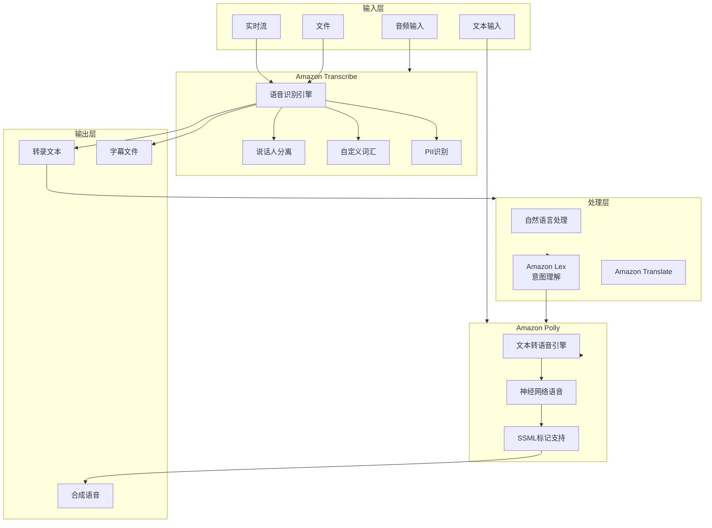
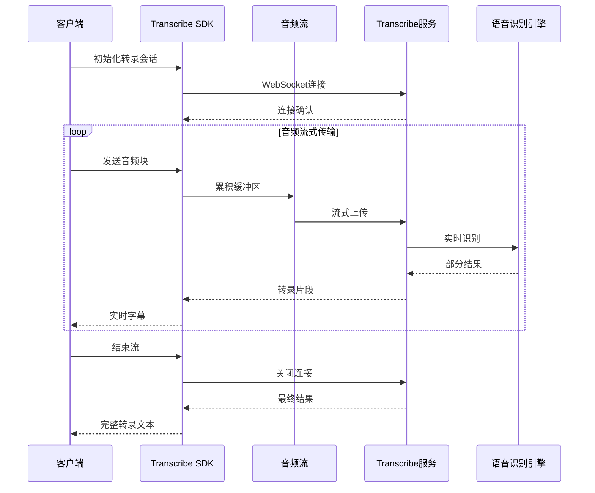
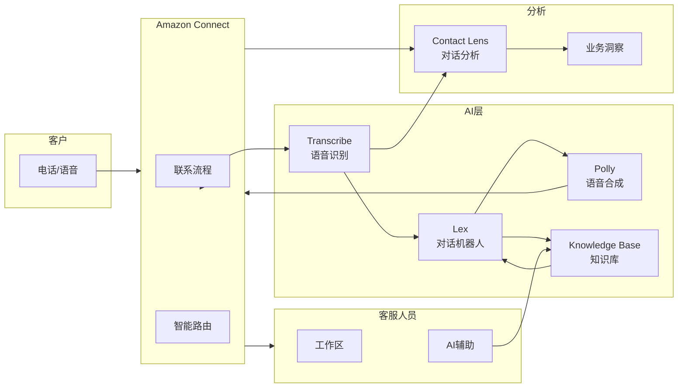

# Amazon Transcribe + Polly (语音 AI) 博客素材收集文档

> 收集时间: 2026-03-01  
> 服务: Amazon Transcribe (Speech-to-Text), Amazon Polly (Text-to-Speech)  
> 来源: AWS官方文档、博客、最佳实践

---

## Agent 1: 初级布道者 (Junior Advocate)

### 服务概述

**Amazon Transcribe** 是 AWS 提供的自动语音识别 (ASR) 服务，可将语音转换为文本，支持实时流式和批量文件转录，具备说话人分离、自定义词汇、内容审核等功能。

**Amazon Polly** 是 AWS 提供的文本转语音 (TTS) 服务，可将文本转换为逼真的语音，支持多种语言、多种声音（包括神经网络语音），并可通过 SSML 标记实现精细的语音控制。

**生活化类比**:  
> Transcribe 就像是您的"AI 速记员" —— 就像专业会议记录员可以实时将对话转为文字，Transcribe 可以自动转录电话录音、会议记录、客服对话等，支持多种语言和口音。
> 
> Polly 则像是您的"AI 播音员" —— 就像电台主持人可以将新闻稿朗读出来，Polly 可以将任何文本变成自然流畅的语音，支持新闻播报、导航系统、有声读物等场景。

## 架构图

### 语音 AI 系统架构



### 实时语音转录流程



### 智能客服语音架构



---

### 语音 AI 服务对比

| 服务 | 方向 | 适用场景 | 延迟 |
|------|------|----------|------|
| **Amazon Transcribe** | 语音 → 文本 | 会议记录、客服质检、字幕生成 | 实时/批量 |
| **Amazon Polly** | 文本 → 语音 | 语音导航、有声读物、IVR | < 1秒 |
| **Amazon Lex** | 对话理解 | 聊天机器人、语音助手 | 实时 |
| **Amazon Connect** | 呼叫中心 | 客服中心、智能路由 | 实时 |

### Transcribe 核心能力

| 能力 | 说明 | 语言支持 |
|------|------|----------|
| **实时转录** | 流式语音识别 | 100+ 语言 |
| **批量转录** | 音频文件转文字 | 100+ 语言 |
| **说话人分离** | 识别不同说话人 | 主要语言 |
| **自定义词汇** | 行业术语识别优化 | 全部 |
| **PII 识别** | 敏感信息检测和编辑 | 主要语言 |
| **内容审核** | 不当内容标记 | 主要语言 |
| **自动语言识别** | 自动检测语言 | 支持 |

### Polly 核心能力

| 能力 | 说明 | 示例 |
|------|------|------|
| **标准语音** | 传统 TTS | 基础语音合成 |
| **神经网络语音 (NTTS)** | 更自然、更流畅 | 接近真人发音 |
| **News 风格** | 新闻播报风格 | 长文本朗读 |
| **Conversational** | 对话风格 | 自然对话 |
| **SSML 支持** | 精细控制 | 停顿、重音、语速 |
| **Lexicon** | 自定义发音 | 品牌名、专业术语 |
| **Speech Marks** | 时间戳标记 | 口型同步 |

### Quick Start - 最核心CLI命令

```bash
# ==================== Amazon Transcribe ====================

# 1. 批量转录音频文件
aws transcribe start-transcription-job \
    --transcription-job-name "meeting-2024-03-01" \
    --language-code "zh-CN" \
    --media-format "mp3" \
    --media "MediaFileUri=s3://my-bucket/recordings/meeting.mp3" \
    --output-bucket-name "my-transcription-output" \
    --settings '{
        "ShowSpeakerLabels": true,
        "MaxSpeakerLabels": 4,
        "ShowAlternatives": false
    }'

# 2. 查询转录任务状态
aws transcribe get-transcription-job \
    --transcription-job-name "meeting-2024-03-01"

# 3. 列出所有转录任务
aws transcribe list-transcription-jobs \
    --status COMPLETED \
    --max-results 10

# 4. 创建自定义词汇表
aws transcribe create-vocabulary \
    --vocabulary-name "tech-terms" \
    --language-code "zh-CN" \
    --vocabulary-file-uri "s3://my-bucket/vocabularies/tech-terms.txt"

# 5. 实时转录 (使用 HTTP/2 流)
# 需要使用 SDK 实现流式转录

# ==================== Amazon Polly ====================

# 6. 列出可用语音
aws polly describe-voices \
    --language-code "zh-CN" \
    --output json | jq '.Voices[] | {Name, Gender, Id}'

# 7. 文本转语音 (标准语音)
aws polly synthesize-speech \
    --output-format "mp3" \
    --voice-id "Zhiyu" \
    --text "您好，欢迎使用亚马逊 Polly 语音合成服务。" \
    --output-file "greeting.mp3"

# 8. 使用神经网络语音 (NTTS)
aws polly synthesize-speech \
    --output-format "mp3" \
    --voice-id "Zhiyu" \
    --engine "neural" \
    --text "神经网络语音更加自然流畅，接近真人发音。" \
    --output-file "neural-demo.mp3"

# 9. 使用 SSML 精细控制
aws polly synthesize-speech \
    --output-format "mp3" \
    --voice-id "Zhiyu" \
    --engine "neural" \
    --text-type "ssml" \
    --text '<speak>
        <amazon:domain name="news">
            欢迎收听今日新闻。
            <break time="500ms"/>
            <emphasis level="strong">重要提醒：</emphasis>
            明日将有暴雨，请做好防范。
            <prosody rate="slow">请注意安全。</prosody>
        </amazon:domain>
    </speak>' \
    --output-file "news-style.mp3"

# 10. 获取发音词典
aws polly get-lexicon \
    --name "custom-pronunciations"

# 11. 长文本合成 (使用 Synthesis Tasks)
aws polly start-speech-synthesis-task \
    --output-format "mp3" \
    --output-s3-bucket-name "my-polly-output" \
    --output-s3-key-prefix "audiobooks/" \
    --voice-id "Zhiyu" \
    --engine "neural" \
    --text file://long-story.txt
```

### 官方文档入口

- Transcribe: https://docs.aws.amazon.com/transcribe/latest/dg/
- Polly: https://docs.aws.amazon.com/polly/latest/dg/

---

## Agent 2: 高级开发攻擂手 (Senior Developer)

### 重点分析 (Problem-Oriented)

#### 1. 实时流式转录 (WebSocket)

```python
import asyncio
import websockets
import json
import base64
import boto3
from amazon_transcribe.auth import AwsCognitoCredentialProvider
from amazon_transcribe.client import TranscribeStreamingClient
from amazon_transcribe.handlers import TranscriptResultStreamHandler
from amazon_transcribe.model import TranscriptEvent

class MyEventHandler(TranscriptResultStreamHandler):
    """自定义转录结果处理器"""
    
    def __init__(self, transcript_result_stream, callback=None):
        super().__init__(transcript_result_stream)
        self.callback = callback
        self.transcript_buffer = []
    
    async def handle_transcript_event(self, transcript_event: TranscriptEvent):
        """处理转录事件"""
        results = transcript_event.transcript.results
        
        for result in results:
            if not result.alternatives:
                continue
            
            # 获取最可能的转录
            transcript = result.alternatives[0].transcript
            
            # 判断是中间结果还是最终结果
            if result.is_partial:
                # 中间结果（实时显示）
                if self.callback:
                    await self.callback({
                        "type": "partial",
                        "transcript": transcript,
                        "speaker": result.channel_id  # 说话人 ID
                    })
            else:
                # 最终结果
                self.transcript_buffer.append({
                    "transcript": transcript,
                    "speaker": result.channel_id,
                    "start_time": result.start_time,
                    "end_time": result.end_time
                })
                
                if self.callback:
                    await self.callback({
                        "type": "final",
                        "transcript": transcript,
                        "speaker": result.channel_id
                    })

class RealtimeTranscriber:
    """实时转录器"""
    
    def __init__(self, region="us-east-1"):
        self.client = TranscribeStreamingClient(region=region)
    
    async def start_streaming(
        self,
        language_code="zh-CN",
        media_encoding="pcm",
        sample_rate=16000,
        enable_speaker_identification=False,
        max_speakers=2
    ):
        """
        开始实时转录流
        
        Args:
            language_code: 语言代码
            media_encoding: 音频编码 (pcm, ogg-opus, flac)
            sample_rate: 采样率
            enable_speaker_identification: 是否启用说话人分离
            max_speakers: 最大说话人数
        """
        
        # 配置转录参数
        settings = {
            "language_code": language_code,
            "media_encoding": media_encoding,
            "media_sample_rate_hz": sample_rate
        }
        
        if enable_speaker_identification:
            settings["enable_speaker_identification"] = True
            settings["max_speakers"] = max_speakers
        
        # 启动流
        stream = await self.client.start_stream_transcription(**settings)
        
        return stream
    
    async def transcribe_microphone(
        self,
        duration_seconds=60,
        callback=None
    ):
        """从麦克风实时转录"""
        
        import pyaudio
        
        # 音频参数
        format = pyaudio.paInt16
        channels = 1
        rate = 16000
        chunk = 1024
        
        # 初始化 PyAudio
        audio = pyaudio.PyAudio()
        stream = audio.open(
            format=format,
            channels=channels,
            rate=rate,
            input=True,
            frames_per_buffer=chunk
        )
        
        # 启动转录流
        transcribe_stream = await self.start_streaming(
            sample_rate=rate,
            enable_speaker_identification=True
        )
        
        # 创建处理器
        handler = MyEventHandler(
            transcribe_stream.transcript_result_stream,
            callback=callback
        )
        
        # 启动处理任务
        import asyncio
        handler_task = asyncio.create_task(handler.handle_events())
        
        print(f"开始录音，持续 {duration_seconds} 秒...")
        
        try:
            # 读取音频并发送
            for _ in range(0, int(rate / chunk * duration_seconds)):
                data = stream.read(chunk, exception_on_overflow=False)
                await transcribe_stream.input_stream.send_audio_event(
                    audio_chunk=data
                )
        finally:
            # 清理资源
            stream.stop_stream()
            stream.close()
            audio.terminate()
            
            await transcribe_stream.input_stream.end_stream()
            handler_task.cancel()

# 使用示例
async def main():
    transcriber = RealtimeTranscriber()
    
    async def on_transcript(data):
        if data["type"] == "partial":
            print(f"\r[识别中] {data['transcript']}", end="", flush=True)
        else:
            print(f"\n[最终结果] 说话人 {data['speaker']}: {data['transcript']}")
    
    await transcriber.transcribe_microphone(
        duration_seconds=30,
        callback=on_transcript
    )

# asyncio.run(main())
```

#### 2. 批量转录与后处理

```python
import boto3
import json
import time
from typing import List, Dict
from urllib.parse import urlparse

class BatchTranscriptionManager:
    """批量转录管理器"""
    
    def __init__(self):
        self.transcribe = boto3.client('transcribe')
        self.s3 = boto3.client('s3')
    
    def submit_batch_job(
        self,
        job_name: str,
        s3_uri: str,
        language_code: str = "zh-CN",
        vocabulary_name: str = None,
        settings: Dict = None
    ) -> str:
        """
        提交批量转录任务
        
        Args:
            job_name: 任务名称
            s3_uri: 音频文件 S3 路径
            language_code: 语言代码
            vocabulary_name: 自定义词汇表名称
            settings: 其他设置
        """
        
        job_settings = {
            "ShowSpeakerLabels": True,
            "MaxSpeakerLabels": 4,
            "ShowAlternatives": False,
            "ChannelIdentification": False
        }
        
        if settings:
            job_settings.update(settings)
        
        params = {
            "TranscriptionJobName": job_name,
            "LanguageCode": language_code,
            "Media": {"MediaFileUri": s3_uri},
            "OutputBucketName": self._get_bucket_from_uri(s3_uri),
            "Settings": job_settings
        }
        
        if vocabulary_name:
            params["Settings"]["VocabularyName"] = vocabulary_name
        
        response = self.transcribe.start_transcription_job(**params)
        
        return response["TranscriptionJob"]["TranscriptionJobName"]
    
    def wait_for_completion(
        self,
        job_name: str,
        poll_interval: int = 30,
        timeout: int = 3600
    ) -> Dict:
        """等待转录完成"""
        
        start_time = time.time()
        
        while True:
            response = self.transcribe.get_transcription_job(
                TranscriptionJobName=job_name
            )
            
            job = response["TranscriptionJob"]
            status = job["TranscriptionJobStatus"]
            
            print(f"[{time.strftime('%H:%M:%S')}] Job {job_name}: {status}")
            
            if status == "COMPLETED":
                return {
                    "status": "success",
                    "transcript_uri": job["Transcript"]["TranscriptFileUri"],
                    "settings": job.get("Settings", {})
                }
            
            elif status == "FAILED":
                return {
                    "status": "failed",
                    "error": job.get("FailureReason", "Unknown error")
                }
            
            if time.time() - start_time > timeout:
                raise TimeoutError("Transcription job timeout")
            
            time.sleep(poll_interval)
    
    def process_transcript(
        self,
        transcript_uri: str,
        include_pii: bool = False
    ) -> Dict:
        """
        处理转录结果
        
        Args:
            transcript_uri: 转录结果 S3 URI
            include_pii: 是否包含 PII 信息
        """
        
        # 从 S3 下载转录结果
        bucket, key = self._parse_s3_uri(transcript_uri)
        response = self.s3.get_object(Bucket=bucket, Key=key)
        transcript_data = json.loads(response['Body'].read())
        
        # 提取文本
        results = transcript_data.get("results", {})
        transcripts = results.get("transcripts", [])
        full_text = transcripts[0]["transcript"] if transcripts else ""
        
        # 提取说话人信息
        speaker_labels = results.get("speaker_labels", {})
        speakers = speaker_labels.get("segments", [])
        
        # 提取带时间戳的词级信息
        items = results.get("items", [])
        
        processed_result = {
            "full_text": full_text,
            "speakers": self._process_speakers(speakers),
            "word_timings": self._process_word_timings(items),
            "language_code": transcript_data.get("results", {}).get("language_code", "unknown")
        }
        
        # 如果启用了 PII 识别，处理 PII 信息
        if "pii_entities" in results:
            processed_result["pii_entities"] = results["pii_entities"]
        
        return processed_result
    
    def _process_speakers(self, segments: List) -> List[Dict]:
        """处理说话人信息"""
        processed = []
        
        for segment in segments:
            processed.append({
                "speaker": segment.get("speaker_label"),
                "start_time": float(segment.get("start_time", 0)),
                "end_time": float(segment.get("end_time", 0)),
                "text": " ".join([item.get("alternatives", [{}])[0].get("content", "") 
                                  for item in segment.get("items", [])])
            })
        
        return processed
    
    def _process_word_timings(self, items: List) -> List[Dict]:
        """处理词级时间戳"""
        return [
            {
                "word": item.get("alternatives", [{}])[0].get("content", ""),
                "start_time": float(item.get("start_time", 0)) if "start_time" in item else None,
                "end_time": float(item.get("end_time", 0)) if "end_time" in item else None,
                "type": item.get("type")  # pronunciation 或 punctuation
            }
            for item in items
        ]
    
    def _get_bucket_from_uri(self, uri: str) -> str:
        """从 S3 URI 提取 bucket"""
        parsed = urlparse(uri)
        return parsed.netloc
    
    def _parse_s3_uri(self, uri: str) -> tuple:
        """解析 S3 URI"""
        parsed = urlparse(uri)
        return parsed.netloc, parsed.path.lstrip("/")

# 使用示例
transcription_mgr = BatchTranscriptionManager()

# 提交批量任务
job_name = "customer-service-call-001"
s3_audio_uri = "s3://my-recordings/calls/call-001.mp3"

job_id = transcription_mgr.submit_batch_job(
    job_name=job_name,
    s3_uri=s3_audio_uri,
    language_code="zh-CN",
    vocabulary_name="customer-service-terms",
    settings={
        "ShowSpeakerLabels": True,
        "MaxSpeakerLabels": 2  # 客服和客户
    }
)

# 等待完成
result = transcription_mgr.wait_for_completion(job_id)

# 处理结果
if result["status"] == "success":
    transcript = transcription_mgr.process_transcript(result["transcript_uri"])
    print(f"转录文本: {transcript['full_text']}")
    for speaker in transcript["speakers"]:
        print(f"{speaker['speaker']} ({speaker['start_time']:.1f}s - {speaker['end_time']:.1f}s): {speaker['text']}")
```

#### 3. Polly 高级语音合成

```python
import boto3
import io
from typing import List, Dict
from pydub import AudioSegment

class PollySpeechSynthesizer:
    """Polly 语音合成器"""
    
    # 语音风格映射
    VOICE_STYLES = {
        "news": "新闻播报风格，适合长文本",
        "conversational": "对话风格，自然亲切",
        "customer_service": "客服风格，专业礼貌"
    }
    
    def __init__(self, region="us-east-1"):
        self.polly = boto3.client('polly', region_name=region)
    
    def synthesize(
        self,
        text: str,
        voice_id: str = "Zhiyu",
        engine: str = "neural",
        output_format: str = "mp3",
        style: str = None,
        prosody: Dict = None
    ) -> bytes:
        """
        合成语音
        
        Args:
            text: 要合成的文本
            voice_id: 语音 ID
            engine: 引擎类型 (standard 或 neural)
            output_format: 输出格式 (mp3, ogg_vorbis, pcm)
            style: 风格 (news, conversational)
            prosody: 韵律控制 {"rate": "slow", "pitch": "+10%", "volume": "loud"}
        """
        
        # 构建 SSML（如果需要高级控制）
        if style or prosody:
            text = self._build_ssml(text, style, prosody)
            text_type = "ssml"
        else:
            text_type = "text"
        
        response = self.polly.synthesize_speech(
            Text=text,
            TextType=text_type,
            VoiceId=voice_id,
            Engine=engine,
            OutputFormat=output_format
        )
        
        return response["AudioStream"].read()
    
    def _build_ssml(self, text: str, style: str = None, prosody: Dict = None) -> str:
        """构建 SSML"""
        
        ssml = f"<speak>"
        
        # 添加风格
        if style == "news":
            ssml += f'<amazon:domain name="news">{text}</amazon:domain>'
        elif style == "conversational":
            ssml += f'<amazon:domain name="conversational">{text}</amazon:domain>'
        else:
            ssml += text
        
        # 添加韵律控制
        if prosody:
            rate = prosody.get("rate", "medium")
            pitch = prosody.get("pitch", "default")
            volume = prosody.get("volume", "default")
            
            ssml = f'<prosody rate="{rate}" pitch="{pitch}" volume="{volume}">{ssml}</prosody>'
        
        ssml += "</speak>"
        
        return ssml
    
    def synthesize_long_text(
        self,
        text: str,
        voice_id: str = "Zhiyu",
        max_chunk_size: int = 1500
    ) -> bytes:
        """
        合成长文本（自动分块）
        
        Polly 有单次文本长度限制，长文本需要分段合成后合并
        """
        
        # 分块
        chunks = self._split_text(text, max_chunk_size)
        
        audio_segments = []
        
        for i, chunk in enumerate(chunks):
            print(f"Synthesizing chunk {i+1}/{len(chunks)}...")
            
            audio_data = self.synthesize(
                text=chunk,
                voice_id=voice_id,
                output_format="mp3"
            )
            
            # 转换为 AudioSegment 以便合并
            audio_segment = AudioSegment.from_mp3(io.BytesIO(audio_data))
            audio_segments.append(audio_segment)
        
        # 合并音频
        combined = AudioSegment.empty()
        for segment in audio_segments:
            combined += segment
        
        # 导出为 bytes
        output = io.BytesIO()
        combined.export(output, format="mp3")
        
        return output.getvalue()
    
    def _split_text(self, text: str, max_size: int) -> List[str]:
        """智能分块文本"""
        
        chunks = []
        current_chunk = ""
        
        # 按句子分割
        sentences = text.replace("。", "。|").replace("！", "！|").replace("？", "？|").split("|")
        
        for sentence in sentences:
            if len(current_chunk) + len(sentence) < max_size:
                current_chunk += sentence
            else:
                if current_chunk:
                    chunks.append(current_chunk)
                current_chunk = sentence
        
        if current_chunk:
            chunks.append(current_chunk)
        
        return chunks
    
    def create_audiobook(
        self,
        chapters: List[Dict],
        output_path: str
    ):
        """
        创建有声书
        
        chapters = [
            {"title": "第一章", "content": "文本内容..."},
            {"title": "第二章", "content": "文本内容..."}
        ]
        """
        
        full_audio = AudioSegment.empty()
        
        for i, chapter in enumerate(chapters):
            # 章节标题
            title_audio = self.synthesize(
                text=f"第 {i+1} 章，{chapter['title']}",
                voice_id="Zhiyu",
                prosody={"rate": "slow", "volume": "loud"}
            )
            
            # 添加停顿
            title_segment = AudioSegment.from_mp3(io.BytesIO(title_audio))
            silence = AudioSegment.silent(duration=2000)  # 2秒停顿
            
            # 章节内容
            content_audio = self.synthesize_long_text(chapter["content"])
            content_segment = AudioSegment.from_mp3(io.BytesIO(content_audio))
            
            # 合并
            full_audio += title_segment + silence + content_segment
            
            # 章节间停顿
            full_audio += AudioSegment.silent(duration=3000)
        
        # 保存
        full_audio.export(output_path, format="mp3")
        print(f"Audiobook saved to: {output_path}")

# 使用示例
synthesizer = PollySpeechSynthesizer()

# 基础合成
audio = synthesizer.synthesize("您好，这是测试语音。")

# 高级 SSML 合成
audio = synthesizer.synthesize(
    text="重要通知：系统将于今晚进行维护。",
    style="news",
    prosody={"rate": "slow", "pitch": "+5%", "volume": "loud"}
)

# 创建有声书
chapters = [
    {"title": "引言", "content": "这是有声书的引言部分..."},
    {"title": "开始", "content": "故事从这里开始..."}
]
synthesizer.create_audiobook(chapters, "my_audiobook.mp3")
```

### 服务配额

| 服务 | 配额项 | 默认值 | 可调 |
|------|--------|--------|------|
| **Transcribe** | 并发流式连接 | 100 | ✅ |
| **Transcribe** | 批量作业/并发 | 100 | ✅ |
| **Transcribe** | 自定义词汇表 | 100 | ✅ |
| **Polly** | 并发合成请求 | 100 | ✅ |
| **Polly** | 长文本任务/并发 | 100 | ✅ |
| **Polly** | 单次文本长度 | 3000 字符 | ❌ |
| **Polly** | Lexicon 数量 | 100 | ✅ |

---

## Agent 3: 自动化部署专家 (DevOps Engineer)

### IaC Delivery - Terraform 模板

```hcl
# ============================================
# Transcribe + Polly 基础设施
# ============================================

terraform {
  required_providers {
    aws = {
      source  = "hashicorp/aws"
      version = "~> 5.0"
    }
  }
}

provider "aws" {
  region = var.aws_region
}

# ============================================
# 1. S3 Bucket - 音频文件存储
# ============================================
resource "aws_s3_bucket" "audio" {
  bucket = "${var.project_name}-audio-${data.aws_caller_identity.current.account_id}"
}

resource "aws_s3_bucket_lifecycle_configuration" "audio" {
  bucket = aws_s3_bucket.audio.id

  rule {
    id     = "archive-old-recordings"
    status = "Enabled"

    transition {
      days          = 30
      storage_class = "STANDARD_IA"
    }

    transition {
      days          = 90
      storage_class = "GLACIER"
    }
  }
}

# 目录结构
resource "aws_s3_object" "recordings" {
  bucket = aws_s3_bucket.audio.id
  key    = "recordings/"
  source = "/dev/null"
}

resource "aws_s3_object" "transcripts" {
  bucket = aws_s3_bucket.audio.id
  key    = "transcripts/"
  source = "/dev/null"
}

resource "aws_s3_object" "polly_output" {
  bucket = aws_s3_bucket.audio.id
  key    = "polly-output/"
  source = "/dev/null"
}

# ============================================
# 2. IAM Role - 语音服务
# ============================================
resource "aws_iam_role" "voice_service" {
  name = "${var.project_name}-voice-service-role"

  assume_role_policy = jsonencode({
    Version = "2012-10-17"
    Statement = [{
      Action = "sts:AssumeRole"
      Effect = "Allow"
      Principal = {
        Service = "lambda.amazonaws.com"
      }
    }]
  })
}

resource "aws_iam_role_policy" "voice_s3" {
  name = "s3-access"
  role = aws_iam_role.voice_service.id

  policy = jsonencode({
    Version = "2012-10-17"
    Statement = [
      {
        Effect = "Allow"
        Action = [
          "s3:GetObject",
          "s3:PutObject",
          "s3:ListBucket"
        ]
        Resource = [
          aws_s3_bucket.audio.arn,
          "${aws_s3_bucket.audio.arn}/*"
        ]
      }
    ]
  })
}

resource "aws_iam_role_policy" "voice_ai" {
  name = "voice-ai-access"
  role = aws_iam_role.voice_service.id

  policy = jsonencode({
    Version = "2012-10-17"
    Statement = [
      {
        Effect = "Allow"
        Action = [
          "transcribe:StartTranscriptionJob",
          "transcribe:GetTranscriptionJob",
          "transcribe:ListTranscriptionJobs"
        ]
        Resource = "*"
      },
      {
        Effect = "Allow"
        Action = [
          "polly:SynthesizeSpeech",
          "polly:StartSpeechSynthesisTask"
        ]
        Resource = "*"
      }
    ]
  })
}

# ============================================
# 3. Lambda - 转录服务
# ============================================
resource "aws_lambda_function" "transcription" {
  function_name = "${var.project_name}-transcription"
  role          = aws_iam_role.voice_service.arn
  handler       = "transcription.handler"
  runtime       = "python3.12"
  timeout       = 60
  memory_size   = 256

  filename         = data.archive_file.lambda_transcribe.output_path
  source_code_hash = data.archive_file.lambda_transcribe.output_base64sha256

  environment {
    variables = {
      OUTPUT_BUCKET = aws_s3_bucket.audio.id
    }
  }
}

# S3 触发器 - 新音频文件自动转录
resource "aws_s3_bucket_notification" "audio_upload" {
  bucket = aws_s3_bucket.audio.id

  lambda_function {
    lambda_function_arn = aws_lambda_function.transcription.arn
    events              = ["s3:ObjectCreated:*"]
    filter_prefix       = "recordings/"
    filter_suffix       = ".mp3"
  }
}

resource "aws_lambda_permission" "s3_invoke" {
  statement_id  = "AllowS3Invoke"
  action        = "lambda:InvokeFunction"
  function_name = aws_lambda_function.transcription.function_name
  principal     = "s3.amazonaws.com"
  source_arn    = aws_s3_bucket.audio.arn
}

# ============================================
# 4. API Gateway - 语音合成 API
# ============================================
resource "aws_api_gateway_rest_api" "voice" {
  name = "${var.project_name}-voice-api"
}

resource "aws_api_gateway_resource" "synthesize" {
  rest_api_id = aws_api_gateway_rest_api.voice.id
  parent_id   = aws_api_gateway_rest_api.voice.root_resource_id
  path_part   = "synthesize"
}

resource "aws_api_gateway_method" "post_synthesize" {
  rest_api_id   = aws_api_gateway_rest_api.voice.id
  resource_id   = aws_api_gateway_resource.synthesize.id
  http_method   = "POST"
  authorization = "AWS_IAM"
}

resource "aws_api_gateway_integration" "lambda_synthesize" {
  rest_api_id = aws_api_gateway_rest_api.voice.id
  resource_id = aws_api_gateway_resource.synthesize.id
  http_method = aws_api_gateway_method.post_synthesize.http_method

  integration_http_method = "POST"
  type                   = "AWS_PROXY"
  uri                    = aws_lambda_function.polly.invoke_arn
}

# Lambda for Polly
resource "aws_lambda_function" "polly" {
  function_name = "${var.project_name}-polly-synthesis"
  role          = aws_iam_role.voice_service.arn
  handler       = "polly.handler"
  runtime       = "python3.12"
  timeout       = 30
  memory_size   = 256

  filename         = data.archive_file.lambda_polly.output_path
  source_code_hash = data.archive_file.lambda_polly.output_base64sha256

  environment {
    variables = {
      OUTPUT_BUCKET = aws_s3_bucket.audio.id
      DEFAULT_VOICE = "Zhiyu"
    }
  }
}

# ============================================
# 5. CloudWatch 监控
# ============================================
resource "aws_cloudwatch_metric_alarm" "high_transcription_latency" {
  alarm_name          = "${var.project_name}-transcription-latency"
  comparison_operator = "GreaterThanThreshold"
  evaluation_periods  = 3
  metric_name         = "TranscriptionJobDuration"
  namespace           = "AWS/Transcribe"
  period              = 300
  statistic           = "Average"
  threshold           = 300  # 5分钟
  alarm_description   = "转录任务耗时过长"
  alarm_actions       = [aws_sns_topic.alerts.arn]
}

resource "aws_sns_topic" "alerts" {
  name = "${var.project_name}-voice-alerts"
}

# ============================================
# Data Sources
# ============================================
data "aws_caller_identity" "current" {}

data "archive_file" "lambda_transcribe" {
  type        = "zip"
  source_file = "${path.module}/lambda/transcription.py"
  output_path = "${path.module}/transcription.zip"
}

data "archive_file" "lambda_polly" {
  type        = "zip"
  source_file = "${path.module}/lambda/polly.py"
  output_path = "${path.module}/polly.zip"
}

# ============================================
# Variables
# ============================================
variable "project_name" {
  description = "项目名称"
  type        = string
  default     = "voice-ai"
}

variable "aws_region" {
  description = "AWS 区域"
  type        = string
  default     = "us-east-1"
}

# ============================================
# Outputs
# ============================================
output "s3_bucket" {
  description = "音频存储 Bucket"
  value       = aws_s3_bucket.audio.id
}

output "api_endpoint" {
  description = "语音合成 API 端点"
  value       = aws_api_gateway_rest_api.voice.execution_arn
}
```

---

## Agent 4: 首席云架构师 (Cloud Architect)

### Well-Architected Framework 评估

#### 1. 成本优化

| 服务 | 计费方式 | 优化策略 |
|------|----------|----------|
| **Transcribe** | $/音频分钟 | 批量处理非实时任务；使用自定义词汇减少重试 |
| **Polly** | $/百万字符 | 缓存常用语音；使用 Neural 语音仅在必要时 |
| **存储** | S3 标准/IA | 转录后归档原始音频 |

**成本对比**:
```
实时客服质检 (1000 小时/月):
- Transcribe 标准: $0.024/分钟 × 60,000 = $1,440/月
- Transcribe + 自定义词汇优化: 减少 20% 重试 = $1,152/月
```

#### 2. 典型应用场景

**智能客服中心**:
```
客户来电
    │
    ▼
┌───────────────────────┐
│ Amazon Connect        │
│ - 智能路由            │
│ - 通话录音            │
└───────────┬───────────┘
            │
            ▼
┌───────────────────────┐
│ Amazon Transcribe     │
│ - 实时转录            │
│ - 说话人分离          │
│ - PII 编辑            │
└───────────┬───────────┘
            │
            ▼
┌───────────────────────┐
│ Amazon Bedrock / Lex  │
│ - 意图识别            │
│ - 情感分析            │
│ - 自动回复            │
└───────────┬───────────┘
            │
            ▼
┌───────────────────────┐
│ Amazon Polly          │
│ - 语音回复            │
│ - 多语言支持          │
└───────────────────────┘
```

**播客/视频字幕生成**:
```
上传音频/视频
    │
    ▼
┌───────────────────────┐
│ MediaConvert (提取音频)│
└───────────┬───────────┘
            │
            ▼
┌───────────────────────┐
│ Transcribe            │
│ - 批量转录            │
│ - 时间戳标记          │
└───────────┬───────────┘
            │
            ▼
┌───────────────────────┐
│ 生成字幕文件 (SRT/VVT) │
└───────────────────────┘
```

---

## 附录: 参考资源

### 官方文档
- [Transcribe Developer Guide](https://docs.aws.amazon.com/transcribe/latest/dg/)
- [Polly Developer Guide](https://docs.aws.amazon.com/polly/latest/dg/)

### 最佳实践
- [Transcribe Streaming Best Practices](https://docs.aws.amazon.com/transcribe/latest/dg/streaming.html)
- [Polly SSML Reference](https://docs.aws.amazon.com/polly/latest/dg/ssml.html)

---

*文档生成完成 | 基于 AWS 官方文档和最佳实践整理*
