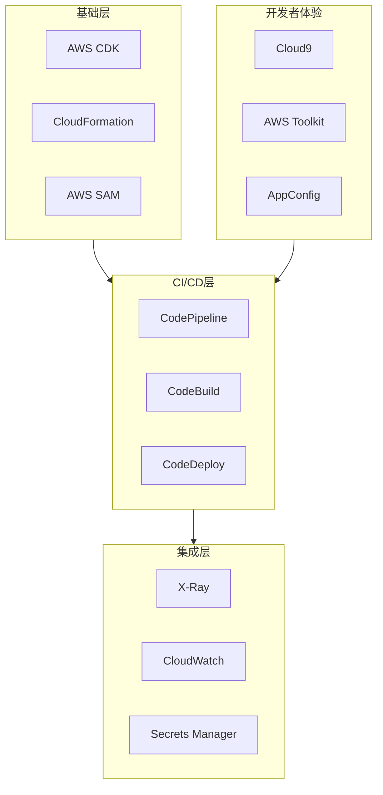

# AWS DevTools Topic

> 成为 AWS DevTools Hero 的完整学习路径

---

## 主题定位

本主题是**AWS DevTools Hero 认证**的核心学习资源，专注于 AWS 原生开发工具链的深度实践。

与现有 `devtools` 主题（通用 DevOps 工具）的区别：

| 维度 | devtools (通用) | aws-devtools (AWS原生) |
|------|----------------|----------------------|
| CI/CD | GitHub Actions, Jenkins | CodePipeline, CodeBuild |
| IaC | Terraform, Pulumi | CDK, CloudFormation |
| 监控 | Prometheus, Grafana | CloudWatch, X-Ray |
| IDE | VS Code, JetBrains | Cloud9, Toolkit for VS Code |

---

## 目录结构

```
aws-devtools/
├── zh/
│   ├── ebooks/           # 电子书
│   │   ├── AWS_DevTools_Mastery.md
│   │   └── CDK_Architecture_Guide.md
│   ├── materials/        # 学习材料
│   │   ├── CDK_Deep_Dive.md
│   │   ├── CodePipeline_Production.md
│   │   ├── CodeBuild_Optimization.md
│   │   └── Cloud9_Development.md
│   └── projects/         # 实战项目
│       ├── 01-cdk-pipeline/
│       ├── 02-codepipeline-monitoring/
│       └── 03-multi-region-cicd/
├── en/                   # 英文材料
└── ja/                   # 日文材料
```

---

## 核心能力模型



---

## Hero 认证路线图

### Phase 1: CB 申请前（Tier 1）

- [ ] 5+ 英文技术材料
- [ ] 3+ 实战项目
- [ ] CodePipeline 深度指南
- [ ] CDK 设计模式

### Phase 2: Hero 提名（Tier 2）

- [ ] L3 Construct 开源发布
- [ ] 社区演讲（JAWS-UG等）
- [ ] 跨主题集成案例
- [ ] 生产事故经验文档

### Phase 3: 持续提升（Tier 3-4）

- [ ] 多语言材料覆盖
- [ ] 企业级最佳实践
- [ ] 自动化工具链

---

## 相关资源

- [DevTools 通用主题](../devtools/) - Git, Docker, K8s 等通用工具
- [Serverless 主题](../serverless/) - Lambda, Fargate 部署
- [Monitoring 主题](../monitoring/) - CloudWatch, X-Ray 可观测性

---

*Part of AWS DevTools Hero Learning Path*
