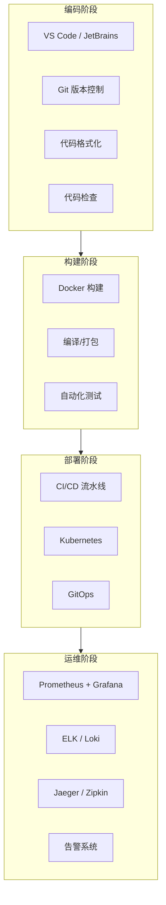
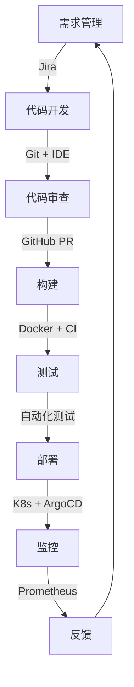

# 开发工具技术资源

> 现代软件开发生命周期工具链全面指南  
> 从代码编写到生产部署的完整工具生态

---

## 🎯 主题介绍

本主题全面讲解现代软件开发中使用的各类工具，帮助开发者构建高效的开发工作流：

- **代码编辑器与 IDE** - VS Code、JetBrains 系列、Vim/Neovim
- **版本控制系统** - Git、GitHub/GitLab/Bitbucket
- **CI/CD 工具** - GitHub Actions、GitLab CI、Jenkins、ArgoCD
- **容器与编排** - Docker、Kubernetes、Helm
- **监控与可观测性** - Prometheus、Grafana、ELK Stack、Jaeger
- **测试工具** - 单元测试、集成测试、E2E 测试框架
- **代码质量与安全** - SonarQube、Snyk、Trivy
- **协作与文档** - Jira、Confluence、Notion

---

## 🏗️ 工具链架构概览



### DevOps 工具链地图



---

## 📚 多语言资源

| 语言 | 目录 | 状态 | 规模 |
|------|------|------|------|
| 🇨🇳 中文 | [./zh/](./zh/) | ✅ 可用 | 完整文档 |
| 🇺🇸 English | [./en/](./en/) | 📝 计划中 | 核心文档 |
| 🇯🇵 日本語 | [./ja/](./ja/) | 📝 计划中 | 核心文档 |

---

## 📖 内容清单

### 电子书 (ebooks/)

| 文档 | 说明 |
|------|------|
| `README.md` | 导航索引 |
| `DevTools_Whitepaper.md` | 技术白皮书 (12章) |
| `DevTools_Quick_Reference.md` | 速查手册 |
| `DevTools_Learning_Roadmap.md` | 16周学习路线图 |

### 技术文档 (materials/)

| 文档 | 内容 |
|------|------|
| `docker_master_guide.md` | Docker 完全指南 |
| `kubernetes_cheatsheet.md` | Kubernetes 速查 |
| `git_advanced_workflows.md` | Git 高级工作流 |
| `cicd_best_practices.md` | CI/CD 最佳实践 |

---

## 💻 实践项目

| 项目 | 难度 | 技术栈 | 目录 |
|------|------|--------|------|
| CI/CD 流水线搭建 | ⭐ 入门 | GitHub Actions + Docker | [./projects/01-ci-cd-pipeline/](./projects/01-ci-cd-pipeline/) |
| DevOps 自动化平台 | ⭐⭐ 进阶 | Terraform + Ansible + Jenkins | [./projects/02-devops-automation/](./projects/02-devops-automation/) |
| 微服务可观测平台 | ⭐⭐⭐ 高级 | K8s + Prometheus + Grafana + Jaeger | [./projects/03-microservices-platform/](./projects/03-microservices-platform/) |

---

## 🚀 快速开始

### 中文用户

```bash
cd zh/ebooks/
cat README.md
```

### 学习路径

1. **新手**: 白皮书第1-3章 → 项目1
2. **进阶**: 白皮书第4-8章 → 项目2
3. **专家**: 全部白皮书 → 项目3

---

## 📊 资源统计

| 指标 | 数量 |
|------|------|
| **电子书** | 4本 |
| **技术文档** | 4篇 |
| **实践项目** | 3个 |
| **架构图** | 20+ |
| **代码示例** | 50+ |

---

## 🔗 相关主题

- [Serverless](../serverless/) - 无服务器计算
- [Storage-Database](../storage-database/) - 数据存储
- [AWS AI/ML](../aws-ai/) - 人工智能

---

**开始构建你的开发工具链！** 🚀
