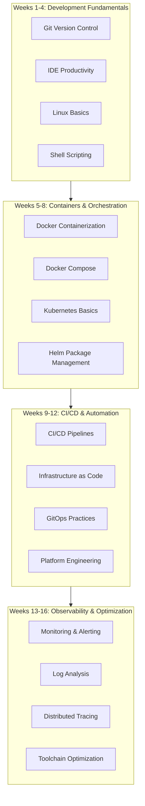
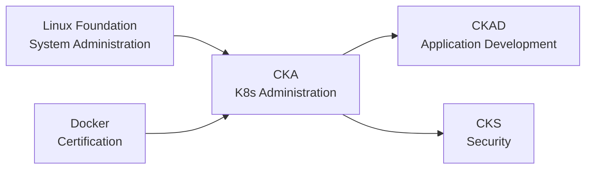

# DevTools 16-Week Learning Roadmap

> A complete learning path from beginner to DevOps expert

---

## 🗺️ Learning Roadmap Overview

---

## 📅 Detailed Learning Plan

### Week 1: Git Fundamentals

**Learning Objectives**: Master core version control concepts

| Day | Topic | Hands-on Task |
|-----|-------|---------------|
| Day 1 | Git Installation & Configuration | Configure Git environment |
| Day 2 | Basic Operations (add, commit, push) | Create your first repository |
| Day 3 | Branch Management | Branching exercises |
| Day 4 | Merging & Conflict Resolution | Simulate team collaboration |
| Day 5 | Undoing & Reverting | Various recovery scenarios |
| Day 6 | GitHub Workflow | Fork + PR |
| Day 7 | Weekly Review | Complete Git quiz |

---

### Week 2: IDE Productivity

**Learning Objectives**: Improve coding efficiency

| Day | Topic | Hands-on Task |
|-----|-------|---------------|
| Day 1 | VS Code Basics | Installation & configuration |
| Day 2 | Shortcuts & Tips | Efficiency exercises |
| Day 3 | Extension Ecosystem | Install essential extensions |
| Day 4 | Debugging Features | Breakpoint debugging practice |
| Day 5 | Integrated Terminal | Terminal workflows |
| Day 6 | AI-Assisted Programming | Copilot usage |
| Day 7 | Weekly Review | Configuration optimization |

---

### Week 3: Linux Fundamentals

**Learning Objectives**: Master Linux command line

| Day | Topic | Hands-on Task |
|-----|-------|---------------|
| Day 1 | Filesystem Operations | File management |
| Day 2 | Text Processing Tools | grep, awk, sed |
| Day 3 | Process Management | ps, top, kill |
| Day 4 | Network Tools | curl, netstat |
| Day 5 | Permission Management | chmod, chown |
| Day 6 | Package Management | apt/yum usage |
| Day 7 | Weekly Review | Comprehensive exercise |

---

### Week 4: Shell Scripting

**Learning Objectives**: Automate daily tasks

| Day | Topic | Hands-on Task |
|-----|-------|---------------|
| Day 1 | Shell Basic Syntax | Variables, conditions |
| Day 2 | Loops & Control | for, while |
| Day 3 | Functions & Parameters | Function encapsulation |
| Day 4 | Text Processing | Log analysis scripts |
| Day 5 | Error Handling | Robustness handling |
| Day 6 | Utility Scripts | Development helper scripts |
| Day 7 | Weekly Review | Project 1 preparation |

---

### Week 5: Docker Fundamentals

**Learning Objectives**: Containerize applications

| Day | Topic | Hands-on Task |
|-----|-------|---------------|
| Day 1 | Docker Concepts | Installation & configuration |
| Day 2 | Image Management | pull, build, push |
| Day 3 | Container Lifecycle | run, stop, rm |
| Day 4 | Dockerfile Writing | Build application images |
| Day 5 | Data Persistence | volumes |
| Day 6 | Network Configuration | Container communication |
| Day 7 | Weekly Review | Multi-container application |

---

### Week 6: Advanced Docker

**Learning Objectives**: Optimize container practices

| Day | Topic | Hands-on Task |
|-----|-------|---------------|
| Day 1 | Multi-stage Builds | Optimize image size |
| Day 2 | Security Best Practices | Non-root users |
| Day 3 | Docker Compose | Multi-service orchestration |
| Day 4 | Development Environment | Dev Containers |
| Day 5 | Image Scanning | Trivy integration |
| Day 6 | Private Registry | Harbor deployment |
| Day 7 | Weekly Review | Project optimization |

---

### Week 7: Kubernetes Fundamentals

**Learning Objectives**: K8s core concepts

| Day | Topic | Hands-on Task |
|-----|-------|---------------|
| Day 1 | K8s Architecture | Install minikube |
| Day 2 | Pod Management | Create Pods |
| Day 3 | Deployment | Application deployment |
| Day 4 | Service | Service exposure |
| Day 5 | ConfigMap/Secret | Configuration management |
| Day 6 | Storage | PV/PVC |
| Day 7 | Weekly Review | Application deployment |

---

### Week 8: Advanced Kubernetes

**Learning Objectives**: Production-grade K8s

| Day | Topic | Hands-on Task |
|-----|-------|---------------|
| Day 1 | Ingress | Routing configuration |
| Day 2 | HPA | Auto-scaling |
| Day 3 | RBAC | Access control |
| Day 4 | Helm | Package management |
| Day 5 | Monitoring Basics | Metrics Server |
| Day 6 | Troubleshooting | Debugging techniques |
| Day 7 | Weekly Review | Project 2 preparation |

---

### Week 9: CI/CD Fundamentals

**Learning Objectives**: Automated pipelines

| Day | Topic | Hands-on Task |
|-----|-------|---------------|
| Day 1 | CI/CD Concepts | Understand the workflow |
| Day 2 | GitHub Actions | Basic workflows |
| Day 3 | Build Stage | Automated builds |
| Day 4 | Test Stage | Test integration |
| Day 5 | Deploy Stage | Automated deployment |
| Day 6 | Artifact Management | Artifact storage |
| Day 7 | Weekly Review | Complete pipeline |

---

### Week 10: Advanced CI/CD

**Learning Objectives**: Complex pipelines

| Day | Topic | Hands-on Task |
|-----|-------|---------------|
| Day 1 | Workflow Optimization | Caching strategies |
| Day 2 | Matrix Builds | Multi-environment testing |
| Day 3 | Security Scanning | SAST/SCA |
| Day 4 | Multi-Environment Deployment | dev/staging/prod |
| Day 5 | Approval Workflows | Manual approval |
| Day 6 | Rollback Strategies | Fast rollback |
| Day 7 | Weekly Review | Production pipeline |

---

### Week 11: Infrastructure as Code

**Learning Objectives**: IaC practices

| Day | Topic | Hands-on Task |
|-----|-------|---------------|
| Day 1 | Terraform Basics | HCL syntax |
| Day 2 | Provider Configuration | AWS provider |
| Day 3 | Resource Management | Resource definitions |
| Day 4 | State Management | Remote state |
| Day 5 | Module Development | Modularization |
| Day 6 | Workspaces | Multi-environment management |
| Day 7 | Weekly Review | Infrastructure deployment |

---

### Week 12: GitOps

**Learning Objectives**: GitOps workflows

| Day | Topic | Hands-on Task |
|-----|-------|---------------|
| Day 1 | GitOps Concepts | Understand principles |
| Day 2 | ArgoCD Installation | Deploy ArgoCD |
| Day 3 | Application Configuration | Git sync |
| Day 4 | Auto-Sync | Automated deployment |
| Day 5 | Multi-Cluster Management | Cross-cluster deployment |
| Day 6 | Secret Management | Sealed Secrets |
| Day 7 | Weekly Review | Project 3 preparation |

---

### Week 13: Monitoring Fundamentals

**Learning Objectives**: Introduction to observability

| Day | Topic | Hands-on Task |
|-----|-------|---------------|
| Day 1 | Monitoring Concepts | Golden signals |
| Day 2 | Prometheus | Deployment & configuration |
| Day 3 | Metrics Collection | Exporters |
| Day 4 | Grafana | Dashboards |
| Day 5 | Alerting Configuration | Alertmanager |
| Day 6 | Custom Metrics | Application instrumentation |
| Day 7 | Weekly Review | Monitoring system |

---

### Week 14: Logging & Tracing

**Learning Objectives**: Comprehensive observability

| Day | Topic | Hands-on Task |
|-----|-------|---------------|
| Day 1 | Log Aggregation | Loki/EFK |
| Day 2 | Log Query | LogQL |
| Day 3 | Distributed Tracing | Jaeger |
| Day 4 | Application Instrumentation | OpenTelemetry |
| Day 5 | Correlation Analysis | Logs-Metrics-Traces |
| Day 6 | Alert Optimization | Noise reduction strategies |
| Day 7 | Weekly Review | Observability platform |

---

### Week 15: Platform Engineering

**Learning Objectives**: Internal Developer Platform

| Day | Topic | Hands-on Task |
|-----|-------|---------------|
| Day 1 | Platform Engineering Concepts | IDP design |
| Day 2 | Backstage | Portal setup |
| Day 3 | Self-Service | Template development |
| Day 4 | Cost Optimization | FinOps |
| Day 5 | DORA Metrics | Measurement framework |
| Day 6 | Team Adoption | Platform rollout |
| Day 7 | Weekly Review | Platform demo |

---

### Week 16: Capstone Project

**Learning Objectives**: End-to-end DevOps platform

| Day | Topic | Hands-on Task |
|-----|-------|---------------|
| Day 1 | Architecture Design | Platform planning |
| Day 2 | Infrastructure | Terraform deployment |
| Day 3 | Application Deployment | K8s + GitOps |
| Day 4 | Pipelines | Complete CI/CD |
| Day 5 | Observability | Monitoring system |
| Day 6 | Security Integration | DevSecOps |
| Day 7 | Project Summary | Results presentation |

---

## 📚 Learning Resources

### Official Documentation

- [Git Official Documentation](https://git-scm.com/doc)
- [Docker Documentation](https://docs.docker.com/)
- [Kubernetes Documentation](https://kubernetes.io/docs/)
- [Terraform Documentation](https://developer.hashicorp.com/terraform/docs)
- [GitHub Actions](https://docs.github.com/en/actions)

### Recommended Books

- *Pro Git*
- *Docker Deep Dive*
- *Kubernetes in Action*
- *Terraform: Up & Running*
- *The DevOps Handbook*

### Online Courses

- KodeKloud DevOps Learning Path
- Coursera - DevOps on AWS
- Udemy - Docker & Kubernetes
- Pluralsight - CI/CD Path

---

## ✅ Weekly Checklist

### Daily Tasks
- [ ] Read daily topic documentation
- [ ] Complete hands-on exercises
- [ ] Take learning notes
- [ ] Resolve encountered issues

### Weekly Tasks
- [ ] Complete weekly review
- [ ] Pass knowledge quiz
- [ ] Update learning progress
- [ ] Plan next week's learning

### Phase Tasks
- [ ] Complete milestone project
- [ ] Participate in community discussions
- [ ] Share learning insights
- [ ] Update skills inventory

---

## 🎯 Certification Path

**Recommended Certifications**:

| Certification | Difficulty | Prep Time | Prerequisites |
|---------------|------------|-----------|---------------|
| Docker Certified Associate | ⭐⭐ | 4-6 weeks | Docker fundamentals |
| CKA | ⭐⭐⭐ | 6-8 weeks | K8s fundamentals |
| CKAD | ⭐⭐⭐ | 4-6 weeks | CKA recommended |
| Terraform Associate | ⭐⭐ | 4 weeks | Terraform fundamentals |
| AWS DevOps Engineer | ⭐⭐⭐ | 8-12 weeks | AWS fundamentals |

---

Happy Learning! 🎉
