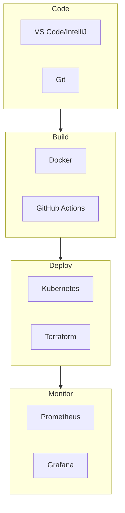

# Modern Development Tools Technical Whitepaper

> Master the Complete Software Development Lifecycle Toolchain

---

## Table of Contents

> **Learning Guide**: This whitepaper follows an "Individual Efficiency → Team Collaboration → Production Delivery" progression. Chapters 1-3 establish personal foundations, chapters 4-9 cover engineering practices, and chapters 10-12 elevate to platform thinking.

1. **[Development Tools Overview](#1-development-tools-overview)**  
   *Establish tool thinking: Understand the modern development toolchain landscape, selection principles, and learning paths—avoiding the "tool collector" trap.*

2. **[Code Editors and IDEs](#2-code-editors-and-ides)**  
   *Improve coding efficiency: Deep dive into VS Code/IntelliJ/Neovim configuration, shortcuts, and plugin ecosystems to build personalized productive environments.*

3. **[Version Control Systems](#3-version-control-systems)**  
   *Foundation of collaborative development: Master Git advanced operations, branching strategies, and code review workflows for efficient team collaboration.*

4. **[Containerization Technology](#4-containerization-technology)** 🐳  
   *Standardize delivery: Learn Docker core concepts, image optimization, and multi-stage builds to establish foundations for cloud-native applications.*

5. **[CI/CD and Automation](#5-cicd-and-automation)**  
   *Accelerate delivery pipelines: Master GitHub Actions, CodePipeline, and CodeBuild to build automated pipelines from code to deployment.*

6. **[Kubernetes and Orchestration](#6-kubernetes-and-orchestration)**  
   *Scale container management: Learn EKS cluster management, Helm packaging, and service meshes to address production-grade container orchestration challenges.*

7. **[Monitoring and Observability](#7-monitoring-and-observability)**  
   *Gain system insights: Integrate Prometheus, Grafana, and CloudWatch to build full-stack monitoring for applications and infrastructure.*

8. **[Test Automation](#8-test-automation)**  
   *Ensure code quality: Learn unit testing, integration testing, and E2E testing strategies; master pytest, Jest, and Selenium.*

9. **[Code Quality and Security](#9-code-quality-and-security)**  
   *Shift-left security practices: Integrate SonarQube, CodeGuru, and SAST/DAST tools to detect and fix issues early in development.*

10. **[GitOps and Infrastructure as Code](#10-gitops-and-infrastructure-as-code)**  
    *Declarative operations: Learn Terraform, CDK, and ArgoCD to manage infrastructure and application deployments using Git workflows.*

11. **[Development Environment Management](#11-development-environment-management)**  
    *Environment consistency: Master Docker Compose, devcontainers, Nix, and LocalStack to solve "works on my machine" problems.*

12. **[Toolchain Integration and Optimization](#12-toolchain-integration-and-optimization)**  
    *Build platform capabilities: Integrate all previous tools to design efficient developer portals, internal platforms, and metrics systems to improve team productivity.*

---

## 1. Development Tools Overview

### 1.1 Modern DevOps Toolchain

---

*Version: v1.0*  
*Last Updated: 2026-03-02*
