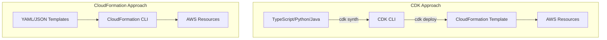

# AWS CDK Deep Dive

> Mastering Infrastructure as Code with AWS Cloud Development Kit

---

## Table of Contents

1. [CDK Fundamentals](#1-cdk-fundamentals)
2. [Construct Levels Deep Dive](#2-construct-levels-deep-dive)
3. [Advanced Patterns](#3-advanced-patterns)
4. [CDK Pipelines](#4-cdk-pipelines)
5. [Testing Strategies](#5-testing-strategies)
6. [Production Best Practices](#6-production-best-practices)

---

## 1. CDK Fundamentals

### 1.1 What is CDK

AWS CDK (Cloud Development Kit) is an open-source software development framework to define cloud infrastructure in code and provision it through AWS CloudFormation.

**Key Benefits**:
- Type safety and IDE support
- Code reuse through constructs
- Infrastructure testing capabilities
- Higher-level abstractions over CloudFormation

### 1.2 CDK vs CloudFormation



| Aspect | CloudFormation | CDK |
|--------|---------------|-----|
| Language | YAML/JSON | TypeScript, Python, Java, .NET, Go |
| Abstraction | Low-level (resources) | High-level (constructs) |
| Testing | Limited | Unit + Integration tests |
| IDE Support | Basic syntax | Full IntelliSense |
| Code Reuse | Copy-paste | Libraries and constructs |

### 1.3 CDK Project Structure

```
my-cdk-project/
├── bin/
│   └── my-cdk-project.ts          # Entry point
├── lib/
│   ├── my-cdk-project-stack.ts    # Stack definition
│   └── constructs/                # Custom constructs
│       ├── vpc-construct.ts
│       └── database-construct.ts
├── test/
│   └── my-cdk-project.test.ts     # Unit tests
├── cdk.json                       # CDK configuration
├── package.json
└── tsconfig.json
```

### 1.4 Basic CDK App

```typescript
// bin/my-cdk-project.ts
#!/usr/bin/env node
import * as cdk from 'aws-cdk-lib';
import { MyStack } from '../lib/my-stack';

const app = new cdk.App();

new MyStack(app, 'MyStack', {
  env: {
    account: process.env.CDK_DEFAULT_ACCOUNT,
    region: process.env.CDK_DEFAULT_REGION,
  },
  tags: {
    Project: 'MyProject',
    Environment: 'Production',
  },
});
```

```typescript
// lib/my-stack.ts
import * as cdk from 'aws-cdk-lib';
import * as ec2 from 'aws-cdk-lib/aws-ec2';
import * as s3 from 'aws-cdk-lib/aws-s3';
import { Construct } from 'constructs';

export class MyStack extends cdk.Stack {
  constructor(scope: Construct, id: string, props?: cdk.StackProps) {
    super(scope, id, props);

    // Create VPC
    const vpc = new ec2.Vpc(this, 'MyVpc', {
      maxAzs: 3,
      natGateways: 1,
    });

    // Create S3 bucket
    const bucket = new s3.Bucket(this, 'MyBucket', {
      versioned: true,
      encryption: s3.BucketEncryption.S3_MANAGED,
      removalPolicy: cdk.RemovalPolicy.RETAIN,
    });

    // Output values
    new cdk.CfnOutput(this, 'BucketName', {
      value: bucket.bucketName,
      description: 'Name of the S3 bucket',
    });
  }
}
```

---

## 2. Construct Levels Deep Dive

### 2.1 L1 Constructs (CFN Resources)

L1 constructs are direct representations of CloudFormation resources.

```typescript
import * as cdk from 'aws-cdk-lib';
import * as ec2 from 'aws-cdk-lib/aws-ec2';

// L1 Construct - Direct CloudFormation resource
const cfnBucket = new s3.CfnBucket(this, 'MyL1Bucket', {
  bucketName: 'my-l1-bucket',
  versioningConfiguration: {
    status: 'Enabled',
  },
  bucketEncryption: {
    serverSideEncryptionConfiguration: [{
      serverSideEncryptionByDefault: {
        sseAlgorithm: 'AES256',
      },
    }],
  },
});

// When to use L1:
// - When L2 doesn't support a specific feature
// - When you need escape hatches
// - When working with bleeding-edge services
```

### 2.2 L2 Constructs (AWS Constructs)

L2 constructs provide higher-level abstractions with sane defaults.

```typescript
import * as s3 from 'aws-cdk-lib/aws-s3';
import * as lambda from 'aws-cdk-lib/aws-lambda';

// L2 Construct - Higher-level abstraction
const bucket = new s3.Bucket(this, 'MyL2Bucket', {
  versioned: true,
  encryption: s3.BucketEncryption.S3_MANAGED,
  blockPublicAccess: s3.BlockPublicAccess.BLOCK_ALL,
  removalPolicy: cdk.RemovalPolicy.RETAIN,
  // Intelligent defaults applied automatically
});

const fn = new lambda.Function(this, 'MyFunction', {
  runtime: lambda.Runtime.NODEJS_18_X,
  handler: 'index.handler',
  code: lambda.Code.fromAsset('lambda'),
  memorySize: 512,
  timeout: cdk.Duration.seconds(30),
  environment: {
    BUCKET_NAME: bucket.bucketName,
  },
});

bucket.grantReadWrite(fn); // Automatic IAM policy generation
```

### 2.3 L3 Constructs (Patterns)

L3 constructs are high-level patterns combining multiple resources.

```typescript
import * as patterns from 'aws-cdk-lib/aws-lambda-event-sources';
import { ApplicationLoadBalancedFargateService } from 'aws-cdk-lib/aws-ecs-patterns';

// L3 Pattern - Complete application architecture
const loadBalancedFargateService = new ApplicationLoadBalancedFargateService(
  this, 
  'MyFargateService', 
  {
    taskImageOptions: {
      image: ecs.ContainerImage.fromRegistry('amazon/amazon-ecs-sample'),
      containerPort: 8080,
    },
    publicLoadBalancer: true,
    desiredCount: 2,
    cpu: 512,
    memoryLimitMiB: 1024,
  }
);

// This L3 construct creates:
// - ECS Cluster
// - Fargate Task Definition
// - Application Load Balancer
// - Security Groups
// - Auto Scaling policies
// - CloudWatch Alarms
```

### 2.4 When to Use Each Level

| Level | Use Case | Example |
|-------|----------|---------|
| **L1** | Escape hatches, new features | Custom S3 bucket configurations |
| **L2** | Standard resources | VPC, Lambda, DynamoDB |
| **L3** | Complete patterns | ALB + Fargate, API Gateway + Lambda |

### 2.5 Building Custom L3 Constructs

```typescript
// constructs/fargate-spot-construct.ts
import * as cdk from 'aws-cdk-lib';
import * as ecs from 'aws-cdk-lib/aws-ecs';
import * as ec2 from 'aws-cdk-lib/aws-ec2';
import { Construct } from 'constructs';

export interface FargateSpotConstructProps {
  vpc: ec2.IVpc;
  containerImage: ecs.ContainerImage;
  containerPort: number;
  desiredCount?: number;
  spotWeight?: number; // Percentage of Spot tasks (0-100)
}

export class FargateSpotConstruct extends Construct {
  public readonly cluster: ecs.Cluster;
  public readonly service: ecs.FargateService;
  public readonly taskDefinition: ecs.FargateTaskDefinition;

  constructor(scope: Construct, id: string, props: FargateSpotConstructProps) {
    super(scope, id);

    const { vpc, containerImage, containerPort, desiredCount = 2, spotWeight = 50 } = props;

    // Create cluster with container insights
    this.cluster = new ecs.Cluster(this, 'Cluster', {
      vpc,
      containerInsights: true,
    });

    // Task definition with Spot capacity provider strategy
    this.taskDefinition = new ecs.FargateTaskDefinition(this, 'TaskDef', {
      cpu: 512,
      memoryLimitMiB: 1024,
    });

    this.taskDefinition.addContainer('AppContainer', {
      image: containerImage,
      portMappings: [{ containerPort }],
      logging: ecs.LogDrivers.awsLogs({ streamPrefix: 'app' }),
    });

    // Fargate Service with Spot
    this.service = new ecs.FargateService(this, 'Service', {
      cluster: this.cluster,
      taskDefinition: this.taskDefinition,
      desiredCount,
      capacityProviderStrategies: [
        {
          capacityProvider: 'FARGATE_SPOT',
          weight: spotWeight,
          base: 0,
        },
        {
          capacityProvider: 'FARGATE',
          weight: 100 - spotWeight,
          base: 1, // At least 1 on-demand task
        },
      ],
    });

    // Auto-scaling based on CPU
    const scaling = this.service.autoScaleTaskCount({
      minCapacity: 1,
      maxCapacity: 10,
    });

    scaling.scaleOnCpuUtilization('CpuScaling', {
      targetUtilizationPercent: 70,
      scaleInCooldown: cdk.Duration.seconds(60),
      scaleOutCooldown: cdk.Duration.seconds(60),
    });
  }
}
```

Usage:
```typescript
// Use the custom construct
const spotService = new FargateSpotConstruct(this, 'SpotService', {
  vpc,
  containerImage: ecs.ContainerImage.fromAsset('./app'),
  containerPort: 8080,
  desiredCount: 4,
  spotWeight: 75, // 75% Spot, 25% On-Demand
});
```

---

## 3. Advanced Patterns

### 3.1 Aspects

Aspects allow you to apply changes across all constructs in your app.

```typescript
import * as cdk from 'aws-cdk-lib';
import { IConstruct } from 'constructs';

// Custom Aspect: Enforce tags on all resources
export class EnforceTagsAspect implements cdk.IAspect {
  constructor(private requiredTags: string[]) {}

  visit(node: IConstruct): void {
    if (cdk.TagManager.isTaggable(node)) {
      const tags = cdk.Tags.of(node);
      
      for (const tagKey of this.requiredTags) {
        if (!tags.tagValues()[tagKey]) {
          cdk.Annotations.of(node).addError(
            `Missing required tag: ${tagKey}`
          );
        }
      }
    }
  }
}

// Custom Aspect: Enforce S3 encryption
export class S3EncryptionAspect implements cdk.IAspect {
  visit(node: IConstruct): void {
    if (node instanceof s3.CfnBucket) {
      if (!node.bucketEncryption) {
        node.bucketEncryption = {
          serverSideEncryptionConfiguration: [{
            serverSideEncryptionByDefault: {
              sseAlgorithm: 'AES256',
            },
          }],
        };
      }
    }
  }
}

// Apply aspects to the app
const app = new cdk.App();

// Apply enforcement aspects
cdk.Aspects.of(app).add(new EnforceTagsAspect(['Project', 'Environment', 'Owner']));
cdk.Aspects.of(app).add(new S3EncryptionAspect());
```

### 3.2 Escape Hatches

When L2/L3 constructs don't support a feature, use escape hatches.

```typescript
// Method 1: Override L2 properties via L1
const bucket = new s3.Bucket(this, 'MyBucket', {
  removalPolicy: cdk.RemovalPolicy.RETAIN,
});

// Access underlying L1 construct
const cfnBucket = bucket.node.defaultChild as s3.CfnBucket;

// Add custom CloudFormation property
cfnBucket.addPropertyOverride('ObjectLockEnabled', true);
cfnBucket.addPropertyOverride('ObjectLockConfiguration', {
  ObjectLockEnabled: 'Enabled',
  Rule: {
    DefaultRetention: {
      Mode: 'COMPLIANCE',
      Days: 365,
    },
  },
});

// Method 2: Raw overrides
const fn = new lambda.Function(this, 'Function', {
  runtime: lambda.Runtime.PYTHON_3_9,
  handler: 'index.handler',
  code: lambda.Code.fromAsset('lambda'),
});

const cfnFunction = fn.node.defaultChild as lambda.CfnFunction;
cfnFunction.addOverride('Properties.EphemeralStorage', {
  Size: 2048, // 2GB ephemeral storage
});
```

### 3.3 Context and Configuration

```typescript
// cdk.json
{
  "app": "npx ts-node bin/app.ts",
  "context": {
    "@aws-cdk/core:targetAccount": "123456789012",
    "@aws-cdk/core:targetRegion": "us-east-1",
    "environment": "production",
    "databaseInstanceType": "r5.xlarge"
  }
}

// Access context in code
const env = this.node.tryGetContext('environment') || 'development';
const dbInstanceType = this.node.tryGetContext('databaseInstanceType') || 't3.micro';

// Feature flags
const removalPolicyFlag = this.node.tryGetContext('@aws-cdk/core:removalPolicy') || 'retain';
```

---

## 4. CDK Pipelines

### 4.1 Basic Pipeline Structure

```typescript
import * as pipelines from 'aws-cdk-lib/pipelines';
import * as codebuild from 'aws-cdk-lib/aws-codebuild';

export class PipelineStack extends cdk.Stack {
  constructor(scope: Construct, id: string, props?: cdk.StackProps) {
    super(scope, id, props);

    // Source from GitHub
    const source = pipelines.CodePipelineSource.gitHub('owner/repo', 'main', {
      authentication: cdk.SecretValue.secretsManager('github-token'),
    });

    // Synth step
    const synth = new pipelines.CodeBuildStep('Synth', {
      input: source,
      installCommands: ['npm ci'],
      commands: [
        'npm run build',
        'npm run test',
        'npx cdk synth',
      ],
      primaryOutputDirectory: 'cdk.out',
    });

    // Create pipeline
    const pipeline = new pipelines.CodePipeline(this, 'Pipeline', {
      pipelineName: 'MyAppPipeline',
      synth: synth,
      selfMutation: true,
    });

    // Add deployment stage
    pipeline.addStage(new MyApplicationStage(this, 'Prod', {
      env: { account: '123456789012', region: 'us-east-1' },
    }));
  }
}
```

### 4.2 Multi-Environment Pipeline

```typescript
// stages/application-stage.ts
export class ApplicationStage extends cdk.Stage {
  constructor(scope: Construct, id: string, props?: cdk.StageProps) {
    super(scope, id, props);

    new ApplicationStack(this, 'AppStack');
    new DatabaseStack(this, 'DbStack');
  }
}

// Pipeline with multiple environments
const pipeline = new pipelines.CodePipeline(this, 'Pipeline', {
  pipelineName: 'MultiEnvPipeline',
  synth: synth,
});

// Development (auto-deploy)
pipeline.addStage(new ApplicationStage(this, 'Dev', {
  env: { account: '123456789012', region: 'us-east-1' },
}));

// Staging (with manual approval)
pipeline.addStage(new ApplicationStage(this, 'Staging', {
  env: { account: '123456789012', region: 'us-east-1' },
}), {
  pre: [
    new pipelines.ManualApprovalStep('PromoteToStaging'),
  ],
});

// Production (with smoke tests)
pipeline.addStage(new ApplicationStage(this, 'Prod', {
  env: { account: '123456789012', region: 'us-east-1' },
}), {
  pre: [
    new pipelines.ManualApprovalStep('PromoteToProd'),
  ],
  post: [
    new pipelines.CodeBuildStep('SmokeTests', {
      commands: [
        'curl -f https://api.example.com/health || exit 1',
      ],
    }),
  ],
});
```

---

## 5. Testing Strategies

### 5.1 Unit Testing Constructs

```typescript
// test/my-construct.test.ts
import { Template, Match } from 'aws-cdk-lib/assertions';
import * as cdk from 'aws-cdk-lib';
import { MyConstruct } from '../lib/my-construct';

test('S3 bucket is created with encryption', () => {
  const app = new cdk.App();
  const stack = new cdk.Stack(app, 'TestStack');
  
  new MyConstruct(stack, 'MyConstruct');
  
  const template = Template.fromStack(stack);
  
  template.hasResourceProperties('AWS::S3::Bucket', {
    BucketEncryption: {
      ServerSideEncryptionConfiguration: [
        {
          ServerSideEncryptionByDefault: {
            SSEAlgorithm: 'AES256',
          },
        },
      ],
    },
  });
});

test('Lambda function has correct runtime', () => {
  const app = new cdk.App();
  const stack = new cdk.Stack(app, 'TestStack');
  
  new MyConstruct(stack, 'MyConstruct');
  
  const template = Template.fromStack(stack);
  
  template.hasResourceProperties('AWS::Lambda::Function', {
    Runtime: 'nodejs18.x',
  });
});
```

### 5.2 Snapshot Testing

```typescript
test('Stack matches snapshot', () => {
  const app = new cdk.App();
  const stack = new MyStack(app, 'TestStack');
  
  const template = Template.fromStack(stack);
  
  expect(template.toJSON()).toMatchSnapshot();
});
```

---

## 6. Production Best Practices

### 6.1 Security Best Practices

```typescript
// Enable IAM access analyzer
import * as accessanalyzer from 'aws-cdk-lib/aws-accessanalyzer';

new accessanalyzer.CfnAnalyzer(this, 'Analyzer', {
  analyzerName: 'MyAnalyzer',
  type: 'ACCOUNT',
});

// Enable GuardDuty
import * as guardduty from 'aws-cdk-lib/aws-guardduty';

new guardduty.CfnDetector(this, 'GuardDuty', {
  enable: true,
});
```

### 6.2 Cost Optimization

```typescript
// Enable Cost Allocation Tags
cdk.Tags.of(app).add('Project', 'MyProject');
cdk.Tags.of(app).add('Environment', 'Production');
cdk.Tags.of(app).add('CostCenter', 'Engineering');

// Auto-delete unused resources in dev
if (environment === 'development') {
  bucket.applyRemovalPolicy(cdk.RemovalPolicy.DESTROY);
  bucket.autoDeleteObjects = true;
}
```

---

## CLI Commands Quick Reference

```bash
# Initialize project
cdk init app --language typescript

# Synthesize CloudFormation template
cdk synth

# Deploy
cdk deploy

# Deploy with outputs
cdk deploy --outputs-file outputs.json

# Diff
cdk diff

# Bootstrap (required for first deployment)
cdk bootstrap aws://ACCOUNT/REGION

# Hotswap (fast dev deployment)
cdk deploy --hotswap

# Destroy
cdk destroy
```

---

*Part of AWS DevTools Hero Learning Path*
