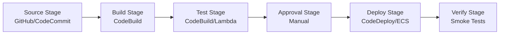

# AWS CodePipeline & CodeBuild Production Guide

> Building Reliable CI/CD Pipelines at Scale

---

## Table of Contents

1. [Pipeline Architecture](#1-pipeline-architecture)
2. [CodePipeline v2 Features](#2-codepipeline-v2-features)
3. [CodeBuild Optimization](#3-codebuild-optimization)
4. [Deployment Strategies](#4-deployment-strategies)
5. [Reliability Patterns](#5-reliability-patterns)
6. [Troubleshooting](#6-troubleshooting)

---

## 1. Pipeline Architecture

### 1.1 Standard Pipeline Structure



### 1.2 Multi-Region Pipeline

```yaml
# pipeline.yaml
AWSTemplateFormatVersion: '2010-09-09'
Resources:
  Pipeline:
    Type: AWS::CodePipeline::Pipeline
    Properties:
      Name: MultiRegionPipeline
      RoleArn: !GetAtt PipelineRole.Arn
      ArtifactStore:
        Type: S3
        Location: !Ref ArtifactBucket
      Stages:
        - Name: Source
          Actions:
            - Name: GitHubSource
              ActionTypeId:
                Category: Source
                Owner: ThirdParty
                Provider: GitHub
                Version: 1
              Configuration:
                Owner: myorg
                Repo: myapp
                Branch: main
                OAuthToken: '{{resolve:secretsmanager:github-token:SecretString:token}}'
              OutputArtifacts:
                - Name: SourceCode
                
        - Name: Build
          Actions:
            - Name: CodeBuild
              ActionTypeId:
                Category: Build
                Owner: AWS
                Provider: CodeBuild
                Version: 1
              Configuration:
                ProjectName: !Ref BuildProject
              InputArtifacts:
                - Name: SourceCode
              OutputArtifacts:
                - Name: BuildArtifact
                
        - Name: DeployToPrimary
          Actions:
            - Name: DeployToUSEast1
              ActionTypeId:
                Category: Deploy
                Owner: AWS
                Provider: ECS
                Version: 1
              Region: us-east-1
              Configuration:
                ClusterName: production
                ServiceName: app-service
                FileName: imagedefinitions.json
              InputArtifacts:
                - Name: BuildArtifact
                
        - Name: DeployToSecondary
          Actions:
            - Name: DeployToEUWest1
              ActionTypeId:
                Category: Deploy
                Owner: AWS
                Provider: ECS
                Version: 1
              Region: eu-west-1
              Configuration:
                ClusterName: production
                ServiceName: app-service
                FileName: imagedefinitions.json
              InputArtifacts:
                - Name: BuildArtifact
```

---

## 2. CodePipeline v2 Features

### 2.1 Variables and Expressions

```yaml
# Using variables in CodePipeline v2
Resources:
  Pipeline:
    Type: AWS::CodePipeline::Pipeline
    Properties:
      PipelineType: V2  # Enable V2 features
      Variables:
        - Name: Environment
          DefaultValue: staging
        - Name: SkipTests
          DefaultValue: 'false'
      
      Stages:
        - Name: Source
          Actions:
            - Name: Source
              ActionTypeId:
                Category: Source
                Owner: AWS
                Provider: CodeStarSourceConnection
                Version: 1
              OutputVariables:
                - CommitId
                - CommitMessage
                - BranchName
                
        - Name: Build
          Actions:
            - Name: Build
              ActionTypeId:
                Category: Build
                Owner: AWS
                Provider: CodeBuild
                Version: 1
              Configuration:
                ProjectName: !Ref BuildProject
                # Pass variables to CodeBuild
                EnvironmentVariables: !Sub |
                  [
                    {"name": "COMMIT_ID", "value": "#{Source.CommitId}", "type": "PLAINTEXT"},
                    {"name": "ENVIRONMENT", "value": "#{variables.Environment}", "type": "PLAINTEXT"}
                  ]
```

### 2.2 Conditional Execution

```yaml
# Conditional stages based on branch
Resources:
  Pipeline:
    Type: AWS::CodePipeline::Pipeline
    Properties:
      PipelineType: V2
      
      Stages:
        - Name: Build
          Actions:
            - Name: BuildAndTest
              ActionTypeId:
                Category: Build
                Owner: AWS
                Provider: CodeBuild
                Version: 1
              Configuration:
                ProjectName: !Ref BuildProject
                
        - Name: ProductionDeploy
          # Only run on main branch
          Conditions:
            - RuleName: IsMainBranch
              Result: "{eq: [\"#{Source.BranchName}\", \"main\"]}"
          Actions:
            - Name: Deploy
              ActionTypeId:
                Category: Deploy
                Owner: AWS
                Provider: CodeDeploy
                Version: 1
```

### 2.3 Parallel Actions

```yaml
# Parallel testing
Stages:
  - Name: Test
    Actions:
      - Name: UnitTests
        RunOrder: 1
        ActionTypeId:
          Category: Build
          Owner: AWS
          Provider: CodeBuild
          Version: 1
        Configuration:
          ProjectName: !Ref UnitTestProject
          
      - Name: IntegrationTests
        RunOrder: 1  # Same run order = parallel
        ActionTypeId:
          Category: Build
          Owner: AWS
          Provider: CodeBuild
          Version: 1
        Configuration:
          ProjectName: !Ref IntegrationTestProject
          
      - Name: SecurityScan
        RunOrder: 1
        ActionTypeId:
          Category: Build
          Owner: AWS
          Provider: CodeBuild
          Version: 1
        Configuration:
          ProjectName: !Ref SecurityScanProject
```

---

## 3. CodeBuild Optimization

### 3.1 Buildspec.yml Best Practices

```yaml
# buildspec.yml - Production optimized
version: 0.2

env:
  variables:
    AWS_DEFAULT_REGION: us-east-1
    NODE_ENV: production
  secrets-manager:
    NPM_TOKEN: prod/npm:token
    DB_PASSWORD: prod/database:password
  exported-variables:
    - BUILD_VERSION
    - COMMIT_SHA

phases:
  install:
    runtime-versions:
      nodejs: 18
      python: 3.11
    commands:
      - echo "Installing dependencies..."
      - npm ci --include=dev
      
  pre_build:
    commands:
      - echo "Running pre-build checks..."
      - COMMIT_SHA=$(echo $CODEBUILD_RESOLVED_SOURCE_VERSION | cut -c 1-7)
      - BUILD_VERSION=$(date +%Y%m%d)-$COMMIT_SHA
      - echo "Build version: $BUILD_VERSION"
      
      # Security scanning
      - npm audit --audit-level=moderate || true
      
      # Lint and type checking
      - npm run lint
      - npm run type-check
      
  build:
    commands:
      - echo "Building application..."
      - npm run build
      
      # Run tests with coverage
      - npm run test:ci -- --coverage --coverageReporters=text-summary
      
      # Build Docker image
      - docker build -t $ECR_REPOSITORY:$BUILD_VERSION .
      - docker tag $ECR_REPOSITORY:$BUILD_VERSION $ECR_REPOSITORY:latest
      
  post_build:
    commands:
      - echo "Pushing Docker image..."
      - aws ecr get-login-password --region $AWS_DEFAULT_REGION | docker login --username AWS --password-stdin $AWS_ACCOUNT_ID.dkr.ecr.$AWS_DEFAULT_REGION.amazonaws.com
      - docker push $ECR_REPOSITORY:$BUILD_VERSION
      - docker push $ECR_REPOSITORY:latest
      
      # Generate image definitions for ECS
      - printf '[{"name":"app","imageUri":"%s"}]' $ECR_REPOSITORY:$BUILD_VERSION > imagedefinitions.json
      
      # Run integration tests against deployed container
      - docker run -d -p 8080:8080 --name test-container $ECR_REPOSITORY:$BUILD_VERSION
      - sleep 5
      - curl -f http://localhost:8080/health || exit 1
      - docker stop test-container

reports:
  test-reports:
    files:
      - 'test-results.xml'
    file-format: JUNITXML
  coverage-reports:
    files:
      - 'coverage/clover.xml'
    file-format: CLOVERXML

cache:
  paths:
    - 'node_modules/**/*'
    - '/root/.npm/**/*'
    - '/root/.cache/pip/**/*'

artifacts:
  files:
    - imagedefinitions.json
    - appspec.yml
    - scripts/**/*
  discard-paths: no
```

### 3.2 Cache Optimization

```yaml
# Optimized caching strategy
version: 0.2

cache:
  paths:
    # Node modules - biggest time saver
    - 'node_modules/**/*'
    - '/root/.npm/_cacache/**/*'
    
    # Docker layer cache (requires custom setup)
    - '/var/lib/docker/**/*'
    
    # Python packages
    - '/root/.cache/pip/**/*'
    
    # Build tools
    - '.next/cache/**/*'  # Next.js
    - 'dist/cache/**/*'   # General build cache
```

### 3.3 Local Build Support

```bash
# Run CodeBuild locally for debugging
# 1. Install codebuild-local
docker pull amazon/aws-codebuild-local:latest

# 2. Create build script
#!/bin/bash
# local-build.sh

docker run -it \
  -v $(pwd):/src \
  -v /var/run/docker.sock:/var/run/docker.sock \
  -e AWS_ACCESS_KEY_ID=$AWS_ACCESS_KEY_ID \
  -e AWS_SECRET_ACCESS_KEY=$AWS_SECRET_ACCESS_KEY \
  -e AWS_DEFAULT_REGION=us-east-1 \
  amazon/aws-codebuild-local:latest \
  -i aws/codebuild/standard:5.0 \
  -a output \
  -b buildspec.yml
```

---

## 4. Deployment Strategies

### 4.1 Blue/Green Deployment

```typescript
// CDK Blue/Green with CodeDeploy
import * as codedeploy from 'aws-cdk-lib/aws-codedeploy';
import * as ecs from 'aws-cdk-lib/aws-ecs';

const deploymentGroup = new codedeploy.EcsDeploymentGroup(this, 'BlueGreenDG', {
  service: ecsService,
  blueGreenDeploymentConfig: {
    blueTargetGroup,
    greenTargetGroup,
    listener,
  },
  deploymentConfig: codedeploy.EcsDeploymentConfig.ALL_AT_ONCE,
  autoRollback: {
    failedDeployment: true,
    stoppedDeployment: true,
  },
});
```

```yaml
# appspec.yml for ECS Blue/Green
version: 0.0
Resources:
  - TargetService:
      Type: AWS::ECS::Service
      Properties:
        TaskDefinition: <TASK_DEFINITION>
        LoadBalancerInfo:
          ContainerName: app
          ContainerPort: 8080
        PlatformVersion: LATEST

Hooks:
  - BeforeInstall: "LambdaFunctionToRunBeforeInstall"
  - AfterInstall: "LambdaFunctionToRunAfterInstall"
  - AfterAllowTestTraffic: "LambdaFunctionToValidateTestTraffic"
  - BeforeAllowTraffic: "LambdaFunctionToRunBeforeAllowTraffic"
  - AfterAllowTraffic: "LambdaFunctionToRunAfterAllowTraffic"
```

### 4.2 Canary Deployment

```yaml
# Canary deployment configuration
Resources:
  DeploymentGroup:
    Type: AWS::CodeDeploy::DeploymentGroup
    Properties:
      ApplicationName: !Ref Application
      ServiceRoleArn: !GetAtt CodeDeployServiceRole.Arn
      DeploymentConfigName: CodeDeployDefault.ECSCanary10Percent5Minutes
      DeploymentStyle:
        DeploymentType: BLUE_GREEN
        DeploymentOption: WITH_TRAFFIC_CONTROL
      BlueGreenDeploymentConfiguration:
        TerminateBlueInstancesOnDeploymentSuccess:
          Action: TERMINATE
          TerminationWaitTimeInMinutes: 30
        DeploymentReadyOption:
          ActionOnTimeout: CONTINUE_DEPLOYMENT
          WaitTimeInMinutes: 0
```

---

## 5. Reliability Patterns

### 5.1 Idempotent Deployments

```typescript
// Lambda for idempotent deployments
export const handler = async (event: any) => {
  const deploymentId = event.DeploymentId;
  const lifecycleEventHookExecutionId = event.LifecycleEventHookExecutionId;
  
  // Check if already processed
  const existing = await dynamodb.get({
    TableName: process.env.DEPLOYMENT_TABLE!,
    Key: { deploymentId },
  }).promise();
  
  if (existing.Item) {
    console.log('Deployment already processed');
    return {
      statusCode: 200,
      body: JSON.stringify({ alreadyProcessed: true }),
    };
  }
  
  // Mark as processing
  await dynamodb.put({
    TableName: process.env.DEPLOYMENT_TABLE!,
    Item: {
      deploymentId,
      status: 'PROCESSING',
      timestamp: Date.now(),
    },
  }).promise();
  
  try {
    // Run deployment logic
    await runDeployment(event);
    
    // Mark as complete
    await dynamodb.update({
      TableName: process.env.DEPLOYMENT_TABLE!,
      Key: { deploymentId },
      UpdateExpression: 'SET #status = :status',
      ExpressionAttributeNames: { '#status': 'status' },
      ExpressionAttributeValues: { ':status': 'COMPLETED' },
    }).promise();
    
    // Notify CodeDeploy of success
    await codedeploy.putLifecycleEventHookExecutionStatus({
      deploymentId,
      lifecycleEventHookExecutionId,
      status: 'Succeeded',
    }).promise();
    
  } catch (error) {
    // Mark as failed
    await dynamodb.update({
      TableName: process.env.DEPLOYMENT_TABLE!,
      Key: { deploymentId },
      UpdateExpression: 'SET #status = :status, error = :error',
      ExpressionAttributeValues: {
        ':status': 'FAILED',
        ':error': (error as Error).message,
      },
    }).promise();
    
    // Notify CodeDeploy of failure
    await codedeploy.putLifecycleEventHookExecutionStatus({
      deploymentId,
      lifecycleEventHookExecutionId,
      status: 'Failed',
    }).promise();
    
    throw error;
  }
};
```

### 5.2 Automatic Rollback

```yaml
# Automatic rollback triggers
Resources:
  DeploymentGroup:
    Type: AWS::CodeDeploy::DeploymentGroup
    Properties:
      AutoRollbackConfiguration:
        Enabled: true
        Events:
          - DEPLOYMENT_FAILURE
          - ALARM
      AlarmConfiguration:
        Enabled: true
        Alarms:
          - Name: !Ref ErrorRateAlarm
          - Name: !Ref LatencyAlarm
        IgnorePollAlarmFailure: false
```

---

## 6. Troubleshooting

### 6.1 Common Pipeline Failures

| Symptom | Cause | Solution |
|---------|-------|----------|
| Source stage fails | OAuth token expired | Regenerate GitHub token in Secrets Manager |
| Build stage timeout | Insufficient compute | Increase build timeout or use larger instance |
| Deploy stage fails | ECS service not stable | Check task definition, increase health check grace period |
| Rollback triggered | CloudWatch alarm | Check application logs, fix underlying issue |
| Artifact not found | S3 permissions | Verify pipeline role has S3 access |

### 6.2 CloudWatch Alarms for Pipeline Health

```yaml
Resources:
  PipelineFailureAlarm:
    Type: AWS::CloudWatch::Alarm
    Properties:
      AlarmName: PipelineFailure
      MetricName: FailedExecutions
      Namespace: AWS/CodePipeline
      Statistic: Sum
      Period: 300
      EvaluationPeriods: 1
      Threshold: 1
      ComparisonOperator: GreaterThanOrEqualToThreshold
      Dimensions:
        - Name: PipelineName
          Value: !Ref Pipeline
      AlarmActions:
        - !Ref SNSTopic
```

### 6.3 Pipeline Monitoring Dashboard

```typescript
// CDK Dashboard for Pipeline Monitoring
const dashboard = new cloudwatch.Dashboard(this, 'PipelineDashboard', {
  dashboardName: 'CICD-Pipeline-Health',
});

dashboard.addWidgets(
  new cloudwatch.GraphWidget({
    title: 'Pipeline Executions',
    left: [
      new cloudwatch.Metric({
        namespace: 'AWS/CodePipeline',
        metricName: 'SucceededExecutions',
        dimensionsMap: { PipelineName: pipeline.pipelineName },
        statistic: 'Sum',
      }),
      new cloudwatch.Metric({
        namespace: 'AWS/CodePipeline',
        metricName: 'FailedExecutions',
        dimensionsMap: { PipelineName: pipeline.pipelineName },
        statistic: 'Sum',
        color: '#ff0000',
      }),
    ],
  }),
  
  new cloudwatch.GraphWidget({
    title: 'Build Duration',
    left: [
      new cloudwatch.Metric({
        namespace: 'AWS/CodeBuild',
        metricName: 'Duration',
        dimensionsMap: { ProjectName: buildProject.projectName },
        statistic: 'Average',
      }),
    ],
  })
);
```

---

## CLI Commands Quick Reference

```bash
# Pipeline operations
aws codepipeline start-pipeline-execution --name MyPipeline
aws codepipeline get-pipeline-state --name MyPipeline
aws codepipeline retry-stage-execution --name MyPipeline --stage-name Deploy --pipeline-execution-id abc123

# CodeBuild operations
aws codebuild start-build --project-name MyProject
aws codebuild batch-get-builds --ids build-id-1 build-id-2
aws codebuild list-builds-for-project --project-name MyProject

# Get pipeline execution details
aws codepipeline list-pipeline-executions --pipeline-name MyPipeline --max-results 10
aws codepipeline get-pipeline-execution --pipeline-name MyPipeline --pipeline-execution-id abc123
```

---

*Part of AWS DevTools Hero Learning Path*
