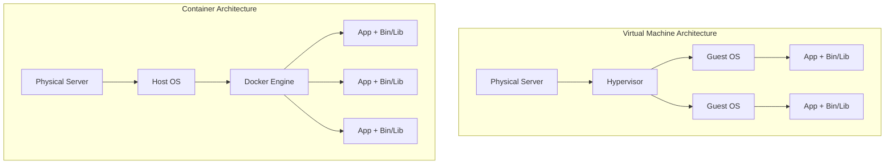

# The Complete Docker Guide

> A Containerization Practice Handbook from Beginner to Expert

---

## Table of Contents

1. [Docker Core Concepts](#core-concepts)
2. [Dockerfile Best Practices](#dockerfile-best-practices)
3. [Docker Compose Deep Dive](#docker-compose-deep-dive)
4. [Container Security](#container-security)
5. [Performance Optimization](#performance-optimization)
6. [Production Deployment](#production-deployment)

---

## Core Concepts

### Containers vs Virtual Machines



### Image Layering Mechanism

```dockerfile
# Each instruction creates a new layer
FROM node:20-alpine          # Layer 1: Base image
WORKDIR /app                 # Layer 2: Working directory
COPY package*.json ./        # Layer 3: Dependency files
RUN npm ci                   # Layer 4: Install dependencies
COPY . .                     # Layer 5: Application code
CMD ["node", "index.js"]     # Layer 6: Startup command
```

**Layer Caching Principles**:
- Layers are immutable
- If a layer changes, all subsequent layers must be rebuilt
- Place infrequently changing content earlier

---

## Dockerfile Best Practices

### Optimizing Build Cache

```dockerfile
# ❌ Bad: Dependencies reinstall on every code change
FROM node:20-alpine
COPY . /app
WORKDIR /app
RUN npm ci

# ✅ Good: Separate dependency installation from application code
FROM node:20-alpine
WORKDIR /app

# 1. Copy dependency files first (leverage cache)
COPY package*.json ./
RUN npm ci --only=production

# 2. Then copy application code
COPY . .
```

### Multi-Stage Builds

```dockerfile
# Build stage
FROM node:20-alpine AS builder
WORKDIR /app
COPY package*.json ./
RUN npm ci
COPY . .
RUN npm run build

# Production stage (smaller image)
FROM node:20-alpine AS production
WORKDIR /app

# Copy only necessary files
COPY --from=builder /app/dist ./dist
COPY --from=builder /app/node_modules ./node_modules
COPY --from=builder /app/package.json ./

# Non-root user
USER node

CMD ["node", "dist/main.js"]
```

**Optimization Results**:
```
Original image: 1.2 GB
After multi-stage build: 180 MB
Reduction: 85%
```

### Security Best Practices

```dockerfile
FROM node:20-alpine

# 1. Use specific version tags, avoid latest
# FROM node:alpine  ❌ Bad
# FROM node:20.10.0-alpine3.18  ✅ Better

# 2. Create non-root user
RUN addgroup -g 1001 -S nodejs && \
    adduser -S nodejs -u 1001

# 3. Use distroless images (ultimate minimal)
# FROM gcr.io/distroless/nodejs20-debian11

WORKDIR /app

# 4. Set correct file permissions
COPY --chown=nodejs:nodejs . .
RUN npm ci --only=production && npm cache clean --force

# 5. Read-only root filesystem
# Use in docker run: --read-only
# With tmpfs: --tmpfs /tmp:noexec,nosuid,size=100m

# 6. Minimize exposed ports
EXPOSE 3000

# 7. Health check
HEALTHCHECK --interval=30s --timeout=3s --start-period=5s --retries=3 \
    CMD node healthcheck.js || exit 1

USER node

CMD ["node", "index.js"]
```

---

## Docker Compose Deep Dive

### Development Environment Configuration

```yaml
version: '3.8'

services:
  app:
    build:
      context: .
      target: development
    ports:
      - "3000:3000"
    volumes:
      # Bind mount source code
      - .:/app
      # Anonymous volume for node_modules
      - /app/node_modules
    environment:
      - NODE_ENV=development
      - DATABASE_URL=postgres://postgres:password@db:5432/app
      - REDIS_URL=redis://redis:6379
      - DEBUG=app:*
    command: npm run dev
    depends_on:
      db:
        condition: service_healthy
      redis:
        condition: service_started

  db:
    image: postgres:16-alpine
    environment:
      POSTGRES_USER: postgres
      POSTGRES_PASSWORD: password
      POSTGRES_DB: app
    volumes:
      - postgres_data:/var/lib/postgresql/data
      - ./init.sql:/docker-entrypoint-initdb.d/init.sql
    ports:
      - "5432:5432"
    healthcheck:
      test: ["CMD-SHELL", "pg_isready -U postgres"]
      interval: 5s
      timeout: 5s
      retries: 5

  redis:
    image: redis:7-alpine
    ports:
      - "6379:6379"
    volumes:
      - redis_data:/data
    command: redis-server --appendonly yes

  # Local mail service
  mailhog:
    image: mailhog/mailhog:latest
    ports:
      - "1025:1025"  # SMTP
      - "8025:8025"  # Web UI

  # Local object storage
  minio:
    image: minio/minio:latest
    ports:
      - "9000:9000"
      - "9001:9001"
    environment:
      MINIO_ROOT_USER: minioadmin
      MINIO_ROOT_PASSWORD: minioadmin
    volumes:
      - minio_data:/data
    command: server /data --console-address ":9001"

volumes:
  postgres_data:
  redis_data:
  minio_data:
```

### Production Environment Configuration

```yaml
version: '3.8'

services:
  app:
    build:
      context: .
      target: production
    image: myapp:${VERSION:-latest}
    deploy:
      replicas: 3
      update_config:
        parallelism: 1
        delay: 10s
        failure_action: rollback
        order: start-first
      rollback_config:
        parallelism: 1
        delay: 10s
      restart_policy:
        condition: on-failure
        delay: 5s
        max_attempts: 3
      resources:
        limits:
          cpus: '1.0'
          memory: 512M
        reservations:
          cpus: '0.5'
          memory: 256M
    environment:
      - NODE_ENV=production
    networks:
      - frontend
      - backend
    logging:
      driver: "json-file"
      options:
        max-size: "10m"
        max-file: "3"

  nginx:
    image: nginx:alpine
    ports:
      - "80:80"
      - "443:443"
    volumes:
      - ./nginx.conf:/etc/nginx/nginx.conf:ro
      - ./ssl:/etc/nginx/ssl:ro
    depends_on:
      - app
    networks:
      - frontend

networks:
  frontend:
    driver: overlay
  backend:
    driver: overlay
    internal: true  # No external access
```

---

## Container Security

### Security Scanning

```bash
#!/bin/bash
# container-security-scan.sh

IMAGE=$1

echo "🔒 Starting security scan: $IMAGE"

# Trivy scan
echo "📋 Trivy vulnerability scan..."
trivy image \
    --severity HIGH,CRITICAL \
    --format table \
    --exit-code 1 \
    $IMAGE

# Docker Scout
echo "📋 Docker Scout analysis..."
docker scout cves $IMAGE

# Snyk scan (optional)
# snyk container test $IMAGE --severity-threshold=high

# Check for sensitive files
echo "📋 Checking for sensitive files..."
docker run --rm --entrypoint sh $IMAGE -c "
    find / -type f \( \
        -name '*.pem' -o \
        -name '*.key' -o \
        -name '.env' -o \
        -name 'id_rsa' \
    \) 2>/dev/null | head -20
"

# CIS Docker benchmark check
echo "📋 CIS benchmark check..."
docker run --rm -v /var/run/docker.sock:/var/run/docker.sock \
    docker/docker-bench-security
```

### Runtime Security

```bash
# Use user namespace
dockerd --userns-remap=default

# Restrict container capabilities
docker run \
    --cap-drop=ALL \
    --cap-add=NET_BIND_SERVICE \
    --security-opt=no-new-privileges:true \
    --read-only \
    --tmpfs /tmp:noexec,nosuid,size=100m \
    myapp

# Resource limits
docker run \
    --memory=512m \
    --memory-swap=512m \
    --cpus=1.0 \
    --pids-limit=100 \
    myapp
```

---

## Performance Optimization

### Image Optimization Techniques

```dockerfile
# 1. Choose minimal base images
FROM node:20-alpine     # 180 MB
# FROM node:20-slim    # 200 MB
# FROM node:20         # 1.1 GB ❌

# 2. Combine RUN instructions to reduce layers
RUN apk add --no-cache \
    python3 \
    make \
    g++ \
    && rm -rf /var/cache/apk/*

# 3. Use .dockerignore
cat > .dockerignore << 'EOF'
node_modules
npm-debug.log
.git
.gitignore
README.md
.env
.env.local
.env.production
.nyc_output
coverage
.nyc_output
.DS_Store
*.log
EOF

# 4. Leverage build cache
# Place infrequently changing content earlier
COPY package*.json ./
RUN npm ci
COPY . .
```

### Runtime Optimization

```bash
# Use host network mode (development)
docker run --network host myapp

# Use volume cache
docker run -v $(pwd):/app:cached myapp

# Adjust log driver
docker run --log-driver json-file \
    --log-opt max-size=10m \
    --log-opt max-file=3 \
    myapp

# CPU affinity
docker run --cpuset-cpus="0-3" myapp
```

---

## Production Deployment

### Swarm Deployment

```bash
# Initialize Swarm
docker swarm init --advertise-addr <IP>

# Deploy stack
docker stack deploy -c docker-compose.prod.yml myapp

# View services
docker service ls
docker service ps myapp_app
docker service logs myapp_app

# Scale
docker service scale myapp_app=5

# Rolling update
docker service update --image myapp:v2.0 myapp_app
```

### Health Check Practices

```dockerfile
# Dockerfile
HEALTHCHECK --interval=30s --timeout=3s --start-period=10s --retries=3 \
    CMD curl -f http://localhost:3000/health || exit 1
```

```javascript
// healthcheck.js - Node.js health check
const http = require('http');

const healthCheck = async () => {
  const checks = await Promise.all([
    checkDatabase(),
    checkRedis(),
    checkExternalAPI()
  ]);
  
  const allHealthy = checks.every(c => c.healthy);
  
  return {
    status: allHealthy ? 'healthy' : 'unhealthy',
    checks: checks,
    timestamp: new Date().toISOString()
  };
};

// Kubernetes probes
const k8sProbes = {
  liveness: (req, res) => {
    // Is process alive
    res.status(200).json({ status: 'alive' });
  },
  
  readiness: async (req, res) => {
    // Is ready to receive traffic
    const ready = await checkDependencies();
    res.status(ready ? 200 : 503).json({ ready });
  },
  
  startup: async (req, res) => {
    // Has application started
    const started = await checkApplicationStarted();
    res.status(started ? 200 : 503).json({ started });
  }
};
```

---

## Summary

Key points for mastering Docker:

1. **Understand image layering**: Optimize build cache
2. **Multi-stage builds**: Streamline production images
3. **Security first**: Non-root user, least privilege
4. **Development/Production parity**: Docker Compose separate configurations
5. **Observability**: Health checks, log management
6. **Continuous optimization**: Image size, build speed, runtime performance

Keep practicing to become a containerization expert!
