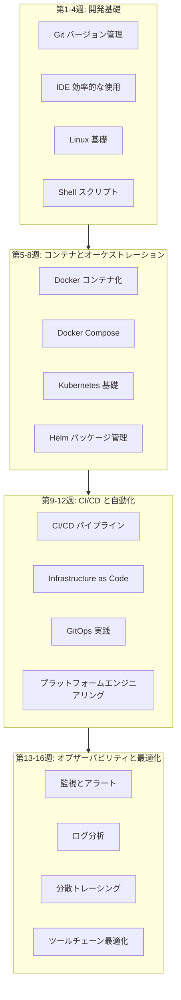
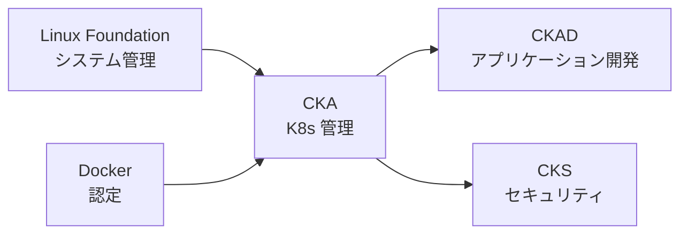

# 開発ツール 16週間学習ロードマップ

> ゼロから DevOps エキスパートへの完全な学習パス

---

## 🗺️ 学習ロードマップ概要

---

## 📅 詳細な学習計画

### 第1週: Git 基礎

**学習目標**: バージョン管理の核心概念を習得する

| 日数 | テーマ | 実践タスク |
|------|--------|------------|
| 第1日 | Git インストールと設定 | Git 環境の設定 |
| 第2日 | 基本操作 (add, commit, push) | 最初のリポジトリを作成 |
| 第3日 | ブランチ管理 | ブランチ練習 |
| 第4日 | マージとコンフリクト解決 | チーム協業のシミュレーション |
| 第5日 | 取り消しとロールバック | 各種復旧シナリオ |
| 第6日 | GitHub ワークフロー | Fork + PR |
| 第7日 | 週間復習 | Git クイズを完了 |

---

### 第2週: IDE の効率的な使用

**学習目標**: コーディング効率を向上させる

| 日数 | テーマ | 実践タスク |
|------|--------|------------|
| 第1日 | VS Code 基礎 | インストールと設定 |
| 第2日 | ショートカットとテクニック | 効率練習 |
| 第3日 | 拡張エコシステム | 必須拡張機能のインストール |
| 第4日 | デバッグ機能 | ブレークポイントデバッグ練習 |
| 第5日 | 統合ターミナル | ターミナルワークフロー |
| 第6日 | AI 支援プログラミング | Copilot の使用 |
| 第7日 | 週間復習 | 設定の最適化 |

---

### 第3週: Linux 基礎

**学習目標**: Linux コマンドラインを習得する

| 日数 | テーマ | 実践タスク |
|------|--------|------------|
| 第1日 | ファイルシステム操作 | ファイル管理 |
| 第2日 | テキスト処理ツール | grep, awk, sed |
| 第3日 | プロセス管理 | ps, top, kill |
| 第4日 | ネットワークツール | curl, netstat |
| 第5日 | 権限管理 | chmod, chown |
| 第6日 | パッケージ管理 | apt/yum の使用 |
| 第7日 | 週間復習 | 総合練習 |

---

### 第4週: Shell スクリプトプログラミング

**学習目標**: 日常タスクを自動化する

| 日数 | テーマ | 実践タスク |
|------|--------|------------|
| 第1日 | Shell 基本構文 | 変数、条件分岐 |
| 第2日 | ループと制御 | for, while |
| 第3日 | 関数とパラメータ | 関数のカプセル化 |
| 第4日 | テキスト処理 | ログ分析スクリプト |
| 第5日 | エラー処理 | 堅牢性の確保 |
| 第6日 | 実用的なユーティリティスクリプト | 開発支援スクリプト |
| 第7日 | 週間復習 | プロジェクト1の準備 |

---

### 第5週: Docker 基礎

**学習目標**: アプリケーションのコンテナ化

| 日数 | テーマ | 実践タスク |
|------|--------|------------|
| 第1日 | Docker 概念 | インストールと設定 |
| 第2日 | イメージ管理 | pull, build, push |
| 第3日 | コンテナライフサイクル | run, stop, rm |
| 第4日 | Dockerfile 作成 | アプリケーションイメージの構築 |
| 第5日 | データ永続化 | volumes |
| 第6日 | ネットワーク設定 | コンテナ間通信 |
| 第7日 | 週間復習 | マルチコンテナアプリケーション |

---

### 第6週: Docker 応用

**学習目標**: コンテナ実践の最適化

| 日数 | テーマ | 実践タスク |
|------|--------|------------|
| 第1日 | マルチステージビルド | イメージサイズの最適化 |
| 第2日 | セキュリティベストプラクティス | 非 root ユーザー |
| 第3日 | Docker Compose | マルチサービスオーケストレーション |
| 第4日 | 開発環境 | Dev Containers |
| 第5日 | イメージスキャン | Trivy 統合 |
| 第6日 | プライベートレジストリ | Harbor デプロイ |
| 第7日 | 週間復習 | プロジェクトの最適化 |

---

### 第7週: Kubernetes 基礎

**学習目標**: K8s の核心概念

| 日数 | テーマ | 実践タスク |
|------|--------|------------|
| 第1日 | K8s アーキテクチャ | minikube のインストール |
| 第2日 | Pod 管理 | Pod の作成 |
| 第3日 | Deployment | アプリケーションのデプロイ |
| 第4日 | Service | サービスの公開 |
| 第5日 | ConfigMap/Secret | 設定管理 |
| 第6日 | ストレージ | PV/PVC |
| 第7日 | 週間復習 | アプリケーションのデプロイ |

---

### 第8週: Kubernetes 応用

**学習目標**: 本番環境向け K8s

| 日数 | テーマ | 実践タスク |
|------|--------|------------|
| 第1日 | Ingress | ルーティング設定 |
| 第2日 | HPA | 自動スケーリング |
| 第3日 | RBAC | 権限管理 |
| 第4日 | Helm | パッケージ管理 |
| 第5日 | 監視基礎 | Metrics Server |
| 第6日 | トラブルシューティング | デバッグテクニック |
| 第7日 | 週間復習 | プロジェクト2の準備 |

---

### 第9週: CI/CD 基礎

**学習目標**: 自動化パイプライン

| 日数 | テーマ | 実践タスク |
|------|--------|------------|
| 第1日 | CI/CD 概念 | フローの理解 |
| 第2日 | GitHub Actions | 基本ワークフロー |
| 第3日 | ビルドフェーズ | 自動化ビルド |
| 第4日 | テストフェーズ | テスト統合 |
| 第5日 | デプロイフェーズ | 自動デプロイ |
| 第6日 | アーティファクト管理 | Artifact ストレージ |
| 第7日 | 週間復習 | 完全なパイプライン |

---

### 第10週: CI/CD 応用

**学習目標**: 複雑なパイプライン

| 日数 | テーマ | 実践タスク |
|------|--------|------------|
| 第1日 | ワークフロー最適化 | キャッシュ戦略 |
| 第2日 | マトリックスビルド | マルチ環境テスト |
| 第3日 | セキュリティスキャン | SAST/SCA |
| 第4日 | マルチ環境デプロイ | dev/staging/prod |
| 第5日 | 承認フロー | マニュアル承認 |
| 第6日 | ロールバック戦略 | 迅速なロールバック |
| 第7日 | 週間復習 | 本番パイプライン |

---

### 第11週: Infrastructure as Code

**学習目標**: IaC の実践

| 日数 | テーマ | 実践タスク |
|------|--------|------------|
| 第1日 | Terraform 基礎 | HCL 構文 |
| 第2日 | Provider 設定 | AWS provider |
| 第3日 | Resource 管理 | リソース定義 |
| 第4日 | State 管理 | リモート状態 |
| 第5日 | Module 開発 | モジュール化 |
| 第6日 | ワークスペース | マルチ環境管理 |
| 第7日 | 週間復習 | インフラストラクチャのデプロイ |

---

### 第12週: GitOps

**学習目標**: GitOps ワークフロー

| 日数 | テーマ | 実践タスク |
|------|--------|------------|
| 第1日 | GitOps 概念 | 原理の理解 |
| 第2日 | ArgoCD インストール | ArgoCD のデプロイ |
| 第3日 | アプリケーション設定 | Git 同期 |
| 第4日 | 自動同期 | 自動デプロイ |
| 第5日 | マルチクラスタ管理 | クロスクラスタデプロイ |
| 第6日 | シークレット管理 | Sealed Secrets |
| 第7日 | 週間復習 | プロジェクト3の準備 |

---

### 第13週: 監視基礎

**学習目標**: オブザーバビリティ入門

| 日数 | テーマ | 実践タスク |
|------|--------|------------|
| 第1日 | 監視概念 | ゴールデンシグナル |
| 第2日 | Prometheus | デプロイと設定 |
| 第3日 | メトリクス収集 | Exporters |
| 第4日 | Grafana | ダッシュボード |
| 第5日 | アラート設定 | Alertmanager |
| 第6日 | カスタムメトリクス | アプリケーション計装 |
| 第7日 | 週間復習 | 監視システム |

---

### 第14週: ログとトレーシング

**学習目標**: 包括的なオブザーバビリティ

| 日数 | テーマ | 実践タスク |
|------|--------|------------|
| 第1日 | ログ集約 | Loki/EFK |
| 第2日 | ログクエリ | LogQL |
| 第3日 | 分散トレーシング | Jaeger |
| 第4日 | アプリケーション計装 | OpenTelemetry |
| 第5日 | 相関分析 | ログ-メトリクス-トレース |
| 第6日 | アラート最適化 | ノイズ低減戦略 |
| 第7日 | 週間復習 | オブザーバビリティプラットフォーム |

---

### 第15週: プラットフォームエンジニアリング

**学習目標**: 社内開発者プラットフォーム

| 日数 | テーマ | 実践タスク |
|------|--------|------------|
| 第1日 | プラットフォームエンジニアリング概念 | IDP 設計 |
| 第2日 | Backstage | ポータル構築 |
| 第3日 | セルフサービス | テンプレート開発 |
| 第4日 | コスト最適化 | FinOps |
| 第5日 | DORA メトリクス | 測定体系 |
| 第6日 | チーム展開 | プラットフォーム導入 |
| 第7日 | 週間復習 | プラットフォームデモ |

---

### 第16週: 総合実践

**学習目標**: エンドツーエンド DevOps プラットフォーム

| 日数 | テーマ | 実践タスク |
|------|--------|------------|
| 第1日 | アーキテクチャ設計 | プラットフォーム計画 |
| 第2日 | インフラストラクチャ | Terraform デプロイ |
| 第3日 | アプリケーション展開 | K8s + GitOps |
| 第4日 | パイプライン | 完全な CI/CD |
| 第5日 | オブザーバビリティ | 監視システム |
| 第6日 | セキュリティ統合 | DevSecOps |
| 第7日 | プロジェクトまとめ | 成果発表 |

---

## 📚 学習リソース

### 公式ドキュメント

- [Git 公式ドキュメント](https://git-scm.com/doc)
- [Docker ドキュメント](https://docs.docker.com/)
- [Kubernetes ドキュメント](https://kubernetes.io/docs/)
- [Terraform ドキュメント](https://developer.hashicorp.com/terraform/docs)
- [GitHub Actions](https://docs.github.com/en/actions)

### 推奨書籍

- 『Pro Git』
- 『Docker 深層実践』
- 『Kubernetes in Action』
- 『Terraform: Up & Running』
- 『The DevOps Handbook』

### オンラインコース

- KodeKloud DevOps Learning Path
- Coursera - DevOps on AWS
- Udemy - Docker & Kubernetes
- Pluralsight - CI/CD Path

---

## ✅ 毎週チェックリスト

### 毎日のタスク
- [ ] 当日のテーマドキュメントを読む
- [ ] 実践練習を完了する
- [ ] 学習ノートを記録する
- [ ] 発生した問題を解決する

### 毎週のタスク
- [ ] 週間復習を完了する
- [ ] 知識クイズに合格する
- [ ] 学習進捗を更新する
- [ ] 来週の学習を計画する

### フェーズタスク
- [ ] マイルストーンプロジェクトを完了する
- [ ] コミュニティディスカッションに参加する
- [ ] 学習成果を共有する
- [ ] スキルリストを更新する

---

## 🎯 スキル認定パス

**推奨認定**:

| 認定 | 難易度 | 準備期間 | 前提条件 |
|------|--------|----------|----------|
| Docker Certified Associate | ⭐⭐ | 4-6週 | Docker 基礎 |
| CKA | ⭐⭐⭐ | 6-8週 | K8s 基礎 |
| CKAD | ⭐⭐⭐ | 4-6週 | CKA 推奨 |
| Terraform Associate | ⭐⭐ | 4週 | Terraform 基礎 |
| AWS DevOps Engineer | ⭐⭐⭐ | 8-12週 | AWS 基礎 |

---

学習順調に進みますように！🎉
