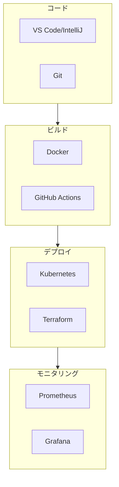

# モダン開発ツール技術白書

> ソフトウェア開発ライフサイクルツールチェーンを完全に習得

---

## 目次

> **学習ガイド**: 本白書は「個人効率→チーム協働→本番デリバリー」の進化パスに従います。第 1 章〜第 3 章で個人の基礎を固め、第 4 章〜第 9 章でエンジニアリング実践を習得し、第 10 章〜第 12 章でプラットフォーム思考に高めます。

1. **[開発ツール概要](#1-開発ツール概要)**  
   *ツール思考を確立: モダンな開発ツールチェーンの全景、選定原則、学習パスを理解し、「ツールコレクター」の罠を回避します。*

2. **[コードエディタと IDE](#2-コードエディタと-ide)**  
   *コーディング効率を向上: VS Code/IntelliJ/Neovim の設定、ショートカット、プラグインエコシステムを深く学び、パーソナライズされた生産的な開発環境を構築します。*

3. **[バージョン管理システム](#3-バージョン管理システム)**  
   *協働開発の基盤: Git の高度な操作、ブランチ戦略、コードレビューワークフローを習得し、効率的なチーム協働を実現します。*

4. **[コンテナ化技術](#4-コンテナ化技術)** 🐳  
   *デリバリーを標準化: Docker コア概念、イメージ最適化、マルチステージビルドを学び、クラウドネイティブアプリケーションの基盤を確立します。*

5. **[CI/CD と自動化](#5-cicd-と自動化)**  
   *デリバリーパイプラインを加速: GitHub Actions、CodePipeline、CodeBuild を習得し、コードからデプロイメントまでの自動化パイプラインを構築します。*

6. **[Kubernetes とオーケストレーション](#6-kubernetes-とオーケストレーション)**  
   *コンテナ管理をスケール: EKS クラスター管理、Helm パッケージング、サービスメッシュを学び、本番グレードのコンテナオーケストレーション課題に対処します。*

7. **[モニタリングと可観測性](#7-モニタリングと可観測性)**  
   *システムの洞察を得る: Prometheus、Grafana、CloudWatch を統合し、アプリケーションとインフラストラクチャのフルスタックモニタリングを構築します。*

8. **[テスト自動化](#8-テスト自動化)**  
   *コード品質を確保: ユニットテスト、統合テスト、E2E テスト戦略を学び、pytest、Jest、Selenium を習得します。*

9. **[コード品質とセキュリティ](#9-コード品質とセキュリティ)**  
   *シフトレフトセキュリティプラクティス: SonarQube、CodeGuru、SAST/DAST ツールを統合し、開発初期段階で問題を検出・修正します。*

10. **[GitOps と Infrastructure as Code](#10-gitops-と-infrastructure-as-code)**  
    *宣言的な運用: Terraform、CDK、ArgoCD を学び、Git ワークフローを使用してインフラストラクチャとアプリケーションデプロイメントを管理します。*

11. **[開発環境管理](#11-開発環境管理)**  
    *環境の一貫性: Docker Compose、devcontainer、Nix、LocalStack を習得し、「私のマシンでは動く」問題を解決します。*

12. **[ツールチェーン統合と最適化](#12-ツールチェーン統合と最適化)**  
    *プラットフォーム能力を構築: これまでのすべてのツールを統合し、効率的な開発者ポータル、内部プラットフォーム、メトリクスシステムを設計し、チーム全体の生産性を向上させます。*

---

## 1. 開発ツール概要

### 1.1 モダン DevOps ツールチェーン

---

*バージョン: v1.0*  
*最終更新日: 2026-03-02*
