# AWS Code シリーズマスターガイド

> CodeCommit、CodeBuild、CodePipeline、CodeDeploy エンタープライズ実践ガイド

---

## 目次

1. [AWS CodeCommit 深層解析](#1-aws-codecommit-深層解析)
2. [AWS CodeBuild 高度な機能](#2-aws-codebuild-高度な機能)
3. [AWS CodePipeline エンタープライズパターン](#3-aws-codepipeline-エンタープライズパターン)
4. [AWS CodeDeploy デプロイ戦略](#4-aws-codedeploy-デプロイ戦略)
5. [完全 CI/CD アーキテクチャ実践](#5-完全-cicd-アーキテクチャ実践)

---

## 1. AWS CodeCommit 深層解析

### 1.1 CodeCommit を選択する理由

```
GitHub Enterprise vs CodeCommit 意思決定マトリクス：

| 観点 | GitHub Enterprise | CodeCommit |
|------|------------------|------------|
| コスト | $21/ユーザー/月 | $1/月（最初の5ユーザー無料） |
| IAM 統合 | OAuth 設定 | ネイティブ統合 |
| コンプライアンス | 追加設定が必要 | SOC/PCI/HIPAA 準拠 |
| プライベート VPC | GitHub AE が必要 | ネイティブサポート |
```

### 1.2 セキュリティのベストプラクティス

```bash
# 1. IAM 条件キーを有効化
{
  "Version": "2012-10-17",
  "Statement": [
    {
      "Effect": "Allow",
      "Action": [
        "codecommit:GitPull",
        "codecommit:GitPush"
      ],
      "Resource": "*",
      "Condition": {
        "IpAddress": {
          "aws:SourceIp": [
            "10.0.0.0/8",
            "172.16.0.0/12"
          ]
        }
      }
    }
  ]
}

# 2. main ブランチへのプッシュを禁止する設定
aws codecommit put-repository-triggers \
  --repository-name my-repo \
  --triggers file://triggers.json

# triggers.json
[
  {
    "name": "BlockDirectMainPush",
    "destinationArn": "arn:aws:lambda:...:function:block-push",
    "customData": "",
    "branches": ["main"],
    "events": ["updateReference"]
  }
]
```

### 1.3 CodeGuru Reviewer との統合

```yaml
# 自動コードレビュー設定
RepositoryAssociation:
  Type: AWS::CodeGuruReviewer::RepositoryAssociation
  Properties:
    Name: my-repo
    Type: CodeCommit
    ConnectionArn: !Ref CodeStarConnection

# 自動レビューを有効化するトリガー
RepositoryTrigger:
  Type: AWS::CodeCommit::Trigger
  Properties:
    RepositoryName: my-repo
    Triggers:
      - Name: CodeGuruReview
        DestinationArn: !GetAtt CodeGuruFunction.Arn
        Events: [pullRequestCreated, pullRequestSourceBranchUpdated]
```

---

## 2. AWS CodeBuild 高度な機能

### 2.1 Buildspec 深層最適化

```yaml
# buildspec-optimized.yml
version: 0.2

env:
  secrets-manager:
    DOCKERHUB_TOKEN: dockerhub/token
  variables:
    AWS_DEFAULT_REGION: ap-northeast-1

# バッチビルド（並列化）
batch:
  fast-fail: false
  
  # 並列ビルドマトリクス
  build-matrix:
    - identifier: linux_small
      env:
        type: LINUX_CONTAINER
        compute-type: BUILD_GENERAL1_SMALL
    - identifier: linux_large
      env:
        type: LINUX_CONTAINER
        compute-type: BUILD_GENERAL1_LARGE
        
  # 順序付きビルドグラフ
  build-graph:
    - identifier: build
      buildspec: buildspec-build.yml
    - identifier: test
      buildspec: buildspec-test.yml
      depend-on:
        - build
    - identifier: deploy
      buildspec: buildspec-deploy.yml
      depend-on:
        - test

phases:
  install:
    runtime-versions:
      nodejs: 18
      python: 3.11
      docker: 23
    commands:
      - echo "Installing global dependencies..."
      - pip install awscli --upgrade
      
  pre_build:
    commands:
      - echo "Pre-build started at $(date)"
      - npm ci --include=dev
      - npm run lint
      
  build:
    commands:
      - npm run build:prod
      - npm run test:ci -- --coverage
      
  post_build:
    commands:
      - echo "Build completed at $(date)"
      
reports:
  # テストレポート
  test-reports:
    files:
      - 'reports/junit.xml'
    file-format: JUNITXML
    
  # カバレッジレポート
  coverage-reports:
    files:
      - 'coverage/clover.xml'
    file-format: CLOVERXML
    
  # SARIF セキュリティスキャンレポート
  security-reports:
    files:
      - 'reports/security.sarif'
    file-format: SARIF

cache:
  paths:
    # Docker レイヤーキャッシュ（カスタムイメージが必要）
    - '/var/lib/docker/**/*'
    # 依存関係キャッシュ
    - 'node_modules/**/*'
    - '/root/.npm/**/*'

artifacts:
  files:
    - 'dist/**/*'
    - 'appspec.yml'
    - 'scripts/**/*'
  discard-paths: no
  secondary-artifacts:
    deploy-package:
      files:
        - 'dist/**/*'
      name: deploy-package-$(date +%Y%m%d-%H%M%S)
```

### 2.2 ローカルデバッグテクニック

```bash
# 1. AWS CodeBuild ローカルプロキシを使用
# インストール
docker pull amazon/aws-codebuild-local:latest --disable-content-trust=false

# 2. ローカルビルドスクリプトを作成
#!/bin/bash
# local-build.sh

docker run \
  -it \
  -v $(pwd):/src \
  -v /var/run/docker.sock:/var/run/docker.sock \
  -e "AWS_ACCESS_KEY_ID=$AWS_ACCESS_KEY_ID" \
  -e "AWS_SECRET_ACCESS_KEY=$AWS_SECRET_ACCESS_KEY" \
  -e "AWS_DEFAULT_REGION=ap-northeast-1" \
  amazon/aws-codebuild-local:latest \
  -i aws/codebuild/standard:5.0 \
  -a output \
  -b buildspec.yml

# 3. ローカルビルドの実行
chmod +x local-build.sh
./local-build.sh
```

### 2.3 ビルドキャッシュ戦略

```typescript
// CDK ビルドプロジェクトのキャッシュ設定
const buildProject = new codebuild.Project(this, 'CachedBuild', {
  cache: codebuild.Cache.local(
    codebuild.LocalCacheMode.SOURCE,
    codebuild.LocalCacheMode.DOCKER_LAYER,
    codebuild.LocalCacheMode.CUSTOM
  ),
  // または S3 キャッシュ
  // cache: codebuild.Cache.bucket(cacheBucket),
  
  environment: {
    buildImage: codebuild.LinuxBuildImage.STANDARD_5_0,
    computeType: codebuild.ComputeType.LARGE,
  },
  
  buildSpec: codebuild.BuildSpec.fromObject({
    version: '0.2',
    phases: {
      install: {
        commands: [
          // キャッシュをチェック
          'if [ -d node_modules ]; then echo "Cache hit"; else npm ci; fi',
        ],
      },
    },
  }),
});
```

---

## 3. AWS CodePipeline エンタープライズパターン

### 3.1 マルチ環境パイプラインアーキテクチャ

```mermaid
flowchart LR
    Source[Source] --> Build[Build]
    Build --> Dev[Devデプロイ]
    Dev -->|自動化テスト| DevTest[Devテスト]
    DevTest -->|手動承認| Staging[Stagingデプロイ]
    Staging -->|Smokeテスト| StagingTest[Stagingテスト]
    StagingTest -->|手動承認| Prod[Productionデプロイ]
    Prod -->|Canary| CanaryTest[Canary検証]
    CanaryTest --> FullProd[全トラフィック]
```



```yaml
# CloudFormation マルチ環境パイプライン
AWSTemplateFormatVersion: '2010-09-09'
Resources:
  MultiEnvPipeline:
    Type: AWS::CodePipeline::Pipeline
    Properties:
      Name: MultiEnvironmentPipeline
      RoleArn: !GetAtt PipelineRole.Arn
      ArtifactStore:
        Type: S3
        Location: !Ref ArtifactBucket
      
      Stages:
        # Source
        - Name: Source
          Actions:
            - Name: Source
              ActionTypeId:
                Category: Source
                Owner: AWS
                Provider: CodeStarSourceConnection
                Version: 1
              Configuration:
                ConnectionArn: !Ref GitHubConnection
                FullRepositoryId: myorg/myapp
                BranchName: main
              OutputArtifacts:
                - Name: SourceCode
        
        # Build
        - Name: Build
          Actions:
            - Name: Build
              ActionTypeId:
                Category: Build
                Owner: AWS
                Provider: CodeBuild
                Version: 1
              Configuration:
                ProjectName: !Ref BuildProject
              InputArtifacts:
                - Name: SourceCode
              OutputArtifacts:
                - Name: BuildArtifact
        
        # Deploy to Dev
        - Name: DeployToDev
          Actions:
            - Name: Deploy
              ActionTypeId:
                Category: Deploy
                Owner: AWS
                Provider: ECS
                Version: 1
              Configuration:
                ClusterName: !Ref DevCluster
                ServiceName: !Ref DevService
                FileName: imagedefinitions.json
              InputArtifacts:
                - Name: BuildArtifact
        
        # Dev Tests
        - Name: DevTests
          Actions:
            - Name: IntegrationTests
              ActionTypeId:
                Category: Test
                Owner: AWS
                Provider: CodeBuild
                Version: 1
              Configuration:
                ProjectName: !Ref IntegrationTestProject
              InputArtifacts:
                - Name: SourceCode
        
        # Approval for Staging
        - Name: PromoteToStaging
          Actions:
            - Name: Approval
              ActionTypeId:
                Category: Approval
                Owner: AWS
                Provider: Manual
                Version: 1
              Configuration:
                CustomData: "Approve deployment to Staging"
                ExternalEntityLink: !Sub "https://github.com/myorg/myapp/commit/#{Source.SourceRevision}"
        
        # Deploy to Staging
        - Name: DeployToStaging
          Actions:
            - Name: Deploy
              ActionTypeId:
                Category: Deploy
                Owner: AWS
                Provider: ECS
                Version: 1
              Configuration:
                ClusterName: !Ref StagingCluster
                ServiceName: !Ref StagingService
                FileName: imagedefinitions.json
              InputArtifacts:
                - Name: BuildArtifact
            
            - Name: SmokeTests
              ActionTypeId:
                Category: Test
                Owner: AWS
                Provider: CodeBuild
                Version: 1
              RunOrder: 2
              Configuration:
                ProjectName: !Ref SmokeTestProject
        
        # Approval for Production
        - Name: PromoteToProduction
          Actions:
            - Name: Approval
              ActionTypeId:
                Category: Approval
                Owner: AWS
                Provider: Manual
                Version: 1
              Configuration:
                CustomData: "Approve deployment to Production"
        
        # Canary Deploy to Production
        - Name: DeployToProduction
          Actions:
            - Name: CanaryDeploy
              ActionTypeId:
                Category: Deploy
                Owner: AWS
                Provider: CodeDeploy
                Version: 1
              Configuration:
                ApplicationName: !Ref CodeDeployApplication
                DeploymentGroupName: !Ref ProdDeploymentGroup
              InputArtifacts:
                - Name: BuildArtifact
```

### 3.2 クロスアカウントデプロイ

```typescript
// CDK クロスアカウントデプロイ設定
const pipeline = new codepipeline.Pipeline(this, 'CrossAccountPipeline', {
  crossAccountKeys: true, // クロスアカウントキーを有効化
  stages: [
    // ... source and build stages
    {
      stageName: 'DeployToProd',
      actions: [
        new codepipeline_actions.CloudFormationCreateUpdateStackAction({
          actionName: 'Deploy',
          templatePath: buildArtifact.atPath('template.yaml'),
          stackName: 'MyApp',
          adminPermissions: true,
          role: iam.Role.fromRoleArn(
            this,
            'CrossAccountRole',
            'arn:aws:iam::PROD_ACCOUNT:role/CrossAccountRole'
          ),
          deploymentRole: iam.Role.fromRoleArn(
            this,
            'DeploymentRole',
            'arn:aws:iam::PROD_ACCOUNT:role/CloudFormationRole'
          ),
        }),
      ],
    },
  ],
});
```

---

## 4. AWS CodeDeploy デプロイ戦略

### 4.1 ECS Blue/Green デプロイ

```typescript
// CDK Blue/Green デプロイ設定
const deploymentGroup = new codedeploy.EcsDeploymentGroup(this, 'BlueGreenDG', {
  service: ecsService,
  blueGreenDeploymentConfig: {
    blueTargetGroup,
    greenTargetGroup,
    listener,
    testListener, // オプション：テストトラフィック用
  },
  deploymentConfig: codedeploy.EcsDeploymentConfig.CANARY_10_PERCENT_5_MINUTES,
  autoRollback: {
    failedDeployment: true,
    stoppedDeployment: true,
    deploymentInAlarm: true, // アラーム時にロールバック
  },
});

// アラームの作成
const highErrorRate = new cloudwatch.Alarm(this, 'HighErrorRate', {
  metric: lb.metrics.custom('HTTPCode_Target_5XX_Count'),
  threshold: 10,
  evaluationPeriods: 2,
});

deploymentGroup.addAlarm(highErrorRate);
```

```yaml
# appspec.yml for ECS Blue/Green
version: 0.0
Resources:
  - TargetService:
      Type: AWS::ECS::Service
      Properties:
        TaskDefinition: <TASK_DEFINITION>
        LoadBalancerInfo:
          ContainerName: app
          ContainerPort: 8080
        PlatformVersion: LATEST

Hooks:
  # インストール前フック
  - BeforeInstall: "LambdaFunctionToRunBeforeInstall"
  
  # トラフィック移行後の検証
  - AfterAllowTestTraffic: "LambdaFunctionToValidateTestTraffic"
  
  # 本番トラフィック移行前
  - BeforeAllowTraffic: "LambdaFunctionToRunBeforeAllowTraffic"
  
  # 最終検証
  - AfterAllowTraffic: "LambdaFunctionToRunAfterAllowTraffic"
```

### 4.2 Lambda リニアデプロイ

```typescript
// Lambda カナリアデプロイ
const alias = new lambda.Alias(this, 'LambdaAlias', {
  aliasName: 'prod',
  version: lambdaFunction.currentVersion,
});

new codedeploy.LambdaDeploymentGroup(this, 'CanaryDeployment', {
  alias,
  deploymentConfig: codedeploy.LambdaDeploymentConfig.CANARY_10_PERCENT_30_MINUTES,
  autoRollback: {
    failedDeployment: true,
    stoppedDeployment: true,
  },
  hooks: {
    beforeAllowTraffic: new lambda.Function(this, 'BeforeAllow', {
      runtime: lambda.Runtime.NODEJS_18_X,
      handler: 'index.handler',
      code: lambda.Code.fromInline(`
        exports.handler = async (event) => {
          console.log('Pre-traffic check');
          // ヘルスチェックを実行
          return 'Succeeded';
        };
      `),
    }),
  },
});
```

---

## 5. 完全 CI/CD アーキテクチャ実践

### 5.1 アーキテクチャ概要

```
┌─────────────────────────────────────────────────────────────┐
│                        Developer                            │
└───────────────────────┬─────────────────────────────────────┘
                        │ Git Push
                        ▼
┌─────────────────────────────────────────────────────────────┐
│                    GitHub (Source)                          │
└───────────────────────┬─────────────────────────────────────┘
                        │ Webhook
                        ▼
┌─────────────────────────────────────────────────────────────┐
│                AWS CodePipeline                             │
│  ┌──────────┐  ┌──────────┐  ┌──────────┐  ┌──────────┐   │
│  │  Source  │─▶│  Build   │─▶│  Test    │─▶│  Deploy  │   │
│  └──────────┘  └──────────┘  └──────────┘  └──────────┘   │
└───────────────────────┬─────────────────────────────────────┘
                        │
            ┌───────────┼───────────┐
            ▼           ▼           ▼
       ┌────────┐ ┌──────────┐ ┌──────────┐
       │CodeBuild│ │CodeBuild │ │CodeDeploy│
       │ Build  │ │  Test    │ │  Deploy  │
       └────────┘ └──────────┘ └──────────┘
            │           │           │
            ▼           ▼           ▼
       ┌────────┐ ┌──────────┐ ┌──────────┐
       │  ECR   │ │ CloudWatch│ │   ECS    │
       │ Images │ │  Metrics  │ │ Service  │
       └────────┘ └──────────┘ └──────────┘
```

### 5.2 完全な CDK コード

```typescript
// bin/cicd-complete.ts
#!/usr/bin/env node
import * as cdk from 'aws-cdk-lib';
import { CompleteCiCdStack } from '../lib/complete-cicd-stack';

const app = new cdk.App();

new CompleteCiCdStack(app, 'CompleteCiCdStack', {
  env: {
    account: process.env.CDK_DEFAULT_ACCOUNT,
    region: process.env.CDK_DEFAULT_REGION || 'ap-northeast-1',
  },
  tags: {
    Project: 'CiCdDemo',
    Environment: 'Production',
  },
});
```

```typescript
// lib/complete-cicd-stack.ts
import * as cdk from 'aws-cdk-lib';
import * as codecommit from 'aws-cdk-lib/aws-codecommit';
import * as codebuild from 'aws-cdk-lib/aws-codebuild';
import * as codepipeline from 'aws-cdk-lib/aws-codepipeline';
import * as codepipeline_actions from 'aws-cdk-lib/aws-codepipeline-actions';
import * as ecr from 'aws-cdk-lib/aws-ecr';
import * as ecs from 'aws-cdk-lib/aws-ecs';
import * as ec2 from 'aws-cdk-lib/aws-ec2';
import * as elbv2 from 'aws-cdk-lib/aws-elasticloadbalancingv2';
import * as cloudwatch from 'aws-cdk-lib/aws-cloudwatch';
import * as sns from 'aws-cdk-lib/aws-sns';
import * as sns_subscriptions from 'aws-cdk-lib/aws-sns-subscriptions';
import { Construct } from 'constructs';

export class CompleteCiCdStack extends cdk.Stack {
  constructor(scope: Construct, id: string, props?: cdk.StackProps) {
    super(scope, id, props);

    // 1. CodeCommit リポジトリを作成
    const repo = new codecommit.Repository(this, 'AppRepo', {
      repositoryName: 'my-application',
      description: 'Application source code',
    });

    // 2. ECR リポジトリを作成
    const ecrRepo = new ecr.Repository(this, 'AppEcr', {
      repositoryName: 'my-app',
      imageScanOnPush: true,
      removalPolicy: cdk.RemovalPolicy.RETAIN,
    });

    // 3. ECS クラスタとサービスを作成
    const vpc = new ec2.Vpc(this, 'AppVpc', { maxAzs: 2 });
    
    const cluster = new ecs.Cluster(this, 'AppCluster', {
      vpc,
      containerInsights: true,
    });

    const taskDef = new ecs.FargateTaskDefinition(this, 'TaskDef', {
      memoryLimitMiB: 512,
      cpu: 256,
    });

    const container = taskDef.addContainer('app', {
      image: ecs.ContainerImage.fromEcrRepository(ecrRepo),
      portMappings: [{ containerPort: 8080 }],
    });

    const service = new ecs.FargateService(this, 'AppService', {
      cluster,
      taskDefinition: taskDef,
      desiredCount: 2,
    });

    // 4. CodeBuild プロジェクトを作成
    const buildProject = new codebuild.PipelineProject(this, 'BuildProject', {
      environment: {
        buildImage: codebuild.LinuxBuildImage.STANDARD_5_0,
        privileged: true,
        computeType: codebuild.ComputeType.MEDIUM,
      },
      environmentVariables: {
        AWS_DEFAULT_REGION: { value: this.region },
        AWS_ACCOUNT_ID: { value: this.account },
        IMAGE_REPO_NAME: { value: ecrRepo.repositoryName },
      },
    });

    ecrRepo.grantPullPush(buildProject);

    // 5. 通知用 SNS Topic を作成
    const pipelineNotifications = new sns.Topic(this, 'PipelineNotifications');
    pipelineNotifications.addSubscription(
      new sns_subscriptions.EmailSubscription('team@example.com')
    );

    // 6. CodePipeline を作成
    const sourceOutput = new codepipeline.Artifact('SourceOutput');
    const buildOutput = new codepipeline.Artifact('BuildOutput');

    const pipeline = new codepipeline.Pipeline(this, 'AppPipeline', {
      pipelineName: 'MyApplicationPipeline',
      restartExecutionOnUpdate: true,
      stages: [
        // Source ステージ
        {
          stageName: 'Source',
          actions: [
            new codepipeline_actions.CodeCommitSourceAction({
              actionName: 'CodeCommit_Source',
              repository: repo,
              branch: 'main',
              output: sourceOutput,
            }),
          ],
        },
        
        // Build ステージ
        {
          stageName: 'Build',
          actions: [
            new codepipeline_actions.CodeBuildAction({
              actionName: 'Build_and_Push',
              project: buildProject,
              input: sourceOutput,
              outputs: [buildOutput],
            }),
          ],
        },
        
        // Deploy ステージ
        {
          stageName: 'Deploy',
          actions: [
            new codepipeline_actions.EcsDeployAction({
              actionName: 'Deploy_to_ECS',
              service,
              imageFile: new codepipeline.ArtifactPath(
                buildOutput,
                'imagedefinitions.json'
              ),
            }),
          ],
        },
      ],
    });

    // 7. CloudWatch アラームを追加
    new cloudwatch.Alarm(this, 'HighErrorRate', {
      metric: service.metricCpuUtilization(),
      threshold: 80,
      evaluationPeriods: 3,
      alarmDescription: 'High CPU usage in ECS service',
    });

    // 8. 出力
    new cdk.CfnOutput(this, 'RepositoryCloneUrl', {
      value: repo.repositoryCloneUrlHttp,
      description: 'Clone URL for the CodeCommit repository',
    });

    new cdk.CfnOutput(this, 'PipelineUrl', {
      value: `https://${this.region}.console.aws.amazon.com/codesuite/codepipeline/pipelines/${pipeline.pipelineName}/view`,
      description: 'CodePipeline console URL',
    });
  }
}
```

---

## 6. まとめとベストプラクティス

### 6.1 AWS Code シリーズ選択ガイド

| シナリオ | 推奨サービス | 理由 |
|------|----------|------|
| プライベートリポジトリ + IAM 統合 | CodeCommit | ネイティブ IAM、コンプライアンスに優しい |
| Serverless ビルド | CodeBuild | 従量課金、メンテナンス不要 |
| マルチ環境デプロイ | CodePipeline | 可視化、組み込み承認機能 |
| ECS/EC2 デプロイ | CodeDeploy | ブルーグリーン、カナリア対応 |
| Lambda デプロイ | CodeDeploy | リニア、カナリア対応 |

### 6.2 よくある落とし穴

```
❌ 落とし穴 1: buildspec に機密情報をハードコード
✅ 解決方法: Secrets Manager または Parameter Store を使用

❌ 落とし穴 2: キャッシュなしでビルドが遅い
✅ 解決方法: localCache または S3 キャッシュを有効化

❌ 落とし穴 3: Pipeline の権限が過大
✅ 解決方法: 最小権限の原則を使用し、必要に応じてロールスイッチ

❌ 落とし穴 4: 通知メカニズムがない
✅ 解決方法: CloudWatch Events の SNS 通知を設定

❌ 落とし穴 5: ビルド環境が一貫していない
✅ 解決方法: Docker イメージを使用して環境を標準化
```

---

*Part of AWS DevTools Hero Learning Path*
