# AWS Code 系列完全ガイド

> CodeCommit、CodeBuild、CodePipeline、CodeDeploy エンタープライズ実践

---

## 目次

1. [AWS CodeCommit 完全解説](#1-aws-codecommit-完全解説)
2. [AWS CodeBuild 最適化](#2-aws-codebuild-最適化)
3. [AWS CodePipeline パターン](#3-aws-codepipeline-パターン)
4. [AWS CodeDeploy 戦略](#4-aws-codedeploy-戦略)
5. [実践アーキテクチャ](#5-実践アーキテクチャ)

---

## 1. AWS CodeCommit 完全解説

### 1.1 CodeCommit を選ぶ理由

```
GitHub Enterprise vs CodeCommit 比較：

| 項目 | GitHub Enterprise | CodeCommit |
|------|------------------|------------|
| コスト | $21/ユーザー/月 | $1/月（5ユーザーまで無料） |
| IAM 統合 | OAuth 設定が必要 | ネイティブ統合 |
| コンプライアンス | 追加設定が必要 | SOC/PCI/HIPAA 準拠 |
| プライベート VPC | GitHub AE が必要 | ネイティブサポート |
```

### 1.2 セキュリティベストプラクティス

```bash
# 1. IAM 条件キーの有効化
{
  "Version": "2012-10-17",
  "Statement": [
    {
      "Effect": "Allow",
      "Action": [
        "codecommit:GitPull",
        "codecommit:GitPush"
      ],
      "Resource": "*",
      "Condition": {
        "IpAddress": {
          "aws:SourceIp": [
            "10.0.0.0/8",
            "172.16.0.0/12"
          ]
        }
      }
    }
  ]
}

# 2. main ブランチへの直接プッシュ禁止
aws codecommit put-repository-triggers \
  --repository-name my-repo \
  --triggers file://triggers.json
```

### 1.3 CodeGuru Reviewer 統合

```yaml
# 自動コードレビュー設定
RepositoryAssociation:
  Type: AWS::CodeGuruReviewer::RepositoryAssociation
  Properties:
    Name: my-repo
    Type: CodeCommit
    ConnectionArn: !Ref CodeStarConnection
```

---

## 2. AWS CodeBuild 最適化

### 2.1 高度な Buildspec

```yaml
# buildspec-optimized.yml
version: 0.2

env:
  secrets-manager:
    DOCKERHUB_TOKEN: dockerhub/token
  variables:
    AWS_DEFAULT_REGION: ap-northeast-1

# バッチビルド（並列化）
batch:
  fast-fail: false
  
  # 並列ビルドマトリックス
  build-matrix:
    - identifier: linux_small
      env:
        type: LINUX_CONTAINER
        compute-type: BUILD_GENERAL1_SMALL
    - identifier: linux_large
      env:
        type: LINUX_CONTAINER
        compute-type: BUILD_GENERAL1_LARGE
        
  # 依存関係グラフ
  build-graph:
    - identifier: build
      buildspec: buildspec-build.yml
    - identifier: test
      buildspec: buildspec-test.yml
      depend-on:
        - build
    - identifier: deploy
      buildspec: buildspec-deploy.yml
      depend-on:
        - test

phases:
  install:
    runtime-versions:
      nodejs: 18
      python: 3.11
      docker: 23
    commands:
      - pip install awscli --upgrade
      
  pre_build:
    commands:
      - npm ci --include=dev
      - npm run lint
      
  build:
    commands:
      - npm run build:prod
      - npm run test:ci -- --coverage
      
  post_build:
    commands:
      - echo "Build completed"

reports:
  test-reports:
    files:
      - 'reports/junit.xml'
    file-format: JUNITXML
    
  coverage-reports:
    files:
      - 'coverage/clover.xml'
    file-format: CLOVERXML

cache:
  paths:
    - '/var/lib/docker/**/*'
    - 'node_modules/**/*'
    - '/root/.npm/**/*'

artifacts:
  files:
    - 'dist/**/*'
    - 'appspec.yml'
  discard-paths: no
```

### 2.2 ローカルデバッグ

```bash
# AWS CodeBuild ローカルエージェント
# インストール
docker pull amazon/aws-codebuild-local:latest --disable-content-trust=false

# ローカルビルドスクリプト
#!/bin/bash
docker run \
  -it \
  -v $(pwd):/src \
  -v /var/run/docker.sock:/var/run/docker.sock \
  -e "AWS_ACCESS_KEY_ID=$AWS_ACCESS_KEY_ID" \
  -e "AWS_SECRET_ACCESS_KEY=$AWS_SECRET_ACCESS_KEY" \
  -e "AWS_DEFAULT_REGION=ap-northeast-1" \
  amazon/aws-codebuild-local:latest \
  -i aws/codebuild/standard:5.0 \
  -a output \
  -b buildspec.yml
```

### 2.3 ビルドキャッシュ戦略

```typescript
// CDK ビルドプロジェクト設定
const buildProject = new codebuild.Project(this, 'CachedBuild', {
  cache: codebuild.Cache.local(
    codebuild.LocalCacheMode.SOURCE,
    codebuild.LocalCacheMode.DOCKER_LAYER,
    codebuild.LocalCacheMode.CUSTOM
  ),
  environment: {
    buildImage: codebuild.LinuxBuildImage.STANDARD_5_0,
    computeType: codebuild.ComputeType.LARGE,
  },
});
```

---

## 3. AWS CodePipeline パターン

### 3.1 マルチ環境パイプライン

```mermaid
flowchart LR
    Source[Source] --> Build[Build]
    Build --> Dev[Devデプロイ]
    Dev -->|自動テスト| DevTest[Devテスト]
    DevTest -->|承認| Staging[Stagingデプロイ]
    Staging -->|Smokeテスト| StagingTest[Stagingテスト]
    StagingTest -->|承認| Prod[Productionデプロイ]
    Prod -->|Canary| CanaryTest[Canary検証]
    CanaryTest --> FullProd[全トラフィック]
```



```yaml
# CloudFormation マルチ環境パイプライン
AWSTemplateFormatVersion: '2010-09-09'
Resources:
  MultiEnvPipeline:
    Type: AWS::CodePipeline::Pipeline
    Properties:
      Name: MultiEnvironmentPipeline
      Stages:
        # Source
        - Name: Source
          Actions:
            - Name: Source
              ActionTypeId:
                Category: Source
                Owner: AWS
                Provider: CodeStarSourceConnection
                Version: 1
              Configuration:
                ConnectionArn: !Ref GitHubConnection
                FullRepositoryId: myorg/myapp
                BranchName: main
        
        # Build
        - Name: Build
          Actions:
            - Name: Build
              ActionTypeId:
                Category: Build
                Owner: AWS
                Provider: CodeBuild
                Version: 1
              Configuration:
                ProjectName: !Ref BuildProject
        
        # Deploy to Dev
        - Name: DeployToDev
          Actions:
            - Name: Deploy
              ActionTypeId:
                Category: Deploy
                Owner: AWS
                Provider: ECS
                Version: 1
              Configuration:
                ClusterName: !Ref DevCluster
                ServiceName: !Ref DevService
        
        # Approval for Staging
        - Name: PromoteToStaging
          Actions:
            - Name: Approval
              ActionTypeId:
                Category: Approval
                Owner: AWS
                Provider: Manual
                Version: 1
              Configuration:
                CustomData: "Approve deployment to Staging"
        
        # Deploy to Staging
        - Name: DeployToStaging
          Actions:
            - Name: Deploy
              ActionTypeId:
                Category: Deploy
                Owner: AWS
                Provider: ECS
                Version: 1
              Configuration:
                ClusterName: !Ref StagingCluster
                ServiceName: !Ref StagingService
            
            - Name: SmokeTests
              ActionTypeId:
                Category: Test
                Owner: AWS
                Provider: CodeBuild
              RunOrder: 2
        
        # Canary Deploy to Production
        - Name: DeployToProduction
          Actions:
            - Name: CanaryDeploy
              ActionTypeId:
                Category: Deploy
                Owner: AWS
                Provider: CodeDeploy
                Version: 1
```

### 3.2 クロスアカウントデプロイ

```typescript
// CDK クロスアカウントデプロイ
const pipeline = new codepipeline.Pipeline(this, 'CrossAccountPipeline', {
  crossAccountKeys: true,
  stages: [
    {
      stageName: 'DeployToProd',
      actions: [
        new codepipeline_actions.CloudFormationCreateUpdateStackAction({
          actionName: 'Deploy',
          templatePath: buildArtifact.atPath('template.yaml'),
          stackName: 'MyApp',
          adminPermissions: true,
          role: iam.Role.fromRoleArn(
            this,
            'CrossAccountRole',
            'arn:aws:iam::PROD_ACCOUNT:role/CrossAccountRole'
          ),
        }),
      ],
    },
  ],
});
```

---

## 4. AWS CodeDeploy 戦略

### 4.1 ECS Blue/Green デプロイ

```typescript
// CDK Blue/Green デプロイ設定
const deploymentGroup = new codedeploy.EcsDeploymentGroup(this, 'BlueGreenDG', {
  service: ecsService,
  blueGreenDeploymentConfig: {
    blueTargetGroup,
    greenTargetGroup,
    listener,
    testListener,
  },
  deploymentConfig: codedeploy.EcsDeploymentConfig.CANARY_10_PERCENT_5_MINUTES,
  autoRollback: {
    failedDeployment: true,
    stoppedDeployment: true,
    deploymentInAlarm: true,
  },
});

// アラーム設定
const highErrorRate = new cloudwatch.Alarm(this, 'HighErrorRate', {
  metric: lb.metrics.custom('HTTPCode_Target_5XX_Count'),
  threshold: 10,
  evaluationPeriods: 2,
});

deploymentGroup.addAlarm(highErrorRate);
```

```yaml
# appspec.yml for ECS Blue/Green
version: 0.0
Resources:
  - TargetService:
      Type: AWS::ECS::Service
      Properties:
        TaskDefinition: <TASK_DEFINITION>
        LoadBalancerInfo:
          ContainerName: app
          ContainerPort: 8080
        PlatformVersion: LATEST

Hooks:
  - BeforeInstall: "LambdaFunctionToRunBeforeInstall"
  - AfterAllowTestTraffic: "LambdaFunctionToValidateTestTraffic"
  - BeforeAllowTraffic: "LambdaFunctionToRunBeforeAllowTraffic"
  - AfterAllowTraffic: "LambdaFunctionToRunAfterAllowTraffic"
```

### 4.2 Lambda リニアデプロイ

```typescript
// Lambda カナリアデプロイ
const alias = new lambda.Alias(this, 'LambdaAlias', {
  aliasName: 'prod',
  version: lambdaFunction.currentVersion,
});

new codedeploy.LambdaDeploymentGroup(this, 'CanaryDeployment', {
  alias,
  deploymentConfig: codedeploy.LambdaDeploymentConfig.CANARY_10_PERCENT_30_MINUTES,
  autoRollback: {
    failedDeployment: true,
    stoppedDeployment: true,
  },
  hooks: {
    beforeAllowTraffic: new lambda.Function(this, 'BeforeAllow', {
      runtime: lambda.Runtime.NODEJS_18_X,
      handler: 'index.handler',
      code: lambda.Code.fromInline(`
        exports.handler = async (event) => {
          console.log('Pre-traffic check');
          return 'Succeeded';
        };
      `),
    }),
  },
});
```

---

## 5. 実践アーキテクチャ

### 5.1 完全な CI/CD アーキテクチャ

```
┌─────────────────────────────────────────────────────────────┐
│                        Developer                            │
└───────────────────────┬─────────────────────────────────────┘
                        │ Git Push
                        ▼
┌─────────────────────────────────────────────────────────────┐
│                    GitHub (Source)                          │
└───────────────────────┬─────────────────────────────────────┘
                        │ Webhook
                        ▼
┌─────────────────────────────────────────────────────────────┐
│                AWS CodePipeline                             │
│  ┌──────────┐  ┌──────────┐  ┌──────────┐  ┌──────────┐   │
│  │  Source  │─▶│  Build   │─▶│  Test    │─▶│  Deploy  │   │
│  └──────────┘  └──────────┘  └──────────┘  └──────────┘   │
└───────────────────────┬─────────────────────────────────────┘
                        │
            ┌───────────┼───────────┐
            ▼           ▼           ▼
       ┌────────┐ ┌──────────┐ ┌──────────┐
       │CodeBuild│ │CodeBuild │ │CodeDeploy│
       │ Build  │ │  Test    │ │  Deploy  │
       └────────┘ └──────────┘ └──────────┘
            │           │           │
            ▼           ▼           ▼
       ┌────────┐ ┌──────────┐ ┌──────────┐
       │  ECR   │ │ CloudWatch│ │   ECS    │
       │ Images │ │  Metrics  │ │ Service  │
       └────────┘ └──────────┘ └──────────┘
```

### 5.2 本番環境のチェックリスト

```
□ セキュリティ
  □ Secrets Manager で機密情報を管理
  □ ECR イメージスキャン有効化
  □ VPC 内での実行
  □ IAM 最小権限の原則

□ 信頼性
  □ 自動ロールバック設定
  □ ヘルスチェック設定
  □ パイプライン失敗時の通知
  □ CloudWatch アラーム

□ パフォーマンス
  □ ビルドキャッシュ設定
  □ Docker レイヤーキャッシュ
  □ 並列ビルド設定
  □ 適切なコンピュートタイプ選択

□ コスト
  □ Fargate Spot の検討
  □ 不要な ECR イメージのライフサイクルポリシー
  □ 開発環境の自動シャットダウン
```

---

## 6. よくある問題と解決策

### 6.1 Pipeline 関連

| 問題 | 原因 | 解決策 |
|------|------|--------|
| Source ステージ失敗 | Connection 設定不良 | CodeStar Connections を再確認 |
| Build タイムアウト | ビルド時間超過 | timeout 設定を延長 |
| Deploy 失敗 | タスク定義不備 | imagedefinitions.json 形式を確認 |
| 承認待ち | 通知未設定 | SNS トピック設定を確認 |

### 6.2 CodeBuild 関連

```bash
# ビルドログの確認
aws codebuild batch-get-builds \
  --ids $(aws codebuild list-builds-for-project \
    --project-name my-project \
    --query 'ids[0]' --output text) \
  --query 'builds[0].logs.deepLink'

# キャッシュのクリア
aws codebuild invalidate-project-cache --project-name my-project
```

---

## 7. JAWS-UG 発表向け Tips

### 7.1 デモ構成案 (20分)

```
1. アーキテクチャ説明 (5分)
   - システム構成図
   - データフロー

2. ライブデモ (10分)
   - Git Push → Pipeline 起動
   - Build プロセス
   - Deploy 完了確認

3. ベストプラクティス (5分)
   - 学んだ教訓
   - 避けるべき落とし穴
```

### 7.2 注目ポイント

- **コスト**: CodeCommit は GitHub Enterprise の約1/20
- **統合**: IAM とのネイティブ統合
- **セキュリティ**: VPC 内でのプライベート実行
- **スケーラビリティ**: フルマネージド、自動スケール

---

*AWS DevTools Hero 学習パスの一部*
