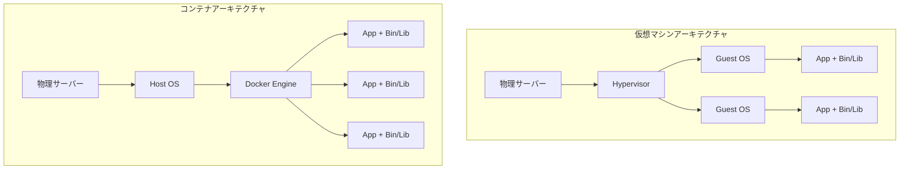

# Docker 完全ガイド

> 入門から精通までのコンテナ化実践ハンドブック

---

## 目次

1. [Docker コアコンセプト](#コアコンセプト)
2. [Dockerfile ベストプラクティス](#dockerfile-ベストプラクティス)
3. [Docker Compose 深層解説](#docker-compose-深層解説)
4. [コンテナセキュリティ](#コンテナセキュリティ)
5. [パフォーマンス最適化](#パフォーマンス最適化)
6. [プロダクション環境デプロイ](#プロダクション環境デプロイ)

---

## コアコンセプト

### コンテナ vs 仮想マシン



### イメージレイヤー化メカニズム

```dockerfile
# 各インストラクションが新しいレイヤーを作成
FROM node:20-alpine          # Layer 1: ベースイメージ
WORKDIR /app                 # Layer 2: 作業ディレクトリ
COPY package*.json ./        # Layer 3: 依存ファイル
RUN npm ci                   # Layer 4: 依存関係のインストール
COPY . .                     # Layer 5: アプリケーションコード
CMD ["node", "index.js"]     # Layer 6: 起動コマンド
```

**レイヤーキャッシュの原理**:
- レイヤーは不変です
- あるレイヤーが変更されると、その後のすべてのレイヤーを再構築する必要があります
- 変更頻度の低いコンテンツを前に配置します

---

## Dockerfile ベストプラクティス

### ビルドキャッシュの最適化

```dockerfile
# ❌ よくない: コード変更のたびに依存関係を再インストール
FROM node:20-alpine
COPY . /app
WORKDIR /app
RUN npm ci

# ✅ 良い: 依存関係のインストールとアプリケーションコードを分離
FROM node:20-alpine
WORKDIR /app

# 1. まず依存ファイルをコピー (キャッシュを活用)
COPY package*.json ./
RUN npm ci --only=production

# 2. その後アプリケーションコードをコピー
COPY . .
```

### マルチステージビルド

```dockerfile
# ビルドステージ
FROM node:20-alpine AS builder
WORKDIR /app
COPY package*.json ./
RUN npm ci
COPY . .
RUN npm run build

# プロダクションステージ (より小さいイメージ)
FROM node:20-alpine AS production
WORKDIR /app

# 必要なファイルのみコピー
COPY --from=builder /app/dist ./dist
COPY --from=builder /app/node_modules ./node_modules
COPY --from=builder /app/package.json ./

# root 以外のユーザー
USER node

CMD ["node", "dist/main.js"]
```

**最適化効果**:
```
元のイメージ: 1.2 GB
マルチステージビルド後: 180 MB
削減率: 85%
```

### セキュリティのベストプラクティス

```dockerfile
FROM node:20-alpine

# 1. 特定のバージョンタグを使用し、latest を避ける
# FROM node:alpine  ❌ よくない
# FROM node:20.10.0-alpine3.18  ✅ より良い

# 2. root 以外のユーザーを作成
RUN addgroup -g 1001 -S nodejs && \
    adduser -S nodejs -u 1001

# 3. distroless イメージを使用 (極限まで軽量)
# FROM gcr.io/distroless/nodejs20-debian11

WORKDIR /app

# 4. 適切なファイル権限を設定
COPY --chown=nodejs:nodejs . .
RUN npm ci --only=production && npm cache clean --force

# 5. 読み取り専用のルートファイルシステム
# docker run で使用: --read-only
# tmpfs と組み合わせて: --tmpfs /tmp:noexec,nosuid,size=100m

# 6. ポートの最小限化
EXPOSE 3000

# 7. ヘルスチェック
HEALTHCHECK --interval=30s --timeout=3s --start-period=5s --retries=3 \
    CMD node healthcheck.js || exit 1

USER node

CMD ["node", "index.js"]
```

---

## Docker Compose 深層解説

### 開発環境設定

```yaml
version: '3.8'

services:
  app:
    build:
      context: .
      target: development
    ports:
      - "3000:3000"
    volumes:
      # ソースコードのバインドマウント
      - .:/app
      # 匿名ボリュームで node_modules を保持
      - /app/node_modules
    environment:
      - NODE_ENV=development
      - DATABASE_URL=postgres://postgres:password@db:5432/app
      - REDIS_URL=redis://redis:6379
      - DEBUG=app:*
    command: npm run dev
    depends_on:
      db:
        condition: service_healthy
      redis:
        condition: service_started

  db:
    image: postgres:16-alpine
    environment:
      POSTGRES_USER: postgres
      POSTGRES_PASSWORD: password
      POSTGRES_DB: app
    volumes:
      - postgres_data:/var/lib/postgresql/data
      - ./init.sql:/docker-entrypoint-initdb.d/init.sql
    ports:
      - "5432:5432"
    healthcheck:
      test: ["CMD-SHELL", "pg_isready -U postgres"]
      interval: 5s
      timeout: 5s
      retries: 5

  redis:
    image: redis:7-alpine
    ports:
      - "6379:6379"
    volumes:
      - redis_data:/data
    command: redis-server --appendonly yes

  # ローカルメールサービス
  mailhog:
    image: mailhog/mailhog:latest
    ports:
      - "1025:1025"  # SMTP
      - "8025:8025"  # Web UI

  # ローカルオブジェクトストレージ
  minio:
    image: minio/minio:latest
    ports:
      - "9000:9000"
      - "9001:9001"
    environment:
      MINIO_ROOT_USER: minioadmin
      MINIO_ROOT_PASSWORD: minioadmin
    volumes:
      - minio_data:/data
    command: server /data --console-address ":9001"

volumes:
  postgres_data:
  redis_data:
  minio_data:
```

### プロダクション環境設定

```yaml
version: '3.8'

services:
  app:
    build:
      context: .
      target: production
    image: myapp:${VERSION:-latest}
    deploy:
      replicas: 3
      update_config:
        parallelism: 1
        delay: 10s
        failure_action: rollback
        order: start-first
      rollback_config:
        parallelism: 1
        delay: 10s
      restart_policy:
        condition: on-failure
        delay: 5s
        max_attempts: 3
      resources:
        limits:
          cpus: '1.0'
          memory: 512M
        reservations:
          cpus: '0.5'
          memory: 256M
    environment:
      - NODE_ENV=production
    networks:
      - frontend
      - backend
    logging:
      driver: "json-file"
      options:
        max-size: "10m"
        max-file: "3"

  nginx:
    image: nginx:alpine
    ports:
      - "80:80"
      - "443:443"
    volumes:
      - ./nginx.conf:/etc/nginx/nginx.conf:ro
      - ./ssl:/etc/nginx/ssl:ro
    depends_on:
      - app
    networks:
      - frontend

networks:
  frontend:
    driver: overlay
  backend:
    driver: overlay
    internal: true  # 外部アクセスなし
```

---

## コンテナセキュリティ

### セキュリティスキャン

```bash
#!/bin/bash
# container-security-scan.sh

IMAGE=$1

echo "🔒 セキュリティスキャンを開始: $IMAGE"

# Trivy スキャン
echo "📋 Trivy 脆弱性スキャン..."
trivy image \
    --severity HIGH,CRITICAL \
    --format table \
    --exit-code 1 \
    $IMAGE

# Docker Scout
echo "📋 Docker Scout 分析..."
docker scout cves $IMAGE

# Snyk スキャン (オプション)
# snyk container test $IMAGE --severity-threshold=high

# 機密情報をチェック
echo "📋 機密ファイルをチェック..."
docker run --rm --entrypoint sh $IMAGE -c "
    find / -type f \( \\
        -name '*.pem' -o \\
        -name '*.key' -o \\
        -name '.env' -o \\
        -name 'id_rsa' \\
    \) 2>/dev/null | head -20
"

# CIS Docker ベンチマークチェック
echo "📋 CIS ベンチマークチェック..."
docker run --rm -v /var/run/docker.sock:/var/run/docker.sock \
    docker/docker-bench-security
```

### ランタイムセキュリティ

```bash
# ユーザーネームスペースを使用
dockerd --userns-remap=default

# コンテナケーパビリティを制限
docker run \
    --cap-drop=ALL \
    --cap-add=NET_BIND_SERVICE \
    --security-opt=no-new-privileges:true \
    --read-only \
    --tmpfs /tmp:noexec,nosuid,size=100m \
    myapp

# リソース制限
docker run \
    --memory=512m \
    --memory-swap=512m \
    --cpus=1.0 \
    --pids-limit=100 \
    myapp
```

---

## パフォーマンス最適化

### イメージ最適化テクニック

```dockerfile
# 1. 最小のベースイメージを選択
FROM node:20-alpine     # 180 MB
# FROM node:20-slim    # 200 MB
# FROM node:20         # 1.1 GB ❌

# 2. RUN インストラクションを統合してレイヤーを削減
RUN apk add --no-cache \
    python3 \
    make \
    g++ \
    && rm -rf /var/cache/apk/*

# 3. .dockerignore を使用
cat > .dockerignore << 'EOF'
node_modules
npm-debug.log
.git
.gitignore
README.md
.env
.env.local
.env.production
.nyc_output
coverage
.nyc_output
.DS_Store
*.log
EOF

# 4. ビルドキャッシュを活用
# 変更頻度の低いものを前に配置
COPY package*.json ./
RUN npm ci
COPY . .
```

### ランタイム最適化

```bash
# host ネットワークモードを使用 (開発環境)
docker run --network host myapp

# ボリュームキャッシュを使用
docker run -v $(pwd):/app:cached myapp

# ログドライバーを調整
docker run --log-driver json-file \
    --log-opt max-size=10m \
    --log-opt max-file=3 \
    myapp

# CPU アフィニティ
docker run --cpuset-cpus="0-3" myapp
```

---

## プロダクション環境デプロイ

### Swarm デプロイ

```bash
# Swarm の初期化
docker swarm init --advertise-addr <IP>

# スタックのデプロイ
docker stack deploy -c docker-compose.prod.yml myapp

# サービスの確認
docker service ls
docker service ps myapp_app
docker service logs myapp_app

# スケーリング
docker service scale myapp_app=5

# ローリングアップデート
docker service update --image myapp:v2.0 myapp_app
```

### ヘルスチェック実践

```dockerfile
# Dockerfile
HEALTHCHECK --interval=30s --timeout=3s --start-period=10s --retries=3 \
    CMD curl -f http://localhost:3000/health || exit 1
```

```javascript
// healthcheck.js - Node.js ヘルスチェック
const http = require('http');

const healthCheck = async () => {
  const checks = await Promise.all([
    checkDatabase(),
    checkRedis(),
    checkExternalAPI()
  ]);
  
  const allHealthy = checks.every(c => c.healthy);
  
  return {
    status: allHealthy ? 'healthy' : 'unhealthy',
    checks: checks,
    timestamp: new Date().toISOString()
  };
};

// Kubernetes プローブ
const k8sProbes = {
  liveness: (req, res) => {
    // プロセスが生存しているか
    res.status(200).json({ status: 'alive' });
  },
  
  readiness: async (req, res) => {
    // トラフィックを受け入れる準備ができているか
    const ready = await checkDependencies();
    res.status(ready ? 200 : 503).json({ ready });
  },
  
  startup: async (req, res) => {
    // アプリケーションが起動したか
    const started = await checkApplicationStarted();
    res.status(started ? 200 : 503).json({ started });
  }
};
```

---

## まとめ

Docker を習得するポイント:

1. **イメージレイヤーを理解する**: ビルドキャッシュを最適化
2. **マルチステージビルド**: プロダクションイメージを軽量化
3. **セキュリティ第一**: root 以外のユーザー、最小権限
4. **開発/プロダクションの一致**: Docker Compose で設定を分離
5. **可観測性**: ヘルスチェック、ログ管理
6. **継続的な最適化**: イメージサイズ、ビルド速度、ランタイムパフォーマンス

継続的な実践で、コンテナ化のエキスパートになりましょう！
