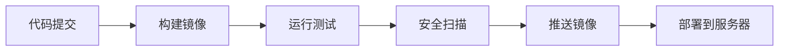

# 项目1: CI/CD 流水线搭建

> 难度: ⭐ 入门 | 预计时间: 3-4 小时

---

## 项目概述

构建一个完整的 CI/CD 流水线，实现代码提交后的自动构建、测试和部署。



---

## 学习目标

- 理解 CI/CD 核心概念
- 掌握 GitHub Actions 配置
- 实现自动化测试集成
- 配置容器镜像构建
- 实现自动部署

---

## 项目结构

```
ci-cd-demo/
├── .github/
│   └── workflows/
│       ├── ci.yml          # 持续集成
│       └── cd.yml          # 持续部署
├── src/
│   └── app.py              # 示例应用
├── tests/
│   └── test_app.py         # 测试文件
├── Dockerfile              # 容器配置
├── docker-compose.yml      # 本地开发
└── README.md
```

---

## 实施步骤

### 步骤1: 创建示例应用

```python
# src/app.py
from flask import Flask, jsonify

app = Flask(__name__)

@app.route('/')
def hello():
    return jsonify({
        'message': 'Hello, CI/CD!',
        'version': '1.0.0'
    })

@app.route('/health')
def health():
    return jsonify({'status': 'healthy'})

if __name__ == '__main__':
    app.run(host='0.0.0.0', port=5000)
```

```python
# tests/test_app.py
import pytest
from src.app import app

@pytest.fixture
def client():
    app.config['TESTING'] = True
    with app.test_client() as client:
        yield client

def test_hello_endpoint(client):
    response = client.get('/')
    assert response.status_code == 200
    data = response.get_json()
    assert data['message'] == 'Hello, CI/CD!'

def test_health_endpoint(client):
    response = client.get('/health')
    assert response.status_code == 200
    data = response.get_json()
    assert data['status'] == 'healthy'
```

### 步骤2: 创建 Dockerfile

```dockerfile
FROM python:3.11-slim

WORKDIR /app

# 安装依赖
COPY requirements.txt .
RUN pip install --no-cache-dir -r requirements.txt

# 复制应用代码
COPY src/ ./src/

# 非 root 用户
RUN useradd -m appuser && chown -R appuser:appuser /app
USER appuser

EXPOSE 5000

HEALTHCHECK --interval=30s --timeout=3s \
    CMD curl -f http://localhost:5000/health || exit 1

CMD ["python", "-m", "src.app"]
```

### 步骤3: 配置 CI 流水线

```yaml
# .github/workflows/ci.yml
name: Continuous Integration

on:
  push:
    branches: [main, develop]
  pull_request:
    branches: [main]

jobs:
  test:
    runs-on: ubuntu-latest
    strategy:
      matrix:
        python-version: ['3.10', '3.11']

    steps:
    - uses: actions/checkout@v4

    - name: Set up Python ${{ matrix.python-version }}
      uses: actions/setup-python@v5
      with:
        python-version: ${{ matrix.python-version }}

    - name: Cache pip dependencies
      uses: actions/cache@v3
      with:
        path: ~/.cache/pip
        key: ${{ runner.os }}-pip-${{ hashFiles('**/requirements.txt') }}

    - name: Install dependencies
      run: |
        python -m pip install --upgrade pip
        pip install -r requirements.txt
        pip install pytest pytest-cov flake8

    - name: Lint with flake8
      run: |
        flake8 src tests --count --select=E9,F63,F7,F82 --show-source --statistics
        flake8 src tests --count --exit-zero --max-complexity=10 --max-line-length=127 --statistics

    - name: Test with pytest
      run: |
        pytest --cov=src --cov-report=xml --cov-report=html

    - name: Upload coverage to Codecov
      uses: codecov/codecov-action@v3
      with:
        file: ./coverage.xml
        flags: unittests
        name: codecov-umbrella

  build:
    needs: test
    runs-on: ubuntu-latest
    steps:
    - uses: actions/checkout@v4

    - name: Set up Docker Buildx
      uses: docker/setup-buildx-action@v3

    - name: Build Docker image
      run: |
        docker build -t ci-cd-demo:${{ github.sha }} .
        docker tag ci-cd-demo:${{ github.sha }} ci-cd-demo:latest

    - name: Test Docker image
      run: |
        docker run -d -p 5000:5000 --name test-container ci-cd-demo:${{ github.sha }}
        sleep 5
        curl -f http://localhost:5000/health || exit 1
        docker stop test-container
        docker rm test-container

    - name: Run Trivy vulnerability scanner
      uses: aquasecurity/trivy-action@master
      with:
        image-ref: 'ci-cd-demo:${{ github.sha }}'
        format: 'table'
        exit-code: '1'
        ignore-unfixed: true
        vuln-type: 'os,library'
        severity: 'CRITICAL,HIGH'
```

### 步骤4: 配置 CD 流水线

```yaml
# .github/workflows/cd.yml
name: Continuous Deployment

on:
  push:
    tags:
      - 'v*'

env:
  REGISTRY: ghcr.io
  IMAGE_NAME: ${{ github.repository }}

jobs:
  build-and-push:
    runs-on: ubuntu-latest
    permissions:
      contents: read
      packages: write

    steps:
    - name: Checkout repository
      uses: actions/checkout@v4

    - name: Set up Docker Buildx
      uses: docker/setup-buildx-action@v3

    - name: Log in to Container Registry
      uses: docker/login-action@v3
      with:
        registry: ${{ env.REGISTRY }}
        username: ${{ github.actor }}
        password: ${{ secrets.GITHUB_TOKEN }}

    - name: Extract metadata
      id: meta
      uses: docker/metadata-action@v5
      with:
        images: ${{ env.REGISTRY }}/${{ env.IMAGE_NAME }}
        tags: |
          type=ref,event=tag
          type=semver,pattern={{version}}
          type=semver,pattern={{major}}.{{minor}}

    - name: Build and push Docker image
      uses: docker/build-push-action@v5
      with:
        context: .
        push: true
        tags: ${{ steps.meta.outputs.tags }}
        labels: ${{ steps.meta.outputs.labels }}
        cache-from: type=gha
        cache-to: type=gha,mode=max

  deploy:
    needs: build-and-push
    runs-on: ubuntu-latest
    environment: production

    steps:
    - name: Deploy to server
      uses: appleboy/ssh-action@master
      with:
        host: ${{ secrets.SERVER_HOST }}
        username: ${{ secrets.SERVER_USER }}
        key: ${{ secrets.SERVER_SSH_KEY }}
        script: |
          cd /opt/ci-cd-demo
          docker pull ${{ env.REGISTRY }}/${{ env.IMAGE_NAME }}:${{ github.ref_name }}
          docker-compose down
          docker-compose up -d
          docker system prune -f
```

### 步骤5: 本地开发配置

```yaml
# docker-compose.yml
version: '3.8'

services:
  app:
    build: .
    ports:
      - "5000:5000"
    volumes:
      - ./src:/app/src
    environment:
      - FLASK_ENV=development
      - FLASK_DEBUG=1
    command: python -m src.app

  test:
    build: .
    volumes:
      - .:/app
    command: pytest -v
```

---

## 验证步骤

1. **提交代码触发 CI**:
   ```bash
   git add .
   git commit -m "Initial CI/CD setup"
   git push origin main
   ```

2. **查看 GitHub Actions 运行状态**

3. **打标签触发部署**:
   ```bash
   git tag -a v1.0.0 -m "Release version 1.0.0"
   git push origin v1.0.0
   ```

---

## 扩展挑战

1. **添加更多测试**: 集成测试、端到端测试
2. **多环境部署**: staging、production
3. **添加通知**: Slack、邮件通知
4. **蓝绿部署**: 实现零停机部署

---

## 参考文档

- [GitHub Actions 文档](https://docs.github.com/en/actions)
- [Docker 最佳实践](https://docs.docker.com/develop/dev-best-practices/)
