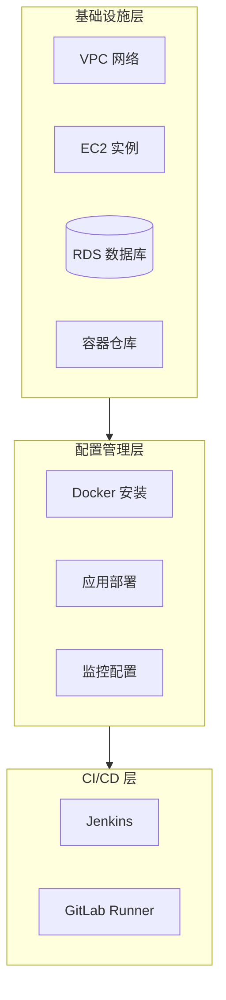

# 项目2: DevOps 自动化平台

> 难度: ⭐⭐ 进阶 | 预计时间: 6-8 小时

---

## 项目概述

使用 Terraform 和 Ansible 构建完整的 DevOps 自动化平台，实现基础设施即代码和配置管理。



---

## 学习目标

- 使用 Terraform 管理 AWS 基础设施
- 使用 Ansible 进行服务器配置
- 实现基础设施即代码工作流
- 构建完整的 DevOps 工具链

---

## 项目结构

```
devops-automation/
├── terraform/
│   ├── main.tf
│   ├── variables.tf
│   ├── outputs.tf
│   └── modules/
│       ├── vpc/
│       ├── ec2/
│       └── rds/
├── ansible/
│   ├── inventory/
│   ├── playbook.yml
│   └── roles/
│       ├── docker/
│       ├── monitoring/
│       └── app/
├── scripts/
│   ├── init.sh
│   └── deploy.sh
└── README.md
```

---

## 实施步骤

### 步骤1: Terraform 基础设施

```hcl
# terraform/main.tf
terraform {
  required_version = ">= 1.0"
  required_providers {
    aws = {
      source  = "hashicorp/aws"
      version = "~> 5.0"
    }
  }
  backend "s3" {
    bucket = "my-terraform-state"
    key    = "devops-automation/terraform.tfstate"
    region = "us-east-1"
  }
}

provider "aws" {
  region = var.region
}

# VPC Module
module "vpc" {
  source = "terraform-aws-modules/vpc/aws"

  name = "devops-vpc"
  cidr = "10.0.0.0/16"

  azs             = ["${var.region}a", "${var.region}b"]
  private_subnets = ["10.0.1.0/24", "10.0.2.0/24"]
  public_subnets  = ["10.0.101.0/24", "10.0.102.0/24"]

  enable_nat_gateway = true
  enable_vpn_gateway = false

  tags = {
    Environment = var.environment
    Project     = "devops-automation"
  }
}

# EC2 Instances for DevOps Tools
module "devops_server" {
  source  = "terraform-aws-modules/ec2-instance/aws"

  name = "devops-server"

  instance_type          = "t3.medium"
  key_name               = var.key_name
  monitoring             = true
  vpc_security_group_ids = [aws_security_group.devops.id]
  subnet_id              = module.vpc.public_subnets[0]

  user_data = templatefile("${path.module}/templates/init.sh", {
    ansible_user = "ubuntu"
  })

  tags = {
    Environment = var.environment
    Role        = "devops"
  }
}

# Security Group
resource "aws_security_group" "devops" {
  name_prefix = "devops-"
  vpc_id      = module.vpc.vpc_id

  ingress {
    from_port   = 22
    to_port     = 22
    protocol    = "tcp"
    cidr_blocks = [var.allowed_ssh_cidr]
  }

  ingress {
    from_port   = 8080
    to_port     = 8080
    protocol    = "tcp"
    cidr_blocks = ["0.0.0.0/0"]
  }

  ingress {
    from_port   = 9090
    to_port     = 9090
    protocol    = "tcp"
    cidr_blocks = ["0.0.0.0/0"]
  }

  egress {
    from_port   = 0
    to_port     = 0
    protocol    = "-1"
    cidr_blocks = ["0.0.0.0/0"]
  }
}

# ECR Repository
resource "aws_ecr_repository" "app" {
  name                 = "devops-app"
  image_tag_mutability = "MUTABLE"

  image_scanning_configuration {
    scan_on_push = true
  }
}

# Outputs
output "devops_server_ip" {
  value = module.devops_server.public_ip
}

output "ecr_repository_url" {
  value = aws_ecr_repository.app.repository_url
}
```

```hcl
# terraform/variables.tf
variable "region" {
  description = "AWS region"
  type        = string
  default     = "us-east-1"
}

variable "environment" {
  description = "Environment name"
  type        = string
  default     = "dev"
}

variable "key_name" {
  description = "EC2 key pair name"
  type        = string
}

variable "allowed_ssh_cidr" {
  description = "CIDR block allowed for SSH"
  type        = string
  default     = "0.0.0.0/0"
}
```

### 步骤2: Ansible 配置管理

```yaml
# ansible/playbook.yml
---
- name: Setup DevOps Platform
  hosts: devops_servers
  become: yes
  vars:
    docker_users:
      - ubuntu
    app_name: devops-demo
    app_port: 8080

  roles:
    - common
    - docker
    - monitoring
    - app
```

```yaml
# ansible/roles/docker/tasks/main.yml
---
- name: Install Docker dependencies
  apt:
    name:
      - apt-transport-https
      - ca-certificates
      - curl
      - gnupg
      - lsb-release
    state: present
    update_cache: yes

- name: Add Docker GPG key
  apt_key:
    url: https://download.docker.com/linux/ubuntu/gpg
    state: present

- name: Add Docker repository
  apt_repository:
    repo: "deb [arch=amd64] https://download.docker.com/linux/ubuntu {{ ansible_distribution_release }} stable"
    state: present

- name: Install Docker
  apt:
    name:
      - docker-ce
      - docker-ce-cli
      - containerd.io
      - docker-compose-plugin
    state: present
    update_cache: yes

- name: Add users to docker group
  user:
    name: "{{ item }}"
    groups: docker
    append: yes
  loop: "{{ docker_users }}"

- name: Enable Docker service
  systemd:
    name: docker
    enabled: yes
    state: started
```

```yaml
# ansible/roles/monitoring/tasks/main.yml
---
- name: Create monitoring directory
  file:
    path: /opt/monitoring
    state: directory
    mode: '0755'

- name: Copy Docker Compose for monitoring
  template:
    src: docker-compose.monitoring.yml.j2
    dest: /opt/monitoring/docker-compose.yml

- name: Start monitoring stack
  command: docker compose up -d
  args:
    chdir: /opt/monitoring
```

```yaml
# ansible/roles/app/tasks/main.yml
---
- name: Create app directory
  file:
    path: /opt/{{ app_name }}
    state: directory
    mode: '0755'

- name: Copy Docker Compose
  template:
    src: docker-compose.app.yml.j2
    dest: /opt/{{ app_name }}/docker-compose.yml

- name: Create systemd service
  template:
    src: app.service.j2
    dest: /etc/systemd/system/{{ app_name }}.service

- name: Enable and start app service
  systemd:
    name: "{{ app_name }}"
    enabled: yes
    state: started
    daemon_reload: yes
```

### 步骤3: 监控配置

```yaml
# ansible/roles/monitoring/templates/docker-compose.monitoring.yml.j2
version: '3.8'

services:
  prometheus:
    image: prom/prometheus:latest
    ports:
      - "9090:9090"
    volumes:
      - ./prometheus.yml:/etc/prometheus/prometheus.yml
      - prometheus_data:/prometheus
    command:
      - '--config.file=/etc/prometheus/prometheus.yml'
      - '--storage.tsdb.path=/prometheus'

  grafana:
    image: grafana/grafana:latest
    ports:
      - "3000:3000"
    volumes:
      - grafana_data:/var/lib/grafana
    environment:
      - GF_SECURITY_ADMIN_PASSWORD=admin123

volumes:
  prometheus_data:
  grafana_data:
```

```yaml
# ansible/roles/monitoring/files/prometheus.yml
global:
  scrape_interval: 15s

scrape_configs:
  - job_name: 'prometheus'
    static_configs:
      - targets: ['localhost:9090']

  - job_name: 'node-exporter'
    static_configs:
      - targets: ['node-exporter:9100']

  - job_name: 'app'
    static_configs:
      - targets: ['app:8080']
```

### 步骤4: 部署脚本

```bash
#!/bin/bash
# scripts/deploy.sh

set -e

ENVIRONMENT=${1:-dev}
ACTION=${2:-apply}

echo "🚀 Deploying to $ENVIRONMENT..."

# Terraform
cd terraform
terraform init
terraform workspace select $ENVIRONMENT || terraform workspace new $ENVIRONMENT

if [ "$ACTION" == "apply" ]; then
    terraform apply -auto-approve
elif [ "$ACTION" == "destroy" ]; then
    terraform destroy -auto-approve
    exit 0
fi

# Get outputs
DEVOPS_IP=$(terraform output -raw devops_server_ip)
cd ..

echo "📦 Waiting for server to be ready..."
sleep 30

# Ansible
echo "🔧 Configuring server with Ansible..."
cd ansible

# Update inventory
cat > inventory/hosts << EOF
[devops_servers]
$DEVOPS_IP ansible_user=ubuntu ansible_ssh_private_key_file=~/.ssh/devops.pem
EOF

# Run playbook
ansible-playbook -i inventory/hosts playbook.yml

echo "✅ Deployment complete!"
echo "DevOps Server: http://$DEVOPS_IP:8080"
echo "Grafana: http://$DEVOPS_IP:3000"
echo "Prometheus: http://$DEVOPS_IP:9090"
```

---

## 使用指南

```bash
# 初始化项目
git clone <repo>
cd devops-automation

# 配置变量
cp terraform/terraform.tfvars.example terraform/terraform.tfvars
# 编辑 terraform.tfvars

# 部署
cd scripts
./deploy.sh dev apply

# 销毁
./deploy.sh dev destroy
```

---

## 扩展挑战

1. **添加更多 AWS 服务**: S3、CloudFront、ElastiCache
2. **实现蓝绿部署**: 使用 Terraform 工作区
3. **添加 Vault**: 敏感数据管理
4. **集成 CI/CD**: GitHub Actions 触发部署

---

## 参考文档

- [Terraform AWS Provider](https://registry.terraform.io/providers/hashicorp/aws/latest/docs)
- [Ansible Documentation](https://docs.ansible.com/)
