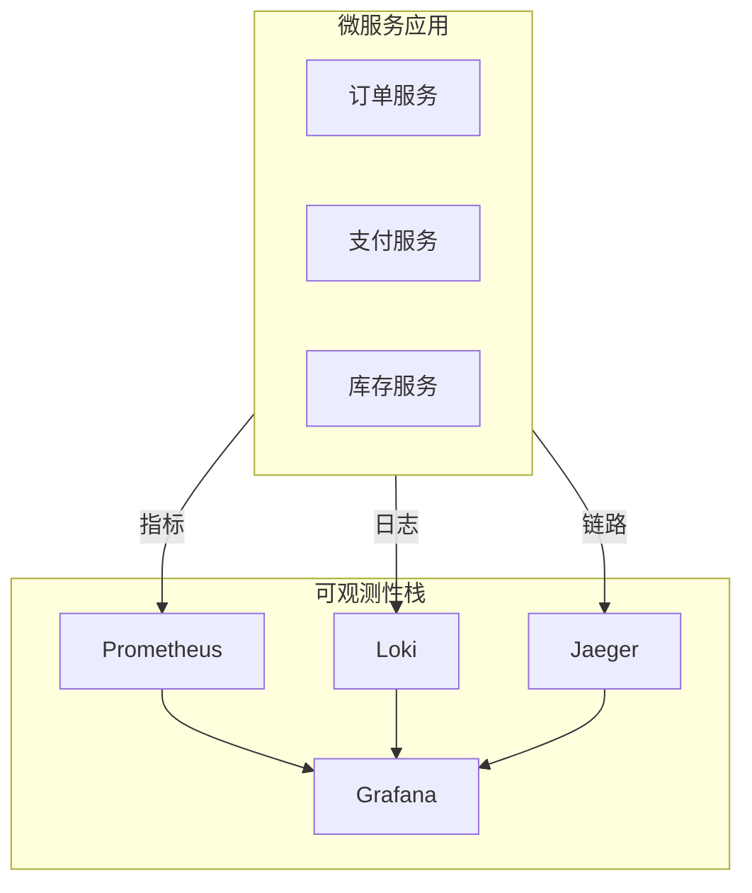
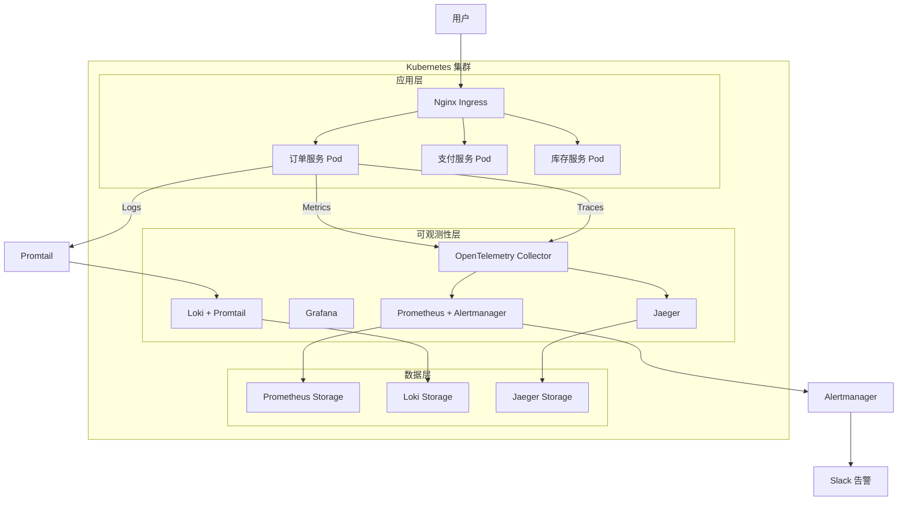

# 项目3: 微服务可观测平台

> 难度: ⭐⭐⭐ 高级 | 预计时间: 8-10 小时

---

## 项目概述

在 Kubernetes 上构建完整的微服务可观测平台，集成监控、日志和链路追踪。



---

## 学习目标

- 部署生产级 Kubernetes 集群
- 构建完整的可观测性体系
- 实现分布式链路追踪
- 配置智能告警

---

## 架构图



---

## 实施步骤

### 步骤1: Kubernetes 基础部署

```yaml
# k8s/namespaces.yaml
apiVersion: v1
kind: Namespace
metadata:
  name: microservices
  
---
apiVersion: v1
kind: Namespace
metadata:
  name: observability
```

```yaml
# k8s/apps/order-service.yaml
apiVersion: apps/v1
kind: Deployment
metadata:
  name: order-service
  namespace: microservices
spec:
  replicas: 3
  selector:
    matchLabels:
      app: order-service
  template:
    metadata:
      labels:
        app: order-service
      annotations:
        prometheus.io/scrape: "true"
        prometheus.io/port: "8080"
        prometheus.io/path: "/metrics"
    spec:
      containers:
      - name: order-service
        image: microservices/order-service:v1
        ports:
        - containerPort: 8080
          name: http
        env:
        - name: OTEL_EXPORTER_OTLP_ENDPOINT
          value: "http://otel-collector.observability:4317"
        - name: OTEL_SERVICE_NAME
          value: "order-service"
        resources:
          requests:
            memory: "128Mi"
            cpu: "100m"
          limits:
            memory: "256Mi"
            cpu: "200m"
---
apiVersion: v1
kind: Service
metadata:
  name: order-service
  namespace: microservices
spec:
  selector:
    app: order-service
  ports:
  - port: 80
    targetPort: 8080
```

### 步骤2: Prometheus 部署

```yaml
# observability/prometheus.yaml
apiVersion: v1
kind: ConfigMap
metadata:
  name: prometheus-config
  namespace: observability
data:
  prometheus.yml: |
    global:
      scrape_interval: 15s
      evaluation_interval: 15s
    
    alerting:
      alertmanagers:
        - static_configs:
            - targets: ['alertmanager:9093']
    
    rule_files:
      - /etc/prometheus/rules/*.yml
    
    scrape_configs:
      - job_name: 'prometheus'
        static_configs:
          - targets: ['localhost:9090']
      
      - job_name: 'kubernetes-pods'
        kubernetes_sd_configs:
          - role: pod
            namespaces:
              names:
                - microservices
        relabel_configs:
          - source_labels: [__meta_kubernetes_pod_annotation_prometheus_io_scrape]
            action: keep
            regex: true
          - source_labels: [__meta_kubernetes_pod_annotation_prometheus_io_path]
            action: replace
            target_label: __metrics_path__
            regex: (.+)
          - source_labels: [__address__, __meta_kubernetes_pod_annotation_prometheus_io_port]
            action: replace
            regex: ([^:]+)(?::\d+)?;(\d+)
            replacement: $1:$2
            target_label: __address__
---
apiVersion: v1
kind: ConfigMap
metadata:
  name: prometheus-rules
  namespace: observability
data:
  rules.yml: |
    groups:
      - name: microservices
        rules:
          - alert: HighErrorRate
            expr: rate(http_requests_total{status=~"5.."}[5m]) > 0.05
            for: 5m
            labels:
              severity: critical
            annotations:
              summary: "High error rate detected"
              
          - alert: HighLatency
            expr: histogram_quantile(0.95, rate(http_request_duration_seconds_bucket[5m])) > 0.5
            for: 5m
            labels:
              severity: warning
            annotations:
              summary: "High latency detected"
              
          - alert: PodRestarting
            expr: rate(kube_pod_container_status_restarts_total[15m]) > 0
            for: 5m
            labels:
              severity: warning
            annotations:
              summary: "Pod is restarting frequently"
```

### 步骤3: Loki 日志系统

```yaml
# observability/loki.yaml
apiVersion: v1
kind: ConfigMap
metadata:
  name: loki-config
  namespace: observability
data:
  local-config.yaml: |
    auth_enabled: false
    server:
      http_listen_port: 3100
    
    common:
      ring:
        instance_addr: 127.0.0.1
        kvstore:
          store: inmemory
      replication_factor: 1
      path_prefix: /tmp/loki
    
    schema_config:
      configs:
        - from: 2020-10-24
          store: boltdb-shipper
          object_store: filesystem
          schema: v11
          index:
            prefix: index_
            period: 24h
    
    storage_config:
      boltdb_shipper:
        active_index_directory: /tmp/loki/boltdb-shipper-active
        cache_location: /tmp/loki/boltdb-shipper-cache
        cache_ttl: 24h
        shared_store: filesystem
      filesystem:
        directory: /tmp/loki/chunks
---
apiVersion: apps/v1
kind: DaemonSet
metadata:
  name: promtail
  namespace: observability
spec:
  selector:
    matchLabels:
      app: promtail
  template:
    metadata:
      labels:
        app: promtail
    spec:
      containers:
      - name: promtail
        image: grafana/promtail:latest
        args:
        - -config.file=/etc/promtail/config.yml
        volumeMounts:
        - name: config
          mountPath: /etc/promtail
        - name: varlog
          mountPath: /var/log
        - name: varlibdockercontainers
          mountPath: /var/lib/docker/containers
          readOnly: true
      volumes:
      - name: config
        configMap:
          name: promtail-config
      - name: varlog
        hostPath:
          path: /var/log
      - name: varlibdockercontainers
        hostPath:
          path: /var/lib/docker/containers
```

### 步骤4: Jaeger 链路追踪

```yaml
# observability/jaeger.yaml
apiVersion: v1
kind: ConfigMap
metadata:
  name: jaeger-config
  namespace: observability
data:
  collector.yaml: |
    receivers:
      otlp:
        protocols:
          grpc:
            endpoint: 0.0.0.0:4317
          http:
            endpoint: 0.0.0.0:4318
    exporters:
      jaeger:
        endpoint: jaeger-collector:14250
        tls:
          insecure: true
    service:
      pipelines:
        traces:
          receivers: [otlp]
          exporters: [jaeger]
---
apiVersion: apps/v1
kind: Deployment
metadata:
  name: jaeger
  namespace: observability
spec:
  replicas: 1
  selector:
    matchLabels:
      app: jaeger
  template:
    metadata:
      labels:
        app: jaeger
    spec:
      containers:
      - name: jaeger
        image: jaegertracing/all-in-one:latest
        ports:
        - containerPort: 16686  # UI
        - containerPort: 14268  # Collector
        - containerPort: 4317   # OTLP gRPC
        env:
        - name: COLLECTOR_OTLP_ENABLED
          value: "true"
---
apiVersion: v1
kind: Service
metadata:
  name: jaeger-query
  namespace: observability
spec:
  selector:
    app: jaeger
  ports:
  - port: 80
    targetPort: 16686
```

### 步骤5: Grafana 仪表盘

```yaml
# observability/grafana.yaml
apiVersion: v1
kind: ConfigMap
metadata:
  name: grafana-dashboards
  namespace: observability
data:
  microservices-dashboard.json: |
    {
      "dashboard": {
        "title": "Microservices Overview",
        "panels": [
          {
            "title": "Request Rate",
            "type": "stat",
            "targets": [
              {
                "expr": "sum(rate(http_requests_total[5m]))"
              }
            ]
          },
          {
            "title": "Error Rate",
            "type": "stat",
            "targets": [
              {
                "expr": "sum(rate(http_requests_total{status=~\"5..\"}[5m]))"
              }
            ]
          },
          {
            "title": "P95 Latency",
            "type": "graph",
            "targets": [
              {
                "expr": "histogram_quantile(0.95, sum(rate(http_request_duration_seconds_bucket[5m])) by (le, service))"
              }
            ]
          },
          {
            "title": "Pod CPU Usage",
            "type": "graph",
            "targets": [
              {
                "expr": "sum(rate(container_cpu_usage_seconds_total[5m])) by (pod)"
              }
            ]
          }
        ]
      }
    }
```

### 步骤6: OpenTelemetry 集成

```yaml
# observability/otel-collector.yaml
apiVersion: v1
kind: ConfigMap
metadata:
  name: otel-collector-config
  namespace: observability
data:
  otel-collector-config.yaml: |
    receivers:
      otlp:
        protocols:
          grpc:
            endpoint: 0.0.0.0:4317
          http:
            endpoint: 0.0.0.0:4318
    
    processors:
      batch:
        timeout: 1s
        send_batch_size: 1024
      
      resource:
        attributes:
          - key: environment
            value: production
            action: upsert
    
    exporters:
      prometheusremotewrite:
        endpoint: http://prometheus:9090/api/v1/write
      
      loki:
        endpoint: http://loki:3100/loki/api/v1/push
      
      jaeger:
        endpoint: jaeger-collector:14250
        tls:
          insecure: true
      
      logging:
        loglevel: debug
    
    service:
      pipelines:
        metrics:
          receivers: [otlp]
          processors: [batch, resource]
          exporters: [prometheusremotewrite]
        
        logs:
          receivers: [otlp]
          processors: [batch, resource]
          exporters: [loki]
        
        traces:
          receivers: [otlp]
          processors: [batch, resource]
          exporters: [jaeger]
```

### 步骤7: 应用埋点示例

```python
# 应用代码集成 OpenTelemetry
from flask import Flask, request
from opentelemetry import trace, metrics
from opentelemetry.exporter.otlp.proto.grpc.trace_exporter import OTLPSpanExporter
from opentelemetry.exporter.otlp.proto.grpc.metric_exporter import OTLPMetricExporter
from opentelemetry.sdk.trace import TracerProvider
from opentelemetry.sdk.trace.export import BatchSpanProcessor
from opentelemetry.sdk.metrics import MeterProvider
from opentelemetry.sdk.metrics.export import PeriodicExportingMetricReader
from opentelemetry.instrumentation.flask import FlaskInstrumentor
from opentelemetry.instrumentation.requests import RequestsInstrumentor

# 初始化追踪
trace.set_tracer_provider(TracerProvider())
otlp_trace_exporter = OTLPSpanExporter(endpoint="otel-collector.observability:4317", insecure=True)
trace.get_tracer_provider().add_span_processor(BatchSpanProcessor(otlp_trace_exporter))

# 初始化指标
metric_reader = PeriodicExportingMetricReader(OTLPMetricExporter(endpoint="otel-collector.observability:4317", insecure=True))
metrics.set_meter_provider(MeterProvider(metric_readers=[metric_reader]))

app = Flask(__name__)
FlaskInstrumentor().instrument_app(app)
RequestsInstrumentor().instrument()

tracer = trace.get_tracer(__name__)
meter = metrics.get_meter(__name__)

# 自定义指标
request_counter = meter.create_counter(
    "http_requests_total",
    description="Total HTTP requests"
)

@app.route('/order', methods=['POST'])
def create_order():
    with tracer.start_as_current_span("create_order") as span:
        # 添加自定义属性
        span.set_attribute("order.type", "standard")
        
        # 业务逻辑
        order_data = request.json
        span.set_attribute("order.id", order_data.get('id'))
        
        # 记录指标
        request_counter.add(1, {"endpoint": "/order", "method": "POST"})
        
        return {"status": "created", "order_id": order_data.get('id')}

@app.route('/health')
def health():
    return {"status": "healthy"}
```

---

## 部署脚本

```bash
#!/bin/bash
# deploy.sh

set -e

echo "🚀 Deploying Microservices Observability Platform..."

# 创建命名空间
kubectl apply -f k8s/namespaces.yaml

# 部署应用
echo "📦 Deploying microservices..."
kubectl apply -f k8s/apps/

# 部署可观测性栈
echo "📊 Deploying observability stack..."
kubectl apply -f observability/

# 等待部署完成
echo "⏳ Waiting for deployments..."
kubectl wait --for=condition=available --timeout=300s deployment -l app=order-service -n microservices

# 获取访问地址
echo "✅ Deployment complete!"
echo ""
echo "📊 Grafana: http://$(kubectl get ingress grafana -n observability -o jsonpath='{.status.loadBalancer.ingress[0].ip}')"
echo "📈 Prometheus: http://$(kubectl get ingress prometheus -n observability -o jsonpath='{.status.loadBalancer.ingress[0].ip}')"
echo "🔍 Jaeger: http://$(kubectl get ingress jaeger -n observability -o jsonpath='{.status.loadBalancer.ingress[0].ip}')"
```

---

## 验证步骤

1. **部署应用**:
   ```bash
   ./deploy.sh
   ```

2. **生成负载**:
   ```bash
   kubectl run load-generator --image=busybox -n microservices -- /bin/sh -c "while true; do wget -q -O- http://order-service/order; done"
   ```

3. **查看监控**:
   - 打开 Grafana 仪表盘
   - 检查 Prometheus 指标
   - 查看 Jaeger 链路

---

## 扩展挑战

1. **添加告警**: 配置 PagerDuty/OpsGenie 集成
2. **日志聚合**: 集成 AWS CloudWatch Logs
3. **自定义指标**: 业务指标埋点
4. **混沌工程**: 使用 Chaos Mesh 测试可观测性

---

## 参考文档

- [OpenTelemetry 文档](https://opentelemetry.io/docs/)
- [Grafana 文档](https://grafana.com/docs/)
- [Jaeger 文档](https://www.jaegertracing.io/docs/)
